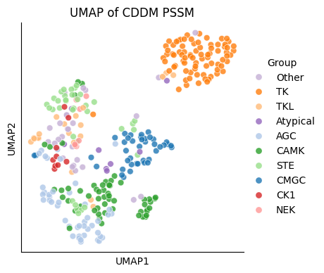

# CDDM umap


<!-- WARNING: THIS FILE WAS AUTOGENERATED! DO NOT EDIT! -->

``` python
import pandas as pd
from katlas.data import *
from katlas.plot import *
from matplotlib import pyplot as plt
```

``` python
df = Data.get_cddm()
```

    ⬇️ Downloading katlas_dataset.zip ...

    Downloading...
    From (original): https://drive.google.com/uc?id=17wIl0DbdoHV036Z3xgaT_0H3LlM_W47l
    From (redirected): https://drive.google.com/uc?id=17wIl0DbdoHV036Z3xgaT_0H3LlM_W47l&confirm=t&uuid=d94f1f27-e902-4dde-8b31-470044fe39ec
    To: /home/sky1ove/git/katlas-raw/nbs/katlas_datasets.zip
    100%|██████████████████████████████████████████████████████████████████████| 209M/209M [00:05<00:00, 35.2MB/s]

    📂 Extracting to /tmp/katlas_dataset ...
    🧹 Removing zip file: katlas_datasets.zip
    ✅ Done! Extracted dataset is at: /tmp/katlas_dataset

``` python
info = Data.get_kinase_info()
```

``` python
info = info[info.pseudo=='0'].copy()
```

``` python
hue = info.set_index('kinase')['modi_group']
```

``` python
embed_df= reduce_feature(df,method='umap',complexity=6,min_dist=0.5)
```

    /home/sky1ove/git/katlas/.venv/lib/python3.11/site-packages/logomaker/../umap/umap_.py:1952: UserWarning: n_jobs value 1 overridden to 1 by setting random_state. Use no seed for parallelism.
      warn(

``` python
plot_2d(embed_df,
        s=40,
        height=4,
        hue=hue,
        legend=True,
        palette=group_color,
        legend_title='Group')
plt.title('UMAP of CDDM PSSM')
save_svg('fig/CDDM_umap.svg')
```

    Text(0.5, 1.0, 'UMAP of CDDM PSSM')


