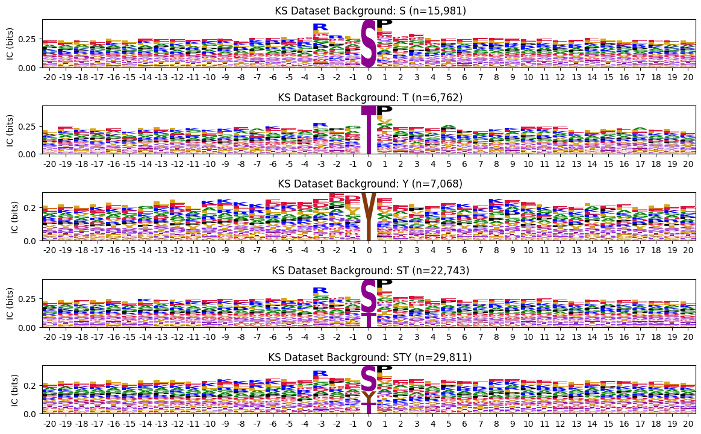
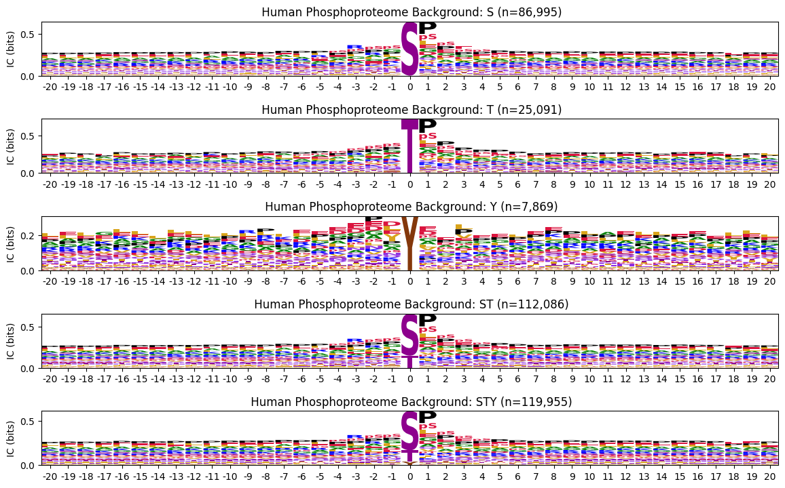

# Background frequencies


<!-- WARNING: THIS FILE WAS AUTOGENERATED! DO NOT EDIT! -->

``` python
from katlas.core import *
import pandas as pd
```

``` python
acceptors = ['S','T','Y','ST','STY']
```

``` python
df = Data.get_ks_unique()
```

``` python
df.head()
```

<div>
<style scoped>
    .dataframe tbody tr th:only-of-type {
        vertical-align: middle;
    }
&#10;    .dataframe tbody tr th {
        vertical-align: top;
    }
&#10;    .dataframe thead th {
        text-align: right;
    }
</style>

<table class="dataframe" data-quarto-postprocess="true" data-border="1">
<thead>
<tr style="text-align: right;">
<th data-quarto-table-cell-role="th"></th>
<th data-quarto-table-cell-role="th">sub_site</th>
<th data-quarto-table-cell-role="th">num_kin</th>
<th data-quarto-table-cell-role="th">bin</th>
<th data-quarto-table-cell-role="th">sub_genes</th>
<th data-quarto-table-cell-role="th">site_seq</th>
<th data-quarto-table-cell-role="th">source_combine</th>
<th data-quarto-table-cell-role="th">acceptor</th>
<th data-quarto-table-cell-role="th">O00141_SGK1</th>
<th data-quarto-table-cell-role="th">O00238_BMPR1B</th>
<th data-quarto-table-cell-role="th">O00311_CDC7</th>
<th data-quarto-table-cell-role="th">...</th>
<th data-quarto-table-cell-role="th">Q9Y2K2_SIK3</th>
<th data-quarto-table-cell-role="th">Q9Y2U5_MAP3K2</th>
<th data-quarto-table-cell-role="th">Q9Y3S1_WNK2</th>
<th data-quarto-table-cell-role="th">Q9Y463_DYRK1B</th>
<th data-quarto-table-cell-role="th">Q9Y4K4_MAP4K5</th>
<th data-quarto-table-cell-role="th">Q9Y572_RIPK3</th>
<th data-quarto-table-cell-role="th">Q9Y5S2_CDC42BPB</th>
<th data-quarto-table-cell-role="th">Q9Y6E0_STK24</th>
<th data-quarto-table-cell-role="th">Q9Y6M4_CSNK1G3</th>
<th data-quarto-table-cell-role="th">Q9Y6R4_MAP3K4</th>
</tr>
</thead>
<tbody>
<tr>
<td data-quarto-table-cell-role="th">0</td>
<td>A0A2R8Y4L2_S158</td>
<td>1</td>
<td>1</td>
<td>HNRNPA1L3 HNRNPA1P48</td>
<td>TDRGSGKKRGFAFVTFDDHDsVDKIVIQKYHTVNGHNCEVR</td>
<td>Sugiyama</td>
<td>S</td>
<td>0</td>
<td>0</td>
<td>0</td>
<td>...</td>
<td>0</td>
<td>0</td>
<td>0</td>
<td>0</td>
<td>0</td>
<td>0</td>
<td>0</td>
<td>0</td>
<td>0</td>
<td>0</td>
</tr>
<tr>
<td data-quarto-table-cell-role="th">1</td>
<td>A0A2R8Y4L2_S22</td>
<td>3</td>
<td>2~10</td>
<td>HNRNPA1L3 HNRNPA1P48</td>
<td>SKSEsPKEPEQLRKLFIGGLsFEtTDESLRSHFEQWGTLTD</td>
<td>Sugiyama</td>
<td>S</td>
<td>0</td>
<td>0</td>
<td>0</td>
<td>...</td>
<td>0</td>
<td>0</td>
<td>0</td>
<td>0</td>
<td>0</td>
<td>0</td>
<td>0</td>
<td>0</td>
<td>0</td>
<td>0</td>
</tr>
<tr>
<td data-quarto-table-cell-role="th">2</td>
<td>A0A2R8Y4L2_S6</td>
<td>3</td>
<td>2~10</td>
<td>HNRNPA1L3 HNRNPA1P48</td>
<td>_______________MSKSEsPKEPEQLRKLFIGGLsFEtT</td>
<td>Sugiyama</td>
<td>S</td>
<td>0</td>
<td>0</td>
<td>0</td>
<td>...</td>
<td>0</td>
<td>0</td>
<td>0</td>
<td>0</td>
<td>0</td>
<td>0</td>
<td>0</td>
<td>0</td>
<td>0</td>
<td>0</td>
</tr>
<tr>
<td data-quarto-table-cell-role="th">3</td>
<td>A0A2R8Y4L2_S95</td>
<td>65</td>
<td>11~100</td>
<td>HNRNPA1L3 HNRNPA1P48</td>
<td>RPHKVDGRVVEPKRAVSREDsQRPDAHLTVKKIFVGGIKED</td>
<td>Sugiyama</td>
<td>S</td>
<td>0</td>
<td>1</td>
<td>0</td>
<td>...</td>
<td>0</td>
<td>1</td>
<td>0</td>
<td>0</td>
<td>1</td>
<td>0</td>
<td>0</td>
<td>0</td>
<td>0</td>
<td>0</td>
</tr>
<tr>
<td data-quarto-table-cell-role="th">4</td>
<td>A0A2R8Y4L2_T25</td>
<td>3</td>
<td>2~10</td>
<td>HNRNPA1L3 HNRNPA1P48</td>
<td>EsPKEPEQLRKLFIGGLsFEtTDESLRSHFEQWGTLTDCVV</td>
<td>Sugiyama</td>
<td>T</td>
<td>0</td>
<td>0</td>
<td>0</td>
<td>...</td>
<td>0</td>
<td>0</td>
<td>0</td>
<td>0</td>
<td>0</td>
<td>0</td>
<td>0</td>
<td>0</td>
<td>0</td>
<td>0</td>
</tr>
</tbody>
</table>

<p>5 rows × 462 columns</p>
</div>

## PSSMs - ks dataset

``` python
def get_bg_dict(df, acceptor, seq_col='site_seq'):
    site = df[df.acceptor.isin(list(acceptor))].copy()
    site_pssm = get_prob(site, seq_col)
    return flatten_pssm(site_pssm, True)
```

``` python
index_names = 'ks_' + pd.Series(acceptors)
```

``` python
bg_pssms = pd.DataFrame([get_bg_dict(df,acceptor) for acceptor in acceptors],index=index_names)
```

``` python
bg_pssms
```

<div>
<style scoped>
    .dataframe tbody tr th:only-of-type {
        vertical-align: middle;
    }
&#10;    .dataframe tbody tr th {
        vertical-align: top;
    }
&#10;    .dataframe thead th {
        text-align: right;
    }
</style>

<table class="dataframe" data-quarto-postprocess="true" data-border="1">
<thead>
<tr style="text-align: right;">
<th data-quarto-table-cell-role="th"></th>
<th data-quarto-table-cell-role="th">-20P</th>
<th data-quarto-table-cell-role="th">-20G</th>
<th data-quarto-table-cell-role="th">-20A</th>
<th data-quarto-table-cell-role="th">-20C</th>
<th data-quarto-table-cell-role="th">-20S</th>
<th data-quarto-table-cell-role="th">-20T</th>
<th data-quarto-table-cell-role="th">-20V</th>
<th data-quarto-table-cell-role="th">-20I</th>
<th data-quarto-table-cell-role="th">-20L</th>
<th data-quarto-table-cell-role="th">-20M</th>
<th data-quarto-table-cell-role="th">...</th>
<th data-quarto-table-cell-role="th">20H</th>
<th data-quarto-table-cell-role="th">20K</th>
<th data-quarto-table-cell-role="th">20R</th>
<th data-quarto-table-cell-role="th">20Q</th>
<th data-quarto-table-cell-role="th">20N</th>
<th data-quarto-table-cell-role="th">20D</th>
<th data-quarto-table-cell-role="th">20E</th>
<th data-quarto-table-cell-role="th">20s</th>
<th data-quarto-table-cell-role="th">20t</th>
<th data-quarto-table-cell-role="th">20y</th>
</tr>
</thead>
<tbody>
<tr>
<td data-quarto-table-cell-role="th">ks_S</td>
<td>0.074296</td>
<td>0.068105</td>
<td>0.075925</td>
<td>0.014664</td>
<td>0.053246</td>
<td>0.038517</td>
<td>0.051290</td>
<td>0.040342</td>
<td>0.078989</td>
<td>0.020269</td>
<td>...</td>
<td>0.021294</td>
<td>0.070330</td>
<td>0.059313</td>
<td>0.044200</td>
<td>0.036273</td>
<td>0.054880</td>
<td>0.077316</td>
<td>0.043461</td>
<td>0.014980</td>
<td>0.006449</td>
</tr>
<tr>
<td data-quarto-table-cell-role="th">ks_T</td>
<td>0.061634</td>
<td>0.065896</td>
<td>0.074266</td>
<td>0.016436</td>
<td>0.043829</td>
<td>0.034394</td>
<td>0.059656</td>
<td>0.040177</td>
<td>0.089484</td>
<td>0.024806</td>
<td>...</td>
<td>0.022394</td>
<td>0.075067</td>
<td>0.060558</td>
<td>0.045261</td>
<td>0.038007</td>
<td>0.058666</td>
<td>0.076644</td>
<td>0.035483</td>
<td>0.019871</td>
<td>0.008989</td>
</tr>
<tr>
<td data-quarto-table-cell-role="th">ks_Y</td>
<td>0.056181</td>
<td>0.072421</td>
<td>0.070666</td>
<td>0.015947</td>
<td>0.044477</td>
<td>0.038771</td>
<td>0.055889</td>
<td>0.045940</td>
<td>0.086320</td>
<td>0.024287</td>
<td>...</td>
<td>0.019500</td>
<td>0.071146</td>
<td>0.057892</td>
<td>0.042505</td>
<td>0.037629</td>
<td>0.056216</td>
<td>0.083181</td>
<td>0.023157</td>
<td>0.012492</td>
<td>0.017367</td>
</tr>
<tr>
<td data-quarto-table-cell-role="th">ks_ST</td>
<td>0.070500</td>
<td>0.067442</td>
<td>0.075428</td>
<td>0.015195</td>
<td>0.050422</td>
<td>0.037280</td>
<td>0.053799</td>
<td>0.040292</td>
<td>0.082136</td>
<td>0.021629</td>
<td>...</td>
<td>0.021622</td>
<td>0.071745</td>
<td>0.059685</td>
<td>0.044517</td>
<td>0.036791</td>
<td>0.056011</td>
<td>0.077115</td>
<td>0.041078</td>
<td>0.016441</td>
<td>0.007207</td>
</tr>
<tr>
<td data-quarto-table-cell-role="th">ks_STY</td>
<td>0.067096</td>
<td>0.068626</td>
<td>0.074296</td>
<td>0.015374</td>
<td>0.049009</td>
<td>0.037635</td>
<td>0.054296</td>
<td>0.041635</td>
<td>0.083130</td>
<td>0.022261</td>
<td>...</td>
<td>0.021121</td>
<td>0.071603</td>
<td>0.059262</td>
<td>0.044041</td>
<td>0.036989</td>
<td>0.056059</td>
<td>0.078548</td>
<td>0.036845</td>
<td>0.015508</td>
<td>0.009607</td>
</tr>
</tbody>
</table>

<p>5 rows × 943 columns</p>
</div>

``` python
index_names_upper = 'ks_' + pd.Series(acceptors) + '_upper'
```

``` python
df['site_seq_upper'] = df['site_seq'].str.upper()
```

``` python
bg_pssms_upper = pd.DataFrame([get_bg_dict(df,acceptor,seq_col='site_seq_upper') for acceptor in acceptors],index=index_names_upper)
```

``` python
bg_pssms = pd.concat([bg_pssms,bg_pssms_upper])
```

``` python
bg_pssms
```

<div>
<style scoped>
    .dataframe tbody tr th:only-of-type {
        vertical-align: middle;
    }
&#10;    .dataframe tbody tr th {
        vertical-align: top;
    }
&#10;    .dataframe thead th {
        text-align: right;
    }
</style>

<table class="dataframe" data-quarto-postprocess="true" data-border="1">
<thead>
<tr style="text-align: right;">
<th data-quarto-table-cell-role="th"></th>
<th data-quarto-table-cell-role="th">-20P</th>
<th data-quarto-table-cell-role="th">-20G</th>
<th data-quarto-table-cell-role="th">-20A</th>
<th data-quarto-table-cell-role="th">-20C</th>
<th data-quarto-table-cell-role="th">-20S</th>
<th data-quarto-table-cell-role="th">-20T</th>
<th data-quarto-table-cell-role="th">-20V</th>
<th data-quarto-table-cell-role="th">-20I</th>
<th data-quarto-table-cell-role="th">-20L</th>
<th data-quarto-table-cell-role="th">-20M</th>
<th data-quarto-table-cell-role="th">...</th>
<th data-quarto-table-cell-role="th">20H</th>
<th data-quarto-table-cell-role="th">20K</th>
<th data-quarto-table-cell-role="th">20R</th>
<th data-quarto-table-cell-role="th">20Q</th>
<th data-quarto-table-cell-role="th">20N</th>
<th data-quarto-table-cell-role="th">20D</th>
<th data-quarto-table-cell-role="th">20E</th>
<th data-quarto-table-cell-role="th">20s</th>
<th data-quarto-table-cell-role="th">20t</th>
<th data-quarto-table-cell-role="th">20y</th>
</tr>
</thead>
<tbody>
<tr>
<td data-quarto-table-cell-role="th">ks_S</td>
<td>0.074296</td>
<td>0.068105</td>
<td>0.075925</td>
<td>0.014664</td>
<td>0.053246</td>
<td>0.038517</td>
<td>0.051290</td>
<td>0.040342</td>
<td>0.078989</td>
<td>0.020269</td>
<td>...</td>
<td>0.021294</td>
<td>0.070330</td>
<td>0.059313</td>
<td>0.044200</td>
<td>0.036273</td>
<td>0.054880</td>
<td>0.077316</td>
<td>0.043461</td>
<td>0.014980</td>
<td>0.006449</td>
</tr>
<tr>
<td data-quarto-table-cell-role="th">ks_T</td>
<td>0.061634</td>
<td>0.065896</td>
<td>0.074266</td>
<td>0.016436</td>
<td>0.043829</td>
<td>0.034394</td>
<td>0.059656</td>
<td>0.040177</td>
<td>0.089484</td>
<td>0.024806</td>
<td>...</td>
<td>0.022394</td>
<td>0.075067</td>
<td>0.060558</td>
<td>0.045261</td>
<td>0.038007</td>
<td>0.058666</td>
<td>0.076644</td>
<td>0.035483</td>
<td>0.019871</td>
<td>0.008989</td>
</tr>
<tr>
<td data-quarto-table-cell-role="th">ks_Y</td>
<td>0.056181</td>
<td>0.072421</td>
<td>0.070666</td>
<td>0.015947</td>
<td>0.044477</td>
<td>0.038771</td>
<td>0.055889</td>
<td>0.045940</td>
<td>0.086320</td>
<td>0.024287</td>
<td>...</td>
<td>0.019500</td>
<td>0.071146</td>
<td>0.057892</td>
<td>0.042505</td>
<td>0.037629</td>
<td>0.056216</td>
<td>0.083181</td>
<td>0.023157</td>
<td>0.012492</td>
<td>0.017367</td>
</tr>
<tr>
<td data-quarto-table-cell-role="th">ks_ST</td>
<td>0.070500</td>
<td>0.067442</td>
<td>0.075428</td>
<td>0.015195</td>
<td>0.050422</td>
<td>0.037280</td>
<td>0.053799</td>
<td>0.040292</td>
<td>0.082136</td>
<td>0.021629</td>
<td>...</td>
<td>0.021622</td>
<td>0.071745</td>
<td>0.059685</td>
<td>0.044517</td>
<td>0.036791</td>
<td>0.056011</td>
<td>0.077115</td>
<td>0.041078</td>
<td>0.016441</td>
<td>0.007207</td>
</tr>
<tr>
<td data-quarto-table-cell-role="th">ks_STY</td>
<td>0.067096</td>
<td>0.068626</td>
<td>0.074296</td>
<td>0.015374</td>
<td>0.049009</td>
<td>0.037635</td>
<td>0.054296</td>
<td>0.041635</td>
<td>0.083130</td>
<td>0.022261</td>
<td>...</td>
<td>0.021121</td>
<td>0.071603</td>
<td>0.059262</td>
<td>0.044041</td>
<td>0.036989</td>
<td>0.056059</td>
<td>0.078548</td>
<td>0.036845</td>
<td>0.015508</td>
<td>0.009607</td>
</tr>
<tr>
<td data-quarto-table-cell-role="th">ks_S_upper</td>
<td>0.074296</td>
<td>0.068105</td>
<td>0.075925</td>
<td>0.014664</td>
<td>0.094891</td>
<td>0.054028</td>
<td>0.051290</td>
<td>0.040342</td>
<td>0.078989</td>
<td>0.020269</td>
<td>...</td>
<td>0.021294</td>
<td>0.070330</td>
<td>0.059313</td>
<td>0.044200</td>
<td>0.036273</td>
<td>0.054880</td>
<td>0.077316</td>
<td>0.000000</td>
<td>0.000000</td>
<td>0.000000</td>
</tr>
<tr>
<td data-quarto-table-cell-role="th">ks_T_upper</td>
<td>0.061634</td>
<td>0.065896</td>
<td>0.074266</td>
<td>0.016436</td>
<td>0.072744</td>
<td>0.052960</td>
<td>0.059656</td>
<td>0.040177</td>
<td>0.089484</td>
<td>0.024806</td>
<td>...</td>
<td>0.022394</td>
<td>0.075067</td>
<td>0.060558</td>
<td>0.045261</td>
<td>0.038007</td>
<td>0.058666</td>
<td>0.076644</td>
<td>0.000000</td>
<td>0.000000</td>
<td>0.000000</td>
</tr>
<tr>
<td data-quarto-table-cell-role="th">ks_Y_upper</td>
<td>0.056181</td>
<td>0.072421</td>
<td>0.070666</td>
<td>0.015947</td>
<td>0.067008</td>
<td>0.050475</td>
<td>0.055889</td>
<td>0.045940</td>
<td>0.086320</td>
<td>0.024287</td>
<td>...</td>
<td>0.019500</td>
<td>0.071146</td>
<td>0.057892</td>
<td>0.042505</td>
<td>0.037629</td>
<td>0.056216</td>
<td>0.083181</td>
<td>0.000000</td>
<td>0.000000</td>
<td>0.000000</td>
</tr>
<tr>
<td data-quarto-table-cell-role="th">ks_ST_upper</td>
<td>0.070500</td>
<td>0.067442</td>
<td>0.075428</td>
<td>0.015195</td>
<td>0.088250</td>
<td>0.053708</td>
<td>0.053799</td>
<td>0.040292</td>
<td>0.082136</td>
<td>0.021629</td>
<td>...</td>
<td>0.021622</td>
<td>0.071745</td>
<td>0.059685</td>
<td>0.044517</td>
<td>0.036791</td>
<td>0.056011</td>
<td>0.077115</td>
<td>0.000000</td>
<td>0.000000</td>
<td>0.000000</td>
</tr>
<tr>
<td data-quarto-table-cell-role="th">ks_STY_upper</td>
<td>0.067096</td>
<td>0.068626</td>
<td>0.074296</td>
<td>0.015374</td>
<td>0.083200</td>
<td>0.052939</td>
<td>0.054296</td>
<td>0.041635</td>
<td>0.083130</td>
<td>0.022261</td>
<td>...</td>
<td>0.021121</td>
<td>0.071603</td>
<td>0.059262</td>
<td>0.044041</td>
<td>0.036989</td>
<td>0.056059</td>
<td>0.078548</td>
<td>0.000000</td>
<td>0.000000</td>
<td>0.000000</td>
</tr>
</tbody>
</table>

<p>10 rows × 943 columns</p>
</div>

``` python
def get_site_cnt(df, acceptor, seq_col='site_seq'):
    site = df[df.acceptor.isin(list(acceptor))].copy()
    return len(site)
```

``` python
cnt = {name:get_site_cnt(df,acceptor) for acceptor,name in zip(acceptors,index_names)}
```

``` python
plot_logos(bg_pssms,cnt,prefix='')
save_pdf('fig/background_ks.pdf')
```



## PSSMs - human phosphoproteome

``` python
human = Data.get_human_site()
```

``` python
human.acceptor
```

    0         S
    1         S
    2         S
    3         S
    4         S
             ..
    121327    S
    121328    S
    121329    S
    121330    T
    121331    T
    Name: acceptor, Length: 119955, dtype: object

``` python
y_site = human[human.acceptor=='Y'].copy()
```

``` python
pssm = get_prob(y_site)
```

``` python
from katlas.pssm import *
```

``` python
plot_logo_heatmap
```

    <function katlas.pssm.plot_logo_heatmap(pssm_df, title='Motif', figsize=(17, 10), include_zero=False)>

``` python
plot_logo_heatmap(pssm,title='Y sites in human phosphoproteome',figsize=(15,7))
save_svg('fig/human_y_site.svg')
```


``` python
human['acceptor']=human.site.str[0]
```

``` python
human.head(1)
```

<div>
<style scoped>
    .dataframe tbody tr th:only-of-type {
        vertical-align: middle;
    }
&#10;    .dataframe tbody tr th {
        vertical-align: top;
    }
&#10;    .dataframe thead th {
        text-align: right;
    }
</style>

<table class="dataframe" data-quarto-postprocess="true" data-border="1">
<thead>
<tr style="text-align: right;">
<th data-quarto-table-cell-role="th"></th>
<th data-quarto-table-cell-role="th">substrate_uniprot</th>
<th data-quarto-table-cell-role="th">substrate_genes</th>
<th data-quarto-table-cell-role="th">site</th>
<th data-quarto-table-cell-role="th">source</th>
<th data-quarto-table-cell-role="th">AM_pathogenicity</th>
<th data-quarto-table-cell-role="th">substrate_sequence</th>
<th data-quarto-table-cell-role="th">substrate_species</th>
<th data-quarto-table-cell-role="th">sub_site</th>
<th data-quarto-table-cell-role="th">substrate_phosphoseq</th>
<th data-quarto-table-cell-role="th">position</th>
<th data-quarto-table-cell-role="th">site_seq</th>
<th data-quarto-table-cell-role="th">acceptor</th>
</tr>
</thead>
<tbody>
<tr>
<td data-quarto-table-cell-role="th">0</td>
<td>A0A024R4G9</td>
<td>C19orf48 MGC13170 hCG_2008493</td>
<td>S20</td>
<td>psp</td>
<td>NaN</td>
<td>MTVLEAVLEIQAITGSRLLSMVPGPARPPGSCWDPTQCTRTWLLSH...</td>
<td>Homo sapiens (Human)</td>
<td>A0A024R4G9_S20</td>
<td>MTVLEAVLEIQAITGSRLLsMVPGPARPPGSCWDPTQCTRTWLLSH...</td>
<td>20</td>
<td>_MTVLEAVLEIQAITGSRLLsMVPGPARPPGSCWDPTQCTR</td>
<td>S</td>
</tr>
</tbody>
</table>

</div>

``` python
index_names2 = 'human_' + pd.Series(acceptors)
```

``` python
bg_pssms_human = pd.DataFrame([get_bg_dict(human,acceptor) for acceptor in acceptors],index=index_names2)
```

``` python
bg_pssms_human
```

<div>
<style scoped>
    .dataframe tbody tr th:only-of-type {
        vertical-align: middle;
    }
&#10;    .dataframe tbody tr th {
        vertical-align: top;
    }
&#10;    .dataframe thead th {
        text-align: right;
    }
</style>

<table class="dataframe" data-quarto-postprocess="true" data-border="1">
<thead>
<tr style="text-align: right;">
<th data-quarto-table-cell-role="th"></th>
<th data-quarto-table-cell-role="th">-20P</th>
<th data-quarto-table-cell-role="th">-20G</th>
<th data-quarto-table-cell-role="th">-20A</th>
<th data-quarto-table-cell-role="th">-20C</th>
<th data-quarto-table-cell-role="th">-20S</th>
<th data-quarto-table-cell-role="th">-20T</th>
<th data-quarto-table-cell-role="th">-20V</th>
<th data-quarto-table-cell-role="th">-20I</th>
<th data-quarto-table-cell-role="th">-20L</th>
<th data-quarto-table-cell-role="th">-20M</th>
<th data-quarto-table-cell-role="th">...</th>
<th data-quarto-table-cell-role="th">20H</th>
<th data-quarto-table-cell-role="th">20K</th>
<th data-quarto-table-cell-role="th">20R</th>
<th data-quarto-table-cell-role="th">20Q</th>
<th data-quarto-table-cell-role="th">20N</th>
<th data-quarto-table-cell-role="th">20D</th>
<th data-quarto-table-cell-role="th">20E</th>
<th data-quarto-table-cell-role="th">20s</th>
<th data-quarto-table-cell-role="th">20t</th>
<th data-quarto-table-cell-role="th">20y</th>
</tr>
</thead>
<tbody>
<tr>
<td data-quarto-table-cell-role="th">human_S</td>
<td>0.083640</td>
<td>0.067324</td>
<td>0.072426</td>
<td>0.012983</td>
<td>0.068431</td>
<td>0.040755</td>
<td>0.048601</td>
<td>0.032621</td>
<td>0.080464</td>
<td>0.018531</td>
<td>...</td>
<td>0.022398</td>
<td>0.066432</td>
<td>0.064524</td>
<td>0.047369</td>
<td>0.033162</td>
<td>0.051790</td>
<td>0.079818</td>
<td>0.044602</td>
<td>0.013168</td>
<td>0.003673</td>
</tr>
<tr>
<td data-quarto-table-cell-role="th">human_T</td>
<td>0.079864</td>
<td>0.064356</td>
<td>0.074764</td>
<td>0.011942</td>
<td>0.062697</td>
<td>0.040927</td>
<td>0.052994</td>
<td>0.033463</td>
<td>0.078537</td>
<td>0.021811</td>
<td>...</td>
<td>0.020073</td>
<td>0.070087</td>
<td>0.062644</td>
<td>0.048049</td>
<td>0.032200</td>
<td>0.051813</td>
<td>0.078660</td>
<td>0.043658</td>
<td>0.017020</td>
<td>0.004851</td>
</tr>
<tr>
<td data-quarto-table-cell-role="th">human_Y</td>
<td>0.073897</td>
<td>0.067143</td>
<td>0.073103</td>
<td>0.016024</td>
<td>0.058403</td>
<td>0.039465</td>
<td>0.051781</td>
<td>0.041451</td>
<td>0.087406</td>
<td>0.020262</td>
<td>...</td>
<td>0.021772</td>
<td>0.065723</td>
<td>0.059600</td>
<td>0.049939</td>
<td>0.031297</td>
<td>0.055382</td>
<td>0.078106</td>
<td>0.034699</td>
<td>0.016193</td>
<td>0.016601</td>
</tr>
<tr>
<td data-quarto-table-cell-role="th">human_ST</td>
<td>0.082791</td>
<td>0.066656</td>
<td>0.072951</td>
<td>0.012749</td>
<td>0.067141</td>
<td>0.040794</td>
<td>0.049589</td>
<td>0.032810</td>
<td>0.080030</td>
<td>0.019268</td>
<td>...</td>
<td>0.021877</td>
<td>0.067252</td>
<td>0.064102</td>
<td>0.047521</td>
<td>0.032946</td>
<td>0.051795</td>
<td>0.079558</td>
<td>0.044391</td>
<td>0.014031</td>
<td>0.003937</td>
</tr>
<tr>
<td data-quarto-table-cell-role="th">human_STY</td>
<td>0.082206</td>
<td>0.066688</td>
<td>0.072961</td>
<td>0.012965</td>
<td>0.066566</td>
<td>0.040706</td>
<td>0.049733</td>
<td>0.033379</td>
<td>0.080515</td>
<td>0.019334</td>
<td>...</td>
<td>0.021870</td>
<td>0.067153</td>
<td>0.063812</td>
<td>0.047677</td>
<td>0.032840</td>
<td>0.052027</td>
<td>0.079465</td>
<td>0.043766</td>
<td>0.014171</td>
<td>0.004753</td>
</tr>
</tbody>
</table>

<p>5 rows × 943 columns</p>
</div>

``` python
index_names2_upper = 'human_' + pd.Series(acceptors) +'_upper'
```

``` python
human['site_seq_upper'] = human['site_seq'].str.upper()
```

``` python
bg_pssms_human_upper = pd.DataFrame([get_bg_dict(human,acceptor,seq_col='site_seq_upper') for acceptor in acceptors],index=index_names2_upper)
```

``` python
bg_pssms_human_upper
```

<div>
<style scoped>
    .dataframe tbody tr th:only-of-type {
        vertical-align: middle;
    }
&#10;    .dataframe tbody tr th {
        vertical-align: top;
    }
&#10;    .dataframe thead th {
        text-align: right;
    }
</style>

<table class="dataframe" data-quarto-postprocess="true" data-border="1">
<thead>
<tr style="text-align: right;">
<th data-quarto-table-cell-role="th"></th>
<th data-quarto-table-cell-role="th">-20P</th>
<th data-quarto-table-cell-role="th">-20G</th>
<th data-quarto-table-cell-role="th">-20A</th>
<th data-quarto-table-cell-role="th">-20C</th>
<th data-quarto-table-cell-role="th">-20S</th>
<th data-quarto-table-cell-role="th">-20T</th>
<th data-quarto-table-cell-role="th">-20V</th>
<th data-quarto-table-cell-role="th">-20I</th>
<th data-quarto-table-cell-role="th">-20L</th>
<th data-quarto-table-cell-role="th">-20M</th>
<th data-quarto-table-cell-role="th">...</th>
<th data-quarto-table-cell-role="th">20H</th>
<th data-quarto-table-cell-role="th">20K</th>
<th data-quarto-table-cell-role="th">20R</th>
<th data-quarto-table-cell-role="th">20Q</th>
<th data-quarto-table-cell-role="th">20N</th>
<th data-quarto-table-cell-role="th">20D</th>
<th data-quarto-table-cell-role="th">20E</th>
<th data-quarto-table-cell-role="th">20s</th>
<th data-quarto-table-cell-role="th">20t</th>
<th data-quarto-table-cell-role="th">20y</th>
</tr>
</thead>
<tbody>
<tr>
<td data-quarto-table-cell-role="th">human_S_upper</td>
<td>0.083640</td>
<td>0.067324</td>
<td>0.072426</td>
<td>0.012983</td>
<td>0.112772</td>
<td>0.053678</td>
<td>0.048601</td>
<td>0.032621</td>
<td>0.080464</td>
<td>0.018531</td>
<td>...</td>
<td>0.022398</td>
<td>0.066432</td>
<td>0.064524</td>
<td>0.047369</td>
<td>0.033162</td>
<td>0.051790</td>
<td>0.079818</td>
<td>0.0</td>
<td>0.0</td>
<td>0.0</td>
</tr>
<tr>
<td data-quarto-table-cell-role="th">human_T_upper</td>
<td>0.079864</td>
<td>0.064356</td>
<td>0.074764</td>
<td>0.011942</td>
<td>0.106734</td>
<td>0.058260</td>
<td>0.052994</td>
<td>0.033463</td>
<td>0.078537</td>
<td>0.021811</td>
<td>...</td>
<td>0.020073</td>
<td>0.070087</td>
<td>0.062644</td>
<td>0.048049</td>
<td>0.032200</td>
<td>0.051813</td>
<td>0.078660</td>
<td>0.0</td>
<td>0.0</td>
<td>0.0</td>
</tr>
<tr>
<td data-quarto-table-cell-role="th">human_Y_upper</td>
<td>0.073897</td>
<td>0.067143</td>
<td>0.073103</td>
<td>0.016024</td>
<td>0.093630</td>
<td>0.053900</td>
<td>0.051781</td>
<td>0.041451</td>
<td>0.087406</td>
<td>0.020262</td>
<td>...</td>
<td>0.021772</td>
<td>0.065723</td>
<td>0.059600</td>
<td>0.049939</td>
<td>0.031297</td>
<td>0.055382</td>
<td>0.078106</td>
<td>0.0</td>
<td>0.0</td>
<td>0.0</td>
</tr>
<tr>
<td data-quarto-table-cell-role="th">human_ST_upper</td>
<td>0.082791</td>
<td>0.066656</td>
<td>0.072951</td>
<td>0.012749</td>
<td>0.111414</td>
<td>0.054709</td>
<td>0.049589</td>
<td>0.032810</td>
<td>0.080030</td>
<td>0.019268</td>
<td>...</td>
<td>0.021877</td>
<td>0.067252</td>
<td>0.064102</td>
<td>0.047521</td>
<td>0.032946</td>
<td>0.051795</td>
<td>0.079558</td>
<td>0.0</td>
<td>0.0</td>
<td>0.0</td>
</tr>
<tr>
<td data-quarto-table-cell-role="th">human_STY_upper</td>
<td>0.082206</td>
<td>0.066688</td>
<td>0.072961</td>
<td>0.012965</td>
<td>0.110244</td>
<td>0.054656</td>
<td>0.049733</td>
<td>0.033379</td>
<td>0.080515</td>
<td>0.019334</td>
<td>...</td>
<td>0.021870</td>
<td>0.067153</td>
<td>0.063812</td>
<td>0.047677</td>
<td>0.032840</td>
<td>0.052027</td>
<td>0.079465</td>
<td>0.0</td>
<td>0.0</td>
<td>0.0</td>
</tr>
</tbody>
</table>

<p>5 rows × 943 columns</p>
</div>

``` python
bg_pssms_human = pd.concat([bg_pssms_human,bg_pssms_human_upper])
```

``` python
bg_pssms_human
```

<div>
<style scoped>
    .dataframe tbody tr th:only-of-type {
        vertical-align: middle;
    }
&#10;    .dataframe tbody tr th {
        vertical-align: top;
    }
&#10;    .dataframe thead th {
        text-align: right;
    }
</style>

<table class="dataframe" data-quarto-postprocess="true" data-border="1">
<thead>
<tr style="text-align: right;">
<th data-quarto-table-cell-role="th"></th>
<th data-quarto-table-cell-role="th">-20P</th>
<th data-quarto-table-cell-role="th">-20G</th>
<th data-quarto-table-cell-role="th">-20A</th>
<th data-quarto-table-cell-role="th">-20C</th>
<th data-quarto-table-cell-role="th">-20S</th>
<th data-quarto-table-cell-role="th">-20T</th>
<th data-quarto-table-cell-role="th">-20V</th>
<th data-quarto-table-cell-role="th">-20I</th>
<th data-quarto-table-cell-role="th">-20L</th>
<th data-quarto-table-cell-role="th">-20M</th>
<th data-quarto-table-cell-role="th">...</th>
<th data-quarto-table-cell-role="th">20H</th>
<th data-quarto-table-cell-role="th">20K</th>
<th data-quarto-table-cell-role="th">20R</th>
<th data-quarto-table-cell-role="th">20Q</th>
<th data-quarto-table-cell-role="th">20N</th>
<th data-quarto-table-cell-role="th">20D</th>
<th data-quarto-table-cell-role="th">20E</th>
<th data-quarto-table-cell-role="th">20s</th>
<th data-quarto-table-cell-role="th">20t</th>
<th data-quarto-table-cell-role="th">20y</th>
</tr>
</thead>
<tbody>
<tr>
<td data-quarto-table-cell-role="th">human_S</td>
<td>0.083640</td>
<td>0.067324</td>
<td>0.072426</td>
<td>0.012983</td>
<td>0.068431</td>
<td>0.040755</td>
<td>0.048601</td>
<td>0.032621</td>
<td>0.080464</td>
<td>0.018531</td>
<td>...</td>
<td>0.022398</td>
<td>0.066432</td>
<td>0.064524</td>
<td>0.047369</td>
<td>0.033162</td>
<td>0.051790</td>
<td>0.079818</td>
<td>0.044602</td>
<td>0.013168</td>
<td>0.003673</td>
</tr>
<tr>
<td data-quarto-table-cell-role="th">human_T</td>
<td>0.079864</td>
<td>0.064356</td>
<td>0.074764</td>
<td>0.011942</td>
<td>0.062697</td>
<td>0.040927</td>
<td>0.052994</td>
<td>0.033463</td>
<td>0.078537</td>
<td>0.021811</td>
<td>...</td>
<td>0.020073</td>
<td>0.070087</td>
<td>0.062644</td>
<td>0.048049</td>
<td>0.032200</td>
<td>0.051813</td>
<td>0.078660</td>
<td>0.043658</td>
<td>0.017020</td>
<td>0.004851</td>
</tr>
<tr>
<td data-quarto-table-cell-role="th">human_Y</td>
<td>0.073897</td>
<td>0.067143</td>
<td>0.073103</td>
<td>0.016024</td>
<td>0.058403</td>
<td>0.039465</td>
<td>0.051781</td>
<td>0.041451</td>
<td>0.087406</td>
<td>0.020262</td>
<td>...</td>
<td>0.021772</td>
<td>0.065723</td>
<td>0.059600</td>
<td>0.049939</td>
<td>0.031297</td>
<td>0.055382</td>
<td>0.078106</td>
<td>0.034699</td>
<td>0.016193</td>
<td>0.016601</td>
</tr>
<tr>
<td data-quarto-table-cell-role="th">human_ST</td>
<td>0.082791</td>
<td>0.066656</td>
<td>0.072951</td>
<td>0.012749</td>
<td>0.067141</td>
<td>0.040794</td>
<td>0.049589</td>
<td>0.032810</td>
<td>0.080030</td>
<td>0.019268</td>
<td>...</td>
<td>0.021877</td>
<td>0.067252</td>
<td>0.064102</td>
<td>0.047521</td>
<td>0.032946</td>
<td>0.051795</td>
<td>0.079558</td>
<td>0.044391</td>
<td>0.014031</td>
<td>0.003937</td>
</tr>
<tr>
<td data-quarto-table-cell-role="th">human_STY</td>
<td>0.082206</td>
<td>0.066688</td>
<td>0.072961</td>
<td>0.012965</td>
<td>0.066566</td>
<td>0.040706</td>
<td>0.049733</td>
<td>0.033379</td>
<td>0.080515</td>
<td>0.019334</td>
<td>...</td>
<td>0.021870</td>
<td>0.067153</td>
<td>0.063812</td>
<td>0.047677</td>
<td>0.032840</td>
<td>0.052027</td>
<td>0.079465</td>
<td>0.043766</td>
<td>0.014171</td>
<td>0.004753</td>
</tr>
<tr>
<td data-quarto-table-cell-role="th">human_S_upper</td>
<td>0.083640</td>
<td>0.067324</td>
<td>0.072426</td>
<td>0.012983</td>
<td>0.112772</td>
<td>0.053678</td>
<td>0.048601</td>
<td>0.032621</td>
<td>0.080464</td>
<td>0.018531</td>
<td>...</td>
<td>0.022398</td>
<td>0.066432</td>
<td>0.064524</td>
<td>0.047369</td>
<td>0.033162</td>
<td>0.051790</td>
<td>0.079818</td>
<td>0.000000</td>
<td>0.000000</td>
<td>0.000000</td>
</tr>
<tr>
<td data-quarto-table-cell-role="th">human_T_upper</td>
<td>0.079864</td>
<td>0.064356</td>
<td>0.074764</td>
<td>0.011942</td>
<td>0.106734</td>
<td>0.058260</td>
<td>0.052994</td>
<td>0.033463</td>
<td>0.078537</td>
<td>0.021811</td>
<td>...</td>
<td>0.020073</td>
<td>0.070087</td>
<td>0.062644</td>
<td>0.048049</td>
<td>0.032200</td>
<td>0.051813</td>
<td>0.078660</td>
<td>0.000000</td>
<td>0.000000</td>
<td>0.000000</td>
</tr>
<tr>
<td data-quarto-table-cell-role="th">human_Y_upper</td>
<td>0.073897</td>
<td>0.067143</td>
<td>0.073103</td>
<td>0.016024</td>
<td>0.093630</td>
<td>0.053900</td>
<td>0.051781</td>
<td>0.041451</td>
<td>0.087406</td>
<td>0.020262</td>
<td>...</td>
<td>0.021772</td>
<td>0.065723</td>
<td>0.059600</td>
<td>0.049939</td>
<td>0.031297</td>
<td>0.055382</td>
<td>0.078106</td>
<td>0.000000</td>
<td>0.000000</td>
<td>0.000000</td>
</tr>
<tr>
<td data-quarto-table-cell-role="th">human_ST_upper</td>
<td>0.082791</td>
<td>0.066656</td>
<td>0.072951</td>
<td>0.012749</td>
<td>0.111414</td>
<td>0.054709</td>
<td>0.049589</td>
<td>0.032810</td>
<td>0.080030</td>
<td>0.019268</td>
<td>...</td>
<td>0.021877</td>
<td>0.067252</td>
<td>0.064102</td>
<td>0.047521</td>
<td>0.032946</td>
<td>0.051795</td>
<td>0.079558</td>
<td>0.000000</td>
<td>0.000000</td>
<td>0.000000</td>
</tr>
<tr>
<td data-quarto-table-cell-role="th">human_STY_upper</td>
<td>0.082206</td>
<td>0.066688</td>
<td>0.072961</td>
<td>0.012965</td>
<td>0.110244</td>
<td>0.054656</td>
<td>0.049733</td>
<td>0.033379</td>
<td>0.080515</td>
<td>0.019334</td>
<td>...</td>
<td>0.021870</td>
<td>0.067153</td>
<td>0.063812</td>
<td>0.047677</td>
<td>0.032840</td>
<td>0.052027</td>
<td>0.079465</td>
<td>0.000000</td>
<td>0.000000</td>
<td>0.000000</td>
</tr>
</tbody>
</table>

<p>10 rows × 943 columns</p>
</div>

``` python
all_pssms = pd.concat([bg_pssms,bg_pssms_human])
```

``` python
all_pssms
```

<div>
<style scoped>
    .dataframe tbody tr th:only-of-type {
        vertical-align: middle;
    }
&#10;    .dataframe tbody tr th {
        vertical-align: top;
    }
&#10;    .dataframe thead th {
        text-align: right;
    }
</style>

<table class="dataframe" data-quarto-postprocess="true" data-border="1">
<thead>
<tr style="text-align: right;">
<th data-quarto-table-cell-role="th"></th>
<th data-quarto-table-cell-role="th">-20P</th>
<th data-quarto-table-cell-role="th">-20G</th>
<th data-quarto-table-cell-role="th">-20A</th>
<th data-quarto-table-cell-role="th">-20C</th>
<th data-quarto-table-cell-role="th">-20S</th>
<th data-quarto-table-cell-role="th">-20T</th>
<th data-quarto-table-cell-role="th">-20V</th>
<th data-quarto-table-cell-role="th">-20I</th>
<th data-quarto-table-cell-role="th">-20L</th>
<th data-quarto-table-cell-role="th">-20M</th>
<th data-quarto-table-cell-role="th">...</th>
<th data-quarto-table-cell-role="th">20H</th>
<th data-quarto-table-cell-role="th">20K</th>
<th data-quarto-table-cell-role="th">20R</th>
<th data-quarto-table-cell-role="th">20Q</th>
<th data-quarto-table-cell-role="th">20N</th>
<th data-quarto-table-cell-role="th">20D</th>
<th data-quarto-table-cell-role="th">20E</th>
<th data-quarto-table-cell-role="th">20s</th>
<th data-quarto-table-cell-role="th">20t</th>
<th data-quarto-table-cell-role="th">20y</th>
</tr>
</thead>
<tbody>
<tr>
<td data-quarto-table-cell-role="th">ks_S</td>
<td>0.074296</td>
<td>0.068105</td>
<td>0.075925</td>
<td>0.014664</td>
<td>0.053246</td>
<td>0.038517</td>
<td>0.051290</td>
<td>0.040342</td>
<td>0.078989</td>
<td>0.020269</td>
<td>...</td>
<td>0.021294</td>
<td>0.070330</td>
<td>0.059313</td>
<td>0.044200</td>
<td>0.036273</td>
<td>0.054880</td>
<td>0.077316</td>
<td>0.043461</td>
<td>0.014980</td>
<td>0.006449</td>
</tr>
<tr>
<td data-quarto-table-cell-role="th">ks_T</td>
<td>0.061634</td>
<td>0.065896</td>
<td>0.074266</td>
<td>0.016436</td>
<td>0.043829</td>
<td>0.034394</td>
<td>0.059656</td>
<td>0.040177</td>
<td>0.089484</td>
<td>0.024806</td>
<td>...</td>
<td>0.022394</td>
<td>0.075067</td>
<td>0.060558</td>
<td>0.045261</td>
<td>0.038007</td>
<td>0.058666</td>
<td>0.076644</td>
<td>0.035483</td>
<td>0.019871</td>
<td>0.008989</td>
</tr>
<tr>
<td data-quarto-table-cell-role="th">ks_Y</td>
<td>0.056181</td>
<td>0.072421</td>
<td>0.070666</td>
<td>0.015947</td>
<td>0.044477</td>
<td>0.038771</td>
<td>0.055889</td>
<td>0.045940</td>
<td>0.086320</td>
<td>0.024287</td>
<td>...</td>
<td>0.019500</td>
<td>0.071146</td>
<td>0.057892</td>
<td>0.042505</td>
<td>0.037629</td>
<td>0.056216</td>
<td>0.083181</td>
<td>0.023157</td>
<td>0.012492</td>
<td>0.017367</td>
</tr>
<tr>
<td data-quarto-table-cell-role="th">ks_ST</td>
<td>0.070500</td>
<td>0.067442</td>
<td>0.075428</td>
<td>0.015195</td>
<td>0.050422</td>
<td>0.037280</td>
<td>0.053799</td>
<td>0.040292</td>
<td>0.082136</td>
<td>0.021629</td>
<td>...</td>
<td>0.021622</td>
<td>0.071745</td>
<td>0.059685</td>
<td>0.044517</td>
<td>0.036791</td>
<td>0.056011</td>
<td>0.077115</td>
<td>0.041078</td>
<td>0.016441</td>
<td>0.007207</td>
</tr>
<tr>
<td data-quarto-table-cell-role="th">ks_STY</td>
<td>0.067096</td>
<td>0.068626</td>
<td>0.074296</td>
<td>0.015374</td>
<td>0.049009</td>
<td>0.037635</td>
<td>0.054296</td>
<td>0.041635</td>
<td>0.083130</td>
<td>0.022261</td>
<td>...</td>
<td>0.021121</td>
<td>0.071603</td>
<td>0.059262</td>
<td>0.044041</td>
<td>0.036989</td>
<td>0.056059</td>
<td>0.078548</td>
<td>0.036845</td>
<td>0.015508</td>
<td>0.009607</td>
</tr>
<tr>
<td data-quarto-table-cell-role="th">ks_S_upper</td>
<td>0.074296</td>
<td>0.068105</td>
<td>0.075925</td>
<td>0.014664</td>
<td>0.094891</td>
<td>0.054028</td>
<td>0.051290</td>
<td>0.040342</td>
<td>0.078989</td>
<td>0.020269</td>
<td>...</td>
<td>0.021294</td>
<td>0.070330</td>
<td>0.059313</td>
<td>0.044200</td>
<td>0.036273</td>
<td>0.054880</td>
<td>0.077316</td>
<td>0.000000</td>
<td>0.000000</td>
<td>0.000000</td>
</tr>
<tr>
<td data-quarto-table-cell-role="th">ks_T_upper</td>
<td>0.061634</td>
<td>0.065896</td>
<td>0.074266</td>
<td>0.016436</td>
<td>0.072744</td>
<td>0.052960</td>
<td>0.059656</td>
<td>0.040177</td>
<td>0.089484</td>
<td>0.024806</td>
<td>...</td>
<td>0.022394</td>
<td>0.075067</td>
<td>0.060558</td>
<td>0.045261</td>
<td>0.038007</td>
<td>0.058666</td>
<td>0.076644</td>
<td>0.000000</td>
<td>0.000000</td>
<td>0.000000</td>
</tr>
<tr>
<td data-quarto-table-cell-role="th">ks_Y_upper</td>
<td>0.056181</td>
<td>0.072421</td>
<td>0.070666</td>
<td>0.015947</td>
<td>0.067008</td>
<td>0.050475</td>
<td>0.055889</td>
<td>0.045940</td>
<td>0.086320</td>
<td>0.024287</td>
<td>...</td>
<td>0.019500</td>
<td>0.071146</td>
<td>0.057892</td>
<td>0.042505</td>
<td>0.037629</td>
<td>0.056216</td>
<td>0.083181</td>
<td>0.000000</td>
<td>0.000000</td>
<td>0.000000</td>
</tr>
<tr>
<td data-quarto-table-cell-role="th">ks_ST_upper</td>
<td>0.070500</td>
<td>0.067442</td>
<td>0.075428</td>
<td>0.015195</td>
<td>0.088250</td>
<td>0.053708</td>
<td>0.053799</td>
<td>0.040292</td>
<td>0.082136</td>
<td>0.021629</td>
<td>...</td>
<td>0.021622</td>
<td>0.071745</td>
<td>0.059685</td>
<td>0.044517</td>
<td>0.036791</td>
<td>0.056011</td>
<td>0.077115</td>
<td>0.000000</td>
<td>0.000000</td>
<td>0.000000</td>
</tr>
<tr>
<td data-quarto-table-cell-role="th">ks_STY_upper</td>
<td>0.067096</td>
<td>0.068626</td>
<td>0.074296</td>
<td>0.015374</td>
<td>0.083200</td>
<td>0.052939</td>
<td>0.054296</td>
<td>0.041635</td>
<td>0.083130</td>
<td>0.022261</td>
<td>...</td>
<td>0.021121</td>
<td>0.071603</td>
<td>0.059262</td>
<td>0.044041</td>
<td>0.036989</td>
<td>0.056059</td>
<td>0.078548</td>
<td>0.000000</td>
<td>0.000000</td>
<td>0.000000</td>
</tr>
<tr>
<td data-quarto-table-cell-role="th">human_S</td>
<td>0.083640</td>
<td>0.067324</td>
<td>0.072426</td>
<td>0.012983</td>
<td>0.068431</td>
<td>0.040755</td>
<td>0.048601</td>
<td>0.032621</td>
<td>0.080464</td>
<td>0.018531</td>
<td>...</td>
<td>0.022398</td>
<td>0.066432</td>
<td>0.064524</td>
<td>0.047369</td>
<td>0.033162</td>
<td>0.051790</td>
<td>0.079818</td>
<td>0.044602</td>
<td>0.013168</td>
<td>0.003673</td>
</tr>
<tr>
<td data-quarto-table-cell-role="th">human_T</td>
<td>0.079864</td>
<td>0.064356</td>
<td>0.074764</td>
<td>0.011942</td>
<td>0.062697</td>
<td>0.040927</td>
<td>0.052994</td>
<td>0.033463</td>
<td>0.078537</td>
<td>0.021811</td>
<td>...</td>
<td>0.020073</td>
<td>0.070087</td>
<td>0.062644</td>
<td>0.048049</td>
<td>0.032200</td>
<td>0.051813</td>
<td>0.078660</td>
<td>0.043658</td>
<td>0.017020</td>
<td>0.004851</td>
</tr>
<tr>
<td data-quarto-table-cell-role="th">human_Y</td>
<td>0.073897</td>
<td>0.067143</td>
<td>0.073103</td>
<td>0.016024</td>
<td>0.058403</td>
<td>0.039465</td>
<td>0.051781</td>
<td>0.041451</td>
<td>0.087406</td>
<td>0.020262</td>
<td>...</td>
<td>0.021772</td>
<td>0.065723</td>
<td>0.059600</td>
<td>0.049939</td>
<td>0.031297</td>
<td>0.055382</td>
<td>0.078106</td>
<td>0.034699</td>
<td>0.016193</td>
<td>0.016601</td>
</tr>
<tr>
<td data-quarto-table-cell-role="th">human_ST</td>
<td>0.082791</td>
<td>0.066656</td>
<td>0.072951</td>
<td>0.012749</td>
<td>0.067141</td>
<td>0.040794</td>
<td>0.049589</td>
<td>0.032810</td>
<td>0.080030</td>
<td>0.019268</td>
<td>...</td>
<td>0.021877</td>
<td>0.067252</td>
<td>0.064102</td>
<td>0.047521</td>
<td>0.032946</td>
<td>0.051795</td>
<td>0.079558</td>
<td>0.044391</td>
<td>0.014031</td>
<td>0.003937</td>
</tr>
<tr>
<td data-quarto-table-cell-role="th">human_STY</td>
<td>0.082206</td>
<td>0.066688</td>
<td>0.072961</td>
<td>0.012965</td>
<td>0.066566</td>
<td>0.040706</td>
<td>0.049733</td>
<td>0.033379</td>
<td>0.080515</td>
<td>0.019334</td>
<td>...</td>
<td>0.021870</td>
<td>0.067153</td>
<td>0.063812</td>
<td>0.047677</td>
<td>0.032840</td>
<td>0.052027</td>
<td>0.079465</td>
<td>0.043766</td>
<td>0.014171</td>
<td>0.004753</td>
</tr>
<tr>
<td data-quarto-table-cell-role="th">human_S_upper</td>
<td>0.083640</td>
<td>0.067324</td>
<td>0.072426</td>
<td>0.012983</td>
<td>0.112772</td>
<td>0.053678</td>
<td>0.048601</td>
<td>0.032621</td>
<td>0.080464</td>
<td>0.018531</td>
<td>...</td>
<td>0.022398</td>
<td>0.066432</td>
<td>0.064524</td>
<td>0.047369</td>
<td>0.033162</td>
<td>0.051790</td>
<td>0.079818</td>
<td>0.000000</td>
<td>0.000000</td>
<td>0.000000</td>
</tr>
<tr>
<td data-quarto-table-cell-role="th">human_T_upper</td>
<td>0.079864</td>
<td>0.064356</td>
<td>0.074764</td>
<td>0.011942</td>
<td>0.106734</td>
<td>0.058260</td>
<td>0.052994</td>
<td>0.033463</td>
<td>0.078537</td>
<td>0.021811</td>
<td>...</td>
<td>0.020073</td>
<td>0.070087</td>
<td>0.062644</td>
<td>0.048049</td>
<td>0.032200</td>
<td>0.051813</td>
<td>0.078660</td>
<td>0.000000</td>
<td>0.000000</td>
<td>0.000000</td>
</tr>
<tr>
<td data-quarto-table-cell-role="th">human_Y_upper</td>
<td>0.073897</td>
<td>0.067143</td>
<td>0.073103</td>
<td>0.016024</td>
<td>0.093630</td>
<td>0.053900</td>
<td>0.051781</td>
<td>0.041451</td>
<td>0.087406</td>
<td>0.020262</td>
<td>...</td>
<td>0.021772</td>
<td>0.065723</td>
<td>0.059600</td>
<td>0.049939</td>
<td>0.031297</td>
<td>0.055382</td>
<td>0.078106</td>
<td>0.000000</td>
<td>0.000000</td>
<td>0.000000</td>
</tr>
<tr>
<td data-quarto-table-cell-role="th">human_ST_upper</td>
<td>0.082791</td>
<td>0.066656</td>
<td>0.072951</td>
<td>0.012749</td>
<td>0.111414</td>
<td>0.054709</td>
<td>0.049589</td>
<td>0.032810</td>
<td>0.080030</td>
<td>0.019268</td>
<td>...</td>
<td>0.021877</td>
<td>0.067252</td>
<td>0.064102</td>
<td>0.047521</td>
<td>0.032946</td>
<td>0.051795</td>
<td>0.079558</td>
<td>0.000000</td>
<td>0.000000</td>
<td>0.000000</td>
</tr>
<tr>
<td data-quarto-table-cell-role="th">human_STY_upper</td>
<td>0.082206</td>
<td>0.066688</td>
<td>0.072961</td>
<td>0.012965</td>
<td>0.110244</td>
<td>0.054656</td>
<td>0.049733</td>
<td>0.033379</td>
<td>0.080515</td>
<td>0.019334</td>
<td>...</td>
<td>0.021870</td>
<td>0.067153</td>
<td>0.063812</td>
<td>0.047677</td>
<td>0.032840</td>
<td>0.052027</td>
<td>0.079465</td>
<td>0.000000</td>
<td>0.000000</td>
<td>0.000000</td>
</tr>
</tbody>
</table>

<p>20 rows × 943 columns</p>
</div>

``` python
# all_pssms.to_parquet('out/ks_background.parquet')
```

Accessible through Data.get_ks_background

``` python
cnt_human = {name:get_site_cnt(human,acceptor) for acceptor,name in zip(acceptors,index_names2)}
```

``` python
cnt.update(cnt_human)
```

``` python
cnt
```

    {'KS Dataset Background: S': 15981,
     'KS Dataset Background: T': 6762,
     'KS Dataset Background: Y': 7068,
     'KS Dataset Background: ST': 22743,
     'KS Dataset Background: STY': 29811,
     'Human Phosphoproteome Background: S': 86995,
     'Human Phosphoproteome Background: T': 25091,
     'Human Phosphoproteome Background: Y': 7869,
     'Human Phosphoproteome Background: ST': 112086,
     'Human Phosphoproteome Background: STY': 119955}

``` python
plot_logos(bg_pssms_human,cnt,prefix='')
save_pdf('fig/background_human.pdf')
```


