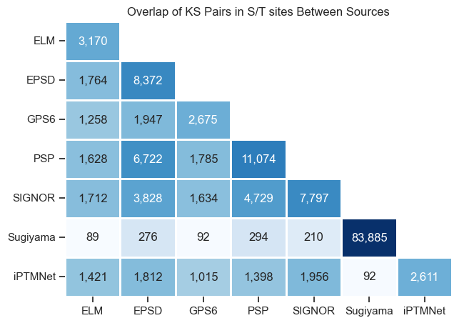
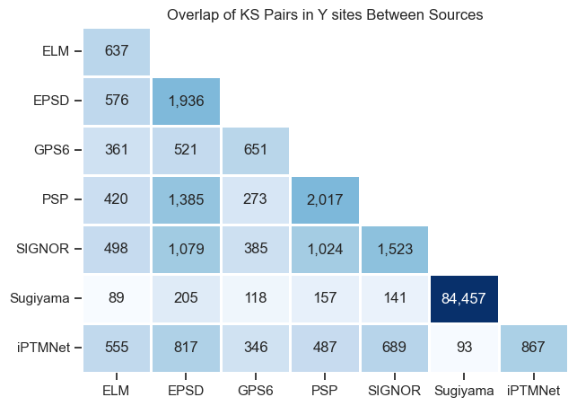
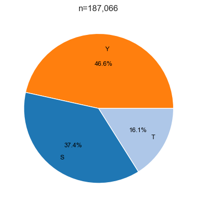
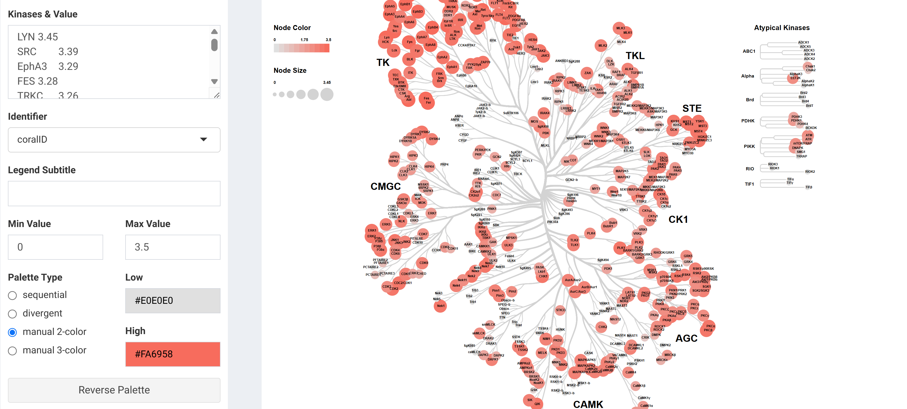

# Exploratory data analysis


<!-- WARNING: THIS FILE WAS AUTOGENERATED! DO NOT EDIT! -->

## Setup

``` python
import pandas as pd
import matplotlib.pyplot as plt
import numpy as np
import seaborn as sns
from matplotlib.colors import LogNorm
from katlas.core import *
```

## Overlap between sources

``` python
# direct concatenate of all source sequence
df=pd.read_parquet('raw/combine_source.parquet')
```

``` python
# unique substrate site with source split by | 
# df_group=pd.read_parquet('raw/combine_source_grouped.parquet')
df_group=Data.get_ks_dataset()
```

``` python
def plot_overlap(df_concat,source_col='source',id_col='kin_sub_site',figsize=(7,5),title="Overlap of Unique KS Pairs Between Sources"):
    source_ids = df_concat.groupby(source_col)[id_col].apply(set).to_dict()
    sources = list(source_ids.keys())
    
    overlap_matrix = pd.DataFrame(index=sources, columns=sources, dtype=int)
    for src1 in sources:
        for src2 in sources:
            if src1 == src2:
                overlap_matrix.loc[src1, src2] = len(source_ids[src1])
            else:
                overlap_matrix.loc[src1, src2] = len(source_ids[src1].intersection(source_ids[src2]))
    
    mask = np.triu(np.ones_like(overlap_matrix, dtype=bool), k=1)

    overlap_matrix = overlap_matrix.astype(int)
    
    vmin = np.min(overlap_matrix[overlap_matrix > 0])  # Smallest nonzero value
    vmax = np.max(overlap_matrix)
    
    plt.figure(figsize=figsize)
    sns.heatmap(overlap_matrix, 
                annot=True, 
                mask=mask, 
                fmt=",", 
                # vmin=1, vmax=1,
                norm=LogNorm(vmin=vmin, vmax=vmax),
                cmap="Blues", 
                cbar=False, 
                linewidths=1, 
                linecolor='white')

    plt.title(title)
```

``` python
from katlas.plot import *
```

``` python
set_sns(100)
```

``` python
plot_overlap(df)
save_pdf('../../fig/EDA_overlap.pdf')
```


``` python
df.site.str[0].value_counts()
```

    site
    Y    92088
    S    84341
    T    35243
    Name: count, dtype: int64

``` python
df_st = df[df.site.str[0]!='Y']
df_y = df[df.site.str[0]=='Y']
```

``` python
plot_overlap(df_st,title="Overlap of KS Pairs in S/T sites Between Sources")
save_pdf('../../fig/EDA_overlap_ST.pdf')
```



``` python
plot_overlap(df_y,title="Overlap of KS Pairs in Y sites Between Sources")
save_pdf('../../fig/EDA_overlap_Y.pdf')
```



## Overlap of phosphosites with human phosphoproteome

``` python
import pandas as pd
from katlas.data import *
```

``` python
df=pd.read_parquet('raw/combine_source.parquet')
data = pd.read_parquet('raw/human_phosphoproteome.parquet')
# data=Data.get_human_site()
```

``` python
data = data.rename(columns={'uniprot':'substrate_uniprot'})
```

``` python
def get_key(df):
    df = df.copy()
    print('original shape:',df.shape)
    df['sub_site']=df['substrate_uniprot']+'_'+df['site']
    df = df.drop_duplicates(subset='sub_site')
    print('after removing duplicates',df.shape)
    return df
```

``` python
data_site = get_key(data)
df_site=get_key(df)
```

    original shape: (119955, 11)
    after removing duplicates (119955, 11)
    original shape: (211672, 7)
    after removing duplicates (29811, 8)

``` python
data_site = data_site[['sub_site']].copy()
df_site = df_site[['sub_site']].copy()

data_site['source']='Human Phosphoprotome'
df_site['source']='KS Datasets'

df_concat = pd.concat([data_site,df_site],ignore_index=True)
```

``` python
df_concat_group = df_concat.groupby('sub_site')['source'].agg(lambda x: '|'.join(x)).reset_index()
```

``` python
df_concat_group.source.value_counts()
```

    source
    Human Phosphoprotome                102032
    Human Phosphoprotome|KS Datasets     17923
    KS Datasets                          11888
    Name: count, dtype: int64

``` python
# plot_overlap(df_concat,source_col='source',id_col='sub_site',figsize=(4,2),
#              title="Overlap of Unique Substrate Sites Between Datasets")
```

Venn diagram:

``` python
# pip install matplotlib_venn
```

``` python
from matplotlib_venn import venn2

set_human = set(data_site['sub_site'])
set_ks = set(df_site['sub_site'])

plt.figure(figsize=(5,5))
venn = venn2([set_human, set_ks], 
             # set_labels=('Human Phosphoproteome', 'KS Datasets')
             set_labels=('', '')
            )

for label in venn.subset_labels:
    if label:  # Check if the label exists (not empty subset)
        label.set_text(f"{int(label.get_text()):,}")  # Add comma formatting
plt.gca().set_aspect(0.8)
plt.title("Overlap of Unique Substrate Sites Between Datasets")
save_pdf('fig/EDA_venn_ks_human_overlap.pdf')
```


## Stacked plot of S/T/Y compositions

``` python
df=pd.read_parquet('raw/combine_source.parquet')
```

``` python
df['acceptor']=df['site'].str[0]
```

``` python
df_sugi = df[df.source=='Sugiyama'].reset_index(drop=True)
df_rest = df[df.source!='Sugiyama'].reset_index(drop=True)
```

``` python
df_sugi.acceptor.value_counts()
```

    acceptor
    Y    84457
    S    57728
    T    26157
    Name: count, dtype: int64

``` python
df_rest.acceptor.value_counts()
```

    acceptor
    S    26613
    T     9086
    Y     7631
    Name: count, dtype: int64

``` python
import matplotlib.ticker as mticker
from matplotlib import pyplot as plt
import seaborn as sns
```

``` python
from katlas.plot import *
```

``` python
def plot_stacked(df,figsize=(6,4)):
    plt.figure(figsize=figsize)
    sns.histplot(data=df, 
                 x='source', 
                 hue='acceptor', 
                 multiple='stack', 
                 discrete=True, 
                 shrink=0.8, 
                 alpha=1,
                 palette=get_color_dict(['S','T','Y'],'tab20'),hue_order=['S','T','Y'])
    
    plt.xlabel('')
    plt.ylabel('Number of KS Pairs')
    plt.title('Total Number of Unique KS Pairs per Source')
    plt.gca().yaxis.set_major_formatter(mticker.FuncFormatter(lambda x, _: f'{int(x):,}')) # show number with comma
    plt.xticks(rotation=45)
```

``` python
set_sns(100)
```

``` python
plot_stacked(df_rest)
save_pdf('../../fig/EDA_stacked_KS_per_source.pdf')
```


``` python
def plot_stacked2(df,figsize=(6,4)):
    plt.figure(figsize=figsize)
    sns.histplot(data=df, 
                 x='source', 
                 hue='acceptor', 
                 multiple='stack', 
                 discrete=True, 
                 shrink=0.8, 
                 alpha=1,
                 palette=get_color_dict(['S','T','Y'],'tab20'),hue_order=['S','T','Y'])
    
    plt.xlabel('')
    plt.ylabel('')
    plt.xticks(rotation=45)
    plt.legend([],frameon=False)
    plt.gca().yaxis.set_major_formatter(mticker.FuncFormatter(lambda x, _: f'{int(x):,}'))
    plt.tick_params(axis='y', labelright=True, labelleft=False, right=True, left=False)
```

Uncomment below to plot the sugiyama site number:

``` python
plot_stacked2(df_sugi,(0.7,4))
save_pdf('../../fig/EDA_stacked_KS_per_source_part2.pdf')
```


## Recovery rate

Check `raw/recovery_rate.xlsx` for more info.

The data is collected by: - Filter only human first, get dataframe
shape - After kinase & substrate mapping, get the shape - After sites
validation, get the shape

## Available on Data

``` python
from katlas.data import *
```

``` python
df = Data.get_ks_dataset()
```

``` python
df.head()
```

<div>
<style scoped>
    .dataframe tbody tr th:only-of-type {
        vertical-align: middle;
    }
&#10;    .dataframe tbody tr th {
        vertical-align: top;
    }
&#10;    .dataframe thead th {
        text-align: right;
    }
</style>

<table class="dataframe" data-quarto-postprocess="true" data-border="1">
<thead>
<tr style="text-align: right;">
<th data-quarto-table-cell-role="th"></th>
<th data-quarto-table-cell-role="th">kin_sub_site</th>
<th data-quarto-table-cell-role="th">kinase_uniprot</th>
<th data-quarto-table-cell-role="th">substrate_uniprot</th>
<th data-quarto-table-cell-role="th">site</th>
<th data-quarto-table-cell-role="th">source</th>
<th data-quarto-table-cell-role="th">substrate_genes</th>
<th data-quarto-table-cell-role="th">substrate_phosphoseq</th>
<th data-quarto-table-cell-role="th">position</th>
<th data-quarto-table-cell-role="th">site_seq</th>
<th data-quarto-table-cell-role="th">sub_site</th>
<th data-quarto-table-cell-role="th">substrate_sequence</th>
<th data-quarto-table-cell-role="th">kinase_on_tree</th>
<th data-quarto-table-cell-role="th">kinase_genes</th>
<th data-quarto-table-cell-role="th">kinase_group</th>
<th data-quarto-table-cell-role="th">kinase_family</th>
<th data-quarto-table-cell-role="th">kinase_pspa_big</th>
<th data-quarto-table-cell-role="th">kinase_pspa_small</th>
<th data-quarto-table-cell-role="th">kinase_coral_ID</th>
<th data-quarto-table-cell-role="th">num_kin</th>
</tr>
</thead>
<tbody>
<tr>
<td data-quarto-table-cell-role="th">0</td>
<td>O00141_A4FU28_S140</td>
<td>O00141</td>
<td>A4FU28</td>
<td>S140</td>
<td>Sugiyama</td>
<td>CTAGE9</td>
<td>MEEPGATPQPYLGLVLEELGRVVAALPESMRPDENPYGFPSELVVC...</td>
<td>140</td>
<td>AAAEEARSLEATCEKLSRsNsELEDEILCLEKDLKEEKSKH</td>
<td>A4FU28_S140</td>
<td>MEEPGATPQPYLGLVLEELGRVVAALPESMRPDENPYGFPSELVVC...</td>
<td>1</td>
<td>SGK1 SGK</td>
<td>AGC</td>
<td>SGK</td>
<td>Basophilic</td>
<td>Akt/rock</td>
<td>SGK1</td>
<td>22</td>
</tr>
<tr>
<td data-quarto-table-cell-role="th">1</td>
<td>O00141_O00141_S252</td>
<td>O00141</td>
<td>O00141</td>
<td>S252</td>
<td>Sugiyama</td>
<td>SGK1 SGK</td>
<td>MTVKTEAAKGTLTYSRMRGMVAILIAFMKQRRMGLNDFIQKIANNS...</td>
<td>252</td>
<td>SQGHIVLTDFGLCKENIEHNsTtstFCGtPEyLAPEVLHKQ</td>
<td>O00141_S252</td>
<td>MTVKTEAAKGTLTYSRMRGMVAILIAFMKQRRMGLNDFIQKIANNS...</td>
<td>1</td>
<td>SGK1 SGK</td>
<td>AGC</td>
<td>SGK</td>
<td>Basophilic</td>
<td>Akt/rock</td>
<td>SGK1</td>
<td>1</td>
</tr>
<tr>
<td data-quarto-table-cell-role="th">2</td>
<td>O00141_O00141_S255</td>
<td>O00141</td>
<td>O00141</td>
<td>S255</td>
<td>Sugiyama</td>
<td>SGK1 SGK</td>
<td>MTVKTEAAKGTLTYSRMRGMVAILIAFMKQRRMGLNDFIQKIANNS...</td>
<td>255</td>
<td>HIVLTDFGLCKENIEHNsTtstFCGtPEyLAPEVLHKQPYD</td>
<td>O00141_S255</td>
<td>MTVKTEAAKGTLTYSRMRGMVAILIAFMKQRRMGLNDFIQKIANNS...</td>
<td>1</td>
<td>SGK1 SGK</td>
<td>AGC</td>
<td>SGK</td>
<td>Basophilic</td>
<td>Akt/rock</td>
<td>SGK1</td>
<td>1</td>
</tr>
<tr>
<td data-quarto-table-cell-role="th">3</td>
<td>O00141_O00141_S397</td>
<td>O00141</td>
<td>O00141</td>
<td>S397</td>
<td>Sugiyama</td>
<td>SGK1 SGK</td>
<td>MTVKTEAAKGTLTYSRMRGMVAILIAFMKQRRMGLNDFIQKIANNS...</td>
<td>397</td>
<td>sGPNDLRHFDPEFTEEPVPNsIGKsPDsVLVTAsVKEAAEA</td>
<td>O00141_S397</td>
<td>MTVKTEAAKGTLTYSRMRGMVAILIAFMKQRRMGLNDFIQKIANNS...</td>
<td>1</td>
<td>SGK1 SGK</td>
<td>AGC</td>
<td>SGK</td>
<td>Basophilic</td>
<td>Akt/rock</td>
<td>SGK1</td>
<td>1</td>
</tr>
<tr>
<td data-quarto-table-cell-role="th">4</td>
<td>O00141_O00141_S404</td>
<td>O00141</td>
<td>O00141</td>
<td>S404</td>
<td>Sugiyama</td>
<td>SGK1 SGK</td>
<td>MTVKTEAAKGTLTYSRMRGMVAILIAFMKQRRMGLNDFIQKIANNS...</td>
<td>404</td>
<td>HFDPEFTEEPVPNsIGKsPDsVLVTAsVKEAAEAFLGFsYA</td>
<td>O00141_S404</td>
<td>MTVKTEAAKGTLTYSRMRGMVAILIAFMKQRRMGLNDFIQKIANNS...</td>
<td>1</td>
<td>SGK1 SGK</td>
<td>AGC</td>
<td>SGK</td>
<td>Basophilic</td>
<td>Akt/rock</td>
<td>SGK1</td>
<td>1</td>
</tr>
</tbody>
</table>

</div>

``` python
df.shape
```

    (187066, 19)

## Sites distribution

``` python
df['acceptor'] = df.site.str[0]
```

``` python
def plot_pie(value_counts, # value counts
             hue_order=None, # list of strings
             labeldistance=0.8,
             fontsize=12,
             fontcolor='black',
             palette='tab20' 
            ):
    if hue_order is not None: value_counts = value_counts.reindex(hue_order)
    colors = sns.color_palette(palette, n_colors=len(value_counts))
    value_counts.plot.pie(
        autopct='%1.1f%%',    # Show percentage inside slices
        labeldistance=labeldistance,    # Move labels closer to center
        textprops={'fontsize': fontsize, 'color': fontcolor} ,
        colors=colors,
    )
    plt.ylabel('')
    plt.title(f'n={value_counts.sum():,}')
```

``` python
def plot_pie(value_counts, 
             hue_order=None,
             labeldistance=0.8,
             fontsize=9,
             fontcolor='black',
             palette='tab20'):
    # Sort value_counts by size for better pie layout
    value_counts_sorted = value_counts.sort_values(ascending=False)

    # Map colors based on hue_order (if provided) or sorted labels
    labels = value_counts_sorted.index.tolist()
    if hue_order is not None:
        # Assign fixed colors based on hue_order
        palette_colors = sns.color_palette(palette, n_colors=len(hue_order))
        color_map = dict(zip(hue_order, palette_colors))
        colors = [color_map.get(label, 'grey') for label in labels]
    else:
        colors = sns.color_palette(palette, n_colors=len(labels))

    # Plot pie
    value_counts_sorted.plot.pie(
        autopct='%1.1f%%',
        labeldistance=labeldistance,
        textprops={'fontsize': fontsize, 'color': fontcolor},
        colors=colors
    )

    plt.ylabel('')
    plt.title(f'n={value_counts.sum():,}')
```

``` python
cnt = df['acceptor'].value_counts()
```

``` python
plot_pie(cnt,['S','T','Y'])
save_pdf('../../fig/EDA_pie_STY.pdf')
```



## Most frequent kinases

### Pie chart

``` python
cnt = df.kinase_group.value_counts()
```

``` python
info = Data.get_kinase_info()
```

``` python
info.modi_group.value_counts().index
```

    Index(['TK', 'CAMK', 'Other', 'CMGC', 'AGC', 'STE', 'TKL', 'Atypical', 'CK1',
           'NEK', 'RGC'],
          dtype='object', name='modi_group')

``` python
group_color=get_color_dict(
            ['CMGC','AGC', # blue
             'TK','TKL', # orange
             'CAMK','STE', # green
             'CK1', 'NEK', # red
             'Atypical','Other', # purple
             'RGC'
            ]
)
```

``` python
plot_pie(cnt,hue_order=group_color.keys(),
         fontsize=9,
         # labeldistance=1.1
        )
save_pdf('../../fig/EDA_pie_group.pdf')
```


### Kinome tree

Coral:

``` python
import numpy as np
```

``` python
df=Data.get_ks_dataset()
```

``` python
cnt = df.groupby('kinase_coral_ID')['kin_sub_site'].apply(lambda x: len(x.unique())).sort_values(ascending=False)
```

``` python
# cnt.apply(np.log10).round(2).to_csv('raw/kinome_tree_cnt.csv')
```

Go to [Coral](http://phanstiel-lab.med.unc.edu/CORAL/). Follow the
setting below:

- Node color –\> Color Scheme: quantitative
- paste csv context (without heading) in “Kinases & Value”
- identifier: coralID
- min:0 max:3.5
- manual 2-color. Low: \#E0E0E0, High: \#FA6958

To disable node label: advanced setting –\> labels font size to 0

<figure>

<figcaption aria-hidden="true">image.png</figcaption>
</figure>

## Old

## Co-occured kinase

``` python
df_group['substrate_uniprot_site']=df_group['substrate_uniprot']+'_'+df_group['site']
```

``` python
from itertools import combinations
from collections import Counter
```

``` python
df_group.groupby('substrate_uniprot_site')['kinase_uniprot'].apply(list)
```

    substrate_uniprot_site
    A0A2R8Y4L2_S158                                                                                                                                                                                                                                                                                                                                                                                                                                                                                                                                      [P48730]
    A0A2R8Y4L2_S22                                                                                                                                                                                                                                                                                                                                                                                                                                                                                                                       [O14757, O95819, Q13557]
    A0A2R8Y4L2_S6                                                                                                                                                                                                                                                                                                                                                                                                                                                                                                                        [O15264, P06493, Q9NR20]
    A0A2R8Y4L2_S95     [O00238, O14920, O15075, O43318, O75676, O94806, O96017, P05771-2, P05771, P15735, P17252, P23443, P24723, P24941, P36507, P36896, P36897, P41743, P42679, P49137, P49759, P49761, P50750, P51812, P51955, P51957, P52333, P57059, P78362, P80192, Q02156, Q02779, Q04759, Q04771, Q05513, Q06187, Q13131, Q13554, Q13555, Q13557, Q14012, Q14680, Q15139, Q15349, Q16512, Q16513, Q16566, Q16584, Q16644, Q16816, Q86UE8, Q8IU85, Q8IW41, Q8N568, Q8TD19, Q8TDX7, Q96GD4, Q9BYT3, Q9BZL6, Q9NYL2, Q9UKI8, Q9UPE1, Q9UQM7, Q9Y2U5, Q9Y4K4]
    A0A2R8Y4L2_T25                                                                                                                                                                                                                                                                                                                                                                                                                                                                                                                       [O14757, O95819, Q13557]
                                                                                                                                                                                                                                                                                          ...                                                                                                                                                                                                                                                                    
    Q9Y6Y8_S894                                                                                                                                                                                                                                                                                                                                                                                                                                                                                                                                  [Q96PF2, Q9BXA7]
    Q9Y6Y8_T893                                                                                                                                                                                                                                                                                                                                                                                                                                                                                                                  [P27448, Q7KZI7, Q96L34, Q9P0L2]
    Q9Y6Y8_Y935                                                                                                                                                                                                                                                                                                                                                                                                                                                                                                                                  [P43405, P52333]
    Q9Y6Y9_Y131                                                                                                                                                                                                                                                                                                                                                                                                                                                                                                                                          [P07948]
    Q9Y6Y9_Y22                                                                                                                                                                                                                                                                                                                                                                                                                                                                                                                                           [P07948]
    Name: kinase_uniprot, Length: 29811, dtype: object

``` python
# Count co-occurring kinase pairs
co_occurrence = Counter()
for kinases in grouped:
    for pair in combinations(sorted(set(kinases)), 2):  # remove duplicates and sort for consistency
        co_occurrence[pair] += 1

# print(co_occurrence)
```

``` python
kinases = set()
for pair in co_occurrence.keys():
    kinases.update(pair)
kinases = sorted(kinases)

# Initialize the co-occurrence matrix with zeros
matrix = pd.DataFrame(0, index=kinases, columns=kinases)

# Fill in the counts (matrix is symmetric)
for (k1, k2), count in co_occurrence.items():
    matrix.loc[k1, k2] = count
    matrix.loc[k2, k1] = count
```

``` python
matrix['P00533'].sort_values()
```

    P31152      0
    Q16659      0
    Q16654      0
    P37173      0
    P35790      0
             ... 
    P36888    478
    P11362    480
    P07949    480
    P06213    481
    Q15303    497
    Name: P00533, Length: 433, dtype: int64

``` python
counts = df_group.groupby('kinase_uniprot').agg({'substrate_uniprot_site':'size'})
```

Jaccard

``` python
counts_series = counts['substrate_uniprot_site']

# Create a copy for normalized values
norm_matrix = matrix.copy().astype(float)

for k1 in matrix.index:
    for k2 in matrix.columns:
        intersection = matrix.loc[k1, k2]
        union = counts_series[k1] + counts_series[k2] - intersection
        norm_matrix.loc[k1, k2] = intersection / union if union != 0 else 0
    norm_matrix.loc[k1, k1] = 1 # diaganol to be 1
```

``` python
# Create a boolean mask for the upper triangle (k=1 excludes the diagonal)
mask = np.triu(np.ones(norm_matrix.shape), k=1).astype(bool)
norm_matrix = norm_matrix.where(mask)
```

``` python
matrix['P00533'].sort_values(ascending=False).head()
```

    Q15303    497
    P06213    481
    P07949    480
    P11362    480
    P36888    478
    Name: P00533, dtype: int64

``` python
norm_matrix['P00533'].sort_values(ascending=False).head()
```

    O60674    0.253078
    O15146    0.213529
    P00519    0.203051
    O43318    0.122415
    O75676    0.023234
    Name: P00533, dtype: float64

``` python
kin_info = Data.get_kinase_info()
```

``` python
st=kin_info[kin_info.group!='TK'].uniprot.tolist()
```

``` python
st_col =norm_matrix.columns[norm_matrix.columns.isin(st)]
```

``` python
st_matrix = norm_matrix[st_col]
```

``` python
def get_max_jaccard(matrix):   
    a = matrix.max()
    b = matrix.idxmax()
    
    matrix = pd.concat([a, b], axis=1)
    matrix.columns = ['jaccard', 'kinase_uniprot']
    
    return matrix.sort_values('jaccard', ascending=False)
```

``` python
get_max_jaccard(st_matrix)
```

    /tmp/ipykernel_169440/3714721923.py:3: FutureWarning: The behavior of DataFrame.idxmax with all-NA values, or any-NA and skipna=False, is deprecated. In a future version this will raise ValueError
      b = matrix.idxmax()

<div>
<style scoped>
    .dataframe tbody tr th:only-of-type {
        vertical-align: middle;
    }
&#10;    .dataframe tbody tr th {
        vertical-align: top;
    }
&#10;    .dataframe thead th {
        text-align: right;
    }
</style>

<table class="dataframe" data-quarto-postprocess="true" data-border="1">
<thead>
<tr style="text-align: right;">
<th data-quarto-table-cell-role="th"></th>
<th data-quarto-table-cell-role="th">jaccard</th>
<th data-quarto-table-cell-role="th">kinase_uniprot</th>
</tr>
</thead>
<tbody>
<tr>
<td data-quarto-table-cell-role="th">Q9NYV4</td>
<td>0.509804</td>
<td>Q14004</td>
</tr>
<tr>
<td data-quarto-table-cell-role="th">Q96QP1</td>
<td>0.500000</td>
<td>Q96L96</td>
</tr>
<tr>
<td data-quarto-table-cell-role="th">Q9Y6E0</td>
<td>0.465691</td>
<td>Q9P289</td>
</tr>
<tr>
<td data-quarto-table-cell-role="th">P28482</td>
<td>0.450737</td>
<td>P27361</td>
</tr>
<tr>
<td data-quarto-table-cell-role="th">P31751</td>
<td>0.437574</td>
<td>P31749</td>
</tr>
<tr>
<td data-quarto-table-cell-role="th">...</td>
<td>...</td>
<td>...</td>
</tr>
<tr>
<td data-quarto-table-cell-role="th">O76039</td>
<td>0.000000</td>
<td>O00141</td>
</tr>
<tr>
<td data-quarto-table-cell-role="th">Q2M2I8</td>
<td>0.000000</td>
<td>O00141</td>
</tr>
<tr>
<td data-quarto-table-cell-role="th">O60885</td>
<td>0.000000</td>
<td>O00141</td>
</tr>
<tr>
<td data-quarto-table-cell-role="th">O00311</td>
<td>0.000000</td>
<td>O00141</td>
</tr>
<tr>
<td data-quarto-table-cell-role="th">O00141</td>
<td>NaN</td>
<td>NaN</td>
</tr>
</tbody>
</table>

<p>323 rows × 2 columns</p>
</div>

``` python
tyr=kin_info[kin_info.group=='TK'].uniprot.tolist()
tyr_col =norm_matrix.columns[norm_matrix.columns.isin(tyr)]
tyr_matrix = norm_matrix[tyr_col]
```

``` python
get_max_jaccard(tyr_matrix)
```

<div>
<style scoped>
    .dataframe tbody tr th:only-of-type {
        vertical-align: middle;
    }
&#10;    .dataframe tbody tr th {
        vertical-align: top;
    }
&#10;    .dataframe thead th {
        text-align: right;
    }
</style>

<table class="dataframe" data-quarto-postprocess="true" data-border="1">
<thead>
<tr style="text-align: right;">
<th data-quarto-table-cell-role="th"></th>
<th data-quarto-table-cell-role="th">jaccard</th>
<th data-quarto-table-cell-role="th">kinase_uniprot</th>
</tr>
</thead>
<tbody>
<tr>
<td data-quarto-table-cell-role="th">P54762</td>
<td>0.554638</td>
<td>P54760</td>
</tr>
<tr>
<td data-quarto-table-cell-role="th">Q15375</td>
<td>0.539118</td>
<td>P21709</td>
</tr>
<tr>
<td data-quarto-table-cell-role="th">P54753</td>
<td>0.531496</td>
<td>P29320</td>
</tr>
<tr>
<td data-quarto-table-cell-role="th">Q06418</td>
<td>0.526057</td>
<td>P54762</td>
</tr>
<tr>
<td data-quarto-table-cell-role="th">P54760</td>
<td>0.521168</td>
<td>P54753</td>
</tr>
<tr>
<td data-quarto-table-cell-role="th">...</td>
<td>...</td>
<td>...</td>
</tr>
<tr>
<td data-quarto-table-cell-role="th">P04626</td>
<td>0.046957</td>
<td>O43318</td>
</tr>
<tr>
<td data-quarto-table-cell-role="th">O15146</td>
<td>0.044005</td>
<td>O00506</td>
</tr>
<tr>
<td data-quarto-table-cell-role="th">Q6J9G0</td>
<td>0.016393</td>
<td>O43293</td>
</tr>
<tr>
<td data-quarto-table-cell-role="th">Q6ZMQ8</td>
<td>0.004348</td>
<td>O96017</td>
</tr>
<tr>
<td data-quarto-table-cell-role="th">Q8IWU2</td>
<td>0.003676</td>
<td>Q13976</td>
</tr>
</tbody>
</table>

<p>83 rows × 2 columns</p>
</div>

``` python
kin_info_uniprot = pd.read_excel('raw/uniprot_human_keyword_kinase.xlsx')
```

``` python
kin_map = kin_info_uniprot.set_index('Entry')['Entry Name'].str.split('_').str[0]
```

``` python
names = norm_matrix.index.map(kin_map)
```

todo: Use filter to only select kinase \>30 counts

``` python
import numpy as np
import pandas as pd
import matplotlib.pyplot as plt
import seaborn as sns
from scipy.cluster.hierarchy import linkage, dendrogram
from sklearn.manifold import MDS
import networkx as nx

# Assuming norm_matrix is your pre-computed Jaccard similarity matrix

# ---------------------------
# 1. Clustering & Heatmap

# Alternatively, using hierarchical clustering with scipy:
# Z = linkage(norm_matrix, method='average')
# plt.figure(figsize=(10, 5))
# dendrogram(Z, labels=norm_matrix.index)
# plt.title("Hierarchical Clustering Dendrogram")
# plt.xlabel("Kinase")
# plt.ylabel("Distance")
# plt.show()

Z = linkage(norm_matrix, method='average')
plt.figure(figsize=(4,50))
dendrogram(Z,orientation='left',leaf_font_size=7,labels=names,color_threshold=1.3)
plt.title('Hierarchical Clustering Dendrogram')
plt.ylabel('Distance')
plt.show()
```


## Old

``` python
# 2. Network Analysis
# ---------------------------
# Build a graph from norm_matrix (using a threshold to filter weak links)
threshold = 0.2  # adjust threshold as needed
G = nx.Graph()
for i, kinase1 in enumerate(norm_matrix.index):
    for j, kinase2 in enumerate(norm_matrix.columns):
        if i < j and norm_matrix.loc[kinase1, kinase2] > threshold:
            G.add_edge(kinase1, kinase2, weight=norm_matrix.loc[kinase1, kinase2])

# Draw the network
plt.figure(figsize=(10, 10))
pos = nx.spring_layout(G, weight='weight')
nx.draw(G, pos, with_labels=True, node_size=500, font_size=8)
plt.title("Kinase Similarity Network")
plt.show()
```


## Frequency of kinase

Instead of showing PSSM, we can show the neigboring kinase

## Kinase count

``` python
df_group['substrate_uniprot_site']=df_group['substrate_uniprot']+df_group['site']
```

``` python
counts = df_group.groupby('kinase_uniprot').agg({'substrate_uniprot_site':'size'}).reset_index()
```

``` python
counts
```

<div>
<style scoped>
    .dataframe tbody tr th:only-of-type {
        vertical-align: middle;
    }
&#10;    .dataframe tbody tr th {
        vertical-align: top;
    }
&#10;    .dataframe thead th {
        text-align: right;
    }
</style>

<table class="dataframe" data-quarto-postprocess="true" data-border="1">
<thead>
<tr style="text-align: right;">
<th data-quarto-table-cell-role="th"></th>
<th data-quarto-table-cell-role="th">kinase_uniprot</th>
<th data-quarto-table-cell-role="th">substrate_uniprot_site</th>
</tr>
</thead>
<tbody>
<tr>
<td data-quarto-table-cell-role="th">0</td>
<td>O00141</td>
<td>387</td>
</tr>
<tr>
<td data-quarto-table-cell-role="th">1</td>
<td>O00238</td>
<td>356</td>
</tr>
<tr>
<td data-quarto-table-cell-role="th">2</td>
<td>O00311</td>
<td>50</td>
</tr>
<tr>
<td data-quarto-table-cell-role="th">3</td>
<td>O00329</td>
<td>6</td>
</tr>
<tr>
<td data-quarto-table-cell-role="th">4</td>
<td>O00418</td>
<td>202</td>
</tr>
<tr>
<td data-quarto-table-cell-role="th">...</td>
<td>...</td>
<td>...</td>
</tr>
<tr>
<td data-quarto-table-cell-role="th">450</td>
<td>Q9Y572</td>
<td>10</td>
</tr>
<tr>
<td data-quarto-table-cell-role="th">451</td>
<td>Q9Y5S2</td>
<td>109</td>
</tr>
<tr>
<td data-quarto-table-cell-role="th">452</td>
<td>Q9Y6E0</td>
<td>846</td>
</tr>
<tr>
<td data-quarto-table-cell-role="th">453</td>
<td>Q9Y6M4</td>
<td>224</td>
</tr>
<tr>
<td data-quarto-table-cell-role="th">454</td>
<td>Q9Y6R4</td>
<td>15</td>
</tr>
</tbody>
</table>

<p>455 rows × 2 columns</p>
</div>

``` python
kin_info = pd.read_excel('raw/uniprot_human_keyword_kinase.xlsx')
```

``` python
kin_info = kin_info.rename(columns={'Entry':'kinase_uniprot'})
```

``` python
kin_info2 = Data.get_kinase_info()
```

``` python
(kin_info2.in_ST_paper==1).sum()
```

    303

``` python
(kin_info2.in_Tyr_paper==1).sum()
```

    93

``` python
in_pspa=(kin_info2.in_ST_paper==1)|(kin_info2.in_Tyr_paper==1)
```

``` python
kin_info2[in_pspa]
```

<div>
<style scoped>
    .dataframe tbody tr th:only-of-type {
        vertical-align: middle;
    }
&#10;    .dataframe tbody tr th {
        vertical-align: top;
    }
&#10;    .dataframe thead th {
        text-align: right;
    }
</style>

<table class="dataframe" data-quarto-postprocess="true" data-border="1">
<thead>
<tr style="text-align: right;">
<th data-quarto-table-cell-role="th"></th>
<th data-quarto-table-cell-role="th">kinase</th>
<th data-quarto-table-cell-role="th">ID_coral</th>
<th data-quarto-table-cell-role="th">uniprot</th>
<th data-quarto-table-cell-role="th">ID_HGNC</th>
<th data-quarto-table-cell-role="th">group</th>
<th data-quarto-table-cell-role="th">family</th>
<th data-quarto-table-cell-role="th">subfamily_coral</th>
<th data-quarto-table-cell-role="th">subfamily</th>
<th data-quarto-table-cell-role="th">in_ST_paper</th>
<th data-quarto-table-cell-role="th">in_Tyr_paper</th>
<th data-quarto-table-cell-role="th">...</th>
<th data-quarto-table-cell-role="th">cytosol</th>
<th data-quarto-table-cell-role="th">cytoskeleton</th>
<th data-quarto-table-cell-role="th">plasma membrane</th>
<th data-quarto-table-cell-role="th">mitochondrion</th>
<th data-quarto-table-cell-role="th">Golgi apparatus</th>
<th data-quarto-table-cell-role="th">endoplasmic reticulum</th>
<th data-quarto-table-cell-role="th">vesicle</th>
<th data-quarto-table-cell-role="th">centrosome</th>
<th data-quarto-table-cell-role="th">aggresome</th>
<th data-quarto-table-cell-role="th">main_location</th>
</tr>
</thead>
<tbody>
<tr>
<td data-quarto-table-cell-role="th">0</td>
<td>AAK1</td>
<td>AAK1</td>
<td>Q2M2I8</td>
<td>AAK1</td>
<td>Other</td>
<td>NAK</td>
<td>NaN</td>
<td>NAK</td>
<td>1</td>
<td>0</td>
<td>...</td>
<td>NaN</td>
<td>NaN</td>
<td>NaN</td>
<td>NaN</td>
<td>NaN</td>
<td>NaN</td>
<td>NaN</td>
<td>NaN</td>
<td>NaN</td>
<td>NaN</td>
</tr>
<tr>
<td data-quarto-table-cell-role="th">1</td>
<td>ABL1</td>
<td>ABL1</td>
<td>P00519</td>
<td>ABL1</td>
<td>TK</td>
<td>Abl</td>
<td>NaN</td>
<td>Abl</td>
<td>0</td>
<td>1</td>
<td>...</td>
<td>6.0</td>
<td>NaN</td>
<td>4.0</td>
<td>NaN</td>
<td>NaN</td>
<td>NaN</td>
<td>NaN</td>
<td>NaN</td>
<td>NaN</td>
<td>cytosol</td>
</tr>
<tr>
<td data-quarto-table-cell-role="th">2</td>
<td>ABL2</td>
<td>ABL2</td>
<td>P42684</td>
<td>ABL2</td>
<td>TK</td>
<td>Abl</td>
<td>NaN</td>
<td>Abl</td>
<td>0</td>
<td>1</td>
<td>...</td>
<td>4.0</td>
<td>6.0</td>
<td>NaN</td>
<td>NaN</td>
<td>NaN</td>
<td>NaN</td>
<td>NaN</td>
<td>NaN</td>
<td>NaN</td>
<td>cytoskeleton</td>
</tr>
<tr>
<td data-quarto-table-cell-role="th">3</td>
<td>TNK2</td>
<td>ACK</td>
<td>Q07912</td>
<td>TNK2</td>
<td>TK</td>
<td>Ack</td>
<td>NaN</td>
<td>Ack</td>
<td>0</td>
<td>1</td>
<td>...</td>
<td>NaN</td>
<td>NaN</td>
<td>NaN</td>
<td>NaN</td>
<td>NaN</td>
<td>NaN</td>
<td>8.0</td>
<td>NaN</td>
<td>2.0</td>
<td>vesicle</td>
</tr>
<tr>
<td data-quarto-table-cell-role="th">4</td>
<td>ACVR2A</td>
<td>ACTR2</td>
<td>P27037</td>
<td>ACVR2A</td>
<td>TKL</td>
<td>STKR</td>
<td>STKR2</td>
<td>STKR2</td>
<td>1</td>
<td>0</td>
<td>...</td>
<td>5.0</td>
<td>NaN</td>
<td>NaN</td>
<td>NaN</td>
<td>NaN</td>
<td>5.0</td>
<td>NaN</td>
<td>NaN</td>
<td>NaN</td>
<td>cytosol</td>
</tr>
<tr>
<td data-quarto-table-cell-role="th">...</td>
<td>...</td>
<td>...</td>
<td>...</td>
<td>...</td>
<td>...</td>
<td>...</td>
<td>...</td>
<td>...</td>
<td>...</td>
<td>...</td>
<td>...</td>
<td>...</td>
<td>...</td>
<td>...</td>
<td>...</td>
<td>...</td>
<td>...</td>
<td>...</td>
<td>...</td>
<td>...</td>
<td>...</td>
</tr>
<tr>
<td data-quarto-table-cell-role="th">518</td>
<td>YSK1</td>
<td>YSK1</td>
<td>O00506</td>
<td>STK25</td>
<td>STE</td>
<td>STE20</td>
<td>YSK</td>
<td>YSK</td>
<td>1</td>
<td>0</td>
<td>...</td>
<td>6.0</td>
<td>NaN</td>
<td>NaN</td>
<td>NaN</td>
<td>4.0</td>
<td>NaN</td>
<td>NaN</td>
<td>NaN</td>
<td>NaN</td>
<td>cytosol</td>
</tr>
<tr>
<td data-quarto-table-cell-role="th">519</td>
<td>ZAK</td>
<td>ZAK</td>
<td>Q9NYL2</td>
<td>MAP3K20</td>
<td>TKL</td>
<td>MLK</td>
<td>ZAK</td>
<td>ZAK</td>
<td>1</td>
<td>0</td>
<td>...</td>
<td>5.0</td>
<td>NaN</td>
<td>NaN</td>
<td>NaN</td>
<td>NaN</td>
<td>NaN</td>
<td>NaN</td>
<td>NaN</td>
<td>NaN</td>
<td>nucleus</td>
</tr>
<tr>
<td data-quarto-table-cell-role="th">520</td>
<td>ZAP70</td>
<td>ZAP70</td>
<td>P43403</td>
<td>ZAP70</td>
<td>TK</td>
<td>Syk</td>
<td>NaN</td>
<td>Syk</td>
<td>0</td>
<td>1</td>
<td>...</td>
<td>5.0</td>
<td>NaN</td>
<td>2.0</td>
<td>NaN</td>
<td>NaN</td>
<td>NaN</td>
<td>NaN</td>
<td>NaN</td>
<td>NaN</td>
<td>cytosol</td>
</tr>
<tr>
<td data-quarto-table-cell-role="th">521</td>
<td>EEF2K</td>
<td>eEF2K</td>
<td>O00418</td>
<td>EEF2K</td>
<td>Atypical</td>
<td>Alpha</td>
<td>eEF2K</td>
<td>eEF2K</td>
<td>1</td>
<td>0</td>
<td>...</td>
<td>9.0</td>
<td>NaN</td>
<td>1.0</td>
<td>NaN</td>
<td>NaN</td>
<td>NaN</td>
<td>NaN</td>
<td>NaN</td>
<td>NaN</td>
<td>cytosol</td>
</tr>
<tr>
<td data-quarto-table-cell-role="th">522</td>
<td>FAM20C</td>
<td>FAM20C</td>
<td>Q8IXL6</td>
<td>FAM20C</td>
<td>Atypical</td>
<td>FAM20C</td>
<td>NaN</td>
<td>FAM20C</td>
<td>1</td>
<td>0</td>
<td>...</td>
<td>2.0</td>
<td>NaN</td>
<td>NaN</td>
<td>NaN</td>
<td>7.0</td>
<td>1.0</td>
<td>NaN</td>
<td>NaN</td>
<td>NaN</td>
<td>Golgi apparatus</td>
</tr>
</tbody>
</table>

<p>392 rows × 30 columns</p>
</div>

``` python
kin_info2[
```

    Index(['kinase', 'ID_coral', 'uniprot', 'ID_HGNC', 'group', 'family',
           'subfamily_coral', 'subfamily', 'in_ST_paper', 'in_Tyr_paper',
           'in_cddm', 'pseudo', 'pspa_category_small', 'pspa_category_big',
           'cddm_big', 'cddm_small', 'length', 'human_uniprot_sequence',
           'kinasecom_domain', 'nucleus', 'cytosol', 'cytoskeleton',
           'plasma membrane', 'mitochondrion', 'Golgi apparatus',
           'endoplasmic reticulum', 'vesicle', 'centrosome', 'aggresome',
           'main_location'],
          dtype='object')

``` python
df_group[df_group.kinase_uniprot=='P07948-2']
```

<div>
<style scoped>
    .dataframe tbody tr th:only-of-type {
        vertical-align: middle;
    }
&#10;    .dataframe tbody tr th {
        vertical-align: top;
    }
&#10;    .dataframe thead th {
        text-align: right;
    }
</style>

<table class="dataframe" data-quarto-postprocess="true" data-border="1">
<thead>
<tr style="text-align: right;">
<th data-quarto-table-cell-role="th"></th>
<th data-quarto-table-cell-role="th">kin_sub_site</th>
<th data-quarto-table-cell-role="th">kinase_uniprot</th>
<th data-quarto-table-cell-role="th">substrate_uniprot</th>
<th data-quarto-table-cell-role="th">site</th>
<th data-quarto-table-cell-role="th">source</th>
<th data-quarto-table-cell-role="th">substrate_genes</th>
<th data-quarto-table-cell-role="th">substrate_sequence</th>
<th data-quarto-table-cell-role="th">substrate_phosphoseq</th>
<th data-quarto-table-cell-role="th">substrate_uniprot_site</th>
</tr>
</thead>
<tbody>
<tr>
<td data-quarto-table-cell-role="th">30312</td>
<td>P07948-2_A0MZ66_Y24</td>
<td>P07948-2</td>
<td>A0MZ66</td>
<td>Y24</td>
<td>Sugiyama</td>
<td>SHTN1 KIAA1598</td>
<td>MNSSDEEKQLQLITSLKEQAIGEYEDLRAENQKTKEKCDKIRQERD...</td>
<td>MNSSDEEKQLQLITSLKEQAIGEyEDLRAENQKTKEKCDKIRQERD...</td>
<td>A0MZ66Y24</td>
</tr>
<tr>
<td data-quarto-table-cell-role="th">30313</td>
<td>P07948-2_A1L429_Y10</td>
<td>P07948-2</td>
<td>A1L429</td>
<td>Y10</td>
<td>Sugiyama</td>
<td>GAGE12B; GAGE12C; GAGE12D; GAGE12E</td>
<td>MSWRGRSTYYWPRPRRYVQPPEMIGPMRPEQFSDEVEPATPEEGEP...</td>
<td>MSWRGRsTyyWPRPRRYVQPPEMIGPMRPEQFSDEVEPATPEEGEP...</td>
<td>A1L429Y10</td>
</tr>
<tr>
<td data-quarto-table-cell-role="th">30314</td>
<td>P07948-2_A1L429_Y9</td>
<td>P07948-2</td>
<td>A1L429</td>
<td>Y9</td>
<td>Sugiyama</td>
<td>GAGE12B; GAGE12C; GAGE12D; GAGE12E</td>
<td>MSWRGRSTYYWPRPRRYVQPPEMIGPMRPEQFSDEVEPATPEEGEP...</td>
<td>MSWRGRsTyyWPRPRRYVQPPEMIGPMRPEQFSDEVEPATPEEGEP...</td>
<td>A1L429Y9</td>
</tr>
<tr>
<td data-quarto-table-cell-role="th">30315</td>
<td>P07948-2_A1X283_Y855</td>
<td>P07948-2</td>
<td>A1X283</td>
<td>Y855</td>
<td>Sugiyama</td>
<td>SH3PXD2B FAD49 KIAA1295 TKS4</td>
<td>MPPRRSIVEVKVLDVQKRRVPNKHYVYIIRVTWSSGSTEAIYRRYS...</td>
<td>MPPRRSIVEVKVLDVQKRRVPNKHYVYIIRVTWSSGSTEAIYRRYS...</td>
<td>A1X283Y855</td>
</tr>
<tr>
<td data-quarto-table-cell-role="th">30316</td>
<td>P07948-2_A5A3E0_S939</td>
<td>P07948-2</td>
<td>A5A3E0</td>
<td>S939</td>
<td>Sugiyama</td>
<td>POTEF A26C1B</td>
<td>MVVEVDSMPAASSVKKPFGLRSKMGKWCCRCFPCCRESGKSNVGTS...</td>
<td>MVVEVDSMPAASSVKKPFGLRSKMGKWCCRCFPCCRESGKSNVGTS...</td>
<td>A5A3E0S939</td>
</tr>
<tr>
<td data-quarto-table-cell-role="th">...</td>
<td>...</td>
<td>...</td>
<td>...</td>
<td>...</td>
<td>...</td>
<td>...</td>
<td>...</td>
<td>...</td>
<td>...</td>
</tr>
<tr>
<td data-quarto-table-cell-role="th">31872</td>
<td>P07948-2_Q9Y5S9_Y54</td>
<td>P07948-2</td>
<td>Q9Y5S9</td>
<td>Y54</td>
<td>Sugiyama</td>
<td>RBM8A RBM8 HSPC114 MDS014</td>
<td>MADVLDLHEAGGEDFAMDEDGDESIHKLKEKAKKRKGRGFGSEEGS...</td>
<td>MADVLDLHEAGGEDFAMDEDGDESIHKLKEKAKKRKGRGFGSEEGS...</td>
<td>Q9Y5S9Y54</td>
</tr>
<tr>
<td data-quarto-table-cell-role="th">31873</td>
<td>P07948-2_Q9Y639_Y216</td>
<td>P07948-2</td>
<td>Q9Y639</td>
<td>Y216</td>
<td>Sugiyama</td>
<td>NPTN SDFR1 SDR1</td>
<td>MSGSSLPSALALSLLLVSGSLLPGPGAAQNAGFVKSPMSETKLTGD...</td>
<td>MSGSSLPSALALSLLLVSGSLLPGPGAAQNAGFVKSPMSETKLTGD...</td>
<td>Q9Y639Y216</td>
</tr>
<tr>
<td data-quarto-table-cell-role="th">31874</td>
<td>P07948-2_Q9Y639_Y220</td>
<td>P07948-2</td>
<td>Q9Y639</td>
<td>Y220</td>
<td>Sugiyama</td>
<td>NPTN SDFR1 SDR1</td>
<td>MSGSSLPSALALSLLLVSGSLLPGPGAAQNAGFVKSPMSETKLTGD...</td>
<td>MSGSSLPSALALSLLLVSGSLLPGPGAAQNAGFVKSPMSETKLTGD...</td>
<td>Q9Y639Y220</td>
</tr>
<tr>
<td data-quarto-table-cell-role="th">31875</td>
<td>P07948-2_Q9Y696_S245</td>
<td>P07948-2</td>
<td>Q9Y696</td>
<td>S245</td>
<td>Sugiyama</td>
<td>CLIC4</td>
<td>MALSMPLNGLKEEDKEPLIELFVKAGSDGESIGNCPFSQRLFMILW...</td>
<td>MALSMPLNGLKEEDKEPLIELFVKAGsDGEsIGNCPFSQRLFMILW...</td>
<td>Q9Y696S245</td>
</tr>
<tr>
<td data-quarto-table-cell-role="th">31876</td>
<td>P07948-2_Q9Y696_Y244</td>
<td>P07948-2</td>
<td>Q9Y696</td>
<td>Y244</td>
<td>Sugiyama</td>
<td>CLIC4</td>
<td>MALSMPLNGLKEEDKEPLIELFVKAGSDGESIGNCPFSQRLFMILW...</td>
<td>MALSMPLNGLKEEDKEPLIELFVKAGsDGEsIGNCPFSQRLFMILW...</td>
<td>Q9Y696Y244</td>
</tr>
</tbody>
</table>

<p>1565 rows × 9 columns</p>
</div>

``` python
counts
```

<div>
<style scoped>
    .dataframe tbody tr th:only-of-type {
        vertical-align: middle;
    }
&#10;    .dataframe tbody tr th {
        vertical-align: top;
    }
&#10;    .dataframe thead th {
        text-align: right;
    }
</style>

<table class="dataframe" data-quarto-postprocess="true" data-border="1">
<thead>
<tr style="text-align: right;">
<th data-quarto-table-cell-role="th"></th>
<th data-quarto-table-cell-role="th">kinase_uniprot</th>
<th data-quarto-table-cell-role="th">substrate_uniprot_site</th>
</tr>
</thead>
<tbody>
<tr>
<td data-quarto-table-cell-role="th">0</td>
<td>O00141</td>
<td>387</td>
</tr>
<tr>
<td data-quarto-table-cell-role="th">1</td>
<td>O00238</td>
<td>356</td>
</tr>
<tr>
<td data-quarto-table-cell-role="th">2</td>
<td>O00311</td>
<td>50</td>
</tr>
<tr>
<td data-quarto-table-cell-role="th">3</td>
<td>O00329</td>
<td>6</td>
</tr>
<tr>
<td data-quarto-table-cell-role="th">4</td>
<td>O00418</td>
<td>202</td>
</tr>
<tr>
<td data-quarto-table-cell-role="th">...</td>
<td>...</td>
<td>...</td>
</tr>
<tr>
<td data-quarto-table-cell-role="th">450</td>
<td>Q9Y572</td>
<td>10</td>
</tr>
<tr>
<td data-quarto-table-cell-role="th">451</td>
<td>Q9Y5S2</td>
<td>109</td>
</tr>
<tr>
<td data-quarto-table-cell-role="th">452</td>
<td>Q9Y6E0</td>
<td>846</td>
</tr>
<tr>
<td data-quarto-table-cell-role="th">453</td>
<td>Q9Y6M4</td>
<td>224</td>
</tr>
<tr>
<td data-quarto-table-cell-role="th">454</td>
<td>Q9Y6R4</td>
<td>15</td>
</tr>
</tbody>
</table>

<p>455 rows × 2 columns</p>
</div>

``` python
counts.merge(kin_info)
```

<div>
<style scoped>
    .dataframe tbody tr th:only-of-type {
        vertical-align: middle;
    }
&#10;    .dataframe tbody tr th {
        vertical-align: top;
    }
&#10;    .dataframe thead th {
        text-align: right;
    }
</style>

<table class="dataframe" data-quarto-postprocess="true" data-border="1">
<thead>
<tr style="text-align: right;">
<th data-quarto-table-cell-role="th"></th>
<th data-quarto-table-cell-role="th">kinase_uniprot</th>
<th data-quarto-table-cell-role="th">substrate_uniprot_site</th>
<th data-quarto-table-cell-role="th">Entry Name</th>
<th data-quarto-table-cell-role="th">Protein names</th>
<th data-quarto-table-cell-role="th">Gene Names</th>
<th data-quarto-table-cell-role="th">uniprot_keyword_kinase</th>
<th data-quarto-table-cell-role="th">on_tree</th>
<th data-quarto-table-cell-role="th">Organism</th>
<th data-quarto-table-cell-role="th">Keywords</th>
<th data-quarto-table-cell-role="th">Sequence</th>
</tr>
</thead>
<tbody>
<tr>
<td data-quarto-table-cell-role="th">0</td>
<td>O00141</td>
<td>387</td>
<td>SGK1_HUMAN</td>
<td>Serine/threonine-protein kinase Sgk1 (EC 2.7.1...</td>
<td>SGK1 SGK</td>
<td>1</td>
<td>1</td>
<td>Homo sapiens (Human)</td>
<td>3D-structure;Alternative promoter usage;Altern...</td>
<td>MTVKTEAAKGTLTYSRMRGMVAILIAFMKQRRMGLNDFIQKIANNS...</td>
</tr>
<tr>
<td data-quarto-table-cell-role="th">1</td>
<td>O00238</td>
<td>356</td>
<td>BMR1B_HUMAN</td>
<td>Bone morphogenetic protein receptor type-1B (B...</td>
<td>BMPR1B</td>
<td>1</td>
<td>1</td>
<td>Homo sapiens (Human)</td>
<td>3D-structure;Alternative splicing;ATP-binding;...</td>
<td>MLLRSAGKLNVGTKKEDGESTAPTPRPKVLRCKCHHHCPEDSVNNI...</td>
</tr>
<tr>
<td data-quarto-table-cell-role="th">2</td>
<td>O00311</td>
<td>50</td>
<td>CDC7_HUMAN</td>
<td>Cell division cycle 7-related protein kinase (...</td>
<td>CDC7 CDC7L1</td>
<td>1</td>
<td>1</td>
<td>Homo sapiens (Human)</td>
<td>3D-structure;Alternative splicing;ATP-binding;...</td>
<td>MEASLGIQMDEPMAFSPQRDRFQAEGSLKKNEQNFKLAGVKKDIEK...</td>
</tr>
<tr>
<td data-quarto-table-cell-role="th">3</td>
<td>O00329</td>
<td>6</td>
<td>PK3CD_HUMAN</td>
<td>Phosphatidylinositol 4,5-bisphosphate 3-kinase...</td>
<td>PIK3CD</td>
<td>1</td>
<td>0</td>
<td>Homo sapiens (Human)</td>
<td>3D-structure;Adaptive immunity;Alternative spl...</td>
<td>MPPGVDCPMEFWTKEENQSVVVDFLLPTGVYLNFPVSRNANLSTIK...</td>
</tr>
<tr>
<td data-quarto-table-cell-role="th">4</td>
<td>O00418</td>
<td>202</td>
<td>EF2K_HUMAN</td>
<td>Eukaryotic elongation factor 2 kinase (eEF-2 k...</td>
<td>EEF2K</td>
<td>1</td>
<td>1</td>
<td>Homo sapiens (Human)</td>
<td>3D-structure;Acetylation;ATP-binding;Calcium;C...</td>
<td>MADEDLIFRLEGVDGGQSPRAGHDGDSDGDSDDEEGYFICPITDDP...</td>
</tr>
<tr>
<td data-quarto-table-cell-role="th">...</td>
<td>...</td>
<td>...</td>
<td>...</td>
<td>...</td>
<td>...</td>
<td>...</td>
<td>...</td>
<td>...</td>
<td>...</td>
<td>...</td>
</tr>
<tr>
<td data-quarto-table-cell-role="th">447</td>
<td>Q9Y572</td>
<td>10</td>
<td>RIPK3_HUMAN</td>
<td>Receptor-interacting serine/threonine-protein ...</td>
<td>RIPK3 RIP3</td>
<td>1</td>
<td>1</td>
<td>Homo sapiens (Human)</td>
<td>3D-structure;Alternative splicing;Apoptosis;AT...</td>
<td>MSCVKLWPSGAPAPLVSIEELENQELVGKGGFGTVFRAQHRKWGYD...</td>
</tr>
<tr>
<td data-quarto-table-cell-role="th">448</td>
<td>Q9Y5S2</td>
<td>109</td>
<td>MRCKB_HUMAN</td>
<td>Serine/threonine-protein kinase MRCK beta (EC ...</td>
<td>CDC42BPB KIAA1124</td>
<td>1</td>
<td>1</td>
<td>Homo sapiens (Human)</td>
<td>3D-structure;ATP-binding;Cell junction;Cell me...</td>
<td>MSAKVRLKKLEQLLLDGPWRNESALSVETLLDVLVCLYTECSHSAL...</td>
</tr>
<tr>
<td data-quarto-table-cell-role="th">449</td>
<td>Q9Y6E0</td>
<td>846</td>
<td>STK24_HUMAN</td>
<td>Serine/threonine-protein kinase 24 (EC 2.7.11....</td>
<td>STK24 MST3 STK3</td>
<td>1</td>
<td>1</td>
<td>Homo sapiens (Human)</td>
<td>3D-structure;Acetylation;Alternative splicing;...</td>
<td>MDSRAQLWGLALNKRRATLPHPGGSTNLKADPEELFTKLEKIGKGS...</td>
</tr>
<tr>
<td data-quarto-table-cell-role="th">450</td>
<td>Q9Y6M4</td>
<td>224</td>
<td>KC1G3_HUMAN</td>
<td>Casein kinase I isoform gamma-3 (CKI-gamma 3) ...</td>
<td>CSNK1G3</td>
<td>1</td>
<td>1</td>
<td>Homo sapiens (Human)</td>
<td>3D-structure;Acetylation;Alternative splicing;...</td>
<td>MENKKKDKDKSDDRMARPSGRSGHNTRGTGSSSSGVLMVGPNFRVG...</td>
</tr>
<tr>
<td data-quarto-table-cell-role="th">451</td>
<td>Q9Y6R4</td>
<td>15</td>
<td>M3K4_HUMAN</td>
<td>Mitogen-activated protein kinase kinase kinase...</td>
<td>MAP3K4 KIAA0213 MAPKKK4 MEKK4 MTK1</td>
<td>1</td>
<td>1</td>
<td>Homo sapiens (Human)</td>
<td>Alternative splicing;ATP-binding;Cytoplasm;Kin...</td>
<td>MREAAAALVPPPAFAVTPAAAMEEPPPPPPPPPPPPEPETESEPEC...</td>
</tr>
</tbody>
</table>

<p>452 rows × 10 columns</p>
</div>

## Source confidence

``` python
df_group.source.str.split('|').str.len().value_counts()
```

    source
    1    174536
    2      6123
    3      3352
    4      1312
    5       923
    6       770
    7        50
    Name: count, dtype: int64

## Self-phosphorylate

``` python
df_group[df_group['kinase_uniprot']==df_group['substrate_uniprot']].substrate_genes.value_counts().head(20)
```

    substrate_genes
    LRRK2 PARK8                  57
    TRPM7 CHAK1 LTRPC7           46
    MARK2 EMK1                   35
    BMX                          34
    TTK MPS1 MPS1L1              34
    NEK4 STK2                    33
    DCLK2 DCAMKL2 DCDC3B DCK2    32
    ERBB4 HER4                   32
    ABL1 ABL JTK7                32
    MARK1 KIAA1477 MARK          31
    HIPK2                        31
    RPS6KA2 MAPKAPK1C RSK3       29
    BTK AGMX1 ATK BPK            29
    STK4 KRS2 MST1               28
    BUB1B BUBR1 MAD3L SSK1       28
    PDGFRA PDGFR2 RHEPDGFRA      28
    ITK EMT LYK                  28
    RPS6KA6 RSK4                 28
    PRKD2 PKD2 HSPC187           28
    ABL2 ABLL ARG                27
    Name: count, dtype: int64

``` python
df_group.source
```

    source
    Sugiyama                     167633
    EPSD|PSP                       3346
    PSP                            2932
    SIGNOR                         1984
    SIGNOR|EPSD|PSP                1878
                                  ...  
    GPS6|SIGNOR|ELM|Sugiyama          1
    ELM|iPTMNet|Sugiyama              1
    ELM|iPTMNet|EPSD|Sugiyama         1
    iPTMNet|PSP|Sugiyama              1
    SIGNOR|ELM|EPSD|Sugiyama          1
    Name: count, Length: 111, dtype: int64

### Nearby co-occured kinase

TODO
