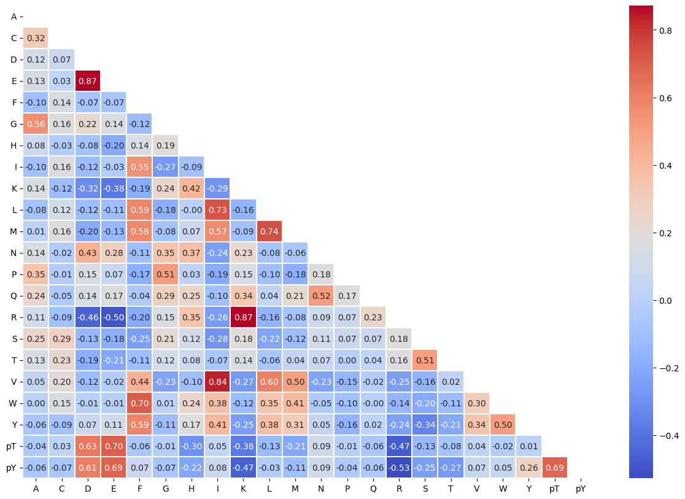

# Get AA relationship


<!-- WARNING: THIS FILE WAS AUTOGENERATED! DO NOT EDIT! -->

``` python
from katlas.plot import *
from katlas.pssm import *
from matplotlib import pyplot as plt
import pandas as pd,numpy as np, seaborn as sns
```

``` python
# load raw PSPA data
st = pd.read_csv('https://github.com/sky1ove/katlas_raw/raw/refs/heads/main/nbs/raw/pspa_st_raw.csv').set_index('kinase')
tyr = pd.read_csv('https://github.com/sky1ove/katlas_raw/raw/refs/heads/main/nbs/raw/pspa_tyr_raw.csv').set_index('kinase')
```

``` python
st.shape,tyr.shape # tyr have position 5 while st only have -5 to 4
```

    ((303, 207), (93, 230))

``` python
st.columns.isin(tyr.columns).sum() # all st columns are in tyr
```

    np.int64(207)

``` python
tyr = tyr[st.columns]
```

``` python
df = pd.concat([st,tyr])
```

``` python
# df.to_parquet('pspa_raw_all.parquet')
```

## Normalize

For each pssm, the value is divided by the sum of position to get
probability.

Here we remove pS (or s) column because it is a duplicate of pT.

``` python
out=[]
for i,r in df.iterrows():
    pssm = recover_pssm(r).drop(index=['pS']) # drop pS as it is a duplicate of pT
    pssm_norm = pssm/pssm.sum()
    r_norm=flatten_pssm(pssm_norm)
    out.append(r_norm)
    # break
```

``` python
df_norm = pd.DataFrame(out,index=df.index)
```

``` python
df_norm.max().sort_values()
```

    -4V     0.054906
    -5Q     0.055054
    -3Q     0.060396
    -4I     0.061281
    4N      0.061402
              ...   
    2R      0.647505
    -3R     0.659110
    4pT     0.744287
    2pY     0.756693
    -3pT    0.819808
    Length: 198, dtype: float64

``` python
# Z score normalization: (x-median)/std
# df_norm = df_log.div(df_log.sum(1), axis=0) # normalize per row

# df_norm.max().sort_values()

# df_centered = df_log.sub(df_log.median(axis=1), axis=0) #Median is more robust to outliers than mean

# row_std = df_centered.std(axis=1)

# df_norm = df_centered.div(row_std, axis=0)
```

## Get aa relationship

Get a pivot table where index are each row in PSSM (flattened) and
column as aa

``` python
def get_aa_pivot(df):
    df2 = df.unstack().reset_index()
    df2.columns = ['substrate', 'kinase', 'target']
    df2['aa'] = df2.substrate.str.extract(r'-?\d+(.*)')
    df2['enum'] = df2.groupby('aa').cumcount()
    df_pivot = df2.pivot(index='enum', columns='aa', values='target') #(303+93)*207/23=3564 data points per aa
    return df_pivot
```

``` python
get_aa_pivot(df_norm)
```

<div>
<style scoped>
    .dataframe tbody tr th:only-of-type {
        vertical-align: middle;
    }
&#10;    .dataframe tbody tr th {
        vertical-align: top;
    }
&#10;    .dataframe thead th {
        text-align: right;
    }
</style>

<table class="dataframe" data-quarto-postprocess="true" data-border="1">
<thead>
<tr style="text-align: right;">
<th data-quarto-table-cell-role="th">aa</th>
<th data-quarto-table-cell-role="th">A</th>
<th data-quarto-table-cell-role="th">C</th>
<th data-quarto-table-cell-role="th">D</th>
<th data-quarto-table-cell-role="th">E</th>
<th data-quarto-table-cell-role="th">F</th>
<th data-quarto-table-cell-role="th">G</th>
<th data-quarto-table-cell-role="th">H</th>
<th data-quarto-table-cell-role="th">I</th>
<th data-quarto-table-cell-role="th">K</th>
<th data-quarto-table-cell-role="th">L</th>
<th data-quarto-table-cell-role="th">...</th>
<th data-quarto-table-cell-role="th">P</th>
<th data-quarto-table-cell-role="th">Q</th>
<th data-quarto-table-cell-role="th">R</th>
<th data-quarto-table-cell-role="th">S</th>
<th data-quarto-table-cell-role="th">T</th>
<th data-quarto-table-cell-role="th">V</th>
<th data-quarto-table-cell-role="th">W</th>
<th data-quarto-table-cell-role="th">Y</th>
<th data-quarto-table-cell-role="th">pT</th>
<th data-quarto-table-cell-role="th">pY</th>
</tr>
<tr>
<th data-quarto-table-cell-role="th">enum</th>
<th data-quarto-table-cell-role="th"></th>
<th data-quarto-table-cell-role="th"></th>
<th data-quarto-table-cell-role="th"></th>
<th data-quarto-table-cell-role="th"></th>
<th data-quarto-table-cell-role="th"></th>
<th data-quarto-table-cell-role="th"></th>
<th data-quarto-table-cell-role="th"></th>
<th data-quarto-table-cell-role="th"></th>
<th data-quarto-table-cell-role="th"></th>
<th data-quarto-table-cell-role="th"></th>
<th data-quarto-table-cell-role="th"></th>
<th data-quarto-table-cell-role="th"></th>
<th data-quarto-table-cell-role="th"></th>
<th data-quarto-table-cell-role="th"></th>
<th data-quarto-table-cell-role="th"></th>
<th data-quarto-table-cell-role="th"></th>
<th data-quarto-table-cell-role="th"></th>
<th data-quarto-table-cell-role="th"></th>
<th data-quarto-table-cell-role="th"></th>
<th data-quarto-table-cell-role="th"></th>
<th data-quarto-table-cell-role="th"></th>
</tr>
</thead>
<tbody>
<tr>
<td data-quarto-table-cell-role="th">0</td>
<td>0.022689</td>
<td>0.035505</td>
<td>0.012815</td>
<td>0.012230</td>
<td>0.033966</td>
<td>0.019584</td>
<td>0.026494</td>
<td>0.124227</td>
<td>0.020920</td>
<td>0.079374</td>
<td>...</td>
<td>0.057560</td>
<td>0.044781</td>
<td>0.076395</td>
<td>0.037377</td>
<td>0.062864</td>
<td>0.076023</td>
<td>0.025154</td>
<td>0.076070</td>
<td>0.016092</td>
<td>0.048843</td>
</tr>
<tr>
<td data-quarto-table-cell-role="th">1</td>
<td>0.043352</td>
<td>0.051706</td>
<td>0.065975</td>
<td>0.058643</td>
<td>0.044600</td>
<td>0.035740</td>
<td>0.042359</td>
<td>0.046430</td>
<td>0.037911</td>
<td>0.044243</td>
<td>...</td>
<td>0.030841</td>
<td>0.031974</td>
<td>0.035314</td>
<td>0.043700</td>
<td>0.046971</td>
<td>0.044418</td>
<td>0.059664</td>
<td>0.042913</td>
<td>0.058193</td>
<td>0.056499</td>
</tr>
<tr>
<td data-quarto-table-cell-role="th">2</td>
<td>0.041163</td>
<td>0.066089</td>
<td>0.077450</td>
<td>0.065475</td>
<td>0.043931</td>
<td>0.037582</td>
<td>0.037661</td>
<td>0.032179</td>
<td>0.031404</td>
<td>0.034251</td>
<td>...</td>
<td>0.038739</td>
<td>0.036231</td>
<td>0.034316</td>
<td>0.048096</td>
<td>0.049033</td>
<td>0.039515</td>
<td>0.052463</td>
<td>0.044140</td>
<td>0.055400</td>
<td>0.054025</td>
</tr>
<tr>
<td data-quarto-table-cell-role="th">3</td>
<td>0.043296</td>
<td>0.044366</td>
<td>0.029489</td>
<td>0.029495</td>
<td>0.042885</td>
<td>0.046571</td>
<td>0.051207</td>
<td>0.034139</td>
<td>0.074510</td>
<td>0.036415</td>
<td>...</td>
<td>0.047329</td>
<td>0.038554</td>
<td>0.119120</td>
<td>0.058256</td>
<td>0.045790</td>
<td>0.033537</td>
<td>0.041228</td>
<td>0.040494</td>
<td>0.033407</td>
<td>0.033597</td>
</tr>
<tr>
<td data-quarto-table-cell-role="th">4</td>
<td>0.050553</td>
<td>0.054868</td>
<td>0.024011</td>
<td>0.024790</td>
<td>0.043062</td>
<td>0.048498</td>
<td>0.047918</td>
<td>0.032888</td>
<td>0.077033</td>
<td>0.038753</td>
<td>...</td>
<td>0.047364</td>
<td>0.038891</td>
<td>0.116091</td>
<td>0.043582</td>
<td>0.041902</td>
<td>0.034020</td>
<td>0.041962</td>
<td>0.042862</td>
<td>0.035884</td>
<td>0.037412</td>
</tr>
<tr>
<td data-quarto-table-cell-role="th">...</td>
<td>...</td>
<td>...</td>
<td>...</td>
<td>...</td>
<td>...</td>
<td>...</td>
<td>...</td>
<td>...</td>
<td>...</td>
<td>...</td>
<td>...</td>
<td>...</td>
<td>...</td>
<td>...</td>
<td>...</td>
<td>...</td>
<td>...</td>
<td>...</td>
<td>...</td>
<td>...</td>
<td>...</td>
</tr>
<tr>
<td data-quarto-table-cell-role="th">3559</td>
<td>0.039978</td>
<td>0.044084</td>
<td>0.032095</td>
<td>0.029349</td>
<td>0.053046</td>
<td>0.048620</td>
<td>0.045832</td>
<td>0.035368</td>
<td>0.073535</td>
<td>0.043720</td>
<td>...</td>
<td>0.062438</td>
<td>0.049294</td>
<td>0.077132</td>
<td>0.047354</td>
<td>0.047700</td>
<td>0.040578</td>
<td>0.052726</td>
<td>0.036062</td>
<td>0.026070</td>
<td>0.025366</td>
</tr>
<tr>
<td data-quarto-table-cell-role="th">3560</td>
<td>0.034813</td>
<td>0.042381</td>
<td>0.042421</td>
<td>0.041581</td>
<td>0.049883</td>
<td>0.046789</td>
<td>0.061897</td>
<td>0.033611</td>
<td>0.054107</td>
<td>0.039796</td>
<td>...</td>
<td>0.054190</td>
<td>0.050606</td>
<td>0.063522</td>
<td>0.042759</td>
<td>0.039404</td>
<td>0.034896</td>
<td>0.060530</td>
<td>0.041920</td>
<td>0.037194</td>
<td>0.041829</td>
</tr>
<tr>
<td data-quarto-table-cell-role="th">3561</td>
<td>0.037825</td>
<td>0.045142</td>
<td>0.028175</td>
<td>0.032509</td>
<td>0.038069</td>
<td>0.042975</td>
<td>0.043249</td>
<td>0.036433</td>
<td>0.093387</td>
<td>0.035088</td>
<td>...</td>
<td>0.035362</td>
<td>0.045697</td>
<td>0.105032</td>
<td>0.045549</td>
<td>0.040374</td>
<td>0.035008</td>
<td>0.057392</td>
<td>0.045191</td>
<td>0.031294</td>
<td>0.038903</td>
</tr>
<tr>
<td data-quarto-table-cell-role="th">3562</td>
<td>0.037995</td>
<td>0.055100</td>
<td>0.034531</td>
<td>0.040293</td>
<td>0.056445</td>
<td>0.045908</td>
<td>0.051045</td>
<td>0.037029</td>
<td>0.048096</td>
<td>0.039411</td>
<td>...</td>
<td>0.035743</td>
<td>0.053430</td>
<td>0.062044</td>
<td>0.042712</td>
<td>0.045983</td>
<td>0.038328</td>
<td>0.050737</td>
<td>0.056981</td>
<td>0.030374</td>
<td>0.038266</td>
</tr>
<tr>
<td data-quarto-table-cell-role="th">3563</td>
<td>0.041597</td>
<td>0.056824</td>
<td>0.050548</td>
<td>0.047306</td>
<td>0.033267</td>
<td>0.053435</td>
<td>0.056838</td>
<td>0.025781</td>
<td>0.047579</td>
<td>0.035959</td>
<td>...</td>
<td>0.083373</td>
<td>0.060340</td>
<td>0.047234</td>
<td>0.049425</td>
<td>0.044927</td>
<td>0.042672</td>
<td>0.045638</td>
<td>0.031662</td>
<td>0.037280</td>
<td>0.026980</td>
</tr>
</tbody>
</table>

<p>3564 rows × 22 columns</p>
</div>

``` python
corr = get_aa_pivot(df_norm).corr('pearson')
plot_corr(corr)
```


``` python
corr = get_aa_pivot(df_norm).corr('spearman')
plot_corr(corr)
save_svg('fig/aa_relationship_spearman.svg')
```



Although K and R shows high spearman correlation, its PSSM, for example
in AKT is not that highly correlated.

In that case, pearson correlation seems to be much related for this set.

``` python
def get_corr_pairs(corr):
    out = corr.unstack().sort_values()[lambda x: x<1][::2].sort_values(ascending=False)
    out.index = out.index.map(lambda x: x[0] + '_' + x[1])
    return out
```

``` python
out = get_corr_pairs(corr)
out
```

    R_K     0.871058
    D_E     0.870359
    V_I     0.837880
    L_M     0.741193
    I_L     0.726308
              ...   
    D_R    -0.460727
    K_pY   -0.467009
    R_pT   -0.473405
    E_R    -0.498652
    pY_R   -0.527158
    Length: 231, dtype: float64

``` python
out[lambda x: x>0.5]
```

    R_K      0.871058
    D_E      0.870359
    V_I      0.837880
    L_M      0.741193
    I_L      0.726308
    F_W      0.702524
    pT_E     0.696542
    pY_E     0.692582
    pT_pY    0.688888
    D_pT     0.625288
    D_pY     0.608323
    L_V      0.598209
    F_Y      0.588376
    F_L      0.587369
    M_F      0.580984
    M_I      0.566043
    G_A      0.555320
    I_F      0.553406
    N_Q      0.515099
    G_P      0.511684
    S_T      0.506195
    Y_W      0.504759
    dtype: float64

## Relationship of position+aa

``` python
corr_all = df_norm.corr('spearman')
```

``` python
out2 = get_corr_pairs(corr_all)
```

``` python
out2
```

    -5D_-5E    0.950029
    -3D_-3E    0.948908
    3D_3E      0.931132
    2R_2K      0.925424
    -2E_-2D    0.913798
                 ...   
    -5D_-4K   -0.753715
    -4R_-3E   -0.756394
    -3E_-1K   -0.761640
    -3E_-3R   -0.768508
    -1R_-3E   -0.768611
    Length: 19503, dtype: float64

``` python
out2[out2.index.str.contains('pY')].head(15)
```

    -2pY_-3pY    0.846232
    -3pY_-4pY    0.837161
    -3pT_-3pY    0.830329
    -3E_-3pY     0.818490
    -3pY_-3D     0.817421
    -4pY_-5pY    0.811867
    -3pY_-2pT    0.803611
    4pY_4E       0.785561
    4pT_3pY      0.785136
    -5pT_-5pY    0.784180
    -4pY_-2pY    0.783532
    3pT_3pY      0.782812
    4pT_4pY      0.767439
    -2pY_-2pT    0.764788
    -3pT_-2pY    0.762138
    dtype: float64
