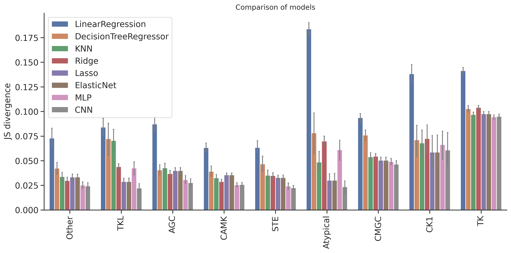

# DL training: Model comparison on T5 feature


<!-- WARNING: THIS FILE WAS AUTOGENERATED! DO NOT EDIT! -->

## Setup

``` python
import numpy as np, pandas as pd
import os, random
from katlas.data import *
from katlas.train import *
from fastai.vision.all import *
from katlas.dnn import *
```

``` python
seed_everything()
```

``` python
def_device
```

    'cuda'

## Data

``` python
df=pd.read_parquet('train/pspa_t5.parquet')
```

``` python
info=Data.get_kinase_info()

info = info[info.pseudo=='0']

info = info[info.kd_ID.notna()]

subfamily_map = info[['kd_ID','subfamily']].drop_duplicates().set_index('kd_ID')['subfamily']
family_map = info[['kd_ID','family']].drop_duplicates().set_index('kd_ID')['family']
group_map = info[['kd_ID','group']].drop_duplicates().set_index('kd_ID')['group']

pspa_info = pd.DataFrame(df.index.tolist(),columns=['kinase'])

pspa_info['subfamily'] = pspa_info.kinase.map(subfamily_map)
pspa_info['family'] = pspa_info.kinase.map(family_map)
pspa_info['group'] = pspa_info.kinase.map(group_map)
```

``` python
df=df.reset_index()
```

``` python
df.columns
```

    Index(['index', '-5P', '-4P', '-3P', '-2P', '-1P', '0P', '1P', '2P', '3P',
           ...
           'T5_1014', 'T5_1015', 'T5_1016', 'T5_1017', 'T5_1018', 'T5_1019',
           'T5_1020', 'T5_1021', 'T5_1022', 'T5_1023'],
          dtype='object', length=1255)

``` python
# column name of feature and target
feat_col = df.columns[df.columns.str.startswith('T5_')]
target_col = df.columns[~df.columns.isin(feat_col)][1:]
```

``` python
feat_col
```

    Index(['T5_0', 'T5_1', 'T5_2', 'T5_3', 'T5_4', 'T5_5', 'T5_6', 'T5_7', 'T5_8',
           'T5_9',
           ...
           'T5_1014', 'T5_1015', 'T5_1016', 'T5_1017', 'T5_1018', 'T5_1019',
           'T5_1020', 'T5_1021', 'T5_1022', 'T5_1023'],
          dtype='object', length=1024)

## Split

``` python
pspa_info.subfamily.value_counts()
```

    subfamily
    Eph      12
    Src      11
    NEK      10
    CK1       7
    STE11     7
             ..
    ZAK       1
    Sev       1
    Ret       1
    Musk      1
    Tie       1
    Name: count, Length: 149, dtype: int64

``` python
pspa_info.family.value_counts()
```

    family
    STE20    27
    CAMKL    20
    CDK      17
    MAPK     12
    Eph      12
             ..
    STK33     1
    Sev       1
    Ret       1
    Musk      1
    Tie       1
    Name: count, Length: 92, dtype: int64

``` python
pspa_info.group.value_counts()
```

    group
    TK          78
    CAMK        57
    CMGC        52
    AGC         52
    Other       49
    STE         39
    TKL         25
    CK1         11
    Atypical     5
    Name: count, dtype: int64

``` python
splits = get_splits(pspa_info, group='group',nfold=9)

split0 = splits[0]
```

    GroupKFold(n_splits=9, random_state=None, shuffle=False)
    # group in train set: 8
    # group in test set: 1

## Dataset

``` python
# dataset
ds = GeneralDataset(df,feat_col,target_col)
```

``` python
len(ds)
```

    368

``` python
dl = DataLoader(ds, batch_size=64, shuffle=True)
```

``` python
xb,yb = next(iter(dl))

xb.shape,yb.shape
```

    (torch.Size([64, 1024]), torch.Size([64, 23, 10]))

## Model

``` python
n_feature = len(feat_col)
n_target = len(target_col)
```

``` python
def get_mlp(): return PSSM_model(n_feature,n_target,model='MLP')

def get_cnn(): return PSSM_model(n_feature,n_target,model='CNN')
```

``` python
model = get_mlp()
```

``` python
logits= model(xb)
```

``` python
logits.shape
```

    torch.Size([64, 23, 10])

## Loss

``` python
CE(logits,yb)
```

    tensor(3.2301, grad_fn=<MeanBackward0>)

## Metrics

``` python
KLD(logits,yb)
```

    tensor(0.4888, grad_fn=<MeanBackward0>)

``` python
JSD(logits,yb)
```

    tensor(0.1021, grad_fn=<MeanBackward0>)

## CV train

> cross-validation

``` python
oof_cnn = train_dl_cv(df,feat_col,target_col,
                  splits = splits,
                  model_func = get_cnn,
                  n_epoch=20,lr=3e-3,save='cnn')
```

    ------fold0------
    lr in training is 0.003

<style>
    /* Turns off some styling */
    progress {
        /* gets rid of default border in Firefox and Opera. */
        border: none;
        /* Needs to be in here for Safari polyfill so background images work as expected. */
        background-size: auto;
    }
    progress:not([value]), progress:not([value])::-webkit-progress-bar {
        background: repeating-linear-gradient(45deg, #7e7e7e, #7e7e7e 10px, #5c5c5c 10px, #5c5c5c 20px);
    }
    .progress-bar-interrupted, .progress-bar-interrupted::-webkit-progress-bar {
        background: #F44336;
    }
</style>

<table class="dataframe" data-quarto-postprocess="true" data-border="1">
<thead>
<tr style="text-align: left;">
<th data-quarto-table-cell-role="th">epoch</th>
<th data-quarto-table-cell-role="th">train_loss</th>
<th data-quarto-table-cell-role="th">valid_loss</th>
<th data-quarto-table-cell-role="th">KLD</th>
<th data-quarto-table-cell-role="th">JSD</th>
<th data-quarto-table-cell-role="th">time</th>
</tr>
</thead>
<tbody>
<tr>
<td>0</td>
<td>3.269060</td>
<td>3.143546</td>
<td>0.404985</td>
<td>0.081564</td>
<td>00:01</td>
</tr>
<tr>
<td>1</td>
<td>3.223662</td>
<td>3.147182</td>
<td>0.408622</td>
<td>0.083544</td>
<td>00:00</td>
</tr>
<tr>
<td>2</td>
<td>3.187536</td>
<td>3.175212</td>
<td>0.436651</td>
<td>0.091066</td>
<td>00:00</td>
</tr>
<tr>
<td>3</td>
<td>3.168146</td>
<td>3.216301</td>
<td>0.477740</td>
<td>0.099706</td>
<td>00:00</td>
</tr>
<tr>
<td>4</td>
<td>3.147557</td>
<td>3.231566</td>
<td>0.493005</td>
<td>0.093356</td>
<td>00:00</td>
</tr>
<tr>
<td>5</td>
<td>3.121749</td>
<td>3.311443</td>
<td>0.572882</td>
<td>0.093714</td>
<td>00:00</td>
</tr>
<tr>
<td>6</td>
<td>3.083850</td>
<td>3.368428</td>
<td>0.629867</td>
<td>0.097433</td>
<td>00:00</td>
</tr>
<tr>
<td>7</td>
<td>3.045823</td>
<td>3.430662</td>
<td>0.692102</td>
<td>0.095945</td>
<td>00:00</td>
</tr>
<tr>
<td>8</td>
<td>3.008982</td>
<td>3.513947</td>
<td>0.775385</td>
<td>0.096181</td>
<td>00:00</td>
</tr>
<tr>
<td>9</td>
<td>2.975007</td>
<td>3.527397</td>
<td>0.788837</td>
<td>0.095878</td>
<td>00:00</td>
</tr>
<tr>
<td>10</td>
<td>2.945746</td>
<td>3.548940</td>
<td>0.810379</td>
<td>0.095623</td>
<td>00:00</td>
</tr>
<tr>
<td>11</td>
<td>2.921519</td>
<td>3.570338</td>
<td>0.831777</td>
<td>0.096343</td>
<td>00:00</td>
</tr>
<tr>
<td>12</td>
<td>2.900580</td>
<td>3.571254</td>
<td>0.832693</td>
<td>0.095262</td>
<td>00:00</td>
</tr>
<tr>
<td>13</td>
<td>2.883183</td>
<td>3.574004</td>
<td>0.835444</td>
<td>0.095764</td>
<td>00:00</td>
</tr>
<tr>
<td>14</td>
<td>2.867993</td>
<td>3.589709</td>
<td>0.851148</td>
<td>0.097328</td>
<td>00:00</td>
</tr>
<tr>
<td>15</td>
<td>2.855134</td>
<td>3.583238</td>
<td>0.844677</td>
<td>0.095302</td>
<td>00:00</td>
</tr>
<tr>
<td>16</td>
<td>2.844318</td>
<td>3.581508</td>
<td>0.842947</td>
<td>0.094802</td>
<td>00:00</td>
</tr>
<tr>
<td>17</td>
<td>2.835052</td>
<td>3.586241</td>
<td>0.847680</td>
<td>0.094904</td>
<td>00:00</td>
</tr>
<tr>
<td>18</td>
<td>2.827313</td>
<td>3.586015</td>
<td>0.847454</td>
<td>0.095045</td>
<td>00:00</td>
</tr>
<tr>
<td>19</td>
<td>2.820956</td>
<td>3.586493</td>
<td>0.847932</td>
<td>0.094981</td>
<td>00:00</td>
</tr>
</tbody>
</table>

<style>
    /* Turns off some styling */
    progress {
        /* gets rid of default border in Firefox and Opera. */
        border: none;
        /* Needs to be in here for Safari polyfill so background images work as expected. */
        background-size: auto;
    }
    progress:not([value]), progress:not([value])::-webkit-progress-bar {
        background: repeating-linear-gradient(45deg, #7e7e7e, #7e7e7e 10px, #5c5c5c 10px, #5c5c5c 20px);
    }
    .progress-bar-interrupted, .progress-bar-interrupted::-webkit-progress-bar {
        background: #F44336;
    }
</style>

    ------fold1------
    lr in training is 0.003

<style>
    /* Turns off some styling */
    progress {
        /* gets rid of default border in Firefox and Opera. */
        border: none;
        /* Needs to be in here for Safari polyfill so background images work as expected. */
        background-size: auto;
    }
    progress:not([value]), progress:not([value])::-webkit-progress-bar {
        background: repeating-linear-gradient(45deg, #7e7e7e, #7e7e7e 10px, #5c5c5c 10px, #5c5c5c 20px);
    }
    .progress-bar-interrupted, .progress-bar-interrupted::-webkit-progress-bar {
        background: #F44336;
    }
</style>

<table class="dataframe" data-quarto-postprocess="true" data-border="1">
<thead>
<tr style="text-align: left;">
<th data-quarto-table-cell-role="th">epoch</th>
<th data-quarto-table-cell-role="th">train_loss</th>
<th data-quarto-table-cell-role="th">valid_loss</th>
<th data-quarto-table-cell-role="th">KLD</th>
<th data-quarto-table-cell-role="th">JSD</th>
<th data-quarto-table-cell-role="th">time</th>
</tr>
</thead>
<tbody>
<tr>
<td>0</td>
<td>3.208314</td>
<td>3.117808</td>
<td>0.358415</td>
<td>0.079423</td>
<td>00:00</td>
</tr>
<tr>
<td>1</td>
<td>3.091133</td>
<td>2.973638</td>
<td>0.214245</td>
<td>0.053701</td>
<td>00:00</td>
</tr>
<tr>
<td>2</td>
<td>3.022374</td>
<td>2.917496</td>
<td>0.158104</td>
<td>0.037164</td>
<td>00:00</td>
</tr>
<tr>
<td>3</td>
<td>2.980688</td>
<td>2.889112</td>
<td>0.129719</td>
<td>0.030823</td>
<td>00:00</td>
</tr>
<tr>
<td>4</td>
<td>2.959795</td>
<td>2.898824</td>
<td>0.139432</td>
<td>0.033074</td>
<td>00:00</td>
</tr>
<tr>
<td>5</td>
<td>2.940522</td>
<td>2.883660</td>
<td>0.124267</td>
<td>0.029325</td>
<td>00:00</td>
</tr>
<tr>
<td>6</td>
<td>2.921029</td>
<td>2.878609</td>
<td>0.119217</td>
<td>0.028216</td>
<td>00:00</td>
</tr>
<tr>
<td>7</td>
<td>2.902735</td>
<td>2.869094</td>
<td>0.109702</td>
<td>0.025721</td>
<td>00:00</td>
</tr>
<tr>
<td>8</td>
<td>2.887330</td>
<td>2.868969</td>
<td>0.109577</td>
<td>0.025599</td>
<td>00:00</td>
</tr>
<tr>
<td>9</td>
<td>2.873613</td>
<td>2.872907</td>
<td>0.113515</td>
<td>0.026461</td>
<td>00:00</td>
</tr>
<tr>
<td>10</td>
<td>2.860784</td>
<td>2.872873</td>
<td>0.113481</td>
<td>0.026225</td>
<td>00:00</td>
</tr>
<tr>
<td>11</td>
<td>2.849614</td>
<td>2.868307</td>
<td>0.108915</td>
<td>0.025198</td>
<td>00:00</td>
</tr>
<tr>
<td>12</td>
<td>2.839491</td>
<td>2.873788</td>
<td>0.114396</td>
<td>0.026422</td>
<td>00:00</td>
</tr>
<tr>
<td>13</td>
<td>2.830676</td>
<td>2.868858</td>
<td>0.109465</td>
<td>0.025601</td>
<td>00:00</td>
</tr>
<tr>
<td>14</td>
<td>2.823313</td>
<td>2.874800</td>
<td>0.115407</td>
<td>0.026648</td>
<td>00:00</td>
</tr>
<tr>
<td>15</td>
<td>2.816295</td>
<td>2.866525</td>
<td>0.107132</td>
<td>0.024936</td>
<td>00:00</td>
</tr>
<tr>
<td>16</td>
<td>2.810380</td>
<td>2.870265</td>
<td>0.110873</td>
<td>0.025660</td>
<td>00:00</td>
</tr>
<tr>
<td>17</td>
<td>2.805311</td>
<td>2.869317</td>
<td>0.109924</td>
<td>0.025484</td>
<td>00:00</td>
</tr>
<tr>
<td>18</td>
<td>2.800941</td>
<td>2.868959</td>
<td>0.109566</td>
<td>0.025435</td>
<td>00:00</td>
</tr>
<tr>
<td>19</td>
<td>2.797494</td>
<td>2.870798</td>
<td>0.111405</td>
<td>0.025791</td>
<td>00:00</td>
</tr>
</tbody>
</table>

<style>
    /* Turns off some styling */
    progress {
        /* gets rid of default border in Firefox and Opera. */
        border: none;
        /* Needs to be in here for Safari polyfill so background images work as expected. */
        background-size: auto;
    }
    progress:not([value]), progress:not([value])::-webkit-progress-bar {
        background: repeating-linear-gradient(45deg, #7e7e7e, #7e7e7e 10px, #5c5c5c 10px, #5c5c5c 20px);
    }
    .progress-bar-interrupted, .progress-bar-interrupted::-webkit-progress-bar {
        background: #F44336;
    }
</style>

    ------fold2------
    lr in training is 0.003

<style>
    /* Turns off some styling */
    progress {
        /* gets rid of default border in Firefox and Opera. */
        border: none;
        /* Needs to be in here for Safari polyfill so background images work as expected. */
        background-size: auto;
    }
    progress:not([value]), progress:not([value])::-webkit-progress-bar {
        background: repeating-linear-gradient(45deg, #7e7e7e, #7e7e7e 10px, #5c5c5c 10px, #5c5c5c 20px);
    }
    .progress-bar-interrupted, .progress-bar-interrupted::-webkit-progress-bar {
        background: #F44336;
    }
</style>

<table class="dataframe" data-quarto-postprocess="true" data-border="1">
<thead>
<tr style="text-align: left;">
<th data-quarto-table-cell-role="th">epoch</th>
<th data-quarto-table-cell-role="th">train_loss</th>
<th data-quarto-table-cell-role="th">valid_loss</th>
<th data-quarto-table-cell-role="th">KLD</th>
<th data-quarto-table-cell-role="th">JSD</th>
<th data-quarto-table-cell-role="th">time</th>
</tr>
</thead>
<tbody>
<tr>
<td>0</td>
<td>3.207323</td>
<td>3.115180</td>
<td>0.398577</td>
<td>0.086718</td>
<td>00:00</td>
</tr>
<tr>
<td>1</td>
<td>3.097981</td>
<td>2.949997</td>
<td>0.233394</td>
<td>0.056430</td>
<td>00:00</td>
</tr>
<tr>
<td>2</td>
<td>3.025096</td>
<td>2.871349</td>
<td>0.154746</td>
<td>0.034154</td>
<td>00:00</td>
</tr>
<tr>
<td>3</td>
<td>2.984505</td>
<td>2.890811</td>
<td>0.174208</td>
<td>0.039029</td>
<td>00:00</td>
</tr>
<tr>
<td>4</td>
<td>2.961992</td>
<td>2.936154</td>
<td>0.219550</td>
<td>0.045950</td>
<td>00:00</td>
</tr>
<tr>
<td>5</td>
<td>2.947332</td>
<td>2.864819</td>
<td>0.148216</td>
<td>0.033121</td>
<td>00:00</td>
</tr>
<tr>
<td>6</td>
<td>2.927917</td>
<td>2.851729</td>
<td>0.135126</td>
<td>0.030623</td>
<td>00:00</td>
</tr>
<tr>
<td>7</td>
<td>2.908772</td>
<td>2.825195</td>
<td>0.108592</td>
<td>0.024916</td>
<td>00:00</td>
</tr>
<tr>
<td>8</td>
<td>2.892562</td>
<td>2.845464</td>
<td>0.128861</td>
<td>0.030083</td>
<td>00:00</td>
</tr>
<tr>
<td>9</td>
<td>2.878802</td>
<td>2.841273</td>
<td>0.124670</td>
<td>0.028827</td>
<td>00:00</td>
</tr>
<tr>
<td>10</td>
<td>2.866316</td>
<td>2.843637</td>
<td>0.127034</td>
<td>0.029812</td>
<td>00:00</td>
</tr>
<tr>
<td>11</td>
<td>2.855637</td>
<td>2.836118</td>
<td>0.119515</td>
<td>0.027748</td>
<td>00:00</td>
</tr>
<tr>
<td>12</td>
<td>2.846589</td>
<td>2.832935</td>
<td>0.116332</td>
<td>0.027080</td>
<td>00:00</td>
</tr>
<tr>
<td>13</td>
<td>2.838424</td>
<td>2.835726</td>
<td>0.119123</td>
<td>0.027565</td>
<td>00:00</td>
</tr>
<tr>
<td>14</td>
<td>2.831281</td>
<td>2.835740</td>
<td>0.119137</td>
<td>0.027858</td>
<td>00:00</td>
</tr>
<tr>
<td>15</td>
<td>2.824760</td>
<td>2.836478</td>
<td>0.119874</td>
<td>0.027920</td>
<td>00:00</td>
</tr>
<tr>
<td>16</td>
<td>2.819135</td>
<td>2.836669</td>
<td>0.120066</td>
<td>0.028054</td>
<td>00:00</td>
</tr>
<tr>
<td>17</td>
<td>2.813901</td>
<td>2.836018</td>
<td>0.119414</td>
<td>0.027880</td>
<td>00:00</td>
</tr>
<tr>
<td>18</td>
<td>2.809481</td>
<td>2.835162</td>
<td>0.118558</td>
<td>0.027623</td>
<td>00:00</td>
</tr>
<tr>
<td>19</td>
<td>2.805690</td>
<td>2.835153</td>
<td>0.118550</td>
<td>0.027605</td>
<td>00:00</td>
</tr>
</tbody>
</table>

<style>
    /* Turns off some styling */
    progress {
        /* gets rid of default border in Firefox and Opera. */
        border: none;
        /* Needs to be in here for Safari polyfill so background images work as expected. */
        background-size: auto;
    }
    progress:not([value]), progress:not([value])::-webkit-progress-bar {
        background: repeating-linear-gradient(45deg, #7e7e7e, #7e7e7e 10px, #5c5c5c 10px, #5c5c5c 20px);
    }
    .progress-bar-interrupted, .progress-bar-interrupted::-webkit-progress-bar {
        background: #F44336;
    }
</style>

    ------fold3------
    lr in training is 0.003

<style>
    /* Turns off some styling */
    progress {
        /* gets rid of default border in Firefox and Opera. */
        border: none;
        /* Needs to be in here for Safari polyfill so background images work as expected. */
        background-size: auto;
    }
    progress:not([value]), progress:not([value])::-webkit-progress-bar {
        background: repeating-linear-gradient(45deg, #7e7e7e, #7e7e7e 10px, #5c5c5c 10px, #5c5c5c 20px);
    }
    .progress-bar-interrupted, .progress-bar-interrupted::-webkit-progress-bar {
        background: #F44336;
    }
</style>

<table class="dataframe" data-quarto-postprocess="true" data-border="1">
<thead>
<tr style="text-align: left;">
<th data-quarto-table-cell-role="th">epoch</th>
<th data-quarto-table-cell-role="th">train_loss</th>
<th data-quarto-table-cell-role="th">valid_loss</th>
<th data-quarto-table-cell-role="th">KLD</th>
<th data-quarto-table-cell-role="th">JSD</th>
<th data-quarto-table-cell-role="th">time</th>
</tr>
</thead>
<tbody>
<tr>
<td>0</td>
<td>3.212164</td>
<td>3.133327</td>
<td>0.442183</td>
<td>0.092641</td>
<td>00:00</td>
</tr>
<tr>
<td>1</td>
<td>3.106295</td>
<td>3.004756</td>
<td>0.313612</td>
<td>0.071707</td>
<td>00:00</td>
</tr>
<tr>
<td>2</td>
<td>3.031961</td>
<td>2.913970</td>
<td>0.222826</td>
<td>0.046670</td>
<td>00:00</td>
</tr>
<tr>
<td>3</td>
<td>2.991078</td>
<td>2.910705</td>
<td>0.219561</td>
<td>0.044440</td>
<td>00:00</td>
</tr>
<tr>
<td>4</td>
<td>2.967807</td>
<td>2.932624</td>
<td>0.241480</td>
<td>0.047336</td>
<td>00:00</td>
</tr>
<tr>
<td>5</td>
<td>2.950043</td>
<td>2.920186</td>
<td>0.229042</td>
<td>0.044831</td>
<td>00:00</td>
</tr>
<tr>
<td>6</td>
<td>2.930707</td>
<td>2.924624</td>
<td>0.233481</td>
<td>0.044545</td>
<td>00:00</td>
</tr>
<tr>
<td>7</td>
<td>2.912056</td>
<td>2.924119</td>
<td>0.232976</td>
<td>0.046182</td>
<td>00:00</td>
</tr>
<tr>
<td>8</td>
<td>2.895589</td>
<td>2.927319</td>
<td>0.236175</td>
<td>0.045777</td>
<td>00:00</td>
</tr>
<tr>
<td>9</td>
<td>2.881679</td>
<td>2.944932</td>
<td>0.253788</td>
<td>0.049072</td>
<td>00:00</td>
</tr>
<tr>
<td>10</td>
<td>2.874621</td>
<td>2.918363</td>
<td>0.227219</td>
<td>0.043250</td>
<td>00:01</td>
</tr>
<tr>
<td>11</td>
<td>2.865599</td>
<td>2.937680</td>
<td>0.246536</td>
<td>0.045307</td>
<td>00:00</td>
</tr>
<tr>
<td>12</td>
<td>2.855621</td>
<td>2.941553</td>
<td>0.250409</td>
<td>0.047418</td>
<td>00:00</td>
</tr>
<tr>
<td>13</td>
<td>2.847044</td>
<td>2.929435</td>
<td>0.238291</td>
<td>0.046189</td>
<td>00:00</td>
</tr>
<tr>
<td>14</td>
<td>2.839755</td>
<td>2.940788</td>
<td>0.249644</td>
<td>0.047378</td>
<td>00:00</td>
</tr>
<tr>
<td>15</td>
<td>2.832605</td>
<td>2.935419</td>
<td>0.244275</td>
<td>0.045755</td>
<td>00:00</td>
</tr>
<tr>
<td>16</td>
<td>2.827509</td>
<td>2.936834</td>
<td>0.245690</td>
<td>0.046259</td>
<td>00:00</td>
</tr>
<tr>
<td>17</td>
<td>2.821800</td>
<td>2.936816</td>
<td>0.245672</td>
<td>0.046310</td>
<td>00:00</td>
</tr>
<tr>
<td>18</td>
<td>2.817129</td>
<td>2.936852</td>
<td>0.245708</td>
<td>0.046441</td>
<td>00:00</td>
</tr>
<tr>
<td>19</td>
<td>2.812903</td>
<td>2.936368</td>
<td>0.245224</td>
<td>0.046412</td>
<td>00:00</td>
</tr>
</tbody>
</table>

<style>
    /* Turns off some styling */
    progress {
        /* gets rid of default border in Firefox and Opera. */
        border: none;
        /* Needs to be in here for Safari polyfill so background images work as expected. */
        background-size: auto;
    }
    progress:not([value]), progress:not([value])::-webkit-progress-bar {
        background: repeating-linear-gradient(45deg, #7e7e7e, #7e7e7e 10px, #5c5c5c 10px, #5c5c5c 20px);
    }
    .progress-bar-interrupted, .progress-bar-interrupted::-webkit-progress-bar {
        background: #F44336;
    }
</style>

    ------fold4------
    lr in training is 0.003

<style>
    /* Turns off some styling */
    progress {
        /* gets rid of default border in Firefox and Opera. */
        border: none;
        /* Needs to be in here for Safari polyfill so background images work as expected. */
        background-size: auto;
    }
    progress:not([value]), progress:not([value])::-webkit-progress-bar {
        background: repeating-linear-gradient(45deg, #7e7e7e, #7e7e7e 10px, #5c5c5c 10px, #5c5c5c 20px);
    }
    .progress-bar-interrupted, .progress-bar-interrupted::-webkit-progress-bar {
        background: #F44336;
    }
</style>

<table class="dataframe" data-quarto-postprocess="true" data-border="1">
<thead>
<tr style="text-align: left;">
<th data-quarto-table-cell-role="th">epoch</th>
<th data-quarto-table-cell-role="th">train_loss</th>
<th data-quarto-table-cell-role="th">valid_loss</th>
<th data-quarto-table-cell-role="th">KLD</th>
<th data-quarto-table-cell-role="th">JSD</th>
<th data-quarto-table-cell-role="th">time</th>
</tr>
</thead>
<tbody>
<tr>
<td>0</td>
<td>3.194703</td>
<td>3.130977</td>
<td>0.341532</td>
<td>0.074929</td>
<td>00:00</td>
</tr>
<tr>
<td>1</td>
<td>3.085588</td>
<td>2.979797</td>
<td>0.190353</td>
<td>0.049329</td>
<td>00:00</td>
</tr>
<tr>
<td>2</td>
<td>3.013181</td>
<td>2.915592</td>
<td>0.126147</td>
<td>0.030893</td>
<td>00:00</td>
</tr>
<tr>
<td>3</td>
<td>2.973877</td>
<td>2.928494</td>
<td>0.139050</td>
<td>0.034132</td>
<td>00:00</td>
</tr>
<tr>
<td>4</td>
<td>2.948701</td>
<td>2.913154</td>
<td>0.123709</td>
<td>0.029253</td>
<td>00:00</td>
</tr>
<tr>
<td>5</td>
<td>2.930085</td>
<td>2.901232</td>
<td>0.111787</td>
<td>0.026251</td>
<td>00:00</td>
</tr>
<tr>
<td>6</td>
<td>2.916653</td>
<td>2.904090</td>
<td>0.114645</td>
<td>0.026807</td>
<td>00:00</td>
</tr>
<tr>
<td>7</td>
<td>2.899753</td>
<td>2.907431</td>
<td>0.117986</td>
<td>0.027358</td>
<td>00:00</td>
</tr>
<tr>
<td>8</td>
<td>2.883612</td>
<td>2.907530</td>
<td>0.118085</td>
<td>0.027281</td>
<td>00:00</td>
</tr>
<tr>
<td>9</td>
<td>2.868085</td>
<td>2.901319</td>
<td>0.111874</td>
<td>0.025705</td>
<td>00:00</td>
</tr>
<tr>
<td>10</td>
<td>2.853968</td>
<td>2.900857</td>
<td>0.111413</td>
<td>0.025969</td>
<td>00:00</td>
</tr>
<tr>
<td>11</td>
<td>2.842516</td>
<td>2.899069</td>
<td>0.109624</td>
<td>0.025252</td>
<td>00:00</td>
</tr>
<tr>
<td>12</td>
<td>2.832248</td>
<td>2.896469</td>
<td>0.107024</td>
<td>0.024881</td>
<td>00:00</td>
</tr>
<tr>
<td>13</td>
<td>2.823528</td>
<td>2.895822</td>
<td>0.106378</td>
<td>0.024758</td>
<td>-1:59:59</td>
</tr>
<tr>
<td>14</td>
<td>2.815598</td>
<td>2.892243</td>
<td>0.102798</td>
<td>0.023783</td>
<td>00:00</td>
</tr>
<tr>
<td>15</td>
<td>2.809208</td>
<td>2.894634</td>
<td>0.105189</td>
<td>0.024339</td>
<td>00:00</td>
</tr>
<tr>
<td>16</td>
<td>2.803236</td>
<td>2.895056</td>
<td>0.105612</td>
<td>0.024392</td>
<td>00:00</td>
</tr>
<tr>
<td>17</td>
<td>2.798623</td>
<td>2.894188</td>
<td>0.104743</td>
<td>0.024226</td>
<td>00:00</td>
</tr>
<tr>
<td>18</td>
<td>2.794693</td>
<td>2.894770</td>
<td>0.105325</td>
<td>0.024397</td>
<td>00:00</td>
</tr>
<tr>
<td>19</td>
<td>2.790938</td>
<td>2.894322</td>
<td>0.104877</td>
<td>0.024302</td>
<td>00:00</td>
</tr>
</tbody>
</table>

<style>
    /* Turns off some styling */
    progress {
        /* gets rid of default border in Firefox and Opera. */
        border: none;
        /* Needs to be in here for Safari polyfill so background images work as expected. */
        background-size: auto;
    }
    progress:not([value]), progress:not([value])::-webkit-progress-bar {
        background: repeating-linear-gradient(45deg, #7e7e7e, #7e7e7e 10px, #5c5c5c 10px, #5c5c5c 20px);
    }
    .progress-bar-interrupted, .progress-bar-interrupted::-webkit-progress-bar {
        background: #F44336;
    }
</style>

    ------fold5------
    lr in training is 0.003

<style>
    /* Turns off some styling */
    progress {
        /* gets rid of default border in Firefox and Opera. */
        border: none;
        /* Needs to be in here for Safari polyfill so background images work as expected. */
        background-size: auto;
    }
    progress:not([value]), progress:not([value])::-webkit-progress-bar {
        background: repeating-linear-gradient(45deg, #7e7e7e, #7e7e7e 10px, #5c5c5c 10px, #5c5c5c 20px);
    }
    .progress-bar-interrupted, .progress-bar-interrupted::-webkit-progress-bar {
        background: #F44336;
    }
</style>

<table class="dataframe" data-quarto-postprocess="true" data-border="1">
<thead>
<tr style="text-align: left;">
<th data-quarto-table-cell-role="th">epoch</th>
<th data-quarto-table-cell-role="th">train_loss</th>
<th data-quarto-table-cell-role="th">valid_loss</th>
<th data-quarto-table-cell-role="th">KLD</th>
<th data-quarto-table-cell-role="th">JSD</th>
<th data-quarto-table-cell-role="th">time</th>
</tr>
</thead>
<tbody>
<tr>
<td>0</td>
<td>3.199997</td>
<td>3.129761</td>
<td>0.340951</td>
<td>0.074561</td>
<td>00:00</td>
</tr>
<tr>
<td>1</td>
<td>3.075929</td>
<td>2.966693</td>
<td>0.177883</td>
<td>0.046553</td>
<td>00:00</td>
</tr>
<tr>
<td>2</td>
<td>3.002883</td>
<td>2.903497</td>
<td>0.114686</td>
<td>0.028490</td>
<td>00:00</td>
</tr>
<tr>
<td>3</td>
<td>2.964937</td>
<td>2.902469</td>
<td>0.113658</td>
<td>0.027166</td>
<td>00:00</td>
</tr>
<tr>
<td>4</td>
<td>2.942972</td>
<td>2.900843</td>
<td>0.112033</td>
<td>0.027254</td>
<td>00:00</td>
</tr>
<tr>
<td>5</td>
<td>2.928877</td>
<td>2.899299</td>
<td>0.110489</td>
<td>0.027179</td>
<td>00:00</td>
</tr>
<tr>
<td>6</td>
<td>2.910979</td>
<td>2.892999</td>
<td>0.104189</td>
<td>0.025580</td>
<td>00:00</td>
</tr>
<tr>
<td>7</td>
<td>2.892474</td>
<td>2.903407</td>
<td>0.114597</td>
<td>0.027419</td>
<td>00:00</td>
</tr>
<tr>
<td>8</td>
<td>2.876405</td>
<td>2.880818</td>
<td>0.092008</td>
<td>0.022334</td>
<td>00:00</td>
</tr>
<tr>
<td>9</td>
<td>2.861168</td>
<td>2.885040</td>
<td>0.096230</td>
<td>0.023397</td>
<td>00:00</td>
</tr>
<tr>
<td>10</td>
<td>2.848615</td>
<td>2.875726</td>
<td>0.086915</td>
<td>0.021212</td>
<td>00:00</td>
</tr>
<tr>
<td>11</td>
<td>2.838090</td>
<td>2.879966</td>
<td>0.091155</td>
<td>0.021947</td>
<td>00:00</td>
</tr>
<tr>
<td>12</td>
<td>2.829193</td>
<td>2.876115</td>
<td>0.087305</td>
<td>0.021194</td>
<td>00:00</td>
</tr>
<tr>
<td>13</td>
<td>2.820646</td>
<td>2.882905</td>
<td>0.094094</td>
<td>0.023022</td>
<td>00:00</td>
</tr>
<tr>
<td>14</td>
<td>2.813677</td>
<td>2.882934</td>
<td>0.094123</td>
<td>0.022730</td>
<td>00:00</td>
</tr>
<tr>
<td>15</td>
<td>2.807501</td>
<td>2.883899</td>
<td>0.095089</td>
<td>0.023176</td>
<td>00:00</td>
</tr>
<tr>
<td>16</td>
<td>2.801921</td>
<td>2.882332</td>
<td>0.093521</td>
<td>0.022763</td>
<td>00:00</td>
</tr>
<tr>
<td>17</td>
<td>2.797628</td>
<td>2.881665</td>
<td>0.092854</td>
<td>0.022552</td>
<td>00:00</td>
</tr>
<tr>
<td>18</td>
<td>2.793886</td>
<td>2.882133</td>
<td>0.093322</td>
<td>0.022644</td>
<td>00:01</td>
</tr>
<tr>
<td>19</td>
<td>2.790486</td>
<td>2.881597</td>
<td>0.092787</td>
<td>0.022498</td>
<td>00:00</td>
</tr>
</tbody>
</table>

<style>
    /* Turns off some styling */
    progress {
        /* gets rid of default border in Firefox and Opera. */
        border: none;
        /* Needs to be in here for Safari polyfill so background images work as expected. */
        background-size: auto;
    }
    progress:not([value]), progress:not([value])::-webkit-progress-bar {
        background: repeating-linear-gradient(45deg, #7e7e7e, #7e7e7e 10px, #5c5c5c 10px, #5c5c5c 20px);
    }
    .progress-bar-interrupted, .progress-bar-interrupted::-webkit-progress-bar {
        background: #F44336;
    }
</style>

    ------fold6------
    lr in training is 0.003

<style>
    /* Turns off some styling */
    progress {
        /* gets rid of default border in Firefox and Opera. */
        border: none;
        /* Needs to be in here for Safari polyfill so background images work as expected. */
        background-size: auto;
    }
    progress:not([value]), progress:not([value])::-webkit-progress-bar {
        background: repeating-linear-gradient(45deg, #7e7e7e, #7e7e7e 10px, #5c5c5c 10px, #5c5c5c 20px);
    }
    .progress-bar-interrupted, .progress-bar-interrupted::-webkit-progress-bar {
        background: #F44336;
    }
</style>

<table class="dataframe" data-quarto-postprocess="true" data-border="1">
<thead>
<tr style="text-align: left;">
<th data-quarto-table-cell-role="th">epoch</th>
<th data-quarto-table-cell-role="th">train_loss</th>
<th data-quarto-table-cell-role="th">valid_loss</th>
<th data-quarto-table-cell-role="th">KLD</th>
<th data-quarto-table-cell-role="th">JSD</th>
<th data-quarto-table-cell-role="th">time</th>
</tr>
</thead>
<tbody>
<tr>
<td>0</td>
<td>3.194320</td>
<td>3.125801</td>
<td>0.310535</td>
<td>0.070329</td>
<td>00:00</td>
</tr>
<tr>
<td>1</td>
<td>3.076676</td>
<td>2.948623</td>
<td>0.133357</td>
<td>0.035381</td>
<td>00:00</td>
</tr>
<tr>
<td>2</td>
<td>3.005836</td>
<td>2.954429</td>
<td>0.139163</td>
<td>0.032063</td>
<td>00:00</td>
</tr>
<tr>
<td>3</td>
<td>2.967523</td>
<td>2.950755</td>
<td>0.135489</td>
<td>0.031137</td>
<td>00:00</td>
</tr>
<tr>
<td>4</td>
<td>2.949190</td>
<td>2.935955</td>
<td>0.120688</td>
<td>0.028899</td>
<td>00:00</td>
</tr>
<tr>
<td>5</td>
<td>2.929599</td>
<td>2.925230</td>
<td>0.109964</td>
<td>0.024822</td>
<td>00:00</td>
</tr>
<tr>
<td>6</td>
<td>2.909208</td>
<td>2.916939</td>
<td>0.101673</td>
<td>0.023810</td>
<td>00:00</td>
</tr>
<tr>
<td>7</td>
<td>2.889302</td>
<td>2.964673</td>
<td>0.149406</td>
<td>0.034152</td>
<td>00:00</td>
</tr>
<tr>
<td>8</td>
<td>2.872472</td>
<td>3.053467</td>
<td>0.238200</td>
<td>0.041788</td>
<td>00:00</td>
</tr>
<tr>
<td>9</td>
<td>2.857490</td>
<td>3.030991</td>
<td>0.215725</td>
<td>0.038701</td>
<td>00:00</td>
</tr>
<tr>
<td>10</td>
<td>2.845153</td>
<td>3.009413</td>
<td>0.194146</td>
<td>0.038094</td>
<td>00:00</td>
</tr>
<tr>
<td>11</td>
<td>2.834631</td>
<td>3.039492</td>
<td>0.224225</td>
<td>0.040353</td>
<td>00:00</td>
</tr>
<tr>
<td>12</td>
<td>2.826049</td>
<td>2.916903</td>
<td>0.101637</td>
<td>0.023530</td>
<td>00:00</td>
</tr>
<tr>
<td>13</td>
<td>2.818126</td>
<td>2.911845</td>
<td>0.096579</td>
<td>0.022495</td>
<td>00:00</td>
</tr>
<tr>
<td>14</td>
<td>2.811524</td>
<td>2.914006</td>
<td>0.098740</td>
<td>0.023023</td>
<td>00:00</td>
</tr>
<tr>
<td>15</td>
<td>2.805404</td>
<td>2.909503</td>
<td>0.094237</td>
<td>0.022106</td>
<td>00:00</td>
</tr>
<tr>
<td>16</td>
<td>2.800207</td>
<td>2.909804</td>
<td>0.094538</td>
<td>0.022054</td>
<td>00:00</td>
</tr>
<tr>
<td>17</td>
<td>2.796073</td>
<td>2.910941</td>
<td>0.095674</td>
<td>0.022245</td>
<td>00:00</td>
</tr>
<tr>
<td>18</td>
<td>2.792119</td>
<td>2.911169</td>
<td>0.095903</td>
<td>0.022274</td>
<td>00:00</td>
</tr>
<tr>
<td>19</td>
<td>2.788670</td>
<td>2.910234</td>
<td>0.094968</td>
<td>0.022100</td>
<td>00:00</td>
</tr>
</tbody>
</table>

<style>
    /* Turns off some styling */
    progress {
        /* gets rid of default border in Firefox and Opera. */
        border: none;
        /* Needs to be in here for Safari polyfill so background images work as expected. */
        background-size: auto;
    }
    progress:not([value]), progress:not([value])::-webkit-progress-bar {
        background: repeating-linear-gradient(45deg, #7e7e7e, #7e7e7e 10px, #5c5c5c 10px, #5c5c5c 20px);
    }
    .progress-bar-interrupted, .progress-bar-interrupted::-webkit-progress-bar {
        background: #F44336;
    }
</style>

    ------fold7------
    lr in training is 0.003

<style>
    /* Turns off some styling */
    progress {
        /* gets rid of default border in Firefox and Opera. */
        border: none;
        /* Needs to be in here for Safari polyfill so background images work as expected. */
        background-size: auto;
    }
    progress:not([value]), progress:not([value])::-webkit-progress-bar {
        background: repeating-linear-gradient(45deg, #7e7e7e, #7e7e7e 10px, #5c5c5c 10px, #5c5c5c 20px);
    }
    .progress-bar-interrupted, .progress-bar-interrupted::-webkit-progress-bar {
        background: #F44336;
    }
</style>

<table class="dataframe" data-quarto-postprocess="true" data-border="1">
<thead>
<tr style="text-align: left;">
<th data-quarto-table-cell-role="th">epoch</th>
<th data-quarto-table-cell-role="th">train_loss</th>
<th data-quarto-table-cell-role="th">valid_loss</th>
<th data-quarto-table-cell-role="th">KLD</th>
<th data-quarto-table-cell-role="th">JSD</th>
<th data-quarto-table-cell-role="th">time</th>
</tr>
</thead>
<tbody>
<tr>
<td>0</td>
<td>3.193444</td>
<td>3.132987</td>
<td>0.470942</td>
<td>0.100316</td>
<td>00:00</td>
</tr>
<tr>
<td>1</td>
<td>3.075158</td>
<td>2.953928</td>
<td>0.291882</td>
<td>0.064369</td>
<td>00:00</td>
</tr>
<tr>
<td>2</td>
<td>3.004199</td>
<td>2.975640</td>
<td>0.313595</td>
<td>0.064038</td>
<td>00:00</td>
</tr>
<tr>
<td>3</td>
<td>2.964350</td>
<td>3.090348</td>
<td>0.428302</td>
<td>0.083974</td>
<td>00:00</td>
</tr>
<tr>
<td>4</td>
<td>2.943624</td>
<td>3.035332</td>
<td>0.373287</td>
<td>0.070942</td>
<td>00:00</td>
</tr>
<tr>
<td>5</td>
<td>2.922046</td>
<td>2.968457</td>
<td>0.306412</td>
<td>0.065235</td>
<td>00:00</td>
</tr>
<tr>
<td>6</td>
<td>2.901327</td>
<td>2.954379</td>
<td>0.292333</td>
<td>0.065219</td>
<td>-1:59:59</td>
</tr>
<tr>
<td>7</td>
<td>2.882046</td>
<td>2.925243</td>
<td>0.263198</td>
<td>0.060871</td>
<td>00:00</td>
</tr>
<tr>
<td>8</td>
<td>2.866063</td>
<td>2.936579</td>
<td>0.274533</td>
<td>0.064218</td>
<td>00:00</td>
</tr>
<tr>
<td>9</td>
<td>2.852979</td>
<td>2.945917</td>
<td>0.283871</td>
<td>0.062147</td>
<td>00:00</td>
</tr>
<tr>
<td>10</td>
<td>2.841709</td>
<td>2.916834</td>
<td>0.254789</td>
<td>0.060364</td>
<td>00:00</td>
</tr>
<tr>
<td>11</td>
<td>2.832586</td>
<td>2.954140</td>
<td>0.292095</td>
<td>0.063815</td>
<td>00:00</td>
</tr>
<tr>
<td>12</td>
<td>2.824114</td>
<td>2.961896</td>
<td>0.299851</td>
<td>0.067524</td>
<td>00:00</td>
</tr>
<tr>
<td>13</td>
<td>2.816724</td>
<td>2.930872</td>
<td>0.268827</td>
<td>0.059107</td>
<td>00:00</td>
</tr>
<tr>
<td>14</td>
<td>2.810433</td>
<td>2.924781</td>
<td>0.262736</td>
<td>0.060047</td>
<td>00:00</td>
</tr>
<tr>
<td>15</td>
<td>2.805051</td>
<td>2.928467</td>
<td>0.266421</td>
<td>0.059658</td>
<td>00:00</td>
</tr>
<tr>
<td>16</td>
<td>2.800364</td>
<td>2.932495</td>
<td>0.270450</td>
<td>0.060461</td>
<td>00:00</td>
</tr>
<tr>
<td>17</td>
<td>2.796210</td>
<td>2.934587</td>
<td>0.272542</td>
<td>0.060946</td>
<td>00:00</td>
</tr>
<tr>
<td>18</td>
<td>2.793103</td>
<td>2.929379</td>
<td>0.267334</td>
<td>0.060319</td>
<td>00:00</td>
</tr>
<tr>
<td>19</td>
<td>2.790570</td>
<td>2.931830</td>
<td>0.269785</td>
<td>0.060809</td>
<td>00:00</td>
</tr>
</tbody>
</table>

<style>
    /* Turns off some styling */
    progress {
        /* gets rid of default border in Firefox and Opera. */
        border: none;
        /* Needs to be in here for Safari polyfill so background images work as expected. */
        background-size: auto;
    }
    progress:not([value]), progress:not([value])::-webkit-progress-bar {
        background: repeating-linear-gradient(45deg, #7e7e7e, #7e7e7e 10px, #5c5c5c 10px, #5c5c5c 20px);
    }
    .progress-bar-interrupted, .progress-bar-interrupted::-webkit-progress-bar {
        background: #F44336;
    }
</style>

    ------fold8------
    lr in training is 0.003

<style>
    /* Turns off some styling */
    progress {
        /* gets rid of default border in Firefox and Opera. */
        border: none;
        /* Needs to be in here for Safari polyfill so background images work as expected. */
        background-size: auto;
    }
    progress:not([value]), progress:not([value])::-webkit-progress-bar {
        background: repeating-linear-gradient(45deg, #7e7e7e, #7e7e7e 10px, #5c5c5c 10px, #5c5c5c 20px);
    }
    .progress-bar-interrupted, .progress-bar-interrupted::-webkit-progress-bar {
        background: #F44336;
    }
</style>

<table class="dataframe" data-quarto-postprocess="true" data-border="1">
<thead>
<tr style="text-align: left;">
<th data-quarto-table-cell-role="th">epoch</th>
<th data-quarto-table-cell-role="th">train_loss</th>
<th data-quarto-table-cell-role="th">valid_loss</th>
<th data-quarto-table-cell-role="th">KLD</th>
<th data-quarto-table-cell-role="th">JSD</th>
<th data-quarto-table-cell-role="th">time</th>
</tr>
</thead>
<tbody>
<tr>
<td>0</td>
<td>3.204390</td>
<td>3.128783</td>
<td>0.330651</td>
<td>0.071957</td>
<td>00:00</td>
</tr>
<tr>
<td>1</td>
<td>3.082807</td>
<td>2.936002</td>
<td>0.137870</td>
<td>0.031859</td>
<td>00:00</td>
</tr>
<tr>
<td>2</td>
<td>3.005090</td>
<td>2.969775</td>
<td>0.171644</td>
<td>0.036953</td>
<td>00:00</td>
</tr>
<tr>
<td>3</td>
<td>2.965562</td>
<td>2.997628</td>
<td>0.199497</td>
<td>0.044284</td>
<td>00:00</td>
</tr>
<tr>
<td>4</td>
<td>2.942865</td>
<td>2.932713</td>
<td>0.134581</td>
<td>0.028845</td>
<td>00:00</td>
</tr>
<tr>
<td>5</td>
<td>2.922158</td>
<td>2.932485</td>
<td>0.134353</td>
<td>0.029581</td>
<td>00:00</td>
</tr>
<tr>
<td>6</td>
<td>2.903975</td>
<td>2.920239</td>
<td>0.122107</td>
<td>0.026156</td>
<td>00:00</td>
</tr>
<tr>
<td>7</td>
<td>2.885199</td>
<td>2.901689</td>
<td>0.103558</td>
<td>0.022120</td>
<td>00:00</td>
</tr>
<tr>
<td>8</td>
<td>2.868658</td>
<td>2.909636</td>
<td>0.111505</td>
<td>0.023997</td>
<td>00:00</td>
</tr>
<tr>
<td>9</td>
<td>2.854479</td>
<td>2.915422</td>
<td>0.117290</td>
<td>0.025359</td>
<td>00:00</td>
</tr>
<tr>
<td>10</td>
<td>2.842377</td>
<td>2.908000</td>
<td>0.109868</td>
<td>0.023234</td>
<td>00:00</td>
</tr>
<tr>
<td>11</td>
<td>2.833321</td>
<td>2.904814</td>
<td>0.106682</td>
<td>0.023166</td>
<td>00:00</td>
</tr>
<tr>
<td>12</td>
<td>2.824632</td>
<td>2.907447</td>
<td>0.109316</td>
<td>0.024112</td>
<td>00:00</td>
</tr>
<tr>
<td>13</td>
<td>2.817395</td>
<td>2.901404</td>
<td>0.103273</td>
<td>0.022250</td>
<td>00:00</td>
</tr>
<tr>
<td>14</td>
<td>2.811185</td>
<td>2.907396</td>
<td>0.109264</td>
<td>0.023505</td>
<td>00:00</td>
</tr>
<tr>
<td>15</td>
<td>2.805175</td>
<td>2.903952</td>
<td>0.105820</td>
<td>0.022850</td>
<td>00:00</td>
</tr>
<tr>
<td>16</td>
<td>2.799963</td>
<td>2.907275</td>
<td>0.109143</td>
<td>0.023509</td>
<td>00:00</td>
</tr>
<tr>
<td>17</td>
<td>2.795720</td>
<td>2.908115</td>
<td>0.109983</td>
<td>0.023676</td>
<td>00:00</td>
</tr>
<tr>
<td>18</td>
<td>2.792551</td>
<td>2.907698</td>
<td>0.109566</td>
<td>0.023603</td>
<td>00:00</td>
</tr>
<tr>
<td>19</td>
<td>2.790073</td>
<td>2.907019</td>
<td>0.108887</td>
<td>0.023489</td>
<td>00:00</td>
</tr>
</tbody>
</table>

<style>
    /* Turns off some styling */
    progress {
        /* gets rid of default border in Firefox and Opera. */
        border: none;
        /* Needs to be in here for Safari polyfill so background images work as expected. */
        background-size: auto;
    }
    progress:not([value]), progress:not([value])::-webkit-progress-bar {
        background: repeating-linear-gradient(45deg, #7e7e7e, #7e7e7e 10px, #5c5c5c 10px, #5c5c5c 20px);
    }
    .progress-bar-interrupted, .progress-bar-interrupted::-webkit-progress-bar {
        background: #F44336;
    }
</style>

``` python
oof_mlp = train_dl_cv(df,feat_col,target_col,
                  splits = splits,
                  model_func = get_mlp,
                  n_epoch=20,lr=3e-3,save='mlp')
```

    ------fold0------
    lr in training is 0.003

<style>
    /* Turns off some styling */
    progress {
        /* gets rid of default border in Firefox and Opera. */
        border: none;
        /* Needs to be in here for Safari polyfill so background images work as expected. */
        background-size: auto;
    }
    progress:not([value]), progress:not([value])::-webkit-progress-bar {
        background: repeating-linear-gradient(45deg, #7e7e7e, #7e7e7e 10px, #5c5c5c 10px, #5c5c5c 20px);
    }
    .progress-bar-interrupted, .progress-bar-interrupted::-webkit-progress-bar {
        background: #F44336;
    }
</style>

<table class="dataframe" data-quarto-postprocess="true" data-border="1">
<thead>
<tr style="text-align: left;">
<th data-quarto-table-cell-role="th">epoch</th>
<th data-quarto-table-cell-role="th">train_loss</th>
<th data-quarto-table-cell-role="th">valid_loss</th>
<th data-quarto-table-cell-role="th">KLD</th>
<th data-quarto-table-cell-role="th">JSD</th>
<th data-quarto-table-cell-role="th">time</th>
</tr>
</thead>
<tbody>
<tr>
<td>0</td>
<td>3.171476</td>
<td>3.139420</td>
<td>0.400859</td>
<td>0.080985</td>
<td>00:00</td>
</tr>
<tr>
<td>1</td>
<td>3.106711</td>
<td>3.147713</td>
<td>0.409152</td>
<td>0.082218</td>
<td>00:00</td>
</tr>
<tr>
<td>2</td>
<td>3.038125</td>
<td>3.160561</td>
<td>0.422000</td>
<td>0.083707</td>
<td>00:00</td>
</tr>
<tr>
<td>3</td>
<td>2.976095</td>
<td>3.189467</td>
<td>0.450906</td>
<td>0.085103</td>
<td>00:00</td>
</tr>
<tr>
<td>4</td>
<td>2.928933</td>
<td>3.253317</td>
<td>0.514757</td>
<td>0.087918</td>
<td>00:00</td>
</tr>
<tr>
<td>5</td>
<td>2.895859</td>
<td>3.290741</td>
<td>0.552180</td>
<td>0.087818</td>
<td>00:00</td>
</tr>
<tr>
<td>6</td>
<td>2.871152</td>
<td>3.370811</td>
<td>0.632249</td>
<td>0.091517</td>
<td>00:00</td>
</tr>
<tr>
<td>7</td>
<td>2.852960</td>
<td>3.411198</td>
<td>0.672637</td>
<td>0.090949</td>
<td>00:00</td>
</tr>
<tr>
<td>8</td>
<td>2.838817</td>
<td>3.496814</td>
<td>0.758253</td>
<td>0.091359</td>
<td>00:00</td>
</tr>
<tr>
<td>9</td>
<td>2.827737</td>
<td>3.521644</td>
<td>0.783083</td>
<td>0.093565</td>
<td>00:00</td>
</tr>
<tr>
<td>10</td>
<td>2.818174</td>
<td>3.498032</td>
<td>0.759471</td>
<td>0.093064</td>
<td>00:00</td>
</tr>
<tr>
<td>11</td>
<td>2.810489</td>
<td>3.504961</td>
<td>0.766400</td>
<td>0.094115</td>
<td>00:00</td>
</tr>
<tr>
<td>12</td>
<td>2.803670</td>
<td>3.508696</td>
<td>0.770135</td>
<td>0.092760</td>
<td>00:00</td>
</tr>
<tr>
<td>13</td>
<td>2.797866</td>
<td>3.541964</td>
<td>0.803403</td>
<td>0.094965</td>
<td>00:00</td>
</tr>
<tr>
<td>14</td>
<td>2.792816</td>
<td>3.547325</td>
<td>0.808764</td>
<td>0.094005</td>
<td>00:00</td>
</tr>
<tr>
<td>15</td>
<td>2.788567</td>
<td>3.548905</td>
<td>0.810344</td>
<td>0.094359</td>
<td>00:00</td>
</tr>
<tr>
<td>16</td>
<td>2.784840</td>
<td>3.552236</td>
<td>0.813675</td>
<td>0.094531</td>
<td>00:00</td>
</tr>
<tr>
<td>17</td>
<td>2.781688</td>
<td>3.556740</td>
<td>0.818179</td>
<td>0.094105</td>
<td>00:00</td>
</tr>
<tr>
<td>18</td>
<td>2.779126</td>
<td>3.557160</td>
<td>0.818599</td>
<td>0.094202</td>
<td>00:00</td>
</tr>
<tr>
<td>19</td>
<td>2.776936</td>
<td>3.562564</td>
<td>0.824003</td>
<td>0.094342</td>
<td>00:00</td>
</tr>
</tbody>
</table>

<style>
    /* Turns off some styling */
    progress {
        /* gets rid of default border in Firefox and Opera. */
        border: none;
        /* Needs to be in here for Safari polyfill so background images work as expected. */
        background-size: auto;
    }
    progress:not([value]), progress:not([value])::-webkit-progress-bar {
        background: repeating-linear-gradient(45deg, #7e7e7e, #7e7e7e 10px, #5c5c5c 10px, #5c5c5c 20px);
    }
    .progress-bar-interrupted, .progress-bar-interrupted::-webkit-progress-bar {
        background: #F44336;
    }
</style>

    ------fold1------
    lr in training is 0.003

<style>
    /* Turns off some styling */
    progress {
        /* gets rid of default border in Firefox and Opera. */
        border: none;
        /* Needs to be in here for Safari polyfill so background images work as expected. */
        background-size: auto;
    }
    progress:not([value]), progress:not([value])::-webkit-progress-bar {
        background: repeating-linear-gradient(45deg, #7e7e7e, #7e7e7e 10px, #5c5c5c 10px, #5c5c5c 20px);
    }
    .progress-bar-interrupted, .progress-bar-interrupted::-webkit-progress-bar {
        background: #F44336;
    }
</style>

<table class="dataframe" data-quarto-postprocess="true" data-border="1">
<thead>
<tr style="text-align: left;">
<th data-quarto-table-cell-role="th">epoch</th>
<th data-quarto-table-cell-role="th">train_loss</th>
<th data-quarto-table-cell-role="th">valid_loss</th>
<th data-quarto-table-cell-role="th">KLD</th>
<th data-quarto-table-cell-role="th">JSD</th>
<th data-quarto-table-cell-role="th">time</th>
</tr>
</thead>
<tbody>
<tr>
<td>0</td>
<td>3.138040</td>
<td>3.135045</td>
<td>0.375653</td>
<td>0.082271</td>
<td>00:00</td>
</tr>
<tr>
<td>1</td>
<td>3.054276</td>
<td>3.113542</td>
<td>0.354149</td>
<td>0.079574</td>
<td>00:00</td>
</tr>
<tr>
<td>2</td>
<td>2.989687</td>
<td>3.048094</td>
<td>0.288702</td>
<td>0.069778</td>
<td>00:00</td>
</tr>
<tr>
<td>3</td>
<td>2.937330</td>
<td>2.952537</td>
<td>0.193145</td>
<td>0.050103</td>
<td>-1:59:59</td>
</tr>
<tr>
<td>4</td>
<td>2.901045</td>
<td>2.872171</td>
<td>0.112778</td>
<td>0.028355</td>
<td>00:00</td>
</tr>
<tr>
<td>5</td>
<td>2.875492</td>
<td>2.863093</td>
<td>0.103700</td>
<td>0.025160</td>
<td>00:00</td>
</tr>
<tr>
<td>6</td>
<td>2.856277</td>
<td>2.865705</td>
<td>0.106313</td>
<td>0.025039</td>
<td>00:00</td>
</tr>
<tr>
<td>7</td>
<td>2.840961</td>
<td>2.864216</td>
<td>0.104823</td>
<td>0.024369</td>
<td>00:00</td>
</tr>
<tr>
<td>8</td>
<td>2.829274</td>
<td>2.864235</td>
<td>0.104842</td>
<td>0.024402</td>
<td>00:00</td>
</tr>
<tr>
<td>9</td>
<td>2.820478</td>
<td>2.877947</td>
<td>0.118554</td>
<td>0.027575</td>
<td>00:00</td>
</tr>
<tr>
<td>10</td>
<td>2.812226</td>
<td>2.873299</td>
<td>0.113906</td>
<td>0.026126</td>
<td>00:00</td>
</tr>
<tr>
<td>11</td>
<td>2.806044</td>
<td>2.869767</td>
<td>0.110374</td>
<td>0.025534</td>
<td>00:00</td>
</tr>
<tr>
<td>12</td>
<td>2.800019</td>
<td>2.872890</td>
<td>0.113498</td>
<td>0.026378</td>
<td>00:00</td>
</tr>
<tr>
<td>13</td>
<td>2.794942</td>
<td>2.871101</td>
<td>0.111708</td>
<td>0.025842</td>
<td>00:00</td>
</tr>
<tr>
<td>14</td>
<td>2.790824</td>
<td>2.871950</td>
<td>0.112557</td>
<td>0.025829</td>
<td>00:00</td>
</tr>
<tr>
<td>15</td>
<td>2.786819</td>
<td>2.872271</td>
<td>0.112878</td>
<td>0.025944</td>
<td>00:00</td>
</tr>
<tr>
<td>16</td>
<td>2.783419</td>
<td>2.869001</td>
<td>0.109609</td>
<td>0.025354</td>
<td>00:00</td>
</tr>
<tr>
<td>17</td>
<td>2.780620</td>
<td>2.871257</td>
<td>0.111865</td>
<td>0.025823</td>
<td>00:00</td>
</tr>
<tr>
<td>18</td>
<td>2.778407</td>
<td>2.871228</td>
<td>0.111836</td>
<td>0.025827</td>
<td>00:00</td>
</tr>
<tr>
<td>19</td>
<td>2.776483</td>
<td>2.869788</td>
<td>0.110395</td>
<td>0.025548</td>
<td>00:00</td>
</tr>
</tbody>
</table>

<style>
    /* Turns off some styling */
    progress {
        /* gets rid of default border in Firefox and Opera. */
        border: none;
        /* Needs to be in here for Safari polyfill so background images work as expected. */
        background-size: auto;
    }
    progress:not([value]), progress:not([value])::-webkit-progress-bar {
        background: repeating-linear-gradient(45deg, #7e7e7e, #7e7e7e 10px, #5c5c5c 10px, #5c5c5c 20px);
    }
    .progress-bar-interrupted, .progress-bar-interrupted::-webkit-progress-bar {
        background: #F44336;
    }
</style>

    ------fold2------
    lr in training is 0.003

<style>
    /* Turns off some styling */
    progress {
        /* gets rid of default border in Firefox and Opera. */
        border: none;
        /* Needs to be in here for Safari polyfill so background images work as expected. */
        background-size: auto;
    }
    progress:not([value]), progress:not([value])::-webkit-progress-bar {
        background: repeating-linear-gradient(45deg, #7e7e7e, #7e7e7e 10px, #5c5c5c 10px, #5c5c5c 20px);
    }
    .progress-bar-interrupted, .progress-bar-interrupted::-webkit-progress-bar {
        background: #F44336;
    }
</style>

<table class="dataframe" data-quarto-postprocess="true" data-border="1">
<thead>
<tr style="text-align: left;">
<th data-quarto-table-cell-role="th">epoch</th>
<th data-quarto-table-cell-role="th">train_loss</th>
<th data-quarto-table-cell-role="th">valid_loss</th>
<th data-quarto-table-cell-role="th">KLD</th>
<th data-quarto-table-cell-role="th">JSD</th>
<th data-quarto-table-cell-role="th">time</th>
</tr>
</thead>
<tbody>
<tr>
<td>0</td>
<td>3.132754</td>
<td>3.134609</td>
<td>0.418006</td>
<td>0.089472</td>
<td>00:00</td>
</tr>
<tr>
<td>1</td>
<td>3.046801</td>
<td>3.113223</td>
<td>0.396620</td>
<td>0.086776</td>
<td>00:00</td>
</tr>
<tr>
<td>2</td>
<td>2.980770</td>
<td>3.055556</td>
<td>0.338953</td>
<td>0.078529</td>
<td>00:00</td>
</tr>
<tr>
<td>3</td>
<td>2.932360</td>
<td>2.969013</td>
<td>0.252410</td>
<td>0.062473</td>
<td>00:00</td>
</tr>
<tr>
<td>4</td>
<td>2.899219</td>
<td>2.899032</td>
<td>0.182429</td>
<td>0.046023</td>
<td>00:00</td>
</tr>
<tr>
<td>5</td>
<td>2.875994</td>
<td>2.873559</td>
<td>0.156956</td>
<td>0.038564</td>
<td>00:00</td>
</tr>
<tr>
<td>6</td>
<td>2.858054</td>
<td>2.845880</td>
<td>0.129277</td>
<td>0.030850</td>
<td>00:00</td>
</tr>
<tr>
<td>7</td>
<td>2.844874</td>
<td>2.827710</td>
<td>0.111107</td>
<td>0.026074</td>
<td>00:00</td>
</tr>
<tr>
<td>8</td>
<td>2.834472</td>
<td>2.832326</td>
<td>0.115723</td>
<td>0.026925</td>
<td>00:00</td>
</tr>
<tr>
<td>9</td>
<td>2.826840</td>
<td>2.842240</td>
<td>0.125637</td>
<td>0.030043</td>
<td>00:00</td>
</tr>
<tr>
<td>10</td>
<td>2.819004</td>
<td>2.836573</td>
<td>0.119970</td>
<td>0.027737</td>
<td>00:00</td>
</tr>
<tr>
<td>11</td>
<td>2.812238</td>
<td>2.861251</td>
<td>0.144647</td>
<td>0.033234</td>
<td>00:00</td>
</tr>
<tr>
<td>12</td>
<td>2.806651</td>
<td>2.852784</td>
<td>0.136180</td>
<td>0.031518</td>
<td>00:00</td>
</tr>
<tr>
<td>13</td>
<td>2.801448</td>
<td>2.847494</td>
<td>0.130891</td>
<td>0.030155</td>
<td>00:00</td>
</tr>
<tr>
<td>14</td>
<td>2.796698</td>
<td>2.846005</td>
<td>0.129401</td>
<td>0.029958</td>
<td>00:00</td>
</tr>
<tr>
<td>15</td>
<td>2.792893</td>
<td>2.848514</td>
<td>0.131910</td>
<td>0.030794</td>
<td>00:00</td>
</tr>
<tr>
<td>16</td>
<td>2.789678</td>
<td>2.848055</td>
<td>0.131452</td>
<td>0.030317</td>
<td>00:00</td>
</tr>
<tr>
<td>17</td>
<td>2.786758</td>
<td>2.846974</td>
<td>0.130371</td>
<td>0.030086</td>
<td>00:00</td>
</tr>
<tr>
<td>18</td>
<td>2.784590</td>
<td>2.847528</td>
<td>0.130925</td>
<td>0.030296</td>
<td>00:00</td>
</tr>
<tr>
<td>19</td>
<td>2.782532</td>
<td>2.848963</td>
<td>0.132360</td>
<td>0.030637</td>
<td>00:00</td>
</tr>
</tbody>
</table>

<style>
    /* Turns off some styling */
    progress {
        /* gets rid of default border in Firefox and Opera. */
        border: none;
        /* Needs to be in here for Safari polyfill so background images work as expected. */
        background-size: auto;
    }
    progress:not([value]), progress:not([value])::-webkit-progress-bar {
        background: repeating-linear-gradient(45deg, #7e7e7e, #7e7e7e 10px, #5c5c5c 10px, #5c5c5c 20px);
    }
    .progress-bar-interrupted, .progress-bar-interrupted::-webkit-progress-bar {
        background: #F44336;
    }
</style>

    ------fold3------
    lr in training is 0.003

<style>
    /* Turns off some styling */
    progress {
        /* gets rid of default border in Firefox and Opera. */
        border: none;
        /* Needs to be in here for Safari polyfill so background images work as expected. */
        background-size: auto;
    }
    progress:not([value]), progress:not([value])::-webkit-progress-bar {
        background: repeating-linear-gradient(45deg, #7e7e7e, #7e7e7e 10px, #5c5c5c 10px, #5c5c5c 20px);
    }
    .progress-bar-interrupted, .progress-bar-interrupted::-webkit-progress-bar {
        background: #F44336;
    }
</style>

<table class="dataframe" data-quarto-postprocess="true" data-border="1">
<thead>
<tr style="text-align: left;">
<th data-quarto-table-cell-role="th">epoch</th>
<th data-quarto-table-cell-role="th">train_loss</th>
<th data-quarto-table-cell-role="th">valid_loss</th>
<th data-quarto-table-cell-role="th">KLD</th>
<th data-quarto-table-cell-role="th">JSD</th>
<th data-quarto-table-cell-role="th">time</th>
</tr>
</thead>
<tbody>
<tr>
<td>0</td>
<td>3.123281</td>
<td>3.132412</td>
<td>0.441268</td>
<td>0.092814</td>
<td>00:00</td>
</tr>
<tr>
<td>1</td>
<td>3.042101</td>
<td>3.114030</td>
<td>0.422886</td>
<td>0.090477</td>
<td>00:00</td>
</tr>
<tr>
<td>2</td>
<td>2.979384</td>
<td>3.074581</td>
<td>0.383437</td>
<td>0.084360</td>
<td>00:00</td>
</tr>
<tr>
<td>3</td>
<td>2.931671</td>
<td>3.003192</td>
<td>0.312048</td>
<td>0.069243</td>
<td>00:00</td>
</tr>
<tr>
<td>4</td>
<td>2.900101</td>
<td>2.941841</td>
<td>0.250698</td>
<td>0.052327</td>
<td>00:00</td>
</tr>
<tr>
<td>5</td>
<td>2.877186</td>
<td>2.922068</td>
<td>0.230924</td>
<td>0.046006</td>
<td>00:00</td>
</tr>
<tr>
<td>6</td>
<td>2.860131</td>
<td>2.931553</td>
<td>0.240410</td>
<td>0.046516</td>
<td>00:00</td>
</tr>
<tr>
<td>7</td>
<td>2.847045</td>
<td>2.928376</td>
<td>0.237232</td>
<td>0.045358</td>
<td>00:00</td>
</tr>
<tr>
<td>8</td>
<td>2.836282</td>
<td>2.931814</td>
<td>0.240670</td>
<td>0.045169</td>
<td>00:00</td>
</tr>
<tr>
<td>9</td>
<td>2.827431</td>
<td>2.939419</td>
<td>0.248275</td>
<td>0.048628</td>
<td>00:00</td>
</tr>
<tr>
<td>10</td>
<td>2.819919</td>
<td>2.932438</td>
<td>0.241294</td>
<td>0.046815</td>
<td>00:00</td>
</tr>
<tr>
<td>11</td>
<td>2.814036</td>
<td>2.933811</td>
<td>0.242668</td>
<td>0.046418</td>
<td>00:00</td>
</tr>
<tr>
<td>12</td>
<td>2.808680</td>
<td>2.934338</td>
<td>0.243194</td>
<td>0.046852</td>
<td>00:00</td>
</tr>
<tr>
<td>13</td>
<td>2.804248</td>
<td>2.950339</td>
<td>0.259195</td>
<td>0.049754</td>
<td>00:00</td>
</tr>
<tr>
<td>14</td>
<td>2.799972</td>
<td>2.938487</td>
<td>0.247343</td>
<td>0.046829</td>
<td>00:00</td>
</tr>
<tr>
<td>15</td>
<td>2.796435</td>
<td>2.941572</td>
<td>0.250429</td>
<td>0.048000</td>
<td>00:00</td>
</tr>
<tr>
<td>16</td>
<td>2.793111</td>
<td>2.947199</td>
<td>0.256055</td>
<td>0.048709</td>
<td>00:00</td>
</tr>
<tr>
<td>17</td>
<td>2.790409</td>
<td>2.951463</td>
<td>0.260319</td>
<td>0.049281</td>
<td>00:00</td>
</tr>
<tr>
<td>18</td>
<td>2.788168</td>
<td>2.950207</td>
<td>0.259063</td>
<td>0.049058</td>
<td>00:00</td>
</tr>
<tr>
<td>19</td>
<td>2.786237</td>
<td>2.950060</td>
<td>0.258915</td>
<td>0.049077</td>
<td>00:00</td>
</tr>
</tbody>
</table>

<style>
    /* Turns off some styling */
    progress {
        /* gets rid of default border in Firefox and Opera. */
        border: none;
        /* Needs to be in here for Safari polyfill so background images work as expected. */
        background-size: auto;
    }
    progress:not([value]), progress:not([value])::-webkit-progress-bar {
        background: repeating-linear-gradient(45deg, #7e7e7e, #7e7e7e 10px, #5c5c5c 10px, #5c5c5c 20px);
    }
    .progress-bar-interrupted, .progress-bar-interrupted::-webkit-progress-bar {
        background: #F44336;
    }
</style>

    ------fold4------
    lr in training is 0.003

<style>
    /* Turns off some styling */
    progress {
        /* gets rid of default border in Firefox and Opera. */
        border: none;
        /* Needs to be in here for Safari polyfill so background images work as expected. */
        background-size: auto;
    }
    progress:not([value]), progress:not([value])::-webkit-progress-bar {
        background: repeating-linear-gradient(45deg, #7e7e7e, #7e7e7e 10px, #5c5c5c 10px, #5c5c5c 20px);
    }
    .progress-bar-interrupted, .progress-bar-interrupted::-webkit-progress-bar {
        background: #F44336;
    }
</style>

<table class="dataframe" data-quarto-postprocess="true" data-border="1">
<thead>
<tr style="text-align: left;">
<th data-quarto-table-cell-role="th">epoch</th>
<th data-quarto-table-cell-role="th">train_loss</th>
<th data-quarto-table-cell-role="th">valid_loss</th>
<th data-quarto-table-cell-role="th">KLD</th>
<th data-quarto-table-cell-role="th">JSD</th>
<th data-quarto-table-cell-role="th">time</th>
</tr>
</thead>
<tbody>
<tr>
<td>0</td>
<td>3.124104</td>
<td>3.134452</td>
<td>0.345007</td>
<td>0.075167</td>
<td>00:00</td>
</tr>
<tr>
<td>1</td>
<td>3.038496</td>
<td>3.111592</td>
<td>0.322147</td>
<td>0.072473</td>
<td>00:00</td>
</tr>
<tr>
<td>2</td>
<td>2.970284</td>
<td>3.048591</td>
<td>0.259146</td>
<td>0.063065</td>
<td>00:00</td>
</tr>
<tr>
<td>3</td>
<td>2.920771</td>
<td>2.958019</td>
<td>0.168574</td>
<td>0.043953</td>
<td>00:00</td>
</tr>
<tr>
<td>4</td>
<td>2.887409</td>
<td>2.898182</td>
<td>0.108737</td>
<td>0.026950</td>
<td>00:00</td>
</tr>
<tr>
<td>5</td>
<td>2.863338</td>
<td>2.887498</td>
<td>0.098053</td>
<td>0.023644</td>
<td>00:00</td>
</tr>
<tr>
<td>6</td>
<td>2.845474</td>
<td>2.888538</td>
<td>0.099093</td>
<td>0.023433</td>
<td>-1:59:59</td>
</tr>
<tr>
<td>7</td>
<td>2.831556</td>
<td>2.886909</td>
<td>0.097465</td>
<td>0.022886</td>
<td>00:00</td>
</tr>
<tr>
<td>8</td>
<td>2.819985</td>
<td>2.892709</td>
<td>0.103265</td>
<td>0.024001</td>
<td>00:00</td>
</tr>
<tr>
<td>9</td>
<td>2.810792</td>
<td>2.892037</td>
<td>0.102592</td>
<td>0.023989</td>
<td>00:00</td>
</tr>
<tr>
<td>10</td>
<td>2.803365</td>
<td>2.895198</td>
<td>0.105753</td>
<td>0.024882</td>
<td>00:00</td>
</tr>
<tr>
<td>11</td>
<td>2.797357</td>
<td>2.895902</td>
<td>0.106458</td>
<td>0.024947</td>
<td>00:00</td>
</tr>
<tr>
<td>12</td>
<td>2.792247</td>
<td>2.894876</td>
<td>0.105431</td>
<td>0.024678</td>
<td>00:00</td>
</tr>
<tr>
<td>13</td>
<td>2.787674</td>
<td>2.896597</td>
<td>0.107152</td>
<td>0.025046</td>
<td>00:00</td>
</tr>
<tr>
<td>14</td>
<td>2.783528</td>
<td>2.894453</td>
<td>0.105008</td>
<td>0.024469</td>
<td>00:00</td>
</tr>
<tr>
<td>15</td>
<td>2.780488</td>
<td>2.896704</td>
<td>0.107260</td>
<td>0.025280</td>
<td>00:00</td>
</tr>
<tr>
<td>16</td>
<td>2.777241</td>
<td>2.896692</td>
<td>0.107246</td>
<td>0.025114</td>
<td>00:00</td>
</tr>
<tr>
<td>17</td>
<td>2.774627</td>
<td>2.895978</td>
<td>0.106533</td>
<td>0.024936</td>
<td>00:00</td>
</tr>
<tr>
<td>18</td>
<td>2.772030</td>
<td>2.896508</td>
<td>0.107063</td>
<td>0.025073</td>
<td>00:00</td>
</tr>
<tr>
<td>19</td>
<td>2.770392</td>
<td>2.896650</td>
<td>0.107205</td>
<td>0.025118</td>
<td>00:00</td>
</tr>
</tbody>
</table>

<style>
    /* Turns off some styling */
    progress {
        /* gets rid of default border in Firefox and Opera. */
        border: none;
        /* Needs to be in here for Safari polyfill so background images work as expected. */
        background-size: auto;
    }
    progress:not([value]), progress:not([value])::-webkit-progress-bar {
        background: repeating-linear-gradient(45deg, #7e7e7e, #7e7e7e 10px, #5c5c5c 10px, #5c5c5c 20px);
    }
    .progress-bar-interrupted, .progress-bar-interrupted::-webkit-progress-bar {
        background: #F44336;
    }
</style>

    ------fold5------
    lr in training is 0.003

<style>
    /* Turns off some styling */
    progress {
        /* gets rid of default border in Firefox and Opera. */
        border: none;
        /* Needs to be in here for Safari polyfill so background images work as expected. */
        background-size: auto;
    }
    progress:not([value]), progress:not([value])::-webkit-progress-bar {
        background: repeating-linear-gradient(45deg, #7e7e7e, #7e7e7e 10px, #5c5c5c 10px, #5c5c5c 20px);
    }
    .progress-bar-interrupted, .progress-bar-interrupted::-webkit-progress-bar {
        background: #F44336;
    }
</style>

<table class="dataframe" data-quarto-postprocess="true" data-border="1">
<thead>
<tr style="text-align: left;">
<th data-quarto-table-cell-role="th">epoch</th>
<th data-quarto-table-cell-role="th">train_loss</th>
<th data-quarto-table-cell-role="th">valid_loss</th>
<th data-quarto-table-cell-role="th">KLD</th>
<th data-quarto-table-cell-role="th">JSD</th>
<th data-quarto-table-cell-role="th">time</th>
</tr>
</thead>
<tbody>
<tr>
<td>0</td>
<td>3.140697</td>
<td>3.135143</td>
<td>0.346332</td>
<td>0.075070</td>
<td>00:00</td>
</tr>
<tr>
<td>1</td>
<td>3.048342</td>
<td>3.119731</td>
<td>0.330921</td>
<td>0.073235</td>
<td>00:00</td>
</tr>
<tr>
<td>2</td>
<td>2.979255</td>
<td>3.078922</td>
<td>0.290112</td>
<td>0.067775</td>
<td>00:00</td>
</tr>
<tr>
<td>3</td>
<td>2.929077</td>
<td>2.995795</td>
<td>0.206985</td>
<td>0.052510</td>
<td>00:00</td>
</tr>
<tr>
<td>4</td>
<td>2.893279</td>
<td>2.975678</td>
<td>0.186867</td>
<td>0.047241</td>
<td>00:00</td>
</tr>
<tr>
<td>5</td>
<td>2.868217</td>
<td>2.886815</td>
<td>0.098004</td>
<td>0.024602</td>
<td>00:00</td>
</tr>
<tr>
<td>6</td>
<td>2.849210</td>
<td>2.916328</td>
<td>0.127518</td>
<td>0.032733</td>
<td>00:00</td>
</tr>
<tr>
<td>7</td>
<td>2.835844</td>
<td>2.884094</td>
<td>0.095283</td>
<td>0.024124</td>
<td>00:00</td>
</tr>
<tr>
<td>8</td>
<td>2.824802</td>
<td>2.893069</td>
<td>0.104259</td>
<td>0.026342</td>
<td>00:00</td>
</tr>
<tr>
<td>9</td>
<td>2.815038</td>
<td>2.909672</td>
<td>0.120861</td>
<td>0.030394</td>
<td>00:00</td>
</tr>
<tr>
<td>10</td>
<td>2.806904</td>
<td>2.879725</td>
<td>0.090915</td>
<td>0.022690</td>
<td>00:00</td>
</tr>
<tr>
<td>11</td>
<td>2.800042</td>
<td>2.910357</td>
<td>0.121546</td>
<td>0.030322</td>
<td>00:00</td>
</tr>
<tr>
<td>12</td>
<td>2.794713</td>
<td>2.887380</td>
<td>0.098570</td>
<td>0.024505</td>
<td>00:00</td>
</tr>
<tr>
<td>13</td>
<td>2.789812</td>
<td>2.891015</td>
<td>0.102204</td>
<td>0.025047</td>
<td>00:00</td>
</tr>
<tr>
<td>14</td>
<td>2.785572</td>
<td>2.883691</td>
<td>0.094881</td>
<td>0.023556</td>
<td>00:00</td>
</tr>
<tr>
<td>15</td>
<td>2.781896</td>
<td>2.886951</td>
<td>0.098140</td>
<td>0.024198</td>
<td>00:00</td>
</tr>
<tr>
<td>16</td>
<td>2.778671</td>
<td>2.888133</td>
<td>0.099322</td>
<td>0.024640</td>
<td>00:00</td>
</tr>
<tr>
<td>17</td>
<td>2.775967</td>
<td>2.890878</td>
<td>0.102068</td>
<td>0.025343</td>
<td>00:00</td>
</tr>
<tr>
<td>18</td>
<td>2.773479</td>
<td>2.889570</td>
<td>0.100760</td>
<td>0.025070</td>
<td>00:00</td>
</tr>
<tr>
<td>19</td>
<td>2.771580</td>
<td>2.886280</td>
<td>0.097469</td>
<td>0.024140</td>
<td>00:00</td>
</tr>
</tbody>
</table>

<style>
    /* Turns off some styling */
    progress {
        /* gets rid of default border in Firefox and Opera. */
        border: none;
        /* Needs to be in here for Safari polyfill so background images work as expected. */
        background-size: auto;
    }
    progress:not([value]), progress:not([value])::-webkit-progress-bar {
        background: repeating-linear-gradient(45deg, #7e7e7e, #7e7e7e 10px, #5c5c5c 10px, #5c5c5c 20px);
    }
    .progress-bar-interrupted, .progress-bar-interrupted::-webkit-progress-bar {
        background: #F44336;
    }
</style>

    ------fold6------
    lr in training is 0.003

<style>
    /* Turns off some styling */
    progress {
        /* gets rid of default border in Firefox and Opera. */
        border: none;
        /* Needs to be in here for Safari polyfill so background images work as expected. */
        background-size: auto;
    }
    progress:not([value]), progress:not([value])::-webkit-progress-bar {
        background: repeating-linear-gradient(45deg, #7e7e7e, #7e7e7e 10px, #5c5c5c 10px, #5c5c5c 20px);
    }
    .progress-bar-interrupted, .progress-bar-interrupted::-webkit-progress-bar {
        background: #F44336;
    }
</style>

<table class="dataframe" data-quarto-postprocess="true" data-border="1">
<thead>
<tr style="text-align: left;">
<th data-quarto-table-cell-role="th">epoch</th>
<th data-quarto-table-cell-role="th">train_loss</th>
<th data-quarto-table-cell-role="th">valid_loss</th>
<th data-quarto-table-cell-role="th">KLD</th>
<th data-quarto-table-cell-role="th">JSD</th>
<th data-quarto-table-cell-role="th">time</th>
</tr>
</thead>
<tbody>
<tr>
<td>0</td>
<td>3.125239</td>
<td>3.143044</td>
<td>0.327779</td>
<td>0.072367</td>
<td>00:00</td>
</tr>
<tr>
<td>1</td>
<td>3.036369</td>
<td>3.146004</td>
<td>0.330738</td>
<td>0.072551</td>
<td>00:00</td>
</tr>
<tr>
<td>2</td>
<td>2.969717</td>
<td>3.142249</td>
<td>0.326984</td>
<td>0.071680</td>
<td>00:00</td>
</tr>
<tr>
<td>3</td>
<td>2.921383</td>
<td>3.125622</td>
<td>0.310355</td>
<td>0.069347</td>
<td>00:00</td>
</tr>
<tr>
<td>4</td>
<td>2.886705</td>
<td>3.119030</td>
<td>0.303763</td>
<td>0.067855</td>
<td>00:00</td>
</tr>
<tr>
<td>5</td>
<td>2.863236</td>
<td>3.150701</td>
<td>0.335435</td>
<td>0.069734</td>
<td>00:00</td>
</tr>
<tr>
<td>6</td>
<td>2.846394</td>
<td>3.105358</td>
<td>0.290092</td>
<td>0.062999</td>
<td>00:00</td>
</tr>
<tr>
<td>7</td>
<td>2.833611</td>
<td>3.020862</td>
<td>0.205596</td>
<td>0.049413</td>
<td>00:00</td>
</tr>
<tr>
<td>8</td>
<td>2.822827</td>
<td>3.081616</td>
<td>0.266349</td>
<td>0.058375</td>
<td>00:00</td>
</tr>
<tr>
<td>9</td>
<td>2.814345</td>
<td>3.046980</td>
<td>0.231714</td>
<td>0.052382</td>
<td>00:00</td>
</tr>
<tr>
<td>10</td>
<td>2.806578</td>
<td>3.069500</td>
<td>0.254234</td>
<td>0.056023</td>
<td>00:00</td>
</tr>
<tr>
<td>11</td>
<td>2.800230</td>
<td>3.049825</td>
<td>0.234558</td>
<td>0.052775</td>
<td>00:00</td>
</tr>
<tr>
<td>12</td>
<td>2.794504</td>
<td>3.000489</td>
<td>0.185223</td>
<td>0.044598</td>
<td>00:00</td>
</tr>
<tr>
<td>13</td>
<td>2.790055</td>
<td>3.022670</td>
<td>0.207403</td>
<td>0.048725</td>
<td>00:00</td>
</tr>
<tr>
<td>14</td>
<td>2.786135</td>
<td>3.001585</td>
<td>0.186319</td>
<td>0.044600</td>
<td>00:00</td>
</tr>
<tr>
<td>15</td>
<td>2.782260</td>
<td>2.999725</td>
<td>0.184458</td>
<td>0.044126</td>
<td>00:00</td>
</tr>
<tr>
<td>16</td>
<td>2.778924</td>
<td>2.977914</td>
<td>0.162648</td>
<td>0.039644</td>
<td>00:00</td>
</tr>
<tr>
<td>17</td>
<td>2.775975</td>
<td>2.984549</td>
<td>0.169282</td>
<td>0.041061</td>
<td>00:00</td>
</tr>
<tr>
<td>18</td>
<td>2.773758</td>
<td>2.973586</td>
<td>0.158320</td>
<td>0.038846</td>
<td>00:00</td>
</tr>
<tr>
<td>19</td>
<td>2.772370</td>
<td>2.993045</td>
<td>0.177778</td>
<td>0.042562</td>
<td>00:00</td>
</tr>
</tbody>
</table>

<style>
    /* Turns off some styling */
    progress {
        /* gets rid of default border in Firefox and Opera. */
        border: none;
        /* Needs to be in here for Safari polyfill so background images work as expected. */
        background-size: auto;
    }
    progress:not([value]), progress:not([value])::-webkit-progress-bar {
        background: repeating-linear-gradient(45deg, #7e7e7e, #7e7e7e 10px, #5c5c5c 10px, #5c5c5c 20px);
    }
    .progress-bar-interrupted, .progress-bar-interrupted::-webkit-progress-bar {
        background: #F44336;
    }
</style>

    ------fold7------
    lr in training is 0.003

<style>
    /* Turns off some styling */
    progress {
        /* gets rid of default border in Firefox and Opera. */
        border: none;
        /* Needs to be in here for Safari polyfill so background images work as expected. */
        background-size: auto;
    }
    progress:not([value]), progress:not([value])::-webkit-progress-bar {
        background: repeating-linear-gradient(45deg, #7e7e7e, #7e7e7e 10px, #5c5c5c 10px, #5c5c5c 20px);
    }
    .progress-bar-interrupted, .progress-bar-interrupted::-webkit-progress-bar {
        background: #F44336;
    }
</style>

<table class="dataframe" data-quarto-postprocess="true" data-border="1">
<thead>
<tr style="text-align: left;">
<th data-quarto-table-cell-role="th">epoch</th>
<th data-quarto-table-cell-role="th">train_loss</th>
<th data-quarto-table-cell-role="th">valid_loss</th>
<th data-quarto-table-cell-role="th">KLD</th>
<th data-quarto-table-cell-role="th">JSD</th>
<th data-quarto-table-cell-role="th">time</th>
</tr>
</thead>
<tbody>
<tr>
<td>0</td>
<td>3.110090</td>
<td>3.133375</td>
<td>0.471330</td>
<td>0.100618</td>
<td>00:00</td>
</tr>
<tr>
<td>1</td>
<td>3.027103</td>
<td>3.102594</td>
<td>0.440548</td>
<td>0.096998</td>
<td>00:00</td>
</tr>
<tr>
<td>2</td>
<td>2.965780</td>
<td>3.024230</td>
<td>0.362184</td>
<td>0.084081</td>
<td>00:00</td>
</tr>
<tr>
<td>3</td>
<td>2.917700</td>
<td>2.935767</td>
<td>0.273722</td>
<td>0.061535</td>
<td>00:00</td>
</tr>
<tr>
<td>4</td>
<td>2.885562</td>
<td>2.921035</td>
<td>0.258990</td>
<td>0.056032</td>
<td>00:00</td>
</tr>
<tr>
<td>5</td>
<td>2.862646</td>
<td>2.910833</td>
<td>0.248788</td>
<td>0.054900</td>
<td>00:00</td>
</tr>
<tr>
<td>6</td>
<td>2.845487</td>
<td>2.937936</td>
<td>0.275890</td>
<td>0.060785</td>
<td>00:00</td>
</tr>
<tr>
<td>7</td>
<td>2.832792</td>
<td>2.922657</td>
<td>0.260612</td>
<td>0.060340</td>
<td>-1:59:59</td>
</tr>
<tr>
<td>8</td>
<td>2.822367</td>
<td>2.944104</td>
<td>0.282059</td>
<td>0.066009</td>
<td>00:00</td>
</tr>
<tr>
<td>9</td>
<td>2.813707</td>
<td>2.972666</td>
<td>0.310620</td>
<td>0.072871</td>
<td>00:00</td>
</tr>
<tr>
<td>10</td>
<td>2.806854</td>
<td>2.938702</td>
<td>0.276657</td>
<td>0.063607</td>
<td>00:00</td>
</tr>
<tr>
<td>11</td>
<td>2.800919</td>
<td>2.948178</td>
<td>0.286132</td>
<td>0.065069</td>
<td>00:00</td>
</tr>
<tr>
<td>12</td>
<td>2.795901</td>
<td>2.972046</td>
<td>0.310001</td>
<td>0.071711</td>
<td>00:00</td>
</tr>
<tr>
<td>13</td>
<td>2.791595</td>
<td>2.929130</td>
<td>0.267085</td>
<td>0.062957</td>
<td>00:00</td>
</tr>
<tr>
<td>14</td>
<td>2.787729</td>
<td>2.940015</td>
<td>0.277970</td>
<td>0.065189</td>
<td>00:00</td>
</tr>
<tr>
<td>15</td>
<td>2.784400</td>
<td>2.937132</td>
<td>0.275087</td>
<td>0.064643</td>
<td>00:00</td>
</tr>
<tr>
<td>16</td>
<td>2.781541</td>
<td>2.944604</td>
<td>0.282559</td>
<td>0.066189</td>
<td>00:00</td>
</tr>
<tr>
<td>17</td>
<td>2.779098</td>
<td>2.947384</td>
<td>0.285339</td>
<td>0.066931</td>
<td>00:00</td>
</tr>
<tr>
<td>18</td>
<td>2.777092</td>
<td>2.944833</td>
<td>0.282787</td>
<td>0.066404</td>
<td>00:00</td>
</tr>
<tr>
<td>19</td>
<td>2.775365</td>
<td>2.944260</td>
<td>0.282215</td>
<td>0.066229</td>
<td>00:00</td>
</tr>
</tbody>
</table>

<style>
    /* Turns off some styling */
    progress {
        /* gets rid of default border in Firefox and Opera. */
        border: none;
        /* Needs to be in here for Safari polyfill so background images work as expected. */
        background-size: auto;
    }
    progress:not([value]), progress:not([value])::-webkit-progress-bar {
        background: repeating-linear-gradient(45deg, #7e7e7e, #7e7e7e 10px, #5c5c5c 10px, #5c5c5c 20px);
    }
    .progress-bar-interrupted, .progress-bar-interrupted::-webkit-progress-bar {
        background: #F44336;
    }
</style>

    ------fold8------
    lr in training is 0.003

<style>
    /* Turns off some styling */
    progress {
        /* gets rid of default border in Firefox and Opera. */
        border: none;
        /* Needs to be in here for Safari polyfill so background images work as expected. */
        background-size: auto;
    }
    progress:not([value]), progress:not([value])::-webkit-progress-bar {
        background: repeating-linear-gradient(45deg, #7e7e7e, #7e7e7e 10px, #5c5c5c 10px, #5c5c5c 20px);
    }
    .progress-bar-interrupted, .progress-bar-interrupted::-webkit-progress-bar {
        background: #F44336;
    }
</style>

<table class="dataframe" data-quarto-postprocess="true" data-border="1">
<thead>
<tr style="text-align: left;">
<th data-quarto-table-cell-role="th">epoch</th>
<th data-quarto-table-cell-role="th">train_loss</th>
<th data-quarto-table-cell-role="th">valid_loss</th>
<th data-quarto-table-cell-role="th">KLD</th>
<th data-quarto-table-cell-role="th">JSD</th>
<th data-quarto-table-cell-role="th">time</th>
</tr>
</thead>
<tbody>
<tr>
<td>0</td>
<td>3.140649</td>
<td>3.132743</td>
<td>0.334611</td>
<td>0.072549</td>
<td>00:00</td>
</tr>
<tr>
<td>1</td>
<td>3.045759</td>
<td>3.118004</td>
<td>0.319872</td>
<td>0.070753</td>
<td>00:00</td>
</tr>
<tr>
<td>2</td>
<td>2.977565</td>
<td>3.083817</td>
<td>0.285685</td>
<td>0.065886</td>
<td>00:00</td>
</tr>
<tr>
<td>3</td>
<td>2.924772</td>
<td>3.019604</td>
<td>0.221472</td>
<td>0.054484</td>
<td>00:00</td>
</tr>
<tr>
<td>4</td>
<td>2.889525</td>
<td>3.027496</td>
<td>0.229364</td>
<td>0.055167</td>
<td>00:00</td>
</tr>
<tr>
<td>5</td>
<td>2.864700</td>
<td>3.021855</td>
<td>0.223723</td>
<td>0.052769</td>
<td>00:00</td>
</tr>
<tr>
<td>6</td>
<td>2.847138</td>
<td>3.056512</td>
<td>0.258381</td>
<td>0.059230</td>
<td>00:00</td>
</tr>
<tr>
<td>7</td>
<td>2.833452</td>
<td>3.042546</td>
<td>0.244414</td>
<td>0.056720</td>
<td>00:00</td>
</tr>
<tr>
<td>8</td>
<td>2.822788</td>
<td>3.159932</td>
<td>0.361800</td>
<td>0.073176</td>
<td>00:00</td>
</tr>
<tr>
<td>9</td>
<td>2.814126</td>
<td>3.136939</td>
<td>0.338808</td>
<td>0.071001</td>
<td>00:00</td>
</tr>
<tr>
<td>10</td>
<td>2.806904</td>
<td>3.083386</td>
<td>0.285255</td>
<td>0.064539</td>
<td>00:00</td>
</tr>
<tr>
<td>11</td>
<td>2.800378</td>
<td>3.071976</td>
<td>0.273845</td>
<td>0.062171</td>
<td>00:00</td>
</tr>
<tr>
<td>12</td>
<td>2.794891</td>
<td>3.084828</td>
<td>0.286697</td>
<td>0.064775</td>
<td>00:00</td>
</tr>
<tr>
<td>13</td>
<td>2.790077</td>
<td>3.075835</td>
<td>0.277704</td>
<td>0.062719</td>
<td>00:00</td>
</tr>
<tr>
<td>14</td>
<td>2.785990</td>
<td>3.074905</td>
<td>0.276773</td>
<td>0.062855</td>
<td>00:00</td>
</tr>
<tr>
<td>15</td>
<td>2.782810</td>
<td>3.051820</td>
<td>0.253688</td>
<td>0.058684</td>
<td>00:00</td>
</tr>
<tr>
<td>16</td>
<td>2.779867</td>
<td>3.048082</td>
<td>0.249950</td>
<td>0.057938</td>
<td>00:00</td>
</tr>
<tr>
<td>17</td>
<td>2.777103</td>
<td>3.049922</td>
<td>0.251790</td>
<td>0.058291</td>
<td>00:00</td>
</tr>
<tr>
<td>18</td>
<td>2.775033</td>
<td>3.048445</td>
<td>0.250313</td>
<td>0.058125</td>
<td>00:00</td>
</tr>
<tr>
<td>19</td>
<td>2.773071</td>
<td>3.064700</td>
<td>0.266568</td>
<td>0.061091</td>
<td>00:00</td>
</tr>
</tbody>
</table>

<style>
    /* Turns off some styling */
    progress {
        /* gets rid of default border in Firefox and Opera. */
        border: none;
        /* Needs to be in here for Safari polyfill so background images work as expected. */
        background-size: auto;
    }
    progress:not([value]), progress:not([value])::-webkit-progress-bar {
        background: repeating-linear-gradient(45deg, #7e7e7e, #7e7e7e 10px, #5c5c5c 10px, #5c5c5c 20px);
    }
    .progress-bar-interrupted, .progress-bar-interrupted::-webkit-progress-bar {
        background: #F44336;
    }
</style>

## ML

``` python
from sklearn.neighbors import *
from sklearn.linear_model import *
from sklearn.tree import *
from sklearn.svm import *
from sklearn.ensemble import *
from sklearn.multioutput import MultiOutputRegressor
```

``` python
ml_models = {
    'LinearRegression': LinearRegression(),
    'Lasso': Lasso(0.1), # L1 regularization # changing alpha does not change the result
    'Ridge': Ridge(alpha=0.1), # L2 regularization
    'ElasticNet': ElasticNet(0.1), # Combine L1 and L2
    
    # 'SVR':SVR(C=10,gamma=1),
    'DecisionTreeRegressor': DecisionTreeRegressor(), # not very good
    'KNN': KNeighborsRegressor(n_neighbors=3), # compared with others, n=3 gives the best results
    # 'XGBRegressor': XGBRegressor(), #slow without gpu
    # 'RandomForestRegressor': RandomForestRegressor() # slow, use cuml to use gpu
                                      }
```

``` python
oofs_ml = {}
```

``` python
for name,model in ml_models.items():
    oofs_ml[name] = train_ml_cv(df, feat_col, target_col, splits, model)
```

    /home/sky1ove/git/katlas/.venv/lib/python3.11/site-packages/logomaker/../sklearn/linear_model/_coordinate_descent.py:695: ConvergenceWarning: Objective did not converge. You might want to increase the number of iterations, check the scale of the features or consider increasing regularisation. Duality gap: 0.000e+00, tolerance: 0.000e+00
      model = cd_fast.enet_coordinate_descent(
    /home/sky1ove/git/katlas/.venv/lib/python3.11/site-packages/logomaker/../sklearn/linear_model/_coordinate_descent.py:695: ConvergenceWarning: Objective did not converge. You might want to increase the number of iterations, check the scale of the features or consider increasing regularisation. Duality gap: 0.000e+00, tolerance: 0.000e+00
      model = cd_fast.enet_coordinate_descent(
    /home/sky1ove/git/katlas/.venv/lib/python3.11/site-packages/logomaker/../sklearn/linear_model/_coordinate_descent.py:695: ConvergenceWarning: Objective did not converge. You might want to increase the number of iterations, check the scale of the features or consider increasing regularisation. Duality gap: 0.000e+00, tolerance: 0.000e+00
      model = cd_fast.enet_coordinate_descent(
    /home/sky1ove/git/katlas/.venv/lib/python3.11/site-packages/logomaker/../sklearn/linear_model/_coordinate_descent.py:695: ConvergenceWarning: Objective did not converge. You might want to increase the number of iterations, check the scale of the features or consider increasing regularisation. Duality gap: 0.000e+00, tolerance: 0.000e+00
      model = cd_fast.enet_coordinate_descent(
    /home/sky1ove/git/katlas/.venv/lib/python3.11/site-packages/logomaker/../sklearn/linear_model/_coordinate_descent.py:695: ConvergenceWarning: Objective did not converge. You might want to increase the number of iterations, check the scale of the features or consider increasing regularisation. Duality gap: 0.000e+00, tolerance: 0.000e+00
      model = cd_fast.enet_coordinate_descent(
    /home/sky1ove/git/katlas/.venv/lib/python3.11/site-packages/logomaker/../sklearn/linear_model/_coordinate_descent.py:695: ConvergenceWarning: Objective did not converge. You might want to increase the number of iterations, check the scale of the features or consider increasing regularisation. Duality gap: 0.000e+00, tolerance: 0.000e+00
      model = cd_fast.enet_coordinate_descent(
    /home/sky1ove/git/katlas/.venv/lib/python3.11/site-packages/logomaker/../sklearn/linear_model/_coordinate_descent.py:695: ConvergenceWarning: Objective did not converge. You might want to increase the number of iterations, check the scale of the features or consider increasing regularisation. Duality gap: 0.000e+00, tolerance: 0.000e+00
      model = cd_fast.enet_coordinate_descent(
    /home/sky1ove/git/katlas/.venv/lib/python3.11/site-packages/logomaker/../sklearn/linear_model/_coordinate_descent.py:695: ConvergenceWarning: Objective did not converge. You might want to increase the number of iterations, check the scale of the features or consider increasing regularisation. Duality gap: 0.000e+00, tolerance: 0.000e+00
      model = cd_fast.enet_coordinate_descent(
    /home/sky1ove/git/katlas/.venv/lib/python3.11/site-packages/logomaker/../sklearn/linear_model/_coordinate_descent.py:695: ConvergenceWarning: Objective did not converge. You might want to increase the number of iterations, check the scale of the features or consider increasing regularisation. Duality gap: 0.000e+00, tolerance: 0.000e+00
      model = cd_fast.enet_coordinate_descent(
    /home/sky1ove/git/katlas/.venv/lib/python3.11/site-packages/logomaker/../sklearn/linear_model/_coordinate_descent.py:695: ConvergenceWarning: Objective did not converge. You might want to increase the number of iterations, check the scale of the features or consider increasing regularisation. Duality gap: 0.000e+00, tolerance: 0.000e+00
      model = cd_fast.enet_coordinate_descent(
    /home/sky1ove/git/katlas/.venv/lib/python3.11/site-packages/logomaker/../sklearn/linear_model/_coordinate_descent.py:695: ConvergenceWarning: Objective did not converge. You might want to increase the number of iterations, check the scale of the features or consider increasing regularisation. Duality gap: 0.000e+00, tolerance: 0.000e+00
      model = cd_fast.enet_coordinate_descent(
    /home/sky1ove/git/katlas/.venv/lib/python3.11/site-packages/logomaker/../sklearn/linear_model/_coordinate_descent.py:695: ConvergenceWarning: Objective did not converge. You might want to increase the number of iterations, check the scale of the features or consider increasing regularisation. Duality gap: 0.000e+00, tolerance: 0.000e+00
      model = cd_fast.enet_coordinate_descent(
    /home/sky1ove/git/katlas/.venv/lib/python3.11/site-packages/logomaker/../sklearn/linear_model/_coordinate_descent.py:695: ConvergenceWarning: Objective did not converge. You might want to increase the number of iterations, check the scale of the features or consider increasing regularisation. Duality gap: 0.000e+00, tolerance: 0.000e+00
      model = cd_fast.enet_coordinate_descent(
    /home/sky1ove/git/katlas/.venv/lib/python3.11/site-packages/logomaker/../sklearn/linear_model/_coordinate_descent.py:695: ConvergenceWarning: Objective did not converge. You might want to increase the number of iterations, check the scale of the features or consider increasing regularisation. Duality gap: 0.000e+00, tolerance: 0.000e+00
      model = cd_fast.enet_coordinate_descent(
    /home/sky1ove/git/katlas/.venv/lib/python3.11/site-packages/logomaker/../sklearn/linear_model/_coordinate_descent.py:695: ConvergenceWarning: Objective did not converge. You might want to increase the number of iterations, check the scale of the features or consider increasing regularisation. Duality gap: 0.000e+00, tolerance: 0.000e+00
      model = cd_fast.enet_coordinate_descent(
    /home/sky1ove/git/katlas/.venv/lib/python3.11/site-packages/logomaker/../sklearn/linear_model/_coordinate_descent.py:695: ConvergenceWarning: Objective did not converge. You might want to increase the number of iterations, check the scale of the features or consider increasing regularisation. Duality gap: 0.000e+00, tolerance: 0.000e+00
      model = cd_fast.enet_coordinate_descent(
    /home/sky1ove/git/katlas/.venv/lib/python3.11/site-packages/logomaker/../sklearn/linear_model/_coordinate_descent.py:695: ConvergenceWarning: Objective did not converge. You might want to increase the number of iterations, check the scale of the features or consider increasing regularisation. Duality gap: 0.000e+00, tolerance: 0.000e+00
      model = cd_fast.enet_coordinate_descent(
    /home/sky1ove/git/katlas/.venv/lib/python3.11/site-packages/logomaker/../sklearn/linear_model/_coordinate_descent.py:695: ConvergenceWarning: Objective did not converge. You might want to increase the number of iterations, check the scale of the features or consider increasing regularisation. Duality gap: 0.000e+00, tolerance: 0.000e+00
      model = cd_fast.enet_coordinate_descent(

## Score

``` python
target=df[target_col].copy()
```

``` python
pspa_info['split'] = oof_cnn.nfold
```

``` python
pspa_info['MLP'] =get_score_jsd(target,oof_mlp)
pspa_info['CNN'] =get_score_jsd(target,oof_cnn)
```

``` python
from tqdm import tqdm
from katlas.pssm import *
```

``` python
def post_process_oof(oof_ml,target_col):
    oof = oof_ml.copy()
    oof[target_col] = oof.apply(lambda r: pd.Series(flatten_pssm(post_process(recover_pssm(r[target_col])),column_wise=False)), axis=1)
    return oof
```

``` python
for name,oof in tqdm(oofs_ml.items()):
    oof = post_process_oof(oof,target_col)
    pspa_info[name] = get_score_jsd(target,oof)
```

    100%|████████████████████████████████████████████████████████████████████████████████████████████████| 6/6 [00:24<00:00,  4.08s/it]

``` python
from katlas.plot import *
```

``` python
set_sns()
```

``` python
pspa_info
```

<div>
<style scoped>
    .dataframe tbody tr th:only-of-type {
        vertical-align: middle;
    }
&#10;    .dataframe tbody tr th {
        vertical-align: top;
    }
&#10;    .dataframe thead th {
        text-align: right;
    }
</style>

<table class="dataframe" data-quarto-postprocess="true" data-border="1">
<thead>
<tr style="text-align: right;">
<th data-quarto-table-cell-role="th"></th>
<th data-quarto-table-cell-role="th">kinase</th>
<th data-quarto-table-cell-role="th">subfamily</th>
<th data-quarto-table-cell-role="th">family</th>
<th data-quarto-table-cell-role="th">group</th>
<th data-quarto-table-cell-role="th">split</th>
<th data-quarto-table-cell-role="th">MLP</th>
<th data-quarto-table-cell-role="th">CNN</th>
<th data-quarto-table-cell-role="th">LinearRegression</th>
<th data-quarto-table-cell-role="th">Lasso</th>
<th data-quarto-table-cell-role="th">Ridge</th>
<th data-quarto-table-cell-role="th">ElasticNet</th>
<th data-quarto-table-cell-role="th">DecisionTreeRegressor</th>
<th data-quarto-table-cell-role="th">KNN</th>
</tr>
</thead>
<tbody>
<tr>
<td data-quarto-table-cell-role="th">0</td>
<td>Q2M2I8_AAK1_HUMAN_KD1</td>
<td>NAK</td>
<td>NAK</td>
<td>Other</td>
<td>4</td>
<td>0.048600</td>
<td>0.050542</td>
<td>0.098876</td>
<td>0.067539</td>
<td>0.056838</td>
<td>0.067539</td>
<td>0.083130</td>
<td>0.048014</td>
</tr>
<tr>
<td data-quarto-table-cell-role="th">1</td>
<td>P27037_AVR2A_HUMAN_KD1</td>
<td>STKR2</td>
<td>STKR</td>
<td>TKL</td>
<td>6</td>
<td>0.044587</td>
<td>0.029185</td>
<td>0.088647</td>
<td>0.037442</td>
<td>0.040927</td>
<td>0.037442</td>
<td>0.110160</td>
<td>0.095125</td>
</tr>
<tr>
<td data-quarto-table-cell-role="th">2</td>
<td>Q13705_AVR2B_HUMAN_KD1</td>
<td>STKR2</td>
<td>STKR</td>
<td>TKL</td>
<td>6</td>
<td>0.043153</td>
<td>0.034765</td>
<td>0.086192</td>
<td>0.039007</td>
<td>0.042801</td>
<td>0.039007</td>
<td>0.111369</td>
<td>0.093459</td>
</tr>
<tr>
<td data-quarto-table-cell-role="th">3</td>
<td>P31749_AKT1_HUMAN_KD1</td>
<td>Akt</td>
<td>Akt</td>
<td>AGC</td>
<td>2</td>
<td>0.023194</td>
<td>0.022999</td>
<td>0.084334</td>
<td>0.042558</td>
<td>0.039124</td>
<td>0.042558</td>
<td>0.055568</td>
<td>0.068775</td>
</tr>
<tr>
<td data-quarto-table-cell-role="th">4</td>
<td>P31751_AKT2_HUMAN_KD1</td>
<td>Akt</td>
<td>Akt</td>
<td>AGC</td>
<td>2</td>
<td>0.015898</td>
<td>0.014478</td>
<td>0.067616</td>
<td>0.038013</td>
<td>0.031472</td>
<td>0.038013</td>
<td>0.041074</td>
<td>0.040728</td>
</tr>
<tr>
<td data-quarto-table-cell-role="th">...</td>
<td>...</td>
<td>...</td>
<td>...</td>
<td>...</td>
<td>...</td>
<td>...</td>
<td>...</td>
<td>...</td>
<td>...</td>
<td>...</td>
<td>...</td>
<td>...</td>
<td>...</td>
</tr>
<tr>
<td data-quarto-table-cell-role="th">363</td>
<td>P17948_VGFR1_HUMAN_KD1</td>
<td>VEGFR</td>
<td>VEGFR</td>
<td>TK</td>
<td>0</td>
<td>0.089577</td>
<td>0.088227</td>
<td>0.150470</td>
<td>0.095850</td>
<td>0.107327</td>
<td>0.095850</td>
<td>0.100689</td>
<td>0.088376</td>
</tr>
<tr>
<td data-quarto-table-cell-role="th">364</td>
<td>P35968_VGFR2_HUMAN_KD1</td>
<td>VEGFR</td>
<td>VEGFR</td>
<td>TK</td>
<td>0</td>
<td>0.085835</td>
<td>0.086581</td>
<td>0.161182</td>
<td>0.088967</td>
<td>0.099599</td>
<td>0.088967</td>
<td>0.108746</td>
<td>0.085550</td>
</tr>
<tr>
<td data-quarto-table-cell-role="th">365</td>
<td>P35916_VGFR3_HUMAN_KD1</td>
<td>VEGFR</td>
<td>VEGFR</td>
<td>TK</td>
<td>0</td>
<td>0.088425</td>
<td>0.088291</td>
<td>0.170160</td>
<td>0.092814</td>
<td>0.109089</td>
<td>0.092814</td>
<td>0.093069</td>
<td>0.095619</td>
</tr>
<tr>
<td data-quarto-table-cell-role="th">366</td>
<td>P07947_YES_HUMAN_KD1</td>
<td>Src</td>
<td>Src</td>
<td>TK</td>
<td>0</td>
<td>0.095206</td>
<td>0.094565</td>
<td>0.127592</td>
<td>0.093916</td>
<td>0.103253</td>
<td>0.093916</td>
<td>0.100129</td>
<td>0.094951</td>
</tr>
<tr>
<td data-quarto-table-cell-role="th">367</td>
<td>P43403_ZAP70_HUMAN_KD1</td>
<td>Syk</td>
<td>Syk</td>
<td>TK</td>
<td>0</td>
<td>0.122080</td>
<td>0.125690</td>
<td>0.149385</td>
<td>0.133662</td>
<td>0.125509</td>
<td>0.133662</td>
<td>0.130504</td>
<td>0.126143</td>
</tr>
</tbody>
</table>

<p>368 rows × 13 columns</p>
</div>

``` python
pspa_info.columns
```

    Index(['kinase', 'subfamily', 'family', 'group', 'split', 'MLP', 'CNN',
           'LinearRegression', 'Lasso', 'Ridge', 'ElasticNet',
           'DecisionTreeRegressor', 'KNN'],
          dtype='object')

``` python
model_list = ['MLP','CNN']+list(ml_models.keys())
```

``` python
ordered_list = pspa_info[model_list].mean().sort_values(ascending=False).index
ordered_list
```

    Index(['LinearRegression', 'DecisionTreeRegressor', 'KNN', 'Ridge', 'Lasso',
           'ElasticNet', 'MLP', 'CNN'],
          dtype='object')

``` python
def plot_group_bar(df, 
                   value_cols,  # list of column names for values, the order depends on the first item
                   group,       # column name of group (e.g., 'kinase')
                   figsize=(12, 5),
                   order=None,
                   title=None,
                   fontsize=14,
                   rotation=90,
                   **kwargs):
    
    " Plot grouped bar graph from dataframe. "

    # Prepare the dataframe for plotting
    # Melt the dataframe to go from wide to long format
    df_melted = df.melt(id_vars=group, value_vars=value_cols, var_name='Ranking', value_name='Value')

    plt.figure(figsize=figsize)
    
    # Create the bar plot
    sns.barplot(data=df_melted, 
                x=group, 
                y='Value', 
                hue='Ranking', 
                order=order, 
                capsize=0.1,
                err_kws={'linewidth': 1.5,'color': 'gray'}, 
                **kwargs)
    
    # Increase font size for the x-axis and y-axis tick labels
    plt.tick_params(axis='x', labelsize=fontsize)  # Increase x-axis label size
    plt.tick_params(axis='y', labelsize=fontsize)  # Increase y-axis label size
    
    # Modify x and y label and increase font size
    plt.xlabel('', fontsize=fontsize)
    plt.ylabel('Value', fontsize=fontsize)
    
    # Rotate X labels
    plt.xticks(rotation=rotation)
    
    # Plot titles
    if title is not None:
        plt.title(title, fontsize=fontsize)
    
    plt.gca().spines[['right', 'top']].set_visible(False)
    plt.legend(
        fontsize=fontsize,
        loc="upper left",
        # alpha=0.2
        # bbox_to_anchor=(1.02, 1),
        # borderaxespad=0
    )
```

``` python
import seaborn as sns
```

``` python
pspa_info.to_parquet('raw/model_compare_results.parquet')
```

``` python
plot_group_bar(pspa_info,ordered_list,group='group',figsize=(14,6))
plt.ylabel('JS divergence')
plt.title('Comparison of models')
save_svg('fig/model_comparison.svg')
```


