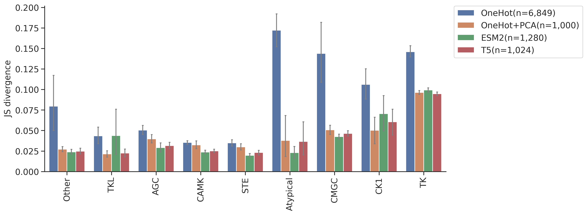

# DL training: Feature comparison on CNN model


<!-- WARNING: THIS FILE WAS AUTOGENERATED! DO NOT EDIT! -->

## Setup

``` python
import numpy as np, pandas as pd
import os, random
from katlas.data import *
from katlas.train import *
from fastai.vision.all import *
from katlas.dnn import *
```

``` python
seed_everything()
```

``` python
def_device
```

    'cuda'

## Data

``` python
df_t5=pd.read_parquet('train/pspa_t5.parquet').reset_index()
df_esm=pd.read_parquet('train/pspa_esm.parquet').reset_index()
df_onehot = pd.read_parquet('train/pspa_onehot.parquet').reset_index()
df_onehot_pca = pd.read_parquet('train/pspa_onehot_pca.parquet').reset_index()
```

``` python
(df_onehot['index'] == df_esm['index']).value_counts()
```

    index
    True    368
    Name: count, dtype: int64

``` python
(df_t5['index'] == df_esm['index']).value_counts()
```

    index
    True    368
    Name: count, dtype: int64

``` python
t5_col = df_t5.columns[df_t5.columns.str.startswith('T5_')]
```

``` python
t5_col
```

    Index(['T5_0', 'T5_1', 'T5_2', 'T5_3', 'T5_4', 'T5_5', 'T5_6', 'T5_7', 'T5_8',
           'T5_9',
           ...
           'T5_1014', 'T5_1015', 'T5_1016', 'T5_1017', 'T5_1018', 'T5_1019',
           'T5_1020', 'T5_1021', 'T5_1022', 'T5_1023'],
          dtype='object', length=1024)

``` python
esm_col = df_esm.columns[df_esm.columns.str.startswith('esm_')]
```

``` python
esm_col
```

    Index(['esm_0', 'esm_1', 'esm_2', 'esm_3', 'esm_4', 'esm_5', 'esm_6', 'esm_7',
           'esm_8', 'esm_9',
           ...
           'esm_1270', 'esm_1271', 'esm_1272', 'esm_1273', 'esm_1274', 'esm_1275',
           'esm_1276', 'esm_1277', 'esm_1278', 'esm_1279'],
          dtype='object', length=1280)

``` python
target_col = df_t5.columns[~df_t5.columns.isin(t5_col)][1:]
```

``` python
target_col
```

    Index(['-5P', '-4P', '-3P', '-2P', '-1P', '0P', '1P', '2P', '3P', '4P',
           ...
           '-5pY', '-4pY', '-3pY', '-2pY', '-1pY', '0pY', '1pY', '2pY', '3pY',
           '4pY'],
          dtype='object', length=230)

``` python
onehot_col = df_onehot.columns[~df_onehot.columns.isin(target_col)][1:]
```

``` python
onehot_col
```

    Index(['65_-', '65_A', '65_C', '65_D', '65_E', '65_F', '65_G', '65_H', '65_I',
           '65_K',
           ...
           '3192_M', '3192_N', '3192_P', '3192_Q', '3192_R', '3192_S', '3192_T',
           '3192_V', '3192_W', '3192_Y'],
          dtype='object', length=6849)

``` python
onehot_pca_col = df_onehot_pca.columns[df_onehot_pca.columns.str.startswith('PCA')]
```

``` python
onehot_pca_col
```

    Index(['PCA1', 'PCA2', 'PCA3', 'PCA4', 'PCA5', 'PCA6', 'PCA7', 'PCA8', 'PCA9',
           'PCA10',
           ...
           'PCA991', 'PCA992', 'PCA993', 'PCA994', 'PCA995', 'PCA996', 'PCA997',
           'PCA998', 'PCA999', 'PCA1000'],
          dtype='object', length=1000)

``` python
info=Data.get_kinase_info()

info = info[info.pseudo=='0']

info = info[info.kd_ID.notna()]

subfamily_map = info[['kd_ID','subfamily']].drop_duplicates().set_index('kd_ID')['subfamily']
family_map = info[['kd_ID','family']].drop_duplicates().set_index('kd_ID')['family']
group_map = info[['kd_ID','group']].drop_duplicates().set_index('kd_ID')['group']

pspa_info = pd.DataFrame(df_t5['index'].tolist(),columns=['kinase'])

pspa_info['subfamily'] = pspa_info.kinase.map(subfamily_map)
pspa_info['family'] = pspa_info.kinase.map(family_map)
pspa_info['group'] = pspa_info.kinase.map(group_map)
```

## Split

``` python
splits = get_splits(pspa_info, group='group',nfold=9)

split0 = splits[0]
```

    GroupKFold(n_splits=9, random_state=None, shuffle=False)
    # group in train set: 8
    # group in test set: 1

## Dataset

``` python
# dataset
ds_t5 = GeneralDataset(df_t5,t5_col,target_col)
ds_esm = GeneralDataset(df_esm,esm_col,target_col)
ds_onehot = GeneralDataset(df_onehot,onehot_col,target_col)
ds_onehot_pca = GeneralDataset(df_onehot_pca,onehot_pca_col,target_col)
```

``` python
len(ds_t5)
```

    368

``` python
dl_t5 = DataLoader(ds_t5, batch_size=64, shuffle=True)
dl_esm = DataLoader(ds_esm, batch_size=64, shuffle=True)
dl_onehot = DataLoader(ds_onehot, batch_size=64, shuffle=True)
dl_onehot_pca = DataLoader(ds_onehot_pca, batch_size=64, shuffle=True)
```

``` python
xb,yb = next(iter(dl_t5))

xb.shape,yb.shape
```

    (torch.Size([64, 1024]), torch.Size([64, 23, 10]))

## Model

``` python
n_t5 = len(t5_col)
n_esm = len(esm_col)
n_onehot = len(onehot_col)
n_onehot_pca = len(onehot_pca_col)
n_target = len(target_col)
```

``` python
n_t5,n_esm,n_onehot,n_onehot_pca
```

    (1024, 1280, 6849, 1000)

``` python
# def get_cnn(): return PSSM_model(n_feature,n_target,model='CNN')

def get_cnn_t5(): return PSSM_model(n_t5,n_target,model='CNN')
def get_cnn_esm(): return PSSM_model(n_esm,n_target,model='CNN')
def get_cnn_onehot(): return PSSM_model(n_onehot,n_target,model='CNN')
def get_cnn_onehot_pca(): return PSSM_model(n_onehot_pca,n_target,model='CNN')
```

``` python
model = get_cnn_t5()
```

``` python
logits= model(xb)
```

``` python
logits.shape
```

    torch.Size([64, 23, 10])

## Loss

``` python
CE(logits,yb)
```

    tensor(3.3157, grad_fn=<MeanBackward0>)

## Metrics

``` python
KLD(logits,yb)
```

    tensor(0.5744, grad_fn=<MeanBackward0>)

``` python
JSD(logits,yb)
```

    tensor(0.1175, grad_fn=<MeanBackward0>)

## CV train

> cross-validation

``` python
oof_t5 = train_dl_cv(df_t5,t5_col,target_col,
                  splits = splits,
                  model_func = get_cnn_t5,
                  n_epoch=20,lr=3e-3)
```

    ------fold0------
    lr in training is 0.003

<style>
    /* Turns off some styling */
    progress {
        /* gets rid of default border in Firefox and Opera. */
        border: none;
        /* Needs to be in here for Safari polyfill so background images work as expected. */
        background-size: auto;
    }
    progress:not([value]), progress:not([value])::-webkit-progress-bar {
        background: repeating-linear-gradient(45deg, #7e7e7e, #7e7e7e 10px, #5c5c5c 10px, #5c5c5c 20px);
    }
    .progress-bar-interrupted, .progress-bar-interrupted::-webkit-progress-bar {
        background: #F44336;
    }
</style>

<table class="dataframe" data-quarto-postprocess="true" data-border="1">
<thead>
<tr style="text-align: left;">
<th data-quarto-table-cell-role="th">epoch</th>
<th data-quarto-table-cell-role="th">train_loss</th>
<th data-quarto-table-cell-role="th">valid_loss</th>
<th data-quarto-table-cell-role="th">KLD</th>
<th data-quarto-table-cell-role="th">JSD</th>
<th data-quarto-table-cell-role="th">time</th>
</tr>
</thead>
<tbody>
<tr>
<td>0</td>
<td>3.265647</td>
<td>3.142609</td>
<td>0.404048</td>
<td>0.081247</td>
<td>00:01</td>
</tr>
<tr>
<td>1</td>
<td>3.223042</td>
<td>3.159432</td>
<td>0.420871</td>
<td>0.084551</td>
<td>00:00</td>
</tr>
<tr>
<td>2</td>
<td>3.185979</td>
<td>3.188326</td>
<td>0.449765</td>
<td>0.093861</td>
<td>00:00</td>
</tr>
<tr>
<td>3</td>
<td>3.161986</td>
<td>3.216524</td>
<td>0.477963</td>
<td>0.093619</td>
<td>00:00</td>
</tr>
<tr>
<td>4</td>
<td>3.139796</td>
<td>3.263382</td>
<td>0.524821</td>
<td>0.094843</td>
<td>00:00</td>
</tr>
<tr>
<td>5</td>
<td>3.121998</td>
<td>3.365554</td>
<td>0.626993</td>
<td>0.100610</td>
<td>00:00</td>
</tr>
<tr>
<td>6</td>
<td>3.081605</td>
<td>3.490378</td>
<td>0.751817</td>
<td>0.110248</td>
<td>00:00</td>
</tr>
<tr>
<td>7</td>
<td>3.036093</td>
<td>3.435781</td>
<td>0.697220</td>
<td>0.096045</td>
<td>00:00</td>
</tr>
<tr>
<td>8</td>
<td>2.995330</td>
<td>3.547961</td>
<td>0.809401</td>
<td>0.095060</td>
<td>00:00</td>
</tr>
<tr>
<td>9</td>
<td>2.961592</td>
<td>3.593616</td>
<td>0.855055</td>
<td>0.096466</td>
<td>00:00</td>
</tr>
<tr>
<td>10</td>
<td>2.933471</td>
<td>3.600523</td>
<td>0.861963</td>
<td>0.094996</td>
<td>00:00</td>
</tr>
<tr>
<td>11</td>
<td>2.909601</td>
<td>3.590640</td>
<td>0.852079</td>
<td>0.094011</td>
<td>00:00</td>
</tr>
<tr>
<td>12</td>
<td>2.890588</td>
<td>3.624627</td>
<td>0.886067</td>
<td>0.095667</td>
<td>00:00</td>
</tr>
<tr>
<td>13</td>
<td>2.874250</td>
<td>3.621842</td>
<td>0.883281</td>
<td>0.093074</td>
<td>00:00</td>
</tr>
<tr>
<td>14</td>
<td>2.860559</td>
<td>3.642438</td>
<td>0.903877</td>
<td>0.094680</td>
<td>00:00</td>
</tr>
<tr>
<td>15</td>
<td>2.849265</td>
<td>3.640604</td>
<td>0.902043</td>
<td>0.093936</td>
<td>00:00</td>
</tr>
<tr>
<td>16</td>
<td>2.839526</td>
<td>3.647106</td>
<td>0.908545</td>
<td>0.094358</td>
<td>00:00</td>
</tr>
<tr>
<td>17</td>
<td>2.830861</td>
<td>3.654265</td>
<td>0.915704</td>
<td>0.094701</td>
<td>00:00</td>
</tr>
<tr>
<td>18</td>
<td>2.823612</td>
<td>3.653282</td>
<td>0.914721</td>
<td>0.094696</td>
<td>00:00</td>
</tr>
<tr>
<td>19</td>
<td>2.817443</td>
<td>3.651935</td>
<td>0.913374</td>
<td>0.094722</td>
<td>00:00</td>
</tr>
</tbody>
</table>

<style>
    /* Turns off some styling */
    progress {
        /* gets rid of default border in Firefox and Opera. */
        border: none;
        /* Needs to be in here for Safari polyfill so background images work as expected. */
        background-size: auto;
    }
    progress:not([value]), progress:not([value])::-webkit-progress-bar {
        background: repeating-linear-gradient(45deg, #7e7e7e, #7e7e7e 10px, #5c5c5c 10px, #5c5c5c 20px);
    }
    .progress-bar-interrupted, .progress-bar-interrupted::-webkit-progress-bar {
        background: #F44336;
    }
</style>

    ------fold1------
    lr in training is 0.003

<style>
    /* Turns off some styling */
    progress {
        /* gets rid of default border in Firefox and Opera. */
        border: none;
        /* Needs to be in here for Safari polyfill so background images work as expected. */
        background-size: auto;
    }
    progress:not([value]), progress:not([value])::-webkit-progress-bar {
        background: repeating-linear-gradient(45deg, #7e7e7e, #7e7e7e 10px, #5c5c5c 10px, #5c5c5c 20px);
    }
    .progress-bar-interrupted, .progress-bar-interrupted::-webkit-progress-bar {
        background: #F44336;
    }
</style>

<table class="dataframe" data-quarto-postprocess="true" data-border="1">
<thead>
<tr style="text-align: left;">
<th data-quarto-table-cell-role="th">epoch</th>
<th data-quarto-table-cell-role="th">train_loss</th>
<th data-quarto-table-cell-role="th">valid_loss</th>
<th data-quarto-table-cell-role="th">KLD</th>
<th data-quarto-table-cell-role="th">JSD</th>
<th data-quarto-table-cell-role="th">time</th>
</tr>
</thead>
<tbody>
<tr>
<td>0</td>
<td>3.202563</td>
<td>3.126681</td>
<td>0.367288</td>
<td>0.080953</td>
<td>00:00</td>
</tr>
<tr>
<td>1</td>
<td>3.096495</td>
<td>2.987177</td>
<td>0.227784</td>
<td>0.058128</td>
<td>00:00</td>
</tr>
<tr>
<td>2</td>
<td>3.020704</td>
<td>2.896720</td>
<td>0.137328</td>
<td>0.032520</td>
<td>00:00</td>
</tr>
<tr>
<td>3</td>
<td>2.977764</td>
<td>2.916249</td>
<td>0.156856</td>
<td>0.036941</td>
<td>00:00</td>
</tr>
<tr>
<td>4</td>
<td>2.950588</td>
<td>2.900061</td>
<td>0.140669</td>
<td>0.032257</td>
<td>00:00</td>
</tr>
<tr>
<td>5</td>
<td>2.930088</td>
<td>2.912244</td>
<td>0.152851</td>
<td>0.035243</td>
<td>00:00</td>
</tr>
<tr>
<td>6</td>
<td>2.911221</td>
<td>2.882244</td>
<td>0.122852</td>
<td>0.028578</td>
<td>00:00</td>
</tr>
<tr>
<td>7</td>
<td>2.896883</td>
<td>2.888497</td>
<td>0.129105</td>
<td>0.029880</td>
<td>00:00</td>
</tr>
<tr>
<td>8</td>
<td>2.883235</td>
<td>2.879527</td>
<td>0.120135</td>
<td>0.028295</td>
<td>00:00</td>
</tr>
<tr>
<td>9</td>
<td>2.869442</td>
<td>2.870536</td>
<td>0.111143</td>
<td>0.025767</td>
<td>00:00</td>
</tr>
<tr>
<td>10</td>
<td>2.856844</td>
<td>2.872699</td>
<td>0.113306</td>
<td>0.026387</td>
<td>00:00</td>
</tr>
<tr>
<td>11</td>
<td>2.845950</td>
<td>2.875445</td>
<td>0.116052</td>
<td>0.026841</td>
<td>00:00</td>
</tr>
<tr>
<td>12</td>
<td>2.838449</td>
<td>2.868856</td>
<td>0.109463</td>
<td>0.025458</td>
<td>00:00</td>
</tr>
<tr>
<td>13</td>
<td>2.831044</td>
<td>2.868054</td>
<td>0.108661</td>
<td>0.025295</td>
<td>00:00</td>
</tr>
<tr>
<td>14</td>
<td>2.823496</td>
<td>2.874786</td>
<td>0.115393</td>
<td>0.026861</td>
<td>00:00</td>
</tr>
<tr>
<td>15</td>
<td>2.816517</td>
<td>2.870229</td>
<td>0.110837</td>
<td>0.025839</td>
<td>00:00</td>
</tr>
<tr>
<td>16</td>
<td>2.810994</td>
<td>2.868846</td>
<td>0.109454</td>
<td>0.025484</td>
<td>00:00</td>
</tr>
<tr>
<td>17</td>
<td>2.805729</td>
<td>2.868922</td>
<td>0.109530</td>
<td>0.025440</td>
<td>00:00</td>
</tr>
<tr>
<td>18</td>
<td>2.801781</td>
<td>2.868556</td>
<td>0.109163</td>
<td>0.025403</td>
<td>00:00</td>
</tr>
<tr>
<td>19</td>
<td>2.798228</td>
<td>2.867560</td>
<td>0.108168</td>
<td>0.025145</td>
<td>00:00</td>
</tr>
</tbody>
</table>

<style>
    /* Turns off some styling */
    progress {
        /* gets rid of default border in Firefox and Opera. */
        border: none;
        /* Needs to be in here for Safari polyfill so background images work as expected. */
        background-size: auto;
    }
    progress:not([value]), progress:not([value])::-webkit-progress-bar {
        background: repeating-linear-gradient(45deg, #7e7e7e, #7e7e7e 10px, #5c5c5c 10px, #5c5c5c 20px);
    }
    .progress-bar-interrupted, .progress-bar-interrupted::-webkit-progress-bar {
        background: #F44336;
    }
</style>

    ------fold2------
    lr in training is 0.003

<style>
    /* Turns off some styling */
    progress {
        /* gets rid of default border in Firefox and Opera. */
        border: none;
        /* Needs to be in here for Safari polyfill so background images work as expected. */
        background-size: auto;
    }
    progress:not([value]), progress:not([value])::-webkit-progress-bar {
        background: repeating-linear-gradient(45deg, #7e7e7e, #7e7e7e 10px, #5c5c5c 10px, #5c5c5c 20px);
    }
    .progress-bar-interrupted, .progress-bar-interrupted::-webkit-progress-bar {
        background: #F44336;
    }
</style>

<table class="dataframe" data-quarto-postprocess="true" data-border="1">
<thead>
<tr style="text-align: left;">
<th data-quarto-table-cell-role="th">epoch</th>
<th data-quarto-table-cell-role="th">train_loss</th>
<th data-quarto-table-cell-role="th">valid_loss</th>
<th data-quarto-table-cell-role="th">KLD</th>
<th data-quarto-table-cell-role="th">JSD</th>
<th data-quarto-table-cell-role="th">time</th>
</tr>
</thead>
<tbody>
<tr>
<td>0</td>
<td>3.193643</td>
<td>3.129775</td>
<td>0.413172</td>
<td>0.088697</td>
<td>00:00</td>
</tr>
<tr>
<td>1</td>
<td>3.091510</td>
<td>2.970952</td>
<td>0.254349</td>
<td>0.061493</td>
<td>00:00</td>
</tr>
<tr>
<td>2</td>
<td>3.019390</td>
<td>2.939329</td>
<td>0.222726</td>
<td>0.047996</td>
<td>00:00</td>
</tr>
<tr>
<td>3</td>
<td>2.979136</td>
<td>2.997280</td>
<td>0.280677</td>
<td>0.057836</td>
<td>00:00</td>
</tr>
<tr>
<td>4</td>
<td>2.955849</td>
<td>2.856279</td>
<td>0.139675</td>
<td>0.032778</td>
<td>00:00</td>
</tr>
<tr>
<td>5</td>
<td>2.937262</td>
<td>2.881608</td>
<td>0.165005</td>
<td>0.037116</td>
<td>00:00</td>
</tr>
<tr>
<td>6</td>
<td>2.919667</td>
<td>2.847731</td>
<td>0.131128</td>
<td>0.030217</td>
<td>00:00</td>
</tr>
<tr>
<td>7</td>
<td>2.905293</td>
<td>2.839630</td>
<td>0.123026</td>
<td>0.028822</td>
<td>00:00</td>
</tr>
<tr>
<td>8</td>
<td>2.891868</td>
<td>2.834224</td>
<td>0.117620</td>
<td>0.027419</td>
<td>-1:59:59</td>
</tr>
<tr>
<td>9</td>
<td>2.879336</td>
<td>2.883239</td>
<td>0.166636</td>
<td>0.039591</td>
<td>00:00</td>
</tr>
<tr>
<td>10</td>
<td>2.866813</td>
<td>2.858723</td>
<td>0.142120</td>
<td>0.032910</td>
<td>00:00</td>
</tr>
<tr>
<td>11</td>
<td>2.855484</td>
<td>2.848410</td>
<td>0.131807</td>
<td>0.030241</td>
<td>00:00</td>
</tr>
<tr>
<td>12</td>
<td>2.845427</td>
<td>2.873513</td>
<td>0.156910</td>
<td>0.036242</td>
<td>00:00</td>
</tr>
<tr>
<td>13</td>
<td>2.836359</td>
<td>2.847939</td>
<td>0.131335</td>
<td>0.030619</td>
<td>00:00</td>
</tr>
<tr>
<td>14</td>
<td>2.828688</td>
<td>2.843345</td>
<td>0.126741</td>
<td>0.029227</td>
<td>00:00</td>
</tr>
<tr>
<td>15</td>
<td>2.822182</td>
<td>2.849235</td>
<td>0.132632</td>
<td>0.030728</td>
<td>00:00</td>
</tr>
<tr>
<td>16</td>
<td>2.816315</td>
<td>2.848452</td>
<td>0.131849</td>
<td>0.030454</td>
<td>00:00</td>
</tr>
<tr>
<td>17</td>
<td>2.811537</td>
<td>2.849880</td>
<td>0.133277</td>
<td>0.030673</td>
<td>00:00</td>
</tr>
<tr>
<td>18</td>
<td>2.807543</td>
<td>2.854661</td>
<td>0.138057</td>
<td>0.031727</td>
<td>00:00</td>
</tr>
<tr>
<td>19</td>
<td>2.803862</td>
<td>2.853885</td>
<td>0.137282</td>
<td>0.031627</td>
<td>00:00</td>
</tr>
</tbody>
</table>

<style>
    /* Turns off some styling */
    progress {
        /* gets rid of default border in Firefox and Opera. */
        border: none;
        /* Needs to be in here for Safari polyfill so background images work as expected. */
        background-size: auto;
    }
    progress:not([value]), progress:not([value])::-webkit-progress-bar {
        background: repeating-linear-gradient(45deg, #7e7e7e, #7e7e7e 10px, #5c5c5c 10px, #5c5c5c 20px);
    }
    .progress-bar-interrupted, .progress-bar-interrupted::-webkit-progress-bar {
        background: #F44336;
    }
</style>

    ------fold3------
    lr in training is 0.003

<style>
    /* Turns off some styling */
    progress {
        /* gets rid of default border in Firefox and Opera. */
        border: none;
        /* Needs to be in here for Safari polyfill so background images work as expected. */
        background-size: auto;
    }
    progress:not([value]), progress:not([value])::-webkit-progress-bar {
        background: repeating-linear-gradient(45deg, #7e7e7e, #7e7e7e 10px, #5c5c5c 10px, #5c5c5c 20px);
    }
    .progress-bar-interrupted, .progress-bar-interrupted::-webkit-progress-bar {
        background: #F44336;
    }
</style>

<table class="dataframe" data-quarto-postprocess="true" data-border="1">
<thead>
<tr style="text-align: left;">
<th data-quarto-table-cell-role="th">epoch</th>
<th data-quarto-table-cell-role="th">train_loss</th>
<th data-quarto-table-cell-role="th">valid_loss</th>
<th data-quarto-table-cell-role="th">KLD</th>
<th data-quarto-table-cell-role="th">JSD</th>
<th data-quarto-table-cell-role="th">time</th>
</tr>
</thead>
<tbody>
<tr>
<td>0</td>
<td>3.207944</td>
<td>3.141091</td>
<td>0.449947</td>
<td>0.093460</td>
<td>00:00</td>
</tr>
<tr>
<td>1</td>
<td>3.110341</td>
<td>3.029324</td>
<td>0.338180</td>
<td>0.076213</td>
<td>00:00</td>
</tr>
<tr>
<td>2</td>
<td>3.034141</td>
<td>2.932320</td>
<td>0.241176</td>
<td>0.049031</td>
<td>00:00</td>
</tr>
<tr>
<td>3</td>
<td>2.993638</td>
<td>2.946054</td>
<td>0.254910</td>
<td>0.050688</td>
<td>00:00</td>
</tr>
<tr>
<td>4</td>
<td>2.968643</td>
<td>2.946317</td>
<td>0.255174</td>
<td>0.049163</td>
<td>00:00</td>
</tr>
<tr>
<td>5</td>
<td>2.946927</td>
<td>2.940749</td>
<td>0.249605</td>
<td>0.046374</td>
<td>00:00</td>
</tr>
<tr>
<td>6</td>
<td>2.926885</td>
<td>2.924870</td>
<td>0.233727</td>
<td>0.044772</td>
<td>00:00</td>
</tr>
<tr>
<td>7</td>
<td>2.909749</td>
<td>2.939194</td>
<td>0.248050</td>
<td>0.045244</td>
<td>00:00</td>
</tr>
<tr>
<td>8</td>
<td>2.893957</td>
<td>2.910057</td>
<td>0.218914</td>
<td>0.042975</td>
<td>00:00</td>
</tr>
<tr>
<td>9</td>
<td>2.879583</td>
<td>2.939824</td>
<td>0.248680</td>
<td>0.046253</td>
<td>00:00</td>
</tr>
<tr>
<td>10</td>
<td>2.866916</td>
<td>2.941156</td>
<td>0.250012</td>
<td>0.047198</td>
<td>00:00</td>
</tr>
<tr>
<td>11</td>
<td>2.856293</td>
<td>2.933166</td>
<td>0.242022</td>
<td>0.045542</td>
<td>00:00</td>
</tr>
<tr>
<td>12</td>
<td>2.847124</td>
<td>2.937057</td>
<td>0.245913</td>
<td>0.046275</td>
<td>00:00</td>
</tr>
<tr>
<td>13</td>
<td>2.838420</td>
<td>2.938343</td>
<td>0.247199</td>
<td>0.046922</td>
<td>00:00</td>
</tr>
<tr>
<td>14</td>
<td>2.831244</td>
<td>2.940233</td>
<td>0.249089</td>
<td>0.047545</td>
<td>00:00</td>
</tr>
<tr>
<td>15</td>
<td>2.825087</td>
<td>2.944092</td>
<td>0.252948</td>
<td>0.047802</td>
<td>00:00</td>
</tr>
<tr>
<td>16</td>
<td>2.819351</td>
<td>2.945658</td>
<td>0.254514</td>
<td>0.047995</td>
<td>00:00</td>
</tr>
<tr>
<td>17</td>
<td>2.814262</td>
<td>2.940202</td>
<td>0.249058</td>
<td>0.046777</td>
<td>00:00</td>
</tr>
<tr>
<td>18</td>
<td>2.810476</td>
<td>2.940670</td>
<td>0.249527</td>
<td>0.046865</td>
<td>00:00</td>
</tr>
<tr>
<td>19</td>
<td>2.806732</td>
<td>2.938628</td>
<td>0.247484</td>
<td>0.046366</td>
<td>00:00</td>
</tr>
</tbody>
</table>

<style>
    /* Turns off some styling */
    progress {
        /* gets rid of default border in Firefox and Opera. */
        border: none;
        /* Needs to be in here for Safari polyfill so background images work as expected. */
        background-size: auto;
    }
    progress:not([value]), progress:not([value])::-webkit-progress-bar {
        background: repeating-linear-gradient(45deg, #7e7e7e, #7e7e7e 10px, #5c5c5c 10px, #5c5c5c 20px);
    }
    .progress-bar-interrupted, .progress-bar-interrupted::-webkit-progress-bar {
        background: #F44336;
    }
</style>

    ------fold4------
    lr in training is 0.003

<style>
    /* Turns off some styling */
    progress {
        /* gets rid of default border in Firefox and Opera. */
        border: none;
        /* Needs to be in here for Safari polyfill so background images work as expected. */
        background-size: auto;
    }
    progress:not([value]), progress:not([value])::-webkit-progress-bar {
        background: repeating-linear-gradient(45deg, #7e7e7e, #7e7e7e 10px, #5c5c5c 10px, #5c5c5c 20px);
    }
    .progress-bar-interrupted, .progress-bar-interrupted::-webkit-progress-bar {
        background: #F44336;
    }
</style>

<table class="dataframe" data-quarto-postprocess="true" data-border="1">
<thead>
<tr style="text-align: left;">
<th data-quarto-table-cell-role="th">epoch</th>
<th data-quarto-table-cell-role="th">train_loss</th>
<th data-quarto-table-cell-role="th">valid_loss</th>
<th data-quarto-table-cell-role="th">KLD</th>
<th data-quarto-table-cell-role="th">JSD</th>
<th data-quarto-table-cell-role="th">time</th>
</tr>
</thead>
<tbody>
<tr>
<td>0</td>
<td>3.193083</td>
<td>3.121557</td>
<td>0.332112</td>
<td>0.073863</td>
<td>00:00</td>
</tr>
<tr>
<td>1</td>
<td>3.084162</td>
<td>2.954197</td>
<td>0.164753</td>
<td>0.042711</td>
<td>00:00</td>
</tr>
<tr>
<td>2</td>
<td>3.010259</td>
<td>2.942940</td>
<td>0.153495</td>
<td>0.035771</td>
<td>00:00</td>
</tr>
<tr>
<td>3</td>
<td>2.970550</td>
<td>2.977695</td>
<td>0.188250</td>
<td>0.042826</td>
<td>00:00</td>
</tr>
<tr>
<td>4</td>
<td>2.945946</td>
<td>2.932550</td>
<td>0.143106</td>
<td>0.032621</td>
<td>00:00</td>
</tr>
<tr>
<td>5</td>
<td>2.929771</td>
<td>2.907203</td>
<td>0.117758</td>
<td>0.027932</td>
<td>00:00</td>
</tr>
<tr>
<td>6</td>
<td>2.910526</td>
<td>2.899911</td>
<td>0.110467</td>
<td>0.025754</td>
<td>00:00</td>
</tr>
<tr>
<td>7</td>
<td>2.892773</td>
<td>2.916562</td>
<td>0.127117</td>
<td>0.028903</td>
<td>00:00</td>
</tr>
<tr>
<td>8</td>
<td>2.879743</td>
<td>2.905592</td>
<td>0.116148</td>
<td>0.026998</td>
<td>00:00</td>
</tr>
<tr>
<td>9</td>
<td>2.866278</td>
<td>2.908514</td>
<td>0.119069</td>
<td>0.027786</td>
<td>00:00</td>
</tr>
<tr>
<td>10</td>
<td>2.854042</td>
<td>2.905393</td>
<td>0.115948</td>
<td>0.026859</td>
<td>00:00</td>
</tr>
<tr>
<td>11</td>
<td>2.843414</td>
<td>2.904994</td>
<td>0.115549</td>
<td>0.026965</td>
<td>00:00</td>
</tr>
<tr>
<td>12</td>
<td>2.833833</td>
<td>2.897970</td>
<td>0.108525</td>
<td>0.025182</td>
<td>00:00</td>
</tr>
<tr>
<td>13</td>
<td>2.825915</td>
<td>2.899413</td>
<td>0.109969</td>
<td>0.025357</td>
<td>00:00</td>
</tr>
<tr>
<td>14</td>
<td>2.818082</td>
<td>2.897056</td>
<td>0.107612</td>
<td>0.024913</td>
<td>00:00</td>
</tr>
<tr>
<td>15</td>
<td>2.811066</td>
<td>2.897897</td>
<td>0.108452</td>
<td>0.025036</td>
<td>00:00</td>
</tr>
<tr>
<td>16</td>
<td>2.805139</td>
<td>2.896160</td>
<td>0.106715</td>
<td>0.024646</td>
<td>00:00</td>
</tr>
<tr>
<td>17</td>
<td>2.800325</td>
<td>2.896326</td>
<td>0.106882</td>
<td>0.024691</td>
<td>00:00</td>
</tr>
<tr>
<td>18</td>
<td>2.795776</td>
<td>2.896716</td>
<td>0.107271</td>
<td>0.024781</td>
<td>00:00</td>
</tr>
<tr>
<td>19</td>
<td>2.792595</td>
<td>2.896498</td>
<td>0.107053</td>
<td>0.024761</td>
<td>00:00</td>
</tr>
</tbody>
</table>

<style>
    /* Turns off some styling */
    progress {
        /* gets rid of default border in Firefox and Opera. */
        border: none;
        /* Needs to be in here for Safari polyfill so background images work as expected. */
        background-size: auto;
    }
    progress:not([value]), progress:not([value])::-webkit-progress-bar {
        background: repeating-linear-gradient(45deg, #7e7e7e, #7e7e7e 10px, #5c5c5c 10px, #5c5c5c 20px);
    }
    .progress-bar-interrupted, .progress-bar-interrupted::-webkit-progress-bar {
        background: #F44336;
    }
</style>

    ------fold5------
    lr in training is 0.003

<style>
    /* Turns off some styling */
    progress {
        /* gets rid of default border in Firefox and Opera. */
        border: none;
        /* Needs to be in here for Safari polyfill so background images work as expected. */
        background-size: auto;
    }
    progress:not([value]), progress:not([value])::-webkit-progress-bar {
        background: repeating-linear-gradient(45deg, #7e7e7e, #7e7e7e 10px, #5c5c5c 10px, #5c5c5c 20px);
    }
    .progress-bar-interrupted, .progress-bar-interrupted::-webkit-progress-bar {
        background: #F44336;
    }
</style>

<table class="dataframe" data-quarto-postprocess="true" data-border="1">
<thead>
<tr style="text-align: left;">
<th data-quarto-table-cell-role="th">epoch</th>
<th data-quarto-table-cell-role="th">train_loss</th>
<th data-quarto-table-cell-role="th">valid_loss</th>
<th data-quarto-table-cell-role="th">KLD</th>
<th data-quarto-table-cell-role="th">JSD</th>
<th data-quarto-table-cell-role="th">time</th>
</tr>
</thead>
<tbody>
<tr>
<td>0</td>
<td>3.191223</td>
<td>3.125971</td>
<td>0.337161</td>
<td>0.074101</td>
<td>00:00</td>
</tr>
<tr>
<td>1</td>
<td>3.084095</td>
<td>2.968137</td>
<td>0.179327</td>
<td>0.046755</td>
<td>00:00</td>
</tr>
<tr>
<td>2</td>
<td>3.009351</td>
<td>2.993795</td>
<td>0.204984</td>
<td>0.046834</td>
<td>00:00</td>
</tr>
<tr>
<td>3</td>
<td>2.975441</td>
<td>2.935275</td>
<td>0.146464</td>
<td>0.035559</td>
<td>00:00</td>
</tr>
<tr>
<td>4</td>
<td>2.952728</td>
<td>2.906648</td>
<td>0.117838</td>
<td>0.029097</td>
<td>00:00</td>
</tr>
<tr>
<td>5</td>
<td>2.933139</td>
<td>2.887461</td>
<td>0.098650</td>
<td>0.024654</td>
<td>00:00</td>
</tr>
<tr>
<td>6</td>
<td>2.914009</td>
<td>2.891163</td>
<td>0.102352</td>
<td>0.025090</td>
<td>00:00</td>
</tr>
<tr>
<td>7</td>
<td>2.896947</td>
<td>2.894362</td>
<td>0.105552</td>
<td>0.025792</td>
<td>00:00</td>
</tr>
<tr>
<td>8</td>
<td>2.880326</td>
<td>2.898649</td>
<td>0.109838</td>
<td>0.026552</td>
<td>00:00</td>
</tr>
<tr>
<td>9</td>
<td>2.865264</td>
<td>2.895405</td>
<td>0.106595</td>
<td>0.026206</td>
<td>-1:59:59</td>
</tr>
<tr>
<td>10</td>
<td>2.852518</td>
<td>2.892293</td>
<td>0.103482</td>
<td>0.025411</td>
<td>00:00</td>
</tr>
<tr>
<td>11</td>
<td>2.840988</td>
<td>2.883369</td>
<td>0.094558</td>
<td>0.023256</td>
<td>00:00</td>
</tr>
<tr>
<td>12</td>
<td>2.830953</td>
<td>2.888999</td>
<td>0.100188</td>
<td>0.024492</td>
<td>00:00</td>
</tr>
<tr>
<td>13</td>
<td>2.822403</td>
<td>2.888226</td>
<td>0.099416</td>
<td>0.024353</td>
<td>00:00</td>
</tr>
<tr>
<td>14</td>
<td>2.814830</td>
<td>2.888407</td>
<td>0.099596</td>
<td>0.024432</td>
<td>00:00</td>
</tr>
<tr>
<td>15</td>
<td>2.808502</td>
<td>2.886997</td>
<td>0.098186</td>
<td>0.024032</td>
<td>00:00</td>
</tr>
<tr>
<td>16</td>
<td>2.802773</td>
<td>2.887533</td>
<td>0.098723</td>
<td>0.024249</td>
<td>00:00</td>
</tr>
<tr>
<td>17</td>
<td>2.797982</td>
<td>2.883697</td>
<td>0.094887</td>
<td>0.023295</td>
<td>00:00</td>
</tr>
<tr>
<td>18</td>
<td>2.793947</td>
<td>2.884220</td>
<td>0.095410</td>
<td>0.023388</td>
<td>00:00</td>
</tr>
<tr>
<td>19</td>
<td>2.790855</td>
<td>2.883040</td>
<td>0.094230</td>
<td>0.023095</td>
<td>00:00</td>
</tr>
</tbody>
</table>

<style>
    /* Turns off some styling */
    progress {
        /* gets rid of default border in Firefox and Opera. */
        border: none;
        /* Needs to be in here for Safari polyfill so background images work as expected. */
        background-size: auto;
    }
    progress:not([value]), progress:not([value])::-webkit-progress-bar {
        background: repeating-linear-gradient(45deg, #7e7e7e, #7e7e7e 10px, #5c5c5c 10px, #5c5c5c 20px);
    }
    .progress-bar-interrupted, .progress-bar-interrupted::-webkit-progress-bar {
        background: #F44336;
    }
</style>

    ------fold6------
    lr in training is 0.003

<style>
    /* Turns off some styling */
    progress {
        /* gets rid of default border in Firefox and Opera. */
        border: none;
        /* Needs to be in here for Safari polyfill so background images work as expected. */
        background-size: auto;
    }
    progress:not([value]), progress:not([value])::-webkit-progress-bar {
        background: repeating-linear-gradient(45deg, #7e7e7e, #7e7e7e 10px, #5c5c5c 10px, #5c5c5c 20px);
    }
    .progress-bar-interrupted, .progress-bar-interrupted::-webkit-progress-bar {
        background: #F44336;
    }
</style>

<table class="dataframe" data-quarto-postprocess="true" data-border="1">
<thead>
<tr style="text-align: left;">
<th data-quarto-table-cell-role="th">epoch</th>
<th data-quarto-table-cell-role="th">train_loss</th>
<th data-quarto-table-cell-role="th">valid_loss</th>
<th data-quarto-table-cell-role="th">KLD</th>
<th data-quarto-table-cell-role="th">JSD</th>
<th data-quarto-table-cell-role="th">time</th>
</tr>
</thead>
<tbody>
<tr>
<td>0</td>
<td>3.203619</td>
<td>3.121918</td>
<td>0.306652</td>
<td>0.069884</td>
<td>00:00</td>
</tr>
<tr>
<td>1</td>
<td>3.089997</td>
<td>2.956834</td>
<td>0.141568</td>
<td>0.037513</td>
<td>00:00</td>
</tr>
<tr>
<td>2</td>
<td>3.015747</td>
<td>2.923789</td>
<td>0.108523</td>
<td>0.025009</td>
<td>00:00</td>
</tr>
<tr>
<td>3</td>
<td>2.973150</td>
<td>2.941699</td>
<td>0.126433</td>
<td>0.029847</td>
<td>00:00</td>
</tr>
<tr>
<td>4</td>
<td>2.948111</td>
<td>2.920527</td>
<td>0.105260</td>
<td>0.024720</td>
<td>00:00</td>
</tr>
<tr>
<td>5</td>
<td>2.928955</td>
<td>2.909259</td>
<td>0.093993</td>
<td>0.021972</td>
<td>00:00</td>
</tr>
<tr>
<td>6</td>
<td>2.909893</td>
<td>2.905155</td>
<td>0.089889</td>
<td>0.021540</td>
<td>00:00</td>
</tr>
<tr>
<td>7</td>
<td>2.892313</td>
<td>2.922608</td>
<td>0.107342</td>
<td>0.024919</td>
<td>00:00</td>
</tr>
<tr>
<td>8</td>
<td>2.876400</td>
<td>2.927285</td>
<td>0.112019</td>
<td>0.026551</td>
<td>00:00</td>
</tr>
<tr>
<td>9</td>
<td>2.861295</td>
<td>2.911070</td>
<td>0.095804</td>
<td>0.022932</td>
<td>00:00</td>
</tr>
<tr>
<td>10</td>
<td>2.848656</td>
<td>2.917730</td>
<td>0.102464</td>
<td>0.024213</td>
<td>00:00</td>
</tr>
<tr>
<td>11</td>
<td>2.838045</td>
<td>2.910637</td>
<td>0.095371</td>
<td>0.022812</td>
<td>00:00</td>
</tr>
<tr>
<td>12</td>
<td>2.828543</td>
<td>2.917434</td>
<td>0.102168</td>
<td>0.024414</td>
<td>00:00</td>
</tr>
<tr>
<td>13</td>
<td>2.820406</td>
<td>2.916175</td>
<td>0.100909</td>
<td>0.023967</td>
<td>00:00</td>
</tr>
<tr>
<td>14</td>
<td>2.813365</td>
<td>2.916811</td>
<td>0.101544</td>
<td>0.024145</td>
<td>00:00</td>
</tr>
<tr>
<td>15</td>
<td>2.806840</td>
<td>2.910940</td>
<td>0.095674</td>
<td>0.022752</td>
<td>00:00</td>
</tr>
<tr>
<td>16</td>
<td>2.801304</td>
<td>2.911899</td>
<td>0.096632</td>
<td>0.022935</td>
<td>00:00</td>
</tr>
<tr>
<td>17</td>
<td>2.796986</td>
<td>2.920983</td>
<td>0.105716</td>
<td>0.024482</td>
<td>00:00</td>
</tr>
<tr>
<td>18</td>
<td>2.793097</td>
<td>2.911241</td>
<td>0.095975</td>
<td>0.022843</td>
<td>00:00</td>
</tr>
<tr>
<td>19</td>
<td>2.789752</td>
<td>2.909681</td>
<td>0.094414</td>
<td>0.022465</td>
<td>00:00</td>
</tr>
</tbody>
</table>

<style>
    /* Turns off some styling */
    progress {
        /* gets rid of default border in Firefox and Opera. */
        border: none;
        /* Needs to be in here for Safari polyfill so background images work as expected. */
        background-size: auto;
    }
    progress:not([value]), progress:not([value])::-webkit-progress-bar {
        background: repeating-linear-gradient(45deg, #7e7e7e, #7e7e7e 10px, #5c5c5c 10px, #5c5c5c 20px);
    }
    .progress-bar-interrupted, .progress-bar-interrupted::-webkit-progress-bar {
        background: #F44336;
    }
</style>

    ------fold7------
    lr in training is 0.003

<style>
    /* Turns off some styling */
    progress {
        /* gets rid of default border in Firefox and Opera. */
        border: none;
        /* Needs to be in here for Safari polyfill so background images work as expected. */
        background-size: auto;
    }
    progress:not([value]), progress:not([value])::-webkit-progress-bar {
        background: repeating-linear-gradient(45deg, #7e7e7e, #7e7e7e 10px, #5c5c5c 10px, #5c5c5c 20px);
    }
    .progress-bar-interrupted, .progress-bar-interrupted::-webkit-progress-bar {
        background: #F44336;
    }
</style>

<table class="dataframe" data-quarto-postprocess="true" data-border="1">
<thead>
<tr style="text-align: left;">
<th data-quarto-table-cell-role="th">epoch</th>
<th data-quarto-table-cell-role="th">train_loss</th>
<th data-quarto-table-cell-role="th">valid_loss</th>
<th data-quarto-table-cell-role="th">KLD</th>
<th data-quarto-table-cell-role="th">JSD</th>
<th data-quarto-table-cell-role="th">time</th>
</tr>
</thead>
<tbody>
<tr>
<td>0</td>
<td>3.199715</td>
<td>3.125819</td>
<td>0.463774</td>
<td>0.099700</td>
<td>00:00</td>
</tr>
<tr>
<td>1</td>
<td>3.084667</td>
<td>2.961773</td>
<td>0.299728</td>
<td>0.067936</td>
<td>00:00</td>
</tr>
<tr>
<td>2</td>
<td>3.013755</td>
<td>2.959561</td>
<td>0.297516</td>
<td>0.064850</td>
<td>00:00</td>
</tr>
<tr>
<td>3</td>
<td>2.980244</td>
<td>3.010867</td>
<td>0.348822</td>
<td>0.071755</td>
<td>00:00</td>
</tr>
<tr>
<td>4</td>
<td>2.960497</td>
<td>3.011438</td>
<td>0.349393</td>
<td>0.073356</td>
<td>00:00</td>
</tr>
<tr>
<td>5</td>
<td>2.937192</td>
<td>3.053991</td>
<td>0.391946</td>
<td>0.081665</td>
<td>00:00</td>
</tr>
<tr>
<td>6</td>
<td>2.913795</td>
<td>2.971227</td>
<td>0.309182</td>
<td>0.067685</td>
<td>00:00</td>
</tr>
<tr>
<td>7</td>
<td>2.894401</td>
<td>2.922726</td>
<td>0.260681</td>
<td>0.059278</td>
<td>00:00</td>
</tr>
<tr>
<td>8</td>
<td>2.877291</td>
<td>2.889860</td>
<td>0.227814</td>
<td>0.052599</td>
<td>00:00</td>
</tr>
<tr>
<td>9</td>
<td>2.863354</td>
<td>2.906056</td>
<td>0.244011</td>
<td>0.056762</td>
<td>00:00</td>
</tr>
<tr>
<td>10</td>
<td>2.851456</td>
<td>2.948015</td>
<td>0.285970</td>
<td>0.063813</td>
<td>00:00</td>
</tr>
<tr>
<td>11</td>
<td>2.840680</td>
<td>2.919197</td>
<td>0.257152</td>
<td>0.059050</td>
<td>00:00</td>
</tr>
<tr>
<td>12</td>
<td>2.831073</td>
<td>2.924233</td>
<td>0.262188</td>
<td>0.059024</td>
<td>00:00</td>
</tr>
<tr>
<td>13</td>
<td>2.822868</td>
<td>2.914097</td>
<td>0.252052</td>
<td>0.057968</td>
<td>00:00</td>
</tr>
<tr>
<td>14</td>
<td>2.816051</td>
<td>2.924426</td>
<td>0.262381</td>
<td>0.059423</td>
<td>00:00</td>
</tr>
<tr>
<td>15</td>
<td>2.809698</td>
<td>2.926474</td>
<td>0.264429</td>
<td>0.060345</td>
<td>00:00</td>
</tr>
<tr>
<td>16</td>
<td>2.804873</td>
<td>2.925350</td>
<td>0.263305</td>
<td>0.059481</td>
<td>00:00</td>
</tr>
<tr>
<td>17</td>
<td>2.800674</td>
<td>2.930919</td>
<td>0.268874</td>
<td>0.060678</td>
<td>00:00</td>
</tr>
<tr>
<td>18</td>
<td>2.797033</td>
<td>2.928454</td>
<td>0.266409</td>
<td>0.060319</td>
<td>00:00</td>
</tr>
<tr>
<td>19</td>
<td>2.794031</td>
<td>2.929961</td>
<td>0.267916</td>
<td>0.060498</td>
<td>00:00</td>
</tr>
</tbody>
</table>

<style>
    /* Turns off some styling */
    progress {
        /* gets rid of default border in Firefox and Opera. */
        border: none;
        /* Needs to be in here for Safari polyfill so background images work as expected. */
        background-size: auto;
    }
    progress:not([value]), progress:not([value])::-webkit-progress-bar {
        background: repeating-linear-gradient(45deg, #7e7e7e, #7e7e7e 10px, #5c5c5c 10px, #5c5c5c 20px);
    }
    .progress-bar-interrupted, .progress-bar-interrupted::-webkit-progress-bar {
        background: #F44336;
    }
</style>

    ------fold8------
    lr in training is 0.003

<style>
    /* Turns off some styling */
    progress {
        /* gets rid of default border in Firefox and Opera. */
        border: none;
        /* Needs to be in here for Safari polyfill so background images work as expected. */
        background-size: auto;
    }
    progress:not([value]), progress:not([value])::-webkit-progress-bar {
        background: repeating-linear-gradient(45deg, #7e7e7e, #7e7e7e 10px, #5c5c5c 10px, #5c5c5c 20px);
    }
    .progress-bar-interrupted, .progress-bar-interrupted::-webkit-progress-bar {
        background: #F44336;
    }
</style>

<table class="dataframe" data-quarto-postprocess="true" data-border="1">
<thead>
<tr style="text-align: left;">
<th data-quarto-table-cell-role="th">epoch</th>
<th data-quarto-table-cell-role="th">train_loss</th>
<th data-quarto-table-cell-role="th">valid_loss</th>
<th data-quarto-table-cell-role="th">KLD</th>
<th data-quarto-table-cell-role="th">JSD</th>
<th data-quarto-table-cell-role="th">time</th>
</tr>
</thead>
<tbody>
<tr>
<td>0</td>
<td>3.204548</td>
<td>3.130516</td>
<td>0.332384</td>
<td>0.072145</td>
<td>00:00</td>
</tr>
<tr>
<td>1</td>
<td>3.086863</td>
<td>2.963805</td>
<td>0.165674</td>
<td>0.039414</td>
<td>00:00</td>
</tr>
<tr>
<td>2</td>
<td>3.013082</td>
<td>2.931495</td>
<td>0.133363</td>
<td>0.028549</td>
<td>00:00</td>
</tr>
<tr>
<td>3</td>
<td>2.972725</td>
<td>2.921883</td>
<td>0.123751</td>
<td>0.026929</td>
<td>00:00</td>
</tr>
<tr>
<td>4</td>
<td>2.949337</td>
<td>2.924575</td>
<td>0.126443</td>
<td>0.027342</td>
<td>00:00</td>
</tr>
<tr>
<td>5</td>
<td>2.929606</td>
<td>2.938754</td>
<td>0.140622</td>
<td>0.029565</td>
<td>00:00</td>
</tr>
<tr>
<td>6</td>
<td>2.907469</td>
<td>2.928634</td>
<td>0.130502</td>
<td>0.028092</td>
<td>00:00</td>
</tr>
<tr>
<td>7</td>
<td>2.891385</td>
<td>2.991267</td>
<td>0.193135</td>
<td>0.042524</td>
<td>00:00</td>
</tr>
<tr>
<td>8</td>
<td>2.875030</td>
<td>2.937675</td>
<td>0.139543</td>
<td>0.031085</td>
<td>00:00</td>
</tr>
<tr>
<td>9</td>
<td>2.861556</td>
<td>3.244176</td>
<td>0.446044</td>
<td>0.061041</td>
<td>-1:59:59</td>
</tr>
<tr>
<td>10</td>
<td>2.849376</td>
<td>3.033440</td>
<td>0.235308</td>
<td>0.041062</td>
<td>00:00</td>
</tr>
<tr>
<td>11</td>
<td>2.839188</td>
<td>3.015007</td>
<td>0.216875</td>
<td>0.037495</td>
<td>00:00</td>
</tr>
<tr>
<td>12</td>
<td>2.829741</td>
<td>3.001976</td>
<td>0.203844</td>
<td>0.037402</td>
<td>00:00</td>
</tr>
<tr>
<td>13</td>
<td>2.821286</td>
<td>2.993891</td>
<td>0.195759</td>
<td>0.036398</td>
<td>00:00</td>
</tr>
<tr>
<td>14</td>
<td>2.815274</td>
<td>3.024797</td>
<td>0.226665</td>
<td>0.037667</td>
<td>00:00</td>
</tr>
<tr>
<td>15</td>
<td>2.809055</td>
<td>3.031073</td>
<td>0.232941</td>
<td>0.037450</td>
<td>00:00</td>
</tr>
<tr>
<td>16</td>
<td>2.803440</td>
<td>3.011022</td>
<td>0.212890</td>
<td>0.036360</td>
<td>00:00</td>
</tr>
<tr>
<td>17</td>
<td>2.798656</td>
<td>3.007020</td>
<td>0.208888</td>
<td>0.036344</td>
<td>00:00</td>
</tr>
<tr>
<td>18</td>
<td>2.795232</td>
<td>3.034969</td>
<td>0.236837</td>
<td>0.037165</td>
<td>00:00</td>
</tr>
<tr>
<td>19</td>
<td>2.791856</td>
<td>3.020481</td>
<td>0.222349</td>
<td>0.036640</td>
<td>00:00</td>
</tr>
</tbody>
</table>

<style>
    /* Turns off some styling */
    progress {
        /* gets rid of default border in Firefox and Opera. */
        border: none;
        /* Needs to be in here for Safari polyfill so background images work as expected. */
        background-size: auto;
    }
    progress:not([value]), progress:not([value])::-webkit-progress-bar {
        background: repeating-linear-gradient(45deg, #7e7e7e, #7e7e7e 10px, #5c5c5c 10px, #5c5c5c 20px);
    }
    .progress-bar-interrupted, .progress-bar-interrupted::-webkit-progress-bar {
        background: #F44336;
    }
</style>

``` python
oof_esm = train_dl_cv(df_esm,esm_col,target_col,
                  splits = splits,
                  model_func = get_cnn_esm,
                  n_epoch=20,lr=3e-3)
```

    ------fold0------
    lr in training is 0.003

<style>
    /* Turns off some styling */
    progress {
        /* gets rid of default border in Firefox and Opera. */
        border: none;
        /* Needs to be in here for Safari polyfill so background images work as expected. */
        background-size: auto;
    }
    progress:not([value]), progress:not([value])::-webkit-progress-bar {
        background: repeating-linear-gradient(45deg, #7e7e7e, #7e7e7e 10px, #5c5c5c 10px, #5c5c5c 20px);
    }
    .progress-bar-interrupted, .progress-bar-interrupted::-webkit-progress-bar {
        background: #F44336;
    }
</style>

<table class="dataframe" data-quarto-postprocess="true" data-border="1">
<thead>
<tr style="text-align: left;">
<th data-quarto-table-cell-role="th">epoch</th>
<th data-quarto-table-cell-role="th">train_loss</th>
<th data-quarto-table-cell-role="th">valid_loss</th>
<th data-quarto-table-cell-role="th">KLD</th>
<th data-quarto-table-cell-role="th">JSD</th>
<th data-quarto-table-cell-role="th">time</th>
</tr>
</thead>
<tbody>
<tr>
<td>0</td>
<td>3.264869</td>
<td>3.136897</td>
<td>0.398337</td>
<td>0.080906</td>
<td>00:00</td>
</tr>
<tr>
<td>1</td>
<td>3.217183</td>
<td>3.158689</td>
<td>0.420129</td>
<td>0.083298</td>
<td>00:00</td>
</tr>
<tr>
<td>2</td>
<td>3.185448</td>
<td>3.175242</td>
<td>0.436681</td>
<td>0.091017</td>
<td>00:00</td>
</tr>
<tr>
<td>3</td>
<td>3.167979</td>
<td>3.221153</td>
<td>0.482592</td>
<td>0.094919</td>
<td>00:00</td>
</tr>
<tr>
<td>4</td>
<td>3.154100</td>
<td>3.221832</td>
<td>0.483271</td>
<td>0.091278</td>
<td>00:00</td>
</tr>
<tr>
<td>5</td>
<td>3.117338</td>
<td>3.316915</td>
<td>0.578354</td>
<td>0.099876</td>
<td>00:00</td>
</tr>
<tr>
<td>6</td>
<td>3.072603</td>
<td>3.407976</td>
<td>0.669415</td>
<td>0.101000</td>
<td>00:00</td>
</tr>
<tr>
<td>7</td>
<td>3.027419</td>
<td>3.488302</td>
<td>0.749741</td>
<td>0.101484</td>
<td>00:00</td>
</tr>
<tr>
<td>8</td>
<td>2.988770</td>
<td>3.563498</td>
<td>0.824937</td>
<td>0.102865</td>
<td>00:00</td>
</tr>
<tr>
<td>9</td>
<td>2.956225</td>
<td>3.565761</td>
<td>0.827200</td>
<td>0.100375</td>
<td>00:00</td>
</tr>
<tr>
<td>10</td>
<td>2.929342</td>
<td>3.583453</td>
<td>0.844892</td>
<td>0.099281</td>
<td>00:00</td>
</tr>
<tr>
<td>11</td>
<td>2.907108</td>
<td>3.606526</td>
<td>0.867965</td>
<td>0.102185</td>
<td>00:00</td>
</tr>
<tr>
<td>12</td>
<td>2.888310</td>
<td>3.608578</td>
<td>0.870016</td>
<td>0.100652</td>
<td>00:00</td>
</tr>
<tr>
<td>13</td>
<td>2.872570</td>
<td>3.615547</td>
<td>0.876986</td>
<td>0.099283</td>
<td>00:00</td>
</tr>
<tr>
<td>14</td>
<td>2.859529</td>
<td>3.621958</td>
<td>0.883397</td>
<td>0.099150</td>
<td>00:00</td>
</tr>
<tr>
<td>15</td>
<td>2.847852</td>
<td>3.625345</td>
<td>0.886784</td>
<td>0.099454</td>
<td>00:00</td>
</tr>
<tr>
<td>16</td>
<td>2.837972</td>
<td>3.625224</td>
<td>0.886664</td>
<td>0.099652</td>
<td>00:00</td>
</tr>
<tr>
<td>17</td>
<td>2.829673</td>
<td>3.625283</td>
<td>0.886722</td>
<td>0.099333</td>
<td>00:00</td>
</tr>
<tr>
<td>18</td>
<td>2.822563</td>
<td>3.627709</td>
<td>0.889148</td>
<td>0.099345</td>
<td>00:00</td>
</tr>
<tr>
<td>19</td>
<td>2.816700</td>
<td>3.625107</td>
<td>0.886546</td>
<td>0.099251</td>
<td>00:00</td>
</tr>
</tbody>
</table>

<style>
    /* Turns off some styling */
    progress {
        /* gets rid of default border in Firefox and Opera. */
        border: none;
        /* Needs to be in here for Safari polyfill so background images work as expected. */
        background-size: auto;
    }
    progress:not([value]), progress:not([value])::-webkit-progress-bar {
        background: repeating-linear-gradient(45deg, #7e7e7e, #7e7e7e 10px, #5c5c5c 10px, #5c5c5c 20px);
    }
    .progress-bar-interrupted, .progress-bar-interrupted::-webkit-progress-bar {
        background: #F44336;
    }
</style>

    ------fold1------
    lr in training is 0.003

<style>
    /* Turns off some styling */
    progress {
        /* gets rid of default border in Firefox and Opera. */
        border: none;
        /* Needs to be in here for Safari polyfill so background images work as expected. */
        background-size: auto;
    }
    progress:not([value]), progress:not([value])::-webkit-progress-bar {
        background: repeating-linear-gradient(45deg, #7e7e7e, #7e7e7e 10px, #5c5c5c 10px, #5c5c5c 20px);
    }
    .progress-bar-interrupted, .progress-bar-interrupted::-webkit-progress-bar {
        background: #F44336;
    }
</style>

<table class="dataframe" data-quarto-postprocess="true" data-border="1">
<thead>
<tr style="text-align: left;">
<th data-quarto-table-cell-role="th">epoch</th>
<th data-quarto-table-cell-role="th">train_loss</th>
<th data-quarto-table-cell-role="th">valid_loss</th>
<th data-quarto-table-cell-role="th">KLD</th>
<th data-quarto-table-cell-role="th">JSD</th>
<th data-quarto-table-cell-role="th">time</th>
</tr>
</thead>
<tbody>
<tr>
<td>0</td>
<td>3.193581</td>
<td>3.120010</td>
<td>0.360617</td>
<td>0.080228</td>
<td>00:00</td>
</tr>
<tr>
<td>1</td>
<td>3.084519</td>
<td>2.978762</td>
<td>0.219370</td>
<td>0.055952</td>
<td>00:00</td>
</tr>
<tr>
<td>2</td>
<td>3.013452</td>
<td>2.900385</td>
<td>0.140992</td>
<td>0.033519</td>
<td>00:00</td>
</tr>
<tr>
<td>3</td>
<td>2.977241</td>
<td>2.921838</td>
<td>0.162445</td>
<td>0.038445</td>
<td>00:00</td>
</tr>
<tr>
<td>4</td>
<td>2.955385</td>
<td>2.901993</td>
<td>0.142601</td>
<td>0.033416</td>
<td>00:00</td>
</tr>
<tr>
<td>5</td>
<td>2.934080</td>
<td>2.874330</td>
<td>0.114937</td>
<td>0.027168</td>
<td>00:00</td>
</tr>
<tr>
<td>6</td>
<td>2.914432</td>
<td>2.875653</td>
<td>0.116260</td>
<td>0.027577</td>
<td>00:00</td>
</tr>
<tr>
<td>7</td>
<td>2.898649</td>
<td>2.873714</td>
<td>0.114322</td>
<td>0.026822</td>
<td>00:00</td>
</tr>
<tr>
<td>8</td>
<td>2.884012</td>
<td>2.866899</td>
<td>0.107507</td>
<td>0.025204</td>
<td>00:00</td>
</tr>
<tr>
<td>9</td>
<td>2.872340</td>
<td>2.869269</td>
<td>0.109877</td>
<td>0.025642</td>
<td>00:00</td>
</tr>
<tr>
<td>10</td>
<td>2.859931</td>
<td>2.878062</td>
<td>0.118670</td>
<td>0.027873</td>
<td>00:00</td>
</tr>
<tr>
<td>11</td>
<td>2.849241</td>
<td>2.868064</td>
<td>0.108672</td>
<td>0.025247</td>
<td>00:00</td>
</tr>
<tr>
<td>12</td>
<td>2.839279</td>
<td>2.862002</td>
<td>0.102609</td>
<td>0.024077</td>
<td>00:00</td>
</tr>
<tr>
<td>13</td>
<td>2.830748</td>
<td>2.858560</td>
<td>0.099167</td>
<td>0.023196</td>
<td>00:00</td>
</tr>
<tr>
<td>14</td>
<td>2.824155</td>
<td>2.868220</td>
<td>0.108827</td>
<td>0.025510</td>
<td>00:00</td>
</tr>
<tr>
<td>15</td>
<td>2.817403</td>
<td>2.866775</td>
<td>0.107382</td>
<td>0.025029</td>
<td>00:00</td>
</tr>
<tr>
<td>16</td>
<td>2.811302</td>
<td>2.861741</td>
<td>0.102348</td>
<td>0.023998</td>
<td>00:00</td>
</tr>
<tr>
<td>17</td>
<td>2.806031</td>
<td>2.860055</td>
<td>0.100662</td>
<td>0.023584</td>
<td>00:00</td>
</tr>
<tr>
<td>18</td>
<td>2.802316</td>
<td>2.859905</td>
<td>0.100513</td>
<td>0.023591</td>
<td>00:00</td>
</tr>
<tr>
<td>19</td>
<td>2.798471</td>
<td>2.860417</td>
<td>0.101025</td>
<td>0.023671</td>
<td>00:00</td>
</tr>
</tbody>
</table>

<style>
    /* Turns off some styling */
    progress {
        /* gets rid of default border in Firefox and Opera. */
        border: none;
        /* Needs to be in here for Safari polyfill so background images work as expected. */
        background-size: auto;
    }
    progress:not([value]), progress:not([value])::-webkit-progress-bar {
        background: repeating-linear-gradient(45deg, #7e7e7e, #7e7e7e 10px, #5c5c5c 10px, #5c5c5c 20px);
    }
    .progress-bar-interrupted, .progress-bar-interrupted::-webkit-progress-bar {
        background: #F44336;
    }
</style>

    ------fold2------
    lr in training is 0.003

<style>
    /* Turns off some styling */
    progress {
        /* gets rid of default border in Firefox and Opera. */
        border: none;
        /* Needs to be in here for Safari polyfill so background images work as expected. */
        background-size: auto;
    }
    progress:not([value]), progress:not([value])::-webkit-progress-bar {
        background: repeating-linear-gradient(45deg, #7e7e7e, #7e7e7e 10px, #5c5c5c 10px, #5c5c5c 20px);
    }
    .progress-bar-interrupted, .progress-bar-interrupted::-webkit-progress-bar {
        background: #F44336;
    }
</style>

<table class="dataframe" data-quarto-postprocess="true" data-border="1">
<thead>
<tr style="text-align: left;">
<th data-quarto-table-cell-role="th">epoch</th>
<th data-quarto-table-cell-role="th">train_loss</th>
<th data-quarto-table-cell-role="th">valid_loss</th>
<th data-quarto-table-cell-role="th">KLD</th>
<th data-quarto-table-cell-role="th">JSD</th>
<th data-quarto-table-cell-role="th">time</th>
</tr>
</thead>
<tbody>
<tr>
<td>0</td>
<td>3.202004</td>
<td>3.115519</td>
<td>0.398916</td>
<td>0.087196</td>
<td>00:00</td>
</tr>
<tr>
<td>1</td>
<td>3.087065</td>
<td>2.949936</td>
<td>0.233333</td>
<td>0.057611</td>
<td>00:00</td>
</tr>
<tr>
<td>2</td>
<td>3.018293</td>
<td>2.917029</td>
<td>0.200425</td>
<td>0.044855</td>
<td>00:00</td>
</tr>
<tr>
<td>3</td>
<td>2.982141</td>
<td>2.866996</td>
<td>0.150393</td>
<td>0.034669</td>
<td>00:00</td>
</tr>
<tr>
<td>4</td>
<td>2.967630</td>
<td>2.867355</td>
<td>0.150751</td>
<td>0.034402</td>
<td>00:00</td>
</tr>
<tr>
<td>5</td>
<td>2.947072</td>
<td>2.836027</td>
<td>0.119424</td>
<td>0.027516</td>
<td>00:00</td>
</tr>
<tr>
<td>6</td>
<td>2.927675</td>
<td>2.837569</td>
<td>0.120966</td>
<td>0.027518</td>
<td>00:00</td>
</tr>
<tr>
<td>7</td>
<td>2.910500</td>
<td>2.843097</td>
<td>0.126494</td>
<td>0.028759</td>
<td>00:00</td>
</tr>
<tr>
<td>8</td>
<td>2.894355</td>
<td>2.836293</td>
<td>0.119690</td>
<td>0.027306</td>
<td>00:00</td>
</tr>
<tr>
<td>9</td>
<td>2.880376</td>
<td>2.854691</td>
<td>0.138088</td>
<td>0.030649</td>
<td>00:00</td>
</tr>
<tr>
<td>10</td>
<td>2.867968</td>
<td>2.848921</td>
<td>0.132318</td>
<td>0.029835</td>
<td>00:00</td>
</tr>
<tr>
<td>11</td>
<td>2.857406</td>
<td>2.853977</td>
<td>0.137374</td>
<td>0.030709</td>
<td>-1:59:59</td>
</tr>
<tr>
<td>12</td>
<td>2.847581</td>
<td>2.839761</td>
<td>0.123158</td>
<td>0.027789</td>
<td>00:00</td>
</tr>
<tr>
<td>13</td>
<td>2.839229</td>
<td>2.837915</td>
<td>0.121312</td>
<td>0.026970</td>
<td>00:00</td>
</tr>
<tr>
<td>14</td>
<td>2.832961</td>
<td>2.846002</td>
<td>0.129399</td>
<td>0.028907</td>
<td>00:00</td>
</tr>
<tr>
<td>15</td>
<td>2.826205</td>
<td>2.841858</td>
<td>0.125255</td>
<td>0.027834</td>
<td>00:00</td>
</tr>
<tr>
<td>16</td>
<td>2.820190</td>
<td>2.847916</td>
<td>0.131313</td>
<td>0.029319</td>
<td>00:00</td>
</tr>
<tr>
<td>17</td>
<td>2.814878</td>
<td>2.847655</td>
<td>0.131052</td>
<td>0.029191</td>
<td>00:00</td>
</tr>
<tr>
<td>18</td>
<td>2.810926</td>
<td>2.846968</td>
<td>0.130365</td>
<td>0.029018</td>
<td>00:00</td>
</tr>
<tr>
<td>19</td>
<td>2.807157</td>
<td>2.847460</td>
<td>0.130857</td>
<td>0.029080</td>
<td>00:00</td>
</tr>
</tbody>
</table>

<style>
    /* Turns off some styling */
    progress {
        /* gets rid of default border in Firefox and Opera. */
        border: none;
        /* Needs to be in here for Safari polyfill so background images work as expected. */
        background-size: auto;
    }
    progress:not([value]), progress:not([value])::-webkit-progress-bar {
        background: repeating-linear-gradient(45deg, #7e7e7e, #7e7e7e 10px, #5c5c5c 10px, #5c5c5c 20px);
    }
    .progress-bar-interrupted, .progress-bar-interrupted::-webkit-progress-bar {
        background: #F44336;
    }
</style>

    ------fold3------
    lr in training is 0.003

<style>
    /* Turns off some styling */
    progress {
        /* gets rid of default border in Firefox and Opera. */
        border: none;
        /* Needs to be in here for Safari polyfill so background images work as expected. */
        background-size: auto;
    }
    progress:not([value]), progress:not([value])::-webkit-progress-bar {
        background: repeating-linear-gradient(45deg, #7e7e7e, #7e7e7e 10px, #5c5c5c 10px, #5c5c5c 20px);
    }
    .progress-bar-interrupted, .progress-bar-interrupted::-webkit-progress-bar {
        background: #F44336;
    }
</style>

<table class="dataframe" data-quarto-postprocess="true" data-border="1">
<thead>
<tr style="text-align: left;">
<th data-quarto-table-cell-role="th">epoch</th>
<th data-quarto-table-cell-role="th">train_loss</th>
<th data-quarto-table-cell-role="th">valid_loss</th>
<th data-quarto-table-cell-role="th">KLD</th>
<th data-quarto-table-cell-role="th">JSD</th>
<th data-quarto-table-cell-role="th">time</th>
</tr>
</thead>
<tbody>
<tr>
<td>0</td>
<td>3.202962</td>
<td>3.118910</td>
<td>0.427766</td>
<td>0.090941</td>
<td>00:00</td>
</tr>
<tr>
<td>1</td>
<td>3.089748</td>
<td>2.952767</td>
<td>0.261623</td>
<td>0.059470</td>
<td>00:00</td>
</tr>
<tr>
<td>2</td>
<td>3.022268</td>
<td>2.934290</td>
<td>0.243146</td>
<td>0.048406</td>
<td>00:00</td>
</tr>
<tr>
<td>3</td>
<td>2.988155</td>
<td>2.941152</td>
<td>0.250008</td>
<td>0.050903</td>
<td>00:00</td>
</tr>
<tr>
<td>4</td>
<td>2.967207</td>
<td>2.961673</td>
<td>0.270530</td>
<td>0.051580</td>
<td>00:00</td>
</tr>
<tr>
<td>5</td>
<td>2.951866</td>
<td>2.943200</td>
<td>0.252056</td>
<td>0.047716</td>
<td>00:00</td>
</tr>
<tr>
<td>6</td>
<td>2.932044</td>
<td>2.940075</td>
<td>0.248931</td>
<td>0.046150</td>
<td>00:00</td>
</tr>
<tr>
<td>7</td>
<td>2.913869</td>
<td>2.947825</td>
<td>0.256681</td>
<td>0.047069</td>
<td>00:00</td>
</tr>
<tr>
<td>8</td>
<td>2.898216</td>
<td>2.935129</td>
<td>0.243985</td>
<td>0.044736</td>
<td>00:00</td>
</tr>
<tr>
<td>9</td>
<td>2.884012</td>
<td>2.921401</td>
<td>0.230257</td>
<td>0.044297</td>
<td>00:00</td>
</tr>
<tr>
<td>10</td>
<td>2.873033</td>
<td>2.932486</td>
<td>0.241342</td>
<td>0.044664</td>
<td>00:00</td>
</tr>
<tr>
<td>11</td>
<td>2.862779</td>
<td>2.934337</td>
<td>0.243193</td>
<td>0.042859</td>
<td>00:00</td>
</tr>
<tr>
<td>12</td>
<td>2.855475</td>
<td>2.928978</td>
<td>0.237835</td>
<td>0.043229</td>
<td>00:00</td>
</tr>
<tr>
<td>13</td>
<td>2.846623</td>
<td>2.926791</td>
<td>0.235647</td>
<td>0.043191</td>
<td>00:00</td>
</tr>
<tr>
<td>14</td>
<td>2.838845</td>
<td>2.932529</td>
<td>0.241386</td>
<td>0.043511</td>
<td>00:00</td>
</tr>
<tr>
<td>15</td>
<td>2.831529</td>
<td>2.926085</td>
<td>0.234941</td>
<td>0.042803</td>
<td>00:00</td>
</tr>
<tr>
<td>16</td>
<td>2.825729</td>
<td>2.924322</td>
<td>0.233178</td>
<td>0.042513</td>
<td>00:00</td>
</tr>
<tr>
<td>17</td>
<td>2.820391</td>
<td>2.927167</td>
<td>0.236023</td>
<td>0.042804</td>
<td>00:00</td>
</tr>
<tr>
<td>18</td>
<td>2.816059</td>
<td>2.926176</td>
<td>0.235032</td>
<td>0.042715</td>
<td>00:00</td>
</tr>
<tr>
<td>19</td>
<td>2.812433</td>
<td>2.925177</td>
<td>0.234033</td>
<td>0.042523</td>
<td>00:00</td>
</tr>
</tbody>
</table>

<style>
    /* Turns off some styling */
    progress {
        /* gets rid of default border in Firefox and Opera. */
        border: none;
        /* Needs to be in here for Safari polyfill so background images work as expected. */
        background-size: auto;
    }
    progress:not([value]), progress:not([value])::-webkit-progress-bar {
        background: repeating-linear-gradient(45deg, #7e7e7e, #7e7e7e 10px, #5c5c5c 10px, #5c5c5c 20px);
    }
    .progress-bar-interrupted, .progress-bar-interrupted::-webkit-progress-bar {
        background: #F44336;
    }
</style>

    ------fold4------
    lr in training is 0.003

<style>
    /* Turns off some styling */
    progress {
        /* gets rid of default border in Firefox and Opera. */
        border: none;
        /* Needs to be in here for Safari polyfill so background images work as expected. */
        background-size: auto;
    }
    progress:not([value]), progress:not([value])::-webkit-progress-bar {
        background: repeating-linear-gradient(45deg, #7e7e7e, #7e7e7e 10px, #5c5c5c 10px, #5c5c5c 20px);
    }
    .progress-bar-interrupted, .progress-bar-interrupted::-webkit-progress-bar {
        background: #F44336;
    }
</style>

<table class="dataframe" data-quarto-postprocess="true" data-border="1">
<thead>
<tr style="text-align: left;">
<th data-quarto-table-cell-role="th">epoch</th>
<th data-quarto-table-cell-role="th">train_loss</th>
<th data-quarto-table-cell-role="th">valid_loss</th>
<th data-quarto-table-cell-role="th">KLD</th>
<th data-quarto-table-cell-role="th">JSD</th>
<th data-quarto-table-cell-role="th">time</th>
</tr>
</thead>
<tbody>
<tr>
<td>0</td>
<td>3.206472</td>
<td>3.133298</td>
<td>0.343854</td>
<td>0.075123</td>
<td>00:00</td>
</tr>
<tr>
<td>1</td>
<td>3.087475</td>
<td>2.981167</td>
<td>0.191722</td>
<td>0.049670</td>
<td>00:00</td>
</tr>
<tr>
<td>2</td>
<td>3.015009</td>
<td>2.916325</td>
<td>0.126880</td>
<td>0.029111</td>
<td>00:00</td>
</tr>
<tr>
<td>3</td>
<td>2.975545</td>
<td>2.920883</td>
<td>0.131439</td>
<td>0.031650</td>
<td>00:00</td>
</tr>
<tr>
<td>4</td>
<td>2.957316</td>
<td>2.924036</td>
<td>0.134591</td>
<td>0.031509</td>
<td>00:00</td>
</tr>
<tr>
<td>5</td>
<td>2.939080</td>
<td>2.909500</td>
<td>0.120055</td>
<td>0.028545</td>
<td>00:00</td>
</tr>
<tr>
<td>6</td>
<td>2.919973</td>
<td>2.902207</td>
<td>0.112762</td>
<td>0.026220</td>
<td>00:00</td>
</tr>
<tr>
<td>7</td>
<td>2.901022</td>
<td>2.903212</td>
<td>0.113767</td>
<td>0.026729</td>
<td>00:00</td>
</tr>
<tr>
<td>8</td>
<td>2.884898</td>
<td>2.912332</td>
<td>0.122887</td>
<td>0.028784</td>
<td>00:00</td>
</tr>
<tr>
<td>9</td>
<td>2.869776</td>
<td>2.908447</td>
<td>0.119002</td>
<td>0.027865</td>
<td>00:00</td>
</tr>
<tr>
<td>10</td>
<td>2.857329</td>
<td>2.902042</td>
<td>0.112598</td>
<td>0.026547</td>
<td>00:00</td>
</tr>
<tr>
<td>11</td>
<td>2.845674</td>
<td>2.895880</td>
<td>0.106435</td>
<td>0.024948</td>
<td>00:00</td>
</tr>
<tr>
<td>12</td>
<td>2.835716</td>
<td>2.890357</td>
<td>0.100912</td>
<td>0.023719</td>
<td>00:00</td>
</tr>
<tr>
<td>13</td>
<td>2.827060</td>
<td>2.893576</td>
<td>0.104131</td>
<td>0.024594</td>
<td>00:00</td>
</tr>
<tr>
<td>14</td>
<td>2.819177</td>
<td>2.892577</td>
<td>0.103132</td>
<td>0.024245</td>
<td>00:00</td>
</tr>
<tr>
<td>15</td>
<td>2.812434</td>
<td>2.892262</td>
<td>0.102817</td>
<td>0.024129</td>
<td>00:00</td>
</tr>
<tr>
<td>16</td>
<td>2.806125</td>
<td>2.891998</td>
<td>0.102553</td>
<td>0.023941</td>
<td>00:00</td>
</tr>
<tr>
<td>17</td>
<td>2.800571</td>
<td>2.890348</td>
<td>0.100904</td>
<td>0.023638</td>
<td>00:00</td>
</tr>
<tr>
<td>18</td>
<td>2.796558</td>
<td>2.890913</td>
<td>0.101468</td>
<td>0.023817</td>
<td>00:00</td>
</tr>
<tr>
<td>19</td>
<td>2.793637</td>
<td>2.890676</td>
<td>0.101231</td>
<td>0.023790</td>
<td>00:00</td>
</tr>
</tbody>
</table>

<style>
    /* Turns off some styling */
    progress {
        /* gets rid of default border in Firefox and Opera. */
        border: none;
        /* Needs to be in here for Safari polyfill so background images work as expected. */
        background-size: auto;
    }
    progress:not([value]), progress:not([value])::-webkit-progress-bar {
        background: repeating-linear-gradient(45deg, #7e7e7e, #7e7e7e 10px, #5c5c5c 10px, #5c5c5c 20px);
    }
    .progress-bar-interrupted, .progress-bar-interrupted::-webkit-progress-bar {
        background: #F44336;
    }
</style>

    ------fold5------
    lr in training is 0.003

<style>
    /* Turns off some styling */
    progress {
        /* gets rid of default border in Firefox and Opera. */
        border: none;
        /* Needs to be in here for Safari polyfill so background images work as expected. */
        background-size: auto;
    }
    progress:not([value]), progress:not([value])::-webkit-progress-bar {
        background: repeating-linear-gradient(45deg, #7e7e7e, #7e7e7e 10px, #5c5c5c 10px, #5c5c5c 20px);
    }
    .progress-bar-interrupted, .progress-bar-interrupted::-webkit-progress-bar {
        background: #F44336;
    }
</style>

<table class="dataframe" data-quarto-postprocess="true" data-border="1">
<thead>
<tr style="text-align: left;">
<th data-quarto-table-cell-role="th">epoch</th>
<th data-quarto-table-cell-role="th">train_loss</th>
<th data-quarto-table-cell-role="th">valid_loss</th>
<th data-quarto-table-cell-role="th">KLD</th>
<th data-quarto-table-cell-role="th">JSD</th>
<th data-quarto-table-cell-role="th">time</th>
</tr>
</thead>
<tbody>
<tr>
<td>0</td>
<td>3.187245</td>
<td>3.128074</td>
<td>0.339263</td>
<td>0.073991</td>
<td>00:00</td>
</tr>
<tr>
<td>1</td>
<td>3.071628</td>
<td>2.986283</td>
<td>0.197472</td>
<td>0.051019</td>
<td>00:00</td>
</tr>
<tr>
<td>2</td>
<td>3.001887</td>
<td>2.903810</td>
<td>0.114999</td>
<td>0.027137</td>
<td>00:00</td>
</tr>
<tr>
<td>3</td>
<td>2.964702</td>
<td>2.911484</td>
<td>0.122673</td>
<td>0.029126</td>
<td>00:00</td>
</tr>
<tr>
<td>4</td>
<td>2.946854</td>
<td>2.900443</td>
<td>0.111632</td>
<td>0.027561</td>
<td>00:00</td>
</tr>
<tr>
<td>5</td>
<td>2.930545</td>
<td>2.896069</td>
<td>0.107258</td>
<td>0.026062</td>
<td>00:00</td>
</tr>
<tr>
<td>6</td>
<td>2.911004</td>
<td>2.905382</td>
<td>0.116571</td>
<td>0.028297</td>
<td>00:00</td>
</tr>
<tr>
<td>7</td>
<td>2.894996</td>
<td>2.917508</td>
<td>0.128697</td>
<td>0.030506</td>
<td>00:00</td>
</tr>
<tr>
<td>8</td>
<td>2.880330</td>
<td>2.887178</td>
<td>0.098368</td>
<td>0.024039</td>
<td>00:00</td>
</tr>
<tr>
<td>9</td>
<td>2.869907</td>
<td>2.887413</td>
<td>0.098603</td>
<td>0.023499</td>
<td>00:00</td>
</tr>
<tr>
<td>10</td>
<td>2.860607</td>
<td>2.886769</td>
<td>0.097958</td>
<td>0.024129</td>
<td>00:00</td>
</tr>
<tr>
<td>11</td>
<td>2.851118</td>
<td>2.878669</td>
<td>0.089859</td>
<td>0.022112</td>
<td>00:00</td>
</tr>
<tr>
<td>12</td>
<td>2.841549</td>
<td>2.873977</td>
<td>0.085166</td>
<td>0.020676</td>
<td>00:00</td>
</tr>
<tr>
<td>13</td>
<td>2.832706</td>
<td>2.876251</td>
<td>0.087440</td>
<td>0.021426</td>
<td>-1:59:59</td>
</tr>
<tr>
<td>14</td>
<td>2.824652</td>
<td>2.870506</td>
<td>0.081696</td>
<td>0.019807</td>
<td>00:00</td>
</tr>
<tr>
<td>15</td>
<td>2.818056</td>
<td>2.870589</td>
<td>0.081778</td>
<td>0.019995</td>
<td>00:00</td>
</tr>
<tr>
<td>16</td>
<td>2.811975</td>
<td>2.870715</td>
<td>0.081905</td>
<td>0.020023</td>
<td>00:00</td>
</tr>
<tr>
<td>17</td>
<td>2.806576</td>
<td>2.869968</td>
<td>0.081157</td>
<td>0.019824</td>
<td>00:00</td>
</tr>
<tr>
<td>18</td>
<td>2.802316</td>
<td>2.869475</td>
<td>0.080664</td>
<td>0.019710</td>
<td>00:00</td>
</tr>
<tr>
<td>19</td>
<td>2.798843</td>
<td>2.869548</td>
<td>0.080738</td>
<td>0.019745</td>
<td>00:00</td>
</tr>
</tbody>
</table>

<style>
    /* Turns off some styling */
    progress {
        /* gets rid of default border in Firefox and Opera. */
        border: none;
        /* Needs to be in here for Safari polyfill so background images work as expected. */
        background-size: auto;
    }
    progress:not([value]), progress:not([value])::-webkit-progress-bar {
        background: repeating-linear-gradient(45deg, #7e7e7e, #7e7e7e 10px, #5c5c5c 10px, #5c5c5c 20px);
    }
    .progress-bar-interrupted, .progress-bar-interrupted::-webkit-progress-bar {
        background: #F44336;
    }
</style>

    ------fold6------
    lr in training is 0.003

<style>
    /* Turns off some styling */
    progress {
        /* gets rid of default border in Firefox and Opera. */
        border: none;
        /* Needs to be in here for Safari polyfill so background images work as expected. */
        background-size: auto;
    }
    progress:not([value]), progress:not([value])::-webkit-progress-bar {
        background: repeating-linear-gradient(45deg, #7e7e7e, #7e7e7e 10px, #5c5c5c 10px, #5c5c5c 20px);
    }
    .progress-bar-interrupted, .progress-bar-interrupted::-webkit-progress-bar {
        background: #F44336;
    }
</style>

<table class="dataframe" data-quarto-postprocess="true" data-border="1">
<thead>
<tr style="text-align: left;">
<th data-quarto-table-cell-role="th">epoch</th>
<th data-quarto-table-cell-role="th">train_loss</th>
<th data-quarto-table-cell-role="th">valid_loss</th>
<th data-quarto-table-cell-role="th">KLD</th>
<th data-quarto-table-cell-role="th">JSD</th>
<th data-quarto-table-cell-role="th">time</th>
</tr>
</thead>
<tbody>
<tr>
<td>0</td>
<td>3.188190</td>
<td>3.114348</td>
<td>0.299082</td>
<td>0.069039</td>
<td>00:00</td>
</tr>
<tr>
<td>1</td>
<td>3.063660</td>
<td>2.943110</td>
<td>0.127844</td>
<td>0.033852</td>
<td>00:00</td>
</tr>
<tr>
<td>2</td>
<td>2.997336</td>
<td>2.917790</td>
<td>0.102524</td>
<td>0.024700</td>
<td>00:00</td>
</tr>
<tr>
<td>3</td>
<td>2.964889</td>
<td>2.925680</td>
<td>0.110414</td>
<td>0.026368</td>
<td>00:00</td>
</tr>
<tr>
<td>4</td>
<td>2.947123</td>
<td>3.018301</td>
<td>0.203035</td>
<td>0.039962</td>
<td>00:00</td>
</tr>
<tr>
<td>5</td>
<td>2.928940</td>
<td>2.961387</td>
<td>0.146121</td>
<td>0.031864</td>
<td>00:00</td>
</tr>
<tr>
<td>6</td>
<td>2.911475</td>
<td>2.932888</td>
<td>0.117622</td>
<td>0.027504</td>
<td>00:00</td>
</tr>
<tr>
<td>7</td>
<td>2.892783</td>
<td>2.941010</td>
<td>0.125743</td>
<td>0.028919</td>
<td>00:00</td>
</tr>
<tr>
<td>8</td>
<td>2.877175</td>
<td>2.932807</td>
<td>0.117541</td>
<td>0.027764</td>
<td>00:00</td>
</tr>
<tr>
<td>9</td>
<td>2.863183</td>
<td>2.920175</td>
<td>0.104909</td>
<td>0.024967</td>
<td>00:00</td>
</tr>
<tr>
<td>10</td>
<td>2.850916</td>
<td>2.919358</td>
<td>0.104092</td>
<td>0.025017</td>
<td>00:00</td>
</tr>
<tr>
<td>11</td>
<td>2.840048</td>
<td>2.917005</td>
<td>0.101738</td>
<td>0.024471</td>
<td>00:00</td>
</tr>
<tr>
<td>12</td>
<td>2.830450</td>
<td>2.918196</td>
<td>0.102930</td>
<td>0.024451</td>
<td>00:00</td>
</tr>
<tr>
<td>13</td>
<td>2.822036</td>
<td>2.934537</td>
<td>0.119270</td>
<td>0.028025</td>
<td>00:00</td>
</tr>
<tr>
<td>14</td>
<td>2.814883</td>
<td>2.968319</td>
<td>0.153053</td>
<td>0.034001</td>
<td>00:00</td>
</tr>
<tr>
<td>15</td>
<td>2.808351</td>
<td>2.918659</td>
<td>0.103393</td>
<td>0.024519</td>
<td>00:00</td>
</tr>
<tr>
<td>16</td>
<td>2.802855</td>
<td>2.918992</td>
<td>0.103726</td>
<td>0.024673</td>
<td>00:00</td>
</tr>
<tr>
<td>17</td>
<td>2.797942</td>
<td>2.933373</td>
<td>0.118107</td>
<td>0.027699</td>
<td>00:00</td>
</tr>
<tr>
<td>18</td>
<td>2.793902</td>
<td>2.963440</td>
<td>0.148174</td>
<td>0.033079</td>
<td>00:00</td>
</tr>
<tr>
<td>19</td>
<td>2.790388</td>
<td>3.046306</td>
<td>0.231040</td>
<td>0.043707</td>
<td>00:00</td>
</tr>
</tbody>
</table>

<style>
    /* Turns off some styling */
    progress {
        /* gets rid of default border in Firefox and Opera. */
        border: none;
        /* Needs to be in here for Safari polyfill so background images work as expected. */
        background-size: auto;
    }
    progress:not([value]), progress:not([value])::-webkit-progress-bar {
        background: repeating-linear-gradient(45deg, #7e7e7e, #7e7e7e 10px, #5c5c5c 10px, #5c5c5c 20px);
    }
    .progress-bar-interrupted, .progress-bar-interrupted::-webkit-progress-bar {
        background: #F44336;
    }
</style>

    ------fold7------
    lr in training is 0.003

<style>
    /* Turns off some styling */
    progress {
        /* gets rid of default border in Firefox and Opera. */
        border: none;
        /* Needs to be in here for Safari polyfill so background images work as expected. */
        background-size: auto;
    }
    progress:not([value]), progress:not([value])::-webkit-progress-bar {
        background: repeating-linear-gradient(45deg, #7e7e7e, #7e7e7e 10px, #5c5c5c 10px, #5c5c5c 20px);
    }
    .progress-bar-interrupted, .progress-bar-interrupted::-webkit-progress-bar {
        background: #F44336;
    }
</style>

<table class="dataframe" data-quarto-postprocess="true" data-border="1">
<thead>
<tr style="text-align: left;">
<th data-quarto-table-cell-role="th">epoch</th>
<th data-quarto-table-cell-role="th">train_loss</th>
<th data-quarto-table-cell-role="th">valid_loss</th>
<th data-quarto-table-cell-role="th">KLD</th>
<th data-quarto-table-cell-role="th">JSD</th>
<th data-quarto-table-cell-role="th">time</th>
</tr>
</thead>
<tbody>
<tr>
<td>0</td>
<td>3.187940</td>
<td>3.132055</td>
<td>0.470010</td>
<td>0.100920</td>
<td>00:00</td>
</tr>
<tr>
<td>1</td>
<td>3.072927</td>
<td>2.944816</td>
<td>0.282771</td>
<td>0.063020</td>
<td>00:00</td>
</tr>
<tr>
<td>2</td>
<td>3.001055</td>
<td>2.929518</td>
<td>0.267473</td>
<td>0.059566</td>
<td>00:00</td>
</tr>
<tr>
<td>3</td>
<td>2.969772</td>
<td>2.948422</td>
<td>0.286377</td>
<td>0.063104</td>
<td>00:00</td>
</tr>
<tr>
<td>4</td>
<td>2.948040</td>
<td>2.926207</td>
<td>0.264161</td>
<td>0.057537</td>
<td>00:00</td>
</tr>
<tr>
<td>5</td>
<td>2.931400</td>
<td>2.963588</td>
<td>0.301542</td>
<td>0.064320</td>
<td>00:00</td>
</tr>
<tr>
<td>6</td>
<td>2.909764</td>
<td>2.960949</td>
<td>0.298904</td>
<td>0.064112</td>
<td>00:00</td>
</tr>
<tr>
<td>7</td>
<td>2.895195</td>
<td>3.003662</td>
<td>0.341618</td>
<td>0.070389</td>
<td>00:00</td>
</tr>
<tr>
<td>8</td>
<td>2.879205</td>
<td>3.000879</td>
<td>0.338834</td>
<td>0.070586</td>
<td>00:00</td>
</tr>
<tr>
<td>9</td>
<td>2.865099</td>
<td>3.004148</td>
<td>0.342102</td>
<td>0.070332</td>
<td>00:00</td>
</tr>
<tr>
<td>10</td>
<td>2.852739</td>
<td>2.982781</td>
<td>0.320736</td>
<td>0.066774</td>
<td>00:00</td>
</tr>
<tr>
<td>11</td>
<td>2.842682</td>
<td>3.000234</td>
<td>0.338189</td>
<td>0.069315</td>
<td>00:00</td>
</tr>
<tr>
<td>12</td>
<td>2.833195</td>
<td>3.006765</td>
<td>0.344720</td>
<td>0.070025</td>
<td>00:00</td>
</tr>
<tr>
<td>13</td>
<td>2.825611</td>
<td>2.998246</td>
<td>0.336202</td>
<td>0.068579</td>
<td>00:00</td>
</tr>
<tr>
<td>14</td>
<td>2.818143</td>
<td>3.008426</td>
<td>0.346380</td>
<td>0.071066</td>
<td>00:00</td>
</tr>
<tr>
<td>15</td>
<td>2.811678</td>
<td>3.001043</td>
<td>0.338998</td>
<td>0.069956</td>
<td>00:00</td>
</tr>
<tr>
<td>16</td>
<td>2.806150</td>
<td>3.001681</td>
<td>0.339636</td>
<td>0.070011</td>
<td>00:00</td>
</tr>
<tr>
<td>17</td>
<td>2.801808</td>
<td>3.003881</td>
<td>0.341836</td>
<td>0.070656</td>
<td>00:00</td>
</tr>
<tr>
<td>18</td>
<td>2.798122</td>
<td>3.011680</td>
<td>0.349635</td>
<td>0.072094</td>
<td>00:00</td>
</tr>
<tr>
<td>19</td>
<td>2.794909</td>
<td>3.004551</td>
<td>0.342506</td>
<td>0.070596</td>
<td>00:00</td>
</tr>
</tbody>
</table>

<style>
    /* Turns off some styling */
    progress {
        /* gets rid of default border in Firefox and Opera. */
        border: none;
        /* Needs to be in here for Safari polyfill so background images work as expected. */
        background-size: auto;
    }
    progress:not([value]), progress:not([value])::-webkit-progress-bar {
        background: repeating-linear-gradient(45deg, #7e7e7e, #7e7e7e 10px, #5c5c5c 10px, #5c5c5c 20px);
    }
    .progress-bar-interrupted, .progress-bar-interrupted::-webkit-progress-bar {
        background: #F44336;
    }
</style>

    ------fold8------
    lr in training is 0.003

<style>
    /* Turns off some styling */
    progress {
        /* gets rid of default border in Firefox and Opera. */
        border: none;
        /* Needs to be in here for Safari polyfill so background images work as expected. */
        background-size: auto;
    }
    progress:not([value]), progress:not([value])::-webkit-progress-bar {
        background: repeating-linear-gradient(45deg, #7e7e7e, #7e7e7e 10px, #5c5c5c 10px, #5c5c5c 20px);
    }
    .progress-bar-interrupted, .progress-bar-interrupted::-webkit-progress-bar {
        background: #F44336;
    }
</style>

<table class="dataframe" data-quarto-postprocess="true" data-border="1">
<thead>
<tr style="text-align: left;">
<th data-quarto-table-cell-role="th">epoch</th>
<th data-quarto-table-cell-role="th">train_loss</th>
<th data-quarto-table-cell-role="th">valid_loss</th>
<th data-quarto-table-cell-role="th">KLD</th>
<th data-quarto-table-cell-role="th">JSD</th>
<th data-quarto-table-cell-role="th">time</th>
</tr>
</thead>
<tbody>
<tr>
<td>0</td>
<td>3.191767</td>
<td>3.127610</td>
<td>0.329479</td>
<td>0.072123</td>
<td>00:00</td>
</tr>
<tr>
<td>1</td>
<td>3.075926</td>
<td>2.944713</td>
<td>0.146582</td>
<td>0.036049</td>
<td>00:00</td>
</tr>
<tr>
<td>2</td>
<td>3.003580</td>
<td>2.945038</td>
<td>0.146907</td>
<td>0.032734</td>
<td>00:00</td>
</tr>
<tr>
<td>3</td>
<td>2.966146</td>
<td>2.948486</td>
<td>0.150355</td>
<td>0.031666</td>
<td>00:00</td>
</tr>
<tr>
<td>4</td>
<td>2.945253</td>
<td>2.926992</td>
<td>0.128860</td>
<td>0.028842</td>
<td>00:00</td>
</tr>
<tr>
<td>5</td>
<td>2.926334</td>
<td>2.911107</td>
<td>0.112976</td>
<td>0.024992</td>
<td>00:00</td>
</tr>
<tr>
<td>6</td>
<td>2.906564</td>
<td>2.908641</td>
<td>0.110509</td>
<td>0.024338</td>
<td>00:00</td>
</tr>
<tr>
<td>7</td>
<td>2.889611</td>
<td>2.914251</td>
<td>0.116119</td>
<td>0.025042</td>
<td>00:00</td>
</tr>
<tr>
<td>8</td>
<td>2.875487</td>
<td>2.905566</td>
<td>0.107434</td>
<td>0.023223</td>
<td>00:00</td>
</tr>
<tr>
<td>9</td>
<td>2.862854</td>
<td>2.904928</td>
<td>0.106797</td>
<td>0.023156</td>
<td>00:00</td>
</tr>
<tr>
<td>10</td>
<td>2.850500</td>
<td>2.917810</td>
<td>0.119679</td>
<td>0.026055</td>
<td>00:00</td>
</tr>
<tr>
<td>11</td>
<td>2.840436</td>
<td>2.902700</td>
<td>0.104568</td>
<td>0.023097</td>
<td>00:00</td>
</tr>
<tr>
<td>12</td>
<td>2.831009</td>
<td>2.902440</td>
<td>0.104309</td>
<td>0.022983</td>
<td>-1:59:59</td>
</tr>
<tr>
<td>13</td>
<td>2.822627</td>
<td>2.904006</td>
<td>0.105875</td>
<td>0.023260</td>
<td>00:00</td>
</tr>
<tr>
<td>14</td>
<td>2.815531</td>
<td>2.908263</td>
<td>0.110131</td>
<td>0.023731</td>
<td>00:00</td>
</tr>
<tr>
<td>15</td>
<td>2.809269</td>
<td>2.905061</td>
<td>0.106929</td>
<td>0.023299</td>
<td>00:00</td>
</tr>
<tr>
<td>16</td>
<td>2.804316</td>
<td>2.906749</td>
<td>0.108617</td>
<td>0.023572</td>
<td>00:00</td>
</tr>
<tr>
<td>17</td>
<td>2.799786</td>
<td>2.906028</td>
<td>0.107896</td>
<td>0.023450</td>
<td>00:00</td>
</tr>
<tr>
<td>18</td>
<td>2.796355</td>
<td>2.905400</td>
<td>0.107269</td>
<td>0.023268</td>
<td>00:00</td>
</tr>
<tr>
<td>19</td>
<td>2.793621</td>
<td>2.904385</td>
<td>0.106253</td>
<td>0.023061</td>
<td>00:00</td>
</tr>
</tbody>
</table>

<style>
    /* Turns off some styling */
    progress {
        /* gets rid of default border in Firefox and Opera. */
        border: none;
        /* Needs to be in here for Safari polyfill so background images work as expected. */
        background-size: auto;
    }
    progress:not([value]), progress:not([value])::-webkit-progress-bar {
        background: repeating-linear-gradient(45deg, #7e7e7e, #7e7e7e 10px, #5c5c5c 10px, #5c5c5c 20px);
    }
    .progress-bar-interrupted, .progress-bar-interrupted::-webkit-progress-bar {
        background: #F44336;
    }
</style>

``` python
oof_onehot = train_dl_cv(df_onehot,onehot_col,target_col,
                  splits = splits,
                  model_func = get_cnn_onehot,
                  n_epoch=20,lr=3e-3)
```

    ------fold0------
    lr in training is 0.003

<style>
    /* Turns off some styling */
    progress {
        /* gets rid of default border in Firefox and Opera. */
        border: none;
        /* Needs to be in here for Safari polyfill so background images work as expected. */
        background-size: auto;
    }
    progress:not([value]), progress:not([value])::-webkit-progress-bar {
        background: repeating-linear-gradient(45deg, #7e7e7e, #7e7e7e 10px, #5c5c5c 10px, #5c5c5c 20px);
    }
    .progress-bar-interrupted, .progress-bar-interrupted::-webkit-progress-bar {
        background: #F44336;
    }
</style>

<table class="dataframe" data-quarto-postprocess="true" data-border="1">
<thead>
<tr style="text-align: left;">
<th data-quarto-table-cell-role="th">epoch</th>
<th data-quarto-table-cell-role="th">train_loss</th>
<th data-quarto-table-cell-role="th">valid_loss</th>
<th data-quarto-table-cell-role="th">KLD</th>
<th data-quarto-table-cell-role="th">JSD</th>
<th data-quarto-table-cell-role="th">time</th>
</tr>
</thead>
<tbody>
<tr>
<td>0</td>
<td>3.277120</td>
<td>3.133921</td>
<td>0.395361</td>
<td>0.080811</td>
<td>00:00</td>
</tr>
<tr>
<td>1</td>
<td>3.220052</td>
<td>3.143938</td>
<td>0.405378</td>
<td>0.082488</td>
<td>00:00</td>
</tr>
<tr>
<td>2</td>
<td>3.172967</td>
<td>3.197285</td>
<td>0.458724</td>
<td>0.086042</td>
<td>00:00</td>
</tr>
<tr>
<td>3</td>
<td>3.142990</td>
<td>3.197540</td>
<td>0.458979</td>
<td>0.088806</td>
<td>00:00</td>
</tr>
<tr>
<td>4</td>
<td>3.120064</td>
<td>3.194893</td>
<td>0.456332</td>
<td>0.089937</td>
<td>00:00</td>
</tr>
<tr>
<td>5</td>
<td>3.082074</td>
<td>3.265694</td>
<td>0.527133</td>
<td>0.094442</td>
<td>00:00</td>
</tr>
<tr>
<td>6</td>
<td>3.037489</td>
<td>3.350454</td>
<td>0.611893</td>
<td>0.096622</td>
<td>00:00</td>
</tr>
<tr>
<td>7</td>
<td>2.994622</td>
<td>3.459473</td>
<td>0.720912</td>
<td>0.097649</td>
<td>00:00</td>
</tr>
<tr>
<td>8</td>
<td>2.958157</td>
<td>3.513486</td>
<td>0.774925</td>
<td>0.095750</td>
<td>00:00</td>
</tr>
<tr>
<td>9</td>
<td>2.927430</td>
<td>3.566482</td>
<td>0.827921</td>
<td>0.097972</td>
<td>00:00</td>
</tr>
<tr>
<td>10</td>
<td>2.902424</td>
<td>3.635440</td>
<td>0.896879</td>
<td>0.101687</td>
<td>00:00</td>
</tr>
<tr>
<td>11</td>
<td>2.881415</td>
<td>3.707916</td>
<td>0.969355</td>
<td>0.106543</td>
<td>00:00</td>
</tr>
<tr>
<td>12</td>
<td>2.864123</td>
<td>3.819097</td>
<td>1.080537</td>
<td>0.124386</td>
<td>00:00</td>
</tr>
<tr>
<td>13</td>
<td>2.849641</td>
<td>3.935453</td>
<td>1.196892</td>
<td>0.135377</td>
<td>00:00</td>
</tr>
<tr>
<td>14</td>
<td>2.837691</td>
<td>3.968906</td>
<td>1.230345</td>
<td>0.146021</td>
<td>00:00</td>
</tr>
<tr>
<td>15</td>
<td>2.827890</td>
<td>4.076715</td>
<td>1.338154</td>
<td>0.155096</td>
<td>00:00</td>
</tr>
<tr>
<td>16</td>
<td>2.819179</td>
<td>4.027257</td>
<td>1.288697</td>
<td>0.148987</td>
<td>00:00</td>
</tr>
<tr>
<td>17</td>
<td>2.811810</td>
<td>4.020642</td>
<td>1.282081</td>
<td>0.148653</td>
<td>00:00</td>
</tr>
<tr>
<td>18</td>
<td>2.805801</td>
<td>3.952586</td>
<td>1.214025</td>
<td>0.138949</td>
<td>00:00</td>
</tr>
<tr>
<td>19</td>
<td>2.800838</td>
<td>3.988277</td>
<td>1.249717</td>
<td>0.146054</td>
<td>00:00</td>
</tr>
</tbody>
</table>

<style>
    /* Turns off some styling */
    progress {
        /* gets rid of default border in Firefox and Opera. */
        border: none;
        /* Needs to be in here for Safari polyfill so background images work as expected. */
        background-size: auto;
    }
    progress:not([value]), progress:not([value])::-webkit-progress-bar {
        background: repeating-linear-gradient(45deg, #7e7e7e, #7e7e7e 10px, #5c5c5c 10px, #5c5c5c 20px);
    }
    .progress-bar-interrupted, .progress-bar-interrupted::-webkit-progress-bar {
        background: #F44336;
    }
</style>

    ------fold1------
    lr in training is 0.003

<style>
    /* Turns off some styling */
    progress {
        /* gets rid of default border in Firefox and Opera. */
        border: none;
        /* Needs to be in here for Safari polyfill so background images work as expected. */
        background-size: auto;
    }
    progress:not([value]), progress:not([value])::-webkit-progress-bar {
        background: repeating-linear-gradient(45deg, #7e7e7e, #7e7e7e 10px, #5c5c5c 10px, #5c5c5c 20px);
    }
    .progress-bar-interrupted, .progress-bar-interrupted::-webkit-progress-bar {
        background: #F44336;
    }
</style>

<table class="dataframe" data-quarto-postprocess="true" data-border="1">
<thead>
<tr style="text-align: left;">
<th data-quarto-table-cell-role="th">epoch</th>
<th data-quarto-table-cell-role="th">train_loss</th>
<th data-quarto-table-cell-role="th">valid_loss</th>
<th data-quarto-table-cell-role="th">KLD</th>
<th data-quarto-table-cell-role="th">JSD</th>
<th data-quarto-table-cell-role="th">time</th>
</tr>
</thead>
<tbody>
<tr>
<td>0</td>
<td>3.210148</td>
<td>3.139912</td>
<td>0.380520</td>
<td>0.082572</td>
<td>00:00</td>
</tr>
<tr>
<td>1</td>
<td>3.076796</td>
<td>3.013317</td>
<td>0.253924</td>
<td>0.063400</td>
<td>00:00</td>
</tr>
<tr>
<td>2</td>
<td>3.000978</td>
<td>2.891074</td>
<td>0.131682</td>
<td>0.031530</td>
<td>00:00</td>
</tr>
<tr>
<td>3</td>
<td>2.960962</td>
<td>2.920046</td>
<td>0.160653</td>
<td>0.037774</td>
<td>00:00</td>
</tr>
<tr>
<td>4</td>
<td>2.935330</td>
<td>2.882944</td>
<td>0.123551</td>
<td>0.028969</td>
<td>00:00</td>
</tr>
<tr>
<td>5</td>
<td>2.912577</td>
<td>2.878306</td>
<td>0.118913</td>
<td>0.027573</td>
<td>00:00</td>
</tr>
<tr>
<td>6</td>
<td>2.891449</td>
<td>2.862408</td>
<td>0.103015</td>
<td>0.024382</td>
<td>00:00</td>
</tr>
<tr>
<td>7</td>
<td>2.874047</td>
<td>2.857084</td>
<td>0.097691</td>
<td>0.023248</td>
<td>00:00</td>
</tr>
<tr>
<td>8</td>
<td>2.859166</td>
<td>2.862403</td>
<td>0.103011</td>
<td>0.024601</td>
<td>00:00</td>
</tr>
<tr>
<td>9</td>
<td>2.845874</td>
<td>2.874232</td>
<td>0.114840</td>
<td>0.027831</td>
<td>00:00</td>
</tr>
<tr>
<td>10</td>
<td>2.834624</td>
<td>2.888659</td>
<td>0.129267</td>
<td>0.031689</td>
<td>00:00</td>
</tr>
<tr>
<td>11</td>
<td>2.825206</td>
<td>2.899465</td>
<td>0.140072</td>
<td>0.034201</td>
<td>00:00</td>
</tr>
<tr>
<td>12</td>
<td>2.817001</td>
<td>2.916462</td>
<td>0.157069</td>
<td>0.038561</td>
<td>00:00</td>
</tr>
<tr>
<td>13</td>
<td>2.809952</td>
<td>2.905925</td>
<td>0.146533</td>
<td>0.035555</td>
<td>00:00</td>
</tr>
<tr>
<td>14</td>
<td>2.803583</td>
<td>2.906608</td>
<td>0.147216</td>
<td>0.035711</td>
<td>00:00</td>
</tr>
<tr>
<td>15</td>
<td>2.798075</td>
<td>2.908471</td>
<td>0.149078</td>
<td>0.036318</td>
<td>00:00</td>
</tr>
<tr>
<td>16</td>
<td>2.793313</td>
<td>2.905267</td>
<td>0.145874</td>
<td>0.035303</td>
<td>00:00</td>
</tr>
<tr>
<td>17</td>
<td>2.789165</td>
<td>2.905819</td>
<td>0.146426</td>
<td>0.035438</td>
<td>00:00</td>
</tr>
<tr>
<td>18</td>
<td>2.785420</td>
<td>2.905159</td>
<td>0.145767</td>
<td>0.035352</td>
<td>00:00</td>
</tr>
<tr>
<td>19</td>
<td>2.782227</td>
<td>2.905472</td>
<td>0.146079</td>
<td>0.035462</td>
<td>00:00</td>
</tr>
</tbody>
</table>

<style>
    /* Turns off some styling */
    progress {
        /* gets rid of default border in Firefox and Opera. */
        border: none;
        /* Needs to be in here for Safari polyfill so background images work as expected. */
        background-size: auto;
    }
    progress:not([value]), progress:not([value])::-webkit-progress-bar {
        background: repeating-linear-gradient(45deg, #7e7e7e, #7e7e7e 10px, #5c5c5c 10px, #5c5c5c 20px);
    }
    .progress-bar-interrupted, .progress-bar-interrupted::-webkit-progress-bar {
        background: #F44336;
    }
</style>

    ------fold2------
    lr in training is 0.003

<style>
    /* Turns off some styling */
    progress {
        /* gets rid of default border in Firefox and Opera. */
        border: none;
        /* Needs to be in here for Safari polyfill so background images work as expected. */
        background-size: auto;
    }
    progress:not([value]), progress:not([value])::-webkit-progress-bar {
        background: repeating-linear-gradient(45deg, #7e7e7e, #7e7e7e 10px, #5c5c5c 10px, #5c5c5c 20px);
    }
    .progress-bar-interrupted, .progress-bar-interrupted::-webkit-progress-bar {
        background: #F44336;
    }
</style>

<table class="dataframe" data-quarto-postprocess="true" data-border="1">
<thead>
<tr style="text-align: left;">
<th data-quarto-table-cell-role="th">epoch</th>
<th data-quarto-table-cell-role="th">train_loss</th>
<th data-quarto-table-cell-role="th">valid_loss</th>
<th data-quarto-table-cell-role="th">KLD</th>
<th data-quarto-table-cell-role="th">JSD</th>
<th data-quarto-table-cell-role="th">time</th>
</tr>
</thead>
<tbody>
<tr>
<td>0</td>
<td>3.203027</td>
<td>3.133307</td>
<td>0.416704</td>
<td>0.088837</td>
<td>00:00</td>
</tr>
<tr>
<td>1</td>
<td>3.081909</td>
<td>2.938727</td>
<td>0.222124</td>
<td>0.055139</td>
<td>00:00</td>
</tr>
<tr>
<td>2</td>
<td>3.011248</td>
<td>2.851364</td>
<td>0.134761</td>
<td>0.030517</td>
<td>00:00</td>
</tr>
<tr>
<td>3</td>
<td>2.967336</td>
<td>2.879799</td>
<td>0.163196</td>
<td>0.037787</td>
<td>00:00</td>
</tr>
<tr>
<td>4</td>
<td>2.942564</td>
<td>2.865221</td>
<td>0.148617</td>
<td>0.033606</td>
<td>-1:59:59</td>
</tr>
<tr>
<td>5</td>
<td>2.921736</td>
<td>2.856464</td>
<td>0.139861</td>
<td>0.031637</td>
<td>00:00</td>
</tr>
<tr>
<td>6</td>
<td>2.902239</td>
<td>2.856883</td>
<td>0.140280</td>
<td>0.031034</td>
<td>00:00</td>
</tr>
<tr>
<td>7</td>
<td>2.883385</td>
<td>2.848513</td>
<td>0.131910</td>
<td>0.029322</td>
<td>00:00</td>
</tr>
<tr>
<td>8</td>
<td>2.867899</td>
<td>2.851038</td>
<td>0.134435</td>
<td>0.030472</td>
<td>00:00</td>
</tr>
<tr>
<td>9</td>
<td>2.854214</td>
<td>2.868535</td>
<td>0.151931</td>
<td>0.034805</td>
<td>00:00</td>
</tr>
<tr>
<td>10</td>
<td>2.841882</td>
<td>2.876914</td>
<td>0.160311</td>
<td>0.036888</td>
<td>00:00</td>
</tr>
<tr>
<td>11</td>
<td>2.831786</td>
<td>2.883744</td>
<td>0.167141</td>
<td>0.038587</td>
<td>00:00</td>
</tr>
<tr>
<td>12</td>
<td>2.823037</td>
<td>2.896835</td>
<td>0.180232</td>
<td>0.042036</td>
<td>00:00</td>
</tr>
<tr>
<td>13</td>
<td>2.815647</td>
<td>2.907049</td>
<td>0.190445</td>
<td>0.044805</td>
<td>00:00</td>
</tr>
<tr>
<td>14</td>
<td>2.809287</td>
<td>2.923750</td>
<td>0.207147</td>
<td>0.048721</td>
<td>00:00</td>
</tr>
<tr>
<td>15</td>
<td>2.804163</td>
<td>2.922053</td>
<td>0.205449</td>
<td>0.048186</td>
<td>00:00</td>
</tr>
<tr>
<td>16</td>
<td>2.799402</td>
<td>2.926703</td>
<td>0.210099</td>
<td>0.049234</td>
<td>00:00</td>
</tr>
<tr>
<td>17</td>
<td>2.795474</td>
<td>2.927454</td>
<td>0.210851</td>
<td>0.049211</td>
<td>00:00</td>
</tr>
<tr>
<td>18</td>
<td>2.791993</td>
<td>2.922887</td>
<td>0.206284</td>
<td>0.048067</td>
<td>00:00</td>
</tr>
<tr>
<td>19</td>
<td>2.788906</td>
<td>2.934660</td>
<td>0.218057</td>
<td>0.050382</td>
<td>00:00</td>
</tr>
</tbody>
</table>

<style>
    /* Turns off some styling */
    progress {
        /* gets rid of default border in Firefox and Opera. */
        border: none;
        /* Needs to be in here for Safari polyfill so background images work as expected. */
        background-size: auto;
    }
    progress:not([value]), progress:not([value])::-webkit-progress-bar {
        background: repeating-linear-gradient(45deg, #7e7e7e, #7e7e7e 10px, #5c5c5c 10px, #5c5c5c 20px);
    }
    .progress-bar-interrupted, .progress-bar-interrupted::-webkit-progress-bar {
        background: #F44336;
    }
</style>

    ------fold3------
    lr in training is 0.003

<style>
    /* Turns off some styling */
    progress {
        /* gets rid of default border in Firefox and Opera. */
        border: none;
        /* Needs to be in here for Safari polyfill so background images work as expected. */
        background-size: auto;
    }
    progress:not([value]), progress:not([value])::-webkit-progress-bar {
        background: repeating-linear-gradient(45deg, #7e7e7e, #7e7e7e 10px, #5c5c5c 10px, #5c5c5c 20px);
    }
    .progress-bar-interrupted, .progress-bar-interrupted::-webkit-progress-bar {
        background: #F44336;
    }
</style>

<table class="dataframe" data-quarto-postprocess="true" data-border="1">
<thead>
<tr style="text-align: left;">
<th data-quarto-table-cell-role="th">epoch</th>
<th data-quarto-table-cell-role="th">train_loss</th>
<th data-quarto-table-cell-role="th">valid_loss</th>
<th data-quarto-table-cell-role="th">KLD</th>
<th data-quarto-table-cell-role="th">JSD</th>
<th data-quarto-table-cell-role="th">time</th>
</tr>
</thead>
<tbody>
<tr>
<td>0</td>
<td>3.217360</td>
<td>3.135256</td>
<td>0.444112</td>
<td>0.093500</td>
<td>00:00</td>
</tr>
<tr>
<td>1</td>
<td>3.089197</td>
<td>3.000559</td>
<td>0.309415</td>
<td>0.071229</td>
<td>00:00</td>
</tr>
<tr>
<td>2</td>
<td>3.013406</td>
<td>2.909544</td>
<td>0.218400</td>
<td>0.043400</td>
<td>00:00</td>
</tr>
<tr>
<td>3</td>
<td>2.973763</td>
<td>3.000403</td>
<td>0.309258</td>
<td>0.058953</td>
<td>00:00</td>
</tr>
<tr>
<td>4</td>
<td>2.950085</td>
<td>2.952441</td>
<td>0.261297</td>
<td>0.050864</td>
<td>00:00</td>
</tr>
<tr>
<td>5</td>
<td>2.926956</td>
<td>2.932818</td>
<td>0.241674</td>
<td>0.046230</td>
<td>00:00</td>
</tr>
<tr>
<td>6</td>
<td>2.905373</td>
<td>2.913712</td>
<td>0.222568</td>
<td>0.043278</td>
<td>00:00</td>
</tr>
<tr>
<td>7</td>
<td>2.886523</td>
<td>2.899899</td>
<td>0.208755</td>
<td>0.041040</td>
<td>00:00</td>
</tr>
<tr>
<td>8</td>
<td>2.871984</td>
<td>2.899730</td>
<td>0.208587</td>
<td>0.040406</td>
<td>00:00</td>
</tr>
<tr>
<td>9</td>
<td>2.859025</td>
<td>2.895478</td>
<td>0.204334</td>
<td>0.040991</td>
<td>00:00</td>
</tr>
<tr>
<td>10</td>
<td>2.847441</td>
<td>2.900883</td>
<td>0.209739</td>
<td>0.041914</td>
<td>00:00</td>
</tr>
<tr>
<td>11</td>
<td>2.837836</td>
<td>2.938530</td>
<td>0.247386</td>
<td>0.050021</td>
<td>00:00</td>
</tr>
<tr>
<td>12</td>
<td>2.829586</td>
<td>3.007871</td>
<td>0.316727</td>
<td>0.066030</td>
<td>00:00</td>
</tr>
<tr>
<td>13</td>
<td>2.821911</td>
<td>3.130609</td>
<td>0.439465</td>
<td>0.090029</td>
<td>00:00</td>
</tr>
<tr>
<td>14</td>
<td>2.815553</td>
<td>3.205676</td>
<td>0.514532</td>
<td>0.097538</td>
<td>00:00</td>
</tr>
<tr>
<td>15</td>
<td>2.809974</td>
<td>3.894821</td>
<td>1.203677</td>
<td>0.142054</td>
<td>00:00</td>
</tr>
<tr>
<td>16</td>
<td>2.804972</td>
<td>4.875163</td>
<td>2.184019</td>
<td>0.172196</td>
<td>00:00</td>
</tr>
<tr>
<td>17</td>
<td>2.800660</td>
<td>4.489316</td>
<td>1.798172</td>
<td>0.166581</td>
<td>00:00</td>
</tr>
<tr>
<td>18</td>
<td>2.797134</td>
<td>3.734024</td>
<td>1.042881</td>
<td>0.139437</td>
<td>00:00</td>
</tr>
<tr>
<td>19</td>
<td>2.794170</td>
<td>3.943503</td>
<td>1.252359</td>
<td>0.143880</td>
<td>00:00</td>
</tr>
</tbody>
</table>

<style>
    /* Turns off some styling */
    progress {
        /* gets rid of default border in Firefox and Opera. */
        border: none;
        /* Needs to be in here for Safari polyfill so background images work as expected. */
        background-size: auto;
    }
    progress:not([value]), progress:not([value])::-webkit-progress-bar {
        background: repeating-linear-gradient(45deg, #7e7e7e, #7e7e7e 10px, #5c5c5c 10px, #5c5c5c 20px);
    }
    .progress-bar-interrupted, .progress-bar-interrupted::-webkit-progress-bar {
        background: #F44336;
    }
</style>

    ------fold4------
    lr in training is 0.003

<style>
    /* Turns off some styling */
    progress {
        /* gets rid of default border in Firefox and Opera. */
        border: none;
        /* Needs to be in here for Safari polyfill so background images work as expected. */
        background-size: auto;
    }
    progress:not([value]), progress:not([value])::-webkit-progress-bar {
        background: repeating-linear-gradient(45deg, #7e7e7e, #7e7e7e 10px, #5c5c5c 10px, #5c5c5c 20px);
    }
    .progress-bar-interrupted, .progress-bar-interrupted::-webkit-progress-bar {
        background: #F44336;
    }
</style>

<table class="dataframe" data-quarto-postprocess="true" data-border="1">
<thead>
<tr style="text-align: left;">
<th data-quarto-table-cell-role="th">epoch</th>
<th data-quarto-table-cell-role="th">train_loss</th>
<th data-quarto-table-cell-role="th">valid_loss</th>
<th data-quarto-table-cell-role="th">KLD</th>
<th data-quarto-table-cell-role="th">JSD</th>
<th data-quarto-table-cell-role="th">time</th>
</tr>
</thead>
<tbody>
<tr>
<td>0</td>
<td>3.221777</td>
<td>3.120676</td>
<td>0.331231</td>
<td>0.073846</td>
<td>00:01</td>
</tr>
<tr>
<td>1</td>
<td>3.079224</td>
<td>2.961355</td>
<td>0.171910</td>
<td>0.044981</td>
<td>00:00</td>
</tr>
<tr>
<td>2</td>
<td>3.000947</td>
<td>2.920985</td>
<td>0.131540</td>
<td>0.031555</td>
<td>00:00</td>
</tr>
<tr>
<td>3</td>
<td>2.962647</td>
<td>2.964863</td>
<td>0.175418</td>
<td>0.040005</td>
<td>00:00</td>
</tr>
<tr>
<td>4</td>
<td>2.940489</td>
<td>2.948510</td>
<td>0.159065</td>
<td>0.037153</td>
<td>00:00</td>
</tr>
<tr>
<td>5</td>
<td>2.917177</td>
<td>2.914334</td>
<td>0.124890</td>
<td>0.029468</td>
<td>00:00</td>
</tr>
<tr>
<td>6</td>
<td>2.894965</td>
<td>2.901642</td>
<td>0.112197</td>
<td>0.026065</td>
<td>00:00</td>
</tr>
<tr>
<td>7</td>
<td>2.875778</td>
<td>2.897019</td>
<td>0.107574</td>
<td>0.025436</td>
<td>00:00</td>
</tr>
<tr>
<td>8</td>
<td>2.859513</td>
<td>2.893893</td>
<td>0.104448</td>
<td>0.024652</td>
<td>00:00</td>
</tr>
<tr>
<td>9</td>
<td>2.845501</td>
<td>2.900487</td>
<td>0.111043</td>
<td>0.026683</td>
<td>00:00</td>
</tr>
<tr>
<td>10</td>
<td>2.833211</td>
<td>2.911707</td>
<td>0.122262</td>
<td>0.029087</td>
<td>00:00</td>
</tr>
<tr>
<td>11</td>
<td>2.823061</td>
<td>2.918646</td>
<td>0.129201</td>
<td>0.030911</td>
<td>00:00</td>
</tr>
<tr>
<td>12</td>
<td>2.814080</td>
<td>2.962426</td>
<td>0.172982</td>
<td>0.039040</td>
<td>00:00</td>
</tr>
<tr>
<td>13</td>
<td>2.806450</td>
<td>3.012691</td>
<td>0.223246</td>
<td>0.045578</td>
<td>-1:59:59</td>
</tr>
<tr>
<td>14</td>
<td>2.799661</td>
<td>3.095942</td>
<td>0.306497</td>
<td>0.056741</td>
<td>00:00</td>
</tr>
<tr>
<td>15</td>
<td>2.794147</td>
<td>3.186306</td>
<td>0.396861</td>
<td>0.066668</td>
<td>00:00</td>
</tr>
<tr>
<td>16</td>
<td>2.789003</td>
<td>3.146222</td>
<td>0.356777</td>
<td>0.061604</td>
<td>00:00</td>
</tr>
<tr>
<td>17</td>
<td>2.784820</td>
<td>3.192040</td>
<td>0.402595</td>
<td>0.064867</td>
<td>00:00</td>
</tr>
<tr>
<td>18</td>
<td>2.781168</td>
<td>3.251970</td>
<td>0.462525</td>
<td>0.068339</td>
<td>00:00</td>
</tr>
<tr>
<td>19</td>
<td>2.778569</td>
<td>3.470715</td>
<td>0.681270</td>
<td>0.079629</td>
<td>00:00</td>
</tr>
</tbody>
</table>

<style>
    /* Turns off some styling */
    progress {
        /* gets rid of default border in Firefox and Opera. */
        border: none;
        /* Needs to be in here for Safari polyfill so background images work as expected. */
        background-size: auto;
    }
    progress:not([value]), progress:not([value])::-webkit-progress-bar {
        background: repeating-linear-gradient(45deg, #7e7e7e, #7e7e7e 10px, #5c5c5c 10px, #5c5c5c 20px);
    }
    .progress-bar-interrupted, .progress-bar-interrupted::-webkit-progress-bar {
        background: #F44336;
    }
</style>

    ------fold5------
    lr in training is 0.003

<style>
    /* Turns off some styling */
    progress {
        /* gets rid of default border in Firefox and Opera. */
        border: none;
        /* Needs to be in here for Safari polyfill so background images work as expected. */
        background-size: auto;
    }
    progress:not([value]), progress:not([value])::-webkit-progress-bar {
        background: repeating-linear-gradient(45deg, #7e7e7e, #7e7e7e 10px, #5c5c5c 10px, #5c5c5c 20px);
    }
    .progress-bar-interrupted, .progress-bar-interrupted::-webkit-progress-bar {
        background: #F44336;
    }
</style>

<table class="dataframe" data-quarto-postprocess="true" data-border="1">
<thead>
<tr style="text-align: left;">
<th data-quarto-table-cell-role="th">epoch</th>
<th data-quarto-table-cell-role="th">train_loss</th>
<th data-quarto-table-cell-role="th">valid_loss</th>
<th data-quarto-table-cell-role="th">KLD</th>
<th data-quarto-table-cell-role="th">JSD</th>
<th data-quarto-table-cell-role="th">time</th>
</tr>
</thead>
<tbody>
<tr>
<td>0</td>
<td>3.199647</td>
<td>3.140137</td>
<td>0.351326</td>
<td>0.075517</td>
<td>00:00</td>
</tr>
<tr>
<td>1</td>
<td>3.064764</td>
<td>2.972414</td>
<td>0.183604</td>
<td>0.047527</td>
<td>00:00</td>
</tr>
<tr>
<td>2</td>
<td>2.991076</td>
<td>2.917917</td>
<td>0.129106</td>
<td>0.031017</td>
<td>00:00</td>
</tr>
<tr>
<td>3</td>
<td>2.949582</td>
<td>2.947464</td>
<td>0.158653</td>
<td>0.038191</td>
<td>00:00</td>
</tr>
<tr>
<td>4</td>
<td>2.925140</td>
<td>2.909489</td>
<td>0.120679</td>
<td>0.028941</td>
<td>00:00</td>
</tr>
<tr>
<td>5</td>
<td>2.902952</td>
<td>2.904005</td>
<td>0.115195</td>
<td>0.027851</td>
<td>00:00</td>
</tr>
<tr>
<td>6</td>
<td>2.882324</td>
<td>2.890948</td>
<td>0.102137</td>
<td>0.024815</td>
<td>00:00</td>
</tr>
<tr>
<td>7</td>
<td>2.863699</td>
<td>2.894485</td>
<td>0.105674</td>
<td>0.025504</td>
<td>00:00</td>
</tr>
<tr>
<td>8</td>
<td>2.848049</td>
<td>2.904008</td>
<td>0.115198</td>
<td>0.028467</td>
<td>00:00</td>
</tr>
<tr>
<td>9</td>
<td>2.834757</td>
<td>2.911851</td>
<td>0.123041</td>
<td>0.030428</td>
<td>00:00</td>
</tr>
<tr>
<td>10</td>
<td>2.823938</td>
<td>2.918086</td>
<td>0.129275</td>
<td>0.032054</td>
<td>00:00</td>
</tr>
<tr>
<td>11</td>
<td>2.814502</td>
<td>2.924456</td>
<td>0.135646</td>
<td>0.033397</td>
<td>00:00</td>
</tr>
<tr>
<td>12</td>
<td>2.806381</td>
<td>2.936222</td>
<td>0.147411</td>
<td>0.035624</td>
<td>00:00</td>
</tr>
<tr>
<td>13</td>
<td>2.799514</td>
<td>2.932553</td>
<td>0.143742</td>
<td>0.035170</td>
<td>00:00</td>
</tr>
<tr>
<td>14</td>
<td>2.793619</td>
<td>2.931933</td>
<td>0.143122</td>
<td>0.035091</td>
<td>00:00</td>
</tr>
<tr>
<td>15</td>
<td>2.788580</td>
<td>2.929070</td>
<td>0.140260</td>
<td>0.034507</td>
<td>00:00</td>
</tr>
<tr>
<td>16</td>
<td>2.784421</td>
<td>2.931773</td>
<td>0.142962</td>
<td>0.035119</td>
<td>00:00</td>
</tr>
<tr>
<td>17</td>
<td>2.780766</td>
<td>2.931452</td>
<td>0.142641</td>
<td>0.035091</td>
<td>00:00</td>
</tr>
<tr>
<td>18</td>
<td>2.777678</td>
<td>2.929527</td>
<td>0.140717</td>
<td>0.034653</td>
<td>00:00</td>
</tr>
<tr>
<td>19</td>
<td>2.775166</td>
<td>2.930931</td>
<td>0.142120</td>
<td>0.034841</td>
<td>00:00</td>
</tr>
</tbody>
</table>

<style>
    /* Turns off some styling */
    progress {
        /* gets rid of default border in Firefox and Opera. */
        border: none;
        /* Needs to be in here for Safari polyfill so background images work as expected. */
        background-size: auto;
    }
    progress:not([value]), progress:not([value])::-webkit-progress-bar {
        background: repeating-linear-gradient(45deg, #7e7e7e, #7e7e7e 10px, #5c5c5c 10px, #5c5c5c 20px);
    }
    .progress-bar-interrupted, .progress-bar-interrupted::-webkit-progress-bar {
        background: #F44336;
    }
</style>

    ------fold6------
    lr in training is 0.003

<style>
    /* Turns off some styling */
    progress {
        /* gets rid of default border in Firefox and Opera. */
        border: none;
        /* Needs to be in here for Safari polyfill so background images work as expected. */
        background-size: auto;
    }
    progress:not([value]), progress:not([value])::-webkit-progress-bar {
        background: repeating-linear-gradient(45deg, #7e7e7e, #7e7e7e 10px, #5c5c5c 10px, #5c5c5c 20px);
    }
    .progress-bar-interrupted, .progress-bar-interrupted::-webkit-progress-bar {
        background: #F44336;
    }
</style>

<table class="dataframe" data-quarto-postprocess="true" data-border="1">
<thead>
<tr style="text-align: left;">
<th data-quarto-table-cell-role="th">epoch</th>
<th data-quarto-table-cell-role="th">train_loss</th>
<th data-quarto-table-cell-role="th">valid_loss</th>
<th data-quarto-table-cell-role="th">KLD</th>
<th data-quarto-table-cell-role="th">JSD</th>
<th data-quarto-table-cell-role="th">time</th>
</tr>
</thead>
<tbody>
<tr>
<td>0</td>
<td>3.211345</td>
<td>3.139642</td>
<td>0.324376</td>
<td>0.071962</td>
<td>00:00</td>
</tr>
<tr>
<td>1</td>
<td>3.079162</td>
<td>2.969423</td>
<td>0.154157</td>
<td>0.040900</td>
<td>00:00</td>
</tr>
<tr>
<td>2</td>
<td>3.002954</td>
<td>2.927417</td>
<td>0.112150</td>
<td>0.026776</td>
<td>00:00</td>
</tr>
<tr>
<td>3</td>
<td>2.957990</td>
<td>2.980102</td>
<td>0.164836</td>
<td>0.037336</td>
<td>00:00</td>
</tr>
<tr>
<td>4</td>
<td>2.934710</td>
<td>2.942456</td>
<td>0.127189</td>
<td>0.029204</td>
<td>00:00</td>
</tr>
<tr>
<td>5</td>
<td>2.913644</td>
<td>2.923435</td>
<td>0.108169</td>
<td>0.025080</td>
<td>00:00</td>
</tr>
<tr>
<td>6</td>
<td>2.891332</td>
<td>2.929808</td>
<td>0.114542</td>
<td>0.025729</td>
<td>00:00</td>
</tr>
<tr>
<td>7</td>
<td>2.871521</td>
<td>2.914588</td>
<td>0.099322</td>
<td>0.023127</td>
<td>00:00</td>
</tr>
<tr>
<td>8</td>
<td>2.854944</td>
<td>2.909274</td>
<td>0.094008</td>
<td>0.022614</td>
<td>00:00</td>
</tr>
<tr>
<td>9</td>
<td>2.840556</td>
<td>2.923026</td>
<td>0.107760</td>
<td>0.026119</td>
<td>00:00</td>
</tr>
<tr>
<td>10</td>
<td>2.828343</td>
<td>2.958011</td>
<td>0.142744</td>
<td>0.033875</td>
<td>00:00</td>
</tr>
<tr>
<td>11</td>
<td>2.818299</td>
<td>3.014986</td>
<td>0.199720</td>
<td>0.046344</td>
<td>00:00</td>
</tr>
<tr>
<td>12</td>
<td>2.809941</td>
<td>3.028631</td>
<td>0.213364</td>
<td>0.049657</td>
<td>00:00</td>
</tr>
<tr>
<td>13</td>
<td>2.802525</td>
<td>3.000083</td>
<td>0.184817</td>
<td>0.043963</td>
<td>00:00</td>
</tr>
<tr>
<td>14</td>
<td>2.796725</td>
<td>2.989132</td>
<td>0.173866</td>
<td>0.041270</td>
<td>00:00</td>
</tr>
<tr>
<td>15</td>
<td>2.791409</td>
<td>2.996987</td>
<td>0.181720</td>
<td>0.042921</td>
<td>00:00</td>
</tr>
<tr>
<td>16</td>
<td>2.786753</td>
<td>3.003397</td>
<td>0.188131</td>
<td>0.044358</td>
<td>00:00</td>
</tr>
<tr>
<td>17</td>
<td>2.782986</td>
<td>3.002526</td>
<td>0.187259</td>
<td>0.044141</td>
<td>00:00</td>
</tr>
<tr>
<td>18</td>
<td>2.779207</td>
<td>2.997455</td>
<td>0.182189</td>
<td>0.042945</td>
<td>00:00</td>
</tr>
<tr>
<td>19</td>
<td>2.776644</td>
<td>2.999060</td>
<td>0.183793</td>
<td>0.043442</td>
<td>00:00</td>
</tr>
</tbody>
</table>

<style>
    /* Turns off some styling */
    progress {
        /* gets rid of default border in Firefox and Opera. */
        border: none;
        /* Needs to be in here for Safari polyfill so background images work as expected. */
        background-size: auto;
    }
    progress:not([value]), progress:not([value])::-webkit-progress-bar {
        background: repeating-linear-gradient(45deg, #7e7e7e, #7e7e7e 10px, #5c5c5c 10px, #5c5c5c 20px);
    }
    .progress-bar-interrupted, .progress-bar-interrupted::-webkit-progress-bar {
        background: #F44336;
    }
</style>

    ------fold7------
    lr in training is 0.003

<style>
    /* Turns off some styling */
    progress {
        /* gets rid of default border in Firefox and Opera. */
        border: none;
        /* Needs to be in here for Safari polyfill so background images work as expected. */
        background-size: auto;
    }
    progress:not([value]), progress:not([value])::-webkit-progress-bar {
        background: repeating-linear-gradient(45deg, #7e7e7e, #7e7e7e 10px, #5c5c5c 10px, #5c5c5c 20px);
    }
    .progress-bar-interrupted, .progress-bar-interrupted::-webkit-progress-bar {
        background: #F44336;
    }
</style>

<table class="dataframe" data-quarto-postprocess="true" data-border="1">
<thead>
<tr style="text-align: left;">
<th data-quarto-table-cell-role="th">epoch</th>
<th data-quarto-table-cell-role="th">train_loss</th>
<th data-quarto-table-cell-role="th">valid_loss</th>
<th data-quarto-table-cell-role="th">KLD</th>
<th data-quarto-table-cell-role="th">JSD</th>
<th data-quarto-table-cell-role="th">time</th>
</tr>
</thead>
<tbody>
<tr>
<td>0</td>
<td>3.207157</td>
<td>3.116577</td>
<td>0.454532</td>
<td>0.098201</td>
<td>00:21</td>
</tr>
<tr>
<td>1</td>
<td>3.068383</td>
<td>2.942939</td>
<td>0.280893</td>
<td>0.065497</td>
<td>00:00</td>
</tr>
<tr>
<td>2</td>
<td>2.993331</td>
<td>2.967219</td>
<td>0.305173</td>
<td>0.066856</td>
<td>00:02</td>
</tr>
<tr>
<td>3</td>
<td>2.952425</td>
<td>2.931577</td>
<td>0.269531</td>
<td>0.058940</td>
<td>07:28</td>
</tr>
<tr>
<td>4</td>
<td>2.924765</td>
<td>2.894598</td>
<td>0.232553</td>
<td>0.052688</td>
<td>00:00</td>
</tr>
<tr>
<td>5</td>
<td>2.902512</td>
<td>2.898267</td>
<td>0.236222</td>
<td>0.051465</td>
<td>00:00</td>
</tr>
<tr>
<td>6</td>
<td>2.884839</td>
<td>2.890331</td>
<td>0.228286</td>
<td>0.050490</td>
<td>00:00</td>
</tr>
<tr>
<td>7</td>
<td>2.869885</td>
<td>2.894372</td>
<td>0.232327</td>
<td>0.051913</td>
<td>00:00</td>
</tr>
<tr>
<td>8</td>
<td>2.855418</td>
<td>2.942313</td>
<td>0.280268</td>
<td>0.060312</td>
<td>00:00</td>
</tr>
<tr>
<td>9</td>
<td>2.841797</td>
<td>3.203032</td>
<td>0.540987</td>
<td>0.111459</td>
<td>00:00</td>
</tr>
<tr>
<td>10</td>
<td>2.830229</td>
<td>3.292855</td>
<td>0.630810</td>
<td>0.123641</td>
<td>00:00</td>
</tr>
<tr>
<td>11</td>
<td>2.820735</td>
<td>3.266531</td>
<td>0.604486</td>
<td>0.119290</td>
<td>00:00</td>
</tr>
<tr>
<td>12</td>
<td>2.812273</td>
<td>3.308702</td>
<td>0.646657</td>
<td>0.129931</td>
<td>00:00</td>
</tr>
<tr>
<td>13</td>
<td>2.805096</td>
<td>3.256686</td>
<td>0.594641</td>
<td>0.118864</td>
<td>00:00</td>
</tr>
<tr>
<td>14</td>
<td>2.799061</td>
<td>3.193116</td>
<td>0.531071</td>
<td>0.108449</td>
<td>00:00</td>
</tr>
<tr>
<td>15</td>
<td>2.793950</td>
<td>3.204517</td>
<td>0.542472</td>
<td>0.109433</td>
<td>00:00</td>
</tr>
<tr>
<td>16</td>
<td>2.789811</td>
<td>3.160384</td>
<td>0.498339</td>
<td>0.103601</td>
<td>00:01</td>
</tr>
<tr>
<td>17</td>
<td>2.786062</td>
<td>3.193079</td>
<td>0.531034</td>
<td>0.109163</td>
<td>00:00</td>
</tr>
<tr>
<td>18</td>
<td>2.782929</td>
<td>3.141123</td>
<td>0.479077</td>
<td>0.098941</td>
<td>00:01</td>
</tr>
<tr>
<td>19</td>
<td>2.780393</td>
<td>3.178627</td>
<td>0.516582</td>
<td>0.106204</td>
<td>00:01</td>
</tr>
</tbody>
</table>

<style>
    /* Turns off some styling */
    progress {
        /* gets rid of default border in Firefox and Opera. */
        border: none;
        /* Needs to be in here for Safari polyfill so background images work as expected. */
        background-size: auto;
    }
    progress:not([value]), progress:not([value])::-webkit-progress-bar {
        background: repeating-linear-gradient(45deg, #7e7e7e, #7e7e7e 10px, #5c5c5c 10px, #5c5c5c 20px);
    }
    .progress-bar-interrupted, .progress-bar-interrupted::-webkit-progress-bar {
        background: #F44336;
    }
</style>

    ------fold8------
    lr in training is 0.003

<style>
    /* Turns off some styling */
    progress {
        /* gets rid of default border in Firefox and Opera. */
        border: none;
        /* Needs to be in here for Safari polyfill so background images work as expected. */
        background-size: auto;
    }
    progress:not([value]), progress:not([value])::-webkit-progress-bar {
        background: repeating-linear-gradient(45deg, #7e7e7e, #7e7e7e 10px, #5c5c5c 10px, #5c5c5c 20px);
    }
    .progress-bar-interrupted, .progress-bar-interrupted::-webkit-progress-bar {
        background: #F44336;
    }
</style>

<table class="dataframe" data-quarto-postprocess="true" data-border="1">
<thead>
<tr style="text-align: left;">
<th data-quarto-table-cell-role="th">epoch</th>
<th data-quarto-table-cell-role="th">train_loss</th>
<th data-quarto-table-cell-role="th">valid_loss</th>
<th data-quarto-table-cell-role="th">KLD</th>
<th data-quarto-table-cell-role="th">JSD</th>
<th data-quarto-table-cell-role="th">time</th>
</tr>
</thead>
<tbody>
<tr>
<td>0</td>
<td>3.218322</td>
<td>3.154627</td>
<td>0.356495</td>
<td>0.075715</td>
<td>00:00</td>
</tr>
<tr>
<td>1</td>
<td>3.082187</td>
<td>2.948062</td>
<td>0.149931</td>
<td>0.037856</td>
<td>00:00</td>
</tr>
<tr>
<td>2</td>
<td>3.001617</td>
<td>3.049119</td>
<td>0.250988</td>
<td>0.055764</td>
<td>00:00</td>
</tr>
<tr>
<td>3</td>
<td>2.959477</td>
<td>3.161151</td>
<td>0.363019</td>
<td>0.079681</td>
<td>00:00</td>
</tr>
<tr>
<td>4</td>
<td>2.930529</td>
<td>3.053700</td>
<td>0.255568</td>
<td>0.054616</td>
<td>00:00</td>
</tr>
<tr>
<td>5</td>
<td>2.905670</td>
<td>2.989527</td>
<td>0.191395</td>
<td>0.042046</td>
<td>00:00</td>
</tr>
<tr>
<td>6</td>
<td>2.883381</td>
<td>2.934242</td>
<td>0.136111</td>
<td>0.030624</td>
<td>00:00</td>
</tr>
<tr>
<td>7</td>
<td>2.864315</td>
<td>2.923664</td>
<td>0.125532</td>
<td>0.027720</td>
<td>00:00</td>
</tr>
<tr>
<td>8</td>
<td>2.848774</td>
<td>2.965591</td>
<td>0.167460</td>
<td>0.039490</td>
<td>00:00</td>
</tr>
<tr>
<td>9</td>
<td>2.835498</td>
<td>3.717572</td>
<td>0.919440</td>
<td>0.118789</td>
<td>00:00</td>
</tr>
<tr>
<td>10</td>
<td>2.824239</td>
<td>4.831798</td>
<td>2.033666</td>
<td>0.155769</td>
<td>00:00</td>
</tr>
<tr>
<td>11</td>
<td>2.814907</td>
<td>5.116006</td>
<td>2.317875</td>
<td>0.170461</td>
<td>00:00</td>
</tr>
<tr>
<td>12</td>
<td>2.806855</td>
<td>5.010515</td>
<td>2.212383</td>
<td>0.169534</td>
<td>00:00</td>
</tr>
<tr>
<td>13</td>
<td>2.800228</td>
<td>5.589930</td>
<td>2.791799</td>
<td>0.186263</td>
<td>00:00</td>
</tr>
<tr>
<td>14</td>
<td>2.794528</td>
<td>5.756356</td>
<td>2.958225</td>
<td>0.184530</td>
<td>00:00</td>
</tr>
<tr>
<td>15</td>
<td>2.789591</td>
<td>5.471392</td>
<td>2.673260</td>
<td>0.172984</td>
<td>00:00</td>
</tr>
<tr>
<td>16</td>
<td>2.785285</td>
<td>5.211399</td>
<td>2.413267</td>
<td>0.165043</td>
<td>00:00</td>
</tr>
<tr>
<td>17</td>
<td>2.781870</td>
<td>5.124030</td>
<td>2.325897</td>
<td>0.165491</td>
<td>00:00</td>
</tr>
<tr>
<td>18</td>
<td>2.779195</td>
<td>5.127772</td>
<td>2.329640</td>
<td>0.169457</td>
<td>00:00</td>
</tr>
<tr>
<td>19</td>
<td>2.777070</td>
<td>5.340095</td>
<td>2.541963</td>
<td>0.172145</td>
<td>00:00</td>
</tr>
</tbody>
</table>

<style>
    /* Turns off some styling */
    progress {
        /* gets rid of default border in Firefox and Opera. */
        border: none;
        /* Needs to be in here for Safari polyfill so background images work as expected. */
        background-size: auto;
    }
    progress:not([value]), progress:not([value])::-webkit-progress-bar {
        background: repeating-linear-gradient(45deg, #7e7e7e, #7e7e7e 10px, #5c5c5c 10px, #5c5c5c 20px);
    }
    .progress-bar-interrupted, .progress-bar-interrupted::-webkit-progress-bar {
        background: #F44336;
    }
</style>

``` python
oof_onehot_pca = train_dl_cv(df_onehot_pca,onehot_pca_col,target_col,
                  splits = splits,
                  model_func = get_cnn_onehot_pca,
                  n_epoch=20,lr=3e-3)
```

    ------fold0------
    lr in training is 0.003

<style>
    /* Turns off some styling */
    progress {
        /* gets rid of default border in Firefox and Opera. */
        border: none;
        /* Needs to be in here for Safari polyfill so background images work as expected. */
        background-size: auto;
    }
    progress:not([value]), progress:not([value])::-webkit-progress-bar {
        background: repeating-linear-gradient(45deg, #7e7e7e, #7e7e7e 10px, #5c5c5c 10px, #5c5c5c 20px);
    }
    .progress-bar-interrupted, .progress-bar-interrupted::-webkit-progress-bar {
        background: #F44336;
    }
</style>

<table class="dataframe" data-quarto-postprocess="true" data-border="1">
<thead>
<tr style="text-align: left;">
<th data-quarto-table-cell-role="th">epoch</th>
<th data-quarto-table-cell-role="th">train_loss</th>
<th data-quarto-table-cell-role="th">valid_loss</th>
<th data-quarto-table-cell-role="th">KLD</th>
<th data-quarto-table-cell-role="th">JSD</th>
<th data-quarto-table-cell-role="th">time</th>
</tr>
</thead>
<tbody>
<tr>
<td>0</td>
<td>3.294691</td>
<td>3.137259</td>
<td>0.398698</td>
<td>0.080640</td>
<td>00:00</td>
</tr>
<tr>
<td>1</td>
<td>3.263470</td>
<td>3.141515</td>
<td>0.402954</td>
<td>0.082747</td>
<td>00:00</td>
</tr>
<tr>
<td>2</td>
<td>3.223175</td>
<td>3.177219</td>
<td>0.438658</td>
<td>0.089337</td>
<td>00:00</td>
</tr>
<tr>
<td>3</td>
<td>3.183045</td>
<td>3.227620</td>
<td>0.489059</td>
<td>0.093476</td>
<td>00:00</td>
</tr>
<tr>
<td>4</td>
<td>3.142418</td>
<td>3.287463</td>
<td>0.548902</td>
<td>0.100686</td>
<td>00:00</td>
</tr>
<tr>
<td>5</td>
<td>3.100256</td>
<td>3.341402</td>
<td>0.602841</td>
<td>0.100119</td>
<td>00:00</td>
</tr>
<tr>
<td>6</td>
<td>3.054611</td>
<td>3.505619</td>
<td>0.767058</td>
<td>0.101345</td>
<td>00:00</td>
</tr>
<tr>
<td>7</td>
<td>3.011055</td>
<td>3.471998</td>
<td>0.733437</td>
<td>0.097002</td>
<td>00:00</td>
</tr>
<tr>
<td>8</td>
<td>2.974147</td>
<td>3.588242</td>
<td>0.849681</td>
<td>0.097573</td>
<td>00:00</td>
</tr>
<tr>
<td>9</td>
<td>2.943142</td>
<td>3.605361</td>
<td>0.866801</td>
<td>0.097618</td>
<td>00:00</td>
</tr>
<tr>
<td>10</td>
<td>2.917536</td>
<td>3.611651</td>
<td>0.873091</td>
<td>0.095335</td>
<td>00:00</td>
</tr>
<tr>
<td>11</td>
<td>2.895584</td>
<td>3.629502</td>
<td>0.890941</td>
<td>0.094714</td>
<td>00:00</td>
</tr>
<tr>
<td>12</td>
<td>2.876624</td>
<td>3.649335</td>
<td>0.910774</td>
<td>0.096127</td>
<td>00:00</td>
</tr>
<tr>
<td>13</td>
<td>2.860609</td>
<td>3.660701</td>
<td>0.922140</td>
<td>0.097082</td>
<td>00:00</td>
</tr>
<tr>
<td>14</td>
<td>2.847290</td>
<td>3.664461</td>
<td>0.925900</td>
<td>0.096590</td>
<td>00:00</td>
</tr>
<tr>
<td>15</td>
<td>2.836029</td>
<td>3.668696</td>
<td>0.930135</td>
<td>0.096939</td>
<td>00:00</td>
</tr>
<tr>
<td>16</td>
<td>2.826384</td>
<td>3.669010</td>
<td>0.930449</td>
<td>0.096871</td>
<td>00:00</td>
</tr>
<tr>
<td>17</td>
<td>2.818100</td>
<td>3.676537</td>
<td>0.937977</td>
<td>0.096779</td>
<td>00:00</td>
</tr>
<tr>
<td>18</td>
<td>2.811651</td>
<td>3.676708</td>
<td>0.938147</td>
<td>0.096693</td>
<td>00:00</td>
</tr>
<tr>
<td>19</td>
<td>2.805929</td>
<td>3.677161</td>
<td>0.938600</td>
<td>0.096341</td>
<td>00:00</td>
</tr>
</tbody>
</table>

<style>
    /* Turns off some styling */
    progress {
        /* gets rid of default border in Firefox and Opera. */
        border: none;
        /* Needs to be in here for Safari polyfill so background images work as expected. */
        background-size: auto;
    }
    progress:not([value]), progress:not([value])::-webkit-progress-bar {
        background: repeating-linear-gradient(45deg, #7e7e7e, #7e7e7e 10px, #5c5c5c 10px, #5c5c5c 20px);
    }
    .progress-bar-interrupted, .progress-bar-interrupted::-webkit-progress-bar {
        background: #F44336;
    }
</style>

    ------fold1------
    lr in training is 0.003

<style>
    /* Turns off some styling */
    progress {
        /* gets rid of default border in Firefox and Opera. */
        border: none;
        /* Needs to be in here for Safari polyfill so background images work as expected. */
        background-size: auto;
    }
    progress:not([value]), progress:not([value])::-webkit-progress-bar {
        background: repeating-linear-gradient(45deg, #7e7e7e, #7e7e7e 10px, #5c5c5c 10px, #5c5c5c 20px);
    }
    .progress-bar-interrupted, .progress-bar-interrupted::-webkit-progress-bar {
        background: #F44336;
    }
</style>

<table class="dataframe" data-quarto-postprocess="true" data-border="1">
<thead>
<tr style="text-align: left;">
<th data-quarto-table-cell-role="th">epoch</th>
<th data-quarto-table-cell-role="th">train_loss</th>
<th data-quarto-table-cell-role="th">valid_loss</th>
<th data-quarto-table-cell-role="th">KLD</th>
<th data-quarto-table-cell-role="th">JSD</th>
<th data-quarto-table-cell-role="th">time</th>
</tr>
</thead>
<tbody>
<tr>
<td>0</td>
<td>3.301871</td>
<td>3.113387</td>
<td>0.353994</td>
<td>0.080182</td>
<td>00:00</td>
</tr>
<tr>
<td>1</td>
<td>3.251986</td>
<td>3.055797</td>
<td>0.296404</td>
<td>0.072427</td>
<td>00:00</td>
</tr>
<tr>
<td>2</td>
<td>3.180077</td>
<td>2.946853</td>
<td>0.187460</td>
<td>0.049313</td>
<td>00:00</td>
</tr>
<tr>
<td>3</td>
<td>3.106059</td>
<td>3.159497</td>
<td>0.400104</td>
<td>0.067071</td>
<td>00:00</td>
</tr>
<tr>
<td>4</td>
<td>3.053151</td>
<td>3.082665</td>
<td>0.323272</td>
<td>0.055897</td>
<td>00:00</td>
</tr>
<tr>
<td>5</td>
<td>3.016690</td>
<td>2.961791</td>
<td>0.202398</td>
<td>0.045059</td>
<td>00:00</td>
</tr>
<tr>
<td>6</td>
<td>2.985151</td>
<td>2.949506</td>
<td>0.190114</td>
<td>0.043004</td>
<td>00:00</td>
</tr>
<tr>
<td>7</td>
<td>2.956095</td>
<td>2.933504</td>
<td>0.174111</td>
<td>0.039649</td>
<td>00:00</td>
</tr>
<tr>
<td>8</td>
<td>2.929397</td>
<td>2.934963</td>
<td>0.175571</td>
<td>0.040043</td>
<td>00:00</td>
</tr>
<tr>
<td>9</td>
<td>2.907381</td>
<td>2.915690</td>
<td>0.156297</td>
<td>0.036116</td>
<td>00:00</td>
</tr>
<tr>
<td>10</td>
<td>2.887776</td>
<td>2.903538</td>
<td>0.144146</td>
<td>0.033489</td>
<td>00:00</td>
</tr>
<tr>
<td>11</td>
<td>2.870944</td>
<td>2.926418</td>
<td>0.167025</td>
<td>0.037351</td>
<td>00:00</td>
</tr>
<tr>
<td>12</td>
<td>2.856064</td>
<td>2.917785</td>
<td>0.158392</td>
<td>0.035572</td>
<td>00:00</td>
</tr>
<tr>
<td>13</td>
<td>2.843407</td>
<td>2.906300</td>
<td>0.146907</td>
<td>0.033587</td>
<td>00:00</td>
</tr>
<tr>
<td>14</td>
<td>2.832056</td>
<td>2.907512</td>
<td>0.148120</td>
<td>0.033845</td>
<td>00:00</td>
</tr>
<tr>
<td>15</td>
<td>2.822417</td>
<td>2.906131</td>
<td>0.146738</td>
<td>0.033671</td>
<td>00:00</td>
</tr>
<tr>
<td>16</td>
<td>2.814583</td>
<td>2.909864</td>
<td>0.150471</td>
<td>0.034348</td>
<td>00:00</td>
</tr>
<tr>
<td>17</td>
<td>2.807935</td>
<td>2.911995</td>
<td>0.152602</td>
<td>0.034596</td>
<td>00:00</td>
</tr>
<tr>
<td>18</td>
<td>2.802130</td>
<td>2.910291</td>
<td>0.150898</td>
<td>0.034142</td>
<td>00:00</td>
</tr>
<tr>
<td>19</td>
<td>2.797422</td>
<td>2.898971</td>
<td>0.139578</td>
<td>0.032354</td>
<td>00:00</td>
</tr>
</tbody>
</table>

<style>
    /* Turns off some styling */
    progress {
        /* gets rid of default border in Firefox and Opera. */
        border: none;
        /* Needs to be in here for Safari polyfill so background images work as expected. */
        background-size: auto;
    }
    progress:not([value]), progress:not([value])::-webkit-progress-bar {
        background: repeating-linear-gradient(45deg, #7e7e7e, #7e7e7e 10px, #5c5c5c 10px, #5c5c5c 20px);
    }
    .progress-bar-interrupted, .progress-bar-interrupted::-webkit-progress-bar {
        background: #F44336;
    }
</style>

    ------fold2------
    lr in training is 0.003

<style>
    /* Turns off some styling */
    progress {
        /* gets rid of default border in Firefox and Opera. */
        border: none;
        /* Needs to be in here for Safari polyfill so background images work as expected. */
        background-size: auto;
    }
    progress:not([value]), progress:not([value])::-webkit-progress-bar {
        background: repeating-linear-gradient(45deg, #7e7e7e, #7e7e7e 10px, #5c5c5c 10px, #5c5c5c 20px);
    }
    .progress-bar-interrupted, .progress-bar-interrupted::-webkit-progress-bar {
        background: #F44336;
    }
</style>

<table class="dataframe" data-quarto-postprocess="true" data-border="1">
<thead>
<tr style="text-align: left;">
<th data-quarto-table-cell-role="th">epoch</th>
<th data-quarto-table-cell-role="th">train_loss</th>
<th data-quarto-table-cell-role="th">valid_loss</th>
<th data-quarto-table-cell-role="th">KLD</th>
<th data-quarto-table-cell-role="th">JSD</th>
<th data-quarto-table-cell-role="th">time</th>
</tr>
</thead>
<tbody>
<tr>
<td>0</td>
<td>3.302217</td>
<td>3.133570</td>
<td>0.416967</td>
<td>0.090089</td>
<td>00:00</td>
</tr>
<tr>
<td>1</td>
<td>3.256617</td>
<td>3.091846</td>
<td>0.375242</td>
<td>0.085063</td>
<td>00:00</td>
</tr>
<tr>
<td>2</td>
<td>3.185585</td>
<td>3.058449</td>
<td>0.341846</td>
<td>0.079717</td>
<td>00:00</td>
</tr>
<tr>
<td>3</td>
<td>3.108964</td>
<td>3.085640</td>
<td>0.369037</td>
<td>0.067483</td>
<td>00:00</td>
</tr>
<tr>
<td>4</td>
<td>3.053280</td>
<td>3.206532</td>
<td>0.489929</td>
<td>0.074658</td>
<td>-1:59:59</td>
</tr>
<tr>
<td>5</td>
<td>3.018560</td>
<td>2.920109</td>
<td>0.203505</td>
<td>0.045472</td>
<td>00:00</td>
</tr>
<tr>
<td>6</td>
<td>2.989412</td>
<td>2.938208</td>
<td>0.221605</td>
<td>0.049293</td>
<td>00:00</td>
</tr>
<tr>
<td>7</td>
<td>2.959617</td>
<td>2.946715</td>
<td>0.230112</td>
<td>0.051988</td>
<td>00:00</td>
</tr>
<tr>
<td>8</td>
<td>2.932363</td>
<td>2.911540</td>
<td>0.194936</td>
<td>0.044599</td>
<td>00:00</td>
</tr>
<tr>
<td>9</td>
<td>2.910704</td>
<td>2.981530</td>
<td>0.264927</td>
<td>0.059324</td>
<td>00:00</td>
</tr>
<tr>
<td>10</td>
<td>2.891130</td>
<td>2.962162</td>
<td>0.245558</td>
<td>0.055606</td>
<td>00:00</td>
</tr>
<tr>
<td>11</td>
<td>2.874626</td>
<td>2.913973</td>
<td>0.197370</td>
<td>0.045975</td>
<td>00:00</td>
</tr>
<tr>
<td>12</td>
<td>2.860034</td>
<td>2.902319</td>
<td>0.185716</td>
<td>0.042663</td>
<td>00:00</td>
</tr>
<tr>
<td>13</td>
<td>2.847568</td>
<td>2.893028</td>
<td>0.176425</td>
<td>0.039844</td>
<td>00:00</td>
</tr>
<tr>
<td>14</td>
<td>2.836598</td>
<td>2.884434</td>
<td>0.167830</td>
<td>0.038216</td>
<td>00:00</td>
</tr>
<tr>
<td>15</td>
<td>2.827027</td>
<td>2.886871</td>
<td>0.170268</td>
<td>0.038664</td>
<td>00:00</td>
</tr>
<tr>
<td>16</td>
<td>2.819156</td>
<td>2.886121</td>
<td>0.169518</td>
<td>0.038627</td>
<td>00:00</td>
</tr>
<tr>
<td>17</td>
<td>2.812171</td>
<td>2.888980</td>
<td>0.172377</td>
<td>0.039150</td>
<td>00:00</td>
</tr>
<tr>
<td>18</td>
<td>2.806926</td>
<td>2.890533</td>
<td>0.173930</td>
<td>0.039448</td>
<td>00:00</td>
</tr>
<tr>
<td>19</td>
<td>2.802097</td>
<td>2.891819</td>
<td>0.175215</td>
<td>0.039755</td>
<td>00:00</td>
</tr>
</tbody>
</table>

<style>
    /* Turns off some styling */
    progress {
        /* gets rid of default border in Firefox and Opera. */
        border: none;
        /* Needs to be in here for Safari polyfill so background images work as expected. */
        background-size: auto;
    }
    progress:not([value]), progress:not([value])::-webkit-progress-bar {
        background: repeating-linear-gradient(45deg, #7e7e7e, #7e7e7e 10px, #5c5c5c 10px, #5c5c5c 20px);
    }
    .progress-bar-interrupted, .progress-bar-interrupted::-webkit-progress-bar {
        background: #F44336;
    }
</style>

    ------fold3------
    lr in training is 0.003

<style>
    /* Turns off some styling */
    progress {
        /* gets rid of default border in Firefox and Opera. */
        border: none;
        /* Needs to be in here for Safari polyfill so background images work as expected. */
        background-size: auto;
    }
    progress:not([value]), progress:not([value])::-webkit-progress-bar {
        background: repeating-linear-gradient(45deg, #7e7e7e, #7e7e7e 10px, #5c5c5c 10px, #5c5c5c 20px);
    }
    .progress-bar-interrupted, .progress-bar-interrupted::-webkit-progress-bar {
        background: #F44336;
    }
</style>

<table class="dataframe" data-quarto-postprocess="true" data-border="1">
<thead>
<tr style="text-align: left;">
<th data-quarto-table-cell-role="th">epoch</th>
<th data-quarto-table-cell-role="th">train_loss</th>
<th data-quarto-table-cell-role="th">valid_loss</th>
<th data-quarto-table-cell-role="th">KLD</th>
<th data-quarto-table-cell-role="th">JSD</th>
<th data-quarto-table-cell-role="th">time</th>
</tr>
</thead>
<tbody>
<tr>
<td>0</td>
<td>3.299308</td>
<td>3.112815</td>
<td>0.421671</td>
<td>0.090712</td>
<td>00:00</td>
</tr>
<tr>
<td>1</td>
<td>3.251778</td>
<td>3.073382</td>
<td>0.382238</td>
<td>0.085915</td>
<td>00:00</td>
</tr>
<tr>
<td>2</td>
<td>3.179465</td>
<td>3.053364</td>
<td>0.362220</td>
<td>0.081255</td>
<td>00:00</td>
</tr>
<tr>
<td>3</td>
<td>3.106511</td>
<td>3.319328</td>
<td>0.628184</td>
<td>0.080552</td>
<td>00:00</td>
</tr>
<tr>
<td>4</td>
<td>3.065808</td>
<td>3.112725</td>
<td>0.421581</td>
<td>0.075182</td>
<td>00:00</td>
</tr>
<tr>
<td>5</td>
<td>3.036750</td>
<td>2.988638</td>
<td>0.297494</td>
<td>0.060457</td>
<td>00:00</td>
</tr>
<tr>
<td>6</td>
<td>3.005094</td>
<td>3.020451</td>
<td>0.329307</td>
<td>0.067131</td>
<td>00:00</td>
</tr>
<tr>
<td>7</td>
<td>2.974625</td>
<td>3.095387</td>
<td>0.404244</td>
<td>0.073515</td>
<td>00:00</td>
</tr>
<tr>
<td>8</td>
<td>2.946579</td>
<td>3.052358</td>
<td>0.361214</td>
<td>0.066235</td>
<td>00:00</td>
</tr>
<tr>
<td>9</td>
<td>2.923277</td>
<td>2.994418</td>
<td>0.303274</td>
<td>0.058904</td>
<td>00:00</td>
</tr>
<tr>
<td>10</td>
<td>2.901995</td>
<td>2.960744</td>
<td>0.269600</td>
<td>0.052277</td>
<td>00:00</td>
</tr>
<tr>
<td>11</td>
<td>2.885334</td>
<td>2.939471</td>
<td>0.248327</td>
<td>0.047824</td>
<td>00:00</td>
</tr>
<tr>
<td>12</td>
<td>2.869542</td>
<td>2.938663</td>
<td>0.247519</td>
<td>0.048670</td>
<td>00:00</td>
</tr>
<tr>
<td>13</td>
<td>2.856085</td>
<td>2.969018</td>
<td>0.277874</td>
<td>0.053620</td>
<td>00:00</td>
</tr>
<tr>
<td>14</td>
<td>2.845040</td>
<td>2.986923</td>
<td>0.295779</td>
<td>0.055922</td>
<td>00:00</td>
</tr>
<tr>
<td>15</td>
<td>2.835549</td>
<td>2.976436</td>
<td>0.285293</td>
<td>0.054313</td>
<td>00:00</td>
</tr>
<tr>
<td>16</td>
<td>2.827210</td>
<td>2.959410</td>
<td>0.268266</td>
<td>0.051559</td>
<td>00:00</td>
</tr>
<tr>
<td>17</td>
<td>2.820472</td>
<td>2.949389</td>
<td>0.258245</td>
<td>0.049625</td>
<td>00:00</td>
</tr>
<tr>
<td>18</td>
<td>2.815124</td>
<td>2.947890</td>
<td>0.256747</td>
<td>0.049296</td>
<td>00:00</td>
</tr>
<tr>
<td>19</td>
<td>2.810766</td>
<td>2.956153</td>
<td>0.265009</td>
<td>0.050701</td>
<td>00:00</td>
</tr>
</tbody>
</table>

<style>
    /* Turns off some styling */
    progress {
        /* gets rid of default border in Firefox and Opera. */
        border: none;
        /* Needs to be in here for Safari polyfill so background images work as expected. */
        background-size: auto;
    }
    progress:not([value]), progress:not([value])::-webkit-progress-bar {
        background: repeating-linear-gradient(45deg, #7e7e7e, #7e7e7e 10px, #5c5c5c 10px, #5c5c5c 20px);
    }
    .progress-bar-interrupted, .progress-bar-interrupted::-webkit-progress-bar {
        background: #F44336;
    }
</style>

    ------fold4------
    lr in training is 0.003

<style>
    /* Turns off some styling */
    progress {
        /* gets rid of default border in Firefox and Opera. */
        border: none;
        /* Needs to be in here for Safari polyfill so background images work as expected. */
        background-size: auto;
    }
    progress:not([value]), progress:not([value])::-webkit-progress-bar {
        background: repeating-linear-gradient(45deg, #7e7e7e, #7e7e7e 10px, #5c5c5c 10px, #5c5c5c 20px);
    }
    .progress-bar-interrupted, .progress-bar-interrupted::-webkit-progress-bar {
        background: #F44336;
    }
</style>

<table class="dataframe" data-quarto-postprocess="true" data-border="1">
<thead>
<tr style="text-align: left;">
<th data-quarto-table-cell-role="th">epoch</th>
<th data-quarto-table-cell-role="th">train_loss</th>
<th data-quarto-table-cell-role="th">valid_loss</th>
<th data-quarto-table-cell-role="th">KLD</th>
<th data-quarto-table-cell-role="th">JSD</th>
<th data-quarto-table-cell-role="th">time</th>
</tr>
</thead>
<tbody>
<tr>
<td>0</td>
<td>3.299725</td>
<td>3.117021</td>
<td>0.327577</td>
<td>0.073398</td>
<td>00:00</td>
</tr>
<tr>
<td>1</td>
<td>3.250774</td>
<td>3.064939</td>
<td>0.275494</td>
<td>0.066268</td>
<td>00:00</td>
</tr>
<tr>
<td>2</td>
<td>3.174958</td>
<td>2.958110</td>
<td>0.168665</td>
<td>0.043510</td>
<td>00:00</td>
</tr>
<tr>
<td>3</td>
<td>3.099215</td>
<td>2.961793</td>
<td>0.172348</td>
<td>0.040971</td>
<td>00:00</td>
</tr>
<tr>
<td>4</td>
<td>3.051188</td>
<td>2.934969</td>
<td>0.145524</td>
<td>0.034921</td>
<td>00:00</td>
</tr>
<tr>
<td>5</td>
<td>3.018962</td>
<td>2.951272</td>
<td>0.161827</td>
<td>0.039013</td>
<td>00:00</td>
</tr>
<tr>
<td>6</td>
<td>2.988851</td>
<td>2.930847</td>
<td>0.141403</td>
<td>0.034108</td>
<td>00:00</td>
</tr>
<tr>
<td>7</td>
<td>2.959735</td>
<td>2.912599</td>
<td>0.123154</td>
<td>0.029397</td>
<td>00:00</td>
</tr>
<tr>
<td>8</td>
<td>2.932398</td>
<td>2.916482</td>
<td>0.127037</td>
<td>0.030873</td>
<td>00:00</td>
</tr>
<tr>
<td>9</td>
<td>2.908323</td>
<td>2.909319</td>
<td>0.119874</td>
<td>0.029153</td>
<td>00:00</td>
</tr>
<tr>
<td>10</td>
<td>2.887608</td>
<td>2.903954</td>
<td>0.114509</td>
<td>0.027146</td>
<td>00:00</td>
</tr>
<tr>
<td>11</td>
<td>2.870060</td>
<td>2.906731</td>
<td>0.117286</td>
<td>0.027781</td>
<td>00:00</td>
</tr>
<tr>
<td>12</td>
<td>2.854917</td>
<td>2.909138</td>
<td>0.119693</td>
<td>0.028750</td>
<td>00:00</td>
</tr>
<tr>
<td>13</td>
<td>2.842772</td>
<td>2.904670</td>
<td>0.115226</td>
<td>0.027538</td>
<td>00:00</td>
</tr>
<tr>
<td>14</td>
<td>2.831243</td>
<td>2.906233</td>
<td>0.116789</td>
<td>0.028013</td>
<td>00:00</td>
</tr>
<tr>
<td>15</td>
<td>2.821458</td>
<td>2.905252</td>
<td>0.115808</td>
<td>0.027734</td>
<td>00:00</td>
</tr>
<tr>
<td>16</td>
<td>2.813246</td>
<td>2.905241</td>
<td>0.115796</td>
<td>0.027731</td>
<td>00:00</td>
</tr>
<tr>
<td>17</td>
<td>2.805741</td>
<td>2.905666</td>
<td>0.116221</td>
<td>0.027847</td>
<td>00:00</td>
</tr>
<tr>
<td>18</td>
<td>2.799681</td>
<td>2.908188</td>
<td>0.118743</td>
<td>0.028527</td>
<td>00:00</td>
</tr>
<tr>
<td>19</td>
<td>2.794784</td>
<td>2.903374</td>
<td>0.113929</td>
<td>0.027207</td>
<td>00:00</td>
</tr>
</tbody>
</table>

<style>
    /* Turns off some styling */
    progress {
        /* gets rid of default border in Firefox and Opera. */
        border: none;
        /* Needs to be in here for Safari polyfill so background images work as expected. */
        background-size: auto;
    }
    progress:not([value]), progress:not([value])::-webkit-progress-bar {
        background: repeating-linear-gradient(45deg, #7e7e7e, #7e7e7e 10px, #5c5c5c 10px, #5c5c5c 20px);
    }
    .progress-bar-interrupted, .progress-bar-interrupted::-webkit-progress-bar {
        background: #F44336;
    }
</style>

    ------fold5------
    lr in training is 0.003

<style>
    /* Turns off some styling */
    progress {
        /* gets rid of default border in Firefox and Opera. */
        border: none;
        /* Needs to be in here for Safari polyfill so background images work as expected. */
        background-size: auto;
    }
    progress:not([value]), progress:not([value])::-webkit-progress-bar {
        background: repeating-linear-gradient(45deg, #7e7e7e, #7e7e7e 10px, #5c5c5c 10px, #5c5c5c 20px);
    }
    .progress-bar-interrupted, .progress-bar-interrupted::-webkit-progress-bar {
        background: #F44336;
    }
</style>

<table class="dataframe" data-quarto-postprocess="true" data-border="1">
<thead>
<tr style="text-align: left;">
<th data-quarto-table-cell-role="th">epoch</th>
<th data-quarto-table-cell-role="th">train_loss</th>
<th data-quarto-table-cell-role="th">valid_loss</th>
<th data-quarto-table-cell-role="th">KLD</th>
<th data-quarto-table-cell-role="th">JSD</th>
<th data-quarto-table-cell-role="th">time</th>
</tr>
</thead>
<tbody>
<tr>
<td>0</td>
<td>3.294465</td>
<td>3.135190</td>
<td>0.346380</td>
<td>0.075028</td>
<td>00:00</td>
</tr>
<tr>
<td>1</td>
<td>3.248152</td>
<td>3.124927</td>
<td>0.336117</td>
<td>0.073005</td>
<td>00:00</td>
</tr>
<tr>
<td>2</td>
<td>3.168731</td>
<td>3.020002</td>
<td>0.231191</td>
<td>0.056880</td>
<td>00:00</td>
</tr>
<tr>
<td>3</td>
<td>3.091349</td>
<td>3.233966</td>
<td>0.445156</td>
<td>0.074591</td>
<td>00:00</td>
</tr>
<tr>
<td>4</td>
<td>3.042989</td>
<td>2.996500</td>
<td>0.207690</td>
<td>0.044531</td>
<td>00:00</td>
</tr>
<tr>
<td>5</td>
<td>3.000945</td>
<td>2.983008</td>
<td>0.194198</td>
<td>0.045271</td>
<td>00:00</td>
</tr>
<tr>
<td>6</td>
<td>2.966819</td>
<td>2.952210</td>
<td>0.163400</td>
<td>0.038246</td>
<td>00:00</td>
</tr>
<tr>
<td>7</td>
<td>2.936022</td>
<td>2.951103</td>
<td>0.162293</td>
<td>0.035806</td>
<td>00:00</td>
</tr>
<tr>
<td>8</td>
<td>2.910291</td>
<td>2.929545</td>
<td>0.140735</td>
<td>0.031989</td>
<td>00:00</td>
</tr>
<tr>
<td>9</td>
<td>2.887657</td>
<td>2.920960</td>
<td>0.132150</td>
<td>0.031165</td>
<td>00:00</td>
</tr>
<tr>
<td>10</td>
<td>2.868363</td>
<td>2.915508</td>
<td>0.126698</td>
<td>0.030763</td>
<td>00:00</td>
</tr>
<tr>
<td>11</td>
<td>2.853660</td>
<td>2.912930</td>
<td>0.124119</td>
<td>0.030236</td>
<td>00:00</td>
</tr>
<tr>
<td>12</td>
<td>2.841366</td>
<td>2.928237</td>
<td>0.139426</td>
<td>0.033478</td>
<td>00:00</td>
</tr>
<tr>
<td>13</td>
<td>2.830123</td>
<td>2.908879</td>
<td>0.120069</td>
<td>0.029083</td>
<td>00:00</td>
</tr>
<tr>
<td>14</td>
<td>2.819822</td>
<td>2.919453</td>
<td>0.130642</td>
<td>0.031378</td>
<td>00:00</td>
</tr>
<tr>
<td>15</td>
<td>2.811538</td>
<td>2.906948</td>
<td>0.118138</td>
<td>0.028666</td>
<td>00:00</td>
</tr>
<tr>
<td>16</td>
<td>2.804413</td>
<td>2.911311</td>
<td>0.122500</td>
<td>0.029665</td>
<td>00:00</td>
</tr>
<tr>
<td>17</td>
<td>2.798424</td>
<td>2.909667</td>
<td>0.120857</td>
<td>0.029286</td>
<td>00:00</td>
</tr>
<tr>
<td>18</td>
<td>2.793306</td>
<td>2.913197</td>
<td>0.124386</td>
<td>0.030075</td>
<td>00:00</td>
</tr>
<tr>
<td>19</td>
<td>2.788728</td>
<td>2.912609</td>
<td>0.123799</td>
<td>0.029961</td>
<td>00:00</td>
</tr>
</tbody>
</table>

<style>
    /* Turns off some styling */
    progress {
        /* gets rid of default border in Firefox and Opera. */
        border: none;
        /* Needs to be in here for Safari polyfill so background images work as expected. */
        background-size: auto;
    }
    progress:not([value]), progress:not([value])::-webkit-progress-bar {
        background: repeating-linear-gradient(45deg, #7e7e7e, #7e7e7e 10px, #5c5c5c 10px, #5c5c5c 20px);
    }
    .progress-bar-interrupted, .progress-bar-interrupted::-webkit-progress-bar {
        background: #F44336;
    }
</style>

    ------fold6------
    lr in training is 0.003

<style>
    /* Turns off some styling */
    progress {
        /* gets rid of default border in Firefox and Opera. */
        border: none;
        /* Needs to be in here for Safari polyfill so background images work as expected. */
        background-size: auto;
    }
    progress:not([value]), progress:not([value])::-webkit-progress-bar {
        background: repeating-linear-gradient(45deg, #7e7e7e, #7e7e7e 10px, #5c5c5c 10px, #5c5c5c 20px);
    }
    .progress-bar-interrupted, .progress-bar-interrupted::-webkit-progress-bar {
        background: #F44336;
    }
</style>

<table class="dataframe" data-quarto-postprocess="true" data-border="1">
<thead>
<tr style="text-align: left;">
<th data-quarto-table-cell-role="th">epoch</th>
<th data-quarto-table-cell-role="th">train_loss</th>
<th data-quarto-table-cell-role="th">valid_loss</th>
<th data-quarto-table-cell-role="th">KLD</th>
<th data-quarto-table-cell-role="th">JSD</th>
<th data-quarto-table-cell-role="th">time</th>
</tr>
</thead>
<tbody>
<tr>
<td>0</td>
<td>3.297189</td>
<td>3.136102</td>
<td>0.320835</td>
<td>0.071463</td>
<td>00:00</td>
</tr>
<tr>
<td>1</td>
<td>3.249536</td>
<td>3.097304</td>
<td>0.282038</td>
<td>0.066755</td>
<td>00:00</td>
</tr>
<tr>
<td>2</td>
<td>3.176144</td>
<td>2.978935</td>
<td>0.163668</td>
<td>0.041619</td>
<td>00:00</td>
</tr>
<tr>
<td>3</td>
<td>3.096929</td>
<td>3.038055</td>
<td>0.222788</td>
<td>0.047839</td>
<td>00:00</td>
</tr>
<tr>
<td>4</td>
<td>3.042613</td>
<td>2.930212</td>
<td>0.114946</td>
<td>0.027027</td>
<td>00:00</td>
</tr>
<tr>
<td>5</td>
<td>3.009720</td>
<td>2.961850</td>
<td>0.146584</td>
<td>0.036113</td>
<td>00:00</td>
</tr>
<tr>
<td>6</td>
<td>2.980234</td>
<td>2.934232</td>
<td>0.118966</td>
<td>0.028464</td>
<td>00:00</td>
</tr>
<tr>
<td>7</td>
<td>2.950530</td>
<td>2.916851</td>
<td>0.101585</td>
<td>0.024648</td>
<td>00:00</td>
</tr>
<tr>
<td>8</td>
<td>2.923650</td>
<td>2.914764</td>
<td>0.099498</td>
<td>0.023798</td>
<td>00:00</td>
</tr>
<tr>
<td>9</td>
<td>2.900300</td>
<td>2.905350</td>
<td>0.090084</td>
<td>0.021675</td>
<td>00:00</td>
</tr>
<tr>
<td>10</td>
<td>2.879807</td>
<td>2.909664</td>
<td>0.094397</td>
<td>0.022672</td>
<td>00:00</td>
</tr>
<tr>
<td>11</td>
<td>2.862369</td>
<td>2.905931</td>
<td>0.090665</td>
<td>0.021678</td>
<td>00:00</td>
</tr>
<tr>
<td>12</td>
<td>2.847067</td>
<td>2.908035</td>
<td>0.092769</td>
<td>0.022000</td>
<td>00:00</td>
</tr>
<tr>
<td>13</td>
<td>2.834576</td>
<td>2.909927</td>
<td>0.094661</td>
<td>0.022350</td>
<td>00:00</td>
</tr>
<tr>
<td>14</td>
<td>2.824375</td>
<td>2.908078</td>
<td>0.092811</td>
<td>0.022187</td>
<td>00:00</td>
</tr>
<tr>
<td>15</td>
<td>2.815225</td>
<td>2.909920</td>
<td>0.094654</td>
<td>0.022545</td>
<td>00:00</td>
</tr>
<tr>
<td>16</td>
<td>2.807965</td>
<td>2.908288</td>
<td>0.093022</td>
<td>0.022114</td>
<td>00:00</td>
</tr>
<tr>
<td>17</td>
<td>2.801108</td>
<td>2.906668</td>
<td>0.091402</td>
<td>0.021692</td>
<td>00:00</td>
</tr>
<tr>
<td>18</td>
<td>2.795465</td>
<td>2.906262</td>
<td>0.090996</td>
<td>0.021677</td>
<td>00:00</td>
</tr>
<tr>
<td>19</td>
<td>2.791303</td>
<td>2.905522</td>
<td>0.090256</td>
<td>0.021500</td>
<td>00:00</td>
</tr>
</tbody>
</table>

<style>
    /* Turns off some styling */
    progress {
        /* gets rid of default border in Firefox and Opera. */
        border: none;
        /* Needs to be in here for Safari polyfill so background images work as expected. */
        background-size: auto;
    }
    progress:not([value]), progress:not([value])::-webkit-progress-bar {
        background: repeating-linear-gradient(45deg, #7e7e7e, #7e7e7e 10px, #5c5c5c 10px, #5c5c5c 20px);
    }
    .progress-bar-interrupted, .progress-bar-interrupted::-webkit-progress-bar {
        background: #F44336;
    }
</style>

    ------fold7------
    lr in training is 0.003

<style>
    /* Turns off some styling */
    progress {
        /* gets rid of default border in Firefox and Opera. */
        border: none;
        /* Needs to be in here for Safari polyfill so background images work as expected. */
        background-size: auto;
    }
    progress:not([value]), progress:not([value])::-webkit-progress-bar {
        background: repeating-linear-gradient(45deg, #7e7e7e, #7e7e7e 10px, #5c5c5c 10px, #5c5c5c 20px);
    }
    .progress-bar-interrupted, .progress-bar-interrupted::-webkit-progress-bar {
        background: #F44336;
    }
</style>

<table class="dataframe" data-quarto-postprocess="true" data-border="1">
<thead>
<tr style="text-align: left;">
<th data-quarto-table-cell-role="th">epoch</th>
<th data-quarto-table-cell-role="th">train_loss</th>
<th data-quarto-table-cell-role="th">valid_loss</th>
<th data-quarto-table-cell-role="th">KLD</th>
<th data-quarto-table-cell-role="th">JSD</th>
<th data-quarto-table-cell-role="th">time</th>
</tr>
</thead>
<tbody>
<tr>
<td>0</td>
<td>3.299562</td>
<td>3.121898</td>
<td>0.459853</td>
<td>0.099220</td>
<td>00:00</td>
</tr>
<tr>
<td>1</td>
<td>3.243594</td>
<td>3.062286</td>
<td>0.400241</td>
<td>0.091881</td>
<td>00:00</td>
</tr>
<tr>
<td>2</td>
<td>3.159332</td>
<td>2.971716</td>
<td>0.309671</td>
<td>0.068669</td>
<td>00:00</td>
</tr>
<tr>
<td>3</td>
<td>3.089763</td>
<td>3.351497</td>
<td>0.689452</td>
<td>0.103349</td>
<td>00:00</td>
</tr>
<tr>
<td>4</td>
<td>3.045304</td>
<td>2.918247</td>
<td>0.256202</td>
<td>0.056467</td>
<td>00:00</td>
</tr>
<tr>
<td>5</td>
<td>3.008193</td>
<td>2.911331</td>
<td>0.249286</td>
<td>0.055545</td>
<td>00:00</td>
</tr>
<tr>
<td>6</td>
<td>2.972661</td>
<td>2.913930</td>
<td>0.251885</td>
<td>0.056160</td>
<td>00:00</td>
</tr>
<tr>
<td>7</td>
<td>2.941783</td>
<td>2.896349</td>
<td>0.234304</td>
<td>0.051629</td>
<td>00:00</td>
</tr>
<tr>
<td>8</td>
<td>2.915963</td>
<td>2.914812</td>
<td>0.252767</td>
<td>0.053871</td>
<td>00:00</td>
</tr>
<tr>
<td>9</td>
<td>2.893497</td>
<td>2.888577</td>
<td>0.226532</td>
<td>0.049996</td>
<td>00:00</td>
</tr>
<tr>
<td>10</td>
<td>2.875000</td>
<td>2.886438</td>
<td>0.224393</td>
<td>0.049796</td>
<td>00:00</td>
</tr>
<tr>
<td>11</td>
<td>2.858765</td>
<td>2.898579</td>
<td>0.236534</td>
<td>0.051343</td>
<td>00:00</td>
</tr>
<tr>
<td>12</td>
<td>2.844424</td>
<td>2.893336</td>
<td>0.231291</td>
<td>0.050411</td>
<td>00:00</td>
</tr>
<tr>
<td>13</td>
<td>2.832489</td>
<td>2.895736</td>
<td>0.233691</td>
<td>0.050632</td>
<td>00:00</td>
</tr>
<tr>
<td>14</td>
<td>2.822521</td>
<td>2.893903</td>
<td>0.231857</td>
<td>0.050457</td>
<td>-1:59:59</td>
</tr>
<tr>
<td>15</td>
<td>2.814178</td>
<td>2.891891</td>
<td>0.229846</td>
<td>0.050070</td>
<td>00:00</td>
</tr>
<tr>
<td>16</td>
<td>2.807404</td>
<td>2.898021</td>
<td>0.235976</td>
<td>0.051179</td>
<td>00:00</td>
</tr>
<tr>
<td>17</td>
<td>2.801465</td>
<td>2.896371</td>
<td>0.234326</td>
<td>0.050828</td>
<td>00:00</td>
</tr>
<tr>
<td>18</td>
<td>2.796492</td>
<td>2.893707</td>
<td>0.231662</td>
<td>0.050206</td>
<td>00:00</td>
</tr>
<tr>
<td>19</td>
<td>2.792389</td>
<td>2.893404</td>
<td>0.231358</td>
<td>0.050177</td>
<td>00:00</td>
</tr>
</tbody>
</table>

<style>
    /* Turns off some styling */
    progress {
        /* gets rid of default border in Firefox and Opera. */
        border: none;
        /* Needs to be in here for Safari polyfill so background images work as expected. */
        background-size: auto;
    }
    progress:not([value]), progress:not([value])::-webkit-progress-bar {
        background: repeating-linear-gradient(45deg, #7e7e7e, #7e7e7e 10px, #5c5c5c 10px, #5c5c5c 20px);
    }
    .progress-bar-interrupted, .progress-bar-interrupted::-webkit-progress-bar {
        background: #F44336;
    }
</style>

    ------fold8------
    lr in training is 0.003

<style>
    /* Turns off some styling */
    progress {
        /* gets rid of default border in Firefox and Opera. */
        border: none;
        /* Needs to be in here for Safari polyfill so background images work as expected. */
        background-size: auto;
    }
    progress:not([value]), progress:not([value])::-webkit-progress-bar {
        background: repeating-linear-gradient(45deg, #7e7e7e, #7e7e7e 10px, #5c5c5c 10px, #5c5c5c 20px);
    }
    .progress-bar-interrupted, .progress-bar-interrupted::-webkit-progress-bar {
        background: #F44336;
    }
</style>

<table class="dataframe" data-quarto-postprocess="true" data-border="1">
<thead>
<tr style="text-align: left;">
<th data-quarto-table-cell-role="th">epoch</th>
<th data-quarto-table-cell-role="th">train_loss</th>
<th data-quarto-table-cell-role="th">valid_loss</th>
<th data-quarto-table-cell-role="th">KLD</th>
<th data-quarto-table-cell-role="th">JSD</th>
<th data-quarto-table-cell-role="th">time</th>
</tr>
</thead>
<tbody>
<tr>
<td>0</td>
<td>3.291689</td>
<td>3.126647</td>
<td>0.328515</td>
<td>0.072071</td>
<td>00:00</td>
</tr>
<tr>
<td>1</td>
<td>3.247692</td>
<td>3.070245</td>
<td>0.272114</td>
<td>0.064862</td>
<td>00:00</td>
</tr>
<tr>
<td>2</td>
<td>3.171447</td>
<td>3.193789</td>
<td>0.395657</td>
<td>0.082534</td>
<td>00:00</td>
</tr>
<tr>
<td>3</td>
<td>3.087097</td>
<td>3.136495</td>
<td>0.338363</td>
<td>0.060231</td>
<td>00:00</td>
</tr>
<tr>
<td>4</td>
<td>3.034902</td>
<td>3.407114</td>
<td>0.608982</td>
<td>0.063098</td>
<td>00:00</td>
</tr>
<tr>
<td>5</td>
<td>2.998126</td>
<td>2.938519</td>
<td>0.140387</td>
<td>0.032685</td>
<td>00:00</td>
</tr>
<tr>
<td>6</td>
<td>2.965282</td>
<td>2.934006</td>
<td>0.135874</td>
<td>0.031751</td>
<td>00:00</td>
</tr>
<tr>
<td>7</td>
<td>2.936001</td>
<td>2.920478</td>
<td>0.122346</td>
<td>0.028373</td>
<td>00:00</td>
</tr>
<tr>
<td>8</td>
<td>2.909675</td>
<td>2.920455</td>
<td>0.122323</td>
<td>0.028210</td>
<td>00:00</td>
</tr>
<tr>
<td>9</td>
<td>2.887431</td>
<td>2.947639</td>
<td>0.149508</td>
<td>0.034510</td>
<td>00:00</td>
</tr>
<tr>
<td>10</td>
<td>2.868375</td>
<td>2.975793</td>
<td>0.177661</td>
<td>0.038532</td>
<td>00:00</td>
</tr>
<tr>
<td>11</td>
<td>2.851671</td>
<td>2.975747</td>
<td>0.177615</td>
<td>0.039114</td>
<td>00:00</td>
</tr>
<tr>
<td>12</td>
<td>2.838888</td>
<td>2.943917</td>
<td>0.145786</td>
<td>0.032903</td>
<td>00:00</td>
</tr>
<tr>
<td>13</td>
<td>2.827868</td>
<td>2.999522</td>
<td>0.201391</td>
<td>0.037109</td>
<td>00:00</td>
</tr>
<tr>
<td>14</td>
<td>2.817961</td>
<td>3.014208</td>
<td>0.216076</td>
<td>0.037690</td>
<td>00:00</td>
</tr>
<tr>
<td>15</td>
<td>2.810466</td>
<td>3.005015</td>
<td>0.206883</td>
<td>0.036385</td>
<td>00:00</td>
</tr>
<tr>
<td>16</td>
<td>2.803423</td>
<td>3.015611</td>
<td>0.217480</td>
<td>0.037107</td>
<td>00:00</td>
</tr>
<tr>
<td>17</td>
<td>2.797695</td>
<td>3.024181</td>
<td>0.226050</td>
<td>0.037952</td>
<td>00:00</td>
</tr>
<tr>
<td>18</td>
<td>2.792915</td>
<td>3.014269</td>
<td>0.216138</td>
<td>0.037182</td>
<td>00:00</td>
</tr>
<tr>
<td>19</td>
<td>2.789497</td>
<td>3.015017</td>
<td>0.216886</td>
<td>0.037778</td>
<td>00:00</td>
</tr>
</tbody>
</table>

<style>
    /* Turns off some styling */
    progress {
        /* gets rid of default border in Firefox and Opera. */
        border: none;
        /* Needs to be in here for Safari polyfill so background images work as expected. */
        background-size: auto;
    }
    progress:not([value]), progress:not([value])::-webkit-progress-bar {
        background: repeating-linear-gradient(45deg, #7e7e7e, #7e7e7e 10px, #5c5c5c 10px, #5c5c5c 20px);
    }
    .progress-bar-interrupted, .progress-bar-interrupted::-webkit-progress-bar {
        background: #F44336;
    }
</style>

## Score

``` python
from katlas.pssm import *

from functools import partial
```

``` python
def score_df(target,pred,func):
    distance = [func(target.loc[i],pred.loc[i,target.columns]) for i in target.index]
    return pd.Series(distance,index=target.index)
```

``` python
jsd_df = partial(score_df,func=js_divergence_flat)
jss_df = partial(score_df,func=js_similarity_flat)

kld_df = partial(score_df,func=kl_divergence_flat)
```

``` python
target=df_t5[target_col].copy()
```

``` python
(oof_t5.nfold == oof_esm.nfold).value_counts()
```

    nfold
    True    368
    Name: count, dtype: int64

``` python
pspa_info['split'] = oof_t5.nfold
```

``` python
pspa_info['t5'] =jsd_df(target,oof_t5)
pspa_info['esm'] =jsd_df(target,oof_esm)
pspa_info['onehot'] =jsd_df(target,oof_onehot)
pspa_info['onehot_pca'] =jsd_df(target,oof_onehot_pca)
```

``` python
import pandas as pd

from katlas.plot import *
from matplotlib import pyplot as plt
```

``` python
set_sns()
```

``` python
# pspa_info.to_parquet('raw/CNN_feature_compare_group.parquet')
```

``` python
pspa_info=pd.read_parquet('raw/CNN_feature_compare_group.parquet')
```

``` python
pspa_info = pspa_info.rename(columns={'t5':'T5(n=1,024)','esm':'ESM2(n=1,280)','onehot':'OneHot(n=6,849)','onehot_pca':'OneHot+PCA(n=1,000)'})

cols=['OneHot(n=6,849)',
      'OneHot+PCA(n=1,000)',
      'ESM2(n=1,280)',
      'T5(n=1,024)']
```

``` python
plot_group_bar(pspa_info,cols,group='group')
plt.ylabel('JS divergence')
save_svg('fig/CNN_feature_comparison_group.svg')
```



### For JS similarity (less differentiated)

``` python
pspa_info['t5'] =jss_df(target,oof_t5)
pspa_info['esm'] =jss_df(target,oof_esm)
pspa_info['onehot'] =jss_df(target,oof_onehot)
pspa_info['onehot_pca'] =jss_df(target,oof_onehot_pca)
```

``` python
plot_group_bar(pspa_info,['t5','esm','onehot','onehot_pca'],group='group')
plt.ylabel('JS divergence')
```
