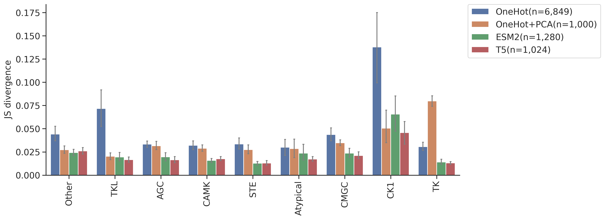
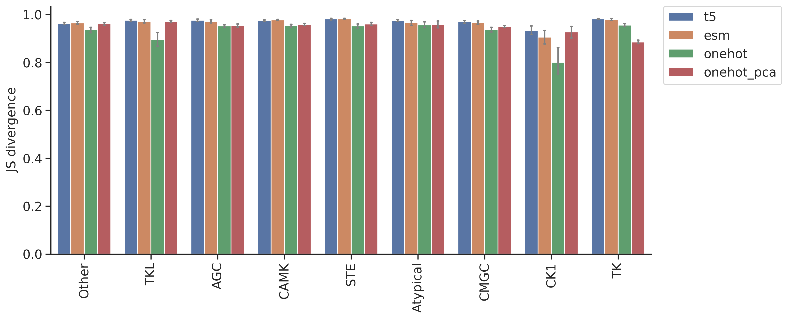

# DL training: Feature comparison on CNN model


<!-- WARNING: THIS FILE WAS AUTOGENERATED! DO NOT EDIT! -->

## Setup

``` python
import numpy as np, pandas as pd
import os, random
from katlas.data import *
from katlas.train import *
from fastai.vision.all import *
from katlas.dnn import *
```

``` python
seed_everything()
```

``` python
def_device
```

    'cuda'

## Data

``` python
df_t5=pd.read_parquet('train/pspa_t5.parquet').reset_index()
df_esm=pd.read_parquet('train/pspa_esm.parquet').reset_index()
df_onehot = pd.read_parquet('train/pspa_onehot.parquet').reset_index()
df_onehot_pca = pd.read_parquet('train/pspa_onehot_pca.parquet').reset_index()
```

``` python
(df_onehot['index'] == df_esm['index']).value_counts()
```

    index
    True    368
    Name: count, dtype: int64

``` python
(df_t5['index'] == df_esm['index']).value_counts()
```

    index
    True    368
    Name: count, dtype: int64

``` python
t5_col = df_t5.columns[df_t5.columns.str.startswith('T5_')]
```

``` python
t5_col
```

    Index(['T5_0', 'T5_1', 'T5_2', 'T5_3', 'T5_4', 'T5_5', 'T5_6', 'T5_7', 'T5_8',
           'T5_9',
           ...
           'T5_1014', 'T5_1015', 'T5_1016', 'T5_1017', 'T5_1018', 'T5_1019',
           'T5_1020', 'T5_1021', 'T5_1022', 'T5_1023'],
          dtype='object', length=1024)

``` python
esm_col = df_esm.columns[df_esm.columns.str.startswith('esm_')]
```

``` python
esm_col
```

    Index(['esm_0', 'esm_1', 'esm_2', 'esm_3', 'esm_4', 'esm_5', 'esm_6', 'esm_7',
           'esm_8', 'esm_9',
           ...
           'esm_1270', 'esm_1271', 'esm_1272', 'esm_1273', 'esm_1274', 'esm_1275',
           'esm_1276', 'esm_1277', 'esm_1278', 'esm_1279'],
          dtype='object', length=1280)

``` python
target_col = df_t5.columns[~df_t5.columns.isin(t5_col)][1:]
```

``` python
target_col
```

    Index(['-5P', '-4P', '-3P', '-2P', '-1P', '0P', '1P', '2P', '3P', '4P',
           ...
           '-5pY', '-4pY', '-3pY', '-2pY', '-1pY', '0pY', '1pY', '2pY', '3pY',
           '4pY'],
          dtype='object', length=230)

``` python
onehot_col = df_onehot.columns[~df_onehot.columns.isin(target_col)][1:]
```

``` python
onehot_col
```

    Index(['65_-', '65_A', '65_C', '65_D', '65_E', '65_F', '65_G', '65_H', '65_I',
           '65_K',
           ...
           '3192_M', '3192_N', '3192_P', '3192_Q', '3192_R', '3192_S', '3192_T',
           '3192_V', '3192_W', '3192_Y'],
          dtype='object', length=6849)

``` python
onehot_pca_col = df_onehot_pca.columns[df_onehot_pca.columns.str.startswith('PCA')]
```

``` python
onehot_pca_col
```

    Index(['PCA1', 'PCA2', 'PCA3', 'PCA4', 'PCA5', 'PCA6', 'PCA7', 'PCA8', 'PCA9',
           'PCA10',
           ...
           'PCA991', 'PCA992', 'PCA993', 'PCA994', 'PCA995', 'PCA996', 'PCA997',
           'PCA998', 'PCA999', 'PCA1000'],
          dtype='object', length=1000)

``` python
info=Data.get_kinase_info()

info = info[info.pseudo=='0']

info = info[info.kd_ID.notna()]

subfamily_map = info[['kd_ID','subfamily']].drop_duplicates().set_index('kd_ID')['subfamily']
family_map = info[['kd_ID','family']].drop_duplicates().set_index('kd_ID')['family']
group_map = info[['kd_ID','group']].drop_duplicates().set_index('kd_ID')['group']

pspa_info = pd.DataFrame(df_t5['index'].tolist(),columns=['kinase'])

pspa_info['subfamily'] = pspa_info.kinase.map(subfamily_map)
pspa_info['family'] = pspa_info.kinase.map(family_map)
pspa_info['group'] = pspa_info.kinase.map(group_map)
```

## Split

``` python
splits = get_splits(pspa_info, group='subfamily',nfold=5)

split0 = splits[0]
```

    GroupKFold(n_splits=5, random_state=None, shuffle=False)
    # subfamily in train set: 120
    # subfamily in test set: 29

## Dataset

``` python
# dataset
ds_t5 = GeneralDataset(df_t5,t5_col,target_col)
ds_esm = GeneralDataset(df_esm,esm_col,target_col)
ds_onehot = GeneralDataset(df_onehot,onehot_col,target_col)
ds_onehot_pca = GeneralDataset(df_onehot_pca,onehot_pca_col,target_col)
```

``` python
len(ds_t5)
```

    368

``` python
dl_t5 = DataLoader(ds_t5, batch_size=64, shuffle=True)
dl_esm = DataLoader(ds_esm, batch_size=64, shuffle=True)
dl_onehot = DataLoader(ds_onehot, batch_size=64, shuffle=True)
dl_onehot_pca = DataLoader(ds_onehot_pca, batch_size=64, shuffle=True)
```

``` python
xb,yb = next(iter(dl_t5))

xb.shape,yb.shape
```

    (torch.Size([64, 1024]), torch.Size([64, 23, 10]))

## Model

``` python
n_t5 = len(t5_col)
n_esm = len(esm_col)
n_onehot = len(onehot_col)
n_onehot_pca = len(onehot_pca_col)
n_target = len(target_col)
```

``` python
n_t5,n_esm,n_onehot,n_onehot_pca
```

    (1024, 1280, 6849, 1000)

``` python
# def get_cnn(): return PSSM_model(n_feature,n_target,model='CNN')

def get_cnn_t5(): return PSSM_model(n_t5,n_target,model='CNN')
def get_cnn_esm(): return PSSM_model(n_esm,n_target,model='CNN')
def get_cnn_onehot(): return PSSM_model(n_onehot,n_target,model='CNN')
def get_cnn_onehot_pca(): return PSSM_model(n_onehot_pca,n_target,model='CNN')
```

``` python
model = get_cnn_t5()
```

``` python
logits= model(xb)
```

``` python
logits.shape
```

    torch.Size([64, 23, 10])

## Loss

``` python
CE(logits,yb)
```

    tensor(3.3157, grad_fn=<MeanBackward0>)

## Metrics

``` python
KLD(logits,yb)
```

    tensor(0.5744, grad_fn=<MeanBackward0>)

``` python
JSD(logits,yb)
```

    tensor(0.1175, grad_fn=<MeanBackward0>)

## CV train

> cross-validation

``` python
oof_t5 = train_dl_cv(df_t5,t5_col,target_col,
                  splits = splits,
                  model_func = get_cnn_t5,
                  n_epoch=20,lr=3e-3)
```

    ------fold0------
    lr in training is 0.003

<style>
    /* Turns off some styling */
    progress {
        /* gets rid of default border in Firefox and Opera. */
        border: none;
        /* Needs to be in here for Safari polyfill so background images work as expected. */
        background-size: auto;
    }
    progress:not([value]), progress:not([value])::-webkit-progress-bar {
        background: repeating-linear-gradient(45deg, #7e7e7e, #7e7e7e 10px, #5c5c5c 10px, #5c5c5c 20px);
    }
    .progress-bar-interrupted, .progress-bar-interrupted::-webkit-progress-bar {
        background: #F44336;
    }
</style>

<table class="dataframe" data-quarto-postprocess="true" data-border="1">
<thead>
<tr style="text-align: left;">
<th data-quarto-table-cell-role="th">epoch</th>
<th data-quarto-table-cell-role="th">train_loss</th>
<th data-quarto-table-cell-role="th">valid_loss</th>
<th data-quarto-table-cell-role="th">KLD</th>
<th data-quarto-table-cell-role="th">JSD</th>
<th data-quarto-table-cell-role="th">time</th>
</tr>
</thead>
<tbody>
<tr>
<td>0</td>
<td>3.231986</td>
<td>3.125983</td>
<td>0.406525</td>
<td>0.085582</td>
<td>00:05</td>
</tr>
<tr>
<td>1</td>
<td>3.138005</td>
<td>3.045690</td>
<td>0.326232</td>
<td>0.073996</td>
<td>-1:59:59</td>
</tr>
<tr>
<td>2</td>
<td>3.062126</td>
<td>3.090588</td>
<td>0.371130</td>
<td>0.064781</td>
<td>00:00</td>
</tr>
<tr>
<td>3</td>
<td>3.016940</td>
<td>3.291427</td>
<td>0.571969</td>
<td>0.066470</td>
<td>00:00</td>
</tr>
<tr>
<td>4</td>
<td>2.984665</td>
<td>3.187309</td>
<td>0.467851</td>
<td>0.060243</td>
<td>00:00</td>
</tr>
<tr>
<td>5</td>
<td>2.961451</td>
<td>3.084717</td>
<td>0.365259</td>
<td>0.054002</td>
<td>00:00</td>
</tr>
<tr>
<td>6</td>
<td>2.941049</td>
<td>2.889636</td>
<td>0.170178</td>
<td>0.037260</td>
<td>00:00</td>
</tr>
<tr>
<td>7</td>
<td>2.921982</td>
<td>2.814090</td>
<td>0.094632</td>
<td>0.022759</td>
<td>00:00</td>
</tr>
<tr>
<td>8</td>
<td>2.903746</td>
<td>2.809765</td>
<td>0.090306</td>
<td>0.021266</td>
<td>00:00</td>
</tr>
<tr>
<td>9</td>
<td>2.886869</td>
<td>2.812037</td>
<td>0.092579</td>
<td>0.021582</td>
<td>00:00</td>
</tr>
<tr>
<td>10</td>
<td>2.873026</td>
<td>2.804671</td>
<td>0.085213</td>
<td>0.020041</td>
<td>00:00</td>
</tr>
<tr>
<td>11</td>
<td>2.860586</td>
<td>2.802081</td>
<td>0.082622</td>
<td>0.019404</td>
<td>00:00</td>
</tr>
<tr>
<td>12</td>
<td>2.849770</td>
<td>2.801163</td>
<td>0.081705</td>
<td>0.019056</td>
<td>00:00</td>
</tr>
<tr>
<td>13</td>
<td>2.840398</td>
<td>2.798161</td>
<td>0.078702</td>
<td>0.018495</td>
<td>00:00</td>
</tr>
<tr>
<td>14</td>
<td>2.832530</td>
<td>2.796730</td>
<td>0.077272</td>
<td>0.018087</td>
<td>00:00</td>
</tr>
<tr>
<td>15</td>
<td>2.825470</td>
<td>2.793934</td>
<td>0.074476</td>
<td>0.017469</td>
<td>00:00</td>
</tr>
<tr>
<td>16</td>
<td>2.819361</td>
<td>2.792650</td>
<td>0.073192</td>
<td>0.017139</td>
<td>00:00</td>
</tr>
<tr>
<td>17</td>
<td>2.813775</td>
<td>2.791878</td>
<td>0.072420</td>
<td>0.016957</td>
<td>00:00</td>
</tr>
<tr>
<td>18</td>
<td>2.809550</td>
<td>2.791618</td>
<td>0.072160</td>
<td>0.016895</td>
<td>00:00</td>
</tr>
<tr>
<td>19</td>
<td>2.805743</td>
<td>2.792055</td>
<td>0.072597</td>
<td>0.017010</td>
<td>00:00</td>
</tr>
</tbody>
</table>

<style>
    /* Turns off some styling */
    progress {
        /* gets rid of default border in Firefox and Opera. */
        border: none;
        /* Needs to be in here for Safari polyfill so background images work as expected. */
        background-size: auto;
    }
    progress:not([value]), progress:not([value])::-webkit-progress-bar {
        background: repeating-linear-gradient(45deg, #7e7e7e, #7e7e7e 10px, #5c5c5c 10px, #5c5c5c 20px);
    }
    .progress-bar-interrupted, .progress-bar-interrupted::-webkit-progress-bar {
        background: #F44336;
    }
</style>

    ------fold1------
    lr in training is 0.003

<style>
    /* Turns off some styling */
    progress {
        /* gets rid of default border in Firefox and Opera. */
        border: none;
        /* Needs to be in here for Safari polyfill so background images work as expected. */
        background-size: auto;
    }
    progress:not([value]), progress:not([value])::-webkit-progress-bar {
        background: repeating-linear-gradient(45deg, #7e7e7e, #7e7e7e 10px, #5c5c5c 10px, #5c5c5c 20px);
    }
    .progress-bar-interrupted, .progress-bar-interrupted::-webkit-progress-bar {
        background: #F44336;
    }
</style>

<table class="dataframe" data-quarto-postprocess="true" data-border="1">
<thead>
<tr style="text-align: left;">
<th data-quarto-table-cell-role="th">epoch</th>
<th data-quarto-table-cell-role="th">train_loss</th>
<th data-quarto-table-cell-role="th">valid_loss</th>
<th data-quarto-table-cell-role="th">KLD</th>
<th data-quarto-table-cell-role="th">JSD</th>
<th data-quarto-table-cell-role="th">time</th>
</tr>
</thead>
<tbody>
<tr>
<td>0</td>
<td>3.223793</td>
<td>3.123396</td>
<td>0.368487</td>
<td>0.080072</td>
<td>00:00</td>
</tr>
<tr>
<td>1</td>
<td>3.109371</td>
<td>2.997170</td>
<td>0.242260</td>
<td>0.058150</td>
<td>00:00</td>
</tr>
<tr>
<td>2</td>
<td>3.033735</td>
<td>3.019090</td>
<td>0.264181</td>
<td>0.044971</td>
<td>00:00</td>
</tr>
<tr>
<td>3</td>
<td>2.987771</td>
<td>3.001078</td>
<td>0.246169</td>
<td>0.046103</td>
<td>00:00</td>
</tr>
<tr>
<td>4</td>
<td>2.961214</td>
<td>2.931023</td>
<td>0.176114</td>
<td>0.040472</td>
<td>00:00</td>
</tr>
<tr>
<td>5</td>
<td>2.945465</td>
<td>3.011463</td>
<td>0.256553</td>
<td>0.040134</td>
<td>00:00</td>
</tr>
<tr>
<td>6</td>
<td>2.926350</td>
<td>2.862420</td>
<td>0.107510</td>
<td>0.025649</td>
<td>00:00</td>
</tr>
<tr>
<td>7</td>
<td>2.906650</td>
<td>2.837383</td>
<td>0.082474</td>
<td>0.019798</td>
<td>00:00</td>
</tr>
<tr>
<td>8</td>
<td>2.888857</td>
<td>2.830983</td>
<td>0.076073</td>
<td>0.018363</td>
<td>00:00</td>
</tr>
<tr>
<td>9</td>
<td>2.874208</td>
<td>2.834179</td>
<td>0.079269</td>
<td>0.019154</td>
<td>00:00</td>
</tr>
<tr>
<td>10</td>
<td>2.861201</td>
<td>2.829423</td>
<td>0.074513</td>
<td>0.017991</td>
<td>00:00</td>
</tr>
<tr>
<td>11</td>
<td>2.849588</td>
<td>2.825483</td>
<td>0.070573</td>
<td>0.017101</td>
<td>00:00</td>
</tr>
<tr>
<td>12</td>
<td>2.839652</td>
<td>2.827988</td>
<td>0.073079</td>
<td>0.017595</td>
<td>00:00</td>
</tr>
<tr>
<td>13</td>
<td>2.830881</td>
<td>2.823435</td>
<td>0.068526</td>
<td>0.016582</td>
<td>00:00</td>
</tr>
<tr>
<td>14</td>
<td>2.823120</td>
<td>2.821404</td>
<td>0.066494</td>
<td>0.016110</td>
<td>00:00</td>
</tr>
<tr>
<td>15</td>
<td>2.816741</td>
<td>2.820865</td>
<td>0.065955</td>
<td>0.016028</td>
<td>00:00</td>
</tr>
<tr>
<td>16</td>
<td>2.810546</td>
<td>2.820960</td>
<td>0.066051</td>
<td>0.015982</td>
<td>00:00</td>
</tr>
<tr>
<td>17</td>
<td>2.805398</td>
<td>2.819608</td>
<td>0.064698</td>
<td>0.015681</td>
<td>00:00</td>
</tr>
<tr>
<td>18</td>
<td>2.801101</td>
<td>2.819678</td>
<td>0.064768</td>
<td>0.015713</td>
<td>00:00</td>
</tr>
<tr>
<td>19</td>
<td>2.797163</td>
<td>2.819703</td>
<td>0.064793</td>
<td>0.015706</td>
<td>00:00</td>
</tr>
</tbody>
</table>

<style>
    /* Turns off some styling */
    progress {
        /* gets rid of default border in Firefox and Opera. */
        border: none;
        /* Needs to be in here for Safari polyfill so background images work as expected. */
        background-size: auto;
    }
    progress:not([value]), progress:not([value])::-webkit-progress-bar {
        background: repeating-linear-gradient(45deg, #7e7e7e, #7e7e7e 10px, #5c5c5c 10px, #5c5c5c 20px);
    }
    .progress-bar-interrupted, .progress-bar-interrupted::-webkit-progress-bar {
        background: #F44336;
    }
</style>

    ------fold2------
    lr in training is 0.003

<style>
    /* Turns off some styling */
    progress {
        /* gets rid of default border in Firefox and Opera. */
        border: none;
        /* Needs to be in here for Safari polyfill so background images work as expected. */
        background-size: auto;
    }
    progress:not([value]), progress:not([value])::-webkit-progress-bar {
        background: repeating-linear-gradient(45deg, #7e7e7e, #7e7e7e 10px, #5c5c5c 10px, #5c5c5c 20px);
    }
    .progress-bar-interrupted, .progress-bar-interrupted::-webkit-progress-bar {
        background: #F44336;
    }
</style>

<table class="dataframe" data-quarto-postprocess="true" data-border="1">
<thead>
<tr style="text-align: left;">
<th data-quarto-table-cell-role="th">epoch</th>
<th data-quarto-table-cell-role="th">train_loss</th>
<th data-quarto-table-cell-role="th">valid_loss</th>
<th data-quarto-table-cell-role="th">KLD</th>
<th data-quarto-table-cell-role="th">JSD</th>
<th data-quarto-table-cell-role="th">time</th>
</tr>
</thead>
<tbody>
<tr>
<td>0</td>
<td>3.205939</td>
<td>3.130619</td>
<td>0.378235</td>
<td>0.081714</td>
<td>00:00</td>
</tr>
<tr>
<td>1</td>
<td>3.090387</td>
<td>2.985123</td>
<td>0.232739</td>
<td>0.056950</td>
<td>00:00</td>
</tr>
<tr>
<td>2</td>
<td>3.015869</td>
<td>2.955130</td>
<td>0.202746</td>
<td>0.040430</td>
<td>00:00</td>
</tr>
<tr>
<td>3</td>
<td>2.973886</td>
<td>2.998454</td>
<td>0.246071</td>
<td>0.044894</td>
<td>00:00</td>
</tr>
<tr>
<td>4</td>
<td>2.949371</td>
<td>2.935931</td>
<td>0.183547</td>
<td>0.036840</td>
<td>00:00</td>
</tr>
<tr>
<td>5</td>
<td>2.933519</td>
<td>2.903759</td>
<td>0.151375</td>
<td>0.034098</td>
<td>00:00</td>
</tr>
<tr>
<td>6</td>
<td>2.916420</td>
<td>2.860321</td>
<td>0.107937</td>
<td>0.025347</td>
<td>00:00</td>
</tr>
<tr>
<td>7</td>
<td>2.899531</td>
<td>2.850880</td>
<td>0.098496</td>
<td>0.023110</td>
<td>00:00</td>
</tr>
<tr>
<td>8</td>
<td>2.883238</td>
<td>2.847718</td>
<td>0.095335</td>
<td>0.022554</td>
<td>00:00</td>
</tr>
<tr>
<td>9</td>
<td>2.869618</td>
<td>2.845551</td>
<td>0.093167</td>
<td>0.021987</td>
<td>00:00</td>
</tr>
<tr>
<td>10</td>
<td>2.857811</td>
<td>2.846352</td>
<td>0.093968</td>
<td>0.022244</td>
<td>00:00</td>
</tr>
<tr>
<td>11</td>
<td>2.847661</td>
<td>2.848390</td>
<td>0.096006</td>
<td>0.022610</td>
<td>00:00</td>
</tr>
<tr>
<td>12</td>
<td>2.837994</td>
<td>2.837989</td>
<td>0.085605</td>
<td>0.020239</td>
<td>00:00</td>
</tr>
<tr>
<td>13</td>
<td>2.829376</td>
<td>2.838523</td>
<td>0.086140</td>
<td>0.020283</td>
<td>00:00</td>
</tr>
<tr>
<td>14</td>
<td>2.821541</td>
<td>2.838088</td>
<td>0.085704</td>
<td>0.020245</td>
<td>00:00</td>
</tr>
<tr>
<td>15</td>
<td>2.814889</td>
<td>2.837663</td>
<td>0.085279</td>
<td>0.020044</td>
<td>00:00</td>
</tr>
<tr>
<td>16</td>
<td>2.809013</td>
<td>2.836939</td>
<td>0.084556</td>
<td>0.019932</td>
<td>00:00</td>
</tr>
<tr>
<td>17</td>
<td>2.804235</td>
<td>2.837022</td>
<td>0.084638</td>
<td>0.019987</td>
<td>00:00</td>
</tr>
<tr>
<td>18</td>
<td>2.800163</td>
<td>2.836908</td>
<td>0.084524</td>
<td>0.019963</td>
<td>00:00</td>
</tr>
<tr>
<td>19</td>
<td>2.796664</td>
<td>2.837320</td>
<td>0.084936</td>
<td>0.020062</td>
<td>00:00</td>
</tr>
</tbody>
</table>

<style>
    /* Turns off some styling */
    progress {
        /* gets rid of default border in Firefox and Opera. */
        border: none;
        /* Needs to be in here for Safari polyfill so background images work as expected. */
        background-size: auto;
    }
    progress:not([value]), progress:not([value])::-webkit-progress-bar {
        background: repeating-linear-gradient(45deg, #7e7e7e, #7e7e7e 10px, #5c5c5c 10px, #5c5c5c 20px);
    }
    .progress-bar-interrupted, .progress-bar-interrupted::-webkit-progress-bar {
        background: #F44336;
    }
</style>

    ------fold3------
    lr in training is 0.003

<style>
    /* Turns off some styling */
    progress {
        /* gets rid of default border in Firefox and Opera. */
        border: none;
        /* Needs to be in here for Safari polyfill so background images work as expected. */
        background-size: auto;
    }
    progress:not([value]), progress:not([value])::-webkit-progress-bar {
        background: repeating-linear-gradient(45deg, #7e7e7e, #7e7e7e 10px, #5c5c5c 10px, #5c5c5c 20px);
    }
    .progress-bar-interrupted, .progress-bar-interrupted::-webkit-progress-bar {
        background: #F44336;
    }
</style>

<table class="dataframe" data-quarto-postprocess="true" data-border="1">
<thead>
<tr style="text-align: left;">
<th data-quarto-table-cell-role="th">epoch</th>
<th data-quarto-table-cell-role="th">train_loss</th>
<th data-quarto-table-cell-role="th">valid_loss</th>
<th data-quarto-table-cell-role="th">KLD</th>
<th data-quarto-table-cell-role="th">JSD</th>
<th data-quarto-table-cell-role="th">time</th>
</tr>
</thead>
<tbody>
<tr>
<td>0</td>
<td>3.195777</td>
<td>3.128514</td>
<td>0.365497</td>
<td>0.079057</td>
<td>00:00</td>
</tr>
<tr>
<td>1</td>
<td>3.092799</td>
<td>2.992926</td>
<td>0.229910</td>
<td>0.056550</td>
<td>00:00</td>
</tr>
<tr>
<td>2</td>
<td>3.020890</td>
<td>2.947406</td>
<td>0.184389</td>
<td>0.036858</td>
<td>00:00</td>
</tr>
<tr>
<td>3</td>
<td>2.978407</td>
<td>2.962161</td>
<td>0.199145</td>
<td>0.039832</td>
<td>00:00</td>
</tr>
<tr>
<td>4</td>
<td>2.953886</td>
<td>2.903328</td>
<td>0.140312</td>
<td>0.033179</td>
<td>00:00</td>
</tr>
<tr>
<td>5</td>
<td>2.935057</td>
<td>2.900674</td>
<td>0.137657</td>
<td>0.032843</td>
<td>00:00</td>
</tr>
<tr>
<td>6</td>
<td>2.915807</td>
<td>2.865473</td>
<td>0.102457</td>
<td>0.024280</td>
<td>00:00</td>
</tr>
<tr>
<td>7</td>
<td>2.896900</td>
<td>2.858213</td>
<td>0.095196</td>
<td>0.022447</td>
<td>-1:59:59</td>
</tr>
<tr>
<td>8</td>
<td>2.880532</td>
<td>2.851980</td>
<td>0.088964</td>
<td>0.020906</td>
<td>00:00</td>
</tr>
<tr>
<td>9</td>
<td>2.865812</td>
<td>2.847365</td>
<td>0.084349</td>
<td>0.019993</td>
<td>00:00</td>
</tr>
<tr>
<td>10</td>
<td>2.854017</td>
<td>2.852216</td>
<td>0.089200</td>
<td>0.021138</td>
<td>00:00</td>
</tr>
<tr>
<td>11</td>
<td>2.843368</td>
<td>2.847860</td>
<td>0.084843</td>
<td>0.020181</td>
<td>00:00</td>
</tr>
<tr>
<td>12</td>
<td>2.834106</td>
<td>2.849026</td>
<td>0.086009</td>
<td>0.020298</td>
<td>00:00</td>
</tr>
<tr>
<td>13</td>
<td>2.825445</td>
<td>2.847659</td>
<td>0.084642</td>
<td>0.019993</td>
<td>00:00</td>
</tr>
<tr>
<td>14</td>
<td>2.817815</td>
<td>2.844594</td>
<td>0.081577</td>
<td>0.019337</td>
<td>00:00</td>
</tr>
<tr>
<td>15</td>
<td>2.811150</td>
<td>2.846112</td>
<td>0.083096</td>
<td>0.019709</td>
<td>00:00</td>
</tr>
<tr>
<td>16</td>
<td>2.805433</td>
<td>2.846061</td>
<td>0.083044</td>
<td>0.019748</td>
<td>00:00</td>
</tr>
<tr>
<td>17</td>
<td>2.800725</td>
<td>2.844932</td>
<td>0.081915</td>
<td>0.019495</td>
<td>00:00</td>
</tr>
<tr>
<td>18</td>
<td>2.796557</td>
<td>2.844240</td>
<td>0.081223</td>
<td>0.019321</td>
<td>00:00</td>
</tr>
<tr>
<td>19</td>
<td>2.792958</td>
<td>2.843945</td>
<td>0.080928</td>
<td>0.019248</td>
<td>00:00</td>
</tr>
</tbody>
</table>

<style>
    /* Turns off some styling */
    progress {
        /* gets rid of default border in Firefox and Opera. */
        border: none;
        /* Needs to be in here for Safari polyfill so background images work as expected. */
        background-size: auto;
    }
    progress:not([value]), progress:not([value])::-webkit-progress-bar {
        background: repeating-linear-gradient(45deg, #7e7e7e, #7e7e7e 10px, #5c5c5c 10px, #5c5c5c 20px);
    }
    .progress-bar-interrupted, .progress-bar-interrupted::-webkit-progress-bar {
        background: #F44336;
    }
</style>

    ------fold4------
    lr in training is 0.003

<style>
    /* Turns off some styling */
    progress {
        /* gets rid of default border in Firefox and Opera. */
        border: none;
        /* Needs to be in here for Safari polyfill so background images work as expected. */
        background-size: auto;
    }
    progress:not([value]), progress:not([value])::-webkit-progress-bar {
        background: repeating-linear-gradient(45deg, #7e7e7e, #7e7e7e 10px, #5c5c5c 10px, #5c5c5c 20px);
    }
    .progress-bar-interrupted, .progress-bar-interrupted::-webkit-progress-bar {
        background: #F44336;
    }
</style>

<table class="dataframe" data-quarto-postprocess="true" data-border="1">
<thead>
<tr style="text-align: left;">
<th data-quarto-table-cell-role="th">epoch</th>
<th data-quarto-table-cell-role="th">train_loss</th>
<th data-quarto-table-cell-role="th">valid_loss</th>
<th data-quarto-table-cell-role="th">KLD</th>
<th data-quarto-table-cell-role="th">JSD</th>
<th data-quarto-table-cell-role="th">time</th>
</tr>
</thead>
<tbody>
<tr>
<td>0</td>
<td>3.215276</td>
<td>3.119204</td>
<td>0.369650</td>
<td>0.080322</td>
<td>00:00</td>
</tr>
<tr>
<td>1</td>
<td>3.105301</td>
<td>3.022647</td>
<td>0.273093</td>
<td>0.061793</td>
<td>00:00</td>
</tr>
<tr>
<td>2</td>
<td>3.028362</td>
<td>3.080863</td>
<td>0.331309</td>
<td>0.054420</td>
<td>00:00</td>
</tr>
<tr>
<td>3</td>
<td>2.985426</td>
<td>3.196383</td>
<td>0.446829</td>
<td>0.055891</td>
<td>00:00</td>
</tr>
<tr>
<td>4</td>
<td>2.960793</td>
<td>3.046122</td>
<td>0.296568</td>
<td>0.049703</td>
<td>00:00</td>
</tr>
<tr>
<td>5</td>
<td>2.939009</td>
<td>3.013057</td>
<td>0.263503</td>
<td>0.045952</td>
<td>00:00</td>
</tr>
<tr>
<td>6</td>
<td>2.919321</td>
<td>2.914121</td>
<td>0.164567</td>
<td>0.036086</td>
<td>00:00</td>
</tr>
<tr>
<td>7</td>
<td>2.903089</td>
<td>2.873691</td>
<td>0.124137</td>
<td>0.027872</td>
<td>00:00</td>
</tr>
<tr>
<td>8</td>
<td>2.885899</td>
<td>2.859200</td>
<td>0.109647</td>
<td>0.025433</td>
<td>00:00</td>
</tr>
<tr>
<td>9</td>
<td>2.871264</td>
<td>2.847255</td>
<td>0.097701</td>
<td>0.022960</td>
<td>00:00</td>
</tr>
<tr>
<td>10</td>
<td>2.858492</td>
<td>2.841490</td>
<td>0.091936</td>
<td>0.021539</td>
<td>00:00</td>
</tr>
<tr>
<td>11</td>
<td>2.847539</td>
<td>2.846025</td>
<td>0.096471</td>
<td>0.022673</td>
<td>00:00</td>
</tr>
<tr>
<td>12</td>
<td>2.838090</td>
<td>2.838202</td>
<td>0.088648</td>
<td>0.020919</td>
<td>00:00</td>
</tr>
<tr>
<td>13</td>
<td>2.829323</td>
<td>2.837742</td>
<td>0.088187</td>
<td>0.020805</td>
<td>00:00</td>
</tr>
<tr>
<td>14</td>
<td>2.821924</td>
<td>2.836483</td>
<td>0.086929</td>
<td>0.020406</td>
<td>00:00</td>
</tr>
<tr>
<td>15</td>
<td>2.815163</td>
<td>2.835881</td>
<td>0.086327</td>
<td>0.020336</td>
<td>00:00</td>
</tr>
<tr>
<td>16</td>
<td>2.809431</td>
<td>2.836192</td>
<td>0.086638</td>
<td>0.020370</td>
<td>00:00</td>
</tr>
<tr>
<td>17</td>
<td>2.804560</td>
<td>2.835043</td>
<td>0.085489</td>
<td>0.020140</td>
<td>00:00</td>
</tr>
<tr>
<td>18</td>
<td>2.800263</td>
<td>2.834559</td>
<td>0.085005</td>
<td>0.019972</td>
<td>00:00</td>
</tr>
<tr>
<td>19</td>
<td>2.796827</td>
<td>2.834709</td>
<td>0.085155</td>
<td>0.019986</td>
<td>00:00</td>
</tr>
</tbody>
</table>

<style>
    /* Turns off some styling */
    progress {
        /* gets rid of default border in Firefox and Opera. */
        border: none;
        /* Needs to be in here for Safari polyfill so background images work as expected. */
        background-size: auto;
    }
    progress:not([value]), progress:not([value])::-webkit-progress-bar {
        background: repeating-linear-gradient(45deg, #7e7e7e, #7e7e7e 10px, #5c5c5c 10px, #5c5c5c 20px);
    }
    .progress-bar-interrupted, .progress-bar-interrupted::-webkit-progress-bar {
        background: #F44336;
    }
</style>

``` python
oof_esm = train_dl_cv(df_esm,esm_col,target_col,
                  splits = splits,
                  model_func = get_cnn_esm,
                  n_epoch=20,lr=3e-3)
```

    ------fold0------
    lr in training is 0.003

<style>
    /* Turns off some styling */
    progress {
        /* gets rid of default border in Firefox and Opera. */
        border: none;
        /* Needs to be in here for Safari polyfill so background images work as expected. */
        background-size: auto;
    }
    progress:not([value]), progress:not([value])::-webkit-progress-bar {
        background: repeating-linear-gradient(45deg, #7e7e7e, #7e7e7e 10px, #5c5c5c 10px, #5c5c5c 20px);
    }
    .progress-bar-interrupted, .progress-bar-interrupted::-webkit-progress-bar {
        background: #F44336;
    }
</style>

<table class="dataframe" data-quarto-postprocess="true" data-border="1">
<thead>
<tr style="text-align: left;">
<th data-quarto-table-cell-role="th">epoch</th>
<th data-quarto-table-cell-role="th">train_loss</th>
<th data-quarto-table-cell-role="th">valid_loss</th>
<th data-quarto-table-cell-role="th">KLD</th>
<th data-quarto-table-cell-role="th">JSD</th>
<th data-quarto-table-cell-role="th">time</th>
</tr>
</thead>
<tbody>
<tr>
<td>0</td>
<td>3.218573</td>
<td>3.130500</td>
<td>0.411041</td>
<td>0.085887</td>
<td>00:00</td>
</tr>
<tr>
<td>1</td>
<td>3.113306</td>
<td>3.063366</td>
<td>0.343908</td>
<td>0.072510</td>
<td>00:00</td>
</tr>
<tr>
<td>2</td>
<td>3.044713</td>
<td>3.128430</td>
<td>0.408971</td>
<td>0.062826</td>
<td>00:00</td>
</tr>
<tr>
<td>3</td>
<td>3.012064</td>
<td>2.918778</td>
<td>0.199320</td>
<td>0.044662</td>
<td>00:00</td>
</tr>
<tr>
<td>4</td>
<td>2.992838</td>
<td>2.883704</td>
<td>0.164246</td>
<td>0.038140</td>
<td>00:00</td>
</tr>
<tr>
<td>5</td>
<td>2.973829</td>
<td>2.886671</td>
<td>0.167212</td>
<td>0.033750</td>
<td>00:00</td>
</tr>
<tr>
<td>6</td>
<td>2.950023</td>
<td>2.871562</td>
<td>0.152104</td>
<td>0.033124</td>
<td>00:00</td>
</tr>
<tr>
<td>7</td>
<td>2.928650</td>
<td>2.842351</td>
<td>0.122893</td>
<td>0.028465</td>
<td>00:00</td>
</tr>
<tr>
<td>8</td>
<td>2.909526</td>
<td>2.846817</td>
<td>0.127358</td>
<td>0.028738</td>
<td>00:00</td>
</tr>
<tr>
<td>9</td>
<td>2.893397</td>
<td>2.839327</td>
<td>0.119868</td>
<td>0.027651</td>
<td>00:00</td>
</tr>
<tr>
<td>10</td>
<td>2.879705</td>
<td>2.830204</td>
<td>0.110746</td>
<td>0.024490</td>
<td>00:00</td>
</tr>
<tr>
<td>11</td>
<td>2.867001</td>
<td>2.815144</td>
<td>0.095686</td>
<td>0.022132</td>
<td>00:00</td>
</tr>
<tr>
<td>12</td>
<td>2.856134</td>
<td>2.815215</td>
<td>0.095757</td>
<td>0.021334</td>
<td>00:00</td>
</tr>
<tr>
<td>13</td>
<td>2.846439</td>
<td>2.817239</td>
<td>0.097781</td>
<td>0.021900</td>
<td>00:00</td>
</tr>
<tr>
<td>14</td>
<td>2.837932</td>
<td>2.804470</td>
<td>0.085012</td>
<td>0.019254</td>
<td>00:00</td>
</tr>
<tr>
<td>15</td>
<td>2.830515</td>
<td>2.802957</td>
<td>0.083499</td>
<td>0.018903</td>
<td>00:00</td>
</tr>
<tr>
<td>16</td>
<td>2.823586</td>
<td>2.798179</td>
<td>0.078721</td>
<td>0.017778</td>
<td>00:00</td>
</tr>
<tr>
<td>17</td>
<td>2.818660</td>
<td>2.797979</td>
<td>0.078521</td>
<td>0.017781</td>
<td>00:00</td>
</tr>
<tr>
<td>18</td>
<td>2.813803</td>
<td>2.799959</td>
<td>0.080501</td>
<td>0.018190</td>
<td>00:00</td>
</tr>
<tr>
<td>19</td>
<td>2.809424</td>
<td>2.804340</td>
<td>0.084882</td>
<td>0.019029</td>
<td>00:00</td>
</tr>
</tbody>
</table>

<style>
    /* Turns off some styling */
    progress {
        /* gets rid of default border in Firefox and Opera. */
        border: none;
        /* Needs to be in here for Safari polyfill so background images work as expected. */
        background-size: auto;
    }
    progress:not([value]), progress:not([value])::-webkit-progress-bar {
        background: repeating-linear-gradient(45deg, #7e7e7e, #7e7e7e 10px, #5c5c5c 10px, #5c5c5c 20px);
    }
    .progress-bar-interrupted, .progress-bar-interrupted::-webkit-progress-bar {
        background: #F44336;
    }
</style>

    ------fold1------
    lr in training is 0.003

<style>
    /* Turns off some styling */
    progress {
        /* gets rid of default border in Firefox and Opera. */
        border: none;
        /* Needs to be in here for Safari polyfill so background images work as expected. */
        background-size: auto;
    }
    progress:not([value]), progress:not([value])::-webkit-progress-bar {
        background: repeating-linear-gradient(45deg, #7e7e7e, #7e7e7e 10px, #5c5c5c 10px, #5c5c5c 20px);
    }
    .progress-bar-interrupted, .progress-bar-interrupted::-webkit-progress-bar {
        background: #F44336;
    }
</style>

<table class="dataframe" data-quarto-postprocess="true" data-border="1">
<thead>
<tr style="text-align: left;">
<th data-quarto-table-cell-role="th">epoch</th>
<th data-quarto-table-cell-role="th">train_loss</th>
<th data-quarto-table-cell-role="th">valid_loss</th>
<th data-quarto-table-cell-role="th">KLD</th>
<th data-quarto-table-cell-role="th">JSD</th>
<th data-quarto-table-cell-role="th">time</th>
</tr>
</thead>
<tbody>
<tr>
<td>0</td>
<td>3.211175</td>
<td>3.126740</td>
<td>0.371830</td>
<td>0.080277</td>
<td>00:00</td>
</tr>
<tr>
<td>1</td>
<td>3.097714</td>
<td>3.006917</td>
<td>0.252008</td>
<td>0.059454</td>
<td>00:00</td>
</tr>
<tr>
<td>2</td>
<td>3.029892</td>
<td>2.989221</td>
<td>0.234312</td>
<td>0.043331</td>
<td>00:00</td>
</tr>
<tr>
<td>3</td>
<td>2.996601</td>
<td>2.897515</td>
<td>0.142605</td>
<td>0.033353</td>
<td>00:00</td>
</tr>
<tr>
<td>4</td>
<td>2.971514</td>
<td>2.883874</td>
<td>0.128964</td>
<td>0.030243</td>
<td>00:00</td>
</tr>
<tr>
<td>5</td>
<td>2.950985</td>
<td>2.868078</td>
<td>0.113169</td>
<td>0.026240</td>
<td>00:00</td>
</tr>
<tr>
<td>6</td>
<td>2.929707</td>
<td>2.863897</td>
<td>0.108988</td>
<td>0.025840</td>
<td>00:00</td>
</tr>
<tr>
<td>7</td>
<td>2.909894</td>
<td>2.847964</td>
<td>0.093055</td>
<td>0.022102</td>
<td>00:00</td>
</tr>
<tr>
<td>8</td>
<td>2.891619</td>
<td>2.835438</td>
<td>0.080528</td>
<td>0.019342</td>
<td>00:00</td>
</tr>
<tr>
<td>9</td>
<td>2.875592</td>
<td>2.832419</td>
<td>0.077509</td>
<td>0.018515</td>
<td>00:00</td>
</tr>
<tr>
<td>10</td>
<td>2.861742</td>
<td>2.844769</td>
<td>0.089860</td>
<td>0.021164</td>
<td>00:00</td>
</tr>
<tr>
<td>11</td>
<td>2.850034</td>
<td>2.837570</td>
<td>0.082661</td>
<td>0.019627</td>
<td>-1:59:59</td>
</tr>
<tr>
<td>12</td>
<td>2.840404</td>
<td>2.834485</td>
<td>0.079576</td>
<td>0.018942</td>
<td>00:00</td>
</tr>
<tr>
<td>13</td>
<td>2.831792</td>
<td>2.829283</td>
<td>0.074373</td>
<td>0.017769</td>
<td>00:00</td>
</tr>
<tr>
<td>14</td>
<td>2.823824</td>
<td>2.832996</td>
<td>0.078087</td>
<td>0.018544</td>
<td>00:00</td>
</tr>
<tr>
<td>15</td>
<td>2.817176</td>
<td>2.830905</td>
<td>0.075995</td>
<td>0.018151</td>
<td>00:00</td>
</tr>
<tr>
<td>16</td>
<td>2.811294</td>
<td>2.828579</td>
<td>0.073670</td>
<td>0.017569</td>
<td>00:00</td>
</tr>
<tr>
<td>17</td>
<td>2.805925</td>
<td>2.828720</td>
<td>0.073810</td>
<td>0.017546</td>
<td>00:00</td>
</tr>
<tr>
<td>18</td>
<td>2.802000</td>
<td>2.828678</td>
<td>0.073768</td>
<td>0.017531</td>
<td>00:00</td>
</tr>
<tr>
<td>19</td>
<td>2.798535</td>
<td>2.829595</td>
<td>0.074686</td>
<td>0.017751</td>
<td>00:00</td>
</tr>
</tbody>
</table>

<style>
    /* Turns off some styling */
    progress {
        /* gets rid of default border in Firefox and Opera. */
        border: none;
        /* Needs to be in here for Safari polyfill so background images work as expected. */
        background-size: auto;
    }
    progress:not([value]), progress:not([value])::-webkit-progress-bar {
        background: repeating-linear-gradient(45deg, #7e7e7e, #7e7e7e 10px, #5c5c5c 10px, #5c5c5c 20px);
    }
    .progress-bar-interrupted, .progress-bar-interrupted::-webkit-progress-bar {
        background: #F44336;
    }
</style>

    ------fold2------
    lr in training is 0.003

<style>
    /* Turns off some styling */
    progress {
        /* gets rid of default border in Firefox and Opera. */
        border: none;
        /* Needs to be in here for Safari polyfill so background images work as expected. */
        background-size: auto;
    }
    progress:not([value]), progress:not([value])::-webkit-progress-bar {
        background: repeating-linear-gradient(45deg, #7e7e7e, #7e7e7e 10px, #5c5c5c 10px, #5c5c5c 20px);
    }
    .progress-bar-interrupted, .progress-bar-interrupted::-webkit-progress-bar {
        background: #F44336;
    }
</style>

<table class="dataframe" data-quarto-postprocess="true" data-border="1">
<thead>
<tr style="text-align: left;">
<th data-quarto-table-cell-role="th">epoch</th>
<th data-quarto-table-cell-role="th">train_loss</th>
<th data-quarto-table-cell-role="th">valid_loss</th>
<th data-quarto-table-cell-role="th">KLD</th>
<th data-quarto-table-cell-role="th">JSD</th>
<th data-quarto-table-cell-role="th">time</th>
</tr>
</thead>
<tbody>
<tr>
<td>0</td>
<td>3.189650</td>
<td>3.118795</td>
<td>0.366411</td>
<td>0.080454</td>
<td>00:00</td>
</tr>
<tr>
<td>1</td>
<td>3.072933</td>
<td>2.949069</td>
<td>0.196684</td>
<td>0.047955</td>
<td>00:00</td>
</tr>
<tr>
<td>2</td>
<td>3.003989</td>
<td>2.902878</td>
<td>0.150494</td>
<td>0.033450</td>
<td>00:00</td>
</tr>
<tr>
<td>3</td>
<td>2.965584</td>
<td>2.923450</td>
<td>0.171066</td>
<td>0.038818</td>
<td>00:00</td>
</tr>
<tr>
<td>4</td>
<td>2.947126</td>
<td>2.894336</td>
<td>0.141952</td>
<td>0.032567</td>
<td>00:00</td>
</tr>
<tr>
<td>5</td>
<td>2.933414</td>
<td>2.899068</td>
<td>0.146684</td>
<td>0.030714</td>
<td>00:00</td>
</tr>
<tr>
<td>6</td>
<td>2.917402</td>
<td>2.874743</td>
<td>0.122359</td>
<td>0.027284</td>
<td>00:00</td>
</tr>
<tr>
<td>7</td>
<td>2.903033</td>
<td>2.867019</td>
<td>0.114635</td>
<td>0.026187</td>
<td>00:00</td>
</tr>
<tr>
<td>8</td>
<td>2.887363</td>
<td>2.861744</td>
<td>0.109360</td>
<td>0.025812</td>
<td>00:00</td>
</tr>
<tr>
<td>9</td>
<td>2.873385</td>
<td>2.852415</td>
<td>0.100031</td>
<td>0.023334</td>
<td>00:00</td>
</tr>
<tr>
<td>10</td>
<td>2.860936</td>
<td>2.855808</td>
<td>0.103425</td>
<td>0.024052</td>
<td>00:00</td>
</tr>
<tr>
<td>11</td>
<td>2.849715</td>
<td>2.848728</td>
<td>0.096344</td>
<td>0.022468</td>
<td>00:00</td>
</tr>
<tr>
<td>12</td>
<td>2.840556</td>
<td>2.851071</td>
<td>0.098687</td>
<td>0.022918</td>
<td>00:00</td>
</tr>
<tr>
<td>13</td>
<td>2.831758</td>
<td>2.845567</td>
<td>0.093183</td>
<td>0.021839</td>
<td>00:00</td>
</tr>
<tr>
<td>14</td>
<td>2.824259</td>
<td>2.845999</td>
<td>0.093615</td>
<td>0.021907</td>
<td>00:00</td>
</tr>
<tr>
<td>15</td>
<td>2.817586</td>
<td>2.840322</td>
<td>0.087939</td>
<td>0.020656</td>
<td>00:00</td>
</tr>
<tr>
<td>16</td>
<td>2.811570</td>
<td>2.841125</td>
<td>0.088741</td>
<td>0.020902</td>
<td>00:00</td>
</tr>
<tr>
<td>17</td>
<td>2.806726</td>
<td>2.842466</td>
<td>0.090083</td>
<td>0.021186</td>
<td>00:00</td>
</tr>
<tr>
<td>18</td>
<td>2.802485</td>
<td>2.842681</td>
<td>0.090297</td>
<td>0.021231</td>
<td>00:00</td>
</tr>
<tr>
<td>19</td>
<td>2.798630</td>
<td>2.842020</td>
<td>0.089636</td>
<td>0.021074</td>
<td>00:00</td>
</tr>
</tbody>
</table>

<style>
    /* Turns off some styling */
    progress {
        /* gets rid of default border in Firefox and Opera. */
        border: none;
        /* Needs to be in here for Safari polyfill so background images work as expected. */
        background-size: auto;
    }
    progress:not([value]), progress:not([value])::-webkit-progress-bar {
        background: repeating-linear-gradient(45deg, #7e7e7e, #7e7e7e 10px, #5c5c5c 10px, #5c5c5c 20px);
    }
    .progress-bar-interrupted, .progress-bar-interrupted::-webkit-progress-bar {
        background: #F44336;
    }
</style>

    ------fold3------
    lr in training is 0.003

<style>
    /* Turns off some styling */
    progress {
        /* gets rid of default border in Firefox and Opera. */
        border: none;
        /* Needs to be in here for Safari polyfill so background images work as expected. */
        background-size: auto;
    }
    progress:not([value]), progress:not([value])::-webkit-progress-bar {
        background: repeating-linear-gradient(45deg, #7e7e7e, #7e7e7e 10px, #5c5c5c 10px, #5c5c5c 20px);
    }
    .progress-bar-interrupted, .progress-bar-interrupted::-webkit-progress-bar {
        background: #F44336;
    }
</style>

<table class="dataframe" data-quarto-postprocess="true" data-border="1">
<thead>
<tr style="text-align: left;">
<th data-quarto-table-cell-role="th">epoch</th>
<th data-quarto-table-cell-role="th">train_loss</th>
<th data-quarto-table-cell-role="th">valid_loss</th>
<th data-quarto-table-cell-role="th">KLD</th>
<th data-quarto-table-cell-role="th">JSD</th>
<th data-quarto-table-cell-role="th">time</th>
</tr>
</thead>
<tbody>
<tr>
<td>0</td>
<td>3.195183</td>
<td>3.118322</td>
<td>0.355305</td>
<td>0.077934</td>
<td>00:00</td>
</tr>
<tr>
<td>1</td>
<td>3.082233</td>
<td>2.968889</td>
<td>0.205872</td>
<td>0.049987</td>
<td>00:00</td>
</tr>
<tr>
<td>2</td>
<td>3.011883</td>
<td>2.904984</td>
<td>0.141968</td>
<td>0.033716</td>
<td>00:00</td>
</tr>
<tr>
<td>3</td>
<td>2.976276</td>
<td>2.899045</td>
<td>0.136029</td>
<td>0.031855</td>
<td>00:00</td>
</tr>
<tr>
<td>4</td>
<td>2.955704</td>
<td>2.873515</td>
<td>0.110498</td>
<td>0.026167</td>
<td>00:00</td>
</tr>
<tr>
<td>5</td>
<td>2.940040</td>
<td>2.871017</td>
<td>0.108000</td>
<td>0.025250</td>
<td>00:00</td>
</tr>
<tr>
<td>6</td>
<td>2.924179</td>
<td>2.870664</td>
<td>0.107647</td>
<td>0.025609</td>
<td>00:00</td>
</tr>
<tr>
<td>7</td>
<td>2.906053</td>
<td>2.868157</td>
<td>0.105140</td>
<td>0.024547</td>
<td>00:00</td>
</tr>
<tr>
<td>8</td>
<td>2.890117</td>
<td>2.877202</td>
<td>0.114185</td>
<td>0.026758</td>
<td>00:00</td>
</tr>
<tr>
<td>9</td>
<td>2.877448</td>
<td>2.862576</td>
<td>0.099559</td>
<td>0.023611</td>
<td>00:00</td>
</tr>
<tr>
<td>10</td>
<td>2.865353</td>
<td>2.870563</td>
<td>0.107546</td>
<td>0.025280</td>
<td>00:00</td>
</tr>
<tr>
<td>11</td>
<td>2.854365</td>
<td>2.874944</td>
<td>0.111927</td>
<td>0.025855</td>
<td>00:00</td>
</tr>
<tr>
<td>12</td>
<td>2.844372</td>
<td>2.848586</td>
<td>0.085569</td>
<td>0.020533</td>
<td>00:00</td>
</tr>
<tr>
<td>13</td>
<td>2.835772</td>
<td>2.843719</td>
<td>0.080703</td>
<td>0.019419</td>
<td>00:00</td>
</tr>
<tr>
<td>14</td>
<td>2.827890</td>
<td>2.840074</td>
<td>0.077057</td>
<td>0.018537</td>
<td>00:00</td>
</tr>
<tr>
<td>15</td>
<td>2.821218</td>
<td>2.842312</td>
<td>0.079296</td>
<td>0.019070</td>
<td>00:00</td>
</tr>
<tr>
<td>16</td>
<td>2.814460</td>
<td>2.843519</td>
<td>0.080502</td>
<td>0.019425</td>
<td>00:00</td>
</tr>
<tr>
<td>17</td>
<td>2.808998</td>
<td>2.843082</td>
<td>0.080066</td>
<td>0.019307</td>
<td>00:00</td>
</tr>
<tr>
<td>18</td>
<td>2.804054</td>
<td>2.842385</td>
<td>0.079369</td>
<td>0.019130</td>
<td>00:00</td>
</tr>
<tr>
<td>19</td>
<td>2.800103</td>
<td>2.842556</td>
<td>0.079539</td>
<td>0.019165</td>
<td>00:00</td>
</tr>
</tbody>
</table>

<style>
    /* Turns off some styling */
    progress {
        /* gets rid of default border in Firefox and Opera. */
        border: none;
        /* Needs to be in here for Safari polyfill so background images work as expected. */
        background-size: auto;
    }
    progress:not([value]), progress:not([value])::-webkit-progress-bar {
        background: repeating-linear-gradient(45deg, #7e7e7e, #7e7e7e 10px, #5c5c5c 10px, #5c5c5c 20px);
    }
    .progress-bar-interrupted, .progress-bar-interrupted::-webkit-progress-bar {
        background: #F44336;
    }
</style>

    ------fold4------
    lr in training is 0.003

<style>
    /* Turns off some styling */
    progress {
        /* gets rid of default border in Firefox and Opera. */
        border: none;
        /* Needs to be in here for Safari polyfill so background images work as expected. */
        background-size: auto;
    }
    progress:not([value]), progress:not([value])::-webkit-progress-bar {
        background: repeating-linear-gradient(45deg, #7e7e7e, #7e7e7e 10px, #5c5c5c 10px, #5c5c5c 20px);
    }
    .progress-bar-interrupted, .progress-bar-interrupted::-webkit-progress-bar {
        background: #F44336;
    }
</style>

<table class="dataframe" data-quarto-postprocess="true" data-border="1">
<thead>
<tr style="text-align: left;">
<th data-quarto-table-cell-role="th">epoch</th>
<th data-quarto-table-cell-role="th">train_loss</th>
<th data-quarto-table-cell-role="th">valid_loss</th>
<th data-quarto-table-cell-role="th">KLD</th>
<th data-quarto-table-cell-role="th">JSD</th>
<th data-quarto-table-cell-role="th">time</th>
</tr>
</thead>
<tbody>
<tr>
<td>0</td>
<td>3.215894</td>
<td>3.136908</td>
<td>0.387354</td>
<td>0.082165</td>
<td>00:00</td>
</tr>
<tr>
<td>1</td>
<td>3.104306</td>
<td>3.038435</td>
<td>0.288881</td>
<td>0.063788</td>
<td>00:00</td>
</tr>
<tr>
<td>2</td>
<td>3.030590</td>
<td>2.996898</td>
<td>0.247344</td>
<td>0.048807</td>
<td>00:00</td>
</tr>
<tr>
<td>3</td>
<td>2.991358</td>
<td>3.048996</td>
<td>0.299443</td>
<td>0.054110</td>
<td>00:00</td>
</tr>
<tr>
<td>4</td>
<td>2.970840</td>
<td>2.980138</td>
<td>0.230584</td>
<td>0.042031</td>
<td>00:00</td>
</tr>
<tr>
<td>5</td>
<td>2.953562</td>
<td>2.913853</td>
<td>0.164299</td>
<td>0.032929</td>
<td>00:00</td>
</tr>
<tr>
<td>6</td>
<td>2.932394</td>
<td>2.891885</td>
<td>0.142331</td>
<td>0.030453</td>
<td>00:00</td>
</tr>
<tr>
<td>7</td>
<td>2.912592</td>
<td>2.876103</td>
<td>0.126549</td>
<td>0.028662</td>
<td>00:00</td>
</tr>
<tr>
<td>8</td>
<td>2.894378</td>
<td>2.854946</td>
<td>0.105392</td>
<td>0.024091</td>
<td>00:00</td>
</tr>
<tr>
<td>9</td>
<td>2.880475</td>
<td>2.878469</td>
<td>0.128915</td>
<td>0.029187</td>
<td>00:00</td>
</tr>
<tr>
<td>10</td>
<td>2.869399</td>
<td>2.866315</td>
<td>0.116761</td>
<td>0.026870</td>
<td>-1:59:59</td>
</tr>
<tr>
<td>11</td>
<td>2.858616</td>
<td>2.857310</td>
<td>0.107756</td>
<td>0.024535</td>
<td>00:00</td>
</tr>
<tr>
<td>12</td>
<td>2.848621</td>
<td>2.851251</td>
<td>0.101698</td>
<td>0.023382</td>
<td>00:00</td>
</tr>
<tr>
<td>13</td>
<td>2.839408</td>
<td>2.850880</td>
<td>0.101326</td>
<td>0.023133</td>
<td>00:00</td>
</tr>
<tr>
<td>14</td>
<td>2.831282</td>
<td>2.846311</td>
<td>0.096757</td>
<td>0.021999</td>
<td>00:00</td>
</tr>
<tr>
<td>15</td>
<td>2.823905</td>
<td>2.847420</td>
<td>0.097865</td>
<td>0.022233</td>
<td>00:00</td>
</tr>
<tr>
<td>16</td>
<td>2.817375</td>
<td>2.846087</td>
<td>0.096534</td>
<td>0.021952</td>
<td>00:00</td>
</tr>
<tr>
<td>17</td>
<td>2.811876</td>
<td>2.846603</td>
<td>0.097049</td>
<td>0.022015</td>
<td>00:00</td>
</tr>
<tr>
<td>18</td>
<td>2.807177</td>
<td>2.846167</td>
<td>0.096613</td>
<td>0.021907</td>
<td>00:00</td>
</tr>
<tr>
<td>19</td>
<td>2.803102</td>
<td>2.845773</td>
<td>0.096219</td>
<td>0.021831</td>
<td>00:00</td>
</tr>
</tbody>
</table>

<style>
    /* Turns off some styling */
    progress {
        /* gets rid of default border in Firefox and Opera. */
        border: none;
        /* Needs to be in here for Safari polyfill so background images work as expected. */
        background-size: auto;
    }
    progress:not([value]), progress:not([value])::-webkit-progress-bar {
        background: repeating-linear-gradient(45deg, #7e7e7e, #7e7e7e 10px, #5c5c5c 10px, #5c5c5c 20px);
    }
    .progress-bar-interrupted, .progress-bar-interrupted::-webkit-progress-bar {
        background: #F44336;
    }
</style>

``` python
oof_onehot = train_dl_cv(df_onehot,onehot_col,target_col,
                  splits = splits,
                  model_func = get_cnn_onehot,
                  n_epoch=20,lr=3e-3)
```

    ------fold0------
    lr in training is 0.003

<style>
    /* Turns off some styling */
    progress {
        /* gets rid of default border in Firefox and Opera. */
        border: none;
        /* Needs to be in here for Safari polyfill so background images work as expected. */
        background-size: auto;
    }
    progress:not([value]), progress:not([value])::-webkit-progress-bar {
        background: repeating-linear-gradient(45deg, #7e7e7e, #7e7e7e 10px, #5c5c5c 10px, #5c5c5c 20px);
    }
    .progress-bar-interrupted, .progress-bar-interrupted::-webkit-progress-bar {
        background: #F44336;
    }
</style>

<table class="dataframe" data-quarto-postprocess="true" data-border="1">
<thead>
<tr style="text-align: left;">
<th data-quarto-table-cell-role="th">epoch</th>
<th data-quarto-table-cell-role="th">train_loss</th>
<th data-quarto-table-cell-role="th">valid_loss</th>
<th data-quarto-table-cell-role="th">KLD</th>
<th data-quarto-table-cell-role="th">JSD</th>
<th data-quarto-table-cell-role="th">time</th>
</tr>
</thead>
<tbody>
<tr>
<td>0</td>
<td>3.241729</td>
<td>3.129855</td>
<td>0.410396</td>
<td>0.085954</td>
<td>00:00</td>
</tr>
<tr>
<td>1</td>
<td>3.118459</td>
<td>2.949030</td>
<td>0.229572</td>
<td>0.057765</td>
<td>00:00</td>
</tr>
<tr>
<td>2</td>
<td>3.033988</td>
<td>3.190781</td>
<td>0.471323</td>
<td>0.088334</td>
<td>00:00</td>
</tr>
<tr>
<td>3</td>
<td>2.987704</td>
<td>3.219481</td>
<td>0.500022</td>
<td>0.092999</td>
<td>00:00</td>
</tr>
<tr>
<td>4</td>
<td>2.960431</td>
<td>3.010416</td>
<td>0.290958</td>
<td>0.060399</td>
<td>00:00</td>
</tr>
<tr>
<td>5</td>
<td>2.937186</td>
<td>2.858489</td>
<td>0.139031</td>
<td>0.032035</td>
<td>00:00</td>
</tr>
<tr>
<td>6</td>
<td>2.915117</td>
<td>2.825965</td>
<td>0.106507</td>
<td>0.024763</td>
<td>00:00</td>
</tr>
<tr>
<td>7</td>
<td>2.895487</td>
<td>2.815709</td>
<td>0.096251</td>
<td>0.022334</td>
<td>00:00</td>
</tr>
<tr>
<td>8</td>
<td>2.878620</td>
<td>2.811600</td>
<td>0.092142</td>
<td>0.021431</td>
<td>00:00</td>
</tr>
<tr>
<td>9</td>
<td>2.864766</td>
<td>2.806806</td>
<td>0.087348</td>
<td>0.020594</td>
<td>00:00</td>
</tr>
<tr>
<td>10</td>
<td>2.865335</td>
<td>2.823398</td>
<td>0.103940</td>
<td>0.024710</td>
<td>00:00</td>
</tr>
<tr>
<td>11</td>
<td>2.856643</td>
<td>2.865551</td>
<td>0.146093</td>
<td>0.034317</td>
<td>00:00</td>
</tr>
<tr>
<td>12</td>
<td>2.846323</td>
<td>2.844410</td>
<td>0.124952</td>
<td>0.029596</td>
<td>00:00</td>
</tr>
<tr>
<td>13</td>
<td>2.837237</td>
<td>2.846503</td>
<td>0.127045</td>
<td>0.030165</td>
<td>00:00</td>
</tr>
<tr>
<td>14</td>
<td>2.828622</td>
<td>2.844773</td>
<td>0.125314</td>
<td>0.029970</td>
<td>00:00</td>
</tr>
<tr>
<td>15</td>
<td>2.821803</td>
<td>2.845659</td>
<td>0.126200</td>
<td>0.030336</td>
<td>00:00</td>
</tr>
<tr>
<td>16</td>
<td>2.815231</td>
<td>2.854499</td>
<td>0.135041</td>
<td>0.032065</td>
<td>00:00</td>
</tr>
<tr>
<td>17</td>
<td>2.809646</td>
<td>2.853918</td>
<td>0.134460</td>
<td>0.031880</td>
<td>00:00</td>
</tr>
<tr>
<td>18</td>
<td>2.804690</td>
<td>2.863812</td>
<td>0.144354</td>
<td>0.033740</td>
<td>00:00</td>
</tr>
<tr>
<td>19</td>
<td>2.800869</td>
<td>2.862019</td>
<td>0.142560</td>
<td>0.033397</td>
<td>00:00</td>
</tr>
</tbody>
</table>

<style>
    /* Turns off some styling */
    progress {
        /* gets rid of default border in Firefox and Opera. */
        border: none;
        /* Needs to be in here for Safari polyfill so background images work as expected. */
        background-size: auto;
    }
    progress:not([value]), progress:not([value])::-webkit-progress-bar {
        background: repeating-linear-gradient(45deg, #7e7e7e, #7e7e7e 10px, #5c5c5c 10px, #5c5c5c 20px);
    }
    .progress-bar-interrupted, .progress-bar-interrupted::-webkit-progress-bar {
        background: #F44336;
    }
</style>

    ------fold1------
    lr in training is 0.003

<style>
    /* Turns off some styling */
    progress {
        /* gets rid of default border in Firefox and Opera. */
        border: none;
        /* Needs to be in here for Safari polyfill so background images work as expected. */
        background-size: auto;
    }
    progress:not([value]), progress:not([value])::-webkit-progress-bar {
        background: repeating-linear-gradient(45deg, #7e7e7e, #7e7e7e 10px, #5c5c5c 10px, #5c5c5c 20px);
    }
    .progress-bar-interrupted, .progress-bar-interrupted::-webkit-progress-bar {
        background: #F44336;
    }
</style>

<table class="dataframe" data-quarto-postprocess="true" data-border="1">
<thead>
<tr style="text-align: left;">
<th data-quarto-table-cell-role="th">epoch</th>
<th data-quarto-table-cell-role="th">train_loss</th>
<th data-quarto-table-cell-role="th">valid_loss</th>
<th data-quarto-table-cell-role="th">KLD</th>
<th data-quarto-table-cell-role="th">JSD</th>
<th data-quarto-table-cell-role="th">time</th>
</tr>
</thead>
<tbody>
<tr>
<td>0</td>
<td>3.225740</td>
<td>3.120343</td>
<td>0.365433</td>
<td>0.079265</td>
<td>00:00</td>
</tr>
<tr>
<td>1</td>
<td>3.092932</td>
<td>2.929717</td>
<td>0.174807</td>
<td>0.044543</td>
<td>00:00</td>
</tr>
<tr>
<td>2</td>
<td>3.012357</td>
<td>2.933971</td>
<td>0.179062</td>
<td>0.040116</td>
<td>00:00</td>
</tr>
<tr>
<td>3</td>
<td>2.967497</td>
<td>3.008852</td>
<td>0.253942</td>
<td>0.056422</td>
<td>00:00</td>
</tr>
<tr>
<td>4</td>
<td>2.944517</td>
<td>2.931387</td>
<td>0.176478</td>
<td>0.040202</td>
<td>00:00</td>
</tr>
<tr>
<td>5</td>
<td>2.922362</td>
<td>2.869078</td>
<td>0.114169</td>
<td>0.027175</td>
<td>00:00</td>
</tr>
<tr>
<td>6</td>
<td>2.900000</td>
<td>2.860790</td>
<td>0.105881</td>
<td>0.024987</td>
<td>00:00</td>
</tr>
<tr>
<td>7</td>
<td>2.880755</td>
<td>2.837488</td>
<td>0.082578</td>
<td>0.019853</td>
<td>00:00</td>
</tr>
<tr>
<td>8</td>
<td>2.864326</td>
<td>2.835598</td>
<td>0.080688</td>
<td>0.019286</td>
<td>00:00</td>
</tr>
<tr>
<td>9</td>
<td>2.851032</td>
<td>2.834610</td>
<td>0.079701</td>
<td>0.019193</td>
<td>00:00</td>
</tr>
<tr>
<td>10</td>
<td>2.839240</td>
<td>2.844608</td>
<td>0.089698</td>
<td>0.021751</td>
<td>00:00</td>
</tr>
<tr>
<td>11</td>
<td>2.829191</td>
<td>2.859667</td>
<td>0.104757</td>
<td>0.025480</td>
<td>00:00</td>
</tr>
<tr>
<td>12</td>
<td>2.820400</td>
<td>2.889618</td>
<td>0.134709</td>
<td>0.031713</td>
<td>00:00</td>
</tr>
<tr>
<td>13</td>
<td>2.812532</td>
<td>2.917234</td>
<td>0.162324</td>
<td>0.036734</td>
<td>00:00</td>
</tr>
<tr>
<td>14</td>
<td>2.805487</td>
<td>2.923786</td>
<td>0.168876</td>
<td>0.037859</td>
<td>00:00</td>
</tr>
<tr>
<td>15</td>
<td>2.799415</td>
<td>2.923557</td>
<td>0.168647</td>
<td>0.037845</td>
<td>00:00</td>
</tr>
<tr>
<td>16</td>
<td>2.794328</td>
<td>2.922689</td>
<td>0.167780</td>
<td>0.037635</td>
<td>00:00</td>
</tr>
<tr>
<td>17</td>
<td>2.790126</td>
<td>2.923844</td>
<td>0.168935</td>
<td>0.037836</td>
<td>00:00</td>
</tr>
<tr>
<td>18</td>
<td>2.786213</td>
<td>2.926367</td>
<td>0.171457</td>
<td>0.038297</td>
<td>00:00</td>
</tr>
<tr>
<td>19</td>
<td>2.783368</td>
<td>2.932413</td>
<td>0.177504</td>
<td>0.039521</td>
<td>00:00</td>
</tr>
</tbody>
</table>

<style>
    /* Turns off some styling */
    progress {
        /* gets rid of default border in Firefox and Opera. */
        border: none;
        /* Needs to be in here for Safari polyfill so background images work as expected. */
        background-size: auto;
    }
    progress:not([value]), progress:not([value])::-webkit-progress-bar {
        background: repeating-linear-gradient(45deg, #7e7e7e, #7e7e7e 10px, #5c5c5c 10px, #5c5c5c 20px);
    }
    .progress-bar-interrupted, .progress-bar-interrupted::-webkit-progress-bar {
        background: #F44336;
    }
</style>

    ------fold2------
    lr in training is 0.003

<style>
    /* Turns off some styling */
    progress {
        /* gets rid of default border in Firefox and Opera. */
        border: none;
        /* Needs to be in here for Safari polyfill so background images work as expected. */
        background-size: auto;
    }
    progress:not([value]), progress:not([value])::-webkit-progress-bar {
        background: repeating-linear-gradient(45deg, #7e7e7e, #7e7e7e 10px, #5c5c5c 10px, #5c5c5c 20px);
    }
    .progress-bar-interrupted, .progress-bar-interrupted::-webkit-progress-bar {
        background: #F44336;
    }
</style>

<table class="dataframe" data-quarto-postprocess="true" data-border="1">
<thead>
<tr style="text-align: left;">
<th data-quarto-table-cell-role="th">epoch</th>
<th data-quarto-table-cell-role="th">train_loss</th>
<th data-quarto-table-cell-role="th">valid_loss</th>
<th data-quarto-table-cell-role="th">KLD</th>
<th data-quarto-table-cell-role="th">JSD</th>
<th data-quarto-table-cell-role="th">time</th>
</tr>
</thead>
<tbody>
<tr>
<td>0</td>
<td>3.218967</td>
<td>3.136732</td>
<td>0.384348</td>
<td>0.082663</td>
<td>00:00</td>
</tr>
<tr>
<td>1</td>
<td>3.093906</td>
<td>2.985634</td>
<td>0.233250</td>
<td>0.058933</td>
<td>00:00</td>
</tr>
<tr>
<td>2</td>
<td>3.011333</td>
<td>2.894614</td>
<td>0.142230</td>
<td>0.033043</td>
<td>-1:59:59</td>
</tr>
<tr>
<td>3</td>
<td>2.964075</td>
<td>2.965128</td>
<td>0.212744</td>
<td>0.048578</td>
<td>00:00</td>
</tr>
<tr>
<td>4</td>
<td>2.935478</td>
<td>2.924548</td>
<td>0.172164</td>
<td>0.038266</td>
<td>00:00</td>
</tr>
<tr>
<td>5</td>
<td>2.912812</td>
<td>2.881381</td>
<td>0.128998</td>
<td>0.030290</td>
<td>00:00</td>
</tr>
<tr>
<td>6</td>
<td>2.891613</td>
<td>2.869622</td>
<td>0.117238</td>
<td>0.027099</td>
<td>00:00</td>
</tr>
<tr>
<td>7</td>
<td>2.873108</td>
<td>2.853028</td>
<td>0.100644</td>
<td>0.023654</td>
<td>00:00</td>
</tr>
<tr>
<td>8</td>
<td>2.857590</td>
<td>2.854012</td>
<td>0.101628</td>
<td>0.023780</td>
<td>00:00</td>
</tr>
<tr>
<td>9</td>
<td>2.844302</td>
<td>2.851610</td>
<td>0.099226</td>
<td>0.023698</td>
<td>00:00</td>
</tr>
<tr>
<td>10</td>
<td>2.833019</td>
<td>2.861218</td>
<td>0.108834</td>
<td>0.026176</td>
<td>00:00</td>
</tr>
<tr>
<td>11</td>
<td>2.823390</td>
<td>2.882062</td>
<td>0.129678</td>
<td>0.031256</td>
<td>00:00</td>
</tr>
<tr>
<td>12</td>
<td>2.815375</td>
<td>2.889038</td>
<td>0.136654</td>
<td>0.032736</td>
<td>00:00</td>
</tr>
<tr>
<td>13</td>
<td>2.808285</td>
<td>2.902188</td>
<td>0.149804</td>
<td>0.035950</td>
<td>00:00</td>
</tr>
<tr>
<td>14</td>
<td>2.802253</td>
<td>2.903341</td>
<td>0.150957</td>
<td>0.036045</td>
<td>00:00</td>
</tr>
<tr>
<td>15</td>
<td>2.796853</td>
<td>2.907264</td>
<td>0.154880</td>
<td>0.036983</td>
<td>00:00</td>
</tr>
<tr>
<td>16</td>
<td>2.792192</td>
<td>2.902311</td>
<td>0.149927</td>
<td>0.035911</td>
<td>00:00</td>
</tr>
<tr>
<td>17</td>
<td>2.788202</td>
<td>2.903109</td>
<td>0.150725</td>
<td>0.036129</td>
<td>00:00</td>
</tr>
<tr>
<td>18</td>
<td>2.784824</td>
<td>2.899214</td>
<td>0.146830</td>
<td>0.035210</td>
<td>00:00</td>
</tr>
<tr>
<td>19</td>
<td>2.782123</td>
<td>2.900155</td>
<td>0.147771</td>
<td>0.035431</td>
<td>00:00</td>
</tr>
</tbody>
</table>

<style>
    /* Turns off some styling */
    progress {
        /* gets rid of default border in Firefox and Opera. */
        border: none;
        /* Needs to be in here for Safari polyfill so background images work as expected. */
        background-size: auto;
    }
    progress:not([value]), progress:not([value])::-webkit-progress-bar {
        background: repeating-linear-gradient(45deg, #7e7e7e, #7e7e7e 10px, #5c5c5c 10px, #5c5c5c 20px);
    }
    .progress-bar-interrupted, .progress-bar-interrupted::-webkit-progress-bar {
        background: #F44336;
    }
</style>

    ------fold3------
    lr in training is 0.003

<style>
    /* Turns off some styling */
    progress {
        /* gets rid of default border in Firefox and Opera. */
        border: none;
        /* Needs to be in here for Safari polyfill so background images work as expected. */
        background-size: auto;
    }
    progress:not([value]), progress:not([value])::-webkit-progress-bar {
        background: repeating-linear-gradient(45deg, #7e7e7e, #7e7e7e 10px, #5c5c5c 10px, #5c5c5c 20px);
    }
    .progress-bar-interrupted, .progress-bar-interrupted::-webkit-progress-bar {
        background: #F44336;
    }
</style>

<table class="dataframe" data-quarto-postprocess="true" data-border="1">
<thead>
<tr style="text-align: left;">
<th data-quarto-table-cell-role="th">epoch</th>
<th data-quarto-table-cell-role="th">train_loss</th>
<th data-quarto-table-cell-role="th">valid_loss</th>
<th data-quarto-table-cell-role="th">KLD</th>
<th data-quarto-table-cell-role="th">JSD</th>
<th data-quarto-table-cell-role="th">time</th>
</tr>
</thead>
<tbody>
<tr>
<td>0</td>
<td>3.213708</td>
<td>3.135517</td>
<td>0.372500</td>
<td>0.080080</td>
<td>00:00</td>
</tr>
<tr>
<td>1</td>
<td>3.082177</td>
<td>2.988177</td>
<td>0.225160</td>
<td>0.056223</td>
<td>00:00</td>
</tr>
<tr>
<td>2</td>
<td>3.008039</td>
<td>2.911906</td>
<td>0.148889</td>
<td>0.033736</td>
<td>00:00</td>
</tr>
<tr>
<td>3</td>
<td>2.966871</td>
<td>2.987444</td>
<td>0.224428</td>
<td>0.049782</td>
<td>00:00</td>
</tr>
<tr>
<td>4</td>
<td>2.939433</td>
<td>2.915975</td>
<td>0.152958</td>
<td>0.035874</td>
<td>00:00</td>
</tr>
<tr>
<td>5</td>
<td>2.916206</td>
<td>2.878711</td>
<td>0.115695</td>
<td>0.027269</td>
<td>00:00</td>
</tr>
<tr>
<td>6</td>
<td>2.895659</td>
<td>2.865530</td>
<td>0.102513</td>
<td>0.024003</td>
<td>00:00</td>
</tr>
<tr>
<td>7</td>
<td>2.876751</td>
<td>2.852249</td>
<td>0.089232</td>
<td>0.021229</td>
<td>00:00</td>
</tr>
<tr>
<td>8</td>
<td>2.861058</td>
<td>2.847203</td>
<td>0.084186</td>
<td>0.019942</td>
<td>00:00</td>
</tr>
<tr>
<td>9</td>
<td>2.847239</td>
<td>2.851352</td>
<td>0.088336</td>
<td>0.021081</td>
<td>00:00</td>
</tr>
<tr>
<td>10</td>
<td>2.835290</td>
<td>2.867659</td>
<td>0.104643</td>
<td>0.025002</td>
<td>00:00</td>
</tr>
<tr>
<td>11</td>
<td>2.824708</td>
<td>2.896570</td>
<td>0.133553</td>
<td>0.031582</td>
<td>00:00</td>
</tr>
<tr>
<td>12</td>
<td>2.815918</td>
<td>2.988853</td>
<td>0.225836</td>
<td>0.051229</td>
<td>00:00</td>
</tr>
<tr>
<td>13</td>
<td>2.808455</td>
<td>2.996560</td>
<td>0.233543</td>
<td>0.053215</td>
<td>00:00</td>
</tr>
<tr>
<td>14</td>
<td>2.801627</td>
<td>3.011542</td>
<td>0.248525</td>
<td>0.055930</td>
<td>00:00</td>
</tr>
<tr>
<td>15</td>
<td>2.796005</td>
<td>3.014872</td>
<td>0.251855</td>
<td>0.055839</td>
<td>00:00</td>
</tr>
<tr>
<td>16</td>
<td>2.791337</td>
<td>3.019489</td>
<td>0.256472</td>
<td>0.056878</td>
<td>00:00</td>
</tr>
<tr>
<td>17</td>
<td>2.787318</td>
<td>3.022802</td>
<td>0.259785</td>
<td>0.057687</td>
<td>00:00</td>
</tr>
<tr>
<td>18</td>
<td>2.783826</td>
<td>3.014363</td>
<td>0.251346</td>
<td>0.056254</td>
<td>00:00</td>
</tr>
<tr>
<td>19</td>
<td>2.780691</td>
<td>2.995501</td>
<td>0.232485</td>
<td>0.052495</td>
<td>00:00</td>
</tr>
</tbody>
</table>

<style>
    /* Turns off some styling */
    progress {
        /* gets rid of default border in Firefox and Opera. */
        border: none;
        /* Needs to be in here for Safari polyfill so background images work as expected. */
        background-size: auto;
    }
    progress:not([value]), progress:not([value])::-webkit-progress-bar {
        background: repeating-linear-gradient(45deg, #7e7e7e, #7e7e7e 10px, #5c5c5c 10px, #5c5c5c 20px);
    }
    .progress-bar-interrupted, .progress-bar-interrupted::-webkit-progress-bar {
        background: #F44336;
    }
</style>

    ------fold4------
    lr in training is 0.003

<style>
    /* Turns off some styling */
    progress {
        /* gets rid of default border in Firefox and Opera. */
        border: none;
        /* Needs to be in here for Safari polyfill so background images work as expected. */
        background-size: auto;
    }
    progress:not([value]), progress:not([value])::-webkit-progress-bar {
        background: repeating-linear-gradient(45deg, #7e7e7e, #7e7e7e 10px, #5c5c5c 10px, #5c5c5c 20px);
    }
    .progress-bar-interrupted, .progress-bar-interrupted::-webkit-progress-bar {
        background: #F44336;
    }
</style>

<table class="dataframe" data-quarto-postprocess="true" data-border="1">
<thead>
<tr style="text-align: left;">
<th data-quarto-table-cell-role="th">epoch</th>
<th data-quarto-table-cell-role="th">train_loss</th>
<th data-quarto-table-cell-role="th">valid_loss</th>
<th data-quarto-table-cell-role="th">KLD</th>
<th data-quarto-table-cell-role="th">JSD</th>
<th data-quarto-table-cell-role="th">time</th>
</tr>
</thead>
<tbody>
<tr>
<td>0</td>
<td>3.221471</td>
<td>3.127624</td>
<td>0.378070</td>
<td>0.081323</td>
<td>00:00</td>
</tr>
<tr>
<td>1</td>
<td>3.095710</td>
<td>2.945078</td>
<td>0.195524</td>
<td>0.050102</td>
<td>00:00</td>
</tr>
<tr>
<td>2</td>
<td>3.017401</td>
<td>3.028205</td>
<td>0.278651</td>
<td>0.058818</td>
<td>00:00</td>
</tr>
<tr>
<td>3</td>
<td>2.970227</td>
<td>3.120655</td>
<td>0.371100</td>
<td>0.075140</td>
<td>00:00</td>
</tr>
<tr>
<td>4</td>
<td>2.941291</td>
<td>2.943682</td>
<td>0.194128</td>
<td>0.043123</td>
<td>00:00</td>
</tr>
<tr>
<td>5</td>
<td>2.918821</td>
<td>2.882842</td>
<td>0.133289</td>
<td>0.030490</td>
<td>00:00</td>
</tr>
<tr>
<td>6</td>
<td>2.899817</td>
<td>2.868371</td>
<td>0.118817</td>
<td>0.027515</td>
<td>00:00</td>
</tr>
<tr>
<td>7</td>
<td>2.882284</td>
<td>2.851362</td>
<td>0.101808</td>
<td>0.023707</td>
<td>00:00</td>
</tr>
<tr>
<td>8</td>
<td>2.866183</td>
<td>2.837627</td>
<td>0.088073</td>
<td>0.020545</td>
<td>00:00</td>
</tr>
<tr>
<td>9</td>
<td>2.852493</td>
<td>2.839459</td>
<td>0.089905</td>
<td>0.021024</td>
<td>00:00</td>
</tr>
<tr>
<td>10</td>
<td>2.841285</td>
<td>2.850833</td>
<td>0.101280</td>
<td>0.024133</td>
<td>00:00</td>
</tr>
<tr>
<td>11</td>
<td>2.830965</td>
<td>2.872638</td>
<td>0.123084</td>
<td>0.029573</td>
<td>00:00</td>
</tr>
<tr>
<td>12</td>
<td>2.822024</td>
<td>2.901451</td>
<td>0.151897</td>
<td>0.036424</td>
<td>00:00</td>
</tr>
<tr>
<td>13</td>
<td>2.814215</td>
<td>2.933485</td>
<td>0.183931</td>
<td>0.042047</td>
<td>00:00</td>
</tr>
<tr>
<td>14</td>
<td>2.807524</td>
<td>2.958659</td>
<td>0.209105</td>
<td>0.045336</td>
<td>00:00</td>
</tr>
<tr>
<td>15</td>
<td>2.801464</td>
<td>2.967607</td>
<td>0.218053</td>
<td>0.045995</td>
<td>00:00</td>
</tr>
<tr>
<td>16</td>
<td>2.796345</td>
<td>2.964210</td>
<td>0.214656</td>
<td>0.045273</td>
<td>00:00</td>
</tr>
<tr>
<td>17</td>
<td>2.791933</td>
<td>2.971480</td>
<td>0.221927</td>
<td>0.044817</td>
<td>00:00</td>
</tr>
<tr>
<td>18</td>
<td>2.788266</td>
<td>2.966847</td>
<td>0.217293</td>
<td>0.044949</td>
<td>-1:59:59</td>
</tr>
<tr>
<td>19</td>
<td>2.785469</td>
<td>2.979415</td>
<td>0.229862</td>
<td>0.045319</td>
<td>00:00</td>
</tr>
</tbody>
</table>

<style>
    /* Turns off some styling */
    progress {
        /* gets rid of default border in Firefox and Opera. */
        border: none;
        /* Needs to be in here for Safari polyfill so background images work as expected. */
        background-size: auto;
    }
    progress:not([value]), progress:not([value])::-webkit-progress-bar {
        background: repeating-linear-gradient(45deg, #7e7e7e, #7e7e7e 10px, #5c5c5c 10px, #5c5c5c 20px);
    }
    .progress-bar-interrupted, .progress-bar-interrupted::-webkit-progress-bar {
        background: #F44336;
    }
</style>

``` python
oof_onehot_pca = train_dl_cv(df_onehot_pca,onehot_pca_col,target_col,
                  splits = splits,
                  model_func = get_cnn_onehot_pca,
                  n_epoch=20,lr=3e-3)
```

    ------fold0------
    lr in training is 0.003

<style>
    /* Turns off some styling */
    progress {
        /* gets rid of default border in Firefox and Opera. */
        border: none;
        /* Needs to be in here for Safari polyfill so background images work as expected. */
        background-size: auto;
    }
    progress:not([value]), progress:not([value])::-webkit-progress-bar {
        background: repeating-linear-gradient(45deg, #7e7e7e, #7e7e7e 10px, #5c5c5c 10px, #5c5c5c 20px);
    }
    .progress-bar-interrupted, .progress-bar-interrupted::-webkit-progress-bar {
        background: #F44336;
    }
</style>

<table class="dataframe" data-quarto-postprocess="true" data-border="1">
<thead>
<tr style="text-align: left;">
<th data-quarto-table-cell-role="th">epoch</th>
<th data-quarto-table-cell-role="th">train_loss</th>
<th data-quarto-table-cell-role="th">valid_loss</th>
<th data-quarto-table-cell-role="th">KLD</th>
<th data-quarto-table-cell-role="th">JSD</th>
<th data-quarto-table-cell-role="th">time</th>
</tr>
</thead>
<tbody>
<tr>
<td>0</td>
<td>3.302440</td>
<td>3.130807</td>
<td>0.411349</td>
<td>0.086566</td>
<td>00:00</td>
</tr>
<tr>
<td>1</td>
<td>3.258555</td>
<td>3.101584</td>
<td>0.382126</td>
<td>0.083854</td>
<td>00:00</td>
</tr>
<tr>
<td>2</td>
<td>3.196990</td>
<td>3.068951</td>
<td>0.349493</td>
<td>0.082148</td>
<td>00:00</td>
</tr>
<tr>
<td>3</td>
<td>3.125379</td>
<td>3.158087</td>
<td>0.438629</td>
<td>0.068792</td>
<td>00:00</td>
</tr>
<tr>
<td>4</td>
<td>3.080759</td>
<td>3.176002</td>
<td>0.456544</td>
<td>0.077207</td>
<td>00:00</td>
</tr>
<tr>
<td>5</td>
<td>3.050390</td>
<td>3.093245</td>
<td>0.373786</td>
<td>0.066183</td>
<td>00:00</td>
</tr>
<tr>
<td>6</td>
<td>3.017987</td>
<td>3.061568</td>
<td>0.342110</td>
<td>0.061022</td>
<td>00:00</td>
</tr>
<tr>
<td>7</td>
<td>2.991386</td>
<td>3.028012</td>
<td>0.308554</td>
<td>0.056661</td>
<td>00:00</td>
</tr>
<tr>
<td>8</td>
<td>2.964049</td>
<td>3.037252</td>
<td>0.317794</td>
<td>0.056610</td>
<td>00:00</td>
</tr>
<tr>
<td>9</td>
<td>2.938226</td>
<td>3.053089</td>
<td>0.333631</td>
<td>0.054992</td>
<td>00:00</td>
</tr>
<tr>
<td>10</td>
<td>2.915097</td>
<td>3.048690</td>
<td>0.329231</td>
<td>0.054219</td>
<td>00:00</td>
</tr>
<tr>
<td>11</td>
<td>2.895682</td>
<td>3.044618</td>
<td>0.325159</td>
<td>0.054037</td>
<td>00:00</td>
</tr>
<tr>
<td>12</td>
<td>2.878375</td>
<td>3.060385</td>
<td>0.340927</td>
<td>0.054751</td>
<td>00:00</td>
</tr>
<tr>
<td>13</td>
<td>2.864154</td>
<td>3.070291</td>
<td>0.350833</td>
<td>0.056314</td>
<td>00:00</td>
</tr>
<tr>
<td>14</td>
<td>2.851747</td>
<td>3.085761</td>
<td>0.366303</td>
<td>0.056557</td>
<td>00:00</td>
</tr>
<tr>
<td>15</td>
<td>2.840938</td>
<td>3.102062</td>
<td>0.382604</td>
<td>0.056397</td>
<td>00:00</td>
</tr>
<tr>
<td>16</td>
<td>2.832283</td>
<td>3.087585</td>
<td>0.368127</td>
<td>0.056023</td>
<td>00:00</td>
</tr>
<tr>
<td>17</td>
<td>2.824592</td>
<td>3.096884</td>
<td>0.377425</td>
<td>0.056253</td>
<td>00:00</td>
</tr>
<tr>
<td>18</td>
<td>2.818097</td>
<td>3.101140</td>
<td>0.381682</td>
<td>0.056162</td>
<td>00:00</td>
</tr>
<tr>
<td>19</td>
<td>2.812865</td>
<td>3.097883</td>
<td>0.378425</td>
<td>0.056126</td>
<td>00:00</td>
</tr>
</tbody>
</table>

<style>
    /* Turns off some styling */
    progress {
        /* gets rid of default border in Firefox and Opera. */
        border: none;
        /* Needs to be in here for Safari polyfill so background images work as expected. */
        background-size: auto;
    }
    progress:not([value]), progress:not([value])::-webkit-progress-bar {
        background: repeating-linear-gradient(45deg, #7e7e7e, #7e7e7e 10px, #5c5c5c 10px, #5c5c5c 20px);
    }
    .progress-bar-interrupted, .progress-bar-interrupted::-webkit-progress-bar {
        background: #F44336;
    }
</style>

    ------fold1------
    lr in training is 0.003

<style>
    /* Turns off some styling */
    progress {
        /* gets rid of default border in Firefox and Opera. */
        border: none;
        /* Needs to be in here for Safari polyfill so background images work as expected. */
        background-size: auto;
    }
    progress:not([value]), progress:not([value])::-webkit-progress-bar {
        background: repeating-linear-gradient(45deg, #7e7e7e, #7e7e7e 10px, #5c5c5c 10px, #5c5c5c 20px);
    }
    .progress-bar-interrupted, .progress-bar-interrupted::-webkit-progress-bar {
        background: #F44336;
    }
</style>

<table class="dataframe" data-quarto-postprocess="true" data-border="1">
<thead>
<tr style="text-align: left;">
<th data-quarto-table-cell-role="th">epoch</th>
<th data-quarto-table-cell-role="th">train_loss</th>
<th data-quarto-table-cell-role="th">valid_loss</th>
<th data-quarto-table-cell-role="th">KLD</th>
<th data-quarto-table-cell-role="th">JSD</th>
<th data-quarto-table-cell-role="th">time</th>
</tr>
</thead>
<tbody>
<tr>
<td>0</td>
<td>3.298354</td>
<td>3.127964</td>
<td>0.373055</td>
<td>0.080283</td>
<td>00:00</td>
</tr>
<tr>
<td>1</td>
<td>3.247030</td>
<td>3.087290</td>
<td>0.332380</td>
<td>0.074519</td>
<td>00:00</td>
</tr>
<tr>
<td>2</td>
<td>3.169113</td>
<td>3.031182</td>
<td>0.276272</td>
<td>0.063327</td>
<td>00:00</td>
</tr>
<tr>
<td>3</td>
<td>3.094595</td>
<td>3.071009</td>
<td>0.316100</td>
<td>0.054053</td>
<td>00:00</td>
</tr>
<tr>
<td>4</td>
<td>3.048136</td>
<td>3.109707</td>
<td>0.354797</td>
<td>0.058029</td>
<td>00:00</td>
</tr>
<tr>
<td>5</td>
<td>3.015306</td>
<td>3.053497</td>
<td>0.298587</td>
<td>0.050945</td>
<td>00:00</td>
</tr>
<tr>
<td>6</td>
<td>2.986099</td>
<td>2.997001</td>
<td>0.242091</td>
<td>0.045967</td>
<td>00:00</td>
</tr>
<tr>
<td>7</td>
<td>2.957597</td>
<td>3.006883</td>
<td>0.251973</td>
<td>0.043309</td>
<td>00:00</td>
</tr>
<tr>
<td>8</td>
<td>2.931612</td>
<td>2.995919</td>
<td>0.241009</td>
<td>0.042291</td>
<td>00:00</td>
</tr>
<tr>
<td>9</td>
<td>2.908235</td>
<td>2.980366</td>
<td>0.225457</td>
<td>0.039946</td>
<td>00:00</td>
</tr>
<tr>
<td>10</td>
<td>2.888220</td>
<td>2.985113</td>
<td>0.230204</td>
<td>0.039824</td>
<td>00:00</td>
</tr>
<tr>
<td>11</td>
<td>2.871639</td>
<td>2.990987</td>
<td>0.236077</td>
<td>0.040318</td>
<td>00:00</td>
</tr>
<tr>
<td>12</td>
<td>2.856382</td>
<td>2.995271</td>
<td>0.240361</td>
<td>0.042191</td>
<td>00:00</td>
</tr>
<tr>
<td>13</td>
<td>2.843849</td>
<td>2.994337</td>
<td>0.239427</td>
<td>0.040818</td>
<td>00:00</td>
</tr>
<tr>
<td>14</td>
<td>2.833019</td>
<td>2.995513</td>
<td>0.240604</td>
<td>0.040078</td>
<td>00:00</td>
</tr>
<tr>
<td>15</td>
<td>2.823323</td>
<td>3.001781</td>
<td>0.246871</td>
<td>0.039956</td>
<td>00:00</td>
</tr>
<tr>
<td>16</td>
<td>2.815298</td>
<td>3.001314</td>
<td>0.246405</td>
<td>0.040305</td>
<td>00:00</td>
</tr>
<tr>
<td>17</td>
<td>2.808631</td>
<td>3.002243</td>
<td>0.247333</td>
<td>0.040168</td>
<td>00:00</td>
</tr>
<tr>
<td>18</td>
<td>2.803132</td>
<td>2.998774</td>
<td>0.243864</td>
<td>0.040040</td>
<td>00:00</td>
</tr>
<tr>
<td>19</td>
<td>2.798175</td>
<td>2.994358</td>
<td>0.239448</td>
<td>0.040091</td>
<td>00:00</td>
</tr>
</tbody>
</table>

<style>
    /* Turns off some styling */
    progress {
        /* gets rid of default border in Firefox and Opera. */
        border: none;
        /* Needs to be in here for Safari polyfill so background images work as expected. */
        background-size: auto;
    }
    progress:not([value]), progress:not([value])::-webkit-progress-bar {
        background: repeating-linear-gradient(45deg, #7e7e7e, #7e7e7e 10px, #5c5c5c 10px, #5c5c5c 20px);
    }
    .progress-bar-interrupted, .progress-bar-interrupted::-webkit-progress-bar {
        background: #F44336;
    }
</style>

    ------fold2------
    lr in training is 0.003

<style>
    /* Turns off some styling */
    progress {
        /* gets rid of default border in Firefox and Opera. */
        border: none;
        /* Needs to be in here for Safari polyfill so background images work as expected. */
        background-size: auto;
    }
    progress:not([value]), progress:not([value])::-webkit-progress-bar {
        background: repeating-linear-gradient(45deg, #7e7e7e, #7e7e7e 10px, #5c5c5c 10px, #5c5c5c 20px);
    }
    .progress-bar-interrupted, .progress-bar-interrupted::-webkit-progress-bar {
        background: #F44336;
    }
</style>

<table class="dataframe" data-quarto-postprocess="true" data-border="1">
<thead>
<tr style="text-align: left;">
<th data-quarto-table-cell-role="th">epoch</th>
<th data-quarto-table-cell-role="th">train_loss</th>
<th data-quarto-table-cell-role="th">valid_loss</th>
<th data-quarto-table-cell-role="th">KLD</th>
<th data-quarto-table-cell-role="th">JSD</th>
<th data-quarto-table-cell-role="th">time</th>
</tr>
</thead>
<tbody>
<tr>
<td>0</td>
<td>3.295080</td>
<td>3.126930</td>
<td>0.374546</td>
<td>0.081449</td>
<td>00:00</td>
</tr>
<tr>
<td>1</td>
<td>3.249624</td>
<td>3.091933</td>
<td>0.339549</td>
<td>0.076986</td>
<td>00:00</td>
</tr>
<tr>
<td>2</td>
<td>3.182515</td>
<td>2.991126</td>
<td>0.238742</td>
<td>0.057952</td>
<td>00:00</td>
</tr>
<tr>
<td>3</td>
<td>3.101832</td>
<td>3.075372</td>
<td>0.322987</td>
<td>0.061918</td>
<td>00:00</td>
</tr>
<tr>
<td>4</td>
<td>3.048044</td>
<td>2.938845</td>
<td>0.186461</td>
<td>0.039768</td>
<td>-1:59:59</td>
</tr>
<tr>
<td>5</td>
<td>3.006992</td>
<td>3.011719</td>
<td>0.259335</td>
<td>0.053039</td>
<td>00:00</td>
</tr>
<tr>
<td>6</td>
<td>2.981125</td>
<td>2.945875</td>
<td>0.193491</td>
<td>0.042032</td>
<td>00:00</td>
</tr>
<tr>
<td>7</td>
<td>2.959295</td>
<td>2.916867</td>
<td>0.164483</td>
<td>0.037105</td>
<td>00:00</td>
</tr>
<tr>
<td>8</td>
<td>2.933144</td>
<td>2.903755</td>
<td>0.151371</td>
<td>0.034518</td>
<td>00:00</td>
</tr>
<tr>
<td>9</td>
<td>2.909949</td>
<td>2.905956</td>
<td>0.153572</td>
<td>0.034873</td>
<td>00:00</td>
</tr>
<tr>
<td>10</td>
<td>2.889870</td>
<td>2.902935</td>
<td>0.150551</td>
<td>0.032707</td>
<td>00:00</td>
</tr>
<tr>
<td>11</td>
<td>2.872226</td>
<td>2.900230</td>
<td>0.147846</td>
<td>0.032321</td>
<td>00:00</td>
</tr>
<tr>
<td>12</td>
<td>2.857007</td>
<td>2.898504</td>
<td>0.146120</td>
<td>0.031974</td>
<td>00:00</td>
</tr>
<tr>
<td>13</td>
<td>2.844069</td>
<td>2.895706</td>
<td>0.143322</td>
<td>0.031052</td>
<td>00:00</td>
</tr>
<tr>
<td>14</td>
<td>2.833025</td>
<td>2.895215</td>
<td>0.142831</td>
<td>0.030986</td>
<td>00:00</td>
</tr>
<tr>
<td>15</td>
<td>2.823420</td>
<td>2.898483</td>
<td>0.146099</td>
<td>0.032434</td>
<td>00:00</td>
</tr>
<tr>
<td>16</td>
<td>2.815266</td>
<td>2.897087</td>
<td>0.144703</td>
<td>0.032159</td>
<td>00:00</td>
</tr>
<tr>
<td>17</td>
<td>2.808564</td>
<td>2.899021</td>
<td>0.146637</td>
<td>0.032996</td>
<td>00:00</td>
</tr>
<tr>
<td>18</td>
<td>2.802753</td>
<td>2.897997</td>
<td>0.145613</td>
<td>0.032420</td>
<td>00:00</td>
</tr>
<tr>
<td>19</td>
<td>2.798148</td>
<td>2.898978</td>
<td>0.146594</td>
<td>0.032950</td>
<td>00:00</td>
</tr>
</tbody>
</table>

<style>
    /* Turns off some styling */
    progress {
        /* gets rid of default border in Firefox and Opera. */
        border: none;
        /* Needs to be in here for Safari polyfill so background images work as expected. */
        background-size: auto;
    }
    progress:not([value]), progress:not([value])::-webkit-progress-bar {
        background: repeating-linear-gradient(45deg, #7e7e7e, #7e7e7e 10px, #5c5c5c 10px, #5c5c5c 20px);
    }
    .progress-bar-interrupted, .progress-bar-interrupted::-webkit-progress-bar {
        background: #F44336;
    }
</style>

    ------fold3------
    lr in training is 0.003

<style>
    /* Turns off some styling */
    progress {
        /* gets rid of default border in Firefox and Opera. */
        border: none;
        /* Needs to be in here for Safari polyfill so background images work as expected. */
        background-size: auto;
    }
    progress:not([value]), progress:not([value])::-webkit-progress-bar {
        background: repeating-linear-gradient(45deg, #7e7e7e, #7e7e7e 10px, #5c5c5c 10px, #5c5c5c 20px);
    }
    .progress-bar-interrupted, .progress-bar-interrupted::-webkit-progress-bar {
        background: #F44336;
    }
</style>

<table class="dataframe" data-quarto-postprocess="true" data-border="1">
<thead>
<tr style="text-align: left;">
<th data-quarto-table-cell-role="th">epoch</th>
<th data-quarto-table-cell-role="th">train_loss</th>
<th data-quarto-table-cell-role="th">valid_loss</th>
<th data-quarto-table-cell-role="th">KLD</th>
<th data-quarto-table-cell-role="th">JSD</th>
<th data-quarto-table-cell-role="th">time</th>
</tr>
</thead>
<tbody>
<tr>
<td>0</td>
<td>3.293581</td>
<td>3.119297</td>
<td>0.356281</td>
<td>0.078183</td>
<td>00:00</td>
</tr>
<tr>
<td>1</td>
<td>3.248300</td>
<td>3.077060</td>
<td>0.314044</td>
<td>0.072615</td>
<td>00:00</td>
</tr>
<tr>
<td>2</td>
<td>3.173673</td>
<td>2.981124</td>
<td>0.218107</td>
<td>0.052698</td>
<td>00:00</td>
</tr>
<tr>
<td>3</td>
<td>3.098941</td>
<td>3.123670</td>
<td>0.360653</td>
<td>0.068389</td>
<td>00:00</td>
</tr>
<tr>
<td>4</td>
<td>3.045402</td>
<td>3.049009</td>
<td>0.285992</td>
<td>0.048215</td>
<td>00:00</td>
</tr>
<tr>
<td>5</td>
<td>3.002400</td>
<td>2.988642</td>
<td>0.225625</td>
<td>0.040536</td>
<td>00:00</td>
</tr>
<tr>
<td>6</td>
<td>2.968429</td>
<td>2.965917</td>
<td>0.202901</td>
<td>0.038006</td>
<td>00:00</td>
</tr>
<tr>
<td>7</td>
<td>2.938216</td>
<td>2.946674</td>
<td>0.183658</td>
<td>0.037474</td>
<td>00:00</td>
</tr>
<tr>
<td>8</td>
<td>2.912993</td>
<td>2.939785</td>
<td>0.176768</td>
<td>0.034624</td>
<td>00:00</td>
</tr>
<tr>
<td>9</td>
<td>2.892099</td>
<td>2.941057</td>
<td>0.178041</td>
<td>0.032950</td>
<td>00:00</td>
</tr>
<tr>
<td>10</td>
<td>2.873873</td>
<td>2.945688</td>
<td>0.182671</td>
<td>0.034669</td>
<td>00:00</td>
</tr>
<tr>
<td>11</td>
<td>2.858302</td>
<td>2.944762</td>
<td>0.181746</td>
<td>0.035534</td>
<td>00:00</td>
</tr>
<tr>
<td>12</td>
<td>2.845130</td>
<td>2.942033</td>
<td>0.179016</td>
<td>0.034631</td>
<td>00:00</td>
</tr>
<tr>
<td>13</td>
<td>2.833590</td>
<td>2.942556</td>
<td>0.179540</td>
<td>0.034126</td>
<td>00:00</td>
</tr>
<tr>
<td>14</td>
<td>2.823955</td>
<td>2.941175</td>
<td>0.178158</td>
<td>0.033951</td>
<td>00:00</td>
</tr>
<tr>
<td>15</td>
<td>2.815761</td>
<td>2.937775</td>
<td>0.174758</td>
<td>0.034204</td>
<td>00:00</td>
</tr>
<tr>
<td>16</td>
<td>2.808282</td>
<td>2.935336</td>
<td>0.172319</td>
<td>0.033550</td>
<td>00:00</td>
</tr>
<tr>
<td>17</td>
<td>2.801749</td>
<td>2.935470</td>
<td>0.172453</td>
<td>0.033193</td>
<td>00:00</td>
</tr>
<tr>
<td>18</td>
<td>2.797108</td>
<td>2.935189</td>
<td>0.172173</td>
<td>0.033423</td>
<td>00:00</td>
</tr>
<tr>
<td>19</td>
<td>2.792621</td>
<td>2.937222</td>
<td>0.174205</td>
<td>0.033567</td>
<td>00:00</td>
</tr>
</tbody>
</table>

<style>
    /* Turns off some styling */
    progress {
        /* gets rid of default border in Firefox and Opera. */
        border: none;
        /* Needs to be in here for Safari polyfill so background images work as expected. */
        background-size: auto;
    }
    progress:not([value]), progress:not([value])::-webkit-progress-bar {
        background: repeating-linear-gradient(45deg, #7e7e7e, #7e7e7e 10px, #5c5c5c 10px, #5c5c5c 20px);
    }
    .progress-bar-interrupted, .progress-bar-interrupted::-webkit-progress-bar {
        background: #F44336;
    }
</style>

    ------fold4------
    lr in training is 0.003

<style>
    /* Turns off some styling */
    progress {
        /* gets rid of default border in Firefox and Opera. */
        border: none;
        /* Needs to be in here for Safari polyfill so background images work as expected. */
        background-size: auto;
    }
    progress:not([value]), progress:not([value])::-webkit-progress-bar {
        background: repeating-linear-gradient(45deg, #7e7e7e, #7e7e7e 10px, #5c5c5c 10px, #5c5c5c 20px);
    }
    .progress-bar-interrupted, .progress-bar-interrupted::-webkit-progress-bar {
        background: #F44336;
    }
</style>

<table class="dataframe" data-quarto-postprocess="true" data-border="1">
<thead>
<tr style="text-align: left;">
<th data-quarto-table-cell-role="th">epoch</th>
<th data-quarto-table-cell-role="th">train_loss</th>
<th data-quarto-table-cell-role="th">valid_loss</th>
<th data-quarto-table-cell-role="th">KLD</th>
<th data-quarto-table-cell-role="th">JSD</th>
<th data-quarto-table-cell-role="th">time</th>
</tr>
</thead>
<tbody>
<tr>
<td>0</td>
<td>3.293233</td>
<td>3.128303</td>
<td>0.378749</td>
<td>0.081393</td>
<td>00:00</td>
</tr>
<tr>
<td>1</td>
<td>3.246272</td>
<td>3.100235</td>
<td>0.350681</td>
<td>0.078923</td>
<td>00:00</td>
</tr>
<tr>
<td>2</td>
<td>3.178545</td>
<td>3.058215</td>
<td>0.308661</td>
<td>0.072782</td>
<td>00:00</td>
</tr>
<tr>
<td>3</td>
<td>3.108605</td>
<td>3.107502</td>
<td>0.357948</td>
<td>0.070461</td>
<td>00:00</td>
</tr>
<tr>
<td>4</td>
<td>3.062140</td>
<td>3.080914</td>
<td>0.331360</td>
<td>0.057099</td>
<td>00:00</td>
</tr>
<tr>
<td>5</td>
<td>3.025861</td>
<td>3.006822</td>
<td>0.257267</td>
<td>0.049742</td>
<td>00:00</td>
</tr>
<tr>
<td>6</td>
<td>2.992774</td>
<td>3.009558</td>
<td>0.260004</td>
<td>0.047551</td>
<td>00:00</td>
</tr>
<tr>
<td>7</td>
<td>2.959965</td>
<td>2.975889</td>
<td>0.226335</td>
<td>0.046804</td>
<td>00:00</td>
</tr>
<tr>
<td>8</td>
<td>2.932391</td>
<td>2.991217</td>
<td>0.241663</td>
<td>0.043936</td>
<td>00:00</td>
</tr>
<tr>
<td>9</td>
<td>2.909734</td>
<td>2.957846</td>
<td>0.208292</td>
<td>0.042982</td>
<td>00:00</td>
</tr>
<tr>
<td>10</td>
<td>2.888991</td>
<td>2.960818</td>
<td>0.211264</td>
<td>0.042051</td>
<td>00:00</td>
</tr>
<tr>
<td>11</td>
<td>2.871214</td>
<td>2.967185</td>
<td>0.217631</td>
<td>0.041836</td>
<td>00:00</td>
</tr>
<tr>
<td>12</td>
<td>2.856800</td>
<td>2.963915</td>
<td>0.214361</td>
<td>0.040480</td>
<td>00:00</td>
</tr>
<tr>
<td>13</td>
<td>2.844832</td>
<td>2.964497</td>
<td>0.214943</td>
<td>0.040377</td>
<td>00:00</td>
</tr>
<tr>
<td>14</td>
<td>2.833627</td>
<td>2.967331</td>
<td>0.217777</td>
<td>0.040385</td>
<td>00:00</td>
</tr>
<tr>
<td>15</td>
<td>2.824268</td>
<td>2.961550</td>
<td>0.211997</td>
<td>0.040102</td>
<td>00:00</td>
</tr>
<tr>
<td>16</td>
<td>2.816160</td>
<td>2.961649</td>
<td>0.212095</td>
<td>0.040024</td>
<td>00:00</td>
</tr>
<tr>
<td>17</td>
<td>2.809274</td>
<td>2.973128</td>
<td>0.223574</td>
<td>0.040583</td>
<td>00:00</td>
</tr>
<tr>
<td>18</td>
<td>2.803682</td>
<td>2.963612</td>
<td>0.214058</td>
<td>0.039905</td>
<td>00:00</td>
</tr>
<tr>
<td>19</td>
<td>2.798880</td>
<td>2.968170</td>
<td>0.218616</td>
<td>0.040145</td>
<td>00:00</td>
</tr>
</tbody>
</table>

<style>
    /* Turns off some styling */
    progress {
        /* gets rid of default border in Firefox and Opera. */
        border: none;
        /* Needs to be in here for Safari polyfill so background images work as expected. */
        background-size: auto;
    }
    progress:not([value]), progress:not([value])::-webkit-progress-bar {
        background: repeating-linear-gradient(45deg, #7e7e7e, #7e7e7e 10px, #5c5c5c 10px, #5c5c5c 20px);
    }
    .progress-bar-interrupted, .progress-bar-interrupted::-webkit-progress-bar {
        background: #F44336;
    }
</style>

## Score

``` python
from katlas.pssm import *

from functools import partial
```

``` python
def score_df(target,pred,func):
    distance = [func(target.loc[i],pred.loc[i,target.columns]) for i in target.index]
    return pd.Series(distance,index=target.index)
```

``` python
jsd_df = partial(score_df,func=js_divergence_flat)
jss_df = partial(score_df,func=js_similarity_flat)

kld_df = partial(score_df,func=kl_divergence_flat)
```

``` python
target=df_t5[target_col].copy()
```

``` python
(oof_t5.nfold == oof_esm.nfold).value_counts()
```

    nfold
    True    368
    Name: count, dtype: int64

``` python
pspa_info['split'] = oof_t5.nfold
```

``` python
pspa_info['t5'] =jsd_df(target,oof_t5)
pspa_info['esm'] =jsd_df(target,oof_esm)
pspa_info['onehot'] =jsd_df(target,oof_onehot)
pspa_info['onehot_pca'] =jsd_df(target,oof_onehot_pca)
```

``` python
import pandas as pd

from katlas.plot import *
from matplotlib import pyplot as plt
```

``` python
set_sns()
```

``` python
pspa_info.to_parquet('raw/CNN_feature_compare_subfamily.parquet')
```

``` python
pspa_info=pd.read_parquet('raw/CNN_feature_compare_subfamily.parquet')
```

``` python
pspa_info = pspa_info.rename(columns={'t5':'T5(n=1,024)','esm':'ESM2(n=1,280)','onehot':'OneHot(n=6,849)','onehot_pca':'OneHot+PCA(n=1,000)'})

cols=['OneHot(n=6,849)',
      'OneHot+PCA(n=1,000)',
      'ESM2(n=1,280)',
      'T5(n=1,024)']
```

``` python
plot_group_bar(pspa_info,cols,group='group')
plt.ylabel('JS divergence')
save_svg('fig/CNN_feature_comparison_subfamily.svg')
```



### For JS similarity (less differentiated)

``` python
pspa_info['t5'] =jss_df(target,oof_t5)
pspa_info['esm'] =jss_df(target,oof_esm)
pspa_info['onehot'] =jss_df(target,oof_onehot)
pspa_info['onehot_pca'] =jss_df(target,oof_onehot_pca)
```

``` python
plot_group_bar(pspa_info,['t5','esm','onehot','onehot_pca'],group='group')
plt.ylabel('JS divergence')
```

    Text(0, 0.5, 'JS divergence')


