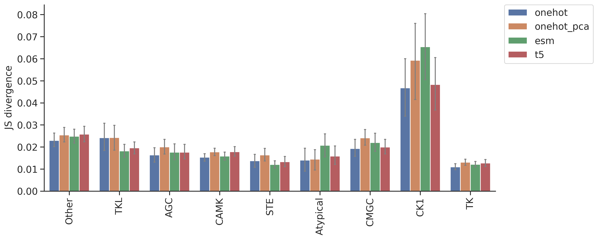
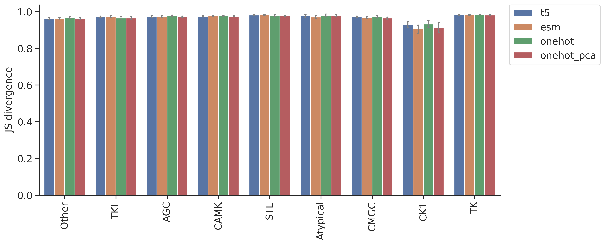

# DL training: Feature comparison on MLP model


<!-- WARNING: THIS FILE WAS AUTOGENERATED! DO NOT EDIT! -->

## Setup

``` python
import numpy as np, pandas as pd
import os, random
from katlas.data import *
from katlas.train import *
from fastai.vision.all import *
from katlas.dnn import *
```

``` python
seed_everything()
```

``` python
def_device
```

    'cuda'

## Data

``` python
df_t5=pd.read_parquet('train/pspa_t5.parquet').reset_index()
df_esm=pd.read_parquet('train/pspa_esm.parquet').reset_index()
df_onehot = pd.read_parquet('train/pspa_onehot.parquet').reset_index()
df_onehot_pca = pd.read_parquet('train/pspa_onehot_pca.parquet').reset_index()
```

``` python
(df_onehot['index'] == df_esm['index']).value_counts()
```

    index
    True    368
    Name: count, dtype: int64

``` python
(df_t5['index'] == df_esm['index']).value_counts()
```

    index
    True    368
    Name: count, dtype: int64

``` python
t5_col = df_t5.columns[df_t5.columns.str.startswith('T5_')]
```

``` python
t5_col
```

    Index(['T5_0', 'T5_1', 'T5_2', 'T5_3', 'T5_4', 'T5_5', 'T5_6', 'T5_7', 'T5_8',
           'T5_9',
           ...
           'T5_1014', 'T5_1015', 'T5_1016', 'T5_1017', 'T5_1018', 'T5_1019',
           'T5_1020', 'T5_1021', 'T5_1022', 'T5_1023'],
          dtype='object', length=1024)

``` python
esm_col = df_esm.columns[df_esm.columns.str.startswith('esm_')]
```

``` python
esm_col
```

    Index(['esm_0', 'esm_1', 'esm_2', 'esm_3', 'esm_4', 'esm_5', 'esm_6', 'esm_7',
           'esm_8', 'esm_9',
           ...
           'esm_1270', 'esm_1271', 'esm_1272', 'esm_1273', 'esm_1274', 'esm_1275',
           'esm_1276', 'esm_1277', 'esm_1278', 'esm_1279'],
          dtype='object', length=1280)

``` python
target_col = df_t5.columns[~df_t5.columns.isin(t5_col)][1:]
```

``` python
target_col
```

    Index(['-5P', '-4P', '-3P', '-2P', '-1P', '0P', '1P', '2P', '3P', '4P',
           ...
           '-5pY', '-4pY', '-3pY', '-2pY', '-1pY', '0pY', '1pY', '2pY', '3pY',
           '4pY'],
          dtype='object', length=230)

``` python
onehot_col = df_onehot.columns[~df_onehot.columns.isin(target_col)][1:]
```

``` python
onehot_col
```

    Index(['65_-', '65_A', '65_C', '65_D', '65_E', '65_F', '65_G', '65_H', '65_I',
           '65_K',
           ...
           '3192_M', '3192_N', '3192_P', '3192_Q', '3192_R', '3192_S', '3192_T',
           '3192_V', '3192_W', '3192_Y'],
          dtype='object', length=6849)

``` python
onehot_pca_col = df_onehot_pca.columns[df_onehot_pca.columns.str.startswith('PCA')]
```

``` python
onehot_pca_col
```

    Index(['PCA1', 'PCA2', 'PCA3', 'PCA4', 'PCA5', 'PCA6', 'PCA7', 'PCA8', 'PCA9',
           'PCA10',
           ...
           'PCA991', 'PCA992', 'PCA993', 'PCA994', 'PCA995', 'PCA996', 'PCA997',
           'PCA998', 'PCA999', 'PCA1000'],
          dtype='object', length=1000)

``` python
info=Data.get_kinase_info()

info = info[info.pseudo=='0']

info = info[info.kd_ID.notna()]

subfamily_map = info[['kd_ID','subfamily']].drop_duplicates().set_index('kd_ID')['subfamily']
family_map = info[['kd_ID','family']].drop_duplicates().set_index('kd_ID')['family']
group_map = info[['kd_ID','group']].drop_duplicates().set_index('kd_ID')['group']

pspa_info = pd.DataFrame(df_t5['index'].tolist(),columns=['kinase'])

pspa_info['subfamily'] = pspa_info.kinase.map(subfamily_map)
pspa_info['family'] = pspa_info.kinase.map(family_map)
pspa_info['group'] = pspa_info.kinase.map(group_map)
```

## Split

``` python
splits = get_splits(pspa_info, group='subfamily',nfold=5)

split0 = splits[0]
```

    GroupKFold(n_splits=5, random_state=None, shuffle=False)
    # subfamily in train set: 120
    # subfamily in test set: 29

## Dataset

``` python
# dataset
ds_t5 = GeneralDataset(df_t5,t5_col,target_col)
ds_esm = GeneralDataset(df_esm,esm_col,target_col)
ds_onehot = GeneralDataset(df_onehot,onehot_col,target_col)
ds_onehot_pca = GeneralDataset(df_onehot_pca,onehot_pca_col,target_col)
```

``` python
len(ds_t5)
```

    368

``` python
dl_t5 = DataLoader(ds_t5, batch_size=64, shuffle=True)
dl_esm = DataLoader(ds_esm, batch_size=64, shuffle=True)
dl_onehot = DataLoader(ds_onehot, batch_size=64, shuffle=True)
dl_onehot_pca = DataLoader(ds_onehot_pca, batch_size=64, shuffle=True)
```

``` python
xb,yb = next(iter(dl_t5))

xb.shape,yb.shape
```

    (torch.Size([64, 1024]), torch.Size([64, 23, 10]))

## Model

``` python
n_t5 = len(t5_col)
n_esm = len(esm_col)
n_onehot = len(onehot_col)
n_onehot_pca = len(onehot_pca_col)
n_target = len(target_col)
```

``` python
n_t5,n_esm,n_onehot,n_onehot_pca
```

    (1024, 1280, 6849, 1000)

``` python
# def get_cnn(): return PSSM_model(n_feature,n_target,model='CNN')

def get_mlp_t5(): return PSSM_model(n_t5,n_target,model='MLP')
def get_mlp_esm(): return PSSM_model(n_esm,n_target,model='MLP')
def get_mlp_onehot(): return PSSM_model(n_onehot,n_target,model='MLP')
def get_mlp_onehot_pca(): return PSSM_model(n_onehot_pca,n_target,model='MLP')
```

``` python
model = get_mlp_t5()
```

``` python
logits= model(xb)
```

``` python
logits.shape
```

    torch.Size([64, 23, 10])

## Loss

``` python
CE(logits,yb)
```

    tensor(3.2301, grad_fn=<MeanBackward0>)

## Metrics

``` python
KLD(logits,yb)
```

    tensor(0.4888, grad_fn=<MeanBackward0>)

``` python
JSD(logits,yb)
```

    tensor(0.1021, grad_fn=<MeanBackward0>)

## CV train

> cross-validation

``` python
oof_t5 = train_dl_cv(df_t5,t5_col,target_col,
                  splits = splits,
                  model_func = get_mlp_t5,
                  n_epoch=20,lr=3e-3)
```

    ------fold0------
    lr in training is 0.003

<style>
    /* Turns off some styling */
    progress {
        /* gets rid of default border in Firefox and Opera. */
        border: none;
        /* Needs to be in here for Safari polyfill so background images work as expected. */
        background-size: auto;
    }
    progress:not([value]), progress:not([value])::-webkit-progress-bar {
        background: repeating-linear-gradient(45deg, #7e7e7e, #7e7e7e 10px, #5c5c5c 10px, #5c5c5c 20px);
    }
    .progress-bar-interrupted, .progress-bar-interrupted::-webkit-progress-bar {
        background: #F44336;
    }
</style>

<table class="dataframe" data-quarto-postprocess="true" data-border="1">
<thead>
<tr style="text-align: left;">
<th data-quarto-table-cell-role="th">epoch</th>
<th data-quarto-table-cell-role="th">train_loss</th>
<th data-quarto-table-cell-role="th">valid_loss</th>
<th data-quarto-table-cell-role="th">KLD</th>
<th data-quarto-table-cell-role="th">JSD</th>
<th data-quarto-table-cell-role="th">time</th>
</tr>
</thead>
<tbody>
<tr>
<td>0</td>
<td>3.148606</td>
<td>3.121804</td>
<td>0.402347</td>
<td>0.085257</td>
<td>00:00</td>
</tr>
<tr>
<td>1</td>
<td>3.072263</td>
<td>3.087032</td>
<td>0.367574</td>
<td>0.081199</td>
<td>00:00</td>
</tr>
<tr>
<td>2</td>
<td>3.009716</td>
<td>3.024146</td>
<td>0.304688</td>
<td>0.072146</td>
<td>00:00</td>
</tr>
<tr>
<td>3</td>
<td>2.956377</td>
<td>2.943933</td>
<td>0.224475</td>
<td>0.056424</td>
<td>00:00</td>
</tr>
<tr>
<td>4</td>
<td>2.916552</td>
<td>2.875516</td>
<td>0.156058</td>
<td>0.040018</td>
<td>00:00</td>
</tr>
<tr>
<td>5</td>
<td>2.888994</td>
<td>2.847860</td>
<td>0.128402</td>
<td>0.031854</td>
<td>00:00</td>
</tr>
<tr>
<td>6</td>
<td>2.868063</td>
<td>2.812665</td>
<td>0.093207</td>
<td>0.022109</td>
<td>00:00</td>
</tr>
<tr>
<td>7</td>
<td>2.851901</td>
<td>2.805371</td>
<td>0.085913</td>
<td>0.020331</td>
<td>00:00</td>
</tr>
<tr>
<td>8</td>
<td>2.839283</td>
<td>2.805355</td>
<td>0.085897</td>
<td>0.020335</td>
<td>00:00</td>
</tr>
<tr>
<td>9</td>
<td>2.829078</td>
<td>2.798256</td>
<td>0.078798</td>
<td>0.018366</td>
<td>00:00</td>
</tr>
<tr>
<td>10</td>
<td>2.821064</td>
<td>2.804793</td>
<td>0.085335</td>
<td>0.019795</td>
<td>00:00</td>
</tr>
<tr>
<td>11</td>
<td>2.814147</td>
<td>2.798561</td>
<td>0.079103</td>
<td>0.018454</td>
<td>00:00</td>
</tr>
<tr>
<td>12</td>
<td>2.808187</td>
<td>2.798406</td>
<td>0.078948</td>
<td>0.018366</td>
<td>00:00</td>
</tr>
<tr>
<td>13</td>
<td>2.802989</td>
<td>2.801632</td>
<td>0.082174</td>
<td>0.019130</td>
<td>00:00</td>
</tr>
<tr>
<td>14</td>
<td>2.798415</td>
<td>2.798108</td>
<td>0.078650</td>
<td>0.018254</td>
<td>00:00</td>
</tr>
<tr>
<td>15</td>
<td>2.794516</td>
<td>2.796008</td>
<td>0.076550</td>
<td>0.017756</td>
<td>00:00</td>
</tr>
<tr>
<td>16</td>
<td>2.791063</td>
<td>2.795204</td>
<td>0.075746</td>
<td>0.017629</td>
<td>00:00</td>
</tr>
<tr>
<td>17</td>
<td>2.787868</td>
<td>2.795507</td>
<td>0.076049</td>
<td>0.017736</td>
<td>-1:59:59</td>
</tr>
<tr>
<td>18</td>
<td>2.785587</td>
<td>2.795144</td>
<td>0.075686</td>
<td>0.017636</td>
<td>00:00</td>
</tr>
<tr>
<td>19</td>
<td>2.783626</td>
<td>2.795208</td>
<td>0.075750</td>
<td>0.017641</td>
<td>00:00</td>
</tr>
</tbody>
</table>

<style>
    /* Turns off some styling */
    progress {
        /* gets rid of default border in Firefox and Opera. */
        border: none;
        /* Needs to be in here for Safari polyfill so background images work as expected. */
        background-size: auto;
    }
    progress:not([value]), progress:not([value])::-webkit-progress-bar {
        background: repeating-linear-gradient(45deg, #7e7e7e, #7e7e7e 10px, #5c5c5c 10px, #5c5c5c 20px);
    }
    .progress-bar-interrupted, .progress-bar-interrupted::-webkit-progress-bar {
        background: #F44336;
    }
</style>

    ------fold1------
    lr in training is 0.003

<style>
    /* Turns off some styling */
    progress {
        /* gets rid of default border in Firefox and Opera. */
        border: none;
        /* Needs to be in here for Safari polyfill so background images work as expected. */
        background-size: auto;
    }
    progress:not([value]), progress:not([value])::-webkit-progress-bar {
        background: repeating-linear-gradient(45deg, #7e7e7e, #7e7e7e 10px, #5c5c5c 10px, #5c5c5c 20px);
    }
    .progress-bar-interrupted, .progress-bar-interrupted::-webkit-progress-bar {
        background: #F44336;
    }
</style>

<table class="dataframe" data-quarto-postprocess="true" data-border="1">
<thead>
<tr style="text-align: left;">
<th data-quarto-table-cell-role="th">epoch</th>
<th data-quarto-table-cell-role="th">train_loss</th>
<th data-quarto-table-cell-role="th">valid_loss</th>
<th data-quarto-table-cell-role="th">KLD</th>
<th data-quarto-table-cell-role="th">JSD</th>
<th data-quarto-table-cell-role="th">time</th>
</tr>
</thead>
<tbody>
<tr>
<td>0</td>
<td>3.138617</td>
<td>3.128191</td>
<td>0.373281</td>
<td>0.080388</td>
<td>00:00</td>
</tr>
<tr>
<td>1</td>
<td>3.052587</td>
<td>3.099994</td>
<td>0.345084</td>
<td>0.076962</td>
<td>00:00</td>
</tr>
<tr>
<td>2</td>
<td>2.987546</td>
<td>3.036049</td>
<td>0.281140</td>
<td>0.067385</td>
<td>00:00</td>
</tr>
<tr>
<td>3</td>
<td>2.936046</td>
<td>2.949912</td>
<td>0.195002</td>
<td>0.050177</td>
<td>00:00</td>
</tr>
<tr>
<td>4</td>
<td>2.899863</td>
<td>2.884509</td>
<td>0.129600</td>
<td>0.033173</td>
<td>00:00</td>
</tr>
<tr>
<td>5</td>
<td>2.874496</td>
<td>2.846201</td>
<td>0.091292</td>
<td>0.022750</td>
<td>00:00</td>
</tr>
<tr>
<td>6</td>
<td>2.855753</td>
<td>2.834026</td>
<td>0.079116</td>
<td>0.019371</td>
<td>00:00</td>
</tr>
<tr>
<td>7</td>
<td>2.840722</td>
<td>2.826782</td>
<td>0.071872</td>
<td>0.017719</td>
<td>00:00</td>
</tr>
<tr>
<td>8</td>
<td>2.828521</td>
<td>2.834439</td>
<td>0.079530</td>
<td>0.019417</td>
<td>00:00</td>
</tr>
<tr>
<td>9</td>
<td>2.819003</td>
<td>2.826963</td>
<td>0.072054</td>
<td>0.017538</td>
<td>00:00</td>
</tr>
<tr>
<td>10</td>
<td>2.810733</td>
<td>2.823351</td>
<td>0.068442</td>
<td>0.016784</td>
<td>00:00</td>
</tr>
<tr>
<td>11</td>
<td>2.803984</td>
<td>2.826729</td>
<td>0.071820</td>
<td>0.017377</td>
<td>00:00</td>
</tr>
<tr>
<td>12</td>
<td>2.798471</td>
<td>2.822295</td>
<td>0.067386</td>
<td>0.016392</td>
<td>00:00</td>
</tr>
<tr>
<td>13</td>
<td>2.793528</td>
<td>2.823175</td>
<td>0.068266</td>
<td>0.016555</td>
<td>00:00</td>
</tr>
<tr>
<td>14</td>
<td>2.789041</td>
<td>2.821938</td>
<td>0.067028</td>
<td>0.016247</td>
<td>00:00</td>
</tr>
<tr>
<td>15</td>
<td>2.785495</td>
<td>2.819557</td>
<td>0.064648</td>
<td>0.015734</td>
<td>00:00</td>
</tr>
<tr>
<td>16</td>
<td>2.782051</td>
<td>2.820376</td>
<td>0.065467</td>
<td>0.015946</td>
<td>00:00</td>
</tr>
<tr>
<td>17</td>
<td>2.779409</td>
<td>2.819542</td>
<td>0.064633</td>
<td>0.015715</td>
<td>00:00</td>
</tr>
<tr>
<td>18</td>
<td>2.776891</td>
<td>2.820054</td>
<td>0.065144</td>
<td>0.015840</td>
<td>00:00</td>
</tr>
<tr>
<td>19</td>
<td>2.774755</td>
<td>2.820162</td>
<td>0.065253</td>
<td>0.015864</td>
<td>00:00</td>
</tr>
</tbody>
</table>

<style>
    /* Turns off some styling */
    progress {
        /* gets rid of default border in Firefox and Opera. */
        border: none;
        /* Needs to be in here for Safari polyfill so background images work as expected. */
        background-size: auto;
    }
    progress:not([value]), progress:not([value])::-webkit-progress-bar {
        background: repeating-linear-gradient(45deg, #7e7e7e, #7e7e7e 10px, #5c5c5c 10px, #5c5c5c 20px);
    }
    .progress-bar-interrupted, .progress-bar-interrupted::-webkit-progress-bar {
        background: #F44336;
    }
</style>

    ------fold2------
    lr in training is 0.003

<style>
    /* Turns off some styling */
    progress {
        /* gets rid of default border in Firefox and Opera. */
        border: none;
        /* Needs to be in here for Safari polyfill so background images work as expected. */
        background-size: auto;
    }
    progress:not([value]), progress:not([value])::-webkit-progress-bar {
        background: repeating-linear-gradient(45deg, #7e7e7e, #7e7e7e 10px, #5c5c5c 10px, #5c5c5c 20px);
    }
    .progress-bar-interrupted, .progress-bar-interrupted::-webkit-progress-bar {
        background: #F44336;
    }
</style>

<table class="dataframe" data-quarto-postprocess="true" data-border="1">
<thead>
<tr style="text-align: left;">
<th data-quarto-table-cell-role="th">epoch</th>
<th data-quarto-table-cell-role="th">train_loss</th>
<th data-quarto-table-cell-role="th">valid_loss</th>
<th data-quarto-table-cell-role="th">KLD</th>
<th data-quarto-table-cell-role="th">JSD</th>
<th data-quarto-table-cell-role="th">time</th>
</tr>
</thead>
<tbody>
<tr>
<td>0</td>
<td>3.132746</td>
<td>3.129335</td>
<td>0.376952</td>
<td>0.081733</td>
<td>00:00</td>
</tr>
<tr>
<td>1</td>
<td>3.044635</td>
<td>3.098221</td>
<td>0.345837</td>
<td>0.077880</td>
<td>00:00</td>
</tr>
<tr>
<td>2</td>
<td>2.977475</td>
<td>3.029599</td>
<td>0.277215</td>
<td>0.067289</td>
<td>00:00</td>
</tr>
<tr>
<td>3</td>
<td>2.928447</td>
<td>2.946265</td>
<td>0.193881</td>
<td>0.049801</td>
<td>00:00</td>
</tr>
<tr>
<td>4</td>
<td>2.894571</td>
<td>2.878941</td>
<td>0.126558</td>
<td>0.031526</td>
<td>00:00</td>
</tr>
<tr>
<td>5</td>
<td>2.870487</td>
<td>2.854545</td>
<td>0.102161</td>
<td>0.024659</td>
<td>00:00</td>
</tr>
<tr>
<td>6</td>
<td>2.851943</td>
<td>2.844638</td>
<td>0.092254</td>
<td>0.021932</td>
<td>00:00</td>
</tr>
<tr>
<td>7</td>
<td>2.837645</td>
<td>2.839031</td>
<td>0.086647</td>
<td>0.020559</td>
<td>00:00</td>
</tr>
<tr>
<td>8</td>
<td>2.826392</td>
<td>2.835832</td>
<td>0.083448</td>
<td>0.019848</td>
<td>00:00</td>
</tr>
<tr>
<td>9</td>
<td>2.817550</td>
<td>2.839705</td>
<td>0.087322</td>
<td>0.020473</td>
<td>00:00</td>
</tr>
<tr>
<td>10</td>
<td>2.810197</td>
<td>2.840906</td>
<td>0.088522</td>
<td>0.021065</td>
<td>00:00</td>
</tr>
<tr>
<td>11</td>
<td>2.804141</td>
<td>2.835611</td>
<td>0.083227</td>
<td>0.019450</td>
<td>00:00</td>
</tr>
<tr>
<td>12</td>
<td>2.798564</td>
<td>2.835332</td>
<td>0.082948</td>
<td>0.019531</td>
<td>00:00</td>
</tr>
<tr>
<td>13</td>
<td>2.793507</td>
<td>2.836511</td>
<td>0.084127</td>
<td>0.019697</td>
<td>00:00</td>
</tr>
<tr>
<td>14</td>
<td>2.789054</td>
<td>2.836247</td>
<td>0.083863</td>
<td>0.019667</td>
<td>00:00</td>
</tr>
<tr>
<td>15</td>
<td>2.785331</td>
<td>2.834682</td>
<td>0.082298</td>
<td>0.019266</td>
<td>00:00</td>
</tr>
<tr>
<td>16</td>
<td>2.782074</td>
<td>2.837207</td>
<td>0.084823</td>
<td>0.019836</td>
<td>00:00</td>
</tr>
<tr>
<td>17</td>
<td>2.779473</td>
<td>2.836932</td>
<td>0.084548</td>
<td>0.019785</td>
<td>00:00</td>
</tr>
<tr>
<td>18</td>
<td>2.777340</td>
<td>2.836301</td>
<td>0.083917</td>
<td>0.019662</td>
<td>00:00</td>
</tr>
<tr>
<td>19</td>
<td>2.775474</td>
<td>2.836297</td>
<td>0.083913</td>
<td>0.019675</td>
<td>00:00</td>
</tr>
</tbody>
</table>

<style>
    /* Turns off some styling */
    progress {
        /* gets rid of default border in Firefox and Opera. */
        border: none;
        /* Needs to be in here for Safari polyfill so background images work as expected. */
        background-size: auto;
    }
    progress:not([value]), progress:not([value])::-webkit-progress-bar {
        background: repeating-linear-gradient(45deg, #7e7e7e, #7e7e7e 10px, #5c5c5c 10px, #5c5c5c 20px);
    }
    .progress-bar-interrupted, .progress-bar-interrupted::-webkit-progress-bar {
        background: #F44336;
    }
</style>

    ------fold3------
    lr in training is 0.003

<style>
    /* Turns off some styling */
    progress {
        /* gets rid of default border in Firefox and Opera. */
        border: none;
        /* Needs to be in here for Safari polyfill so background images work as expected. */
        background-size: auto;
    }
    progress:not([value]), progress:not([value])::-webkit-progress-bar {
        background: repeating-linear-gradient(45deg, #7e7e7e, #7e7e7e 10px, #5c5c5c 10px, #5c5c5c 20px);
    }
    .progress-bar-interrupted, .progress-bar-interrupted::-webkit-progress-bar {
        background: #F44336;
    }
</style>

<table class="dataframe" data-quarto-postprocess="true" data-border="1">
<thead>
<tr style="text-align: left;">
<th data-quarto-table-cell-role="th">epoch</th>
<th data-quarto-table-cell-role="th">train_loss</th>
<th data-quarto-table-cell-role="th">valid_loss</th>
<th data-quarto-table-cell-role="th">KLD</th>
<th data-quarto-table-cell-role="th">JSD</th>
<th data-quarto-table-cell-role="th">time</th>
</tr>
</thead>
<tbody>
<tr>
<td>0</td>
<td>3.133904</td>
<td>3.137529</td>
<td>0.374512</td>
<td>0.080143</td>
<td>00:00</td>
</tr>
<tr>
<td>1</td>
<td>3.051439</td>
<td>3.116435</td>
<td>0.353418</td>
<td>0.077698</td>
<td>00:00</td>
</tr>
<tr>
<td>2</td>
<td>2.983982</td>
<td>3.059940</td>
<td>0.296923</td>
<td>0.069758</td>
<td>00:00</td>
</tr>
<tr>
<td>3</td>
<td>2.933919</td>
<td>2.971472</td>
<td>0.208456</td>
<td>0.052888</td>
<td>00:00</td>
</tr>
<tr>
<td>4</td>
<td>2.897793</td>
<td>2.900559</td>
<td>0.137543</td>
<td>0.035083</td>
<td>00:00</td>
</tr>
<tr>
<td>5</td>
<td>2.873204</td>
<td>2.871643</td>
<td>0.108627</td>
<td>0.026768</td>
<td>00:00</td>
</tr>
<tr>
<td>6</td>
<td>2.854192</td>
<td>2.859234</td>
<td>0.096217</td>
<td>0.023959</td>
<td>00:00</td>
</tr>
<tr>
<td>7</td>
<td>2.838984</td>
<td>2.853621</td>
<td>0.090605</td>
<td>0.021992</td>
<td>00:00</td>
</tr>
<tr>
<td>8</td>
<td>2.827404</td>
<td>2.853444</td>
<td>0.090427</td>
<td>0.021758</td>
<td>00:00</td>
</tr>
<tr>
<td>9</td>
<td>2.817780</td>
<td>2.850291</td>
<td>0.087274</td>
<td>0.021522</td>
<td>00:00</td>
</tr>
<tr>
<td>10</td>
<td>2.809961</td>
<td>2.848032</td>
<td>0.085015</td>
<td>0.020275</td>
<td>00:00</td>
</tr>
<tr>
<td>11</td>
<td>2.803262</td>
<td>2.850563</td>
<td>0.087546</td>
<td>0.021736</td>
<td>00:00</td>
</tr>
<tr>
<td>12</td>
<td>2.797405</td>
<td>2.849761</td>
<td>0.086744</td>
<td>0.020918</td>
<td>00:00</td>
</tr>
<tr>
<td>13</td>
<td>2.792234</td>
<td>2.845738</td>
<td>0.082722</td>
<td>0.019952</td>
<td>00:00</td>
</tr>
<tr>
<td>14</td>
<td>2.787778</td>
<td>2.846671</td>
<td>0.083654</td>
<td>0.020148</td>
<td>00:00</td>
</tr>
<tr>
<td>15</td>
<td>2.783718</td>
<td>2.847657</td>
<td>0.084641</td>
<td>0.020426</td>
<td>00:00</td>
</tr>
<tr>
<td>16</td>
<td>2.780527</td>
<td>2.846283</td>
<td>0.083267</td>
<td>0.020192</td>
<td>00:00</td>
</tr>
<tr>
<td>17</td>
<td>2.777715</td>
<td>2.846755</td>
<td>0.083738</td>
<td>0.020268</td>
<td>00:00</td>
</tr>
<tr>
<td>18</td>
<td>2.775372</td>
<td>2.846951</td>
<td>0.083934</td>
<td>0.020351</td>
<td>00:00</td>
</tr>
<tr>
<td>19</td>
<td>2.773362</td>
<td>2.846569</td>
<td>0.083552</td>
<td>0.020249</td>
<td>00:00</td>
</tr>
</tbody>
</table>

<style>
    /* Turns off some styling */
    progress {
        /* gets rid of default border in Firefox and Opera. */
        border: none;
        /* Needs to be in here for Safari polyfill so background images work as expected. */
        background-size: auto;
    }
    progress:not([value]), progress:not([value])::-webkit-progress-bar {
        background: repeating-linear-gradient(45deg, #7e7e7e, #7e7e7e 10px, #5c5c5c 10px, #5c5c5c 20px);
    }
    .progress-bar-interrupted, .progress-bar-interrupted::-webkit-progress-bar {
        background: #F44336;
    }
</style>

    ------fold4------
    lr in training is 0.003

<style>
    /* Turns off some styling */
    progress {
        /* gets rid of default border in Firefox and Opera. */
        border: none;
        /* Needs to be in here for Safari polyfill so background images work as expected. */
        background-size: auto;
    }
    progress:not([value]), progress:not([value])::-webkit-progress-bar {
        background: repeating-linear-gradient(45deg, #7e7e7e, #7e7e7e 10px, #5c5c5c 10px, #5c5c5c 20px);
    }
    .progress-bar-interrupted, .progress-bar-interrupted::-webkit-progress-bar {
        background: #F44336;
    }
</style>

<table class="dataframe" data-quarto-postprocess="true" data-border="1">
<thead>
<tr style="text-align: left;">
<th data-quarto-table-cell-role="th">epoch</th>
<th data-quarto-table-cell-role="th">train_loss</th>
<th data-quarto-table-cell-role="th">valid_loss</th>
<th data-quarto-table-cell-role="th">KLD</th>
<th data-quarto-table-cell-role="th">JSD</th>
<th data-quarto-table-cell-role="th">time</th>
</tr>
</thead>
<tbody>
<tr>
<td>0</td>
<td>3.125827</td>
<td>3.126822</td>
<td>0.377269</td>
<td>0.081392</td>
<td>00:00</td>
</tr>
<tr>
<td>1</td>
<td>3.043140</td>
<td>3.096131</td>
<td>0.346577</td>
<td>0.077685</td>
<td>00:00</td>
</tr>
<tr>
<td>2</td>
<td>2.979392</td>
<td>3.034656</td>
<td>0.285102</td>
<td>0.068493</td>
<td>00:00</td>
</tr>
<tr>
<td>3</td>
<td>2.931132</td>
<td>2.957115</td>
<td>0.207562</td>
<td>0.052795</td>
<td>00:00</td>
</tr>
<tr>
<td>4</td>
<td>2.896671</td>
<td>2.893782</td>
<td>0.144228</td>
<td>0.036598</td>
<td>00:00</td>
</tr>
<tr>
<td>5</td>
<td>2.872172</td>
<td>2.861912</td>
<td>0.112359</td>
<td>0.027619</td>
<td>00:00</td>
</tr>
<tr>
<td>6</td>
<td>2.854473</td>
<td>2.847451</td>
<td>0.097898</td>
<td>0.023141</td>
<td>00:00</td>
</tr>
<tr>
<td>7</td>
<td>2.840559</td>
<td>2.843453</td>
<td>0.093899</td>
<td>0.022363</td>
<td>00:00</td>
</tr>
<tr>
<td>8</td>
<td>2.829472</td>
<td>2.845010</td>
<td>0.095456</td>
<td>0.022714</td>
<td>00:00</td>
</tr>
<tr>
<td>9</td>
<td>2.820066</td>
<td>2.836954</td>
<td>0.087400</td>
<td>0.020894</td>
<td>00:00</td>
</tr>
<tr>
<td>10</td>
<td>2.812284</td>
<td>2.835765</td>
<td>0.086211</td>
<td>0.020910</td>
<td>00:00</td>
</tr>
<tr>
<td>11</td>
<td>2.805969</td>
<td>2.840066</td>
<td>0.090512</td>
<td>0.021520</td>
<td>00:00</td>
</tr>
<tr>
<td>12</td>
<td>2.800283</td>
<td>2.836174</td>
<td>0.086620</td>
<td>0.020442</td>
<td>00:00</td>
</tr>
<tr>
<td>13</td>
<td>2.795211</td>
<td>2.834489</td>
<td>0.084936</td>
<td>0.020178</td>
<td>00:00</td>
</tr>
<tr>
<td>14</td>
<td>2.790876</td>
<td>2.834798</td>
<td>0.085245</td>
<td>0.020084</td>
<td>00:00</td>
</tr>
<tr>
<td>15</td>
<td>2.786967</td>
<td>2.835122</td>
<td>0.085568</td>
<td>0.020155</td>
<td>00:00</td>
</tr>
<tr>
<td>16</td>
<td>2.783756</td>
<td>2.831621</td>
<td>0.082068</td>
<td>0.019498</td>
<td>-1:59:59</td>
</tr>
<tr>
<td>17</td>
<td>2.781121</td>
<td>2.831618</td>
<td>0.082064</td>
<td>0.019431</td>
<td>00:00</td>
</tr>
<tr>
<td>18</td>
<td>2.778701</td>
<td>2.832057</td>
<td>0.082503</td>
<td>0.019483</td>
<td>00:00</td>
</tr>
<tr>
<td>19</td>
<td>2.776771</td>
<td>2.832255</td>
<td>0.082701</td>
<td>0.019531</td>
<td>00:00</td>
</tr>
</tbody>
</table>

<style>
    /* Turns off some styling */
    progress {
        /* gets rid of default border in Firefox and Opera. */
        border: none;
        /* Needs to be in here for Safari polyfill so background images work as expected. */
        background-size: auto;
    }
    progress:not([value]), progress:not([value])::-webkit-progress-bar {
        background: repeating-linear-gradient(45deg, #7e7e7e, #7e7e7e 10px, #5c5c5c 10px, #5c5c5c 20px);
    }
    .progress-bar-interrupted, .progress-bar-interrupted::-webkit-progress-bar {
        background: #F44336;
    }
</style>

``` python
oof_esm = train_dl_cv(df_esm,esm_col,target_col,
                  splits = splits,
                  model_func = get_mlp_esm,
                  n_epoch=20,lr=3e-3)
```

    ------fold0------
    lr in training is 0.003

<style>
    /* Turns off some styling */
    progress {
        /* gets rid of default border in Firefox and Opera. */
        border: none;
        /* Needs to be in here for Safari polyfill so background images work as expected. */
        background-size: auto;
    }
    progress:not([value]), progress:not([value])::-webkit-progress-bar {
        background: repeating-linear-gradient(45deg, #7e7e7e, #7e7e7e 10px, #5c5c5c 10px, #5c5c5c 20px);
    }
    .progress-bar-interrupted, .progress-bar-interrupted::-webkit-progress-bar {
        background: #F44336;
    }
</style>

<table class="dataframe" data-quarto-postprocess="true" data-border="1">
<thead>
<tr style="text-align: left;">
<th data-quarto-table-cell-role="th">epoch</th>
<th data-quarto-table-cell-role="th">train_loss</th>
<th data-quarto-table-cell-role="th">valid_loss</th>
<th data-quarto-table-cell-role="th">KLD</th>
<th data-quarto-table-cell-role="th">JSD</th>
<th data-quarto-table-cell-role="th">time</th>
</tr>
</thead>
<tbody>
<tr>
<td>0</td>
<td>3.170443</td>
<td>3.128315</td>
<td>0.408857</td>
<td>0.086049</td>
<td>00:00</td>
</tr>
<tr>
<td>1</td>
<td>3.091747</td>
<td>3.074181</td>
<td>0.354723</td>
<td>0.079727</td>
<td>00:00</td>
</tr>
<tr>
<td>2</td>
<td>3.024167</td>
<td>2.957788</td>
<td>0.238329</td>
<td>0.059704</td>
<td>00:00</td>
</tr>
<tr>
<td>3</td>
<td>2.968613</td>
<td>2.866479</td>
<td>0.147021</td>
<td>0.037654</td>
<td>00:00</td>
</tr>
<tr>
<td>4</td>
<td>2.926947</td>
<td>2.807119</td>
<td>0.087661</td>
<td>0.020968</td>
<td>00:00</td>
</tr>
<tr>
<td>5</td>
<td>2.896099</td>
<td>2.801955</td>
<td>0.082497</td>
<td>0.019621</td>
<td>00:00</td>
</tr>
<tr>
<td>6</td>
<td>2.873465</td>
<td>2.799124</td>
<td>0.079666</td>
<td>0.018746</td>
<td>00:00</td>
</tr>
<tr>
<td>7</td>
<td>2.856784</td>
<td>2.796772</td>
<td>0.077314</td>
<td>0.018224</td>
<td>00:00</td>
</tr>
<tr>
<td>8</td>
<td>2.843669</td>
<td>2.794605</td>
<td>0.075147</td>
<td>0.017636</td>
<td>00:00</td>
</tr>
<tr>
<td>9</td>
<td>2.833229</td>
<td>2.799318</td>
<td>0.079859</td>
<td>0.018553</td>
<td>00:00</td>
</tr>
<tr>
<td>10</td>
<td>2.824726</td>
<td>2.800097</td>
<td>0.080639</td>
<td>0.018848</td>
<td>00:00</td>
</tr>
<tr>
<td>11</td>
<td>2.817148</td>
<td>2.793399</td>
<td>0.073941</td>
<td>0.017220</td>
<td>00:00</td>
</tr>
<tr>
<td>12</td>
<td>2.810647</td>
<td>2.795838</td>
<td>0.076380</td>
<td>0.017713</td>
<td>00:00</td>
</tr>
<tr>
<td>13</td>
<td>2.805257</td>
<td>2.795752</td>
<td>0.076294</td>
<td>0.017630</td>
<td>00:00</td>
</tr>
<tr>
<td>14</td>
<td>2.800452</td>
<td>2.791506</td>
<td>0.072048</td>
<td>0.016825</td>
<td>00:00</td>
</tr>
<tr>
<td>15</td>
<td>2.796498</td>
<td>2.791960</td>
<td>0.072502</td>
<td>0.016795</td>
<td>00:00</td>
</tr>
<tr>
<td>16</td>
<td>2.792618</td>
<td>2.793065</td>
<td>0.073607</td>
<td>0.017045</td>
<td>00:00</td>
</tr>
<tr>
<td>17</td>
<td>2.789762</td>
<td>2.792158</td>
<td>0.072700</td>
<td>0.016887</td>
<td>00:00</td>
</tr>
<tr>
<td>18</td>
<td>2.787136</td>
<td>2.791858</td>
<td>0.072400</td>
<td>0.016806</td>
<td>00:00</td>
</tr>
<tr>
<td>19</td>
<td>2.784748</td>
<td>2.791649</td>
<td>0.072191</td>
<td>0.016751</td>
<td>00:00</td>
</tr>
</tbody>
</table>

<style>
    /* Turns off some styling */
    progress {
        /* gets rid of default border in Firefox and Opera. */
        border: none;
        /* Needs to be in here for Safari polyfill so background images work as expected. */
        background-size: auto;
    }
    progress:not([value]), progress:not([value])::-webkit-progress-bar {
        background: repeating-linear-gradient(45deg, #7e7e7e, #7e7e7e 10px, #5c5c5c 10px, #5c5c5c 20px);
    }
    .progress-bar-interrupted, .progress-bar-interrupted::-webkit-progress-bar {
        background: #F44336;
    }
</style>

    ------fold1------
    lr in training is 0.003

<style>
    /* Turns off some styling */
    progress {
        /* gets rid of default border in Firefox and Opera. */
        border: none;
        /* Needs to be in here for Safari polyfill so background images work as expected. */
        background-size: auto;
    }
    progress:not([value]), progress:not([value])::-webkit-progress-bar {
        background: repeating-linear-gradient(45deg, #7e7e7e, #7e7e7e 10px, #5c5c5c 10px, #5c5c5c 20px);
    }
    .progress-bar-interrupted, .progress-bar-interrupted::-webkit-progress-bar {
        background: #F44336;
    }
</style>

<table class="dataframe" data-quarto-postprocess="true" data-border="1">
<thead>
<tr style="text-align: left;">
<th data-quarto-table-cell-role="th">epoch</th>
<th data-quarto-table-cell-role="th">train_loss</th>
<th data-quarto-table-cell-role="th">valid_loss</th>
<th data-quarto-table-cell-role="th">KLD</th>
<th data-quarto-table-cell-role="th">JSD</th>
<th data-quarto-table-cell-role="th">time</th>
</tr>
</thead>
<tbody>
<tr>
<td>0</td>
<td>3.122061</td>
<td>3.125437</td>
<td>0.370527</td>
<td>0.079903</td>
<td>00:00</td>
</tr>
<tr>
<td>1</td>
<td>3.039709</td>
<td>3.077375</td>
<td>0.322466</td>
<td>0.073699</td>
<td>00:00</td>
</tr>
<tr>
<td>2</td>
<td>2.981365</td>
<td>2.966509</td>
<td>0.211600</td>
<td>0.053809</td>
<td>00:00</td>
</tr>
<tr>
<td>3</td>
<td>2.933924</td>
<td>2.868390</td>
<td>0.113481</td>
<td>0.029373</td>
<td>00:00</td>
</tr>
<tr>
<td>4</td>
<td>2.898599</td>
<td>2.839211</td>
<td>0.084302</td>
<td>0.020951</td>
<td>00:00</td>
</tr>
<tr>
<td>5</td>
<td>2.873605</td>
<td>2.834185</td>
<td>0.079276</td>
<td>0.019625</td>
<td>00:00</td>
</tr>
<tr>
<td>6</td>
<td>2.855162</td>
<td>2.833194</td>
<td>0.078285</td>
<td>0.018720</td>
<td>00:00</td>
</tr>
<tr>
<td>7</td>
<td>2.840910</td>
<td>2.828449</td>
<td>0.073540</td>
<td>0.017761</td>
<td>00:00</td>
</tr>
<tr>
<td>8</td>
<td>2.829222</td>
<td>2.824754</td>
<td>0.069845</td>
<td>0.016848</td>
<td>00:00</td>
</tr>
<tr>
<td>9</td>
<td>2.819603</td>
<td>2.827720</td>
<td>0.072810</td>
<td>0.017521</td>
<td>00:00</td>
</tr>
<tr>
<td>10</td>
<td>2.811651</td>
<td>2.827686</td>
<td>0.072777</td>
<td>0.017430</td>
<td>00:00</td>
</tr>
<tr>
<td>11</td>
<td>2.804908</td>
<td>2.822721</td>
<td>0.067812</td>
<td>0.016356</td>
<td>00:00</td>
</tr>
<tr>
<td>12</td>
<td>2.799530</td>
<td>2.821344</td>
<td>0.066434</td>
<td>0.016001</td>
<td>00:00</td>
</tr>
<tr>
<td>13</td>
<td>2.794613</td>
<td>2.824224</td>
<td>0.069315</td>
<td>0.016675</td>
<td>00:00</td>
</tr>
<tr>
<td>14</td>
<td>2.790092</td>
<td>2.823013</td>
<td>0.068104</td>
<td>0.016371</td>
<td>00:00</td>
</tr>
<tr>
<td>15</td>
<td>2.786438</td>
<td>2.824799</td>
<td>0.069890</td>
<td>0.016737</td>
<td>00:00</td>
</tr>
<tr>
<td>16</td>
<td>2.783296</td>
<td>2.822070</td>
<td>0.067161</td>
<td>0.016108</td>
<td>00:00</td>
</tr>
<tr>
<td>17</td>
<td>2.780327</td>
<td>2.822039</td>
<td>0.067130</td>
<td>0.016070</td>
<td>00:00</td>
</tr>
<tr>
<td>18</td>
<td>2.778242</td>
<td>2.822380</td>
<td>0.067470</td>
<td>0.016145</td>
<td>00:00</td>
</tr>
<tr>
<td>19</td>
<td>2.776311</td>
<td>2.822826</td>
<td>0.067917</td>
<td>0.016256</td>
<td>00:00</td>
</tr>
</tbody>
</table>

<style>
    /* Turns off some styling */
    progress {
        /* gets rid of default border in Firefox and Opera. */
        border: none;
        /* Needs to be in here for Safari polyfill so background images work as expected. */
        background-size: auto;
    }
    progress:not([value]), progress:not([value])::-webkit-progress-bar {
        background: repeating-linear-gradient(45deg, #7e7e7e, #7e7e7e 10px, #5c5c5c 10px, #5c5c5c 20px);
    }
    .progress-bar-interrupted, .progress-bar-interrupted::-webkit-progress-bar {
        background: #F44336;
    }
</style>

    ------fold2------
    lr in training is 0.003

<style>
    /* Turns off some styling */
    progress {
        /* gets rid of default border in Firefox and Opera. */
        border: none;
        /* Needs to be in here for Safari polyfill so background images work as expected. */
        background-size: auto;
    }
    progress:not([value]), progress:not([value])::-webkit-progress-bar {
        background: repeating-linear-gradient(45deg, #7e7e7e, #7e7e7e 10px, #5c5c5c 10px, #5c5c5c 20px);
    }
    .progress-bar-interrupted, .progress-bar-interrupted::-webkit-progress-bar {
        background: #F44336;
    }
</style>

<table class="dataframe" data-quarto-postprocess="true" data-border="1">
<thead>
<tr style="text-align: left;">
<th data-quarto-table-cell-role="th">epoch</th>
<th data-quarto-table-cell-role="th">train_loss</th>
<th data-quarto-table-cell-role="th">valid_loss</th>
<th data-quarto-table-cell-role="th">KLD</th>
<th data-quarto-table-cell-role="th">JSD</th>
<th data-quarto-table-cell-role="th">time</th>
</tr>
</thead>
<tbody>
<tr>
<td>0</td>
<td>3.131628</td>
<td>3.128202</td>
<td>0.375819</td>
<td>0.081358</td>
<td>00:00</td>
</tr>
<tr>
<td>1</td>
<td>3.046990</td>
<td>3.089172</td>
<td>0.336788</td>
<td>0.076419</td>
<td>00:00</td>
</tr>
<tr>
<td>2</td>
<td>2.980138</td>
<td>2.984057</td>
<td>0.231674</td>
<td>0.058168</td>
<td>00:00</td>
</tr>
<tr>
<td>3</td>
<td>2.931372</td>
<td>2.893255</td>
<td>0.140872</td>
<td>0.035893</td>
<td>00:00</td>
</tr>
<tr>
<td>4</td>
<td>2.896703</td>
<td>2.848695</td>
<td>0.096311</td>
<td>0.023613</td>
<td>00:00</td>
</tr>
<tr>
<td>5</td>
<td>2.872715</td>
<td>2.847809</td>
<td>0.095425</td>
<td>0.022987</td>
<td>00:00</td>
</tr>
<tr>
<td>6</td>
<td>2.854965</td>
<td>2.840352</td>
<td>0.087968</td>
<td>0.021104</td>
<td>00:00</td>
</tr>
<tr>
<td>7</td>
<td>2.841479</td>
<td>2.841226</td>
<td>0.088842</td>
<td>0.021400</td>
<td>00:00</td>
</tr>
<tr>
<td>8</td>
<td>2.829988</td>
<td>2.839816</td>
<td>0.087432</td>
<td>0.020786</td>
<td>00:00</td>
</tr>
<tr>
<td>9</td>
<td>2.820873</td>
<td>2.840088</td>
<td>0.087704</td>
<td>0.020787</td>
<td>00:00</td>
</tr>
<tr>
<td>10</td>
<td>2.813017</td>
<td>2.840173</td>
<td>0.087789</td>
<td>0.021121</td>
<td>00:00</td>
</tr>
<tr>
<td>11</td>
<td>2.806214</td>
<td>2.837716</td>
<td>0.085333</td>
<td>0.020274</td>
<td>00:00</td>
</tr>
<tr>
<td>12</td>
<td>2.800474</td>
<td>2.840278</td>
<td>0.087895</td>
<td>0.020892</td>
<td>00:00</td>
</tr>
<tr>
<td>13</td>
<td>2.795398</td>
<td>2.837604</td>
<td>0.085220</td>
<td>0.020280</td>
<td>00:00</td>
</tr>
<tr>
<td>14</td>
<td>2.791186</td>
<td>2.838032</td>
<td>0.085647</td>
<td>0.020317</td>
<td>00:00</td>
</tr>
<tr>
<td>15</td>
<td>2.787181</td>
<td>2.837193</td>
<td>0.084809</td>
<td>0.020108</td>
<td>00:00</td>
</tr>
<tr>
<td>16</td>
<td>2.783750</td>
<td>2.837958</td>
<td>0.085574</td>
<td>0.020211</td>
<td>00:00</td>
</tr>
<tr>
<td>17</td>
<td>2.781101</td>
<td>2.838556</td>
<td>0.086172</td>
<td>0.020365</td>
<td>00:00</td>
</tr>
<tr>
<td>18</td>
<td>2.778903</td>
<td>2.838520</td>
<td>0.086137</td>
<td>0.020391</td>
<td>00:00</td>
</tr>
<tr>
<td>19</td>
<td>2.776784</td>
<td>2.838481</td>
<td>0.086097</td>
<td>0.020377</td>
<td>00:00</td>
</tr>
</tbody>
</table>

<style>
    /* Turns off some styling */
    progress {
        /* gets rid of default border in Firefox and Opera. */
        border: none;
        /* Needs to be in here for Safari polyfill so background images work as expected. */
        background-size: auto;
    }
    progress:not([value]), progress:not([value])::-webkit-progress-bar {
        background: repeating-linear-gradient(45deg, #7e7e7e, #7e7e7e 10px, #5c5c5c 10px, #5c5c5c 20px);
    }
    .progress-bar-interrupted, .progress-bar-interrupted::-webkit-progress-bar {
        background: #F44336;
    }
</style>

    ------fold3------
    lr in training is 0.003

<style>
    /* Turns off some styling */
    progress {
        /* gets rid of default border in Firefox and Opera. */
        border: none;
        /* Needs to be in here for Safari polyfill so background images work as expected. */
        background-size: auto;
    }
    progress:not([value]), progress:not([value])::-webkit-progress-bar {
        background: repeating-linear-gradient(45deg, #7e7e7e, #7e7e7e 10px, #5c5c5c 10px, #5c5c5c 20px);
    }
    .progress-bar-interrupted, .progress-bar-interrupted::-webkit-progress-bar {
        background: #F44336;
    }
</style>

<table class="dataframe" data-quarto-postprocess="true" data-border="1">
<thead>
<tr style="text-align: left;">
<th data-quarto-table-cell-role="th">epoch</th>
<th data-quarto-table-cell-role="th">train_loss</th>
<th data-quarto-table-cell-role="th">valid_loss</th>
<th data-quarto-table-cell-role="th">KLD</th>
<th data-quarto-table-cell-role="th">JSD</th>
<th data-quarto-table-cell-role="th">time</th>
</tr>
</thead>
<tbody>
<tr>
<td>0</td>
<td>3.120882</td>
<td>3.127987</td>
<td>0.364970</td>
<td>0.079264</td>
<td>00:00</td>
</tr>
<tr>
<td>1</td>
<td>3.036895</td>
<td>3.088904</td>
<td>0.325887</td>
<td>0.074284</td>
<td>00:00</td>
</tr>
<tr>
<td>2</td>
<td>2.972838</td>
<td>2.992755</td>
<td>0.229738</td>
<td>0.057605</td>
<td>00:00</td>
</tr>
<tr>
<td>3</td>
<td>2.926071</td>
<td>2.886852</td>
<td>0.123836</td>
<td>0.031949</td>
<td>00:00</td>
</tr>
<tr>
<td>4</td>
<td>2.892499</td>
<td>2.848272</td>
<td>0.085255</td>
<td>0.020823</td>
<td>00:00</td>
</tr>
<tr>
<td>5</td>
<td>2.870296</td>
<td>2.847814</td>
<td>0.084798</td>
<td>0.020389</td>
<td>00:00</td>
</tr>
<tr>
<td>6</td>
<td>2.853154</td>
<td>2.849026</td>
<td>0.086010</td>
<td>0.020700</td>
<td>00:00</td>
</tr>
<tr>
<td>7</td>
<td>2.839834</td>
<td>2.847083</td>
<td>0.084066</td>
<td>0.020318</td>
<td>-1:59:59</td>
</tr>
<tr>
<td>8</td>
<td>2.828994</td>
<td>2.844793</td>
<td>0.081776</td>
<td>0.019672</td>
<td>00:00</td>
</tr>
<tr>
<td>9</td>
<td>2.819419</td>
<td>2.842653</td>
<td>0.079636</td>
<td>0.019257</td>
<td>00:00</td>
</tr>
<tr>
<td>10</td>
<td>2.811447</td>
<td>2.841825</td>
<td>0.078808</td>
<td>0.019056</td>
<td>00:00</td>
</tr>
<tr>
<td>11</td>
<td>2.804928</td>
<td>2.848768</td>
<td>0.085752</td>
<td>0.020495</td>
<td>00:00</td>
</tr>
<tr>
<td>12</td>
<td>2.799309</td>
<td>2.842607</td>
<td>0.079590</td>
<td>0.019078</td>
<td>00:00</td>
</tr>
<tr>
<td>13</td>
<td>2.794755</td>
<td>2.841860</td>
<td>0.078843</td>
<td>0.019069</td>
<td>00:00</td>
</tr>
<tr>
<td>14</td>
<td>2.790560</td>
<td>2.844399</td>
<td>0.081383</td>
<td>0.019448</td>
<td>00:00</td>
</tr>
<tr>
<td>15</td>
<td>2.787015</td>
<td>2.840157</td>
<td>0.077140</td>
<td>0.018435</td>
<td>00:00</td>
</tr>
<tr>
<td>16</td>
<td>2.783412</td>
<td>2.840241</td>
<td>0.077225</td>
<td>0.018553</td>
<td>00:00</td>
</tr>
<tr>
<td>17</td>
<td>2.780463</td>
<td>2.841109</td>
<td>0.078092</td>
<td>0.018732</td>
<td>00:00</td>
</tr>
<tr>
<td>18</td>
<td>2.777783</td>
<td>2.840881</td>
<td>0.077865</td>
<td>0.018649</td>
<td>00:00</td>
</tr>
<tr>
<td>19</td>
<td>2.775528</td>
<td>2.840620</td>
<td>0.077603</td>
<td>0.018587</td>
<td>00:00</td>
</tr>
</tbody>
</table>

<style>
    /* Turns off some styling */
    progress {
        /* gets rid of default border in Firefox and Opera. */
        border: none;
        /* Needs to be in here for Safari polyfill so background images work as expected. */
        background-size: auto;
    }
    progress:not([value]), progress:not([value])::-webkit-progress-bar {
        background: repeating-linear-gradient(45deg, #7e7e7e, #7e7e7e 10px, #5c5c5c 10px, #5c5c5c 20px);
    }
    .progress-bar-interrupted, .progress-bar-interrupted::-webkit-progress-bar {
        background: #F44336;
    }
</style>

    ------fold4------
    lr in training is 0.003

<style>
    /* Turns off some styling */
    progress {
        /* gets rid of default border in Firefox and Opera. */
        border: none;
        /* Needs to be in here for Safari polyfill so background images work as expected. */
        background-size: auto;
    }
    progress:not([value]), progress:not([value])::-webkit-progress-bar {
        background: repeating-linear-gradient(45deg, #7e7e7e, #7e7e7e 10px, #5c5c5c 10px, #5c5c5c 20px);
    }
    .progress-bar-interrupted, .progress-bar-interrupted::-webkit-progress-bar {
        background: #F44336;
    }
</style>

<table class="dataframe" data-quarto-postprocess="true" data-border="1">
<thead>
<tr style="text-align: left;">
<th data-quarto-table-cell-role="th">epoch</th>
<th data-quarto-table-cell-role="th">train_loss</th>
<th data-quarto-table-cell-role="th">valid_loss</th>
<th data-quarto-table-cell-role="th">KLD</th>
<th data-quarto-table-cell-role="th">JSD</th>
<th data-quarto-table-cell-role="th">time</th>
</tr>
</thead>
<tbody>
<tr>
<td>0</td>
<td>3.133451</td>
<td>3.130460</td>
<td>0.380906</td>
<td>0.081534</td>
<td>00:00</td>
</tr>
<tr>
<td>1</td>
<td>3.053220</td>
<td>3.090420</td>
<td>0.340867</td>
<td>0.076725</td>
<td>00:00</td>
</tr>
<tr>
<td>2</td>
<td>2.989331</td>
<td>2.990456</td>
<td>0.240902</td>
<td>0.060124</td>
<td>00:00</td>
</tr>
<tr>
<td>3</td>
<td>2.940887</td>
<td>2.895016</td>
<td>0.145463</td>
<td>0.037410</td>
<td>00:00</td>
</tr>
<tr>
<td>4</td>
<td>2.905284</td>
<td>2.854676</td>
<td>0.105123</td>
<td>0.025265</td>
<td>00:00</td>
</tr>
<tr>
<td>5</td>
<td>2.879787</td>
<td>2.847856</td>
<td>0.098302</td>
<td>0.023136</td>
<td>00:01</td>
</tr>
<tr>
<td>6</td>
<td>2.860288</td>
<td>2.840653</td>
<td>0.091100</td>
<td>0.021613</td>
<td>00:00</td>
</tr>
<tr>
<td>7</td>
<td>2.845451</td>
<td>2.835020</td>
<td>0.085466</td>
<td>0.020448</td>
<td>00:00</td>
</tr>
<tr>
<td>8</td>
<td>2.833287</td>
<td>2.837122</td>
<td>0.087568</td>
<td>0.020906</td>
<td>00:00</td>
</tr>
<tr>
<td>9</td>
<td>2.824138</td>
<td>2.845146</td>
<td>0.095592</td>
<td>0.022325</td>
<td>00:00</td>
</tr>
<tr>
<td>10</td>
<td>2.816832</td>
<td>2.844034</td>
<td>0.094480</td>
<td>0.021783</td>
<td>00:00</td>
</tr>
<tr>
<td>11</td>
<td>2.809799</td>
<td>2.845085</td>
<td>0.095532</td>
<td>0.021947</td>
<td>00:00</td>
</tr>
<tr>
<td>12</td>
<td>2.803902</td>
<td>2.840001</td>
<td>0.090448</td>
<td>0.020957</td>
<td>00:00</td>
</tr>
<tr>
<td>13</td>
<td>2.798779</td>
<td>2.840082</td>
<td>0.090528</td>
<td>0.020978</td>
<td>00:00</td>
</tr>
<tr>
<td>14</td>
<td>2.794424</td>
<td>2.840935</td>
<td>0.091381</td>
<td>0.021004</td>
<td>00:00</td>
</tr>
<tr>
<td>15</td>
<td>2.790275</td>
<td>2.840972</td>
<td>0.091418</td>
<td>0.021129</td>
<td>00:00</td>
</tr>
<tr>
<td>16</td>
<td>2.786711</td>
<td>2.842730</td>
<td>0.093176</td>
<td>0.021477</td>
<td>00:00</td>
</tr>
<tr>
<td>17</td>
<td>2.783685</td>
<td>2.841322</td>
<td>0.091769</td>
<td>0.021195</td>
<td>00:00</td>
</tr>
<tr>
<td>18</td>
<td>2.781190</td>
<td>2.841967</td>
<td>0.092414</td>
<td>0.021321</td>
<td>00:00</td>
</tr>
<tr>
<td>19</td>
<td>2.779186</td>
<td>2.842168</td>
<td>0.092614</td>
<td>0.021357</td>
<td>00:00</td>
</tr>
</tbody>
</table>

<style>
    /* Turns off some styling */
    progress {
        /* gets rid of default border in Firefox and Opera. */
        border: none;
        /* Needs to be in here for Safari polyfill so background images work as expected. */
        background-size: auto;
    }
    progress:not([value]), progress:not([value])::-webkit-progress-bar {
        background: repeating-linear-gradient(45deg, #7e7e7e, #7e7e7e 10px, #5c5c5c 10px, #5c5c5c 20px);
    }
    .progress-bar-interrupted, .progress-bar-interrupted::-webkit-progress-bar {
        background: #F44336;
    }
</style>

``` python
oof_onehot = train_dl_cv(df_onehot,onehot_col,target_col,
                  splits = splits,
                  model_func = get_mlp_onehot,
                  n_epoch=20,lr=3e-3)
```

    ------fold0------
    lr in training is 0.003

<style>
    /* Turns off some styling */
    progress {
        /* gets rid of default border in Firefox and Opera. */
        border: none;
        /* Needs to be in here for Safari polyfill so background images work as expected. */
        background-size: auto;
    }
    progress:not([value]), progress:not([value])::-webkit-progress-bar {
        background: repeating-linear-gradient(45deg, #7e7e7e, #7e7e7e 10px, #5c5c5c 10px, #5c5c5c 20px);
    }
    .progress-bar-interrupted, .progress-bar-interrupted::-webkit-progress-bar {
        background: #F44336;
    }
</style>

<table class="dataframe" data-quarto-postprocess="true" data-border="1">
<thead>
<tr style="text-align: left;">
<th data-quarto-table-cell-role="th">epoch</th>
<th data-quarto-table-cell-role="th">train_loss</th>
<th data-quarto-table-cell-role="th">valid_loss</th>
<th data-quarto-table-cell-role="th">KLD</th>
<th data-quarto-table-cell-role="th">JSD</th>
<th data-quarto-table-cell-role="th">time</th>
</tr>
</thead>
<tbody>
<tr>
<td>0</td>
<td>3.107481</td>
<td>3.079334</td>
<td>0.359876</td>
<td>0.080672</td>
<td>00:00</td>
</tr>
<tr>
<td>1</td>
<td>3.024266</td>
<td>2.912568</td>
<td>0.193110</td>
<td>0.048698</td>
<td>00:00</td>
</tr>
<tr>
<td>2</td>
<td>2.961029</td>
<td>2.823816</td>
<td>0.104358</td>
<td>0.026342</td>
<td>00:00</td>
</tr>
<tr>
<td>3</td>
<td>2.913608</td>
<td>2.798980</td>
<td>0.079521</td>
<td>0.019046</td>
<td>00:00</td>
</tr>
<tr>
<td>4</td>
<td>2.879827</td>
<td>2.794405</td>
<td>0.074947</td>
<td>0.017684</td>
<td>00:00</td>
</tr>
<tr>
<td>5</td>
<td>2.855628</td>
<td>2.792629</td>
<td>0.073171</td>
<td>0.017242</td>
<td>00:00</td>
</tr>
<tr>
<td>6</td>
<td>2.837858</td>
<td>2.791636</td>
<td>0.072178</td>
<td>0.017052</td>
<td>00:00</td>
</tr>
<tr>
<td>7</td>
<td>2.824691</td>
<td>2.795679</td>
<td>0.076221</td>
<td>0.017815</td>
<td>00:00</td>
</tr>
<tr>
<td>8</td>
<td>2.814432</td>
<td>2.790493</td>
<td>0.071035</td>
<td>0.016618</td>
<td>00:00</td>
</tr>
<tr>
<td>9</td>
<td>2.806232</td>
<td>2.789299</td>
<td>0.069841</td>
<td>0.016276</td>
<td>00:00</td>
</tr>
<tr>
<td>10</td>
<td>2.799621</td>
<td>2.789852</td>
<td>0.070394</td>
<td>0.016454</td>
<td>00:00</td>
</tr>
<tr>
<td>11</td>
<td>2.794031</td>
<td>2.789215</td>
<td>0.069757</td>
<td>0.016316</td>
<td>00:00</td>
</tr>
<tr>
<td>12</td>
<td>2.789312</td>
<td>2.786340</td>
<td>0.066882</td>
<td>0.015715</td>
<td>00:00</td>
</tr>
<tr>
<td>13</td>
<td>2.785412</td>
<td>2.787108</td>
<td>0.067650</td>
<td>0.015764</td>
<td>00:00</td>
</tr>
<tr>
<td>14</td>
<td>2.781868</td>
<td>2.788352</td>
<td>0.068894</td>
<td>0.016100</td>
<td>00:00</td>
</tr>
<tr>
<td>15</td>
<td>2.779205</td>
<td>2.786545</td>
<td>0.067087</td>
<td>0.015683</td>
<td>00:00</td>
</tr>
<tr>
<td>16</td>
<td>2.776669</td>
<td>2.787676</td>
<td>0.068218</td>
<td>0.015941</td>
<td>00:00</td>
</tr>
<tr>
<td>17</td>
<td>2.774686</td>
<td>2.786329</td>
<td>0.066871</td>
<td>0.015623</td>
<td>00:00</td>
</tr>
<tr>
<td>18</td>
<td>2.772782</td>
<td>2.786216</td>
<td>0.066758</td>
<td>0.015591</td>
<td>00:00</td>
</tr>
<tr>
<td>19</td>
<td>2.771490</td>
<td>2.786206</td>
<td>0.066748</td>
<td>0.015591</td>
<td>00:00</td>
</tr>
</tbody>
</table>

<style>
    /* Turns off some styling */
    progress {
        /* gets rid of default border in Firefox and Opera. */
        border: none;
        /* Needs to be in here for Safari polyfill so background images work as expected. */
        background-size: auto;
    }
    progress:not([value]), progress:not([value])::-webkit-progress-bar {
        background: repeating-linear-gradient(45deg, #7e7e7e, #7e7e7e 10px, #5c5c5c 10px, #5c5c5c 20px);
    }
    .progress-bar-interrupted, .progress-bar-interrupted::-webkit-progress-bar {
        background: #F44336;
    }
</style>

    ------fold1------
    lr in training is 0.003

<style>
    /* Turns off some styling */
    progress {
        /* gets rid of default border in Firefox and Opera. */
        border: none;
        /* Needs to be in here for Safari polyfill so background images work as expected. */
        background-size: auto;
    }
    progress:not([value]), progress:not([value])::-webkit-progress-bar {
        background: repeating-linear-gradient(45deg, #7e7e7e, #7e7e7e 10px, #5c5c5c 10px, #5c5c5c 20px);
    }
    .progress-bar-interrupted, .progress-bar-interrupted::-webkit-progress-bar {
        background: #F44336;
    }
</style>

<table class="dataframe" data-quarto-postprocess="true" data-border="1">
<thead>
<tr style="text-align: left;">
<th data-quarto-table-cell-role="th">epoch</th>
<th data-quarto-table-cell-role="th">train_loss</th>
<th data-quarto-table-cell-role="th">valid_loss</th>
<th data-quarto-table-cell-role="th">KLD</th>
<th data-quarto-table-cell-role="th">JSD</th>
<th data-quarto-table-cell-role="th">time</th>
</tr>
</thead>
<tbody>
<tr>
<td>0</td>
<td>3.105893</td>
<td>3.100944</td>
<td>0.346035</td>
<td>0.077511</td>
<td>00:00</td>
</tr>
<tr>
<td>1</td>
<td>3.014429</td>
<td>2.962021</td>
<td>0.207112</td>
<td>0.052557</td>
<td>00:00</td>
</tr>
<tr>
<td>2</td>
<td>2.950377</td>
<td>2.859910</td>
<td>0.105000</td>
<td>0.026838</td>
<td>00:00</td>
</tr>
<tr>
<td>3</td>
<td>2.902731</td>
<td>2.833114</td>
<td>0.078204</td>
<td>0.019364</td>
<td>00:00</td>
</tr>
<tr>
<td>4</td>
<td>2.869296</td>
<td>2.823380</td>
<td>0.068471</td>
<td>0.016776</td>
<td>00:00</td>
</tr>
<tr>
<td>5</td>
<td>2.846127</td>
<td>2.823797</td>
<td>0.068887</td>
<td>0.016775</td>
<td>00:00</td>
</tr>
<tr>
<td>6</td>
<td>2.828729</td>
<td>2.825376</td>
<td>0.070467</td>
<td>0.017084</td>
<td>00:00</td>
</tr>
<tr>
<td>7</td>
<td>2.815908</td>
<td>2.820808</td>
<td>0.065898</td>
<td>0.015970</td>
<td>00:00</td>
</tr>
<tr>
<td>8</td>
<td>2.805543</td>
<td>2.821366</td>
<td>0.066457</td>
<td>0.016000</td>
<td>00:00</td>
</tr>
<tr>
<td>9</td>
<td>2.797379</td>
<td>2.821266</td>
<td>0.066356</td>
<td>0.015913</td>
<td>00:00</td>
</tr>
<tr>
<td>10</td>
<td>2.790692</td>
<td>2.820984</td>
<td>0.066074</td>
<td>0.015859</td>
<td>-1:59:59</td>
</tr>
<tr>
<td>11</td>
<td>2.785251</td>
<td>2.819274</td>
<td>0.064364</td>
<td>0.015452</td>
<td>00:00</td>
</tr>
<tr>
<td>12</td>
<td>2.780683</td>
<td>2.820099</td>
<td>0.065189</td>
<td>0.015606</td>
<td>00:00</td>
</tr>
<tr>
<td>13</td>
<td>2.776782</td>
<td>2.818330</td>
<td>0.063421</td>
<td>0.015201</td>
<td>00:00</td>
</tr>
<tr>
<td>14</td>
<td>2.773221</td>
<td>2.820004</td>
<td>0.065095</td>
<td>0.015603</td>
<td>00:00</td>
</tr>
<tr>
<td>15</td>
<td>2.770192</td>
<td>2.818957</td>
<td>0.064048</td>
<td>0.015363</td>
<td>00:00</td>
</tr>
<tr>
<td>16</td>
<td>2.767708</td>
<td>2.818357</td>
<td>0.063448</td>
<td>0.015216</td>
<td>00:00</td>
</tr>
<tr>
<td>17</td>
<td>2.765712</td>
<td>2.818135</td>
<td>0.063225</td>
<td>0.015147</td>
<td>00:00</td>
</tr>
<tr>
<td>18</td>
<td>2.763849</td>
<td>2.818332</td>
<td>0.063422</td>
<td>0.015199</td>
<td>00:00</td>
</tr>
<tr>
<td>19</td>
<td>2.762640</td>
<td>2.818598</td>
<td>0.063689</td>
<td>0.015266</td>
<td>00:00</td>
</tr>
</tbody>
</table>

<style>
    /* Turns off some styling */
    progress {
        /* gets rid of default border in Firefox and Opera. */
        border: none;
        /* Needs to be in here for Safari polyfill so background images work as expected. */
        background-size: auto;
    }
    progress:not([value]), progress:not([value])::-webkit-progress-bar {
        background: repeating-linear-gradient(45deg, #7e7e7e, #7e7e7e 10px, #5c5c5c 10px, #5c5c5c 20px);
    }
    .progress-bar-interrupted, .progress-bar-interrupted::-webkit-progress-bar {
        background: #F44336;
    }
</style>

    ------fold2------
    lr in training is 0.003

<style>
    /* Turns off some styling */
    progress {
        /* gets rid of default border in Firefox and Opera. */
        border: none;
        /* Needs to be in here for Safari polyfill so background images work as expected. */
        background-size: auto;
    }
    progress:not([value]), progress:not([value])::-webkit-progress-bar {
        background: repeating-linear-gradient(45deg, #7e7e7e, #7e7e7e 10px, #5c5c5c 10px, #5c5c5c 20px);
    }
    .progress-bar-interrupted, .progress-bar-interrupted::-webkit-progress-bar {
        background: #F44336;
    }
</style>

<table class="dataframe" data-quarto-postprocess="true" data-border="1">
<thead>
<tr style="text-align: left;">
<th data-quarto-table-cell-role="th">epoch</th>
<th data-quarto-table-cell-role="th">train_loss</th>
<th data-quarto-table-cell-role="th">valid_loss</th>
<th data-quarto-table-cell-role="th">KLD</th>
<th data-quarto-table-cell-role="th">JSD</th>
<th data-quarto-table-cell-role="th">time</th>
</tr>
</thead>
<tbody>
<tr>
<td>0</td>
<td>3.088713</td>
<td>3.107045</td>
<td>0.354661</td>
<td>0.078924</td>
<td>00:00</td>
</tr>
<tr>
<td>1</td>
<td>3.003663</td>
<td>2.985674</td>
<td>0.233290</td>
<td>0.057648</td>
<td>00:00</td>
</tr>
<tr>
<td>2</td>
<td>2.941490</td>
<td>2.883777</td>
<td>0.131393</td>
<td>0.032687</td>
<td>00:00</td>
</tr>
<tr>
<td>3</td>
<td>2.897114</td>
<td>2.852958</td>
<td>0.100574</td>
<td>0.024289</td>
<td>00:00</td>
</tr>
<tr>
<td>4</td>
<td>2.864851</td>
<td>2.847725</td>
<td>0.095341</td>
<td>0.022589</td>
<td>00:00</td>
</tr>
<tr>
<td>5</td>
<td>2.842869</td>
<td>2.844643</td>
<td>0.092260</td>
<td>0.021997</td>
<td>00:00</td>
</tr>
<tr>
<td>6</td>
<td>2.826611</td>
<td>2.845072</td>
<td>0.092688</td>
<td>0.021976</td>
<td>00:00</td>
</tr>
<tr>
<td>7</td>
<td>2.813991</td>
<td>2.847180</td>
<td>0.094796</td>
<td>0.022378</td>
<td>00:00</td>
</tr>
<tr>
<td>8</td>
<td>2.804400</td>
<td>2.841731</td>
<td>0.089347</td>
<td>0.021196</td>
<td>00:00</td>
</tr>
<tr>
<td>9</td>
<td>2.796265</td>
<td>2.840563</td>
<td>0.088179</td>
<td>0.020948</td>
<td>00:00</td>
</tr>
<tr>
<td>10</td>
<td>2.789751</td>
<td>2.840242</td>
<td>0.087858</td>
<td>0.020796</td>
<td>00:00</td>
</tr>
<tr>
<td>11</td>
<td>2.784153</td>
<td>2.840891</td>
<td>0.088507</td>
<td>0.021003</td>
<td>00:00</td>
</tr>
<tr>
<td>12</td>
<td>2.779781</td>
<td>2.840099</td>
<td>0.087715</td>
<td>0.020793</td>
<td>00:00</td>
</tr>
<tr>
<td>13</td>
<td>2.775961</td>
<td>2.839979</td>
<td>0.087595</td>
<td>0.020757</td>
<td>00:00</td>
</tr>
<tr>
<td>14</td>
<td>2.772897</td>
<td>2.838845</td>
<td>0.086462</td>
<td>0.020503</td>
<td>00:00</td>
</tr>
<tr>
<td>15</td>
<td>2.770104</td>
<td>2.839367</td>
<td>0.086983</td>
<td>0.020601</td>
<td>00:00</td>
</tr>
<tr>
<td>16</td>
<td>2.767797</td>
<td>2.839252</td>
<td>0.086869</td>
<td>0.020576</td>
<td>00:00</td>
</tr>
<tr>
<td>17</td>
<td>2.765796</td>
<td>2.839692</td>
<td>0.087309</td>
<td>0.020678</td>
<td>00:00</td>
</tr>
<tr>
<td>18</td>
<td>2.764111</td>
<td>2.839003</td>
<td>0.086619</td>
<td>0.020530</td>
<td>00:00</td>
</tr>
<tr>
<td>19</td>
<td>2.762813</td>
<td>2.839128</td>
<td>0.086744</td>
<td>0.020563</td>
<td>00:00</td>
</tr>
</tbody>
</table>

<style>
    /* Turns off some styling */
    progress {
        /* gets rid of default border in Firefox and Opera. */
        border: none;
        /* Needs to be in here for Safari polyfill so background images work as expected. */
        background-size: auto;
    }
    progress:not([value]), progress:not([value])::-webkit-progress-bar {
        background: repeating-linear-gradient(45deg, #7e7e7e, #7e7e7e 10px, #5c5c5c 10px, #5c5c5c 20px);
    }
    .progress-bar-interrupted, .progress-bar-interrupted::-webkit-progress-bar {
        background: #F44336;
    }
</style>

    ------fold3------
    lr in training is 0.003

<style>
    /* Turns off some styling */
    progress {
        /* gets rid of default border in Firefox and Opera. */
        border: none;
        /* Needs to be in here for Safari polyfill so background images work as expected. */
        background-size: auto;
    }
    progress:not([value]), progress:not([value])::-webkit-progress-bar {
        background: repeating-linear-gradient(45deg, #7e7e7e, #7e7e7e 10px, #5c5c5c 10px, #5c5c5c 20px);
    }
    .progress-bar-interrupted, .progress-bar-interrupted::-webkit-progress-bar {
        background: #F44336;
    }
</style>

<table class="dataframe" data-quarto-postprocess="true" data-border="1">
<thead>
<tr style="text-align: left;">
<th data-quarto-table-cell-role="th">epoch</th>
<th data-quarto-table-cell-role="th">train_loss</th>
<th data-quarto-table-cell-role="th">valid_loss</th>
<th data-quarto-table-cell-role="th">KLD</th>
<th data-quarto-table-cell-role="th">JSD</th>
<th data-quarto-table-cell-role="th">time</th>
</tr>
</thead>
<tbody>
<tr>
<td>0</td>
<td>3.096087</td>
<td>3.110922</td>
<td>0.347905</td>
<td>0.077215</td>
<td>00:00</td>
</tr>
<tr>
<td>1</td>
<td>3.005267</td>
<td>2.995671</td>
<td>0.232655</td>
<td>0.057557</td>
<td>00:00</td>
</tr>
<tr>
<td>2</td>
<td>2.944075</td>
<td>2.882715</td>
<td>0.119698</td>
<td>0.030261</td>
<td>00:00</td>
</tr>
<tr>
<td>3</td>
<td>2.899745</td>
<td>2.851894</td>
<td>0.088877</td>
<td>0.021891</td>
<td>00:00</td>
</tr>
<tr>
<td>4</td>
<td>2.867660</td>
<td>2.845201</td>
<td>0.082184</td>
<td>0.019869</td>
<td>00:00</td>
</tr>
<tr>
<td>5</td>
<td>2.844286</td>
<td>2.842517</td>
<td>0.079500</td>
<td>0.019032</td>
<td>00:00</td>
</tr>
<tr>
<td>6</td>
<td>2.827374</td>
<td>2.840275</td>
<td>0.077259</td>
<td>0.018516</td>
<td>00:00</td>
</tr>
<tr>
<td>7</td>
<td>2.814086</td>
<td>2.840380</td>
<td>0.077364</td>
<td>0.018408</td>
<td>00:00</td>
</tr>
<tr>
<td>8</td>
<td>2.803528</td>
<td>2.838695</td>
<td>0.075679</td>
<td>0.018048</td>
<td>00:00</td>
</tr>
<tr>
<td>9</td>
<td>2.794903</td>
<td>2.840422</td>
<td>0.077406</td>
<td>0.018451</td>
<td>00:00</td>
</tr>
<tr>
<td>10</td>
<td>2.787970</td>
<td>2.838255</td>
<td>0.075238</td>
<td>0.017898</td>
<td>00:00</td>
</tr>
<tr>
<td>11</td>
<td>2.782125</td>
<td>2.838354</td>
<td>0.075338</td>
<td>0.017878</td>
<td>00:00</td>
</tr>
<tr>
<td>12</td>
<td>2.777524</td>
<td>2.837784</td>
<td>0.074767</td>
<td>0.017789</td>
<td>00:00</td>
</tr>
<tr>
<td>13</td>
<td>2.773693</td>
<td>2.837262</td>
<td>0.074245</td>
<td>0.017670</td>
<td>00:00</td>
</tr>
<tr>
<td>14</td>
<td>2.770172</td>
<td>2.836403</td>
<td>0.073387</td>
<td>0.017436</td>
<td>00:00</td>
</tr>
<tr>
<td>15</td>
<td>2.767393</td>
<td>2.836872</td>
<td>0.073856</td>
<td>0.017510</td>
<td>00:00</td>
</tr>
<tr>
<td>16</td>
<td>2.765167</td>
<td>2.836347</td>
<td>0.073330</td>
<td>0.017404</td>
<td>00:00</td>
</tr>
<tr>
<td>17</td>
<td>2.763296</td>
<td>2.836466</td>
<td>0.073450</td>
<td>0.017456</td>
<td>00:00</td>
</tr>
<tr>
<td>18</td>
<td>2.761725</td>
<td>2.836351</td>
<td>0.073334</td>
<td>0.017465</td>
<td>00:00</td>
</tr>
<tr>
<td>19</td>
<td>2.760158</td>
<td>2.836510</td>
<td>0.073494</td>
<td>0.017488</td>
<td>00:00</td>
</tr>
</tbody>
</table>

<style>
    /* Turns off some styling */
    progress {
        /* gets rid of default border in Firefox and Opera. */
        border: none;
        /* Needs to be in here for Safari polyfill so background images work as expected. */
        background-size: auto;
    }
    progress:not([value]), progress:not([value])::-webkit-progress-bar {
        background: repeating-linear-gradient(45deg, #7e7e7e, #7e7e7e 10px, #5c5c5c 10px, #5c5c5c 20px);
    }
    .progress-bar-interrupted, .progress-bar-interrupted::-webkit-progress-bar {
        background: #F44336;
    }
</style>

    ------fold4------
    lr in training is 0.003

<style>
    /* Turns off some styling */
    progress {
        /* gets rid of default border in Firefox and Opera. */
        border: none;
        /* Needs to be in here for Safari polyfill so background images work as expected. */
        background-size: auto;
    }
    progress:not([value]), progress:not([value])::-webkit-progress-bar {
        background: repeating-linear-gradient(45deg, #7e7e7e, #7e7e7e 10px, #5c5c5c 10px, #5c5c5c 20px);
    }
    .progress-bar-interrupted, .progress-bar-interrupted::-webkit-progress-bar {
        background: #F44336;
    }
</style>

<table class="dataframe" data-quarto-postprocess="true" data-border="1">
<thead>
<tr style="text-align: left;">
<th data-quarto-table-cell-role="th">epoch</th>
<th data-quarto-table-cell-role="th">train_loss</th>
<th data-quarto-table-cell-role="th">valid_loss</th>
<th data-quarto-table-cell-role="th">KLD</th>
<th data-quarto-table-cell-role="th">JSD</th>
<th data-quarto-table-cell-role="th">time</th>
</tr>
</thead>
<tbody>
<tr>
<td>0</td>
<td>3.100043</td>
<td>3.093074</td>
<td>0.343521</td>
<td>0.077535</td>
<td>00:00</td>
</tr>
<tr>
<td>1</td>
<td>3.013312</td>
<td>2.967172</td>
<td>0.217618</td>
<td>0.053456</td>
<td>00:00</td>
</tr>
<tr>
<td>2</td>
<td>2.951631</td>
<td>2.892219</td>
<td>0.142666</td>
<td>0.035091</td>
<td>00:00</td>
</tr>
<tr>
<td>3</td>
<td>2.903811</td>
<td>2.850470</td>
<td>0.100917</td>
<td>0.024567</td>
<td>00:00</td>
</tr>
<tr>
<td>4</td>
<td>2.870965</td>
<td>2.840093</td>
<td>0.090540</td>
<td>0.021754</td>
<td>00:00</td>
</tr>
<tr>
<td>5</td>
<td>2.847079</td>
<td>2.836390</td>
<td>0.086837</td>
<td>0.020592</td>
<td>00:00</td>
</tr>
<tr>
<td>6</td>
<td>2.830200</td>
<td>2.832452</td>
<td>0.082898</td>
<td>0.019636</td>
<td>00:00</td>
</tr>
<tr>
<td>7</td>
<td>2.817096</td>
<td>2.833317</td>
<td>0.083763</td>
<td>0.019721</td>
<td>00:00</td>
</tr>
<tr>
<td>8</td>
<td>2.806404</td>
<td>2.832405</td>
<td>0.082851</td>
<td>0.019474</td>
<td>00:00</td>
</tr>
<tr>
<td>9</td>
<td>2.798034</td>
<td>2.832736</td>
<td>0.083183</td>
<td>0.019539</td>
<td>00:00</td>
</tr>
<tr>
<td>10</td>
<td>2.791615</td>
<td>2.829747</td>
<td>0.080194</td>
<td>0.018905</td>
<td>00:00</td>
</tr>
<tr>
<td>11</td>
<td>2.786198</td>
<td>2.830539</td>
<td>0.080985</td>
<td>0.018936</td>
<td>00:00</td>
</tr>
<tr>
<td>12</td>
<td>2.781335</td>
<td>2.829982</td>
<td>0.080428</td>
<td>0.018835</td>
<td>00:00</td>
</tr>
<tr>
<td>13</td>
<td>2.777448</td>
<td>2.830047</td>
<td>0.080494</td>
<td>0.018879</td>
<td>00:00</td>
</tr>
<tr>
<td>14</td>
<td>2.774225</td>
<td>2.829092</td>
<td>0.079538</td>
<td>0.018666</td>
<td>00:00</td>
</tr>
<tr>
<td>15</td>
<td>2.771223</td>
<td>2.828914</td>
<td>0.079361</td>
<td>0.018591</td>
<td>00:00</td>
</tr>
<tr>
<td>16</td>
<td>2.768771</td>
<td>2.828378</td>
<td>0.078825</td>
<td>0.018487</td>
<td>00:00</td>
</tr>
<tr>
<td>17</td>
<td>2.766705</td>
<td>2.828239</td>
<td>0.078686</td>
<td>0.018401</td>
<td>-1:59:59</td>
</tr>
<tr>
<td>18</td>
<td>2.765024</td>
<td>2.827764</td>
<td>0.078210</td>
<td>0.018329</td>
<td>00:00</td>
</tr>
<tr>
<td>19</td>
<td>2.763847</td>
<td>2.827958</td>
<td>0.078404</td>
<td>0.018370</td>
<td>00:00</td>
</tr>
</tbody>
</table>

<style>
    /* Turns off some styling */
    progress {
        /* gets rid of default border in Firefox and Opera. */
        border: none;
        /* Needs to be in here for Safari polyfill so background images work as expected. */
        background-size: auto;
    }
    progress:not([value]), progress:not([value])::-webkit-progress-bar {
        background: repeating-linear-gradient(45deg, #7e7e7e, #7e7e7e 10px, #5c5c5c 10px, #5c5c5c 20px);
    }
    .progress-bar-interrupted, .progress-bar-interrupted::-webkit-progress-bar {
        background: #F44336;
    }
</style>

``` python
oof_onehot_pca = train_dl_cv(df_onehot_pca,onehot_pca_col,target_col,
                  splits = splits,
                  model_func = get_mlp_onehot_pca,
                  n_epoch=20,lr=3e-3)
```

    ------fold0------
    lr in training is 0.003

<style>
    /* Turns off some styling */
    progress {
        /* gets rid of default border in Firefox and Opera. */
        border: none;
        /* Needs to be in here for Safari polyfill so background images work as expected. */
        background-size: auto;
    }
    progress:not([value]), progress:not([value])::-webkit-progress-bar {
        background: repeating-linear-gradient(45deg, #7e7e7e, #7e7e7e 10px, #5c5c5c 10px, #5c5c5c 20px);
    }
    .progress-bar-interrupted, .progress-bar-interrupted::-webkit-progress-bar {
        background: #F44336;
    }
</style>

<table class="dataframe" data-quarto-postprocess="true" data-border="1">
<thead>
<tr style="text-align: left;">
<th data-quarto-table-cell-role="th">epoch</th>
<th data-quarto-table-cell-role="th">train_loss</th>
<th data-quarto-table-cell-role="th">valid_loss</th>
<th data-quarto-table-cell-role="th">KLD</th>
<th data-quarto-table-cell-role="th">JSD</th>
<th data-quarto-table-cell-role="th">time</th>
</tr>
</thead>
<tbody>
<tr>
<td>0</td>
<td>3.189602</td>
<td>3.113463</td>
<td>0.394005</td>
<td>0.084773</td>
<td>00:00</td>
</tr>
<tr>
<td>1</td>
<td>3.104172</td>
<td>2.977305</td>
<td>0.257847</td>
<td>0.062730</td>
<td>00:00</td>
</tr>
<tr>
<td>2</td>
<td>3.021253</td>
<td>2.857183</td>
<td>0.137725</td>
<td>0.035252</td>
<td>00:00</td>
</tr>
<tr>
<td>3</td>
<td>2.958511</td>
<td>2.821630</td>
<td>0.102172</td>
<td>0.025253</td>
<td>00:00</td>
</tr>
<tr>
<td>4</td>
<td>2.914731</td>
<td>2.809329</td>
<td>0.089871</td>
<td>0.021631</td>
<td>00:00</td>
</tr>
<tr>
<td>5</td>
<td>2.883622</td>
<td>2.808552</td>
<td>0.089094</td>
<td>0.021433</td>
<td>00:00</td>
</tr>
<tr>
<td>6</td>
<td>2.860193</td>
<td>2.807707</td>
<td>0.088249</td>
<td>0.021026</td>
<td>00:00</td>
</tr>
<tr>
<td>7</td>
<td>2.842225</td>
<td>2.802818</td>
<td>0.083360</td>
<td>0.019840</td>
<td>00:00</td>
</tr>
<tr>
<td>8</td>
<td>2.828530</td>
<td>2.801093</td>
<td>0.081635</td>
<td>0.019522</td>
<td>00:00</td>
</tr>
<tr>
<td>9</td>
<td>2.817219</td>
<td>2.799792</td>
<td>0.080334</td>
<td>0.019123</td>
<td>00:00</td>
</tr>
<tr>
<td>10</td>
<td>2.807956</td>
<td>2.800104</td>
<td>0.080646</td>
<td>0.019109</td>
<td>00:00</td>
</tr>
<tr>
<td>11</td>
<td>2.800482</td>
<td>2.800750</td>
<td>0.081292</td>
<td>0.019176</td>
<td>00:00</td>
</tr>
<tr>
<td>12</td>
<td>2.794514</td>
<td>2.799026</td>
<td>0.079568</td>
<td>0.018824</td>
<td>00:00</td>
</tr>
<tr>
<td>13</td>
<td>2.789384</td>
<td>2.798746</td>
<td>0.079288</td>
<td>0.018717</td>
<td>00:00</td>
</tr>
<tr>
<td>14</td>
<td>2.785229</td>
<td>2.799291</td>
<td>0.079833</td>
<td>0.018810</td>
<td>00:00</td>
</tr>
<tr>
<td>15</td>
<td>2.781757</td>
<td>2.798232</td>
<td>0.078774</td>
<td>0.018590</td>
<td>00:00</td>
</tr>
<tr>
<td>16</td>
<td>2.778828</td>
<td>2.797459</td>
<td>0.078001</td>
<td>0.018401</td>
<td>00:00</td>
</tr>
<tr>
<td>17</td>
<td>2.776417</td>
<td>2.797653</td>
<td>0.078195</td>
<td>0.018469</td>
<td>00:00</td>
</tr>
<tr>
<td>18</td>
<td>2.774153</td>
<td>2.798243</td>
<td>0.078785</td>
<td>0.018586</td>
<td>00:00</td>
</tr>
<tr>
<td>19</td>
<td>2.772419</td>
<td>2.798348</td>
<td>0.078890</td>
<td>0.018593</td>
<td>00:00</td>
</tr>
</tbody>
</table>

<style>
    /* Turns off some styling */
    progress {
        /* gets rid of default border in Firefox and Opera. */
        border: none;
        /* Needs to be in here for Safari polyfill so background images work as expected. */
        background-size: auto;
    }
    progress:not([value]), progress:not([value])::-webkit-progress-bar {
        background: repeating-linear-gradient(45deg, #7e7e7e, #7e7e7e 10px, #5c5c5c 10px, #5c5c5c 20px);
    }
    .progress-bar-interrupted, .progress-bar-interrupted::-webkit-progress-bar {
        background: #F44336;
    }
</style>

    ------fold1------
    lr in training is 0.003

<style>
    /* Turns off some styling */
    progress {
        /* gets rid of default border in Firefox and Opera. */
        border: none;
        /* Needs to be in here for Safari polyfill so background images work as expected. */
        background-size: auto;
    }
    progress:not([value]), progress:not([value])::-webkit-progress-bar {
        background: repeating-linear-gradient(45deg, #7e7e7e, #7e7e7e 10px, #5c5c5c 10px, #5c5c5c 20px);
    }
    .progress-bar-interrupted, .progress-bar-interrupted::-webkit-progress-bar {
        background: #F44336;
    }
</style>

<table class="dataframe" data-quarto-postprocess="true" data-border="1">
<thead>
<tr style="text-align: left;">
<th data-quarto-table-cell-role="th">epoch</th>
<th data-quarto-table-cell-role="th">train_loss</th>
<th data-quarto-table-cell-role="th">valid_loss</th>
<th data-quarto-table-cell-role="th">KLD</th>
<th data-quarto-table-cell-role="th">JSD</th>
<th data-quarto-table-cell-role="th">time</th>
</tr>
</thead>
<tbody>
<tr>
<td>0</td>
<td>3.182634</td>
<td>3.119604</td>
<td>0.364695</td>
<td>0.079957</td>
<td>00:00</td>
</tr>
<tr>
<td>1</td>
<td>3.094388</td>
<td>3.023017</td>
<td>0.268108</td>
<td>0.064864</td>
<td>00:00</td>
</tr>
<tr>
<td>2</td>
<td>3.009603</td>
<td>2.895565</td>
<td>0.140655</td>
<td>0.037207</td>
<td>00:00</td>
</tr>
<tr>
<td>3</td>
<td>2.945920</td>
<td>2.855029</td>
<td>0.100119</td>
<td>0.025731</td>
<td>00:00</td>
</tr>
<tr>
<td>4</td>
<td>2.902055</td>
<td>2.841548</td>
<td>0.086639</td>
<td>0.021765</td>
<td>00:00</td>
</tr>
<tr>
<td>5</td>
<td>2.870601</td>
<td>2.840891</td>
<td>0.085981</td>
<td>0.021420</td>
<td>00:00</td>
</tr>
<tr>
<td>6</td>
<td>2.847384</td>
<td>2.835758</td>
<td>0.080849</td>
<td>0.019897</td>
<td>00:00</td>
</tr>
<tr>
<td>7</td>
<td>2.830473</td>
<td>2.836553</td>
<td>0.081643</td>
<td>0.020070</td>
<td>00:00</td>
</tr>
<tr>
<td>8</td>
<td>2.816775</td>
<td>2.834080</td>
<td>0.079170</td>
<td>0.019415</td>
<td>00:00</td>
</tr>
<tr>
<td>9</td>
<td>2.806609</td>
<td>2.833592</td>
<td>0.078683</td>
<td>0.019308</td>
<td>00:00</td>
</tr>
<tr>
<td>10</td>
<td>2.798110</td>
<td>2.834079</td>
<td>0.079170</td>
<td>0.019278</td>
<td>00:00</td>
</tr>
<tr>
<td>11</td>
<td>2.791102</td>
<td>2.832111</td>
<td>0.077202</td>
<td>0.018827</td>
<td>00:00</td>
</tr>
<tr>
<td>12</td>
<td>2.785033</td>
<td>2.833967</td>
<td>0.079058</td>
<td>0.019225</td>
<td>00:00</td>
</tr>
<tr>
<td>13</td>
<td>2.779964</td>
<td>2.833513</td>
<td>0.078604</td>
<td>0.019094</td>
<td>00:00</td>
</tr>
<tr>
<td>14</td>
<td>2.776213</td>
<td>2.832083</td>
<td>0.077174</td>
<td>0.018749</td>
<td>00:00</td>
</tr>
<tr>
<td>15</td>
<td>2.772797</td>
<td>2.832464</td>
<td>0.077554</td>
<td>0.018839</td>
<td>00:00</td>
</tr>
<tr>
<td>16</td>
<td>2.770095</td>
<td>2.831249</td>
<td>0.076339</td>
<td>0.018502</td>
<td>00:00</td>
</tr>
<tr>
<td>17</td>
<td>2.767329</td>
<td>2.832006</td>
<td>0.077097</td>
<td>0.018690</td>
<td>00:00</td>
</tr>
<tr>
<td>18</td>
<td>2.765280</td>
<td>2.832045</td>
<td>0.077135</td>
<td>0.018729</td>
<td>00:00</td>
</tr>
<tr>
<td>19</td>
<td>2.763488</td>
<td>2.831995</td>
<td>0.077086</td>
<td>0.018688</td>
<td>00:00</td>
</tr>
</tbody>
</table>

<style>
    /* Turns off some styling */
    progress {
        /* gets rid of default border in Firefox and Opera. */
        border: none;
        /* Needs to be in here for Safari polyfill so background images work as expected. */
        background-size: auto;
    }
    progress:not([value]), progress:not([value])::-webkit-progress-bar {
        background: repeating-linear-gradient(45deg, #7e7e7e, #7e7e7e 10px, #5c5c5c 10px, #5c5c5c 20px);
    }
    .progress-bar-interrupted, .progress-bar-interrupted::-webkit-progress-bar {
        background: #F44336;
    }
</style>

    ------fold2------
    lr in training is 0.003

<style>
    /* Turns off some styling */
    progress {
        /* gets rid of default border in Firefox and Opera. */
        border: none;
        /* Needs to be in here for Safari polyfill so background images work as expected. */
        background-size: auto;
    }
    progress:not([value]), progress:not([value])::-webkit-progress-bar {
        background: repeating-linear-gradient(45deg, #7e7e7e, #7e7e7e 10px, #5c5c5c 10px, #5c5c5c 20px);
    }
    .progress-bar-interrupted, .progress-bar-interrupted::-webkit-progress-bar {
        background: #F44336;
    }
</style>

<table class="dataframe" data-quarto-postprocess="true" data-border="1">
<thead>
<tr style="text-align: left;">
<th data-quarto-table-cell-role="th">epoch</th>
<th data-quarto-table-cell-role="th">train_loss</th>
<th data-quarto-table-cell-role="th">valid_loss</th>
<th data-quarto-table-cell-role="th">KLD</th>
<th data-quarto-table-cell-role="th">JSD</th>
<th data-quarto-table-cell-role="th">time</th>
</tr>
</thead>
<tbody>
<tr>
<td>0</td>
<td>3.180655</td>
<td>3.133078</td>
<td>0.380694</td>
<td>0.082307</td>
<td>00:00</td>
</tr>
<tr>
<td>1</td>
<td>3.087744</td>
<td>3.049715</td>
<td>0.297332</td>
<td>0.070353</td>
<td>00:00</td>
</tr>
<tr>
<td>2</td>
<td>3.001378</td>
<td>2.914612</td>
<td>0.162228</td>
<td>0.041429</td>
<td>00:00</td>
</tr>
<tr>
<td>3</td>
<td>2.940427</td>
<td>2.872758</td>
<td>0.120375</td>
<td>0.030020</td>
<td>00:00</td>
</tr>
<tr>
<td>4</td>
<td>2.897774</td>
<td>2.859895</td>
<td>0.107511</td>
<td>0.026098</td>
<td>00:00</td>
</tr>
<tr>
<td>5</td>
<td>2.867156</td>
<td>2.863013</td>
<td>0.110629</td>
<td>0.026861</td>
<td>00:00</td>
</tr>
<tr>
<td>6</td>
<td>2.844925</td>
<td>2.856844</td>
<td>0.104461</td>
<td>0.025312</td>
<td>00:00</td>
</tr>
<tr>
<td>7</td>
<td>2.828006</td>
<td>2.852781</td>
<td>0.100397</td>
<td>0.024134</td>
<td>00:00</td>
</tr>
<tr>
<td>8</td>
<td>2.815066</td>
<td>2.853749</td>
<td>0.101365</td>
<td>0.024317</td>
<td>00:00</td>
</tr>
<tr>
<td>9</td>
<td>2.804623</td>
<td>2.853329</td>
<td>0.100945</td>
<td>0.024254</td>
<td>00:00</td>
</tr>
<tr>
<td>10</td>
<td>2.796463</td>
<td>2.850767</td>
<td>0.098383</td>
<td>0.023635</td>
<td>00:00</td>
</tr>
<tr>
<td>11</td>
<td>2.789638</td>
<td>2.851188</td>
<td>0.098804</td>
<td>0.023729</td>
<td>00:00</td>
</tr>
<tr>
<td>12</td>
<td>2.784149</td>
<td>2.847641</td>
<td>0.095257</td>
<td>0.022792</td>
<td>00:00</td>
</tr>
<tr>
<td>13</td>
<td>2.779597</td>
<td>2.850568</td>
<td>0.098185</td>
<td>0.023457</td>
<td>00:00</td>
</tr>
<tr>
<td>14</td>
<td>2.775884</td>
<td>2.850853</td>
<td>0.098469</td>
<td>0.023641</td>
<td>00:00</td>
</tr>
<tr>
<td>15</td>
<td>2.772516</td>
<td>2.850517</td>
<td>0.098133</td>
<td>0.023541</td>
<td>00:00</td>
</tr>
<tr>
<td>16</td>
<td>2.769773</td>
<td>2.849717</td>
<td>0.097334</td>
<td>0.023291</td>
<td>00:00</td>
</tr>
<tr>
<td>17</td>
<td>2.767376</td>
<td>2.848876</td>
<td>0.096492</td>
<td>0.023068</td>
<td>00:00</td>
</tr>
<tr>
<td>18</td>
<td>2.765348</td>
<td>2.848939</td>
<td>0.096556</td>
<td>0.023068</td>
<td>00:00</td>
</tr>
<tr>
<td>19</td>
<td>2.763793</td>
<td>2.849362</td>
<td>0.096978</td>
<td>0.023216</td>
<td>00:00</td>
</tr>
</tbody>
</table>

<style>
    /* Turns off some styling */
    progress {
        /* gets rid of default border in Firefox and Opera. */
        border: none;
        /* Needs to be in here for Safari polyfill so background images work as expected. */
        background-size: auto;
    }
    progress:not([value]), progress:not([value])::-webkit-progress-bar {
        background: repeating-linear-gradient(45deg, #7e7e7e, #7e7e7e 10px, #5c5c5c 10px, #5c5c5c 20px);
    }
    .progress-bar-interrupted, .progress-bar-interrupted::-webkit-progress-bar {
        background: #F44336;
    }
</style>

    ------fold3------
    lr in training is 0.003

<style>
    /* Turns off some styling */
    progress {
        /* gets rid of default border in Firefox and Opera. */
        border: none;
        /* Needs to be in here for Safari polyfill so background images work as expected. */
        background-size: auto;
    }
    progress:not([value]), progress:not([value])::-webkit-progress-bar {
        background: repeating-linear-gradient(45deg, #7e7e7e, #7e7e7e 10px, #5c5c5c 10px, #5c5c5c 20px);
    }
    .progress-bar-interrupted, .progress-bar-interrupted::-webkit-progress-bar {
        background: #F44336;
    }
</style>

<table class="dataframe" data-quarto-postprocess="true" data-border="1">
<thead>
<tr style="text-align: left;">
<th data-quarto-table-cell-role="th">epoch</th>
<th data-quarto-table-cell-role="th">train_loss</th>
<th data-quarto-table-cell-role="th">valid_loss</th>
<th data-quarto-table-cell-role="th">KLD</th>
<th data-quarto-table-cell-role="th">JSD</th>
<th data-quarto-table-cell-role="th">time</th>
</tr>
</thead>
<tbody>
<tr>
<td>0</td>
<td>3.171948</td>
<td>3.122044</td>
<td>0.359027</td>
<td>0.078739</td>
<td>00:00</td>
</tr>
<tr>
<td>1</td>
<td>3.078477</td>
<td>3.038632</td>
<td>0.275615</td>
<td>0.066434</td>
<td>00:00</td>
</tr>
<tr>
<td>2</td>
<td>2.995987</td>
<td>2.918788</td>
<td>0.155771</td>
<td>0.040377</td>
<td>00:00</td>
</tr>
<tr>
<td>3</td>
<td>2.935148</td>
<td>2.868035</td>
<td>0.105018</td>
<td>0.026499</td>
<td>00:00</td>
</tr>
<tr>
<td>4</td>
<td>2.893677</td>
<td>2.856677</td>
<td>0.093661</td>
<td>0.023154</td>
<td>00:00</td>
</tr>
<tr>
<td>5</td>
<td>2.863889</td>
<td>2.860430</td>
<td>0.097414</td>
<td>0.023751</td>
<td>00:00</td>
</tr>
<tr>
<td>6</td>
<td>2.841698</td>
<td>2.854681</td>
<td>0.091664</td>
<td>0.022408</td>
<td>00:00</td>
</tr>
<tr>
<td>7</td>
<td>2.825094</td>
<td>2.852442</td>
<td>0.089426</td>
<td>0.021593</td>
<td>00:00</td>
</tr>
<tr>
<td>8</td>
<td>2.812347</td>
<td>2.851212</td>
<td>0.088195</td>
<td>0.021338</td>
<td>00:00</td>
</tr>
<tr>
<td>9</td>
<td>2.802684</td>
<td>2.850125</td>
<td>0.087109</td>
<td>0.020951</td>
<td>00:00</td>
</tr>
<tr>
<td>10</td>
<td>2.794548</td>
<td>2.848400</td>
<td>0.085383</td>
<td>0.020580</td>
<td>00:00</td>
</tr>
<tr>
<td>11</td>
<td>2.788096</td>
<td>2.847420</td>
<td>0.084403</td>
<td>0.020379</td>
<td>-1:59:59</td>
</tr>
<tr>
<td>12</td>
<td>2.782459</td>
<td>2.848621</td>
<td>0.085605</td>
<td>0.020491</td>
<td>00:00</td>
</tr>
<tr>
<td>13</td>
<td>2.777640</td>
<td>2.847715</td>
<td>0.084698</td>
<td>0.020367</td>
<td>00:00</td>
</tr>
<tr>
<td>14</td>
<td>2.773699</td>
<td>2.847724</td>
<td>0.084707</td>
<td>0.020411</td>
<td>00:00</td>
</tr>
<tr>
<td>15</td>
<td>2.770435</td>
<td>2.847151</td>
<td>0.084134</td>
<td>0.020171</td>
<td>00:00</td>
</tr>
<tr>
<td>16</td>
<td>2.767452</td>
<td>2.847463</td>
<td>0.084447</td>
<td>0.020274</td>
<td>00:00</td>
</tr>
<tr>
<td>17</td>
<td>2.765041</td>
<td>2.847303</td>
<td>0.084286</td>
<td>0.020241</td>
<td>00:00</td>
</tr>
<tr>
<td>18</td>
<td>2.762976</td>
<td>2.847187</td>
<td>0.084170</td>
<td>0.020176</td>
<td>00:00</td>
</tr>
<tr>
<td>19</td>
<td>2.761266</td>
<td>2.846792</td>
<td>0.083776</td>
<td>0.020062</td>
<td>00:00</td>
</tr>
</tbody>
</table>

<style>
    /* Turns off some styling */
    progress {
        /* gets rid of default border in Firefox and Opera. */
        border: none;
        /* Needs to be in here for Safari polyfill so background images work as expected. */
        background-size: auto;
    }
    progress:not([value]), progress:not([value])::-webkit-progress-bar {
        background: repeating-linear-gradient(45deg, #7e7e7e, #7e7e7e 10px, #5c5c5c 10px, #5c5c5c 20px);
    }
    .progress-bar-interrupted, .progress-bar-interrupted::-webkit-progress-bar {
        background: #F44336;
    }
</style>

    ------fold4------
    lr in training is 0.003

<style>
    /* Turns off some styling */
    progress {
        /* gets rid of default border in Firefox and Opera. */
        border: none;
        /* Needs to be in here for Safari polyfill so background images work as expected. */
        background-size: auto;
    }
    progress:not([value]), progress:not([value])::-webkit-progress-bar {
        background: repeating-linear-gradient(45deg, #7e7e7e, #7e7e7e 10px, #5c5c5c 10px, #5c5c5c 20px);
    }
    .progress-bar-interrupted, .progress-bar-interrupted::-webkit-progress-bar {
        background: #F44336;
    }
</style>

<table class="dataframe" data-quarto-postprocess="true" data-border="1">
<thead>
<tr style="text-align: left;">
<th data-quarto-table-cell-role="th">epoch</th>
<th data-quarto-table-cell-role="th">train_loss</th>
<th data-quarto-table-cell-role="th">valid_loss</th>
<th data-quarto-table-cell-role="th">KLD</th>
<th data-quarto-table-cell-role="th">JSD</th>
<th data-quarto-table-cell-role="th">time</th>
</tr>
</thead>
<tbody>
<tr>
<td>0</td>
<td>3.168980</td>
<td>3.113049</td>
<td>0.363495</td>
<td>0.080159</td>
<td>00:00</td>
</tr>
<tr>
<td>1</td>
<td>3.080419</td>
<td>3.011974</td>
<td>0.262420</td>
<td>0.064262</td>
<td>00:00</td>
</tr>
<tr>
<td>2</td>
<td>2.998897</td>
<td>2.907214</td>
<td>0.157660</td>
<td>0.039925</td>
<td>00:00</td>
</tr>
<tr>
<td>3</td>
<td>2.938524</td>
<td>2.865003</td>
<td>0.115449</td>
<td>0.028375</td>
<td>00:00</td>
</tr>
<tr>
<td>4</td>
<td>2.896167</td>
<td>2.856457</td>
<td>0.106903</td>
<td>0.026023</td>
<td>00:00</td>
</tr>
<tr>
<td>5</td>
<td>2.866137</td>
<td>2.853608</td>
<td>0.104054</td>
<td>0.025234</td>
<td>00:00</td>
</tr>
<tr>
<td>6</td>
<td>2.844121</td>
<td>2.851347</td>
<td>0.101793</td>
<td>0.024680</td>
<td>00:00</td>
</tr>
<tr>
<td>7</td>
<td>2.827480</td>
<td>2.847170</td>
<td>0.097616</td>
<td>0.023724</td>
<td>00:00</td>
</tr>
<tr>
<td>8</td>
<td>2.815023</td>
<td>2.844982</td>
<td>0.095428</td>
<td>0.023147</td>
<td>00:00</td>
</tr>
<tr>
<td>9</td>
<td>2.804815</td>
<td>2.843091</td>
<td>0.093538</td>
<td>0.022543</td>
<td>00:00</td>
</tr>
<tr>
<td>10</td>
<td>2.796711</td>
<td>2.843977</td>
<td>0.094423</td>
<td>0.022789</td>
<td>00:00</td>
</tr>
<tr>
<td>11</td>
<td>2.790092</td>
<td>2.843254</td>
<td>0.093701</td>
<td>0.022592</td>
<td>00:00</td>
</tr>
<tr>
<td>12</td>
<td>2.784432</td>
<td>2.842181</td>
<td>0.092628</td>
<td>0.022250</td>
<td>00:00</td>
</tr>
<tr>
<td>13</td>
<td>2.779616</td>
<td>2.841425</td>
<td>0.091872</td>
<td>0.022164</td>
<td>00:00</td>
</tr>
<tr>
<td>14</td>
<td>2.776180</td>
<td>2.840833</td>
<td>0.091280</td>
<td>0.021957</td>
<td>00:00</td>
</tr>
<tr>
<td>15</td>
<td>2.772646</td>
<td>2.840190</td>
<td>0.090637</td>
<td>0.021706</td>
<td>00:00</td>
</tr>
<tr>
<td>16</td>
<td>2.770050</td>
<td>2.839524</td>
<td>0.089970</td>
<td>0.021553</td>
<td>00:00</td>
</tr>
<tr>
<td>17</td>
<td>2.767612</td>
<td>2.840582</td>
<td>0.091028</td>
<td>0.021872</td>
<td>00:00</td>
</tr>
<tr>
<td>18</td>
<td>2.765678</td>
<td>2.840996</td>
<td>0.091442</td>
<td>0.021974</td>
<td>00:00</td>
</tr>
<tr>
<td>19</td>
<td>2.764087</td>
<td>2.840355</td>
<td>0.090801</td>
<td>0.021799</td>
<td>00:00</td>
</tr>
</tbody>
</table>

<style>
    /* Turns off some styling */
    progress {
        /* gets rid of default border in Firefox and Opera. */
        border: none;
        /* Needs to be in here for Safari polyfill so background images work as expected. */
        background-size: auto;
    }
    progress:not([value]), progress:not([value])::-webkit-progress-bar {
        background: repeating-linear-gradient(45deg, #7e7e7e, #7e7e7e 10px, #5c5c5c 10px, #5c5c5c 20px);
    }
    .progress-bar-interrupted, .progress-bar-interrupted::-webkit-progress-bar {
        background: #F44336;
    }
</style>

## Score

``` python
from katlas.pssm import *

from functools import partial
```

``` python
def score_df(target,pred,func):
    distance = [func(target.loc[i],pred.loc[i,target.columns]) for i in target.index]
    return pd.Series(distance,index=target.index)
```

``` python
jsd_df = partial(score_df,func=js_divergence_flat)
jss_df = partial(score_df,func=js_similarity_flat)

kld_df = partial(score_df,func=kl_divergence_flat)
```

``` python
target=df_t5[target_col].copy()
```

``` python
(oof_t5.nfold == oof_esm.nfold).value_counts()
```

    nfold
    True    368
    Name: count, dtype: int64

``` python
pspa_info['split'] = oof_t5.nfold
```

``` python
pspa_info['t5'] =jsd_df(target,oof_t5)
pspa_info['esm'] =jsd_df(target,oof_esm)
pspa_info['onehot'] =jsd_df(target,oof_onehot)
pspa_info['onehot_pca'] =jsd_df(target,oof_onehot_pca)
```

``` python
from katlas.plot import *
```

``` python
set_sns()
```

``` python
pspa_info.to_parquet('raw/MLP_feature_compare_subfamily.parquet')
```

``` python
plot_group_bar(pspa_info,['onehot','onehot_pca','esm','t5',],group='group')
plt.ylabel('JS divergence')
save_svg('fig/MLP_feature_comparison.svg')
```



### For JS similarity (less differentiated)

``` python
pspa_info['t5'] =jss_df(target,oof_t5)
pspa_info['esm'] =jss_df(target,oof_esm)
pspa_info['onehot'] =jss_df(target,oof_onehot)
pspa_info['onehot_pca'] =jss_df(target,oof_onehot_pca)
```

``` python
plot_group_bar(pspa_info,['t5','esm','onehot','onehot_pca'],group='group')
plt.ylabel('JS divergence')
```

    Text(0, 0.5, 'JS divergence')


