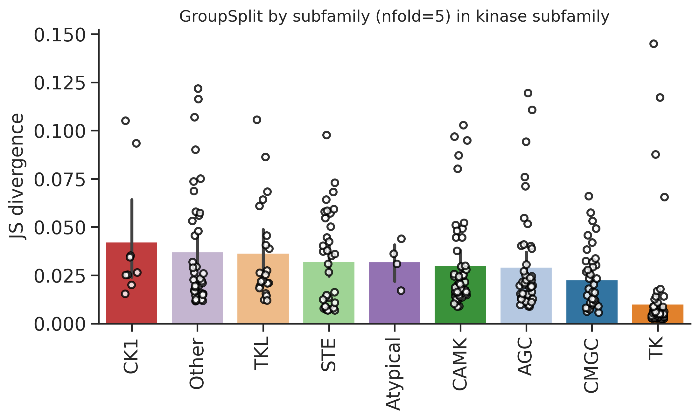
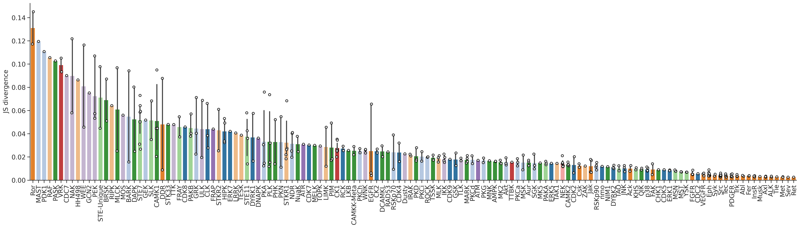
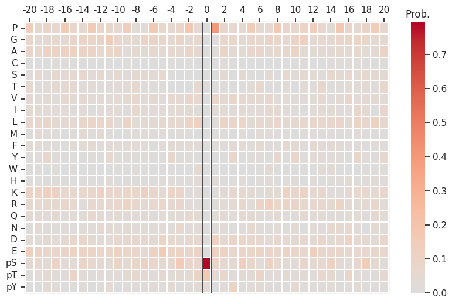
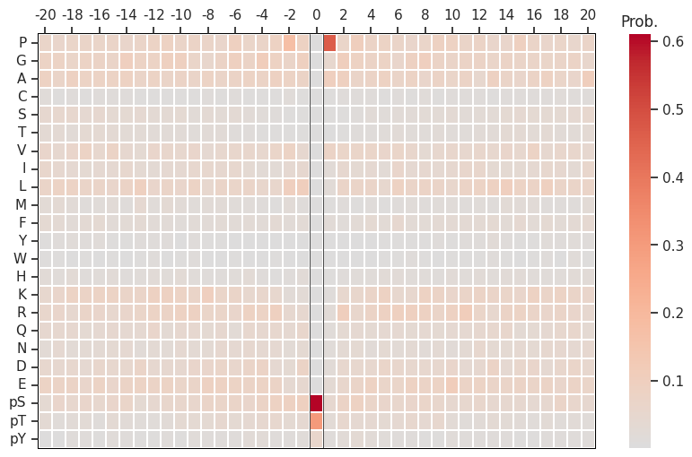
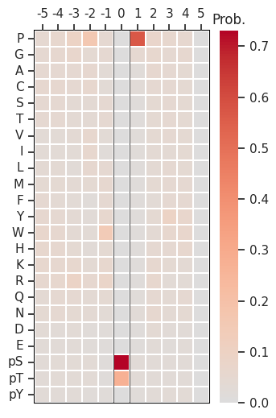

# DL training


<!-- WARNING: THIS FILE WAS AUTOGENERATED! DO NOT EDIT! -->

## Setup

``` python
import numpy as np, pandas as pd
import os, random
from katlas.data import *
from katlas.train import *
from fastai.vision.all import *
from katlas.dnn import *
```

``` python
seed_everything()
```

``` python
def_device
```

    'cuda'

## Data

``` python
df=pd.read_parquet('train/cddm_t5.parquet')
```

``` python
info=Data.get_kinase_info()

info = info[info.pseudo=='0']

info = info[info.kd_ID.notna()]

subfamily_map = info[['kd_ID','subfamily']].drop_duplicates().set_index('kd_ID')['subfamily']
family_map = info[['kd_ID','family']].drop_duplicates().set_index('kd_ID')['family']
group_map = info[['kd_ID','group']].drop_duplicates().set_index('kd_ID')['group']

kinase_info = pd.DataFrame(df.index.tolist(),columns=['kinase'])

kinase_info['subfamily'] = kinase_info.kinase.map(subfamily_map)
kinase_info['family'] = kinase_info.kinase.map(family_map)
kinase_info['group'] = kinase_info.kinase.map(group_map)
```

``` python
df=df.reset_index()
```

``` python
df.columns
```

    Index(['index', '-20P', '-19P', '-18P', '-17P', '-16P', '-15P', '-14P', '-13P',
           '-12P',
           ...
           'T5_1014', 'T5_1015', 'T5_1016', 'T5_1017', 'T5_1018', 'T5_1019',
           'T5_1020', 'T5_1021', 'T5_1022', 'T5_1023'],
          dtype='object', length=1968)

``` python
# column name of feature and target
feat_col = df.columns[df.columns.str.startswith('T5_')]
target_col = df.columns[~df.columns.isin(feat_col)][1:]
```

``` python
feat_col
```

    Index(['T5_0', 'T5_1', 'T5_2', 'T5_3', 'T5_4', 'T5_5', 'T5_6', 'T5_7', 'T5_8',
           'T5_9',
           ...
           'T5_1014', 'T5_1015', 'T5_1016', 'T5_1017', 'T5_1018', 'T5_1019',
           'T5_1020', 'T5_1021', 'T5_1022', 'T5_1023'],
          dtype='object', length=1024)

## Split

``` python
kinase_info.subfamily.value_counts()
```

    subfamily
    Eph     12
    Src     11
    STE7     7
    NEK      7
    CK1      6
            ..
    PDK1     1
    GCN2     1
    CDC7     1
    MAST     1
    RAF      1
    Name: count, Length: 136, dtype: int64

``` python
kinase_info.family.value_counts()
```

    family
    STE20    22
    CAMKL    17
    Eph      12
    MAPK     12
    Src      11
             ..
    STK33     1
    PDK1      1
    CDC7      1
    MAST      1
    RAF       1
    Name: count, Length: 88, dtype: int64

``` python
kinase_info.group.value_counts()
```

    group
    TK          80
    CAMK        47
    AGC         45
    Other       40
    CMGC        39
    STE         35
    TKL         21
    CK1          9
    Atypical     4
    Name: count, dtype: int64

``` python
splits = get_splits(kinase_info, group='subfamily',nfold=5)

split0 = splits[0]
```

    GroupKFold(n_splits=5, random_state=None, shuffle=False)
    # subfamily in train set: 110
    # subfamily in test set: 26

## Dataset

``` python
# dataset
ds = GeneralDataset(df,feat_col,target_col)
```

``` python
len(ds)
```

    320

``` python
dl = DataLoader(ds, batch_size=64, shuffle=True)
```

``` python
xb,yb = next(iter(dl))

xb.shape,yb.shape
```

    (torch.Size([64, 1024]), torch.Size([64, 23, 41]))

## Model

``` python
n_feature = len(feat_col)
n_target = len(target_col)
```

``` python
# def get_mlp(): return PSSM_model(n_feature,n_target,model='MLP')

def get_cnn(): return PSSM_model(n_feature,n_target,model='CNN')
```

``` python
model = get_cnn()
```

``` python
logits= model(xb)
```

``` python
logits.shape
```

    torch.Size([64, 23, 41])

## Loss

``` python
CE(logits,yb)
```

    tensor(3.3115, grad_fn=<MeanBackward0>)

## Metrics

``` python
KLD(logits,yb)
```

    tensor(0.5317, grad_fn=<MeanBackward0>)

``` python
JSD(logits,yb)
```

    tensor(0.1252, grad_fn=<MeanBackward0>)

## CV train

> cross-validation

``` python
oof = train_dl_cv(df,feat_col,target_col,
                  splits = splits,
                  model_func = get_cnn,
                  n_epoch=20,lr=3e-3,save='cnn_cddm')
```

    ------fold0------
    lr in training is 0.003

<style>
    /* Turns off some styling */
    progress {
        /* gets rid of default border in Firefox and Opera. */
        border: none;
        /* Needs to be in here for Safari polyfill so background images work as expected. */
        background-size: auto;
    }
    progress:not([value]), progress:not([value])::-webkit-progress-bar {
        background: repeating-linear-gradient(45deg, #7e7e7e, #7e7e7e 10px, #5c5c5c 10px, #5c5c5c 20px);
    }
    .progress-bar-interrupted, .progress-bar-interrupted::-webkit-progress-bar {
        background: #F44336;
    }
</style>

<table class="dataframe" data-quarto-postprocess="true" data-border="1">
<thead>
<tr style="text-align: left;">
<th data-quarto-table-cell-role="th">epoch</th>
<th data-quarto-table-cell-role="th">train_loss</th>
<th data-quarto-table-cell-role="th">valid_loss</th>
<th data-quarto-table-cell-role="th">KLD</th>
<th data-quarto-table-cell-role="th">JSD</th>
<th data-quarto-table-cell-role="th">time</th>
</tr>
</thead>
<tbody>
<tr>
<td>0</td>
<td>3.282649</td>
<td>3.128296</td>
<td>0.319262</td>
<td>0.081570</td>
<td>00:01</td>
</tr>
<tr>
<td>1</td>
<td>3.241650</td>
<td>3.113522</td>
<td>0.304488</td>
<td>0.079595</td>
<td>00:00</td>
</tr>
<tr>
<td>2</td>
<td>3.212050</td>
<td>3.113102</td>
<td>0.304069</td>
<td>0.077892</td>
<td>00:00</td>
</tr>
<tr>
<td>3</td>
<td>3.195983</td>
<td>3.120565</td>
<td>0.311531</td>
<td>0.078662</td>
<td>00:00</td>
</tr>
<tr>
<td>4</td>
<td>3.178256</td>
<td>2.976437</td>
<td>0.167403</td>
<td>0.044890</td>
<td>00:00</td>
</tr>
<tr>
<td>5</td>
<td>3.148183</td>
<td>2.948758</td>
<td>0.139725</td>
<td>0.036188</td>
<td>00:00</td>
</tr>
<tr>
<td>6</td>
<td>3.109516</td>
<td>2.925130</td>
<td>0.116096</td>
<td>0.029711</td>
<td>00:00</td>
</tr>
<tr>
<td>7</td>
<td>3.072004</td>
<td>2.909240</td>
<td>0.100206</td>
<td>0.026152</td>
<td>00:00</td>
</tr>
<tr>
<td>8</td>
<td>3.039572</td>
<td>2.904013</td>
<td>0.094980</td>
<td>0.025093</td>
<td>00:00</td>
</tr>
<tr>
<td>9</td>
<td>3.012379</td>
<td>2.898960</td>
<td>0.089926</td>
<td>0.023662</td>
<td>00:00</td>
</tr>
<tr>
<td>10</td>
<td>2.989801</td>
<td>2.899136</td>
<td>0.090103</td>
<td>0.023424</td>
<td>00:00</td>
</tr>
<tr>
<td>11</td>
<td>2.970484</td>
<td>2.899322</td>
<td>0.090289</td>
<td>0.023485</td>
<td>00:00</td>
</tr>
<tr>
<td>12</td>
<td>2.954165</td>
<td>2.898535</td>
<td>0.089501</td>
<td>0.023218</td>
<td>00:00</td>
</tr>
<tr>
<td>13</td>
<td>2.940085</td>
<td>2.897991</td>
<td>0.088957</td>
<td>0.023097</td>
<td>00:00</td>
</tr>
<tr>
<td>14</td>
<td>2.927743</td>
<td>2.896062</td>
<td>0.087028</td>
<td>0.022649</td>
<td>00:00</td>
</tr>
<tr>
<td>15</td>
<td>2.917165</td>
<td>2.895469</td>
<td>0.086436</td>
<td>0.022511</td>
<td>00:00</td>
</tr>
<tr>
<td>16</td>
<td>2.907989</td>
<td>2.896032</td>
<td>0.086999</td>
<td>0.022646</td>
<td>00:00</td>
</tr>
<tr>
<td>17</td>
<td>2.899801</td>
<td>2.895162</td>
<td>0.086129</td>
<td>0.022428</td>
<td>00:00</td>
</tr>
<tr>
<td>18</td>
<td>2.892946</td>
<td>2.894896</td>
<td>0.085862</td>
<td>0.022354</td>
<td>00:00</td>
</tr>
<tr>
<td>19</td>
<td>2.886997</td>
<td>2.894820</td>
<td>0.085787</td>
<td>0.022334</td>
<td>00:00</td>
</tr>
</tbody>
</table>

<style>
    /* Turns off some styling */
    progress {
        /* gets rid of default border in Firefox and Opera. */
        border: none;
        /* Needs to be in here for Safari polyfill so background images work as expected. */
        background-size: auto;
    }
    progress:not([value]), progress:not([value])::-webkit-progress-bar {
        background: repeating-linear-gradient(45deg, #7e7e7e, #7e7e7e 10px, #5c5c5c 10px, #5c5c5c 20px);
    }
    .progress-bar-interrupted, .progress-bar-interrupted::-webkit-progress-bar {
        background: #F44336;
    }
</style>

    ------fold1------
    lr in training is 0.003

<style>
    /* Turns off some styling */
    progress {
        /* gets rid of default border in Firefox and Opera. */
        border: none;
        /* Needs to be in here for Safari polyfill so background images work as expected. */
        background-size: auto;
    }
    progress:not([value]), progress:not([value])::-webkit-progress-bar {
        background: repeating-linear-gradient(45deg, #7e7e7e, #7e7e7e 10px, #5c5c5c 10px, #5c5c5c 20px);
    }
    .progress-bar-interrupted, .progress-bar-interrupted::-webkit-progress-bar {
        background: #F44336;
    }
</style>

<table class="dataframe" data-quarto-postprocess="true" data-border="1">
<thead>
<tr style="text-align: left;">
<th data-quarto-table-cell-role="th">epoch</th>
<th data-quarto-table-cell-role="th">train_loss</th>
<th data-quarto-table-cell-role="th">valid_loss</th>
<th data-quarto-table-cell-role="th">KLD</th>
<th data-quarto-table-cell-role="th">JSD</th>
<th data-quarto-table-cell-role="th">time</th>
</tr>
</thead>
<tbody>
<tr>
<td>0</td>
<td>3.282195</td>
<td>3.130908</td>
<td>0.322224</td>
<td>0.081733</td>
<td>00:00</td>
</tr>
<tr>
<td>1</td>
<td>3.243584</td>
<td>3.113548</td>
<td>0.304865</td>
<td>0.078650</td>
<td>00:00</td>
</tr>
<tr>
<td>2</td>
<td>3.219855</td>
<td>3.120547</td>
<td>0.311864</td>
<td>0.079403</td>
<td>00:00</td>
</tr>
<tr>
<td>3</td>
<td>3.209427</td>
<td>3.087194</td>
<td>0.278511</td>
<td>0.069197</td>
<td>00:00</td>
</tr>
<tr>
<td>4</td>
<td>3.201059</td>
<td>2.992566</td>
<td>0.183883</td>
<td>0.048371</td>
<td>00:00</td>
</tr>
<tr>
<td>5</td>
<td>3.167005</td>
<td>2.937138</td>
<td>0.128454</td>
<td>0.033072</td>
<td>00:00</td>
</tr>
<tr>
<td>6</td>
<td>3.121017</td>
<td>2.924041</td>
<td>0.115357</td>
<td>0.029413</td>
<td>00:00</td>
</tr>
<tr>
<td>7</td>
<td>3.082160</td>
<td>2.915458</td>
<td>0.106775</td>
<td>0.027174</td>
<td>00:00</td>
</tr>
<tr>
<td>8</td>
<td>3.049422</td>
<td>2.906384</td>
<td>0.097700</td>
<td>0.025222</td>
<td>00:00</td>
</tr>
<tr>
<td>9</td>
<td>3.022278</td>
<td>2.902709</td>
<td>0.094025</td>
<td>0.024238</td>
<td>00:00</td>
</tr>
<tr>
<td>10</td>
<td>2.999649</td>
<td>2.899378</td>
<td>0.090695</td>
<td>0.023322</td>
<td>00:00</td>
</tr>
<tr>
<td>11</td>
<td>2.980213</td>
<td>2.898759</td>
<td>0.090075</td>
<td>0.023229</td>
<td>00:00</td>
</tr>
<tr>
<td>12</td>
<td>2.963545</td>
<td>2.898273</td>
<td>0.089589</td>
<td>0.022956</td>
<td>00:00</td>
</tr>
<tr>
<td>13</td>
<td>2.949331</td>
<td>2.897189</td>
<td>0.088506</td>
<td>0.022689</td>
<td>00:00</td>
</tr>
<tr>
<td>14</td>
<td>2.936587</td>
<td>2.896288</td>
<td>0.087604</td>
<td>0.022514</td>
<td>00:00</td>
</tr>
<tr>
<td>15</td>
<td>2.925316</td>
<td>2.894401</td>
<td>0.085718</td>
<td>0.022021</td>
<td>00:00</td>
</tr>
<tr>
<td>16</td>
<td>2.915478</td>
<td>2.893880</td>
<td>0.085196</td>
<td>0.021894</td>
<td>00:00</td>
</tr>
<tr>
<td>17</td>
<td>2.907102</td>
<td>2.893515</td>
<td>0.084832</td>
<td>0.021793</td>
<td>00:00</td>
</tr>
<tr>
<td>18</td>
<td>2.899950</td>
<td>2.893503</td>
<td>0.084820</td>
<td>0.021781</td>
<td>00:00</td>
</tr>
<tr>
<td>19</td>
<td>2.893546</td>
<td>2.893279</td>
<td>0.084595</td>
<td>0.021737</td>
<td>00:00</td>
</tr>
</tbody>
</table>

<style>
    /* Turns off some styling */
    progress {
        /* gets rid of default border in Firefox and Opera. */
        border: none;
        /* Needs to be in here for Safari polyfill so background images work as expected. */
        background-size: auto;
    }
    progress:not([value]), progress:not([value])::-webkit-progress-bar {
        background: repeating-linear-gradient(45deg, #7e7e7e, #7e7e7e 10px, #5c5c5c 10px, #5c5c5c 20px);
    }
    .progress-bar-interrupted, .progress-bar-interrupted::-webkit-progress-bar {
        background: #F44336;
    }
</style>

    ------fold2------
    lr in training is 0.003

<style>
    /* Turns off some styling */
    progress {
        /* gets rid of default border in Firefox and Opera. */
        border: none;
        /* Needs to be in here for Safari polyfill so background images work as expected. */
        background-size: auto;
    }
    progress:not([value]), progress:not([value])::-webkit-progress-bar {
        background: repeating-linear-gradient(45deg, #7e7e7e, #7e7e7e 10px, #5c5c5c 10px, #5c5c5c 20px);
    }
    .progress-bar-interrupted, .progress-bar-interrupted::-webkit-progress-bar {
        background: #F44336;
    }
</style>

<table class="dataframe" data-quarto-postprocess="true" data-border="1">
<thead>
<tr style="text-align: left;">
<th data-quarto-table-cell-role="th">epoch</th>
<th data-quarto-table-cell-role="th">train_loss</th>
<th data-quarto-table-cell-role="th">valid_loss</th>
<th data-quarto-table-cell-role="th">KLD</th>
<th data-quarto-table-cell-role="th">JSD</th>
<th data-quarto-table-cell-role="th">time</th>
</tr>
</thead>
<tbody>
<tr>
<td>0</td>
<td>3.282472</td>
<td>3.127070</td>
<td>0.353896</td>
<td>0.091299</td>
<td>00:00</td>
</tr>
<tr>
<td>1</td>
<td>3.241385</td>
<td>3.109268</td>
<td>0.336093</td>
<td>0.088014</td>
<td>00:00</td>
</tr>
<tr>
<td>2</td>
<td>3.209924</td>
<td>3.114542</td>
<td>0.341367</td>
<td>0.087262</td>
<td>00:00</td>
</tr>
<tr>
<td>3</td>
<td>3.193899</td>
<td>3.053725</td>
<td>0.280551</td>
<td>0.073127</td>
<td>00:00</td>
</tr>
<tr>
<td>4</td>
<td>3.181828</td>
<td>2.961300</td>
<td>0.188125</td>
<td>0.050201</td>
<td>00:00</td>
</tr>
<tr>
<td>5</td>
<td>3.145959</td>
<td>2.931028</td>
<td>0.157853</td>
<td>0.041150</td>
<td>00:00</td>
</tr>
<tr>
<td>6</td>
<td>3.109088</td>
<td>2.925400</td>
<td>0.152225</td>
<td>0.038905</td>
<td>00:00</td>
</tr>
<tr>
<td>7</td>
<td>3.075637</td>
<td>2.922864</td>
<td>0.149690</td>
<td>0.038691</td>
<td>00:00</td>
</tr>
<tr>
<td>8</td>
<td>3.047635</td>
<td>2.909077</td>
<td>0.135902</td>
<td>0.035387</td>
<td>00:00</td>
</tr>
<tr>
<td>9</td>
<td>3.024517</td>
<td>2.901939</td>
<td>0.128764</td>
<td>0.033550</td>
<td>00:00</td>
</tr>
<tr>
<td>10</td>
<td>3.003808</td>
<td>2.899364</td>
<td>0.126189</td>
<td>0.032804</td>
<td>00:00</td>
</tr>
<tr>
<td>11</td>
<td>2.984565</td>
<td>2.898607</td>
<td>0.125433</td>
<td>0.032361</td>
<td>00:00</td>
</tr>
<tr>
<td>12</td>
<td>2.967488</td>
<td>2.896226</td>
<td>0.123052</td>
<td>0.031884</td>
<td>00:00</td>
</tr>
<tr>
<td>13</td>
<td>2.952080</td>
<td>2.895696</td>
<td>0.122522</td>
<td>0.031629</td>
<td>00:00</td>
</tr>
<tr>
<td>14</td>
<td>2.938943</td>
<td>2.895282</td>
<td>0.122107</td>
<td>0.031550</td>
<td>00:00</td>
</tr>
<tr>
<td>15</td>
<td>2.927504</td>
<td>2.894837</td>
<td>0.121663</td>
<td>0.031524</td>
<td>00:00</td>
</tr>
<tr>
<td>16</td>
<td>2.917730</td>
<td>2.893668</td>
<td>0.120494</td>
<td>0.031259</td>
<td>00:00</td>
</tr>
<tr>
<td>17</td>
<td>2.908983</td>
<td>2.893366</td>
<td>0.120192</td>
<td>0.031149</td>
<td>00:00</td>
</tr>
<tr>
<td>18</td>
<td>2.901532</td>
<td>2.893119</td>
<td>0.119945</td>
<td>0.031088</td>
<td>00:00</td>
</tr>
<tr>
<td>19</td>
<td>2.895179</td>
<td>2.893249</td>
<td>0.120075</td>
<td>0.031103</td>
<td>00:00</td>
</tr>
</tbody>
</table>

<style>
    /* Turns off some styling */
    progress {
        /* gets rid of default border in Firefox and Opera. */
        border: none;
        /* Needs to be in here for Safari polyfill so background images work as expected. */
        background-size: auto;
    }
    progress:not([value]), progress:not([value])::-webkit-progress-bar {
        background: repeating-linear-gradient(45deg, #7e7e7e, #7e7e7e 10px, #5c5c5c 10px, #5c5c5c 20px);
    }
    .progress-bar-interrupted, .progress-bar-interrupted::-webkit-progress-bar {
        background: #F44336;
    }
</style>

    ------fold3------
    lr in training is 0.003

<style>
    /* Turns off some styling */
    progress {
        /* gets rid of default border in Firefox and Opera. */
        border: none;
        /* Needs to be in here for Safari polyfill so background images work as expected. */
        background-size: auto;
    }
    progress:not([value]), progress:not([value])::-webkit-progress-bar {
        background: repeating-linear-gradient(45deg, #7e7e7e, #7e7e7e 10px, #5c5c5c 10px, #5c5c5c 20px);
    }
    .progress-bar-interrupted, .progress-bar-interrupted::-webkit-progress-bar {
        background: #F44336;
    }
</style>

<table class="dataframe" data-quarto-postprocess="true" data-border="1">
<thead>
<tr style="text-align: left;">
<th data-quarto-table-cell-role="th">epoch</th>
<th data-quarto-table-cell-role="th">train_loss</th>
<th data-quarto-table-cell-role="th">valid_loss</th>
<th data-quarto-table-cell-role="th">KLD</th>
<th data-quarto-table-cell-role="th">JSD</th>
<th data-quarto-table-cell-role="th">time</th>
</tr>
</thead>
<tbody>
<tr>
<td>0</td>
<td>3.280588</td>
<td>3.129339</td>
<td>0.335539</td>
<td>0.085304</td>
<td>00:00</td>
</tr>
<tr>
<td>1</td>
<td>3.240295</td>
<td>3.119176</td>
<td>0.325376</td>
<td>0.083852</td>
<td>00:00</td>
</tr>
<tr>
<td>2</td>
<td>3.210839</td>
<td>3.091391</td>
<td>0.297591</td>
<td>0.077241</td>
<td>00:00</td>
</tr>
<tr>
<td>3</td>
<td>3.200143</td>
<td>3.042270</td>
<td>0.248470</td>
<td>0.065589</td>
<td>00:00</td>
</tr>
<tr>
<td>4</td>
<td>3.195208</td>
<td>3.029967</td>
<td>0.236167</td>
<td>0.060239</td>
<td>00:00</td>
</tr>
<tr>
<td>5</td>
<td>3.157714</td>
<td>2.951658</td>
<td>0.157859</td>
<td>0.039547</td>
<td>00:00</td>
</tr>
<tr>
<td>6</td>
<td>3.114407</td>
<td>2.937240</td>
<td>0.143440</td>
<td>0.036184</td>
<td>00:00</td>
</tr>
<tr>
<td>7</td>
<td>3.076996</td>
<td>2.915984</td>
<td>0.122185</td>
<td>0.031200</td>
<td>00:00</td>
</tr>
<tr>
<td>8</td>
<td>3.044734</td>
<td>2.903373</td>
<td>0.109573</td>
<td>0.028193</td>
<td>00:00</td>
</tr>
<tr>
<td>9</td>
<td>3.018122</td>
<td>2.900592</td>
<td>0.106792</td>
<td>0.027362</td>
<td>00:00</td>
</tr>
<tr>
<td>10</td>
<td>2.995771</td>
<td>2.897802</td>
<td>0.104002</td>
<td>0.026672</td>
<td>00:00</td>
</tr>
<tr>
<td>11</td>
<td>2.977186</td>
<td>2.896495</td>
<td>0.102695</td>
<td>0.026356</td>
<td>00:00</td>
</tr>
<tr>
<td>12</td>
<td>2.960754</td>
<td>2.895625</td>
<td>0.101826</td>
<td>0.026132</td>
<td>00:00</td>
</tr>
<tr>
<td>13</td>
<td>2.946897</td>
<td>2.895158</td>
<td>0.101358</td>
<td>0.025921</td>
<td>00:00</td>
</tr>
<tr>
<td>14</td>
<td>2.935326</td>
<td>2.893981</td>
<td>0.100182</td>
<td>0.025680</td>
<td>00:00</td>
</tr>
<tr>
<td>15</td>
<td>2.925143</td>
<td>2.893090</td>
<td>0.099290</td>
<td>0.025458</td>
<td>00:00</td>
</tr>
<tr>
<td>16</td>
<td>2.916389</td>
<td>2.892680</td>
<td>0.098880</td>
<td>0.025363</td>
<td>00:00</td>
</tr>
<tr>
<td>17</td>
<td>2.908602</td>
<td>2.891653</td>
<td>0.097853</td>
<td>0.025092</td>
<td>00:00</td>
</tr>
<tr>
<td>18</td>
<td>2.901875</td>
<td>2.891660</td>
<td>0.097860</td>
<td>0.025101</td>
<td>00:00</td>
</tr>
<tr>
<td>19</td>
<td>2.896487</td>
<td>2.891503</td>
<td>0.097704</td>
<td>0.025064</td>
<td>00:00</td>
</tr>
</tbody>
</table>

<style>
    /* Turns off some styling */
    progress {
        /* gets rid of default border in Firefox and Opera. */
        border: none;
        /* Needs to be in here for Safari polyfill so background images work as expected. */
        background-size: auto;
    }
    progress:not([value]), progress:not([value])::-webkit-progress-bar {
        background: repeating-linear-gradient(45deg, #7e7e7e, #7e7e7e 10px, #5c5c5c 10px, #5c5c5c 20px);
    }
    .progress-bar-interrupted, .progress-bar-interrupted::-webkit-progress-bar {
        background: #F44336;
    }
</style>

    ------fold4------
    lr in training is 0.003

<style>
    /* Turns off some styling */
    progress {
        /* gets rid of default border in Firefox and Opera. */
        border: none;
        /* Needs to be in here for Safari polyfill so background images work as expected. */
        background-size: auto;
    }
    progress:not([value]), progress:not([value])::-webkit-progress-bar {
        background: repeating-linear-gradient(45deg, #7e7e7e, #7e7e7e 10px, #5c5c5c 10px, #5c5c5c 20px);
    }
    .progress-bar-interrupted, .progress-bar-interrupted::-webkit-progress-bar {
        background: #F44336;
    }
</style>

<table class="dataframe" data-quarto-postprocess="true" data-border="1">
<thead>
<tr style="text-align: left;">
<th data-quarto-table-cell-role="th">epoch</th>
<th data-quarto-table-cell-role="th">train_loss</th>
<th data-quarto-table-cell-role="th">valid_loss</th>
<th data-quarto-table-cell-role="th">KLD</th>
<th data-quarto-table-cell-role="th">JSD</th>
<th data-quarto-table-cell-role="th">time</th>
</tr>
</thead>
<tbody>
<tr>
<td>0</td>
<td>3.283504</td>
<td>3.130594</td>
<td>0.363589</td>
<td>0.093193</td>
<td>00:00</td>
</tr>
<tr>
<td>1</td>
<td>3.243992</td>
<td>3.116076</td>
<td>0.349071</td>
<td>0.090924</td>
<td>00:00</td>
</tr>
<tr>
<td>2</td>
<td>3.210798</td>
<td>3.120450</td>
<td>0.353445</td>
<td>0.090563</td>
<td>00:00</td>
</tr>
<tr>
<td>3</td>
<td>3.199268</td>
<td>3.072872</td>
<td>0.305868</td>
<td>0.079987</td>
<td>00:00</td>
</tr>
<tr>
<td>4</td>
<td>3.177695</td>
<td>2.966492</td>
<td>0.199487</td>
<td>0.053601</td>
<td>00:00</td>
</tr>
<tr>
<td>5</td>
<td>3.137152</td>
<td>2.917118</td>
<td>0.150113</td>
<td>0.039282</td>
<td>-1:59:59</td>
</tr>
<tr>
<td>6</td>
<td>3.099840</td>
<td>2.911311</td>
<td>0.144307</td>
<td>0.037135</td>
<td>00:00</td>
</tr>
<tr>
<td>7</td>
<td>3.071257</td>
<td>2.897541</td>
<td>0.130536</td>
<td>0.034004</td>
<td>00:00</td>
</tr>
<tr>
<td>8</td>
<td>3.047829</td>
<td>2.894860</td>
<td>0.127856</td>
<td>0.033557</td>
<td>00:00</td>
</tr>
<tr>
<td>9</td>
<td>3.024281</td>
<td>2.900576</td>
<td>0.133571</td>
<td>0.034486</td>
<td>00:00</td>
</tr>
<tr>
<td>10</td>
<td>3.002414</td>
<td>2.898617</td>
<td>0.131613</td>
<td>0.034054</td>
<td>00:00</td>
</tr>
<tr>
<td>11</td>
<td>2.983205</td>
<td>2.894372</td>
<td>0.127367</td>
<td>0.032931</td>
<td>00:00</td>
</tr>
<tr>
<td>12</td>
<td>2.966494</td>
<td>2.888815</td>
<td>0.121811</td>
<td>0.031625</td>
<td>00:00</td>
</tr>
<tr>
<td>13</td>
<td>2.952212</td>
<td>2.885732</td>
<td>0.118727</td>
<td>0.031049</td>
<td>00:00</td>
</tr>
<tr>
<td>14</td>
<td>2.939676</td>
<td>2.885109</td>
<td>0.118105</td>
<td>0.030705</td>
<td>00:00</td>
</tr>
<tr>
<td>15</td>
<td>2.928643</td>
<td>2.883477</td>
<td>0.116472</td>
<td>0.030395</td>
<td>00:00</td>
</tr>
<tr>
<td>16</td>
<td>2.919168</td>
<td>2.882151</td>
<td>0.115146</td>
<td>0.030121</td>
<td>00:00</td>
</tr>
<tr>
<td>17</td>
<td>2.910880</td>
<td>2.881615</td>
<td>0.114610</td>
<td>0.030057</td>
<td>00:00</td>
</tr>
<tr>
<td>18</td>
<td>2.903741</td>
<td>2.881046</td>
<td>0.114041</td>
<td>0.029917</td>
<td>00:00</td>
</tr>
<tr>
<td>19</td>
<td>2.897946</td>
<td>2.881109</td>
<td>0.114104</td>
<td>0.029928</td>
<td>00:00</td>
</tr>
</tbody>
</table>

<style>
    /* Turns off some styling */
    progress {
        /* gets rid of default border in Firefox and Opera. */
        border: none;
        /* Needs to be in here for Safari polyfill so background images work as expected. */
        background-size: auto;
    }
    progress:not([value]), progress:not([value])::-webkit-progress-bar {
        background: repeating-linear-gradient(45deg, #7e7e7e, #7e7e7e 10px, #5c5c5c 10px, #5c5c5c 20px);
    }
    .progress-bar-interrupted, .progress-bar-interrupted::-webkit-progress-bar {
        background: #F44336;
    }
</style>

``` python
oof.to_parquet('raw/oof_cddm.parquet')
```

## Score

``` python
from katlas.pssm import *

from functools import partial
```

``` python
def score_df(target,pred,func):
    distance = [func(target.loc[i],pred.loc[i,target.columns]) for i in target.index]
    return pd.Series(distance,index=target.index)
```

``` python
jsd_df = partial(score_df,func=js_divergence_flat)
kld_df = partial(score_df,func=kl_divergence_flat)
```

``` python
target=df[target_col].copy()
```

``` python
kinase_info['group_split'] = oof.nfold
```

``` python
kinase_info['group_jsd'] =jsd_df(target,oof)
```

``` python
from katlas.plot import *
```

``` python
set_sns()
```

``` python
plot_bar(kinase_info,'group_jsd',group='group',palette=group_color,figsize=(8,4))
plt.ylabel('JS divergence')
plt.title('GroupSplit by subfamily (nfold=5) in kinase subfamily')
```

    Text(0.5, 1.0, 'GroupSplit by subfamily (nfold=5) in kinase subfamily')



``` python
group_color = pd.DataFrame(group_color).T
```

``` python
sty_color
```

    {'S': (0.12156862745098039, 0.4666666666666667, 0.7058823529411765),
     'T': (0.6823529411764706, 0.7803921568627451, 0.9098039215686274),
     'Y': (1.0, 0.4980392156862745, 0.054901960784313725)}

``` python
group_color = group_color.reset_index(names='modi_group')
```

``` python
info = Data.get_kinase_info()
```

``` python
subfamily_color = info[['modi_group','subfamily']].merge(group_color).drop(columns=['modi_group']).set_index('subfamily')
```

``` python
subfamily_color = subfamily_color.apply(tuple, axis=1).to_dict()
```

``` python
plot_bar(kinase_info,'group_jsd',group='subfamily',palette = subfamily_color, figsize=(30,7))
plt.ylabel('JS divergence')
# plt.title('Stratified split in kinase subfamily')
```

    Text(0, 0.5, 'JS divergence')



``` python
from katlas.pssm import *
```

``` python
def plot_one_pssm(target,pred,idx):
    target_pssm = recover_pssm(target.loc[idx])
    pred_pssm = recover_pssm(pred.loc[idx,target.columns])
    plot_heatmap(target_pssm,figsize=(10,6))
    plot_heatmap(pred_pssm,figsize=(10,6))
```

``` python
set_sns(100)
```

``` python
kinase_info[kinase_info.kinase.str.contains('CDK')]
```

<div>
<style scoped>
    .dataframe tbody tr th:only-of-type {
        vertical-align: middle;
    }
&#10;    .dataframe tbody tr th {
        vertical-align: top;
    }
&#10;    .dataframe thead th {
        text-align: right;
    }
</style>

<table class="dataframe" data-quarto-postprocess="true" data-border="1">
<thead>
<tr style="text-align: right;">
<th data-quarto-table-cell-role="th"></th>
<th data-quarto-table-cell-role="th">kinase</th>
<th data-quarto-table-cell-role="th">subfamily</th>
<th data-quarto-table-cell-role="th">family</th>
<th data-quarto-table-cell-role="th">group</th>
<th data-quarto-table-cell-role="th">group_split</th>
<th data-quarto-table-cell-role="th">group_jsd</th>
</tr>
</thead>
<tbody>
<tr>
<td data-quarto-table-cell-role="th">34</td>
<td>P06493_CDK1_HUMAN_KD1</td>
<td>CDC2</td>
<td>CDK</td>
<td>CMGC</td>
<td>1</td>
<td>0.005642</td>
</tr>
<tr>
<td data-quarto-table-cell-role="th">39</td>
<td>P24941_CDK2_HUMAN_KD1</td>
<td>CDK2</td>
<td>CDK</td>
<td>CMGC</td>
<td>0</td>
<td>0.006260</td>
</tr>
<tr>
<td data-quarto-table-cell-role="th">102</td>
<td>Q00535_CDK5_HUMAN_KD1</td>
<td>CDK5</td>
<td>CDK</td>
<td>CMGC</td>
<td>3</td>
<td>0.008968</td>
</tr>
<tr>
<td data-quarto-table-cell-role="th">168</td>
<td>P50750_CDK9_HUMAN_KD1</td>
<td>CDK9</td>
<td>CDK</td>
<td>CMGC</td>
<td>4</td>
<td>0.018047</td>
</tr>
<tr>
<td data-quarto-table-cell-role="th">204</td>
<td>Q00534_CDK6_HUMAN_KD1</td>
<td>CDK4</td>
<td>CDK</td>
<td>CMGC</td>
<td>1</td>
<td>0.016037</td>
</tr>
<tr>
<td data-quarto-table-cell-role="th">224</td>
<td>P50613_CDK7_HUMAN_KD1</td>
<td>CDK7</td>
<td>CDK</td>
<td>CMGC</td>
<td>2</td>
<td>0.030289</td>
</tr>
<tr>
<td data-quarto-table-cell-role="th">228</td>
<td>Q00526_CDK3_HUMAN_KD1</td>
<td>CDK2</td>
<td>CDK</td>
<td>CMGC</td>
<td>0</td>
<td>0.020181</td>
</tr>
<tr>
<td data-quarto-table-cell-role="th">240</td>
<td>P11802_CDK4_HUMAN_KD1</td>
<td>CDK4</td>
<td>CDK</td>
<td>CMGC</td>
<td>1</td>
<td>0.031994</td>
</tr>
<tr>
<td data-quarto-table-cell-role="th">280</td>
<td>P49336_CDK8_HUMAN_KD1</td>
<td>CDK8</td>
<td>CDK</td>
<td>CMGC</td>
<td>0</td>
<td>0.045855</td>
</tr>
</tbody>
</table>

</div>

CDK7:

``` python
plot_one_pssm(target,oof,224)
```





Compare with pspa CDK:

``` python
df2=pd.read_parquet('train/pspa_t5.parquet')
```

``` python
series= df2[df2.index.str.contains('CDK7')].iloc[0]
```

``` python
plot_heatmap(recover_pssm(series),figsize=(3.5,6))
```


