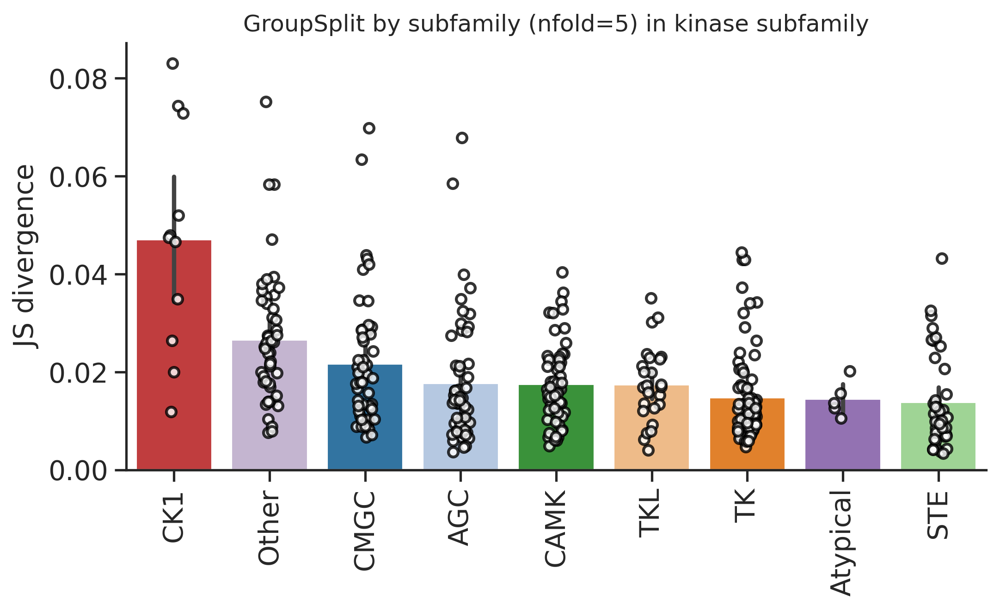
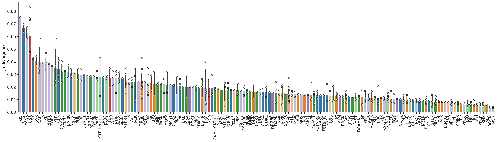
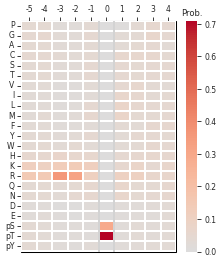
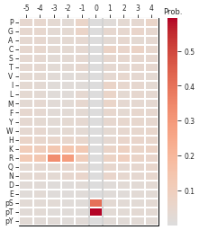

# DL training


<!-- WARNING: THIS FILE WAS AUTOGENERATED! DO NOT EDIT! -->

## Setup

``` python
import numpy as np, pandas as pd
import os, random
from katlas.data import *
from katlas.train import *
from fastai.vision.all import *
from katlas.dnn import *
```

``` python
seed_everything()
```

``` python
def_device
```

    'cuda'

## Data

``` python
df=pd.read_parquet('train/pspa_t5.parquet')
```

``` python
info=Data.get_kinase_info()

info = info[info.pseudo=='0']

info = info[info.kd_ID.notna()]

subfamily_map = info[['kd_ID','subfamily']].drop_duplicates().set_index('kd_ID')['subfamily']
family_map = info[['kd_ID','family']].drop_duplicates().set_index('kd_ID')['family']
group_map = info[['kd_ID','group']].drop_duplicates().set_index('kd_ID')['group']

pspa_info = pd.DataFrame(df.index.tolist(),columns=['kinase'])

pspa_info['subfamily'] = pspa_info.kinase.map(subfamily_map)
pspa_info['family'] = pspa_info.kinase.map(family_map)
pspa_info['group'] = pspa_info.kinase.map(group_map)
```

``` python
df=df.reset_index()
```

``` python
df.columns
```

    Index(['index', '-5P', '-4P', '-3P', '-2P', '-1P', '0P', '1P', '2P', '3P',
           ...
           'T5_1014', 'T5_1015', 'T5_1016', 'T5_1017', 'T5_1018', 'T5_1019',
           'T5_1020', 'T5_1021', 'T5_1022', 'T5_1023'],
          dtype='object', length=1255)

``` python
# column name of feature and target
feat_col = df.columns[df.columns.str.startswith('T5_')]
target_col = df.columns[~df.columns.isin(feat_col)][1:]
```

``` python
feat_col
```

    Index(['T5_0', 'T5_1', 'T5_2', 'T5_3', 'T5_4', 'T5_5', 'T5_6', 'T5_7', 'T5_8',
           'T5_9',
           ...
           'T5_1014', 'T5_1015', 'T5_1016', 'T5_1017', 'T5_1018', 'T5_1019',
           'T5_1020', 'T5_1021', 'T5_1022', 'T5_1023'],
          dtype='object', length=1024)

## Split

``` python
pspa_info.subfamily.value_counts()
```

    subfamily
    Eph      12
    Src      11
    NEK      10
    CK1       7
    STE11     7
             ..
    ZAK       1
    Sev       1
    Ret       1
    Musk      1
    Tie       1
    Name: count, Length: 149, dtype: int64

``` python
pspa_info.family.value_counts()
```

    family
    STE20    27
    CAMKL    20
    CDK      17
    MAPK     12
    Eph      12
             ..
    STK33     1
    Sev       1
    Ret       1
    Musk      1
    Tie       1
    Name: count, Length: 92, dtype: int64

``` python
pspa_info.group.value_counts()
```

    group
    TK          78
    CAMK        57
    CMGC        52
    AGC         52
    Other       49
    STE         39
    TKL         25
    CK1         11
    Atypical     5
    Name: count, dtype: int64

``` python
splits = get_splits(pspa_info, group='subfamily',nfold=5)

split0 = splits[0]
```

    GroupKFold(n_splits=5, random_state=None, shuffle=False)
    # subfamily in train set: 120
    # subfamily in test set: 29

## Dataset

``` python
# dataset
ds = GeneralDataset(df,feat_col,target_col)
```

``` python
len(ds)
```

    368

``` python
dl = DataLoader(ds, batch_size=64, shuffle=True)
```

``` python
xb,yb = next(iter(dl))

xb.shape,yb.shape
```

    (torch.Size([64, 1024]), torch.Size([64, 23, 10]))

## Model

``` python
n_feature = len(feat_col)
n_target = len(target_col)
```

``` python
# def get_mlp(): return PSSM_model(n_feature,n_target,model='MLP')

def get_cnn(): return PSSM_model(n_feature,n_target,model='CNN')
```

``` python
model = get_cnn()
```

``` python
logits= model(xb)
```

``` python
logits.shape
```

    torch.Size([64, 23, 10])

## Loss

``` python
CE(logits,yb)
```

    tensor(3.3157, grad_fn=<MeanBackward0>)

## Metrics

``` python
KLD(logits,yb)
```

    tensor(0.5744, grad_fn=<MeanBackward0>)

``` python
JSD(logits,yb)
```

    tensor(0.1175, grad_fn=<MeanBackward0>)

## CV train

> cross-validation

``` python
oof = train_dl_cv(df,feat_col,target_col,
                  splits = splits,
                  model_func = get_cnn,
                  n_epoch=20,lr=3e-3,save='cnn_pspa')
```

    ------fold0------
    lr in training is 0.003

<style>
    /* Turns off some styling */
    progress {
        /* gets rid of default border in Firefox and Opera. */
        border: none;
        /* Needs to be in here for Safari polyfill so background images work as expected. */
        background-size: auto;
    }
    progress:not([value]), progress:not([value])::-webkit-progress-bar {
        background: repeating-linear-gradient(45deg, #7e7e7e, #7e7e7e 10px, #5c5c5c 10px, #5c5c5c 20px);
    }
    .progress-bar-interrupted, .progress-bar-interrupted::-webkit-progress-bar {
        background: #F44336;
    }
</style>

<table class="dataframe" data-quarto-postprocess="true" data-border="1">
<thead>
<tr style="text-align: left;">
<th data-quarto-table-cell-role="th">epoch</th>
<th data-quarto-table-cell-role="th">train_loss</th>
<th data-quarto-table-cell-role="th">valid_loss</th>
<th data-quarto-table-cell-role="th">KLD</th>
<th data-quarto-table-cell-role="th">JSD</th>
<th data-quarto-table-cell-role="th">time</th>
</tr>
</thead>
<tbody>
<tr>
<td>0</td>
<td>3.233706</td>
<td>3.125911</td>
<td>0.406453</td>
<td>0.085575</td>
<td>00:01</td>
</tr>
<tr>
<td>1</td>
<td>3.130510</td>
<td>3.048949</td>
<td>0.329490</td>
<td>0.074209</td>
<td>00:00</td>
</tr>
<tr>
<td>2</td>
<td>3.055997</td>
<td>3.130454</td>
<td>0.410995</td>
<td>0.065571</td>
<td>00:00</td>
</tr>
<tr>
<td>3</td>
<td>3.010011</td>
<td>3.088417</td>
<td>0.368959</td>
<td>0.066432</td>
<td>00:00</td>
</tr>
<tr>
<td>4</td>
<td>2.983442</td>
<td>3.059395</td>
<td>0.339937</td>
<td>0.059636</td>
<td>00:00</td>
</tr>
<tr>
<td>5</td>
<td>2.963942</td>
<td>3.014983</td>
<td>0.295525</td>
<td>0.053493</td>
<td>00:00</td>
</tr>
<tr>
<td>6</td>
<td>2.941524</td>
<td>2.903284</td>
<td>0.183826</td>
<td>0.041339</td>
<td>00:00</td>
</tr>
<tr>
<td>7</td>
<td>2.920246</td>
<td>2.822921</td>
<td>0.103463</td>
<td>0.025377</td>
<td>00:00</td>
</tr>
<tr>
<td>8</td>
<td>2.902542</td>
<td>2.829456</td>
<td>0.109998</td>
<td>0.026529</td>
<td>00:00</td>
</tr>
<tr>
<td>9</td>
<td>2.887325</td>
<td>2.807781</td>
<td>0.088324</td>
<td>0.020793</td>
<td>00:00</td>
</tr>
<tr>
<td>10</td>
<td>2.873063</td>
<td>2.803475</td>
<td>0.084017</td>
<td>0.019533</td>
<td>00:00</td>
</tr>
<tr>
<td>11</td>
<td>2.861299</td>
<td>2.807706</td>
<td>0.088248</td>
<td>0.020885</td>
<td>00:00</td>
</tr>
<tr>
<td>12</td>
<td>2.850185</td>
<td>2.800845</td>
<td>0.081387</td>
<td>0.019359</td>
<td>00:00</td>
</tr>
<tr>
<td>13</td>
<td>2.840891</td>
<td>2.799504</td>
<td>0.080046</td>
<td>0.018768</td>
<td>00:00</td>
</tr>
<tr>
<td>14</td>
<td>2.841491</td>
<td>2.814084</td>
<td>0.094626</td>
<td>0.020952</td>
<td>00:00</td>
</tr>
<tr>
<td>15</td>
<td>2.833544</td>
<td>2.803974</td>
<td>0.084516</td>
<td>0.020174</td>
<td>00:00</td>
</tr>
<tr>
<td>16</td>
<td>2.827274</td>
<td>2.801270</td>
<td>0.081811</td>
<td>0.019360</td>
<td>00:00</td>
</tr>
<tr>
<td>17</td>
<td>2.821252</td>
<td>2.799191</td>
<td>0.079733</td>
<td>0.018746</td>
<td>00:00</td>
</tr>
<tr>
<td>18</td>
<td>2.816021</td>
<td>2.800156</td>
<td>0.080698</td>
<td>0.019058</td>
<td>00:00</td>
</tr>
<tr>
<td>19</td>
<td>2.811490</td>
<td>2.801163</td>
<td>0.081706</td>
<td>0.019365</td>
<td>00:00</td>
</tr>
</tbody>
</table>

<style>
    /* Turns off some styling */
    progress {
        /* gets rid of default border in Firefox and Opera. */
        border: none;
        /* Needs to be in here for Safari polyfill so background images work as expected. */
        background-size: auto;
    }
    progress:not([value]), progress:not([value])::-webkit-progress-bar {
        background: repeating-linear-gradient(45deg, #7e7e7e, #7e7e7e 10px, #5c5c5c 10px, #5c5c5c 20px);
    }
    .progress-bar-interrupted, .progress-bar-interrupted::-webkit-progress-bar {
        background: #F44336;
    }
</style>

    ------fold1------
    lr in training is 0.003

<style>
    /* Turns off some styling */
    progress {
        /* gets rid of default border in Firefox and Opera. */
        border: none;
        /* Needs to be in here for Safari polyfill so background images work as expected. */
        background-size: auto;
    }
    progress:not([value]), progress:not([value])::-webkit-progress-bar {
        background: repeating-linear-gradient(45deg, #7e7e7e, #7e7e7e 10px, #5c5c5c 10px, #5c5c5c 20px);
    }
    .progress-bar-interrupted, .progress-bar-interrupted::-webkit-progress-bar {
        background: #F44336;
    }
</style>

<table class="dataframe" data-quarto-postprocess="true" data-border="1">
<thead>
<tr style="text-align: left;">
<th data-quarto-table-cell-role="th">epoch</th>
<th data-quarto-table-cell-role="th">train_loss</th>
<th data-quarto-table-cell-role="th">valid_loss</th>
<th data-quarto-table-cell-role="th">KLD</th>
<th data-quarto-table-cell-role="th">JSD</th>
<th data-quarto-table-cell-role="th">time</th>
</tr>
</thead>
<tbody>
<tr>
<td>0</td>
<td>3.220115</td>
<td>3.122870</td>
<td>0.367961</td>
<td>0.079914</td>
<td>00:00</td>
</tr>
<tr>
<td>1</td>
<td>3.110324</td>
<td>3.013538</td>
<td>0.258628</td>
<td>0.061137</td>
<td>00:00</td>
</tr>
<tr>
<td>2</td>
<td>3.029848</td>
<td>3.004896</td>
<td>0.249986</td>
<td>0.043967</td>
<td>00:00</td>
</tr>
<tr>
<td>3</td>
<td>2.986253</td>
<td>3.025127</td>
<td>0.270218</td>
<td>0.044840</td>
<td>00:00</td>
</tr>
<tr>
<td>4</td>
<td>2.962428</td>
<td>2.937174</td>
<td>0.182265</td>
<td>0.038925</td>
<td>00:00</td>
</tr>
<tr>
<td>5</td>
<td>2.944227</td>
<td>2.868406</td>
<td>0.113497</td>
<td>0.027091</td>
<td>00:00</td>
</tr>
<tr>
<td>6</td>
<td>2.925777</td>
<td>2.851748</td>
<td>0.096838</td>
<td>0.023173</td>
<td>00:00</td>
</tr>
<tr>
<td>7</td>
<td>2.907046</td>
<td>2.846324</td>
<td>0.091415</td>
<td>0.022224</td>
<td>00:00</td>
</tr>
<tr>
<td>8</td>
<td>2.890109</td>
<td>2.833833</td>
<td>0.078924</td>
<td>0.018874</td>
<td>00:00</td>
</tr>
<tr>
<td>9</td>
<td>2.874512</td>
<td>2.829689</td>
<td>0.074779</td>
<td>0.018139</td>
<td>00:00</td>
</tr>
<tr>
<td>10</td>
<td>2.860773</td>
<td>2.830650</td>
<td>0.075741</td>
<td>0.018343</td>
<td>00:00</td>
</tr>
<tr>
<td>11</td>
<td>2.849061</td>
<td>2.825806</td>
<td>0.070897</td>
<td>0.017139</td>
<td>00:00</td>
</tr>
<tr>
<td>12</td>
<td>2.838997</td>
<td>2.826859</td>
<td>0.071950</td>
<td>0.017447</td>
<td>00:00</td>
</tr>
<tr>
<td>13</td>
<td>2.830334</td>
<td>2.829360</td>
<td>0.074451</td>
<td>0.018066</td>
<td>00:00</td>
</tr>
<tr>
<td>14</td>
<td>2.822370</td>
<td>2.820644</td>
<td>0.065735</td>
<td>0.015937</td>
<td>00:00</td>
</tr>
<tr>
<td>15</td>
<td>2.815302</td>
<td>2.823604</td>
<td>0.068695</td>
<td>0.016640</td>
<td>00:00</td>
</tr>
<tr>
<td>16</td>
<td>2.809580</td>
<td>2.821716</td>
<td>0.066807</td>
<td>0.016194</td>
<td>00:00</td>
</tr>
<tr>
<td>17</td>
<td>2.804384</td>
<td>2.819929</td>
<td>0.065020</td>
<td>0.015721</td>
<td>00:00</td>
</tr>
<tr>
<td>18</td>
<td>2.800062</td>
<td>2.819813</td>
<td>0.064903</td>
<td>0.015710</td>
<td>00:00</td>
</tr>
<tr>
<td>19</td>
<td>2.796715</td>
<td>2.820354</td>
<td>0.065445</td>
<td>0.015832</td>
<td>00:00</td>
</tr>
</tbody>
</table>

<style>
    /* Turns off some styling */
    progress {
        /* gets rid of default border in Firefox and Opera. */
        border: none;
        /* Needs to be in here for Safari polyfill so background images work as expected. */
        background-size: auto;
    }
    progress:not([value]), progress:not([value])::-webkit-progress-bar {
        background: repeating-linear-gradient(45deg, #7e7e7e, #7e7e7e 10px, #5c5c5c 10px, #5c5c5c 20px);
    }
    .progress-bar-interrupted, .progress-bar-interrupted::-webkit-progress-bar {
        background: #F44336;
    }
</style>

    ------fold2------
    lr in training is 0.003

<style>
    /* Turns off some styling */
    progress {
        /* gets rid of default border in Firefox and Opera. */
        border: none;
        /* Needs to be in here for Safari polyfill so background images work as expected. */
        background-size: auto;
    }
    progress:not([value]), progress:not([value])::-webkit-progress-bar {
        background: repeating-linear-gradient(45deg, #7e7e7e, #7e7e7e 10px, #5c5c5c 10px, #5c5c5c 20px);
    }
    .progress-bar-interrupted, .progress-bar-interrupted::-webkit-progress-bar {
        background: #F44336;
    }
</style>

<table class="dataframe" data-quarto-postprocess="true" data-border="1">
<thead>
<tr style="text-align: left;">
<th data-quarto-table-cell-role="th">epoch</th>
<th data-quarto-table-cell-role="th">train_loss</th>
<th data-quarto-table-cell-role="th">valid_loss</th>
<th data-quarto-table-cell-role="th">KLD</th>
<th data-quarto-table-cell-role="th">JSD</th>
<th data-quarto-table-cell-role="th">time</th>
</tr>
</thead>
<tbody>
<tr>
<td>0</td>
<td>3.200740</td>
<td>3.130967</td>
<td>0.378583</td>
<td>0.081704</td>
<td>00:00</td>
</tr>
<tr>
<td>1</td>
<td>3.092526</td>
<td>2.995235</td>
<td>0.242852</td>
<td>0.059953</td>
<td>00:00</td>
</tr>
<tr>
<td>2</td>
<td>3.019362</td>
<td>2.951045</td>
<td>0.198661</td>
<td>0.041754</td>
<td>00:00</td>
</tr>
<tr>
<td>3</td>
<td>2.978442</td>
<td>2.969943</td>
<td>0.217558</td>
<td>0.044737</td>
<td>00:00</td>
</tr>
<tr>
<td>4</td>
<td>2.954714</td>
<td>2.931453</td>
<td>0.179070</td>
<td>0.039580</td>
<td>00:00</td>
</tr>
<tr>
<td>5</td>
<td>2.935677</td>
<td>2.881018</td>
<td>0.128634</td>
<td>0.029679</td>
<td>00:00</td>
</tr>
<tr>
<td>6</td>
<td>2.917925</td>
<td>2.860357</td>
<td>0.107974</td>
<td>0.025191</td>
<td>00:00</td>
</tr>
<tr>
<td>7</td>
<td>2.900897</td>
<td>2.853231</td>
<td>0.100847</td>
<td>0.023653</td>
<td>00:01</td>
</tr>
<tr>
<td>8</td>
<td>2.885049</td>
<td>2.845886</td>
<td>0.093502</td>
<td>0.022020</td>
<td>00:00</td>
</tr>
<tr>
<td>9</td>
<td>2.870798</td>
<td>2.845885</td>
<td>0.093501</td>
<td>0.021971</td>
<td>00:00</td>
</tr>
<tr>
<td>10</td>
<td>2.857675</td>
<td>2.846555</td>
<td>0.094171</td>
<td>0.022086</td>
<td>00:00</td>
</tr>
<tr>
<td>11</td>
<td>2.847099</td>
<td>2.842916</td>
<td>0.090532</td>
<td>0.021348</td>
<td>00:00</td>
</tr>
<tr>
<td>12</td>
<td>2.837596</td>
<td>2.842217</td>
<td>0.089834</td>
<td>0.021036</td>
<td>00:00</td>
</tr>
<tr>
<td>13</td>
<td>2.828788</td>
<td>2.845114</td>
<td>0.092730</td>
<td>0.021663</td>
<td>00:00</td>
</tr>
<tr>
<td>14</td>
<td>2.821526</td>
<td>2.838382</td>
<td>0.085998</td>
<td>0.020212</td>
<td>00:00</td>
</tr>
<tr>
<td>15</td>
<td>2.814844</td>
<td>2.838639</td>
<td>0.086255</td>
<td>0.020221</td>
<td>00:00</td>
</tr>
<tr>
<td>16</td>
<td>2.809012</td>
<td>2.839795</td>
<td>0.087412</td>
<td>0.020456</td>
<td>00:00</td>
</tr>
<tr>
<td>17</td>
<td>2.804014</td>
<td>2.838342</td>
<td>0.085959</td>
<td>0.020113</td>
<td>00:00</td>
</tr>
<tr>
<td>18</td>
<td>2.799799</td>
<td>2.839126</td>
<td>0.086743</td>
<td>0.020303</td>
<td>00:00</td>
</tr>
<tr>
<td>19</td>
<td>2.796194</td>
<td>2.839238</td>
<td>0.086854</td>
<td>0.020336</td>
<td>00:00</td>
</tr>
</tbody>
</table>

<style>
    /* Turns off some styling */
    progress {
        /* gets rid of default border in Firefox and Opera. */
        border: none;
        /* Needs to be in here for Safari polyfill so background images work as expected. */
        background-size: auto;
    }
    progress:not([value]), progress:not([value])::-webkit-progress-bar {
        background: repeating-linear-gradient(45deg, #7e7e7e, #7e7e7e 10px, #5c5c5c 10px, #5c5c5c 20px);
    }
    .progress-bar-interrupted, .progress-bar-interrupted::-webkit-progress-bar {
        background: #F44336;
    }
</style>

    ------fold3------
    lr in training is 0.003

<style>
    /* Turns off some styling */
    progress {
        /* gets rid of default border in Firefox and Opera. */
        border: none;
        /* Needs to be in here for Safari polyfill so background images work as expected. */
        background-size: auto;
    }
    progress:not([value]), progress:not([value])::-webkit-progress-bar {
        background: repeating-linear-gradient(45deg, #7e7e7e, #7e7e7e 10px, #5c5c5c 10px, #5c5c5c 20px);
    }
    .progress-bar-interrupted, .progress-bar-interrupted::-webkit-progress-bar {
        background: #F44336;
    }
</style>

<table class="dataframe" data-quarto-postprocess="true" data-border="1">
<thead>
<tr style="text-align: left;">
<th data-quarto-table-cell-role="th">epoch</th>
<th data-quarto-table-cell-role="th">train_loss</th>
<th data-quarto-table-cell-role="th">valid_loss</th>
<th data-quarto-table-cell-role="th">KLD</th>
<th data-quarto-table-cell-role="th">JSD</th>
<th data-quarto-table-cell-role="th">time</th>
</tr>
</thead>
<tbody>
<tr>
<td>0</td>
<td>3.204410</td>
<td>3.124295</td>
<td>0.361279</td>
<td>0.078598</td>
<td>00:00</td>
</tr>
<tr>
<td>1</td>
<td>3.096633</td>
<td>3.004290</td>
<td>0.241274</td>
<td>0.059625</td>
<td>00:00</td>
</tr>
<tr>
<td>2</td>
<td>3.020993</td>
<td>2.954940</td>
<td>0.191923</td>
<td>0.038023</td>
<td>00:00</td>
</tr>
<tr>
<td>3</td>
<td>2.977240</td>
<td>2.974516</td>
<td>0.211500</td>
<td>0.043791</td>
<td>00:00</td>
</tr>
<tr>
<td>4</td>
<td>2.949267</td>
<td>2.924750</td>
<td>0.161734</td>
<td>0.036755</td>
<td>00:00</td>
</tr>
<tr>
<td>5</td>
<td>2.927110</td>
<td>2.898294</td>
<td>0.135277</td>
<td>0.031197</td>
<td>00:00</td>
</tr>
<tr>
<td>6</td>
<td>2.907787</td>
<td>2.866850</td>
<td>0.103833</td>
<td>0.024755</td>
<td>00:00</td>
</tr>
<tr>
<td>7</td>
<td>2.889578</td>
<td>2.859005</td>
<td>0.095989</td>
<td>0.022904</td>
<td>00:00</td>
</tr>
<tr>
<td>8</td>
<td>2.873679</td>
<td>2.851498</td>
<td>0.088482</td>
<td>0.020949</td>
<td>00:00</td>
</tr>
<tr>
<td>9</td>
<td>2.860200</td>
<td>2.855871</td>
<td>0.092855</td>
<td>0.022186</td>
<td>00:00</td>
</tr>
<tr>
<td>10</td>
<td>2.848846</td>
<td>2.852453</td>
<td>0.089437</td>
<td>0.021289</td>
<td>00:00</td>
</tr>
<tr>
<td>11</td>
<td>2.838321</td>
<td>2.855460</td>
<td>0.092444</td>
<td>0.021871</td>
<td>00:00</td>
</tr>
<tr>
<td>12</td>
<td>2.829044</td>
<td>2.850951</td>
<td>0.087935</td>
<td>0.020768</td>
<td>00:00</td>
</tr>
<tr>
<td>13</td>
<td>2.820891</td>
<td>2.850833</td>
<td>0.087817</td>
<td>0.020675</td>
<td>00:00</td>
</tr>
<tr>
<td>14</td>
<td>2.813844</td>
<td>2.850501</td>
<td>0.087485</td>
<td>0.020620</td>
<td>00:00</td>
</tr>
<tr>
<td>15</td>
<td>2.807759</td>
<td>2.848204</td>
<td>0.085187</td>
<td>0.020092</td>
<td>00:00</td>
</tr>
<tr>
<td>16</td>
<td>2.802352</td>
<td>2.848961</td>
<td>0.085945</td>
<td>0.020265</td>
<td>00:00</td>
</tr>
<tr>
<td>17</td>
<td>2.797838</td>
<td>2.848315</td>
<td>0.085299</td>
<td>0.020222</td>
<td>00:00</td>
</tr>
<tr>
<td>18</td>
<td>2.793763</td>
<td>2.847828</td>
<td>0.084811</td>
<td>0.020079</td>
<td>00:00</td>
</tr>
<tr>
<td>19</td>
<td>2.790769</td>
<td>2.847723</td>
<td>0.084707</td>
<td>0.020046</td>
<td>00:00</td>
</tr>
</tbody>
</table>

<style>
    /* Turns off some styling */
    progress {
        /* gets rid of default border in Firefox and Opera. */
        border: none;
        /* Needs to be in here for Safari polyfill so background images work as expected. */
        background-size: auto;
    }
    progress:not([value]), progress:not([value])::-webkit-progress-bar {
        background: repeating-linear-gradient(45deg, #7e7e7e, #7e7e7e 10px, #5c5c5c 10px, #5c5c5c 20px);
    }
    .progress-bar-interrupted, .progress-bar-interrupted::-webkit-progress-bar {
        background: #F44336;
    }
</style>

    ------fold4------
    lr in training is 0.003

<style>
    /* Turns off some styling */
    progress {
        /* gets rid of default border in Firefox and Opera. */
        border: none;
        /* Needs to be in here for Safari polyfill so background images work as expected. */
        background-size: auto;
    }
    progress:not([value]), progress:not([value])::-webkit-progress-bar {
        background: repeating-linear-gradient(45deg, #7e7e7e, #7e7e7e 10px, #5c5c5c 10px, #5c5c5c 20px);
    }
    .progress-bar-interrupted, .progress-bar-interrupted::-webkit-progress-bar {
        background: #F44336;
    }
</style>

<table class="dataframe" data-quarto-postprocess="true" data-border="1">
<thead>
<tr style="text-align: left;">
<th data-quarto-table-cell-role="th">epoch</th>
<th data-quarto-table-cell-role="th">train_loss</th>
<th data-quarto-table-cell-role="th">valid_loss</th>
<th data-quarto-table-cell-role="th">KLD</th>
<th data-quarto-table-cell-role="th">JSD</th>
<th data-quarto-table-cell-role="th">time</th>
</tr>
</thead>
<tbody>
<tr>
<td>0</td>
<td>3.209750</td>
<td>3.119418</td>
<td>0.369865</td>
<td>0.080478</td>
<td>00:00</td>
</tr>
<tr>
<td>1</td>
<td>3.100083</td>
<td>3.013516</td>
<td>0.263963</td>
<td>0.058817</td>
<td>00:00</td>
</tr>
<tr>
<td>2</td>
<td>3.029029</td>
<td>3.131990</td>
<td>0.382436</td>
<td>0.055820</td>
<td>00:00</td>
</tr>
<tr>
<td>3</td>
<td>2.985650</td>
<td>3.112973</td>
<td>0.363419</td>
<td>0.054572</td>
<td>00:00</td>
</tr>
<tr>
<td>4</td>
<td>2.959636</td>
<td>3.076775</td>
<td>0.327221</td>
<td>0.052438</td>
<td>00:00</td>
</tr>
<tr>
<td>5</td>
<td>2.940694</td>
<td>2.988379</td>
<td>0.238825</td>
<td>0.044601</td>
<td>00:00</td>
</tr>
<tr>
<td>6</td>
<td>2.920553</td>
<td>2.918243</td>
<td>0.168689</td>
<td>0.036624</td>
<td>00:00</td>
</tr>
<tr>
<td>7</td>
<td>2.900961</td>
<td>2.863245</td>
<td>0.113691</td>
<td>0.026403</td>
<td>00:00</td>
</tr>
<tr>
<td>8</td>
<td>2.885111</td>
<td>2.866303</td>
<td>0.116750</td>
<td>0.027012</td>
<td>00:00</td>
</tr>
<tr>
<td>9</td>
<td>2.870587</td>
<td>2.850549</td>
<td>0.100995</td>
<td>0.023691</td>
<td>00:00</td>
</tr>
<tr>
<td>10</td>
<td>2.858413</td>
<td>2.844527</td>
<td>0.094974</td>
<td>0.022394</td>
<td>00:00</td>
</tr>
<tr>
<td>11</td>
<td>2.847218</td>
<td>2.845756</td>
<td>0.096203</td>
<td>0.022637</td>
<td>00:00</td>
</tr>
<tr>
<td>12</td>
<td>2.838991</td>
<td>2.846041</td>
<td>0.096488</td>
<td>0.022478</td>
<td>00:00</td>
</tr>
<tr>
<td>13</td>
<td>2.830662</td>
<td>2.851257</td>
<td>0.101704</td>
<td>0.023702</td>
<td>00:00</td>
</tr>
<tr>
<td>14</td>
<td>2.824315</td>
<td>2.846768</td>
<td>0.097214</td>
<td>0.022712</td>
<td>00:00</td>
</tr>
<tr>
<td>15</td>
<td>2.817429</td>
<td>2.839707</td>
<td>0.090153</td>
<td>0.020986</td>
<td>00:00</td>
</tr>
<tr>
<td>16</td>
<td>2.811808</td>
<td>2.838882</td>
<td>0.089328</td>
<td>0.020835</td>
<td>00:00</td>
</tr>
<tr>
<td>17</td>
<td>2.806540</td>
<td>2.838375</td>
<td>0.088822</td>
<td>0.020646</td>
<td>00:00</td>
</tr>
<tr>
<td>18</td>
<td>2.802111</td>
<td>2.838036</td>
<td>0.088482</td>
<td>0.020585</td>
<td>00:00</td>
</tr>
<tr>
<td>19</td>
<td>2.798786</td>
<td>2.837518</td>
<td>0.087965</td>
<td>0.020500</td>
<td>00:00</td>
</tr>
</tbody>
</table>

<style>
    /* Turns off some styling */
    progress {
        /* gets rid of default border in Firefox and Opera. */
        border: none;
        /* Needs to be in here for Safari polyfill so background images work as expected. */
        background-size: auto;
    }
    progress:not([value]), progress:not([value])::-webkit-progress-bar {
        background: repeating-linear-gradient(45deg, #7e7e7e, #7e7e7e 10px, #5c5c5c 10px, #5c5c5c 20px);
    }
    .progress-bar-interrupted, .progress-bar-interrupted::-webkit-progress-bar {
        background: #F44336;
    }
</style>

``` python
oof.to_parquet('raw/oof_pspa.parquet')
```

## Score

``` python
from katlas.pssm import *

from functools import partial
```

``` python
def score_df(target,pred,func):
    distance = [func(target.loc[i],pred.loc[i,target.columns]) for i in target.index]
    return pd.Series(distance,index=target.index)
```

``` python
jsd_df = partial(score_df,func=js_divergence_flat)
kld_df = partial(score_df,func=kl_divergence_flat)
```

``` python
target=df[target_col].copy()
```

``` python
pspa_info['group_split'] = oof.nfold
```

``` python
pspa_info['group_jsd'] =jsd_df(target,oof)
```

``` python
from katlas.plot import *
```

``` python
set_sns()
```

``` python
plot_bar(pspa_info,'group_jsd',group='group',palette=group_color,figsize=(8,4))
plt.ylabel('JS divergence')
plt.title('GroupSplit by subfamily (nfold=5) in kinase subfamily')
```

    Text(0.5, 1.0, 'GroupSplit by subfamily (nfold=5) in kinase subfamily')



``` python
group_color = pd.DataFrame(group_color).T
```

``` python
sty_color
```

    {'S': (0.12156862745098039, 0.4666666666666667, 0.7058823529411765),
     'T': (0.6823529411764706, 0.7803921568627451, 0.9098039215686274),
     'Y': (1.0, 0.4980392156862745, 0.054901960784313725)}

``` python
group_color = group_color.reset_index(names='modi_group')
```

``` python
info = Data.get_kinase_info()
```

``` python
subfamily_color = info[['modi_group','subfamily']].merge(group_color).drop(columns=['modi_group']).set_index('subfamily')
```

``` python
subfamily_color = subfamily_color.apply(tuple, axis=1).to_dict()
```

``` python
plot_bar(pspa_info,'group_jsd',group='subfamily',palette = subfamily_color, figsize=(30,7))
plt.ylabel('JS divergence')
# plt.title('Stratified split in kinase subfamily')
```

    Text(0, 0.5, 'JS divergence')



``` python
pspa_info.sort_values('group_jsd')
```

<div>
<style scoped>
    .dataframe tbody tr th:only-of-type {
        vertical-align: middle;
    }
&#10;    .dataframe tbody tr th {
        vertical-align: top;
    }
&#10;    .dataframe thead th {
        text-align: right;
    }
</style>

<table class="dataframe" data-quarto-postprocess="true" data-border="1">
<thead>
<tr style="text-align: right;">
<th data-quarto-table-cell-role="th"></th>
<th data-quarto-table-cell-role="th">kinase</th>
<th data-quarto-table-cell-role="th">subfamily</th>
<th data-quarto-table-cell-role="th">family</th>
<th data-quarto-table-cell-role="th">group</th>
<th data-quarto-table-cell-role="th">group_split</th>
<th data-quarto-table-cell-role="th">group_jsd</th>
</tr>
</thead>
<tbody>
<tr>
<td data-quarto-table-cell-role="th">272</td>
<td>Q9UKE5_TNIK_HUMAN_KD1</td>
<td>MSN</td>
<td>STE20</td>
<td>STE</td>
<td>4</td>
<td>0.003378</td>
</tr>
<tr>
<td data-quarto-table-cell-role="th">246</td>
<td>Q13464_ROCK1_HUMAN_KD1</td>
<td>ROCK</td>
<td>DMPK</td>
<td>AGC</td>
<td>1</td>
<td>0.003626</td>
</tr>
<tr>
<td data-quarto-table-cell-role="th">104</td>
<td>O95819_M4K4_HUMAN_KD1</td>
<td>MSN</td>
<td>STE20</td>
<td>STE</td>
<td>4</td>
<td>0.003785</td>
</tr>
<tr>
<td data-quarto-table-cell-role="th">20</td>
<td>Q13873_BMPR2_HUMAN_KD1</td>
<td>STKR2</td>
<td>STKR</td>
<td>TKL</td>
<td>3</td>
<td>0.003992</td>
</tr>
<tr>
<td data-quarto-table-cell-role="th">265</td>
<td>Q9UL54_TAOK2_HUMAN_KD1</td>
<td>TAO</td>
<td>STE20</td>
<td>STE</td>
<td>0</td>
<td>0.004083</td>
</tr>
<tr>
<td data-quarto-table-cell-role="th">...</td>
<td>...</td>
<td>...</td>
<td>...</td>
<td>...</td>
<td>...</td>
<td>...</td>
</tr>
<tr>
<td data-quarto-table-cell-role="th">65</td>
<td>P68400_CSK21_HUMAN_KD1</td>
<td>CK2</td>
<td>CK2</td>
<td>CMGC</td>
<td>2</td>
<td>0.069807</td>
</tr>
<tr>
<td data-quarto-table-cell-role="th">64</td>
<td>Q9Y6M4_KC1G3_HUMAN_KD1</td>
<td>CK1</td>
<td>CK1</td>
<td>CK1</td>
<td>4</td>
<td>0.072875</td>
</tr>
<tr>
<td data-quarto-table-cell-role="th">58</td>
<td>P48729_KC1A_HUMAN_KD1</td>
<td>CK1</td>
<td>CK1</td>
<td>CK1</td>
<td>4</td>
<td>0.074366</td>
</tr>
<tr>
<td data-quarto-table-cell-role="th">125</td>
<td>Q8TAS1_UHMK1_HUMAN_KD1</td>
<td>KIS</td>
<td>KIS</td>
<td>Other</td>
<td>3</td>
<td>0.075230</td>
</tr>
<tr>
<td data-quarto-table-cell-role="th">63</td>
<td>P78368_KC1G2_HUMAN_KD1</td>
<td>CK1</td>
<td>CK1</td>
<td>CK1</td>
<td>4</td>
<td>0.083079</td>
</tr>
</tbody>
</table>

<p>368 rows × 6 columns</p>
</div>

``` python
from katlas.pssm import *
```

``` python
def plot_one_pssm(target,pred,idx):
    target_pssm = recover_pssm(target.loc[idx])
    pred_pssm = recover_pssm(pred.loc[idx,target.columns])
    plot_heatmap(target_pssm)
    plot_heatmap(pred_pssm)
```

``` python
set_sns(50)
```

``` python
plot_one_pssm(target,oof,246)
```




