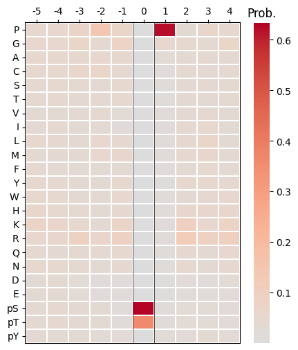
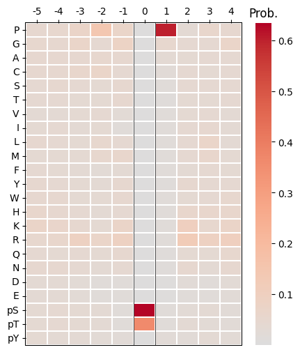
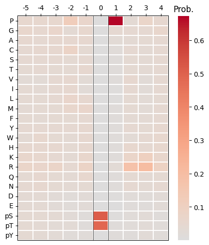
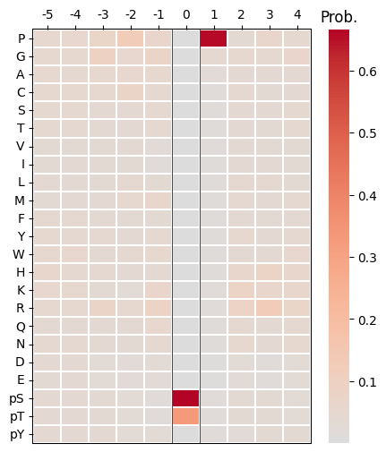

# Predict


<!-- WARNING: THIS FILE WAS AUTOGENERATED! DO NOT EDIT! -->

``` python
import pandas as pd
from katlas.train import *
from katlas.dnn import *
from fastai.vision.all import *
from katlas.pssm import *
```

``` python
pspa_unk = pd.read_parquet('raw/kd_similar_pspa.parquet')
pspa_unk = pspa_unk[pspa_unk.within_threshold].copy()
```

``` python
len(pspa_unk)
```

    1230

``` python
# from katlas.data import *

# kd = Data.get_kd_uniprot()
```

``` python
t5 = pd.read_parquet('raw/t5_kd.parquet')
```

``` python
test_pspa = t5.loc[pspa_unk.index].reset_index()
```

## Predict

``` python
sample=pd.read_parquet('train/pspa_t5.parquet')
```

``` python
target_col = sample.columns[~sample.columns.str.startswith('T5')]
```

``` python
target_col
```

    Index(['-5P', '-4P', '-3P', '-2P', '-1P', '0P', '1P', '2P', '3P', '4P',
           ...
           '-5pY', '-4pY', '-3pY', '-2pY', '-1pY', '0pY', '1pY', '2pY', '3pY',
           '4pY'],
          dtype='object', length=230)

``` python
feat_col = test_pspa.columns[1:]
```

``` python
feat_col
```

    Index(['T5_0', 'T5_1', 'T5_2', 'T5_3', 'T5_4', 'T5_5', 'T5_6', 'T5_7', 'T5_8',
           'T5_9',
           ...
           'T5_1014', 'T5_1015', 'T5_1016', 'T5_1017', 'T5_1018', 'T5_1019',
           'T5_1020', 'T5_1021', 'T5_1022', 'T5_1023'],
          dtype='object', length=1024)

``` python
n_feature = len(feat_col)
n_target = len(target_col)
```

``` python
n_feature,n_target
```

    (1024, 230)

``` python
def get_cnn(): return PSSM_model(n_feature,n_target,model='CNN')
```

``` python
from tqdm import tqdm
```

``` python
def get_ensemble_pred(test_df, model_name,nfold=5):
    ensemble = None
    for i in tqdm(range(nfold)):
        test_pred = predict_dl(test_df, 
                   feat_col, 
                   target_col,
                   model_func=get_cnn, # model architecture
                   model_pth=f'{model_name}_fold{i}', # only name, not with .pth
                  )
        if ensemble is None:
            ensemble = test_pred.copy()   # start with first prediction
        else:
            ensemble += test_pred         # accumulate
    
    ensemble /= 5
    return ensemble
```

``` python
pred = get_ensemble_pred(test_pspa,'cnn_pspa')
```

    100%|████████████████████████████████████████████████████████████████████████████████████████████████| 5/5 [00:05<00:00,  1.16s/it]

``` python
pred.index=pspa_unk.index
```

``` python
pred.to_parquet('raw/pred_new_pspa.parquet')
```

``` python
pred
```

<div>
<style scoped>
    .dataframe tbody tr th:only-of-type {
        vertical-align: middle;
    }
&#10;    .dataframe tbody tr th {
        vertical-align: top;
    }
&#10;    .dataframe thead th {
        text-align: right;
    }
</style>

<table class="dataframe" data-quarto-postprocess="true" data-border="1">
<thead>
<tr style="text-align: right;">
<th data-quarto-table-cell-role="th"></th>
<th data-quarto-table-cell-role="th">-5P</th>
<th data-quarto-table-cell-role="th">-4P</th>
<th data-quarto-table-cell-role="th">-3P</th>
<th data-quarto-table-cell-role="th">-2P</th>
<th data-quarto-table-cell-role="th">-1P</th>
<th data-quarto-table-cell-role="th">0P</th>
<th data-quarto-table-cell-role="th">1P</th>
<th data-quarto-table-cell-role="th">2P</th>
<th data-quarto-table-cell-role="th">3P</th>
<th data-quarto-table-cell-role="th">4P</th>
<th data-quarto-table-cell-role="th">...</th>
<th data-quarto-table-cell-role="th">-5pY</th>
<th data-quarto-table-cell-role="th">-4pY</th>
<th data-quarto-table-cell-role="th">-3pY</th>
<th data-quarto-table-cell-role="th">-2pY</th>
<th data-quarto-table-cell-role="th">-1pY</th>
<th data-quarto-table-cell-role="th">0pY</th>
<th data-quarto-table-cell-role="th">1pY</th>
<th data-quarto-table-cell-role="th">2pY</th>
<th data-quarto-table-cell-role="th">3pY</th>
<th data-quarto-table-cell-role="th">4pY</th>
</tr>
</thead>
<tbody>
<tr>
<td data-quarto-table-cell-role="th">A0A8I3S724_AURKA_CANLF_KD1</td>
<td>0.037882</td>
<td>0.043779</td>
<td>0.047041</td>
<td>0.015380</td>
<td>0.041898</td>
<td>0.000035</td>
<td>0.014323</td>
<td>0.038704</td>
<td>0.043827</td>
<td>0.049526</td>
<td>...</td>
<td>0.044010</td>
<td>0.040576</td>
<td>0.037645</td>
<td>0.013764</td>
<td>0.059714</td>
<td>3.364276e-06</td>
<td>0.038454</td>
<td>0.043046</td>
<td>0.061429</td>
<td>0.046730</td>
</tr>
<tr>
<td data-quarto-table-cell-role="th">A0A8I5ZNK2_OXSR1_RAT_KD1</td>
<td>0.049239</td>
<td>0.043381</td>
<td>0.043311</td>
<td>0.028526</td>
<td>0.024280</td>
<td>0.000017</td>
<td>0.015904</td>
<td>0.036569</td>
<td>0.055815</td>
<td>0.055253</td>
<td>...</td>
<td>0.056746</td>
<td>0.050559</td>
<td>0.046230</td>
<td>0.048480</td>
<td>0.063029</td>
<td>1.908836e-06</td>
<td>0.024791</td>
<td>0.022593</td>
<td>0.038125</td>
<td>0.032603</td>
</tr>
<tr>
<td data-quarto-table-cell-role="th">A0JM20_TYRO3_XENTR_KD1</td>
<td>0.051376</td>
<td>0.052102</td>
<td>0.052074</td>
<td>0.052638</td>
<td>0.039458</td>
<td>0.000007</td>
<td>0.014260</td>
<td>0.036449</td>
<td>0.041221</td>
<td>0.043479</td>
<td>...</td>
<td>0.047453</td>
<td>0.048676</td>
<td>0.052394</td>
<td>0.046324</td>
<td>0.091800</td>
<td>9.998582e-01</td>
<td>0.070185</td>
<td>0.070169</td>
<td>0.022106</td>
<td>0.042790</td>
</tr>
<tr>
<td data-quarto-table-cell-role="th">A0JNB0_FYN_BOVIN_KD1</td>
<td>0.046870</td>
<td>0.045461</td>
<td>0.040785</td>
<td>0.051638</td>
<td>0.031777</td>
<td>0.000042</td>
<td>0.014092</td>
<td>0.031362</td>
<td>0.044332</td>
<td>0.045642</td>
<td>...</td>
<td>0.053741</td>
<td>0.067277</td>
<td>0.067271</td>
<td>0.058158</td>
<td>0.079825</td>
<td>9.992056e-01</td>
<td>0.115731</td>
<td>0.104918</td>
<td>0.031915</td>
<td>0.042396</td>
</tr>
<tr>
<td data-quarto-table-cell-role="th">A0M8R7_MET_PAPAN_KD1</td>
<td>0.050430</td>
<td>0.051898</td>
<td>0.046124</td>
<td>0.052797</td>
<td>0.030787</td>
<td>0.000008</td>
<td>0.012470</td>
<td>0.035201</td>
<td>0.051783</td>
<td>0.045867</td>
<td>...</td>
<td>0.055322</td>
<td>0.063184</td>
<td>0.067201</td>
<td>0.055751</td>
<td>0.128271</td>
<td>9.998606e-01</td>
<td>0.096431</td>
<td>0.081910</td>
<td>0.025833</td>
<td>0.041041</td>
</tr>
<tr>
<td data-quarto-table-cell-role="th">...</td>
<td>...</td>
<td>...</td>
<td>...</td>
<td>...</td>
<td>...</td>
<td>...</td>
<td>...</td>
<td>...</td>
<td>...</td>
<td>...</td>
<td>...</td>
<td>...</td>
<td>...</td>
<td>...</td>
<td>...</td>
<td>...</td>
<td>...</td>
<td>...</td>
<td>...</td>
<td>...</td>
<td>...</td>
</tr>
<tr>
<td data-quarto-table-cell-role="th">Q9Z2R9_E2AK1_MOUSE_KD1</td>
<td>0.034602</td>
<td>0.038246</td>
<td>0.029201</td>
<td>0.018279</td>
<td>0.023267</td>
<td>0.000089</td>
<td>0.006634</td>
<td>0.026299</td>
<td>0.060636</td>
<td>0.040961</td>
<td>...</td>
<td>0.036762</td>
<td>0.033087</td>
<td>0.052582</td>
<td>0.034784</td>
<td>0.052302</td>
<td>4.450690e-07</td>
<td>0.022007</td>
<td>0.019414</td>
<td>0.033284</td>
<td>0.040663</td>
</tr>
<tr>
<td data-quarto-table-cell-role="th">Q9Z2W1_STK25_MOUSE_KD1</td>
<td>0.045502</td>
<td>0.040996</td>
<td>0.040295</td>
<td>0.032663</td>
<td>0.030100</td>
<td>0.000020</td>
<td>0.017534</td>
<td>0.042085</td>
<td>0.043391</td>
<td>0.050217</td>
<td>...</td>
<td>0.042046</td>
<td>0.036751</td>
<td>0.047517</td>
<td>0.044899</td>
<td>0.036057</td>
<td>3.428805e-06</td>
<td>0.019266</td>
<td>0.016506</td>
<td>0.029094</td>
<td>0.024208</td>
</tr>
<tr>
<td data-quarto-table-cell-role="th">Q9Z335_SBK1_RAT_KD1</td>
<td>0.040285</td>
<td>0.027252</td>
<td>0.026376</td>
<td>0.035437</td>
<td>0.108038</td>
<td>0.000049</td>
<td>0.061123</td>
<td>0.050412</td>
<td>0.066567</td>
<td>0.059834</td>
<td>...</td>
<td>0.026251</td>
<td>0.025690</td>
<td>0.013364</td>
<td>0.027668</td>
<td>0.028979</td>
<td>1.546801e-06</td>
<td>0.043730</td>
<td>0.041582</td>
<td>0.060285</td>
<td>0.045016</td>
</tr>
<tr>
<td data-quarto-table-cell-role="th">W0LYS5_CAMKI_MACNP_KD1</td>
<td>0.049159</td>
<td>0.035515</td>
<td>0.025772</td>
<td>0.020806</td>
<td>0.057251</td>
<td>0.000065</td>
<td>0.014600</td>
<td>0.028858</td>
<td>0.027823</td>
<td>0.049323</td>
<td>...</td>
<td>0.028890</td>
<td>0.024585</td>
<td>0.017603</td>
<td>0.015780</td>
<td>0.031326</td>
<td>4.352188e-06</td>
<td>0.035301</td>
<td>0.101816</td>
<td>0.042666</td>
<td>0.032528</td>
</tr>
<tr>
<td data-quarto-table-cell-role="th">X5M5N0_WNK_CAEEL_KD1</td>
<td>0.038345</td>
<td>0.037591</td>
<td>0.039816</td>
<td>0.043162</td>
<td>0.025581</td>
<td>0.000033</td>
<td>0.016244</td>
<td>0.033651</td>
<td>0.038988</td>
<td>0.045358</td>
<td>...</td>
<td>0.037754</td>
<td>0.033027</td>
<td>0.036153</td>
<td>0.035582</td>
<td>0.047813</td>
<td>1.219898e-05</td>
<td>0.028811</td>
<td>0.033507</td>
<td>0.038083</td>
<td>0.036475</td>
</tr>
</tbody>
</table>

<p>1230 rows × 230 columns</p>
</div>

## test

``` python
cdks = pspa_unk[pspa_unk.closest_pos_index.str.contains('CDK')]
```

``` python
for i in cdks.head(5).index:
    plot_heatmap(recover_pssm(pred.loc[i]))
    plt.show()
    plt.close()
```









