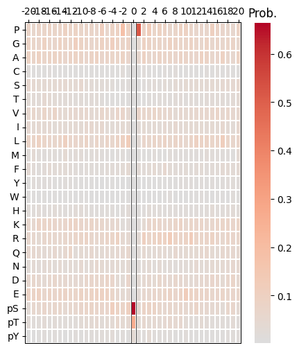
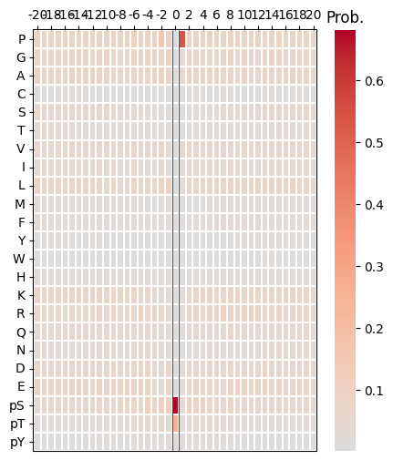
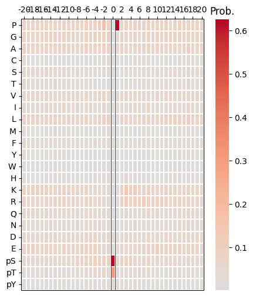
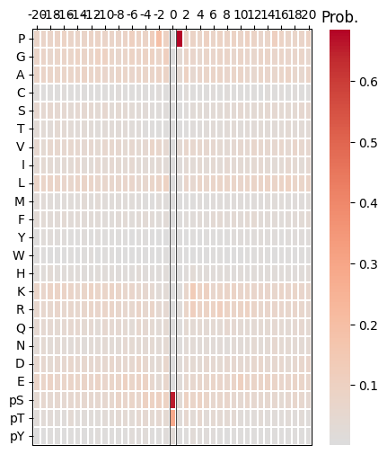

# Predict


<!-- WARNING: THIS FILE WAS AUTOGENERATED! DO NOT EDIT! -->

``` python
import pandas as pd
from katlas.train import *
from katlas.dnn import *
from fastai.vision.all import *
from katlas.pssm import *
```

``` python
cddm_unk = pd.read_parquet('raw/kd_similar_cddm.parquet')
```

``` python
cddm_unk = cddm_unk[cddm_unk.within_threshold].copy()
```

``` python
# from katlas.data import *

# kd = Data.get_kd_uniprot()
```

``` python
t5 = pd.read_parquet('raw/t5_kd.parquet')
```

``` python
test_cddm = t5.loc[cddm_unk.index].reset_index()
```

## Predict

``` python
sample=pd.read_parquet('train/cddm_t5.parquet')
```

``` python
target_col = sample.columns[~sample.columns.str.startswith('T5')]
```

``` python
target_col
```

    Index(['-20P', '-19P', '-18P', '-17P', '-16P', '-15P', '-14P', '-13P', '-12P',
           '-11P',
           ...
           '11pY', '12pY', '13pY', '14pY', '15pY', '16pY', '17pY', '18pY', '19pY',
           '20pY'],
          dtype='object', length=943)

``` python
feat_col = test_cddm.columns[1:]
```

``` python
feat_col
```

    Index(['T5_0', 'T5_1', 'T5_2', 'T5_3', 'T5_4', 'T5_5', 'T5_6', 'T5_7', 'T5_8',
           'T5_9',
           ...
           'T5_1014', 'T5_1015', 'T5_1016', 'T5_1017', 'T5_1018', 'T5_1019',
           'T5_1020', 'T5_1021', 'T5_1022', 'T5_1023'],
          dtype='object', length=1024)

``` python
n_feature = len(feat_col)
n_target = len(target_col)
```

``` python
n_feature,n_target
```

    (1024, 943)

``` python
def get_cnn(): return PSSM_model(n_feature,n_target,model='CNN')
```

``` python
from tqdm import tqdm
```

``` python
def get_ensemble_pred(test_df, model_name,nfold=5):
    ensemble = None
    for i in tqdm(range(nfold)):
        test_pred = predict_dl(test_df, 
                   feat_col, 
                   target_col,
                   model_func=get_cnn, # model architecture
                   model_pth=f'{model_name}_fold{i}', # only name, not with .pth
                  )
        if ensemble is None:
            ensemble = test_pred.copy()   # start with first prediction
        else:
            ensemble += test_pred         # accumulate
    
    ensemble /= 5
    return ensemble
```

``` python
pred = get_ensemble_pred(test_cddm,'cnn_cddm')
```

    100%|████████████████████████████████████████████████████████████████████████████████████████████████| 5/5 [00:09<00:00,  1.89s/it]

``` python
pred.index=cddm_unk.index
```

``` python
pred.to_parquet('raw/pred_new_cddm.parquet')
```

``` python
pred
```

<div>
<style scoped>
    .dataframe tbody tr th:only-of-type {
        vertical-align: middle;
    }
&#10;    .dataframe tbody tr th {
        vertical-align: top;
    }
&#10;    .dataframe thead th {
        text-align: right;
    }
</style>

<table class="dataframe" data-quarto-postprocess="true" data-border="1">
<thead>
<tr style="text-align: right;">
<th data-quarto-table-cell-role="th"></th>
<th data-quarto-table-cell-role="th">-20P</th>
<th data-quarto-table-cell-role="th">-19P</th>
<th data-quarto-table-cell-role="th">-18P</th>
<th data-quarto-table-cell-role="th">-17P</th>
<th data-quarto-table-cell-role="th">-16P</th>
<th data-quarto-table-cell-role="th">-15P</th>
<th data-quarto-table-cell-role="th">-14P</th>
<th data-quarto-table-cell-role="th">-13P</th>
<th data-quarto-table-cell-role="th">-12P</th>
<th data-quarto-table-cell-role="th">-11P</th>
<th data-quarto-table-cell-role="th">...</th>
<th data-quarto-table-cell-role="th">11pY</th>
<th data-quarto-table-cell-role="th">12pY</th>
<th data-quarto-table-cell-role="th">13pY</th>
<th data-quarto-table-cell-role="th">14pY</th>
<th data-quarto-table-cell-role="th">15pY</th>
<th data-quarto-table-cell-role="th">16pY</th>
<th data-quarto-table-cell-role="th">17pY</th>
<th data-quarto-table-cell-role="th">18pY</th>
<th data-quarto-table-cell-role="th">19pY</th>
<th data-quarto-table-cell-role="th">20pY</th>
</tr>
</thead>
<tbody>
<tr>
<td data-quarto-table-cell-role="th">A0A8I3S724_AURKA_CANLF_KD1</td>
<td>0.058566</td>
<td>0.047093</td>
<td>0.038226</td>
<td>0.060463</td>
<td>0.059130</td>
<td>0.054548</td>
<td>0.054172</td>
<td>0.049232</td>
<td>0.047558</td>
<td>0.059301</td>
<td>...</td>
<td>0.011735</td>
<td>0.011759</td>
<td>0.015638</td>
<td>0.011591</td>
<td>0.011264</td>
<td>0.015564</td>
<td>0.016801</td>
<td>0.013457</td>
<td>0.016039</td>
<td>0.015655</td>
</tr>
<tr>
<td data-quarto-table-cell-role="th">A0A8I5ZNK2_OXSR1_RAT_KD1</td>
<td>0.062874</td>
<td>0.044732</td>
<td>0.037693</td>
<td>0.069321</td>
<td>0.069203</td>
<td>0.048762</td>
<td>0.055191</td>
<td>0.046259</td>
<td>0.054198</td>
<td>0.052150</td>
<td>...</td>
<td>0.009368</td>
<td>0.014231</td>
<td>0.010534</td>
<td>0.009535</td>
<td>0.007872</td>
<td>0.018224</td>
<td>0.026171</td>
<td>0.012271</td>
<td>0.011304</td>
<td>0.023689</td>
</tr>
<tr>
<td data-quarto-table-cell-role="th">A0JM20_TYRO3_XENTR_KD1</td>
<td>0.043008</td>
<td>0.046507</td>
<td>0.053662</td>
<td>0.055524</td>
<td>0.040229</td>
<td>0.046882</td>
<td>0.063473</td>
<td>0.061160</td>
<td>0.048801</td>
<td>0.045304</td>
<td>...</td>
<td>0.013642</td>
<td>0.019686</td>
<td>0.012491</td>
<td>0.010734</td>
<td>0.012548</td>
<td>0.011841</td>
<td>0.014706</td>
<td>0.006341</td>
<td>0.018013</td>
<td>0.015684</td>
</tr>
<tr>
<td data-quarto-table-cell-role="th">A0JNB0_FYN_BOVIN_KD1</td>
<td>0.045568</td>
<td>0.047251</td>
<td>0.050904</td>
<td>0.050163</td>
<td>0.047431</td>
<td>0.048869</td>
<td>0.060826</td>
<td>0.054838</td>
<td>0.052466</td>
<td>0.041447</td>
<td>...</td>
<td>0.015842</td>
<td>0.020160</td>
<td>0.014444</td>
<td>0.012258</td>
<td>0.011229</td>
<td>0.013144</td>
<td>0.014181</td>
<td>0.007040</td>
<td>0.017035</td>
<td>0.017139</td>
</tr>
<tr>
<td data-quarto-table-cell-role="th">A0M8R7_MET_PAPAN_KD1</td>
<td>0.042183</td>
<td>0.045986</td>
<td>0.049634</td>
<td>0.047944</td>
<td>0.040924</td>
<td>0.046336</td>
<td>0.061326</td>
<td>0.060749</td>
<td>0.046776</td>
<td>0.042471</td>
<td>...</td>
<td>0.014246</td>
<td>0.020650</td>
<td>0.013831</td>
<td>0.011233</td>
<td>0.012048</td>
<td>0.012316</td>
<td>0.014068</td>
<td>0.006437</td>
<td>0.017606</td>
<td>0.016929</td>
</tr>
<tr>
<td data-quarto-table-cell-role="th">...</td>
<td>...</td>
<td>...</td>
<td>...</td>
<td>...</td>
<td>...</td>
<td>...</td>
<td>...</td>
<td>...</td>
<td>...</td>
<td>...</td>
<td>...</td>
<td>...</td>
<td>...</td>
<td>...</td>
<td>...</td>
<td>...</td>
<td>...</td>
<td>...</td>
<td>...</td>
<td>...</td>
<td>...</td>
</tr>
<tr>
<td data-quarto-table-cell-role="th">Q9Z2B9_KS6A4_MOUSE_KD1</td>
<td>0.062978</td>
<td>0.046201</td>
<td>0.043306</td>
<td>0.047586</td>
<td>0.060256</td>
<td>0.057318</td>
<td>0.069925</td>
<td>0.054924</td>
<td>0.057089</td>
<td>0.056542</td>
<td>...</td>
<td>0.009725</td>
<td>0.009109</td>
<td>0.013359</td>
<td>0.011704</td>
<td>0.007290</td>
<td>0.015323</td>
<td>0.023502</td>
<td>0.008287</td>
<td>0.016022</td>
<td>0.014946</td>
</tr>
<tr>
<td data-quarto-table-cell-role="th">Q9Z2G7_GRK7_ICTTR_KD1</td>
<td>0.069125</td>
<td>0.050716</td>
<td>0.028324</td>
<td>0.078284</td>
<td>0.088472</td>
<td>0.043415</td>
<td>0.070791</td>
<td>0.038503</td>
<td>0.033959</td>
<td>0.072650</td>
<td>...</td>
<td>0.007297</td>
<td>0.005966</td>
<td>0.006196</td>
<td>0.012518</td>
<td>0.006082</td>
<td>0.022531</td>
<td>0.026919</td>
<td>0.019598</td>
<td>0.009070</td>
<td>0.015517</td>
</tr>
<tr>
<td data-quarto-table-cell-role="th">Q9Z2R9_E2AK1_MOUSE_KD1</td>
<td>0.052221</td>
<td>0.055948</td>
<td>0.027863</td>
<td>0.051704</td>
<td>0.028007</td>
<td>0.048318</td>
<td>0.038666</td>
<td>0.040143</td>
<td>0.050289</td>
<td>0.033800</td>
<td>...</td>
<td>0.007105</td>
<td>0.004360</td>
<td>0.002075</td>
<td>0.015135</td>
<td>0.002591</td>
<td>0.014851</td>
<td>0.005058</td>
<td>0.013597</td>
<td>0.005913</td>
<td>0.015426</td>
</tr>
<tr>
<td data-quarto-table-cell-role="th">Q9Z2W1_STK25_MOUSE_KD1</td>
<td>0.053220</td>
<td>0.045374</td>
<td>0.031947</td>
<td>0.051374</td>
<td>0.052299</td>
<td>0.055456</td>
<td>0.054058</td>
<td>0.051449</td>
<td>0.048602</td>
<td>0.050390</td>
<td>...</td>
<td>0.010350</td>
<td>0.012648</td>
<td>0.010529</td>
<td>0.008406</td>
<td>0.008619</td>
<td>0.020545</td>
<td>0.017907</td>
<td>0.013738</td>
<td>0.011008</td>
<td>0.021155</td>
</tr>
<tr>
<td data-quarto-table-cell-role="th">W0LYS5_CAMKI_MACNP_KD1</td>
<td>0.075941</td>
<td>0.072653</td>
<td>0.044654</td>
<td>0.047528</td>
<td>0.066485</td>
<td>0.048711</td>
<td>0.076716</td>
<td>0.036033</td>
<td>0.064526</td>
<td>0.062745</td>
<td>...</td>
<td>0.012258</td>
<td>0.011500</td>
<td>0.007500</td>
<td>0.017919</td>
<td>0.009034</td>
<td>0.013052</td>
<td>0.025094</td>
<td>0.009916</td>
<td>0.012742</td>
<td>0.014000</td>
</tr>
</tbody>
</table>

<p>1195 rows × 943 columns</p>
</div>

## test

``` python
cdks = cddm_unk[cddm_unk.closest_pos_index.str.contains('CDK')]
```

``` python
for i in cdks.head(5).index:
    print(i)
    plot_heatmap(recover_pssm(pred.loc[i]))
    plt.show()
    plt.close()
```

    B2MVY4_CDK4_SHEEP_KD1



    O35831_CDK17_RAT_KD1



    O55076_CDK2_CRIGR_KD1



    P11440_CDK1_MOUSE_KD1



    P13863_CDK1_CHICK_KD1


