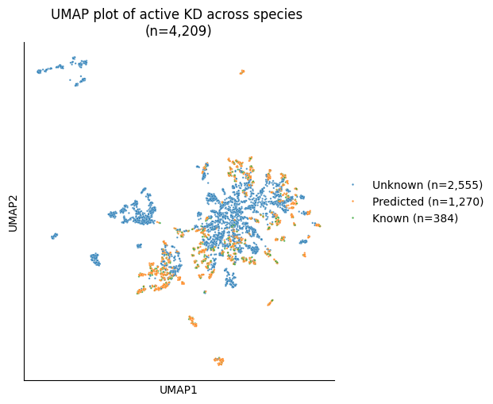

# Plot UMAP of known & unknown KD


<!-- WARNING: THIS FILE WAS AUTOGENERATED! DO NOT EDIT! -->

``` python
import pandas as pd
from katlas.train import *
from katlas.dnn import *
from fastai.vision.all import *
from katlas.pssm import *
```

``` python
from katlas.data import *
```

``` python
kd = Data.get_kd_uniprot()
```

    ⬇️ Downloading katlas_dataset.zip ...

    Downloading...
    From (original): https://drive.google.com/uc?id=17wIl0DbdoHV036Z3xgaT_0H3LlM_W47l
    From (redirected): https://drive.google.com/uc?id=17wIl0DbdoHV036Z3xgaT_0H3LlM_W47l&confirm=t&uuid=503c31e6-5e12-424b-86bf-185b223d5cf8
    To: /home/sky1ove/git/katlas-raw/nbs/kinase_domain/katlas_datasets.zip
    100%|███████████████████████████████████████████████████████████████████████████████████████████| 209M/209M [00:07<00:00, 26.4MB/s]

    📂 Extracting to /tmp/katlas_dataset ...
    🧹 Removing zip file: katlas_datasets.zip
    ✅ Done! Extracted dataset is at: /tmp/katlas_dataset

``` python
# filter out active motif
kd = kd[kd.active_D1_D2==1].reset_index(drop=True)
```

## Known kd_id

``` python
cddm_known = pd.read_parquet('train/cddm_t5.parquet')
pspa_known = pd.read_parquet('train/pspa_t5.parquet')
```

``` python
known_idx = set(cddm_known.index)|set(pspa_known.index)
```

``` python
len(known_idx)
```

    384

## Predicted kd_id

``` python
cddm_pred = pd.read_parquet('raw/pred_new_cddm.parquet')
pspa_pred = pd.read_parquet('raw/pred_new_pspa.parquet')
```

``` python
kd.shape
```

    (4209, 32)

``` python
cddm_pred.shape,pspa_pred.shape
```

    ((1195, 943), (1230, 230))

``` python
cddm_pred.index.isin(kd.kd_ID).sum()
```

    np.int64(1195)

``` python
pred_idx= set(cddm_pred.index)|set(pspa_pred.index)
```

``` python
len(pred_idx)
```

    1292

## Get UMAP embedding

``` python
from katlas.plot import *
```

``` python
t5 = pd.read_parquet('raw/t5_kd.parquet')
```

``` python
umap_df = reduce_feature(t5,method='umap',complexity=30,min_dist=0.6)
```

    /home/sky1ove/git/katlas/.venv/lib/python3.11/site-packages/logomaker/../umap/umap_.py:1952: UserWarning: n_jobs value 1 overridden to 1 by setting random_state. Use no seed for parallelism.
      warn(

``` python
info = pd.Series('Unknown', index=umap_df.index)
```

``` python
info.loc[umap_df.index.isin(pred_idx)] = 'Predicted'
info.loc[umap_df.index.isin(known_idx)] = 'Known'
```

``` python
cnts = info.value_counts()
info_labeled = info.map(lambda x: f"{x} (n={cnts[x]:,})")
```

``` python
info_labeled
```

    kd_ID
    A0A075F7E9_LERK1_ORYSI_KD1      Unknown (n=2,555)
    A0A078CGE6_M3KE1_BRANA_KD1      Unknown (n=2,555)
    A0A0K3AV08_MLK1_CAEEL_KD1       Unknown (n=2,555)
    A0A0P0VIP0_LRSK7_ORYSJ_KD1      Unknown (n=2,555)
    A0A0P0XII1_CERK1_ORYSJ_KD1      Unknown (n=2,555)
                                         ...         
    U4PR86_MELK_CAEEL_KD1           Unknown (n=2,555)
    W0LYS5_CAMKI_MACNP_KD1        Predicted (n=1,270)
    W0T9X4_ATG1_KLUMD_KD1           Unknown (n=2,555)
    W7JX98_KGP_PLAFO_KD1            Unknown (n=2,555)
    X5M5N0_WNK_CAEEL_KD1          Predicted (n=1,270)
    Length: 4209, dtype: object

Alternatively, use `np.select` to do the same thing:

``` python
# conditions = [
#     umap_df.index.isin(known_idx),
#     umap_df.index.isin(pred_idx),
# ]
# choices = ['Known', 'Predicted']
# out =np.select(conditions, choices, default='Unknown')
# pd.Series(out,index=umap_df.index)
```

## Plot 2D

``` python
len(umap_df)
```

    4209

``` python
plot_2d(umap_df,hue=info_labeled,s=3,legend=True,palette='tab10',legend_title='')
plt.title('UMAP plot of active KD across species \n(n=4,209)')
save_svg('fig/umap_kd_known_unknown.svg')
```


