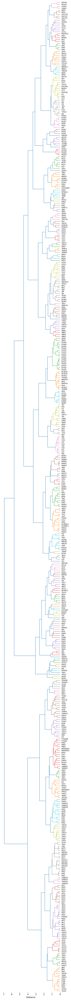

# Kinase T5 hierarchy


<!-- WARNING: THIS FILE WAS AUTOGENERATED! DO NOT EDIT! -->

``` python
from katlas.clustering import *
from katlas.data import *
from katlas.feature import *
from katlas.plot import *

import pandas as pd, numpy as np
```

``` python
info=Data.get_kinase_info()
```

``` python
info.shape
```

    (523, 36)

``` python
info.columns
```

    Index(['kinase', 'ID_coral', 'uniprot', 'gene', 'modi_group', 'group',
           'family', 'subfamily_coral', 'subfamily', 'in_pspa_st', 'in_pspa_tyr',
           'in_pspa', 'in_cddm', 'kd_ID', 'active_D1_D2', 'active_kd_ID',
           'pspa_ID', 'pseudo', 'pspa_category_small', 'pspa_category_big',
           'cddm_big', 'cddm_small', 'length', 'human_uniprot_sequence',
           'kinasecom_domain', 'nucleus', 'cytosol', 'cytoskeleton',
           'plasma membrane', 'mitochondrion', 'Golgi apparatus',
           'endoplasmic reticulum', 'vesicle', 'centrosome', 'aggresome',
           'main_location'],
          dtype='object')

``` python
info=info[info.human_uniprot_sequence.str.len()<5000]
```

``` python
info = info[~info.kinase.str.contains('_b|_2')].reset_index(drop=True)
```

``` python
info[info.human_uniprot_sequence.duplicated(keep=False)]
```

<div>
<style scoped>
    .dataframe tbody tr th:only-of-type {
        vertical-align: middle;
    }
&#10;    .dataframe tbody tr th {
        vertical-align: top;
    }
&#10;    .dataframe thead th {
        text-align: right;
    }
</style>

<table class="dataframe" data-quarto-postprocess="true" data-border="1">
<thead>
<tr style="text-align: right;">
<th data-quarto-table-cell-role="th"></th>
<th data-quarto-table-cell-role="th">kinase</th>
<th data-quarto-table-cell-role="th">ID_coral</th>
<th data-quarto-table-cell-role="th">uniprot</th>
<th data-quarto-table-cell-role="th">gene</th>
<th data-quarto-table-cell-role="th">modi_group</th>
<th data-quarto-table-cell-role="th">group</th>
<th data-quarto-table-cell-role="th">family</th>
<th data-quarto-table-cell-role="th">subfamily_coral</th>
<th data-quarto-table-cell-role="th">subfamily</th>
<th data-quarto-table-cell-role="th">in_pspa_st</th>
<th data-quarto-table-cell-role="th">...</th>
<th data-quarto-table-cell-role="th">cytosol</th>
<th data-quarto-table-cell-role="th">cytoskeleton</th>
<th data-quarto-table-cell-role="th">plasma membrane</th>
<th data-quarto-table-cell-role="th">mitochondrion</th>
<th data-quarto-table-cell-role="th">Golgi apparatus</th>
<th data-quarto-table-cell-role="th">endoplasmic reticulum</th>
<th data-quarto-table-cell-role="th">vesicle</th>
<th data-quarto-table-cell-role="th">centrosome</th>
<th data-quarto-table-cell-role="th">aggresome</th>
<th data-quarto-table-cell-role="th">main_location</th>
</tr>
</thead>
<tbody>
</tbody>
</table>

<p>0 rows × 36 columns</p>
</div>

``` python
info.shape
```

    (507, 36)

## T5 embeddings

``` python
feature = get_t5(info,'human_uniprot_sequence')
```

    You are using the default legacy behaviour of the <class 'transformers.models.t5.tokenization_t5.T5Tokenizer'>. This is expected, and simply means that the `legacy` (previous) behavior will be used so nothing changes for you. If you want to use the new behaviour, set `legacy=False`. This should only be set if you understand what it means, and thoroughly read the reason why this was added as explained in https://github.com/huggingface/transformers/pull/24565

      0%|          | 0/507 [00:00<?, ?it/s]

``` python
feature.index=info.kinase
```

``` python
feature
```

    /home/sky1ove/git/katlas/.venv/lib/python3.11/site-packages/pandas/io/formats/format.py:1458: RuntimeWarning: overflow encountered in cast
      has_large_values = (abs_vals > 1e6).any()
    /home/sky1ove/git/katlas/.venv/lib/python3.11/site-packages/pandas/io/formats/format.py:1458: RuntimeWarning: overflow encountered in cast
      has_large_values = (abs_vals > 1e6).any()

<div>
<style scoped>
    .dataframe tbody tr th:only-of-type {
        vertical-align: middle;
    }
&#10;    .dataframe tbody tr th {
        vertical-align: top;
    }
&#10;    .dataframe thead th {
        text-align: right;
    }
</style>

<table class="dataframe" data-quarto-postprocess="true" data-border="1">
<thead>
<tr style="text-align: right;">
<th data-quarto-table-cell-role="th"></th>
<th data-quarto-table-cell-role="th">T5_0</th>
<th data-quarto-table-cell-role="th">T5_1</th>
<th data-quarto-table-cell-role="th">T5_2</th>
<th data-quarto-table-cell-role="th">T5_3</th>
<th data-quarto-table-cell-role="th">T5_4</th>
<th data-quarto-table-cell-role="th">T5_5</th>
<th data-quarto-table-cell-role="th">T5_6</th>
<th data-quarto-table-cell-role="th">T5_7</th>
<th data-quarto-table-cell-role="th">T5_8</th>
<th data-quarto-table-cell-role="th">T5_9</th>
<th data-quarto-table-cell-role="th">...</th>
<th data-quarto-table-cell-role="th">T5_1014</th>
<th data-quarto-table-cell-role="th">T5_1015</th>
<th data-quarto-table-cell-role="th">T5_1016</th>
<th data-quarto-table-cell-role="th">T5_1017</th>
<th data-quarto-table-cell-role="th">T5_1018</th>
<th data-quarto-table-cell-role="th">T5_1019</th>
<th data-quarto-table-cell-role="th">T5_1020</th>
<th data-quarto-table-cell-role="th">T5_1021</th>
<th data-quarto-table-cell-role="th">T5_1022</th>
<th data-quarto-table-cell-role="th">T5_1023</th>
</tr>
<tr>
<th data-quarto-table-cell-role="th">kinase</th>
<th data-quarto-table-cell-role="th"></th>
<th data-quarto-table-cell-role="th"></th>
<th data-quarto-table-cell-role="th"></th>
<th data-quarto-table-cell-role="th"></th>
<th data-quarto-table-cell-role="th"></th>
<th data-quarto-table-cell-role="th"></th>
<th data-quarto-table-cell-role="th"></th>
<th data-quarto-table-cell-role="th"></th>
<th data-quarto-table-cell-role="th"></th>
<th data-quarto-table-cell-role="th"></th>
<th data-quarto-table-cell-role="th"></th>
<th data-quarto-table-cell-role="th"></th>
<th data-quarto-table-cell-role="th"></th>
<th data-quarto-table-cell-role="th"></th>
<th data-quarto-table-cell-role="th"></th>
<th data-quarto-table-cell-role="th"></th>
<th data-quarto-table-cell-role="th"></th>
<th data-quarto-table-cell-role="th"></th>
<th data-quarto-table-cell-role="th"></th>
<th data-quarto-table-cell-role="th"></th>
<th data-quarto-table-cell-role="th"></th>
</tr>
</thead>
<tbody>
<tr>
<td data-quarto-table-cell-role="th">AAK1</td>
<td>0.056274</td>
<td>0.066528</td>
<td>0.077576</td>
<td>0.010185</td>
<td>-0.030762</td>
<td>0.044861</td>
<td>-0.051788</td>
<td>-0.030167</td>
<td>0.010437</td>
<td>-0.007874</td>
<td>...</td>
<td>-0.041718</td>
<td>-0.077393</td>
<td>-0.023361</td>
<td>0.012962</td>
<td>0.071716</td>
<td>0.008446</td>
<td>-0.071045</td>
<td>0.019363</td>
<td>-0.003197</td>
<td>-0.012413</td>
</tr>
<tr>
<td data-quarto-table-cell-role="th">AATK</td>
<td>-0.001738</td>
<td>-0.028183</td>
<td>0.055511</td>
<td>-0.012909</td>
<td>-0.004894</td>
<td>0.032166</td>
<td>-0.033936</td>
<td>-0.048676</td>
<td>0.076843</td>
<td>0.034058</td>
<td>...</td>
<td>-0.000751</td>
<td>-0.036194</td>
<td>-0.026352</td>
<td>-0.017014</td>
<td>0.009399</td>
<td>0.035736</td>
<td>0.017212</td>
<td>-0.013489</td>
<td>0.022949</td>
<td>0.079773</td>
</tr>
<tr>
<td data-quarto-table-cell-role="th">ABL1</td>
<td>0.009750</td>
<td>0.011368</td>
<td>0.031204</td>
<td>-0.000709</td>
<td>0.005157</td>
<td>0.050629</td>
<td>-0.024017</td>
<td>-0.036987</td>
<td>0.051483</td>
<td>-0.007980</td>
<td>...</td>
<td>-0.014618</td>
<td>-0.024673</td>
<td>-0.048248</td>
<td>-0.004753</td>
<td>0.032166</td>
<td>0.025558</td>
<td>0.004871</td>
<td>0.044006</td>
<td>0.001851</td>
<td>0.019043</td>
</tr>
<tr>
<td data-quarto-table-cell-role="th">ABL2</td>
<td>0.008217</td>
<td>0.000241</td>
<td>0.022705</td>
<td>0.001262</td>
<td>-0.000204</td>
<td>0.052795</td>
<td>-0.032806</td>
<td>-0.038849</td>
<td>0.049347</td>
<td>-0.011520</td>
<td>...</td>
<td>-0.002037</td>
<td>-0.031036</td>
<td>-0.051117</td>
<td>-0.022949</td>
<td>0.030548</td>
<td>0.041412</td>
<td>0.009804</td>
<td>0.040649</td>
<td>0.008743</td>
<td>0.020920</td>
</tr>
<tr>
<td data-quarto-table-cell-role="th">ACVR1C</td>
<td>0.034943</td>
<td>0.098511</td>
<td>0.053558</td>
<td>0.030258</td>
<td>-0.021255</td>
<td>0.037415</td>
<td>-0.036346</td>
<td>-0.066162</td>
<td>0.010223</td>
<td>0.014893</td>
<td>...</td>
<td>-0.046600</td>
<td>-0.028793</td>
<td>-0.036743</td>
<td>-0.018906</td>
<td>0.032532</td>
<td>-0.008156</td>
<td>-0.035187</td>
<td>-0.028793</td>
<td>-0.036469</td>
<td>-0.001018</td>
</tr>
<tr>
<td data-quarto-table-cell-role="th">...</td>
<td>...</td>
<td>...</td>
<td>...</td>
<td>...</td>
<td>...</td>
<td>...</td>
<td>...</td>
<td>...</td>
<td>...</td>
<td>...</td>
<td>...</td>
<td>...</td>
<td>...</td>
<td>...</td>
<td>...</td>
<td>...</td>
<td>...</td>
<td>...</td>
<td>...</td>
<td>...</td>
<td>...</td>
</tr>
<tr>
<td data-quarto-table-cell-role="th">YES1</td>
<td>0.034882</td>
<td>0.097534</td>
<td>0.042877</td>
<td>0.006760</td>
<td>-0.010063</td>
<td>0.031708</td>
<td>-0.026627</td>
<td>-0.045990</td>
<td>-0.003342</td>
<td>-0.009605</td>
<td>...</td>
<td>-0.005806</td>
<td>-0.012741</td>
<td>-0.073730</td>
<td>-0.015350</td>
<td>0.057709</td>
<td>-0.006027</td>
<td>-0.010864</td>
<td>0.000340</td>
<td>-0.019440</td>
<td>-0.009087</td>
</tr>
<tr>
<td data-quarto-table-cell-role="th">YSK1</td>
<td>0.049072</td>
<td>0.081970</td>
<td>0.022079</td>
<td>0.004959</td>
<td>0.005402</td>
<td>0.022247</td>
<td>-0.024216</td>
<td>-0.041168</td>
<td>-0.027023</td>
<td>-0.015083</td>
<td>...</td>
<td>-0.042480</td>
<td>-0.012794</td>
<td>-0.062805</td>
<td>0.015465</td>
<td>0.053314</td>
<td>-0.032227</td>
<td>-0.030594</td>
<td>-0.006836</td>
<td>-0.013931</td>
<td>-0.002098</td>
</tr>
<tr>
<td data-quarto-table-cell-role="th">YSK4</td>
<td>0.020233</td>
<td>0.008957</td>
<td>-0.014725</td>
<td>0.008110</td>
<td>-0.047638</td>
<td>0.103333</td>
<td>-0.125122</td>
<td>-0.036072</td>
<td>0.096313</td>
<td>0.116821</td>
<td>...</td>
<td>-0.030411</td>
<td>0.026611</td>
<td>-0.003803</td>
<td>-0.117493</td>
<td>0.024155</td>
<td>0.078491</td>
<td>-0.027466</td>
<td>-0.031097</td>
<td>0.033295</td>
<td>0.031281</td>
</tr>
<tr>
<td data-quarto-table-cell-role="th">ZAK</td>
<td>0.018494</td>
<td>-0.002581</td>
<td>0.020844</td>
<td>0.016388</td>
<td>-0.000139</td>
<td>0.032074</td>
<td>-0.020218</td>
<td>-0.073669</td>
<td>0.009033</td>
<td>0.002945</td>
<td>...</td>
<td>-0.027176</td>
<td>-0.002493</td>
<td>-0.028015</td>
<td>-0.046295</td>
<td>0.044434</td>
<td>-0.014023</td>
<td>-0.022934</td>
<td>-0.014511</td>
<td>0.018829</td>
<td>-0.018219</td>
</tr>
<tr>
<td data-quarto-table-cell-role="th">ZAP70</td>
<td>-0.000020</td>
<td>0.044403</td>
<td>0.035492</td>
<td>0.002699</td>
<td>-0.034668</td>
<td>0.023911</td>
<td>-0.002527</td>
<td>-0.042755</td>
<td>0.017273</td>
<td>-0.028473</td>
<td>...</td>
<td>-0.009987</td>
<td>-0.017853</td>
<td>-0.021210</td>
<td>-0.037598</td>
<td>0.038208</td>
<td>0.014702</td>
<td>-0.008934</td>
<td>0.003305</td>
<td>-0.043549</td>
<td>0.002966</td>
</tr>
</tbody>
</table>

<p>507 rows × 1024 columns</p>
</div>

``` python
feature.to_parquet('raw/kinome_t5.parquet')
```

## Feature

``` python
feature = pd.read_parquet('raw/kinome_t5.parquet')
```

``` python
def euclidean_flat(a, b):
    """Compute Euclidean distance between two flattened arrays."""
    # a = np.ravel(a)
    # b = np.ravel(b)
    return np.linalg.norm(a - b)
```

``` python
Z = get_Z(feature,func_flat=euclidean_flat)
```

      0%|          | 0/128271 [00:00<?, ?it/s]

``` python
labels=feature.index
```

``` python
plot_dendrogram(Z,dense=6,labels=labels,color_thr=1.1)
save_svg('raw/kinase_hierarchy.svg')
```


