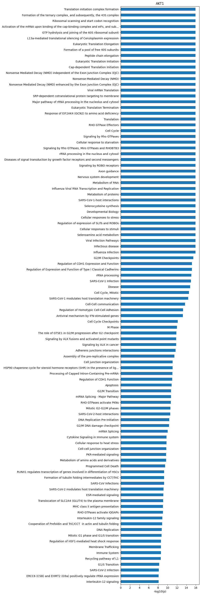

# Plot heatmap and logo of CDDM


<!-- WARNING: THIS FILE WAS AUTOGENERATED! DO NOT EDIT! -->

## Setup

``` python
import pandas as pd
import numpy as np
from katlas.data import *
from katlas.pssm import *
from katlas.utils import *
from katlas.plot import *
from katlas.feature import *
from matplotlib import pyplot as plt
import seaborn as sns
import math

from sklearn.cluster import KMeans
from pathlib import Path
from tqdm import tqdm
```

``` python
df = Data.get_ks_dataset()
```

    CPU times: user 737 ms, sys: 289 ms, total: 1.03 s
    Wall time: 6.98 s

``` python
df.head()
```

<div>
<style scoped>
    .dataframe tbody tr th:only-of-type {
        vertical-align: middle;
    }
&#10;    .dataframe tbody tr th {
        vertical-align: top;
    }
&#10;    .dataframe thead th {
        text-align: right;
    }
</style>

<table class="dataframe" data-quarto-postprocess="true" data-border="1">
<thead>
<tr style="text-align: right;">
<th data-quarto-table-cell-role="th"></th>
<th data-quarto-table-cell-role="th">kin_sub_site</th>
<th data-quarto-table-cell-role="th">kinase_uniprot</th>
<th data-quarto-table-cell-role="th">substrate_uniprot</th>
<th data-quarto-table-cell-role="th">site</th>
<th data-quarto-table-cell-role="th">source</th>
<th data-quarto-table-cell-role="th">substrate_genes</th>
<th data-quarto-table-cell-role="th">substrate_phosphoseq</th>
<th data-quarto-table-cell-role="th">position</th>
<th data-quarto-table-cell-role="th">site_seq</th>
<th data-quarto-table-cell-role="th">sub_site</th>
<th data-quarto-table-cell-role="th">...</th>
<th data-quarto-table-cell-role="th">kinase_on_tree</th>
<th data-quarto-table-cell-role="th">kinase_genes</th>
<th data-quarto-table-cell-role="th">kinase_protein</th>
<th data-quarto-table-cell-role="th">kinase_group</th>
<th data-quarto-table-cell-role="th">kinase_family</th>
<th data-quarto-table-cell-role="th">kinase_subfamily</th>
<th data-quarto-table-cell-role="th">kinase_pspa_big</th>
<th data-quarto-table-cell-role="th">kinase_pspa_small</th>
<th data-quarto-table-cell-role="th">kinase_coral_ID</th>
<th data-quarto-table-cell-role="th">num_kin</th>
</tr>
</thead>
<tbody>
<tr>
<td data-quarto-table-cell-role="th">0</td>
<td>O00141_A4FU28_S140</td>
<td>O00141</td>
<td>A4FU28</td>
<td>S140</td>
<td>Sugiyama</td>
<td>CTAGE9</td>
<td>MEEPGATPQPYLGLVLEELGRVVAALPESMRPDENPYGFPSELVVC...</td>
<td>140</td>
<td>AAAEEARSLEATCEKLSRsNsELEDEILCLEKDLKEEKSKH</td>
<td>A4FU28_S140</td>
<td>...</td>
<td>1</td>
<td>SGK1 SGK</td>
<td>SGK1</td>
<td>AGC</td>
<td>SGK</td>
<td>SGK</td>
<td>Basophilic</td>
<td>Akt/rock</td>
<td>SGK1</td>
<td>22</td>
</tr>
<tr>
<td data-quarto-table-cell-role="th">1</td>
<td>O00141_O00141_S252</td>
<td>O00141</td>
<td>O00141</td>
<td>S252</td>
<td>Sugiyama</td>
<td>SGK1 SGK</td>
<td>MTVKTEAAKGTLTYSRMRGMVAILIAFMKQRRMGLNDFIQKIANNS...</td>
<td>252</td>
<td>SQGHIVLTDFGLCKENIEHNsTtstFCGtPEyLAPEVLHKQ</td>
<td>O00141_S252</td>
<td>...</td>
<td>1</td>
<td>SGK1 SGK</td>
<td>SGK1</td>
<td>AGC</td>
<td>SGK</td>
<td>SGK</td>
<td>Basophilic</td>
<td>Akt/rock</td>
<td>SGK1</td>
<td>1</td>
</tr>
<tr>
<td data-quarto-table-cell-role="th">2</td>
<td>O00141_O00141_S255</td>
<td>O00141</td>
<td>O00141</td>
<td>S255</td>
<td>Sugiyama</td>
<td>SGK1 SGK</td>
<td>MTVKTEAAKGTLTYSRMRGMVAILIAFMKQRRMGLNDFIQKIANNS...</td>
<td>255</td>
<td>HIVLTDFGLCKENIEHNsTtstFCGtPEyLAPEVLHKQPYD</td>
<td>O00141_S255</td>
<td>...</td>
<td>1</td>
<td>SGK1 SGK</td>
<td>SGK1</td>
<td>AGC</td>
<td>SGK</td>
<td>SGK</td>
<td>Basophilic</td>
<td>Akt/rock</td>
<td>SGK1</td>
<td>1</td>
</tr>
<tr>
<td data-quarto-table-cell-role="th">3</td>
<td>O00141_O00141_S397</td>
<td>O00141</td>
<td>O00141</td>
<td>S397</td>
<td>Sugiyama</td>
<td>SGK1 SGK</td>
<td>MTVKTEAAKGTLTYSRMRGMVAILIAFMKQRRMGLNDFIQKIANNS...</td>
<td>397</td>
<td>sGPNDLRHFDPEFTEEPVPNsIGKsPDsVLVTAsVKEAAEA</td>
<td>O00141_S397</td>
<td>...</td>
<td>1</td>
<td>SGK1 SGK</td>
<td>SGK1</td>
<td>AGC</td>
<td>SGK</td>
<td>SGK</td>
<td>Basophilic</td>
<td>Akt/rock</td>
<td>SGK1</td>
<td>1</td>
</tr>
<tr>
<td data-quarto-table-cell-role="th">4</td>
<td>O00141_O00141_S404</td>
<td>O00141</td>
<td>O00141</td>
<td>S404</td>
<td>Sugiyama</td>
<td>SGK1 SGK</td>
<td>MTVKTEAAKGTLTYSRMRGMVAILIAFMKQRRMGLNDFIQKIANNS...</td>
<td>404</td>
<td>HFDPEFTEEPVPNsIGKsPDsVLVTAsVKEAAEAFLGFsYA</td>
<td>O00141_S404</td>
<td>...</td>
<td>1</td>
<td>SGK1 SGK</td>
<td>SGK1</td>
<td>AGC</td>
<td>SGK</td>
<td>SGK</td>
<td>Basophilic</td>
<td>Akt/rock</td>
<td>SGK1</td>
<td>1</td>
</tr>
</tbody>
</table>

<p>5 rows × 21 columns</p>
</div>

``` python
df.shape
```

    (187066, 21)

## logo heatmap

``` python
df['kinase_uniprot_gene'] = df['kinase_uniprot']+'_'+df['kinase_genes'].str.split(' ').str[0]

cnt = df.kinase_uniprot_gene.value_counts()
```

``` python
# cnt = df.kinase_coral_ID.value_counts()
```

``` python
def convert_source(x):
    if x == "Sugiyama":
        return x
    elif 'Sugiyama' in x and '|' in x:
        return 'Both'
    elif 'Sugiyama' not in x:
        return 'Non-Sugiyama'
```

``` python
df['source_combine'] = df.source.apply(convert_source)
```

``` python
def plot_hist_num_kin(df_k):
    "Plot histogram of num kin grouped by source_combine."
    g = sns.displot(
        df_k,
        x="num_kin",
        col="source_combine",
        bins=100,
        col_wrap=1,
        height=2.0,
        aspect=4,
        facet_kws={'sharex': False, 'sharey': False}
    )
    
    g.set_axis_labels("Number of Kinases per Site", "Count")
    
    # Customize titles
    for ax, source in zip(g.axes.flatten(), g.col_names):
        count = df_k[df_k['source_combine'] == source].shape[0]
        ax.set_title(f"{source} (n={count:,})")
    
    g.figure.suptitle("Histogram of # Kinases per Substrate Site")
    
    # Adjust layout to make room for suptitle
    plt.tight_layout()
```

``` python
def plot_cnt_cddm(df_k):
    "Plot source combine counts via bar graph."
    source_cnt = df_k.source_combine.value_counts()
    plot_cnt(source_cnt)
    plt.title('# Substrate Sites per Source',pad=20)
```

``` python
# plot_cnt_cddm(df_k)
```

``` python
def plot_cnt_acceptor(df_k):
    "Plot site type via bar graph."
    acceptor_cnt = df_k.acceptor.value_counts()
    plot_cnt(acceptor_cnt)
    plt.title('# Substrate Sites per Phospho-Acceptor Type',pad=20)
```

``` python
# plot_cnt_acceptor(df_k)
```

``` python
# set_sns()
```

``` python
# onehot = onehot_encode(df_k.site_seq)
```

``` python
def filter_range_columns(df,low=-10,high=10):
    positions = df.columns.str[:-1].astype(int)
    mask = (positions >= low) & (positions <= high)
    return df.loc[:,mask]
```

``` python
# positions = onehot.columns.str[:-1].astype(int)
# mask = (positions >= -10) & (positions <= 10)

# onehot = onehot.loc[:,mask]

# df_k['cluster'] = kmeans(onehot,n=10,seed=42)

# pssms = get_cluster_pssms(df_k,'cluster',valid_thr=0.5)

# kmeans_cnt = df_k.cluster.value_counts()
```

``` python
# plot_logos(pssms,kmeans_cnt)
```

``` python
def get_onehot_add_cluster(df_k,n=10):
    df_k = df_k.copy()
    onehot = onehot_encode(df_k.site_seq)
    onehot_10 = filter_range_columns(onehot)
    df_k['Cluster'] = kmeans(onehot_10,n=n,seed=42)
    df_k = df_k.reset_index(drop=True)
    return df_k,onehot_10
```

``` python
# df_k,onehot_10 = get_onehot_add_cluster(df_k,n=10)
```

``` python
def get_kmeans_logos(df_k,cnt_thr=10):
    pssms = get_cluster_pssms(df_k,'Cluster',valid_thr=0) # remove valid thr
    kmeans_cnt = df_k['Cluster'].value_counts()

    # filter cluster with >=10 counts
    valid_clusters = kmeans_cnt[kmeans_cnt >= cnt_thr].index
    filtered_pssms = pssms.loc[valid_clusters]
    
    if not filtered_pssms.empty: plot_logos(filtered_pssms,kmeans_cnt)
```

``` python
# df_k,onehot_10 = get_onehot_add_cluster(df_k,n=10)
# get_kmeans_logos(df_k)
```

``` python
def plot_onehot(onehot_10,hue):
    plot_cluster(onehot_10,'pca',seed=42,complexity=30,hue=hue,legend=True,s=8)
    plt.title(f'PCA of One-Hot Encoded\n Substrate Site Sequences (n={len(onehot_10):,})')
```

``` python
# df_k,onehot_10 = get_onehot_add_cluster(df_k,n=10)
# plot_onehot(onehot_10,df_k['Cluster'])
# get_kmeans_logos(df_k)
```

``` python
# plot_cluster(onehot_10,'pca',seed=42,complexity=30,hue=df_k.cluster,legend=True,s=8)
# plt.title('PCA of One-Hot Encoded Sequences (-10 to +10')
```

``` python
# plot_logo_heatmap(pssm_df,title=f'{k} (n={len(df_k):,})',figsize=(17,10))
```

``` python
# for site_type in ['S','T','Y']:
#     df_sty = df[df.kinase_uniprot_gene.upper()==site_type].copy()
#     pssm_sty = get_prob(df_sty,'site_seq')
#     plot_logo_heatmap(pssm_sty,title=f'{site_type} sites (n={len(df_sty):,})',figsize=(17,10))
#     save_show()
```

``` python
# pssm_LO = get_pssm_LO(pssm_sty,'S')
```

``` python
# plot_logo_raw(pssm_LO,ytitle="Log-Odds Score (bits)")
```

``` python
# plot_logo_heatmap_enrich(pssm_LO)
```

``` python
# import logomaker
```

``` python
# for site_type in ['S','T','Y']:
#     df_sty = df_k[df_k.acceptor.str.upper()==site_type].copy()
#     pssm_sty = get_prob(df_sty,'site_seq')
#     plot_logo_heatmap(pssm_sty,title=f'{site_type} sites (n={len(df_sty):,})',figsize=(17,10))
#     save_show()
#     break
```

## Iterate

``` python
df['acceptor']=df.site.str[0]
```

``` python
SHOW=False
```

``` python
filter_cnt = cnt[cnt>=40]
```

``` python
list(filter_cnt.index).index('O43353_RIPK2')
```

    301

``` python
for k in filter_cnt.index[235:]: break
```

``` python
k
```

    'P41743_PRKCI'

``` python
def prepare_path(path):
    """Ensure the parent directory exists and return the full file path."""
    full_path = Path(path).expanduser()
    full_path.parent.mkdir(parents=True, exist_ok=True)
    return full_path
```

``` python
def save_show(path=None, # image path, e.g., img.svg, if not None, will save, else plt.show()
              show_only=False,
             ):
    "Show plot or save path"
    if show_only: plt.show()
    elif path is not None: 
        plt.savefig(path,
            bbox_inches='tight',
            pad_inches=0.05,
            transparent=True,
            )  
    else: plt.show()
    plt.close()
```

``` python
import matplotlib as mpl

import matplotlib as mpl

mpl.rcParams['svg.fonttype'] = 'none'     # keep text as <text>, not paths
mpl.rcParams['svg.image_inline'] = True   # embed images inline (set False to link)
mpl.rcParams['svg.hashsalt'] = ''         # avoid random IDs in defs
mpl.rcParams['path.simplify'] = True
mpl.rcParams['path.simplify_threshold'] = 0.01
```

``` python
import gc
```

``` python
filter_cnt = cnt[cnt>=40]
for i,k in enumerate(filter_cnt.index[235:]): 
# for k in ['P00519_ABL1']:
    df_k = df[df.kinase_uniprot_gene==k].copy()
    # df_k = df_k[df_k.num_kin>10]
    

    # Freq PSSM
    pssm_df = get_prob(df_k,'site_seq')
    plot_logo_heatmap(pssm_df,title=f'{k} (n={len(df_k):,})',figsize=(17,10))
    path1=prepare_path(f'fig/cddm/{k}/pssm_freq.svg')
    save_show(path1,show_only=SHOW)

    # Log odds PSSM
    pssm_LO = get_pssm_LO(pssm_df,'STY')
    plot_logo_heatmap_LO(pssm_LO,title=f'{k} (n={len(df_k):,})',figsize=(17,10))
    path2=prepare_path(f'fig/cddm/{k}/pssm_LO.svg')
    save_show(path2,show_only=SHOW)
    

    # plot S, T and Y motif
    sty_cnt =df_k.acceptor.value_counts()
    acceptors = sty_cnt[(sty_cnt/len(df_k) > 0.08) & (sty_cnt>=10)].index # Skip this site_type if it has less than 8% or less than 10 count
    for site_type in acceptors:
        df_sty = df_k[df_k.acceptor.str.upper()==site_type].copy()

        # freq map
        pssm_sty = get_prob(df_sty,'site_seq')
        plot_logo_heatmap(pssm_sty,title=f'{k}: {site_type} sites (n={len(df_sty):,})',figsize=(17,10))
        path_3=prepare_path(f'fig/cddm/{k}/pssm_freq_{site_type}.svg')
        save_show(path_3,show_only=SHOW)

        # for log-odds
        pssm_LO = get_pssm_LO(pssm_sty,site_type)
        plot_logo_heatmap_LO(pssm_LO,acceptor=site_type,title=f'{k}: {site_type} sites (n={len(df_sty):,})',figsize=(17,10))
        path_4=prepare_path(f'fig/cddm/{k}/pssm_LO_{site_type}.svg')
        save_show(path_4,show_only=SHOW)

    
    path5=prepare_path(f'fig/cddm/{k}/bar_acceptor.svg')
    plot_cnt_acceptor(df_k)
    save_show(path5,show_only=SHOW)

    
    # count of source
    path6=prepare_path(f'fig/cddm/{k}/bar_source.svg')
    plot_cnt_cddm(df_k)
    save_show(path6,show_only=SHOW)

    # histogram of num kin
    path7=prepare_path(f'fig/cddm/{k}/hist_num_kin.svg')
    plot_hist_num_kin(df_k)
    save_show(path7,show_only=SHOW)


    
    # onehot of sequences
    # filter out noise acceptor for stratification
    df_k = df_k[df_k.acceptor.isin(acceptors)]
    df_k,onehot_10 = get_onehot_add_cluster(df_k,n=10)
    
    path8=prepare_path(f'fig/cddm/{k}/pca_onehot.svg')
    plot_onehot(onehot_10,df_k.Cluster)
    save_show(path8,show_only=SHOW)

    path9=prepare_path(f'fig/cddm/{k}/motif_kmeans.svg')
    get_kmeans_logos(df_k)
    save_show(path9,show_only=SHOW)

    path00=prepare_path(f'fig/cddm/{k}/df_k.parquet')
    
    df_k.to_parquet(path00)

    plt.close()
    if i % 10 == 0:
        gc.collect()
    
    # break
```

    100%|██████████████████████████████████████████████████████████████████████████████████████████████| 10/10 [00:00<00:00, 73.75it/s]
    100%|█████████████████████████████████████████████████████████████████████████████████████████████| 10/10 [00:00<00:00, 146.48it/s]
    100%|██████████████████████████████████████████████████████████████████████████████████████████████| 10/10 [00:00<00:00, 92.02it/s]
    100%|█████████████████████████████████████████████████████████████████████████████████████████████| 10/10 [00:00<00:00, 144.13it/s]
    100%|█████████████████████████████████████████████████████████████████████████████████████████████| 10/10 [00:00<00:00, 106.27it/s]
    100%|██████████████████████████████████████████████████████████████████████████████████████████████| 10/10 [00:00<00:00, 84.45it/s]
    100%|█████████████████████████████████████████████████████████████████████████████████████████████| 10/10 [00:00<00:00, 116.55it/s]
    100%|██████████████████████████████████████████████████████████████████████████████████████████████| 10/10 [00:00<00:00, 56.13it/s]
    100%|██████████████████████████████████████████████████████████████████████████████████████████████| 10/10 [00:00<00:00, 83.22it/s]
    100%|██████████████████████████████████████████████████████████████████████████████████████████████| 10/10 [00:00<00:00, 80.70it/s]
    100%|██████████████████████████████████████████████████████████████████████████████████████████████| 10/10 [00:00<00:00, 82.79it/s]
    100%|█████████████████████████████████████████████████████████████████████████████████████████████| 10/10 [00:00<00:00, 218.11it/s]
    100%|██████████████████████████████████████████████████████████████████████████████████████████████| 10/10 [00:00<00:00, 76.83it/s]
    100%|██████████████████████████████████████████████████████████████████████████████████████████████| 10/10 [00:00<00:00, 95.90it/s]
    100%|██████████████████████████████████████████████████████████████████████████████████████████████| 10/10 [00:00<00:00, 70.55it/s]
    100%|██████████████████████████████████████████████████████████████████████████████████████████████| 10/10 [00:00<00:00, 67.97it/s]
    100%|██████████████████████████████████████████████████████████████████████████████████████████████| 10/10 [00:00<00:00, 77.00it/s]
    100%|██████████████████████████████████████████████████████████████████████████████████████████████| 10/10 [00:00<00:00, 98.59it/s]
    100%|██████████████████████████████████████████████████████████████████████████████████████████████| 10/10 [00:00<00:00, 90.30it/s]
    100%|██████████████████████████████████████████████████████████████████████████████████████████████| 10/10 [00:00<00:00, 92.44it/s]
    100%|██████████████████████████████████████████████████████████████████████████████████████████████| 10/10 [00:00<00:00, 70.34it/s]
    100%|█████████████████████████████████████████████████████████████████████████████████████████████| 10/10 [00:00<00:00, 116.14it/s]
    100%|██████████████████████████████████████████████████████████████████████████████████████████████| 10/10 [00:00<00:00, 70.21it/s]
    100%|██████████████████████████████████████████████████████████████████████████████████████████████| 10/10 [00:00<00:00, 77.78it/s]
    100%|██████████████████████████████████████████████████████████████████████████████████████████████| 10/10 [00:00<00:00, 87.13it/s]
    100%|█████████████████████████████████████████████████████████████████████████████████████████████| 10/10 [00:00<00:00, 151.65it/s]
    100%|█████████████████████████████████████████████████████████████████████████████████████████████| 10/10 [00:00<00:00, 111.28it/s]
    100%|█████████████████████████████████████████████████████████████████████████████████████████████| 10/10 [00:00<00:00, 220.84it/s]
    100%|██████████████████████████████████████████████████████████████████████████████████████████████| 10/10 [00:00<00:00, 76.75it/s]
    100%|██████████████████████████████████████████████████████████████████████████████████████████████| 10/10 [00:00<00:00, 72.21it/s]
    100%|██████████████████████████████████████████████████████████████████████████████████████████████| 10/10 [00:00<00:00, 72.33it/s]
    100%|█████████████████████████████████████████████████████████████████████████████████████████████| 10/10 [00:00<00:00, 123.73it/s]
    100%|██████████████████████████████████████████████████████████████████████████████████████████████| 10/10 [00:00<00:00, 93.41it/s]
    100%|██████████████████████████████████████████████████████████████████████████████████████████████| 10/10 [00:00<00:00, 71.76it/s]
    100%|██████████████████████████████████████████████████████████████████████████████████████████████| 10/10 [00:00<00:00, 78.07it/s]
    100%|█████████████████████████████████████████████████████████████████████████████████████████████| 10/10 [00:00<00:00, 129.75it/s]
    100%|██████████████████████████████████████████████████████████████████████████████████████████████| 10/10 [00:00<00:00, 79.42it/s]
    100%|██████████████████████████████████████████████████████████████████████████████████████████████| 10/10 [00:00<00:00, 76.79it/s]
    100%|█████████████████████████████████████████████████████████████████████████████████████████████| 10/10 [00:00<00:00, 129.33it/s]
    100%|█████████████████████████████████████████████████████████████████████████████████████████████| 10/10 [00:00<00:00, 128.24it/s]
    100%|█████████████████████████████████████████████████████████████████████████████████████████████| 10/10 [00:00<00:00, 132.44it/s]
    100%|█████████████████████████████████████████████████████████████████████████████████████████████| 10/10 [00:00<00:00, 109.60it/s]
    100%|█████████████████████████████████████████████████████████████████████████████████████████████| 10/10 [00:00<00:00, 133.85it/s]
    100%|██████████████████████████████████████████████████████████████████████████████████████████████| 10/10 [00:00<00:00, 84.67it/s]
    100%|█████████████████████████████████████████████████████████████████████████████████████████████| 10/10 [00:00<00:00, 102.86it/s]
    100%|█████████████████████████████████████████████████████████████████████████████████████████████| 10/10 [00:00<00:00, 124.24it/s]
    100%|█████████████████████████████████████████████████████████████████████████████████████████████| 10/10 [00:00<00:00, 224.12it/s]
    100%|█████████████████████████████████████████████████████████████████████████████████████████████| 10/10 [00:00<00:00, 145.26it/s]
    100%|██████████████████████████████████████████████████████████████████████████████████████████████| 10/10 [00:00<00:00, 90.85it/s]
    100%|█████████████████████████████████████████████████████████████████████████████████████████████| 10/10 [00:00<00:00, 210.07it/s]
    100%|█████████████████████████████████████████████████████████████████████████████████████████████| 10/10 [00:00<00:00, 162.78it/s]
    100%|█████████████████████████████████████████████████████████████████████████████████████████████| 10/10 [00:00<00:00, 111.04it/s]
    100%|█████████████████████████████████████████████████████████████████████████████████████████████| 10/10 [00:00<00:00, 133.06it/s]
    100%|█████████████████████████████████████████████████████████████████████████████████████████████| 10/10 [00:00<00:00, 162.31it/s]
    100%|█████████████████████████████████████████████████████████████████████████████████████████████| 10/10 [00:00<00:00, 232.12it/s]
    100%|█████████████████████████████████████████████████████████████████████████████████████████████| 10/10 [00:00<00:00, 182.80it/s]
    100%|█████████████████████████████████████████████████████████████████████████████████████████████| 10/10 [00:00<00:00, 228.90it/s]
    100%|█████████████████████████████████████████████████████████████████████████████████████████████| 10/10 [00:00<00:00, 345.97it/s]
    100%|█████████████████████████████████████████████████████████████████████████████████████████████| 10/10 [00:00<00:00, 138.72it/s]
    100%|█████████████████████████████████████████████████████████████████████████████████████████████| 10/10 [00:00<00:00, 134.44it/s]
    100%|█████████████████████████████████████████████████████████████████████████████████████████████| 10/10 [00:00<00:00, 162.07it/s]
    100%|█████████████████████████████████████████████████████████████████████████████████████████████| 10/10 [00:00<00:00, 220.88it/s]
    100%|█████████████████████████████████████████████████████████████████████████████████████████████| 10/10 [00:00<00:00, 297.18it/s]
    100%|█████████████████████████████████████████████████████████████████████████████████████████████| 10/10 [00:00<00:00, 217.93it/s]
    100%|█████████████████████████████████████████████████████████████████████████████████████████████| 10/10 [00:00<00:00, 330.48it/s]
    100%|█████████████████████████████████████████████████████████████████████████████████████████████| 10/10 [00:00<00:00, 330.39it/s]
    100%|█████████████████████████████████████████████████████████████████████████████████████████████| 10/10 [00:00<00:00, 227.04it/s]
    100%|█████████████████████████████████████████████████████████████████████████████████████████████| 10/10 [00:00<00:00, 593.80it/s]
    100%|█████████████████████████████████████████████████████████████████████████████████████████████| 10/10 [00:00<00:00, 205.43it/s]
    100%|█████████████████████████████████████████████████████████████████████████████████████████████| 10/10 [00:00<00:00, 237.42it/s]
    100%|█████████████████████████████████████████████████████████████████████████████████████████████| 10/10 [00:00<00:00, 235.05it/s]
    100%|█████████████████████████████████████████████████████████████████████████████████████████████| 10/10 [00:00<00:00, 328.17it/s]
    100%|█████████████████████████████████████████████████████████████████████████████████████████████| 10/10 [00:00<00:00, 606.48it/s]
    100%|█████████████████████████████████████████████████████████████████████████████████████████████| 10/10 [00:00<00:00, 332.83it/s]
    100%|█████████████████████████████████████████████████████████████████████████████████████████████| 10/10 [00:00<00:00, 330.93it/s]
    100%|█████████████████████████████████████████████████████████████████████████████████████████████| 10/10 [00:00<00:00, 234.44it/s]
    100%|█████████████████████████████████████████████████████████████████████████████████████████████| 10/10 [00:00<00:00, 226.36it/s]
    100%|█████████████████████████████████████████████████████████████████████████████████████████████| 10/10 [00:00<00:00, 632.95it/s]
    100%|█████████████████████████████████████████████████████████████████████████████████████████████| 10/10 [00:00<00:00, 609.24it/s]
    100%|█████████████████████████████████████████████████████████████████████████████████████████████| 10/10 [00:00<00:00, 641.18it/s]
    100%|██████████████████████████████████████████████████████████████████████████████████████████| 10/10 [00:00<00:00, 168445.94it/s]
    100%|█████████████████████████████████████████████████████████████████████████████████████████████| 10/10 [00:00<00:00, 609.52it/s]
    100%|█████████████████████████████████████████████████████████████████████████████████████████████| 10/10 [00:00<00:00, 649.26it/s]
    100%|█████████████████████████████████████████████████████████████████████████████████████████████| 10/10 [00:00<00:00, 662.40it/s]
    100%|█████████████████████████████████████████████████████████████████████████████████████████████| 10/10 [00:00<00:00, 651.09it/s]
    100%|█████████████████████████████████████████████████████████████████████████████████████████████| 10/10 [00:00<00:00, 487.47it/s]
    100%|██████████████████████████████████████████████████████████████████████████████████████████| 10/10 [00:00<00:00, 143640.55it/s]
    100%|██████████████████████████████████████████████████████████████████████████████████████████| 10/10 [00:00<00:00, 103819.41it/s]
    100%|█████████████████████████████████████████████████████████████████████████████████████████████| 10/10 [00:00<00:00, 576.35it/s]
    100%|███████████████████████████████████████████████████████████████████████████████████████████| 10/10 [00:00<00:00, 41651.48it/s]
    100%|█████████████████████████████████████████████████████████████████████████████████████████████| 10/10 [00:00<00:00, 576.70it/s]
    100%|██████████████████████████████████████████████████████████████████████████████████████████| 10/10 [00:00<00:00, 130257.89it/s]
    100%|██████████████████████████████████████████████████████████████████████████████████████████| 10/10 [00:00<00:00, 133576.56it/s]
    100%|██████████████████████████████████████████████████████████████████████████████████████████| 10/10 [00:00<00:00, 107271.20it/s]
    100%|█████████████████████████████████████████████████████████████████████████████████████████████| 10/10 [00:00<00:00, 326.52it/s]
    100%|███████████████████████████████████████████████████████████████████████████████████████████| 10/10 [00:00<00:00, 79588.31it/s]
    100%|██████████████████████████████████████████████████████████████████████████████████████████| 10/10 [00:00<00:00, 132731.14it/s]
    100%|██████████████████████████████████████████████████████████████████████████████████████████| 10/10 [00:00<00:00, 144134.16it/s]
    100%|██████████████████████████████████████████████████████████████████████████████████████████| 10/10 [00:00<00:00, 104077.02it/s]
    100%|███████████████████████████████████████████████████████████████████████████████████████████| 10/10 [00:00<00:00, 93414.34it/s]

``` python
genes = set(df_k.substrate_genes.str.split(' ').str[0])
```

``` python
path_ref = pd.read_excel('raw/idmapping_kinase_info_2025_05_27.xlsx')
```

``` python
k
```

    'P00519_ABL1'

``` python
path_ref['uniprot_gene'] = path_ref.uniprot+'_'+path_ref['Gene Names (primary)']
```

``` python
idx_path = path_ref[path_ref.uniprot_gene==k].Reactome.str.split(';').iloc[0]
```

``` python
path_df_raw
```

<div>
<style scoped>
    .dataframe tbody tr th:only-of-type {
        vertical-align: middle;
    }
&#10;    .dataframe tbody tr th {
        vertical-align: top;
    }
&#10;    .dataframe thead th {
        text-align: right;
    }
</style>

<table class="dataframe" data-quarto-postprocess="true" data-border="1">
<thead>
<tr style="text-align: right;">
<th data-quarto-table-cell-role="th"></th>
<th data-quarto-table-cell-role="th">stId</th>
<th data-quarto-table-cell-role="th">dbId</th>
<th data-quarto-table-cell-role="th">name</th>
<th data-quarto-table-cell-role="th">llp</th>
<th data-quarto-table-cell-role="th">inDisease</th>
<th data-quarto-table-cell-role="th">species.dbId</th>
<th data-quarto-table-cell-role="th">species.taxId</th>
<th data-quarto-table-cell-role="th">species.name</th>
<th data-quarto-table-cell-role="th">entities.resource</th>
<th data-quarto-table-cell-role="th">entities.total</th>
<th data-quarto-table-cell-role="th">entities.found</th>
<th data-quarto-table-cell-role="th">entities.ratio</th>
<th data-quarto-table-cell-role="th">entities.pValue</th>
<th data-quarto-table-cell-role="th">entities.fdr</th>
<th data-quarto-table-cell-role="th">entities.exp</th>
<th data-quarto-table-cell-role="th">reactions.resource</th>
<th data-quarto-table-cell-role="th">reactions.total</th>
<th data-quarto-table-cell-role="th">reactions.found</th>
<th data-quarto-table-cell-role="th">reactions.ratio</th>
</tr>
</thead>
<tbody>
<tr>
<td data-quarto-table-cell-role="th">0</td>
<td>R-HSA-72649</td>
<td>72649</td>
<td>Translation initiation complex formation</td>
<td>True</td>
<td>False</td>
<td>48887</td>
<td>9606</td>
<td>Homo sapiens</td>
<td>TOTAL</td>
<td>62</td>
<td>39</td>
<td>0.003861</td>
<td>1.110223e-16</td>
<td>4.884981e-15</td>
<td>[]</td>
<td>TOTAL</td>
<td>2</td>
<td>2</td>
<td>0.000129</td>
</tr>
<tr>
<td data-quarto-table-cell-role="th">1</td>
<td>R-HSA-72695</td>
<td>72695</td>
<td>Formation of the ternary complex, and subseque...</td>
<td>True</td>
<td>False</td>
<td>48887</td>
<td>9606</td>
<td>Homo sapiens</td>
<td>TOTAL</td>
<td>54</td>
<td>33</td>
<td>0.003362</td>
<td>1.110223e-16</td>
<td>4.884981e-15</td>
<td>[]</td>
<td>TOTAL</td>
<td>3</td>
<td>3</td>
<td>0.000193</td>
</tr>
<tr>
<td data-quarto-table-cell-role="th">2</td>
<td>R-HSA-72702</td>
<td>72702</td>
<td>Ribosomal scanning and start codon recognition</td>
<td>True</td>
<td>False</td>
<td>48887</td>
<td>9606</td>
<td>Homo sapiens</td>
<td>TOTAL</td>
<td>64</td>
<td>39</td>
<td>0.003985</td>
<td>1.110223e-16</td>
<td>4.884981e-15</td>
<td>[]</td>
<td>TOTAL</td>
<td>2</td>
<td>2</td>
<td>0.000129</td>
</tr>
<tr>
<td data-quarto-table-cell-role="th">3</td>
<td>R-HSA-72662</td>
<td>72662</td>
<td>Activation of the mRNA upon binding of the cap...</td>
<td>True</td>
<td>False</td>
<td>48887</td>
<td>9606</td>
<td>Homo sapiens</td>
<td>TOTAL</td>
<td>66</td>
<td>39</td>
<td>0.004110</td>
<td>1.110223e-16</td>
<td>4.884981e-15</td>
<td>[]</td>
<td>TOTAL</td>
<td>6</td>
<td>6</td>
<td>0.000386</td>
</tr>
<tr>
<td data-quarto-table-cell-role="th">4</td>
<td>R-HSA-72706</td>
<td>72706</td>
<td>GTP hydrolysis and joining of the 60S ribosoma...</td>
<td>True</td>
<td>False</td>
<td>48887</td>
<td>9606</td>
<td>Homo sapiens</td>
<td>TOTAL</td>
<td>120</td>
<td>66</td>
<td>0.007472</td>
<td>1.110223e-16</td>
<td>4.884981e-15</td>
<td>[]</td>
<td>TOTAL</td>
<td>3</td>
<td>3</td>
<td>0.000193</td>
</tr>
<tr>
<td data-quarto-table-cell-role="th">...</td>
<td>...</td>
<td>...</td>
<td>...</td>
<td>...</td>
<td>...</td>
<td>...</td>
<td>...</td>
<td>...</td>
<td>...</td>
<td>...</td>
<td>...</td>
<td>...</td>
<td>...</td>
<td>...</td>
<td>...</td>
<td>...</td>
<td>...</td>
<td>...</td>
<td>...</td>
</tr>
<tr>
<td data-quarto-table-cell-role="th">1754</td>
<td>R-HSA-198933</td>
<td>198933</td>
<td>Immunoregulatory interactions between a Lympho...</td>
<td>True</td>
<td>False</td>
<td>48887</td>
<td>9606</td>
<td>Homo sapiens</td>
<td>TOTAL</td>
<td>249</td>
<td>1</td>
<td>0.015504</td>
<td>1.000000e+00</td>
<td>1.000000e+00</td>
<td>[]</td>
<td>TOTAL</td>
<td>44</td>
<td>1</td>
<td>0.002829</td>
</tr>
<tr>
<td data-quarto-table-cell-role="th">1755</td>
<td>R-HSA-373076</td>
<td>373076</td>
<td>Class A/1 (Rhodopsin-like receptors)</td>
<td>True</td>
<td>False</td>
<td>48887</td>
<td>9606</td>
<td>Homo sapiens</td>
<td>TOTAL</td>
<td>415</td>
<td>2</td>
<td>0.025841</td>
<td>1.000000e+00</td>
<td>1.000000e+00</td>
<td>[]</td>
<td>TOTAL</td>
<td>187</td>
<td>3</td>
<td>0.012023</td>
</tr>
<tr>
<td data-quarto-table-cell-role="th">1756</td>
<td>R-HSA-425407</td>
<td>425407</td>
<td>SLC-mediated transmembrane transport</td>
<td>False</td>
<td>False</td>
<td>48887</td>
<td>9606</td>
<td>Homo sapiens</td>
<td>TOTAL</td>
<td>424</td>
<td>2</td>
<td>0.026401</td>
<td>1.000000e+00</td>
<td>1.000000e+00</td>
<td>[]</td>
<td>TOTAL</td>
<td>200</td>
<td>2</td>
<td>0.012858</td>
</tr>
<tr>
<td data-quarto-table-cell-role="th">1757</td>
<td>R-HSA-500792</td>
<td>500792</td>
<td>GPCR ligand binding</td>
<td>False</td>
<td>False</td>
<td>48887</td>
<td>9606</td>
<td>Homo sapiens</td>
<td>TOTAL</td>
<td>610</td>
<td>4</td>
<td>0.037983</td>
<td>1.000000e+00</td>
<td>1.000000e+00</td>
<td>[]</td>
<td>TOTAL</td>
<td>219</td>
<td>4</td>
<td>0.014080</td>
</tr>
<tr>
<td data-quarto-table-cell-role="th">1758</td>
<td>R-HSA-9709957</td>
<td>9709957</td>
<td>Sensory Perception</td>
<td>False</td>
<td>False</td>
<td>48887</td>
<td>9606</td>
<td>Homo sapiens</td>
<td>TOTAL</td>
<td>1258</td>
<td>10</td>
<td>0.078331</td>
<td>1.000000e+00</td>
<td>1.000000e+00</td>
<td>[]</td>
<td>TOTAL</td>
<td>138</td>
<td>2</td>
<td>0.008872</td>
</tr>
</tbody>
</table>

<p>1759 rows × 19 columns</p>
</div>

``` python
ref_paths = path_df_raw[path_df_raw.stId.isin(idx_path)]
```

``` python
ref_paths.name
```

    80      RUNX1 regulates transcription of genes involve...
    129                  RHO GTPases Activate WASPs and WAVEs
    157     Recruitment and ATM-mediated phosphorylation o...
    306     MLL4 and MLL3 complexes regulate expression of...
    423     Factors involved in megakaryocyte development ...
    424                      Cyclin D associated events in G1
    473     Turbulent (oscillatory, disturbed) flow shear ...
    485     Regulation of actin dynamics for phagocytic cu...
    526             HDR through Single Strand Annealing (SSA)
    629                          FCGR3A-mediated phagocytosis
    662                    Role of ABL in ROBO-SLIT signaling
    922                                            Myogenesis
    1193           RUNX2 regulates osteoblast differentiation
    Name: name, dtype: object

``` python
idx_path
```

    ['R-HSA-2029482',
     'R-HSA-428890',
     'R-HSA-525793',
     'R-HSA-5663213',
     'R-HSA-5685938',
     'R-HSA-5693565',
     'R-HSA-69231',
     'R-HSA-8939236',
     'R-HSA-8940973',
     'R-HSA-9664422',
     'R-HSA-983231',
     'R-HSA-9841922',
     'R-HSA-9860927',
     '']

``` python
path_df = get_reactome(genes)
```

``` python
path_df
```

<div>
<style scoped>
    .dataframe tbody tr th:only-of-type {
        vertical-align: middle;
    }
&#10;    .dataframe tbody tr th {
        vertical-align: top;
    }
&#10;    .dataframe thead th {
        text-align: right;
    }
</style>

<table class="dataframe" data-quarto-postprocess="true" data-border="1">
<thead>
<tr style="text-align: right;">
<th data-quarto-table-cell-role="th"></th>
<th data-quarto-table-cell-role="th">name</th>
<th data-quarto-table-cell-role="th">fdr</th>
<th data-quarto-table-cell-role="th">-log10_fdr</th>
</tr>
</thead>
<tbody>
<tr>
<td data-quarto-table-cell-role="th">0</td>
<td>Translation initiation complex formation</td>
<td>4.884981e-15</td>
<td>14.311</td>
</tr>
<tr>
<td data-quarto-table-cell-role="th">1</td>
<td>Formation of the ternary complex, and subseque...</td>
<td>4.884981e-15</td>
<td>14.311</td>
</tr>
<tr>
<td data-quarto-table-cell-role="th">2</td>
<td>Ribosomal scanning and start codon recognition</td>
<td>4.884981e-15</td>
<td>14.311</td>
</tr>
<tr>
<td data-quarto-table-cell-role="th">3</td>
<td>Activation of the mRNA upon binding of the cap...</td>
<td>4.884981e-15</td>
<td>14.311</td>
</tr>
<tr>
<td data-quarto-table-cell-role="th">4</td>
<td>GTP hydrolysis and joining of the 60S ribosoma...</td>
<td>4.884981e-15</td>
<td>14.311</td>
</tr>
<tr>
<td data-quarto-table-cell-role="th">...</td>
<td>...</td>
<td>...</td>
<td>...</td>
</tr>
<tr>
<td data-quarto-table-cell-role="th">1754</td>
<td>Immunoregulatory interactions between a Lympho...</td>
<td>1.000000e+00</td>
<td>0.000</td>
</tr>
<tr>
<td data-quarto-table-cell-role="th">1755</td>
<td>Class A/1 (Rhodopsin-like receptors)</td>
<td>1.000000e+00</td>
<td>0.000</td>
</tr>
<tr>
<td data-quarto-table-cell-role="th">1756</td>
<td>SLC-mediated transmembrane transport</td>
<td>1.000000e+00</td>
<td>0.000</td>
</tr>
<tr>
<td data-quarto-table-cell-role="th">1757</td>
<td>GPCR ligand binding</td>
<td>1.000000e+00</td>
<td>0.000</td>
</tr>
<tr>
<td data-quarto-table-cell-role="th">1758</td>
<td>Sensory Perception</td>
<td>1.000000e+00</td>
<td>-0.000</td>
</tr>
</tbody>
</table>

<p>1759 rows × 3 columns</p>
</div>

``` python
ref_paths.name.shape
```

    (13,)

``` python
plot_path(path_df,top_n=50,path_list=ref_paths.name)
```


``` python
path_df_raw[path_df_raw.stId.isin(idx_path)]
```

``` python
def get_reactome(gene_list,
                 col='entities.fdr', # column of p value or fdr (e.g., entities.pValue)
                 ref_list=None, # list of reactome idx
                ):
    "Reactome pathway analysis for a given gene set; returns formated output in dataframe with additional -log10(p)"
    out = get_reactome_raw(gene_list).copy()
    col_rename = col.split('.')[1]
    out = out[['stId','name',col]].rename(columns={col:col_rename,'stId':'ID'})
    out['significant']=(out[col_rename]<=0.05).astype(int)
    out[f'-log10({col_rename})'] = -np.log10(out[col_rename]).round(3)
    out[f'rank']=out[col_rename].rank().astype(int)
    if ref_list: out['in_ref']=out.ID.isin(ref_list).astype(int)
    
    return out
```

``` python
out = get_reactome(genes,ref_list=idx_path)
```

``` python
out[out.in_ref==1]
```

<div>
<style scoped>
    .dataframe tbody tr th:only-of-type {
        vertical-align: middle;
    }
&#10;    .dataframe tbody tr th {
        vertical-align: top;
    }
&#10;    .dataframe thead th {
        text-align: right;
    }
</style>

<table class="dataframe" data-quarto-postprocess="true" data-border="1">
<thead>
<tr style="text-align: right;">
<th data-quarto-table-cell-role="th"></th>
<th data-quarto-table-cell-role="th">ID</th>
<th data-quarto-table-cell-role="th">name</th>
<th data-quarto-table-cell-role="th">fdr</th>
<th data-quarto-table-cell-role="th">significant</th>
<th data-quarto-table-cell-role="th">-log10(fdr)</th>
<th data-quarto-table-cell-role="th">rank</th>
<th data-quarto-table-cell-role="th">in_ref</th>
</tr>
</thead>
<tbody>
<tr>
<td data-quarto-table-cell-role="th">80</td>
<td>R-HSA-8939236</td>
<td>RUNX1 regulates transcription of genes involve...</td>
<td>1.253766e-08</td>
<td>1</td>
<td>7.902</td>
<td>81</td>
<td>1</td>
</tr>
<tr>
<td data-quarto-table-cell-role="th">129</td>
<td>R-HSA-5663213</td>
<td>RHO GTPases Activate WASPs and WAVEs</td>
<td>3.404711e-06</td>
<td>1</td>
<td>5.468</td>
<td>130</td>
<td>1</td>
</tr>
<tr>
<td data-quarto-table-cell-role="th">157</td>
<td>R-HSA-5693565</td>
<td>Recruitment and ATM-mediated phosphorylation o...</td>
<td>1.482829e-05</td>
<td>1</td>
<td>4.829</td>
<td>156</td>
<td>1</td>
</tr>
<tr>
<td data-quarto-table-cell-role="th">306</td>
<td>R-HSA-9841922</td>
<td>MLL4 and MLL3 complexes regulate expression of...</td>
<td>6.713774e-04</td>
<td>1</td>
<td>3.173</td>
<td>304</td>
<td>1</td>
</tr>
<tr>
<td data-quarto-table-cell-role="th">423</td>
<td>R-HSA-983231</td>
<td>Factors involved in megakaryocyte development ...</td>
<td>4.163072e-03</td>
<td>1</td>
<td>2.381</td>
<td>424</td>
<td>1</td>
</tr>
<tr>
<td data-quarto-table-cell-role="th">424</td>
<td>R-HSA-69231</td>
<td>Cyclin D associated events in G1</td>
<td>4.191536e-03</td>
<td>1</td>
<td>2.378</td>
<td>426</td>
<td>1</td>
</tr>
<tr>
<td data-quarto-table-cell-role="th">473</td>
<td>R-HSA-9860927</td>
<td>Turbulent (oscillatory, disturbed) flow shear ...</td>
<td>7.981719e-03</td>
<td>1</td>
<td>2.098</td>
<td>474</td>
<td>1</td>
</tr>
<tr>
<td data-quarto-table-cell-role="th">485</td>
<td>R-HSA-2029482</td>
<td>Regulation of actin dynamics for phagocytic cu...</td>
<td>9.889877e-03</td>
<td>1</td>
<td>2.005</td>
<td>486</td>
<td>1</td>
</tr>
<tr>
<td data-quarto-table-cell-role="th">526</td>
<td>R-HSA-5685938</td>
<td>HDR through Single Strand Annealing (SSA)</td>
<td>1.734879e-02</td>
<td>1</td>
<td>1.761</td>
<td>527</td>
<td>1</td>
</tr>
<tr>
<td data-quarto-table-cell-role="th">629</td>
<td>R-HSA-9664422</td>
<td>FCGR3A-mediated phagocytosis</td>
<td>4.756334e-02</td>
<td>1</td>
<td>1.323</td>
<td>630</td>
<td>1</td>
</tr>
<tr>
<td data-quarto-table-cell-role="th">662</td>
<td>R-HSA-428890</td>
<td>Role of ABL in ROBO-SLIT signaling</td>
<td>6.281753e-02</td>
<td>0</td>
<td>1.202</td>
<td>663</td>
<td>1</td>
</tr>
<tr>
<td data-quarto-table-cell-role="th">922</td>
<td>R-HSA-525793</td>
<td>Myogenesis</td>
<td>1.742057e-01</td>
<td>0</td>
<td>0.759</td>
<td>923</td>
<td>1</td>
</tr>
<tr>
<td data-quarto-table-cell-role="th">1193</td>
<td>R-HSA-8940973</td>
<td>RUNX2 regulates osteoblast differentiation</td>
<td>4.049378e-01</td>
<td>0</td>
<td>0.393</td>
<td>1194</td>
<td>1</td>
</tr>
</tbody>
</table>

</div>

``` python
out.fdr.rank()
```

    0         22.0
    1         22.0
    2         22.0
    3         22.0
    4         22.0
             ...  
    1754    1755.0
    1755    1756.0
    1756    1757.0
    1757    1758.0
    1758    1759.0
    Name: fdr, Length: 1759, dtype: float64

``` python
def plot_path(df,col='-log10(fdr)', top_n=10,max_label_length=80):
    "Plot the bar graph of pathways from get_reactome function."
    
    # Extract the data and reverse it
    data = df.head(top_n).set_index('name')[col].iloc[::-1]
    
    # Truncate labels if they are too long
    truncated_labels = [label[:max_label_length] + '...' if len(label) > max_label_length else label for label in data.index]
    data.index = truncated_labels

    # Calculate the required width: base width + additional width for the longest label
    base_width = 2
    max_label_length = max(data.index, key=len)
    additional_width = len(max_label_length) * 0.1  # Adjust scaling factor as needed
    
    figsize = (base_width + additional_width, 3*top_n/10)  # Adjust height as necessary

    data.plot.barh(figsize=figsize)
    plt.ylabel('')
    plt.xlabel(col)
    plt.tight_layout()
```

``` python
import matplotlib.pyplot as plt

def plot_path(df, col='-log10(fdr)', top_n=10, max_label_length=80, path_list=None):
    """
    Plot the bar graph of pathways from get_reactome function.
    Highlights pathways in path_list with a different color (dark red).
    """
    # Extract and reverse data
    data = df.head(top_n).set_index('name')[col].iloc[::-1]

    # Save original full names to match against path_list
    full_names = data.index.tolist()
    
    # Truncate labels if too long
    truncated_labels = [label[:max_label_length] + '...' if len(label) > max_label_length else label for label in full_names]
    data.index = truncated_labels

    # Determine colors
    if path_list is not None:
        path_set = set(path_list)
        colors = ['darkred' if name in path_set else 'darkblue' for name in full_names]
    else:
        colors = 'darkblue'

    # Calculate dynamic figure width
    base_width = 2
    max_label = max(data.index, key=len)
    additional_width = len(max_label) * 0.1
    figsize = (base_width + additional_width, 3 * top_n / 10)

    # Plot
    ax = data.plot.barh(figsize=figsize, color=colors)
    plt.ylabel('')
    plt.xlabel(col)
    plt.tight_layout()
    return ax
```

``` python
path_fdr = path_df_raw[path_df_raw['entities.fdr']<0.05]
```

``` python
path_fdr
```

<div>
<style scoped>
    .dataframe tbody tr th:only-of-type {
        vertical-align: middle;
    }
&#10;    .dataframe tbody tr th {
        vertical-align: top;
    }
&#10;    .dataframe thead th {
        text-align: right;
    }
</style>

<table class="dataframe" data-quarto-postprocess="true" data-border="1">
<thead>
<tr style="text-align: right;">
<th data-quarto-table-cell-role="th"></th>
<th data-quarto-table-cell-role="th">stId</th>
<th data-quarto-table-cell-role="th">dbId</th>
<th data-quarto-table-cell-role="th">name</th>
<th data-quarto-table-cell-role="th">llp</th>
<th data-quarto-table-cell-role="th">inDisease</th>
<th data-quarto-table-cell-role="th">species.dbId</th>
<th data-quarto-table-cell-role="th">species.taxId</th>
<th data-quarto-table-cell-role="th">species.name</th>
<th data-quarto-table-cell-role="th">entities.resource</th>
<th data-quarto-table-cell-role="th">entities.total</th>
<th data-quarto-table-cell-role="th">entities.found</th>
<th data-quarto-table-cell-role="th">entities.ratio</th>
<th data-quarto-table-cell-role="th">entities.pValue</th>
<th data-quarto-table-cell-role="th">entities.fdr</th>
<th data-quarto-table-cell-role="th">entities.exp</th>
<th data-quarto-table-cell-role="th">reactions.resource</th>
<th data-quarto-table-cell-role="th">reactions.total</th>
<th data-quarto-table-cell-role="th">reactions.found</th>
<th data-quarto-table-cell-role="th">reactions.ratio</th>
</tr>
</thead>
<tbody>
<tr>
<td data-quarto-table-cell-role="th">0</td>
<td>R-HSA-72649</td>
<td>72649</td>
<td>Translation initiation complex formation</td>
<td>True</td>
<td>False</td>
<td>48887</td>
<td>9606</td>
<td>Homo sapiens</td>
<td>TOTAL</td>
<td>62</td>
<td>39</td>
<td>0.003861</td>
<td>1.110223e-16</td>
<td>4.884981e-15</td>
<td>[]</td>
<td>TOTAL</td>
<td>2</td>
<td>2</td>
<td>0.000129</td>
</tr>
<tr>
<td data-quarto-table-cell-role="th">1</td>
<td>R-HSA-72695</td>
<td>72695</td>
<td>Formation of the ternary complex, and subseque...</td>
<td>True</td>
<td>False</td>
<td>48887</td>
<td>9606</td>
<td>Homo sapiens</td>
<td>TOTAL</td>
<td>54</td>
<td>33</td>
<td>0.003362</td>
<td>1.110223e-16</td>
<td>4.884981e-15</td>
<td>[]</td>
<td>TOTAL</td>
<td>3</td>
<td>3</td>
<td>0.000193</td>
</tr>
<tr>
<td data-quarto-table-cell-role="th">2</td>
<td>R-HSA-72702</td>
<td>72702</td>
<td>Ribosomal scanning and start codon recognition</td>
<td>True</td>
<td>False</td>
<td>48887</td>
<td>9606</td>
<td>Homo sapiens</td>
<td>TOTAL</td>
<td>64</td>
<td>39</td>
<td>0.003985</td>
<td>1.110223e-16</td>
<td>4.884981e-15</td>
<td>[]</td>
<td>TOTAL</td>
<td>2</td>
<td>2</td>
<td>0.000129</td>
</tr>
<tr>
<td data-quarto-table-cell-role="th">3</td>
<td>R-HSA-72662</td>
<td>72662</td>
<td>Activation of the mRNA upon binding of the cap...</td>
<td>True</td>
<td>False</td>
<td>48887</td>
<td>9606</td>
<td>Homo sapiens</td>
<td>TOTAL</td>
<td>66</td>
<td>39</td>
<td>0.004110</td>
<td>1.110223e-16</td>
<td>4.884981e-15</td>
<td>[]</td>
<td>TOTAL</td>
<td>6</td>
<td>6</td>
<td>0.000386</td>
</tr>
<tr>
<td data-quarto-table-cell-role="th">4</td>
<td>R-HSA-72706</td>
<td>72706</td>
<td>GTP hydrolysis and joining of the 60S ribosoma...</td>
<td>True</td>
<td>False</td>
<td>48887</td>
<td>9606</td>
<td>Homo sapiens</td>
<td>TOTAL</td>
<td>120</td>
<td>66</td>
<td>0.007472</td>
<td>1.110223e-16</td>
<td>4.884981e-15</td>
<td>[]</td>
<td>TOTAL</td>
<td>3</td>
<td>3</td>
<td>0.000193</td>
</tr>
<tr>
<td data-quarto-table-cell-role="th">...</td>
<td>...</td>
<td>...</td>
<td>...</td>
<td>...</td>
<td>...</td>
<td>...</td>
<td>...</td>
<td>...</td>
<td>...</td>
<td>...</td>
<td>...</td>
<td>...</td>
<td>...</td>
<td>...</td>
<td>...</td>
<td>...</td>
<td>...</td>
<td>...</td>
<td>...</td>
</tr>
<tr>
<td data-quarto-table-cell-role="th">631</td>
<td>R-HSA-8866427</td>
<td>8866427</td>
<td>VLDLR internalisation and degradation</td>
<td>True</td>
<td>False</td>
<td>48887</td>
<td>9606</td>
<td>Homo sapiens</td>
<td>TOTAL</td>
<td>16</td>
<td>4</td>
<td>0.000996</td>
<td>2.450345e-02</td>
<td>4.900690e-02</td>
<td>[]</td>
<td>TOTAL</td>
<td>4</td>
<td>4</td>
<td>0.000257</td>
</tr>
<tr>
<td data-quarto-table-cell-role="th">632</td>
<td>R-HSA-8984722</td>
<td>8984722</td>
<td>Interleukin-35 Signalling</td>
<td>True</td>
<td>False</td>
<td>48887</td>
<td>9606</td>
<td>Homo sapiens</td>
<td>TOTAL</td>
<td>16</td>
<td>4</td>
<td>0.000996</td>
<td>2.450345e-02</td>
<td>4.900690e-02</td>
<td>[]</td>
<td>TOTAL</td>
<td>26</td>
<td>25</td>
<td>0.001672</td>
</tr>
<tr>
<td data-quarto-table-cell-role="th">633</td>
<td>R-HSA-1679131</td>
<td>1679131</td>
<td>Trafficking and processing of endosomal TLR</td>
<td>True</td>
<td>False</td>
<td>48887</td>
<td>9606</td>
<td>Homo sapiens</td>
<td>TOTAL</td>
<td>16</td>
<td>4</td>
<td>0.000996</td>
<td>2.450345e-02</td>
<td>4.900690e-02</td>
<td>[]</td>
<td>TOTAL</td>
<td>7</td>
<td>4</td>
<td>0.000450</td>
</tr>
<tr>
<td data-quarto-table-cell-role="th">634</td>
<td>R-HSA-879415</td>
<td>879415</td>
<td>Advanced glycosylation endproduct receptor sig...</td>
<td>True</td>
<td>False</td>
<td>48887</td>
<td>9606</td>
<td>Homo sapiens</td>
<td>TOTAL</td>
<td>16</td>
<td>4</td>
<td>0.000996</td>
<td>2.450345e-02</td>
<td>4.900690e-02</td>
<td>[]</td>
<td>TOTAL</td>
<td>4</td>
<td>2</td>
<td>0.000257</td>
</tr>
<tr>
<td data-quarto-table-cell-role="th">635</td>
<td>R-HSA-2173789</td>
<td>2173789</td>
<td>TGF-beta receptor signaling activates SMADs</td>
<td>True</td>
<td>False</td>
<td>48887</td>
<td>9606</td>
<td>Homo sapiens</td>
<td>TOTAL</td>
<td>51</td>
<td>8</td>
<td>0.003176</td>
<td>2.483726e-02</td>
<td>4.967452e-02</td>
<td>[]</td>
<td>TOTAL</td>
<td>44</td>
<td>26</td>
<td>0.002829</td>
</tr>
</tbody>
</table>

<p>636 rows × 19 columns</p>
</div>

``` python
plot_path??
```

    Signature: plot_path(react_out, top_n=10, max_label_length=80)
    Source:   
    def plot_path(react_out, top_n=10,max_label_length=80):
        "Plot the bar graph of pathways from get_reactome function."
        
        # Extract the data and reverse it
        data = react_out.head(top_n).set_index('name')['-log10_pValue'].iloc[::-1]
        
        # Truncate labels if they are too long
        truncated_labels = [label[:max_label_length] + '...' if len(label) > max_label_length else label for label in data.index]
        data.index = truncated_labels

        # Calculate the required width: base width + additional width for the longest label
        base_width = 2
        max_label_length = max(data.index, key=len)
        additional_width = len(max_label_length) * 0.1  # Adjust scaling factor as needed
        
        figsize = (base_width + additional_width, 3*top_n/10)  # Adjust height as necessary

        data.plot.barh(figsize=figsize)
        plt.ylabel('')
        plt.xlabel('-log10(p)')
        plt.tight_layout()
    File:      ~/katlas/katlas/utils.py
    Type:      function

``` python
path_fdr.loc[path_fdr['entities.ratio'].sort_values(ascending=False).index]
```

<div>
<style scoped>
    .dataframe tbody tr th:only-of-type {
        vertical-align: middle;
    }
&#10;    .dataframe tbody tr th {
        vertical-align: top;
    }
&#10;    .dataframe thead th {
        text-align: right;
    }
</style>

<table class="dataframe" data-quarto-postprocess="true" data-border="1">
<thead>
<tr style="text-align: right;">
<th data-quarto-table-cell-role="th"></th>
<th data-quarto-table-cell-role="th">stId</th>
<th data-quarto-table-cell-role="th">dbId</th>
<th data-quarto-table-cell-role="th">name</th>
<th data-quarto-table-cell-role="th">llp</th>
<th data-quarto-table-cell-role="th">inDisease</th>
<th data-quarto-table-cell-role="th">species.dbId</th>
<th data-quarto-table-cell-role="th">species.taxId</th>
<th data-quarto-table-cell-role="th">species.name</th>
<th data-quarto-table-cell-role="th">entities.resource</th>
<th data-quarto-table-cell-role="th">entities.total</th>
<th data-quarto-table-cell-role="th">entities.found</th>
<th data-quarto-table-cell-role="th">entities.ratio</th>
<th data-quarto-table-cell-role="th">entities.pValue</th>
<th data-quarto-table-cell-role="th">entities.fdr</th>
<th data-quarto-table-cell-role="th">entities.exp</th>
<th data-quarto-table-cell-role="th">reactions.resource</th>
<th data-quarto-table-cell-role="th">reactions.total</th>
<th data-quarto-table-cell-role="th">reactions.found</th>
<th data-quarto-table-cell-role="th">reactions.ratio</th>
</tr>
</thead>
<tbody>
<tr>
<td data-quarto-table-cell-role="th">180</td>
<td>R-HSA-162582</td>
<td>162582</td>
<td>Signal Transduction</td>
<td>False</td>
<td>False</td>
<td>48887</td>
<td>9606</td>
<td>Homo sapiens</td>
<td>TOTAL</td>
<td>3049</td>
<td>267</td>
<td>0.189851</td>
<td>3.562203e-06</td>
<td>3.562203e-05</td>
<td>[]</td>
<td>TOTAL</td>
<td>2584</td>
<td>1258</td>
<td>0.166131</td>
</tr>
<tr>
<td data-quarto-table-cell-role="th">48</td>
<td>R-HSA-1643685</td>
<td>1643685</td>
<td>Disease</td>
<td>False</td>
<td>True</td>
<td>48887</td>
<td>9606</td>
<td>Homo sapiens</td>
<td>TOTAL</td>
<td>2851</td>
<td>299</td>
<td>0.177522</td>
<td>1.554312e-15</td>
<td>6.061818e-14</td>
<td>[]</td>
<td>TOTAL</td>
<td>2011</td>
<td>716</td>
<td>0.129292</td>
</tr>
<tr>
<td data-quarto-table-cell-role="th">94</td>
<td>R-HSA-168256</td>
<td>168256</td>
<td>Immune System</td>
<td>False</td>
<td>False</td>
<td>48887</td>
<td>9606</td>
<td>Homo sapiens</td>
<td>TOTAL</td>
<td>2664</td>
<td>256</td>
<td>0.165878</td>
<td>2.664359e-09</td>
<td>5.328718e-08</td>
<td>[]</td>
<td>TOTAL</td>
<td>1733</td>
<td>791</td>
<td>0.111418</td>
</tr>
<tr>
<td data-quarto-table-cell-role="th">32</td>
<td>R-HSA-392499</td>
<td>392499</td>
<td>Metabolism of proteins</td>
<td>False</td>
<td>False</td>
<td>48887</td>
<td>9606</td>
<td>Homo sapiens</td>
<td>TOTAL</td>
<td>2417</td>
<td>268</td>
<td>0.150498</td>
<td>1.110223e-16</td>
<td>4.884981e-15</td>
<td>[]</td>
<td>TOTAL</td>
<td>909</td>
<td>428</td>
<td>0.058442</td>
</tr>
<tr>
<td data-quarto-table-cell-role="th">188</td>
<td>R-HSA-74160</td>
<td>74160</td>
<td>Gene expression (Transcription)</td>
<td>False</td>
<td>False</td>
<td>48887</td>
<td>9606</td>
<td>Homo sapiens</td>
<td>TOTAL</td>
<td>1990</td>
<td>186</td>
<td>0.123910</td>
<td>4.133596e-06</td>
<td>3.895872e-05</td>
<td>[]</td>
<td>TOTAL</td>
<td>1140</td>
<td>486</td>
<td>0.073293</td>
</tr>
<tr>
<td data-quarto-table-cell-role="th">...</td>
<td>...</td>
<td>...</td>
<td>...</td>
<td>...</td>
<td>...</td>
<td>...</td>
<td>...</td>
<td>...</td>
<td>...</td>
<td>...</td>
<td>...</td>
<td>...</td>
<td>...</td>
<td>...</td>
<td>...</td>
<td>...</td>
<td>...</td>
<td>...</td>
<td>...</td>
</tr>
<tr>
<td data-quarto-table-cell-role="th">443</td>
<td>R-HSA-9818025</td>
<td>9818025</td>
<td>NFE2L2 regulating TCA cycle genes</td>
<td>True</td>
<td>False</td>
<td>48887</td>
<td>9606</td>
<td>Homo sapiens</td>
<td>TOTAL</td>
<td>7</td>
<td>4</td>
<td>0.000436</td>
<td>1.440323e-03</td>
<td>5.761294e-03</td>
<td>[]</td>
<td>TOTAL</td>
<td>4</td>
<td>4</td>
<td>0.000257</td>
</tr>
<tr>
<td data-quarto-table-cell-role="th">474</td>
<td>R-HSA-9649913</td>
<td>9649913</td>
<td>RAS GTPase cycle mutants</td>
<td>False</td>
<td>True</td>
<td>48887</td>
<td>9606</td>
<td>Homo sapiens</td>
<td>TOTAL</td>
<td>4</td>
<td>3</td>
<td>0.000249</td>
<td>2.704293e-03</td>
<td>8.112878e-03</td>
<td>[]</td>
<td>TOTAL</td>
<td>2</td>
<td>2</td>
<td>0.000129</td>
</tr>
<tr>
<td data-quarto-table-cell-role="th">475</td>
<td>R-HSA-9753510</td>
<td>9753510</td>
<td>Signaling by RAS GAP mutants</td>
<td>True</td>
<td>True</td>
<td>48887</td>
<td>9606</td>
<td>Homo sapiens</td>
<td>TOTAL</td>
<td>4</td>
<td>3</td>
<td>0.000249</td>
<td>2.704293e-03</td>
<td>8.112878e-03</td>
<td>[]</td>
<td>TOTAL</td>
<td>1</td>
<td>1</td>
<td>0.000064</td>
</tr>
<tr>
<td data-quarto-table-cell-role="th">476</td>
<td>R-HSA-9753512</td>
<td>9753512</td>
<td>Signaling by RAS GTPase mutants</td>
<td>True</td>
<td>True</td>
<td>48887</td>
<td>9606</td>
<td>Homo sapiens</td>
<td>TOTAL</td>
<td>4</td>
<td>3</td>
<td>0.000249</td>
<td>2.704293e-03</td>
<td>8.112878e-03</td>
<td>[]</td>
<td>TOTAL</td>
<td>1</td>
<td>1</td>
<td>0.000064</td>
</tr>
<tr>
<td data-quarto-table-cell-role="th">610</td>
<td>R-HSA-9636667</td>
<td>9636667</td>
<td>Manipulation of host energy metabolism</td>
<td>True</td>
<td>True</td>
<td>48887</td>
<td>9606</td>
<td>Homo sapiens</td>
<td>TOTAL</td>
<td>3</td>
<td>2</td>
<td>0.000187</td>
<td>1.804436e-02</td>
<td>4.155485e-02</td>
<td>[]</td>
<td>TOTAL</td>
<td>2</td>
<td>2</td>
<td>0.000129</td>
</tr>
</tbody>
</table>

<p>636 rows × 19 columns</p>
</div>

``` python
path_df = get_reactome(genes)
```

``` python
plot_path??
```

    Signature: plot_path(react_out, top_n=10, max_label_length=80)
    Source:   
    def plot_path(react_out, top_n=10,max_label_length=80):
        "Plot the bar graph of pathways from get_reactome function."
        
        # Extract the data and reverse it
        data = react_out.head(top_n).set_index('name')['-log10_pValue'].iloc[::-1]
        
        # Truncate labels if they are too long
        truncated_labels = [label[:max_label_length] + '...' if len(label) > max_label_length else label for label in data.index]
        data.index = truncated_labels

        # Calculate the required width: base width + additional width for the longest label
        base_width = 2
        max_label_length = max(data.index, key=len)
        additional_width = len(max_label_length) * 0.1  # Adjust scaling factor as needed
        
        figsize = (base_width + additional_width, 3*top_n/10)  # Adjust height as necessary

        data.plot.barh(figsize=figsize)
        plt.ylabel('')
        plt.xlabel('-log10(p)')
        plt.tight_layout()
    File:      ~/katlas/katlas/utils.py
    Type:      function

``` python
path_df
```

<div>
<style scoped>
    .dataframe tbody tr th:only-of-type {
        vertical-align: middle;
    }
&#10;    .dataframe tbody tr th {
        vertical-align: top;
    }
&#10;    .dataframe thead th {
        text-align: right;
    }
</style>

<table class="dataframe" data-quarto-postprocess="true" data-border="1">
<thead>
<tr style="text-align: right;">
<th data-quarto-table-cell-role="th"></th>
<th data-quarto-table-cell-role="th">name</th>
<th data-quarto-table-cell-role="th">pValue</th>
<th data-quarto-table-cell-role="th">-log10_pValue</th>
</tr>
</thead>
<tbody>
<tr>
<td data-quarto-table-cell-role="th">0</td>
<td>Translation initiation complex formation</td>
<td>1.110223e-16</td>
<td>15.955</td>
</tr>
<tr>
<td data-quarto-table-cell-role="th">1</td>
<td>Formation of the ternary complex, and subseque...</td>
<td>1.110223e-16</td>
<td>15.955</td>
</tr>
<tr>
<td data-quarto-table-cell-role="th">2</td>
<td>Ribosomal scanning and start codon recognition</td>
<td>1.110223e-16</td>
<td>15.955</td>
</tr>
<tr>
<td data-quarto-table-cell-role="th">3</td>
<td>Activation of the mRNA upon binding of the cap...</td>
<td>1.110223e-16</td>
<td>15.955</td>
</tr>
<tr>
<td data-quarto-table-cell-role="th">4</td>
<td>GTP hydrolysis and joining of the 60S ribosoma...</td>
<td>1.110223e-16</td>
<td>15.955</td>
</tr>
<tr>
<td data-quarto-table-cell-role="th">...</td>
<td>...</td>
<td>...</td>
<td>...</td>
</tr>
<tr>
<td data-quarto-table-cell-role="th">1754</td>
<td>Immunoregulatory interactions between a Lympho...</td>
<td>1.000000e+00</td>
<td>0.000</td>
</tr>
<tr>
<td data-quarto-table-cell-role="th">1755</td>
<td>Class A/1 (Rhodopsin-like receptors)</td>
<td>1.000000e+00</td>
<td>0.000</td>
</tr>
<tr>
<td data-quarto-table-cell-role="th">1756</td>
<td>SLC-mediated transmembrane transport</td>
<td>1.000000e+00</td>
<td>0.000</td>
</tr>
<tr>
<td data-quarto-table-cell-role="th">1757</td>
<td>GPCR ligand binding</td>
<td>1.000000e+00</td>
<td>0.000</td>
</tr>
<tr>
<td data-quarto-table-cell-role="th">1758</td>
<td>Sensory Perception</td>
<td>1.000000e+00</td>
<td>-0.000</td>
</tr>
</tbody>
</table>

<p>1759 rows × 3 columns</p>
</div>

``` python
plot_path(path_df,100)
plt.title('AKT1')
```

    Text(0.5, 1.0, 'AKT1')



``` python
genes
```

``` python
import matplotlib.pyplot as plt
import seaborn as sns

from katlas.core import *
from katlas.plot import *

from scipy.stats import spearmanr, pearsonr

import os
from PIL import Image
from tqdm import tqdm
```

``` python
def plot_count(df_k,title):
    # Get value counts
    source_counts = df_k.source.replace({'pplus':'PP','large_scale':'LS'}).value_counts()
    plt.figure(figsize=(7,1))

    source_counts.plot(kind='barh', stacked=True, color=['darkred', 'darkblue'])
    # Annotate with the actual values
    for index, value in enumerate(source_counts):
        plt.text(value, index, str(value),fontsize=10,rotation=-90, va='center')

    plt.xlabel('Count')
    plt.title(title)
```

``` python
sns.set(rc={"figure.dpi":200, 'savefig.dpi':200})
sns.set_context('notebook')
sns.set_style("ticks")
```

## Load data

``` python
df = Data.get_ks_dataset()
df['SUB'] = df.substrate.str.upper()
```

``` python
info = Data.get_kinase_info().query('pseudo=="0"')
```

``` python
# It only contains kinase on the tree
cnt = df.kinase_paper.value_counts()
```

``` python
ST = info[info.group!="TK"].kinase
```

``` python
df[df.kinase_paper.isin(ST)].kinase_paper.value_counts()[10:20]
```

    NEK6     950
    PLK1     943
    CK2A1    919
    P38D     907
    DYRK2    907
    HGK      902
    TTBK1    896
    MST3     890
    MST1     884
    IKKE     880
    Name: kinase_paper, dtype: int64

``` python
cnt = cnt[cnt>100]
```

## Generate example figures

``` python
def plot_heatmap2(matrix, title, figsize=(6,10), label_size=20):
    plt.figure(figsize=figsize)
    sns.heatmap(matrix, cmap='binary', annot=False,cbar=False)
    plt.title(title,fontsize=label_size)
        # Set the font size for the tick labels
    plt.xticks(fontsize=label_size)
    plt.yticks(fontsize=label_size)
    plt.xlabel('')
    plt.ylabel('')
```

``` python
kinase_list = ['SRC','ABL1','ERK2','PKACA']
```

``` python
sns.set(rc={"figure.dpi":200, 'savefig.dpi':200})
sns.set_context('notebook')
sns.set_style("ticks")

for k in kinase_list:
    df_k = df.query(f'kinase=="{k}"')
    df_k = df_k.drop_duplicates(subset='SUB').reset_index()

    paper,full = get_freq(df_k)

    plot_heatmap2(full.drop(columns=[0]),f'{k}',figsize=(6,10))
    plt.show()
    plt.close()
        
    break

    # if you want to generate and save all of figures, uncomment below
    # plt.savefig(f'fig/{k}.png',bbox_inches='tight', pad_inches=0.3)
    # plt.close()
```


## Generate all figures

Uncomment plt.savefig to save figures

``` python
sns.set(rc={"figure.dpi":200, 'savefig.dpi':200})
sns.set_context('notebook')
sns.set_style("ticks")

for k in tqdm(cnt.index,total=len(cnt)):
    
    df_k = df.query(f'kinase=="{k}"')
    
    plot_count(df_k,k)
    # plt.savefig(f'fig/count/{k}.png',bbox_inches='tight', pad_inches=0.1)
    plt.show() # if visualize in jupyter notebook, uncheck the savefig
    plt.close()
    
    
    df_k = df_k.drop_duplicates(subset='SUB').reset_index()
    
    paper,full = get_freq(df_k)

    get_logo2(full, k)
    # plt.savefig(f'fig/logo/{k}.png',bbox_inches='tight', pad_inches=0.3)
    plt.show()
    plt.close()

    plot_heatmap(full.drop(columns=[0]),f'{k} (n={len(df_k)})',figsize=(7.5,10))
    # plt.savefig(f'fig/heatmap/{k}.png',bbox_inches='tight', pad_inches=0)
    plt.show()
    plt.close()
    # break
    break
```

      0%|          | 0/289 [00:00<?, ?it/s]


      0%|          | 0/289 [00:02<?, ?it/s]

## Combine figures for pdf

``` python
def combine_images_vertically(image_paths, output_path):
    images = [Image.open(image_path).convert('RGBA') for image_path in image_paths]
    
    total_width = max(image.width for image in images)
    total_height = sum(image.height for image in images)

    combined_image = Image.new('RGBA', (total_width, total_height))

    y_offset = 0
    for image in images:
        combined_image.paste(image, (0, y_offset), image)
        y_offset += image.height

    combined_image.save(output_path)
```

Uncomment below to run

``` python
# folders = ["fig/count", "fig/logo", "fig/heatmap"]
# for k in tqdm(cnt.index,total=len(cnt)):
#     filename = f"{k}.png"
#     image_paths = [os.path.join(folder, filename) for folder in folders]
#     output_path = f"fig/combine/{k}.png"
    
#     combine_images_vertically(image_paths, output_path)
#     # break
```

## Get PSSM data of CDDM

``` python
for i,k in enumerate(cnt.index):
    
    df_k = df.query(f'kinase=="{k}"')
    df_k = df_k.drop_duplicates(subset='SUB').reset_index()
    
    paper,full = get_freq(df_k)

    melt = full.drop(columns = [0]).reset_index().melt(id_vars=['aa'], value_name=k, var_name='Position')
    melt['substrate']=melt['Position'].astype(str)+ melt['aa']

    position_0 = full[0][['s','t','y']].reset_index().rename(columns={0:k})
    position_0['substrate'] = '0'+position_0['aa']

    if i ==0:
        first = pd.concat([melt,position_0])[['substrate',k]].set_index('substrate')
    else:
        k = pd.concat([melt,position_0])[['substrate',k]].set_index('substrate')
        data = pd.concat([first,k],axis=1)
        first = data.copy()
    
    # break
```

``` python
data = data.T

data.index = data.index.rename('kinase')
```

To save

``` python
# data.to_csv('supp/CDDM.csv')

# data.to_parquet('ks_main.parquet')
```

## Get specialized CDDM data for all-capital substrates

> combine s,t,y to S,T,Y

``` python
# List of suffixes
suffixes = ['S', 'T', 'Y']

for suffix in suffixes:
    for i in range(-7, 8):  # looping from -7 to 7
        if i == 0:  # Skip 0
            continue
        
        upper_col = f"{i}{suffix}"  # e.g., -7S
        lower_col = f"{i}{suffix.lower()}"  # e.g., -7s
        data[upper_col] = data[upper_col] + data[lower_col]
        data.drop(lower_col, axis=1,inplace=True)  # Drop the lowercase column after combining
```

``` python
data.columns[data.columns.str.contains('S')]
```

    Index(['-7S', '-6S', '-5S', '-4S', '-3S', '-2S', '-1S', '1S', '2S', '3S', '4S',
           '5S', '6S', '7S'],
          dtype='object', name='substrate')

``` python
# make sure the "s" in positions other than 0 is deleted from the columns
data.columns[data.columns.str.contains('s')]
```

    Index(['0s'], dtype='object', name='substrate')

``` python
# Make sure very position's sum is 1
data.loc[:,data.columns.str.contains('-7')].sum(1).sort_values()
```

    kinase
    DDR2      1.0
    NEK11     1.0
    MSK1      1.0
    TEK       1.0
    NIM1      1.0
             ... 
    CAMK2G    1.0
    PKG2      1.0
    MELK      1.0
    NEK1      1.0
    TLK2      1.0
    Length: 289, dtype: float64

``` python
data = data.rename(columns={'0s':'0S','0t':'0T','0y':'0Y'})
```

``` python
data.index = data.index.rename('kinase')
```

To save

``` python
# data.to_parquet('ks_main_upper.parquet')
# data.to_csv('supp/CDDM_upper.csv')
```

## Plot other kinases (mutated, lipid kinase, isoforms)

> kinases not on kinome tree

``` python
cnt_other = df.query('on_tree==0').kinase.value_counts()

cnt_other = cnt_other[cnt_other>100]
```

``` python
others = cnt_other.index.tolist()+['LYN','ABL1','RET','FGFR3','PDGFRA','ALK',
                          'EGFR','KIT','MET','PKCB','BRAF','PKG1'] # BRAF is less than 100
```

Uncheck savefig to save figures

``` python
for k in tqdm(others,total=len(others)):
    df_k = df.query(f'kinase=="{k}"')
    
    plot_count(df_k,k)
    # plt.savefig(f'fig_others/count/{k.replace("/", "_")}.png',bbox_inches='tight', pad_inches=0.1)
    plt.show() # if visualize in jupyter notebook, uncheck the savefig
    plt.close()
    
    df_k = df_k.drop_duplicates(subset='SUB').reset_index()
    
    paper,full = get_freq(df_k)
    
    get_logo2(full,k)
    # plt.savefig(f'fig_others/logo/{k.replace("/", "_")}.png',bbox_inches='tight', pad_inches=0.3)
    plt.show()
    plt.close()
    
    plot_heatmap(full.drop(columns=[0]),f'{k} (n={len(df_k)})',figsize=(7.5,10))
    # plt.savefig(f'fig_others/heatmap/{k.replace("/", "_")}.png',bbox_inches='tight', pad_inches=0)
    plt.show()
    plt.close()
    
    break
```

      0%|          | 0/36 [00:00<?, ?it/s]


      0%|          | 0/36 [00:01<?, ?it/s]

## Combine the figures for pdf

Uncomment below to run

``` python
# folders = ["fig_others/count", "fig_others/logo", "fig_others/heatmap"]
# for k in tqdm(others,total = len(others)):
#     k = k.replace("/", "_")
    
#     filename = f"{k}.png"
    
#     image_paths = [os.path.join(folder, filename) for folder in folders]
    
#     output_path = f"fig_others/combine/{k}.png"
    
#     combine_images_vertically(image_paths, output_path)
#     # break
```

## Get the PSSMs of other kinases

``` python
for i,k in enumerate(others):
    df_k = df.query(f'kinase=="{k}"')
    df_k = df_k.drop_duplicates(subset='SUB').reset_index()
    
    paper,full = get_freq(df_k)
    
    melt = full.drop(columns = [0]).reset_index().melt(id_vars=['aa'], value_name=k, var_name='Position')
    melt['substrate']=melt['Position'].astype(str)+ melt['aa']

    position_0 = full[0][['s','t','y']].reset_index().rename(columns={0:k})
    position_0['substrate'] = '0'+position_0['aa']

    if i ==0:
        first = pd.concat([melt,position_0])[['substrate',k]].set_index('substrate')
    else:
        k = pd.concat([melt,position_0])[['substrate',k]].set_index('substrate')
        data = pd.concat([first,k],axis=1)
        first = data.copy()
```

``` python
data = data.T

data.index = data.index.rename('kinase')
```

To save:

``` python
# data.to_csv('supp/CDDM_others.csv')

# data.to_parquet('ks_others.parquet')
```
