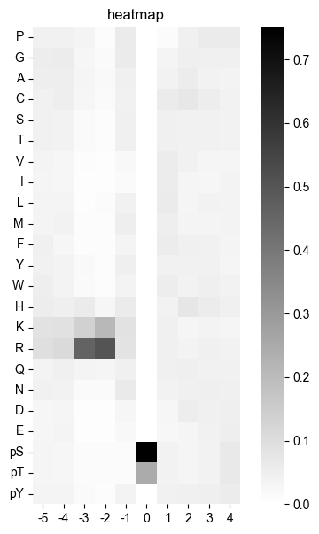
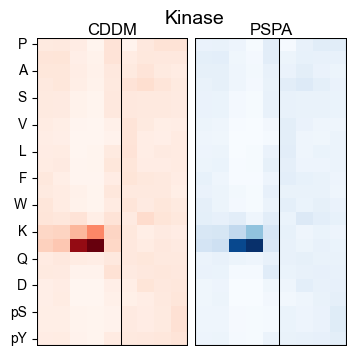
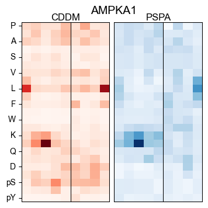
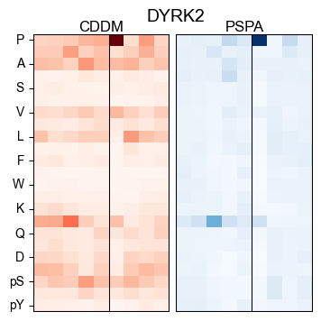
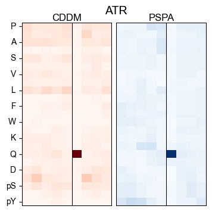
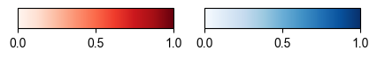
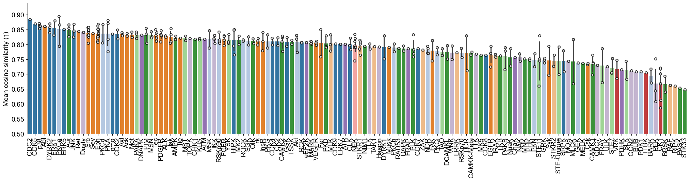
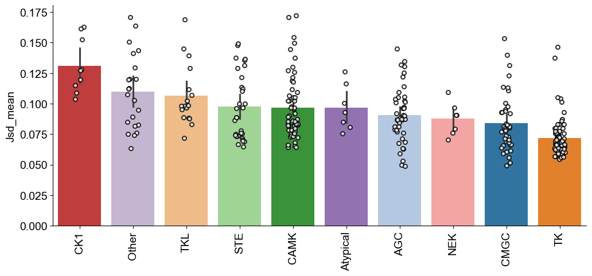

# Heatmap/ST/JSD/cosine comparison


<!-- WARNING: THIS FILE WAS AUTOGENERATED! DO NOT EDIT! -->

## Compare two heatmaps

``` python
import pandas as pd
from katlas.data import *
from katlas.plot import *
from katlas.pssm import *
```

``` python
cddm = pd.read_parquet('out/CDDM_pssms.parquet')
```

``` python
cddm.index = cddm.index.str.split('_').str[1]
```

``` python
pspa = Data.get_pspa_all_scale()
```

``` python
cddm = cddm[pspa.columns].copy()
```

``` python
pssm_df = recover_pssm(pspa.loc['PKACA'])
```

``` python
def plot_heatmap_simple(matrix, # a matrix of values
                 title: str='heatmap', # title of the heatmap
                 figsize: tuple=(6,7), # (width, height)
                 cmap: str='binary', # color map, default is dark&white
                 **kwargs, # arguments for sns.heatmap()
                 ):
    
    "Plot heatmap based on a matrix of values"
    
    plt.figure(figsize=figsize)
    sns.heatmap(matrix, square=True,cmap=cmap, annot=False,**kwargs)
    plt.title(title)
    plt.ylabel('')
    plt.xlabel('')
    plt.yticks(rotation=0)
```

``` python
plot_heatmap_simple(pssm_df)
```



``` python
import matplotlib.pyplot as plt
import seaborn as sns
from matplotlib.patches import Rectangle

def plot_two_heatmaps(matrix1, matrix2, 
                      kinase_name="Kinase", 
                      figsize=(4,4.5), 
                      **kwargs):
    """
    Plot two side-by-side heatmaps with black rectangle borders,
    titles on top, shared kinase label below, and only left plot showing y-axis labels.
    """
    fig, axes = plt.subplots(1, 2, figsize=figsize, gridspec_kw={'wspace': 0.05})
    matrix1 = matrix1.drop(columns=0)
    matrix2 = matrix2.drop(columns=0)
    
    title1="CDDM"
    title2="PSPA"
    # Left heatmap (with y labels)
    sns.heatmap(matrix1, square=False, cmap="Reds", 
                # vmin=0, vmax=1,
                annot=False, cbar=False, ax=axes[0], **kwargs)
    axes[0].set_title(title1, fontsize=12, pad=10)
    axes[0].set_xlabel("")
    axes[0].set_ylabel("")
    axes[0].tick_params(left=True, bottom=True)
    axes[0].tick_params(axis="y", rotation=0) 

    # Add rectangle border to left heatmap
    axes[0].add_patch(Rectangle((0,0), matrix1.shape[1], matrix1.shape[0], 
                                fill=False, edgecolor='black', lw=1.5))

    # Right heatmap (no y labels)
    sns.heatmap(matrix2, square=False, cmap="Blues", 
                # vmin=0, vmax=1,
                annot=False, cbar=False, ax=axes[1], **kwargs)
    axes[1].set_title(title2, fontsize=12, pad=10)
    axes[1].set_xlabel("")
    axes[1].set_ylabel("")
    axes[1].tick_params(left=False, labelleft=False, bottom=True)
    axes[1].tick_params(axis="y", rotation=0) 

    # Add rectangle border to right heatmap
    axes[1].add_patch(Rectangle((0,0), matrix2.shape[1], matrix2.shape[0], 
                                fill=False, edgecolor='black', lw=1.5))

    # Make y tick horizontal
    axes[0].set_title(title1, fontsize=12, pad=0)
    axes[1].set_title(title2, fontsize=12, pad=0)

    # force display every position
    # n_positions = matrix1.shape[1]
    # axes[0].set_xticks(np.arange(n_positions) + 0.5)   # center of each cell
    # axes[0].set_xticklabels(range(-5, 5), rotation=0)  # or your custom labels
    
    # axes[1].set_xticks(np.arange(n_positions) + 0.5)
    # axes[1].set_xticklabels(range(-5, 5), rotation=0)

    xpos = (list(matrix1.columns).index(-1) + list(matrix1.columns).index(1)) / 2 + 0.5
    axes[0].axvline(xpos, color='black', lw=0.75)
    axes[1].axvline(xpos, color='black', lw=0.75)

    # set empty xticks
    axes[0].set_xticks([])
    axes[1].set_xticks([])

    # Shared kinase label below
    fig.suptitle(kinase_name, fontsize=14, x=0.52,y=0.95)
```

``` python
import matplotlib.pyplot as plt
import seaborn as sns
import numpy as np
```

``` python
plot_two_heatmaps(pssm_df,pssm_df,figsize=(4,4))
```



``` python
def plot_compare(cddm_df,pspa_df,kinase,**kwargs):
    cddm_pssm = recover_pssm(cddm_df.loc[kinase])
    pspa_pssm = recover_pssm(pspa_df.loc[kinase])
    plot_two_heatmaps(cddm_pssm,pspa_pssm,kinase_name=kinase,**kwargs)
```

``` python
k_list = ['PKACA','AMPKA1','DYRK2','ATR','CK1A','EGFR']
```

``` python
for k in k_list:
    plot_compare(cddm,pspa,k,figsize=(4,4))
    # plt.show()
    save_svg(f'fig/compare_{k}.svg')
    # plt.close()
```









``` python
plot_compare(cddm,pspa,'EGFR')
```


## Cbar

``` python
import matplotlib as mpl
```

``` python
def plot_cbar(figsize=(5,0.3)):
    fig, axes = plt.subplots(1, 2, figsize=figsize)

    # Shared normalization [0,1]
    norm = mpl.colors.Normalize(vmin=0, vmax=1)

    # Red probability bar
    cmap_red = plt.cm.Reds
    cb1 = mpl.colorbar.ColorbarBase(
        axes[0], cmap=cmap_red, norm=norm,
        orientation='horizontal'
    )
    # cb1.set_label("Probability")
    cb1.set_ticks([0, 0.5, 1])

    # Blue probability bar
    cmap_blue = plt.cm.Blues
    cb2 = mpl.colorbar.ColorbarBase(
        axes[1], cmap=cmap_blue, norm=norm,
        orientation='horizontal'
    )
    # cb2.set_label("Probability")
    cb2.set_ticks([0, 0.5, 1])
```

``` python
plot_cbar()
save_svg('fig/cbar.svg')
```



## ST ratio comparison

``` python
pspa_st = pspa[pspa['0pY']==0]
```

``` python
pspa_st_ratio = np.log2(pspa_st['0pS']/pspa_st['0pT'])
```

``` python
cddm_st_ratio = np.log2(cddm['0pS']/cddm['0pT'])
```

``` python
st_ratio = pd.concat([pspa_st_ratio,cddm_st_ratio],axis=1)
```

``` python
st_ratio.columns=['pspa','cddm']
```

``` python
info = Data.get_kinase_info()

info = info[info.pseudo=='0'].copy()

hue_group = info.set_index('kinase')['modi_group']
```

``` python
st_ratio['group'] = st_ratio.index.map(hue_group)
```

``` python
st_ratio = st_ratio.dropna()
```

``` python
from katlas.plot import *
```

``` python
plt.figure(figsize=(2.5,3))
plot_corr(st_ratio,y='cddm',x='pspa',hue='group',s=12,
          text_location=(0.4,0.85),
          palette=group_color,legend=False)
plt.ylabel('Log2(S/T) ratio from CDDM')
plt.xlabel('Log2(S/T) ratio from PSPA')
plt.tight_layout()
save_svg('fig/ST_ratio.svg')
```

    /Users/icai/git/katlas/katlas/plot.py:653: UserWarning: No artists with labels found to put in legend.  Note that artists whose label start with an underscore are ignored when legend() is called with no argument.
      if hue is not None:


## JS divergence

``` python
from katlas.clustering import *

from functools import partial
```

``` python
((cddm_overlap==0).sum(1)/cddm_overlap.shape[1]).sort_values()
```

    index
    YES1        0.086957
    GSK3B       0.086957
    EPHB3       0.086957
    BMX         0.086957
    MAPKAPK3    0.086957
                  ...   
    CAMK1B      0.360870
    SMMLCK      0.360870
    BRAF        0.360870
    VRK1        0.365217
    GAK         0.365217
    Length: 311, dtype: float64

``` python
import numpy as np
def js_divergence(p1, # pssm 
                  p2, # pssm
                 ):
    "p1 and p2 are two arrays (df or np) with index as aa and column as position"
    assert p1.shape==p2.shape
    valid = (p1 + p2) > 0
    p1 = np.where(valid, p1, 0.0)
    p2 = np.where(valid, p2, 0.0)
    
    m = 0.5 * (p1 + p2)
    
    js = 0.5 * np.sum(p1 * np.log((p1+ EPSILON) / (m + EPSILON)), axis=0) + \
         0.5 * np.sum(p2 * np.log((p2+ EPSILON) / (m + EPSILON)), axis=0)
    return js
```

``` python
common_k = list(set(pspa.index)&set(cddm.index))
```

``` python
score = pd.DataFrame(index=common_k)
```

``` python
score['pspa_speci'] = pspa_overlap.apply(get_specificity_flat,axis=1)

score['group'] = score.index.map(hue_group)
```

``` python
pspa_overlap = pspa.loc[common_k].copy()
cddm_overlap = cddm.loc[common_k].copy()
```

``` python
def cosine_similarity_position(pssm1: pd.DataFrame, pssm2: pd.DataFrame):
    """Compute cosine similarity per position between two PSSMs, no sklearn."""
    assert pssm1.shape == pssm2.shape, "PSSMs must have same shape"
    sims = {}
    for pos in pssm1.columns:
        v1 = pssm1[pos].values
        v2 = pssm2[pos].values
        dot = np.dot(v1, v2)
        norm1 = np.linalg.norm(v1)
        norm2 = np.linalg.norm(v2)
        sims[pos] = dot / (norm1 * norm2) if norm1 > 0 and norm2 > 0 else 0.0
    return pd.Series(sims)
```

``` python
# def euclidean_distance_position(pssm1: pd.DataFrame, pssm2: pd.DataFrame):
#     """Compute Euclidean distance per position between two PSSMs, no sklearn."""
#     assert pssm1.shape == pssm2.shape, "PSSMs must have same shape"
#     dists = {}
#     for pos in pssm1.columns:
#         v1 = pssm1[pos].values
#         v2 = pssm2[pos].values
#         diff = v1 - v2
#         dists[pos] = np.linalg.norm(diff)  # sqrt(sum((v1 - v2)^2))
#     return pd.Series(dists)
```

``` python
def cosine_mean(cddm_pssm,pspa_pssm): return cosine_similarity_position(cddm_pssm,pspa_pssm).mean()
# def cosine_min(cddm_pssm,pspa_pssm): return cosine_similarity_position(cddm_pssm,pspa_pssm).min()
# def euclidean_mean(cddm_pssm,pspa_pssm): return euclidean_distance_position(cddm_pssm,pspa_pssm).mean()
```

``` python
# score_list = []
# for k in common_k:
#     pspa_pssm = recover_pssm(pspa.loc[k])
#     cddm_pssm = recover_pssm(cddm.loc[k])
#     score_list.append(euclidean_mean(pspa_pssm,cddm_pssm))
# score['euclidean_mean'] = score_list
```

``` python
score_list = []
for k in common_k:
    pspa_pssm = recover_pssm(pspa.loc[k])
    cddm_pssm = recover_pssm(cddm.loc[k])
    score_list.append(cosine_mean(pspa_pssm,cddm_pssm))
score['cosine_mean'] = score_list
```

``` python
score_list = []
for k in common_k:
    pspa_pssm = recover_pssm(pspa.loc[k])
    cddm_pssm = recover_pssm(cddm.loc[k])
    score_list.append(js_divergence(pspa_pssm,cddm_pssm).mean())
score['JSD_mean'] = score_list
```

``` python
# score_list = []
# for k in common_k:
#     pspa_pssm = recover_pssm(pspa.loc[k])
#     cddm_pssm = recover_pssm(cddm.loc[k])
#     score_list.append(cosine_min(pspa_pssm,cddm_pssm))
# score['cosine_min'] = score_list
```

``` python
from adjustText import adjust_text
from matplotlib import pyplot as plt
import seaborn as sns
from scipy.stats import spearmanr, pearsonr


def plot_corr(
    df,  # dataframe that contains data
    x,  # x axis values, or colname of x axis
    y,  # y axis values, or colname of y axis
    text_location=(0.8, 0.1),  # relative coords in Axes (0–1)
    method="spearman",  # correlation method: 'pearson' or 'spearman'
    index_list=None,  # list of indices to annotate
    hue=None,
    reg_line=True,
    **kwargs
):
    """
    Given a dataframe and the name of two columns, 
    plot the two columns' correlation with either Pearson or Spearman.
    Annotate points if their index is in index_list.
    """
    x_vals = df[x]
    y_vals = df[y]

    # Compute correlation
    if method.lower() == "spearman":
        corr_val, pvalue = spearmanr(x_vals, y_vals)
        corr_label = f"Spearman ρ = {corr_val:.2f}\n p = {pvalue:.2e}"
    else:
        corr_val, pvalue = pearsonr(x_vals, y_vals)
        corr_label = f"Pearson r = {corr_val:.2f}\n p = {pvalue:.2e}"

    # Plot regression line + scatter
    if hue is not None:
        sns.scatterplot(data=df, x=x, y=y, hue=hue, **kwargs)
        if reg_line: sns.regplot(x=x_vals, y=y_vals, scatter=False, line_kws={'color': 'gray','alpha': 0.5})
        plt.legend(
            bbox_to_anchor=(1.05, 1),   # (x, y) anchor relative to axes
            loc="upper left",           # where to attach the legend box
            borderaxespad=0.
        )
    else:
        sns.regplot(x=x_vals, y=y_vals, line_kws={'color': 'gray'}, **kwargs)


    # # Add correlation text
    # plt.text(
    #     x=text_location[0],
    #     y=text_location[1],
    #     s=corr_label,
    #     transform=plt.gca().transAxes,
    #     ha="center",
    #     va="center"
    # )

    # Annotate selected points if index_list is given
    texts = []
    if index_list is not None:
        for idx in index_list:
            if idx in df.index:  # make sure index exists
                texts.append(
                    plt.text(
                        x_vals.loc[idx], 
                        y_vals.loc[idx], 
                        str(idx),
                        fontsize=9,
                        ha="center",
                        va="center"
                    )
                )
        if texts:
            adjust_text(texts, arrowprops=dict(arrowstyle="->", color="black", lw=0.5))
```

``` python
def plot_bar(df, 
             value, # colname of value
             group, # colname of group
             title = None,
             figsize = (12,5),
             fontsize=14,
             dots = True, # whether or not add dots in the graph
             rotation=90,
             ascending=False,
             ymin=None,
             **kwargs
              ):
    
    "Plot bar graph from unstacked dataframe; need to indicate columns of values and categories"
    
    plt.figure(figsize=figsize)
    
    idx = df.groupby(group)[value].mean().sort_values(ascending=ascending).index
    
    sns.barplot(data=df, x=group, y=value, order=idx,hue=group, legend=False, **kwargs)
    
    if dots:
        marker = {'marker': 'o', 
                  'color': 'white', 
                  'edgecolor': 'black', 
                  'linewidth': 1.5, 
                  'jitter':True,
                  's': 5}

        sns.stripplot(data=df, 
                      x=group, 
                      y=value,
                      order=idx,
                      alpha=0.8,
                      # ax=g.ax,
                      **marker)
        
    # Increase font size for the x-axis and y-axis tick labels
    plt.tick_params(axis='x', labelsize=fontsize)  # Increase x-axis label size
    plt.tick_params(axis='y', labelsize=fontsize)  # Increase y-axis label size
    
    # Modify x and y label and increase font size
    plt.xlabel('', fontsize=fontsize)
    plt.ylabel(value, fontsize=fontsize)
    
    # Rotate X labels
    plt.xticks(rotation=rotation)
    
    # Plot titles
    if title is not None:
        plt.title(title,fontsize=fontsize)

    if ymin is not None: plt.ylim(bottom=ymin)
    plt.gca().spines[['right', 'top']].set_visible(False)
```

``` python
hue_subfamily=info.set_index('kinase')['subfamily']
```

``` python
group_color2 = pd.DataFrame(group_color).T
```

``` python
group_color2 = group_color2.reset_index(names='modi_group')
```

``` python
subfamily_color = info[['modi_group','subfamily']].merge(group_color2).drop(columns=['modi_group']).set_index('subfamily')
```

``` python
subfamily_color = subfamily_color.apply(tuple, axis=1).to_dict()
```

``` python
score['subfamily'] = score.index.map(hue_subfamily)
```

``` python
plot_bar(score,'cosine_mean','subfamily',
         palette=subfamily_color,
         ymin=0.5,figsize=(25,5)
        )
plt.ylabel('Mean cosine similarity (↑)')
```

    Text(0, 0.5, 'Mean cosine similarity (↑)')



``` python
plot_bar(score,'cosine_mean','group',palette=group_color,ymin=0.5,figsize=(7,3))
plt.ylabel('Mean cosine similarity (↑)')
save_svg('fig/cosine.svg')
```


``` python
plot_bar(score,'JSD_mean','group',palette=group_color,figsize=(7,3),ascending=True)
plt.ylabel('Mean JSD distance (↓)')
save_svg('fig/JSD.svg')
```


``` python
plot_bar
```

    <function katlas.plot.plot_bar(df, value, group, title=None, figsize=(12, 5), fontsize=14, dots=True, rotation=90, ascending=False, *, data=None, x=None, y=None, hue=None, order=None, hue_order=None, estimator='mean', errorbar=('ci', 95), n_boot=1000, seed=None, units=None, weights=None, orient=None, color=None, palette=None, saturation=0.75, fill=True, hue_norm=None, width=0.8, dodge='auto', gap=0, log_scale=None, native_scale=False, formatter=None, legend='auto', capsize=0, err_kws=None, ci=<deprecated>, errcolor=<deprecated>, errwidth=<deprecated>, ax=None)>

``` python
plot_bar(score,'JSD_mean','group',ascending=True,palette=group_color,)
```


``` python
plot_bar(score,'JSD_mean','group',palette=group_color)
```



``` python
k_list = score['cosine_mean'].sort_values().head(40).index
# k_list = score[score['cosine_mean']<0.75].index
plot_corr(score,'pspa_speci','cosine_mean',
          text_location=(0.8,0.9),
          index_list=k_list,
          reg_line=False,
          hue='group',palette=group_color)
plt.ylabel('Mean cosine similarity')
plt.xlabel('PSPA specificity score')
save_svg('fig/cosine_similarity_specificity.svg')
# plt.axhline(y=0.75,color='r', linestyle='--', linewidth=2,alpha=0.2)
```


## Experiment

``` python
k='ATR'
pspa_pssm = recover_pssm(pspa.loc[k])
cddm_pssm = recover_pssm(cddm.loc[k])
js_divergence(pspa_pssm,cddm_pssm)
```

    array([0.14273914, 0.12959633, 0.08697435, 0.05695579, 0.05958804,
           0.02867595, 0.2633553 , 0.10621596, 0.0445805 , 0.08671556])

``` python
cddm_pssm = recover_pssm(cddm.loc['GSK3B'])
pspa_pssm = recover_pssm(pspa.loc['GSK3B'])
```

``` python
cddm_pssm[1]
```

    aa
    P     0.420290
    G     0.075362
    A     0.039130
    C     0.007246
    S     0.015942
    T     0.018841
    V     0.063768
    I     0.031884
    L     0.046377
    M     0.007246
    F     0.013043
    Y     0.007246
    W     0.002899
    H     0.008696
    K     0.014493
    R     0.057971
    Q     0.024638
    N     0.007246
    D     0.034783
    E     0.023188
    pS    0.037681
    pT    0.021739
    pY    0.020290
    Name: 1, dtype: float64

``` python
pspa_pssm[1]
```

    aa
    P     0.03262
    G     0.03084
    A     0.03382
    C     0.03616
    S     0.03246
    T     0.03246
    V     0.03149
    I     0.03544
    L     0.03455
    M     0.03246
    F     0.03358
    Y     0.03173
    W     0.02931
    H     0.02956
    K     0.03076
    R     0.03930
    Q     0.28018
    N     0.04421
    D     0.02762
    E     0.02778
    pS    0.03213
    pT    0.03213
    pY    0.02940
    Name: 1, dtype: float64

Both PSPA and CDDM have Q as max in position 1.

Let’s test which distance/similarity metric makes sense most

``` python
euclidean_distance_position(cddm_pssm,pspa_pssm)
```

    -5    0.117948
    -4    0.209271
    -3    0.141432
    -2    0.155427
    -1    0.159968
     0    0.229537
     1    0.363615
     2    0.165754
     3    0.155656
     4    0.397584
    dtype: float64

``` python
pd.Series(js_divergence(cddm_pssm,pspa_pssm),index=list(range(-5,5)))
```

    -5    0.046637
    -4    0.086952
    -3    0.063191
    -2    0.062703
    -1    0.072525
     0    0.027765
     1    0.132643
     2    0.075066
     3    0.062533
     4    0.172927
    dtype: float64

``` python
cosine_similarity_position(cddm_pssm,pspa_pssm)
```

    -5    0.868829
    -4    0.713273
    -3    0.843677
    -2    0.808220
    -1    0.790774
     0    0.950192
     1    0.596159
     2    0.774477
     3    0.795978
     4    0.793016
    dtype: float64

``` python
cosine_similarity_position(cddm_pssm,pspa_pssm).mean()
```

    np.float64(0.7934594439218537)

Only cosine shows position 1 similar, while JS divergence and euclidean
distance emphasize the difference in position 1.
