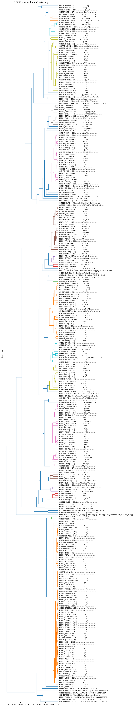

# Hierarchical clustering of PSSM


<!-- WARNING: THIS FILE WAS AUTOGENERATED! DO NOT EDIT! -->

``` python
from katlas.data import *
import pandas as pd
from katlas.clustering import *
```

``` python
df = pd.read_parquet('out/CDDM_pssms.parquet')
```

``` python
df
```

<div>
<style scoped>
    .dataframe tbody tr th:only-of-type {
        vertical-align: middle;
    }
&#10;    .dataframe tbody tr th {
        vertical-align: top;
    }
&#10;    .dataframe thead th {
        text-align: right;
    }
</style>

<table class="dataframe" data-quarto-postprocess="true" data-border="1">
<thead>
<tr style="text-align: right;">
<th data-quarto-table-cell-role="th"></th>
<th data-quarto-table-cell-role="th">-20P</th>
<th data-quarto-table-cell-role="th">-20G</th>
<th data-quarto-table-cell-role="th">-20A</th>
<th data-quarto-table-cell-role="th">-20C</th>
<th data-quarto-table-cell-role="th">-20S</th>
<th data-quarto-table-cell-role="th">-20T</th>
<th data-quarto-table-cell-role="th">-20V</th>
<th data-quarto-table-cell-role="th">-20I</th>
<th data-quarto-table-cell-role="th">-20L</th>
<th data-quarto-table-cell-role="th">-20M</th>
<th data-quarto-table-cell-role="th">...</th>
<th data-quarto-table-cell-role="th">20H</th>
<th data-quarto-table-cell-role="th">20K</th>
<th data-quarto-table-cell-role="th">20R</th>
<th data-quarto-table-cell-role="th">20Q</th>
<th data-quarto-table-cell-role="th">20N</th>
<th data-quarto-table-cell-role="th">20D</th>
<th data-quarto-table-cell-role="th">20E</th>
<th data-quarto-table-cell-role="th">20pS</th>
<th data-quarto-table-cell-role="th">20pT</th>
<th data-quarto-table-cell-role="th">20pY</th>
</tr>
<tr>
<th data-quarto-table-cell-role="th">index</th>
<th data-quarto-table-cell-role="th"></th>
<th data-quarto-table-cell-role="th"></th>
<th data-quarto-table-cell-role="th"></th>
<th data-quarto-table-cell-role="th"></th>
<th data-quarto-table-cell-role="th"></th>
<th data-quarto-table-cell-role="th"></th>
<th data-quarto-table-cell-role="th"></th>
<th data-quarto-table-cell-role="th"></th>
<th data-quarto-table-cell-role="th"></th>
<th data-quarto-table-cell-role="th"></th>
<th data-quarto-table-cell-role="th"></th>
<th data-quarto-table-cell-role="th"></th>
<th data-quarto-table-cell-role="th"></th>
<th data-quarto-table-cell-role="th"></th>
<th data-quarto-table-cell-role="th"></th>
<th data-quarto-table-cell-role="th"></th>
<th data-quarto-table-cell-role="th"></th>
<th data-quarto-table-cell-role="th"></th>
<th data-quarto-table-cell-role="th"></th>
<th data-quarto-table-cell-role="th"></th>
<th data-quarto-table-cell-role="th"></th>
</tr>
</thead>
<tbody>
<tr>
<td data-quarto-table-cell-role="th">P12931_SRC</td>
<td>0.054538</td>
<td>0.081380</td>
<td>0.060077</td>
<td>0.012356</td>
<td>0.036216</td>
<td>0.032382</td>
<td>0.055816</td>
<td>0.052407</td>
<td>0.083511</td>
<td>0.023434</td>
<td>...</td>
<td>0.013351</td>
<td>0.076992</td>
<td>0.060970</td>
<td>0.037383</td>
<td>0.036938</td>
<td>0.052960</td>
<td>0.086337</td>
<td>0.025367</td>
<td>0.015576</td>
<td>0.023142</td>
</tr>
<tr>
<td data-quarto-table-cell-role="th">P29320_EPHA3</td>
<td>0.044276</td>
<td>0.088013</td>
<td>0.065335</td>
<td>0.008639</td>
<td>0.037797</td>
<td>0.036717</td>
<td>0.072354</td>
<td>0.048596</td>
<td>0.075594</td>
<td>0.026998</td>
<td>...</td>
<td>0.014132</td>
<td>0.083098</td>
<td>0.059356</td>
<td>0.031091</td>
<td>0.033917</td>
<td>0.056529</td>
<td>0.100622</td>
<td>0.025438</td>
<td>0.013567</td>
<td>0.015828</td>
</tr>
<tr>
<td data-quarto-table-cell-role="th">P07332_FES</td>
<td>0.047231</td>
<td>0.082519</td>
<td>0.070575</td>
<td>0.011401</td>
<td>0.034745</td>
<td>0.039088</td>
<td>0.061889</td>
<td>0.053203</td>
<td>0.088491</td>
<td>0.026059</td>
<td>...</td>
<td>0.013053</td>
<td>0.086266</td>
<td>0.055619</td>
<td>0.040863</td>
<td>0.038025</td>
<td>0.059024</td>
<td>0.085698</td>
<td>0.026674</td>
<td>0.013621</td>
<td>0.019296</td>
</tr>
<tr>
<td data-quarto-table-cell-role="th">Q16288_NTRK3</td>
<td>0.044444</td>
<td>0.074644</td>
<td>0.074074</td>
<td>0.017094</td>
<td>0.033048</td>
<td>0.035328</td>
<td>0.060969</td>
<td>0.058120</td>
<td>0.084330</td>
<td>0.026781</td>
<td>...</td>
<td>0.015682</td>
<td>0.091677</td>
<td>0.052473</td>
<td>0.030760</td>
<td>0.044029</td>
<td>0.057298</td>
<td>0.088661</td>
<td>0.021713</td>
<td>0.015682</td>
<td>0.018094</td>
</tr>
<tr>
<td data-quarto-table-cell-role="th">Q9UM73_ALK</td>
<td>0.045748</td>
<td>0.079765</td>
<td>0.073314</td>
<td>0.018182</td>
<td>0.032845</td>
<td>0.035191</td>
<td>0.067449</td>
<td>0.051026</td>
<td>0.076246</td>
<td>0.027566</td>
<td>...</td>
<td>0.015634</td>
<td>0.090198</td>
<td>0.069152</td>
<td>0.030066</td>
<td>0.043897</td>
<td>0.051112</td>
<td>0.096212</td>
<td>0.026458</td>
<td>0.013229</td>
<td>0.017438</td>
</tr>
<tr>
<td data-quarto-table-cell-role="th">...</td>
<td>...</td>
<td>...</td>
<td>...</td>
<td>...</td>
<td>...</td>
<td>...</td>
<td>...</td>
<td>...</td>
<td>...</td>
<td>...</td>
<td>...</td>
<td>...</td>
<td>...</td>
<td>...</td>
<td>...</td>
<td>...</td>
<td>...</td>
<td>...</td>
<td>...</td>
<td>...</td>
<td>...</td>
</tr>
<tr>
<td data-quarto-table-cell-role="th">Q15746_SMMLCK</td>
<td>0.078947</td>
<td>0.052632</td>
<td>0.078947</td>
<td>0.026316</td>
<td>0.052632</td>
<td>0.026316</td>
<td>0.052632</td>
<td>0.052632</td>
<td>0.052632</td>
<td>0.000000</td>
<td>...</td>
<td>0.000000</td>
<td>0.066667</td>
<td>0.022222</td>
<td>0.044444</td>
<td>0.133333</td>
<td>0.044444</td>
<td>0.000000</td>
<td>0.044444</td>
<td>0.022222</td>
<td>0.000000</td>
</tr>
<tr>
<td data-quarto-table-cell-role="th">Q01973_ROR1</td>
<td>0.097561</td>
<td>0.097561</td>
<td>0.024390</td>
<td>0.000000</td>
<td>0.024390</td>
<td>0.146341</td>
<td>0.170732</td>
<td>0.024390</td>
<td>0.048780</td>
<td>0.000000</td>
<td>...</td>
<td>0.000000</td>
<td>0.075000</td>
<td>0.050000</td>
<td>0.000000</td>
<td>0.050000</td>
<td>0.025000</td>
<td>0.125000</td>
<td>0.125000</td>
<td>0.000000</td>
<td>0.025000</td>
</tr>
<tr>
<td data-quarto-table-cell-role="th">P15056_BRAF</td>
<td>0.095238</td>
<td>0.071429</td>
<td>0.047619</td>
<td>0.000000</td>
<td>0.095238</td>
<td>0.047619</td>
<td>0.071429</td>
<td>0.000000</td>
<td>0.095238</td>
<td>0.047619</td>
<td>...</td>
<td>0.000000</td>
<td>0.075000</td>
<td>0.075000</td>
<td>0.025000</td>
<td>0.025000</td>
<td>0.075000</td>
<td>0.075000</td>
<td>0.050000</td>
<td>0.000000</td>
<td>0.000000</td>
</tr>
<tr>
<td data-quarto-table-cell-role="th">O14976_GAK</td>
<td>0.075000</td>
<td>0.075000</td>
<td>0.175000</td>
<td>0.000000</td>
<td>0.025000</td>
<td>0.025000</td>
<td>0.100000</td>
<td>0.025000</td>
<td>0.050000</td>
<td>0.175000</td>
<td>...</td>
<td>0.000000</td>
<td>0.024390</td>
<td>0.024390</td>
<td>0.000000</td>
<td>0.170732</td>
<td>0.195122</td>
<td>0.024390</td>
<td>0.048780</td>
<td>0.024390</td>
<td>0.000000</td>
</tr>
<tr>
<td data-quarto-table-cell-role="th">Q6P0Q8_MAST2</td>
<td>0.046512</td>
<td>0.116279</td>
<td>0.069767</td>
<td>0.000000</td>
<td>0.023256</td>
<td>0.069767</td>
<td>0.069767</td>
<td>0.000000</td>
<td>0.046512</td>
<td>0.046512</td>
<td>...</td>
<td>0.000000</td>
<td>0.048780</td>
<td>0.219512</td>
<td>0.000000</td>
<td>0.048780</td>
<td>0.024390</td>
<td>0.024390</td>
<td>0.024390</td>
<td>0.000000</td>
<td>0.000000</td>
</tr>
</tbody>
</table>

<p>329 rows × 943 columns</p>
</div>

``` python
Z = get_Z(df)
```

      0%|          | 0/53956 [00:00<?, ?it/s]

``` python
data = Data.get_ks_dataset()
```

``` python
data['kinase_id'] = data['kinase_uniprot'] + '_' + data['kinase_protein'].str.split().str[0]
cnt = data['kinase_id'].value_counts()
```

``` python
labels= get_pssm_seq_labels(df,count_map=cnt,thr=0.2)
```

``` python
from katlas.plot import *
```

``` python
plot_dendrogram(Z,dense=5,labels=labels,title='CDDM Hierarchical Clustering') 
save_pdf('out/CDDM_hierarchical.pdf')
```



## PSPA

``` python
df2 = Data.get_pspa_all_scale()
```

``` python
info = Data.get_kinase_info()
```

``` python
kmap = info.set_index('kinase')['uniprot']
```

``` python
df2.index = df2.index.str.split('_').str[0].map(kmap) + "_" + df2.index
```

``` python
Z2 = get_Z(df2)
```

      0%|          | 0/78210 [00:00<?, ?it/s]

``` python
labels2= get_pssm_seq_labels(df2,thr=0.2)
```

``` python
plot_dendrogram(Z2,dense=5,labels=labels2,title='PSPA Hierarchical Clustering') 
save_pdf('out/PSPA_hierarchical.pdf')
```


