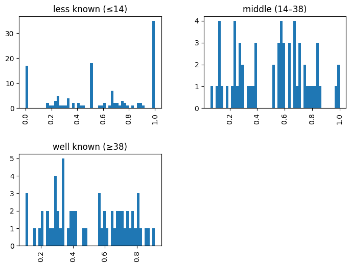
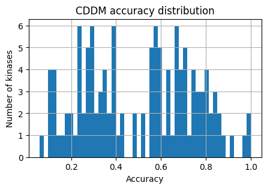

# Plot reactome pathways: CDDM


<!-- WARNING: THIS FILE WAS AUTOGENERATED! DO NOT EDIT! -->

``` python
from katlas.pssm import *
from katlas.score import *
from katlas.data import *
from katlas.plot import *
from katlas.pathway import *
from katlas.utils import *
import pandas as pd,seaborn as sns
from matplotlib import pyplot as plt
from tqdm import tqdm
import time, random
```

## Data

``` python
cddm_info=pd.read_parquet('raw/cddm_path_info.parquet')
df=pd.read_parquet('raw/cddm_score_df.parquet')
```

``` python
thr_cols = ['S_thr','T_thr','Y_thr']
gene_cols = ['S_genes','T_genes','Y_genes']
cnt_cols = ['S_cnt','T_cnt','Y_cnt']
site_cols = ['S_sites','T_sites','Y_sites']
```

## Site pssms

``` python
human_site= Data.get_human_site()
seq_map = human_site.set_index('sub_site')['site_seq']
```

``` python
series=cddm_info.iloc[0]
```

``` python
def get_site_pssm(series):
    pssm_dict = {}
    count_dict={}
    for acceptor, sites in zip(['S','T','Y'],series[site_cols]):
        sites=list(sites)
        if sites:
            pssm = get_prob(seq_map[sites])
            key = series.name+'_'+acceptor
            pssm_dict[key] = pd.Series(flatten_pssm(pssm))
            count_dict[key]=len(sites)
    return pssm_dict,count_dict
```

``` python
pssm_out = {}
count_out = {}
for i,r in cddm_info.iterrows():
    pssms,counts = get_site_pssm(r)
    pssm_out.update(pssms)
    count_out.update(counts)
    # break
```

``` python
site_pssms = pd.DataFrame(pssm_out).T
```

``` python
for k in tqdm(cddm_info.index,total=len(cddm_info)):
    k_pssms = site_pssms[site_pssms.index.str.contains(f'{k}_')]
    plot_logos(k_pssms,count_dict=count_out)
    path = prepare_path(f'fig/cddm/{k}/path/logo.svg')
    save_show(path,show_only=False)
    plt.close('all')
    # break
```

    100%|█████████████████████████████████████████████████████████| 328/328 [43:05<00:00,  7.88s/it]

``` python
site_pssms.to_parquet('raw/cddm_site_pssm.parquet')
```

## Plot distribution

``` python
def plot_hist(df,
              kinase,
              sty_thr=None, # dict of thresholds per acceptor
              hue='acceptor'):
    
    "Plot histogram of a column (kinase). "
    
    plt.figure(figsize=(6,2))

    hist_params = {'element':'poly',
              'edgecolor': None,
              'alpha':0.5,
              'bins':100,
              'kde':True,
              'palette':sty_color}
    
    sns.histplot(data=df,x=kinase,hue=hue,**hist_params)
    
    plt.xlabel('')
    plt.title(f'{kinase} score distribution')

    if sty_thr:
        for acceptor,thr in sty_thr.items():
            if thr is not None:
                plt.axvline(thr,color=sty_color[acceptor])
```

``` python
plot_hist(df,'AKT1')
```


``` python
for k,r in tqdm(cddm_info.iterrows(),total=len(cddm_info)):
    sty_thr=r[thr_cols].rename(index={'S_thr':'S','T_thr':'T','Y_thr':'Y'})[lambda x: x!=0].to_dict()
    plot_hist(df,k,sty_thr=sty_thr)
    save_show(f'fig/cddm/{k}/path/hist.svg',show_only=False)
plt.close('all')
```

    100%|█████████████████████████████████████████████████████████| 328/328 [03:14<00:00,  1.68it/s]

## Plot reactome pathway

``` python
info = Data.get_kinase_info()
```

``` python
info = info[info.pseudo=='0']
```

``` python
info.uniprot.duplicated().sum()
```

    np.int64(0)

``` python
kinase_map = info.set_index('kinase')['uniprot']
```

``` python
def get_path(series):
    out = get_reactome(series['genes'],p_type='p')
    kinase=series.name.split('_')[0] # for those with _TRY, need to remove that
    uniprot = kinase_map[kinase]
    out = add_reactome_ref(out,uniprot)
    exclude=['GTPase','SUMO']
    out = out[~out.name.str.contains('|'.join(exclude))]
    return out
```

``` python
show_only=False
```

``` python
cddm_info.index.get_loc('YSK1')
```

    96

``` python
len(cddm_info)
```

    328

``` python
for i,(k,r) in enumerate(cddm_info.iterrows()):
    print(i,':',k)
    save_dir = f'fig/cddm/{k}/path'
    
    path_df = get_path(r)
    path_df.to_parquet(f'{save_dir}/path.parquet')

    plot_path(path_df,p_type='p',ref_col='ref_path',top_n=15,max_label_length=55)
    plt.title('Reactome pathways of substrates based on scores')
    save_show(f'{save_dir}/path.svg',show_only=show_only)

    if path_df.ref_path.sum()!=0:
        accuracy = get_overlap(path_df, ref_col='ref_path',plot=True,p_type='p',figsize=(5,3))
        plt.title(f'Distribution of –log₁₀(p) for reference pathways')
        save_show(f'{save_dir}/overlap.svg',show_only=show_only)

    if path_df.ref_path_lowest.sum()!=0:
        accuracy_lo = get_overlap(path_df, ref_col='ref_path_lowest',plot=True,p_type='p',figsize=(5,3))
        plt.title(f'Distribution of –log₁₀(p) for reference pathways \n(lowest-level)')
        save_show(f'{save_dir}/overlap_lo.svg',show_only=show_only)
    plt.close('all')
    # break
    
    # ✅ polite delay to avoid API throttling
    delay = random.uniform(1.5, 4)
    print(f"Sleeping {delay:.2f}s before next kinase...")
    time.sleep(delay)
```

    0 : SRC
    Running pathway anlysis
    Done
    Sleeping 3.98s before next kinase...
    1 : EPHA3
    Running pathway anlysis
    Done
    Sleeping 1.77s before next kinase...
    2 : FES
    Running pathway anlysis
    Done
    Sleeping 2.18s before next kinase...
    3 : NTRK3
    Running pathway anlysis
    Done
    Sleeping 3.29s before next kinase...
    4 : ALK
    Running pathway anlysis
    Done
    Sleeping 3.96s before next kinase...
    5 : ABL1
    Running pathway anlysis
    Done
    Sleeping 2.73s before next kinase...
    6 : FLT3
    Running pathway anlysis
    Done
    Sleeping 2.95s before next kinase...
    7 : EPHA8
    Running pathway anlysis
    Done
    Sleeping 1.94s before next kinase...
    8 : EPHB2
    Running pathway anlysis
    Done
    Sleeping 3.69s before next kinase...
    9 : EPHB1
    Running pathway anlysis
    Done
    Sleeping 2.95s before next kinase...
    10 : RET
    Running pathway anlysis
    Done
    Sleeping 2.36s before next kinase...
    11 : FYN
    Running pathway anlysis
    Done
    Sleeping 3.14s before next kinase...
    12 : FER
    Running pathway anlysis
    Done
    Sleeping 1.84s before next kinase...
    13 : INSR
    Running pathway anlysis
    Done
    Sleeping 3.89s before next kinase...
    14 : MUSK
    Running pathway anlysis
    Done
    Sleeping 2.47s before next kinase...
    15 : EPHB3
    Running pathway anlysis
    Done
    Sleeping 1.56s before next kinase...
    16 : EPHB4
    Running pathway anlysis
    Done
    Sleeping 3.63s before next kinase...
    17 : NTRK1
    Running pathway anlysis
    Done
    Sleeping 3.03s before next kinase...
    18 : TYRO3
    Running pathway anlysis
    Done
    Sleeping 3.11s before next kinase...
    19 : ROS1
    Running pathway anlysis
    Done
    Sleeping 3.30s before next kinase...
    20 : MET
    Running pathway anlysis
    Done
    Sleeping 2.40s before next kinase...
    21 : SYK
    Running pathway anlysis
    Done
    Sleeping 2.55s before next kinase...
    22 : TNK1
    Running pathway anlysis
    Done
    Sleeping 2.43s before next kinase...
    23 : FLT4
    Running pathway anlysis
    Done
    Sleeping 1.53s before next kinase...
    24 : YES1
    Running pathway anlysis
    Done
    Sleeping 2.50s before next kinase...
    25 : BMX
    Running pathway anlysis
    Done
    Sleeping 3.36s before next kinase...
    26 : ERK2
    Running pathway anlysis
    Done
    Sleeping 2.63s before next kinase...
    27 : PKACA
    Running pathway anlysis
    Done
    Sleeping 3.91s before next kinase...
    28 : LTK
    Running pathway anlysis
    Done
    Sleeping 2.90s before next kinase...
    29 : FGFR1
    Running pathway anlysis
    Done
    Sleeping 3.38s before next kinase...
    30 : FRK
    Running pathway anlysis
    Done
    Sleeping 2.72s before next kinase...
    31 : EPHA5
    Running pathway anlysis
    Done
    Sleeping 2.92s before next kinase...
    32 : TEK
    Running pathway anlysis
    Done
    Sleeping 3.88s before next kinase...
    33 : LCK
    Running pathway anlysis
    Done
    Sleeping 1.94s before next kinase...
    34 : CDK1
    Running pathway anlysis
    Done
    Sleeping 1.60s before next kinase...
    35 : LYN
    Running pathway anlysis
    Done
    Sleeping 2.90s before next kinase...
    36 : MST1R
    Running pathway anlysis
    Done
    Sleeping 3.27s before next kinase...
    37 : IKKB
    Running pathway anlysis
    Done
    Sleeping 3.81s before next kinase...
    38 : FGFR2
    Running pathway anlysis
    Done
    Sleeping 3.32s before next kinase...
    39 : CDK2
    Running pathway anlysis
    Done
    Sleeping 2.22s before next kinase...
    40 : FGR
    Running pathway anlysis
    Done
    Sleeping 3.88s before next kinase...
    41 : SRMS
    Running pathway anlysis
    Done
    Sleeping 1.81s before next kinase...
    42 : JAK3
    Running pathway anlysis
    Done
    Sleeping 1.75s before next kinase...
    43 : TEC
    Running pathway anlysis
    Done
    Sleeping 2.32s before next kinase...
    44 : PDGFRA
    Running pathway anlysis
    Done
    Sleeping 1.66s before next kinase...
    45 : EPHA1
    Running pathway anlysis
    Done
    Sleeping 3.39s before next kinase...
    46 : ERK1
    Running pathway anlysis
    Done
    Sleeping 2.55s before next kinase...
    47 : IGF1R
    Running pathway anlysis
    Done
    Sleeping 2.01s before next kinase...
    48 : EPHA2
    Running pathway anlysis
    Done
    Sleeping 1.53s before next kinase...
    49 : AXL
    Running pathway anlysis
    Done
    Sleeping 2.36s before next kinase...
    50 : INSRR
    Running pathway anlysis
    Done
    Sleeping 3.09s before next kinase...
    51 : PKCA
    Running pathway anlysis
    Done
    Sleeping 2.38s before next kinase...
    52 : BTK
    Running pathway anlysis
    Done
    Sleeping 2.88s before next kinase...
    53 : BLK
    Running pathway anlysis
    Done
    Sleeping 3.56s before next kinase...
    54 : MERTK
    Running pathway anlysis
    Done
    Sleeping 1.66s before next kinase...
    55 : ERBB4
    Running pathway anlysis
    Done
    Sleeping 3.64s before next kinase...
    56 : EPHA7
    Running pathway anlysis
    Done
    Sleeping 1.72s before next kinase...
    57 : JAK2
    Running pathway anlysis
    Done
    Sleeping 2.83s before next kinase...
    58 : HCK
    Running pathway anlysis
    Done
    Sleeping 2.63s before next kinase...
    59 : PTK6
    Running pathway anlysis
    Done
    Sleeping 2.23s before next kinase...
    60 : PDGFRB
    Running pathway anlysis
    Done
    Sleeping 3.30s before next kinase...
    61 : MLK1
    Running pathway anlysis
    Done
    Sleeping 3.62s before next kinase...
    62 : JNK1
    Running pathway anlysis
    Done
    Sleeping 3.77s before next kinase...
    63 : ABL2
    Running pathway anlysis
    Done
    Sleeping 3.98s before next kinase...
    64 : P38A
    Running pathway anlysis
    Done
    Sleeping 3.98s before next kinase...
    65 : KDR
    Running pathway anlysis
    Done
    Sleeping 3.05s before next kinase...
    66 : NEK6
    Running pathway anlysis
    Done
    Sleeping 3.35s before next kinase...
    67 : EPHA6
    Running pathway anlysis
    Done
    Sleeping 3.38s before next kinase...
    68 : PLK1
    Running pathway anlysis
    Done
    Sleeping 3.46s before next kinase...
    69 : PTK2B
    Running pathway anlysis
    Done
    Sleeping 3.93s before next kinase...
    70 : HGK
    Running pathway anlysis
    Done
    Sleeping 2.89s before next kinase...
    71 : MST1
    Running pathway anlysis
    Done
    Sleeping 1.87s before next kinase...
    72 : CK2A1
    Running pathway anlysis
    Done
    Sleeping 3.12s before next kinase...
    73 : MST3
    Running pathway anlysis
    Done
    Sleeping 3.50s before next kinase...
    74 : TTBK1
    Running pathway anlysis
    Done
    Sleeping 3.65s before next kinase...
    75 : NTRK2
    Running pathway anlysis
    Done
    Sleeping 3.24s before next kinase...
    76 : IKKE
    Running pathway anlysis
    Done
    Sleeping 2.24s before next kinase...
    77 : DDR2
    Running pathway anlysis
    Done
    Sleeping 3.92s before next kinase...
    78 : MST2
    Running pathway anlysis
    Done
    Sleeping 1.59s before next kinase...
    79 : NEK2
    Running pathway anlysis
    Done
    Sleeping 1.64s before next kinase...
    80 : P38D
    Running pathway anlysis
    Done
    Sleeping 3.94s before next kinase...
    81 : EGFR
    Running pathway anlysis
    Done
    Sleeping 1.71s before next kinase...
    82 : NEK7
    Running pathway anlysis
    Done
    Sleeping 2.05s before next kinase...
    83 : DYRK2
    Running pathway anlysis
    Done
    Sleeping 3.52s before next kinase...
    84 : MINK
    Running pathway anlysis
    Done
    Sleeping 2.54s before next kinase...
    85 : TXK
    Running pathway anlysis
    Done
    Sleeping 3.38s before next kinase...
    86 : CSF1R
    Running pathway anlysis
    Done
    Sleeping 2.40s before next kinase...
    87 : NEK1
    Running pathway anlysis
    Done
    Sleeping 3.38s before next kinase...
    88 : ZAP70
    Running pathway anlysis
    Done
    Sleeping 1.60s before next kinase...
    89 : MST4
    Running pathway anlysis
    Done
    Sleeping 2.67s before next kinase...
    90 : RSK3
    Running pathway anlysis
    Done
    Sleeping 2.14s before next kinase...
    91 : KHS1
    Running pathway anlysis
    Done
    Sleeping 2.08s before next kinase...
    92 : CHK1
    Running pathway anlysis
    Done
    Sleeping 2.58s before next kinase...
    93 : QIK
    Running pathway anlysis
    Done
    Sleeping 2.27s before next kinase...
    94 : CK1D
    Running pathway anlysis
    Done
    Sleeping 2.55s before next kinase...
    95 : FGFR3
    Running pathway anlysis
    Done
    Sleeping 1.61s before next kinase...
    96 : YSK1
    Running pathway anlysis
    Done
    Sleeping 1.86s before next kinase...
    97 : KIT
    Running pathway anlysis
    Done
    Sleeping 3.24s before next kinase...
    98 : P38G
    Running pathway anlysis
    Done
    Sleeping 1.86s before next kinase...
    99 : TNIK
    Running pathway anlysis
    Done
    Sleeping 3.95s before next kinase...
    100 : NEK4
    Running pathway anlysis
    Done
    Sleeping 2.65s before next kinase...
    101 : ITK
    Running pathway anlysis
    Done
    Sleeping 2.22s before next kinase...
    102 : CDK5
    Running pathway anlysis
    Done
    Sleeping 1.59s before next kinase...
    103 : PKACB
    Running pathway anlysis
    Done
    Sleeping 3.71s before next kinase...
    104 : GSK3B
    Running pathway anlysis
    Done
    Sleeping 3.77s before next kinase...
    105 : AKT1
    Running pathway anlysis
    Done
    Sleeping 2.62s before next kinase...
    106 : AURB
    Running pathway anlysis
    Done
    Sleeping 2.63s before next kinase...
    107 : TAO2
    Running pathway anlysis
    Done
    Sleeping 1.69s before next kinase...
    108 : MAPKAPK3
    Running pathway anlysis
    Done
    Sleeping 1.84s before next kinase...
    109 : NIM1
    Running pathway anlysis
    Done
    Sleeping 3.43s before next kinase...
    110 : FGFR4
    Running pathway anlysis
    Done
    Sleeping 2.84s before next kinase...
    111 : AURA
    Running pathway anlysis
    Done
    Sleeping 3.15s before next kinase...
    112 : FLT1
    Running pathway anlysis
    Done
    Sleeping 2.50s before next kinase...
    113 : PAK3
    Running pathway anlysis
    Done
    Sleeping 2.53s before next kinase...
    114 : EPHA4
    Running pathway anlysis
    Done
    Sleeping 1.83s before next kinase...
    115 : MLK3
    Running pathway anlysis
    Done
    Sleeping 2.17s before next kinase...
    116 : CAMK2A
    Running pathway anlysis
    Done
    Sleeping 2.36s before next kinase...
    117 : PIM1
    Running pathway anlysis
    Done
    Sleeping 2.78s before next kinase...
    118 : AURC
    Running pathway anlysis
    Done
    Sleeping 2.92s before next kinase...
    119 : CK2A2
    Running pathway anlysis
    Done
    Sleeping 2.36s before next kinase...
    120 : CAMK2G
    Running pathway anlysis
    Done
    Sleeping 2.12s before next kinase...
    121 : MSK1
    Running pathway anlysis
    Done
    Sleeping 1.56s before next kinase...
    122 : PLK3
    Running pathway anlysis
    Done
    Sleeping 2.92s before next kinase...
    123 : MARK4
    Running pathway anlysis
    Done
    Sleeping 3.63s before next kinase...
    124 : NEK9
    Running pathway anlysis
    Done
    Sleeping 2.95s before next kinase...
    125 : MEKK1
    Running pathway anlysis
    Done
    Sleeping 1.64s before next kinase...
    126 : P70S6K
    Running pathway anlysis
    Done
    Sleeping 2.51s before next kinase...
    127 : IKKA
    Running pathway anlysis
    Done
    Sleeping 3.15s before next kinase...
    128 : ZAK
    Running pathway anlysis
    Done
    Sleeping 2.71s before next kinase...
    129 : GCK
    Running pathway anlysis
    Done
    Sleeping 3.23s before next kinase...
    130 : PAK2
    Running pathway anlysis
    Done
    Sleeping 2.40s before next kinase...
    131 : P38B
    Running pathway anlysis
    Done
    Sleeping 3.01s before next kinase...
    132 : MARK2
    Running pathway anlysis
    Done
    Sleeping 3.34s before next kinase...
    133 : MLK2
    Running pathway anlysis
    Done
    Sleeping 2.19s before next kinase...
    134 : PAK1
    Running pathway anlysis
    Done
    Sleeping 3.37s before next kinase...
    135 : PKCB
    Running pathway anlysis
    Done
    Sleeping 1.73s before next kinase...
    136 : SGK3
    Running pathway anlysis
    Done
    Sleeping 1.74s before next kinase...
    137 : JNK2
    Running pathway anlysis
    Done
    Sleeping 3.29s before next kinase...
    138 : CAMK2D
    Running pathway anlysis
    Done
    Sleeping 1.84s before next kinase...
    139 : TAK1
    Running pathway anlysis
    Done
    Sleeping 1.83s before next kinase...
    140 : PHKG2
    Running pathway anlysis
    Done
    Sleeping 2.46s before next kinase...
    141 : ERK5
    Running pathway anlysis
    Done
    Sleeping 3.75s before next kinase...
    142 : AKT2
    Running pathway anlysis
    Done
    Sleeping 1.57s before next kinase...
    143 : TBK1
    Running pathway anlysis
    Done
    Sleeping 2.26s before next kinase...
    144 : DYRK3
    Running pathway anlysis
    Done
    Sleeping 1.89s before next kinase...
    145 : LIMK1
    Running pathway anlysis
    Done
    Sleeping 1.93s before next kinase...
    146 : PIM3
    Running pathway anlysis
    Done
    Sleeping 3.99s before next kinase...
    147 : P90RSK
    Running pathway anlysis
    Done
    Sleeping 3.55s before next kinase...
    148 : NLK
    Running pathway anlysis
    Done
    Sleeping 2.52s before next kinase...
    149 : MAPKAPK5
    Running pathway anlysis
    Done
    Sleeping 1.73s before next kinase...
    150 : TSSK1
    Running pathway anlysis
    Done
    Sleeping 2.12s before next kinase...
    151 : TLK1
    Running pathway anlysis
    Done
    Sleeping 3.08s before next kinase...
    152 : DCAMKL2
    Running pathway anlysis
    Done
    Sleeping 3.20s before next kinase...
    153 : SIK
    Running pathway anlysis
    Done
    Sleeping 2.24s before next kinase...
    154 : MATK
    Running pathway anlysis
    Done
    Sleeping 3.98s before next kinase...
    155 : CAMK2B
    Running pathway anlysis
    Done
    Sleeping 3.81s before next kinase...
    156 : MAPKAPK2
    Running pathway anlysis
    Done
    Sleeping 1.51s before next kinase...
    157 : ALK4
    Running pathway anlysis
    Done
    Sleeping 3.21s before next kinase...
    158 : JNK3
    Running pathway anlysis
    Done
    Sleeping 3.60s before next kinase...
    159 : IRAK1
    Running pathway anlysis
    Done
    Sleeping 3.96s before next kinase...
    160 : AMPKA1
    Running pathway anlysis
    Done
    Sleeping 1.83s before next kinase...
    161 : TNK2
    Running pathway anlysis
    Done
    Sleeping 3.85s before next kinase...
    162 : DSTYK
    Running pathway anlysis
    Done
    Sleeping 2.99s before next kinase...
    163 : PRKD3
    Running pathway anlysis
    Done
    Sleeping 3.16s before next kinase...
    164 : IRAK4
    Running pathway anlysis
    Done
    Sleeping 2.21s before next kinase...
    165 : MNK2
    Running pathway anlysis
    Done
    Sleeping 2.77s before next kinase...
    166 : MARK1
    Running pathway anlysis
    Done
    Sleeping 2.51s before next kinase...
    167 : RSK4
    Running pathway anlysis
    Done
    Sleeping 2.29s before next kinase...
    168 : CDK9
    Running pathway anlysis
    Done
    Sleeping 2.41s before next kinase...
    169 : TAO1
    Running pathway anlysis
    Done
    Sleeping 2.63s before next kinase...
    170 : CK1E
    Running pathway anlysis
    Done
    Sleeping 2.23s before next kinase...
    171 : PKCT
    Running pathway anlysis
    Done
    Sleeping 3.84s before next kinase...
    172 : SGK1
    Running pathway anlysis
    Done
    Sleeping 2.06s before next kinase...
    173 : TSSK2
    Running pathway anlysis
    Done
    Sleeping 2.85s before next kinase...
    174 : TLK2
    Running pathway anlysis
    Done
    Sleeping 3.16s before next kinase...
    175 : PKG2
    Running pathway anlysis
    Done
    Sleeping 3.40s before next kinase...
    176 : DYRK4
    Running pathway anlysis
    Done
    Sleeping 2.46s before next kinase...
    177 : MARK3
    Running pathway anlysis
    Done
    Sleeping 3.80s before next kinase...
    178 : RSK2
    Running pathway anlysis
    Done
    Sleeping 3.94s before next kinase...
    179 : DAPK1
    Running pathway anlysis
    Done
    Sleeping 2.39s before next kinase...
    180 : PRKD1
    Running pathway anlysis
    Done
    Sleeping 1.72s before next kinase...
    181 : PKN1
    Running pathway anlysis
    Done
    Sleeping 2.21s before next kinase...
    182 : ULK3
    Running pathway anlysis
    Done
    Sleeping 2.13s before next kinase...
    183 : GRK2
    Running pathway anlysis
    Done
    Sleeping 2.33s before next kinase...
    184 : BMPR1B
    Running pathway anlysis
    Done
    Sleeping 1.76s before next kinase...
    185 : AMPKA2
    Running pathway anlysis
    Done
    Sleeping 1.72s before next kinase...
    186 : CSK
    Running pathway anlysis
    Done
    Sleeping 2.94s before next kinase...
    187 : NEK11
    Running pathway anlysis
    Done
    Sleeping 2.23s before next kinase...
    188 : PTK2
    Running pathway anlysis
    Done
    Sleeping 2.27s before next kinase...
    189 : ATM
    Running pathway anlysis
    Done
    Sleeping 3.24s before next kinase...
    190 : ROCK1
    Running pathway anlysis
    Done
    Sleeping 2.44s before next kinase...
    191 : LATS2
    Running pathway anlysis
    Done
    Sleeping 1.74s before next kinase...
    192 : DYRK1A
    Running pathway anlysis
    Done
    Sleeping 1.66s before next kinase...
    193 : CK1G2
    Running pathway anlysis
    Done
    Sleeping 3.13s before next kinase...
    194 : GRK5
    Running pathway anlysis
    Done
    Sleeping 1.84s before next kinase...
    195 : PKCZ
    Running pathway anlysis
    Done
    Sleeping 3.92s before next kinase...
    196 : CK1A
    Running pathway anlysis
    Done
    Sleeping 2.19s before next kinase...
    197 : ALK2
    Running pathway anlysis
    Done
    Sleeping 3.81s before next kinase...
    198 : ROCK2
    Running pathway anlysis
    Done
    Sleeping 3.17s before next kinase...
    199 : CAMKK1
    Running pathway anlysis
    Done
    Sleeping 3.09s before next kinase...
    200 : WNK3
    Running pathway anlysis
    Done
    Sleeping 2.84s before next kinase...
    201 : TGFBR1
    Running pathway anlysis
    Done
    Sleeping 1.63s before next kinase...
    202 : PKCG
    Running pathway anlysis
    Done
    Sleeping 3.68s before next kinase...
    203 : JAK1
    Running pathway anlysis
    Done
    Sleeping 3.40s before next kinase...
    204 : CDK6
    Running pathway anlysis
    Done
    Sleeping 2.73s before next kinase...
    205 : TYK2
    Running pathway anlysis
    Done
    Sleeping 2.05s before next kinase...
    206 : MSK2
    Running pathway anlysis
    Done
    Sleeping 2.37s before next kinase...
    207 : PKCD
    Running pathway anlysis
    Done
    Sleeping 3.88s before next kinase...
    208 : PKG1
    Running pathway anlysis
    Done
    Sleeping 3.47s before next kinase...
    209 : GRK7
    Running pathway anlysis
    Done
    Sleeping 2.30s before next kinase...
    210 : NUAK2
    Running pathway anlysis
    Done
    Sleeping 1.71s before next kinase...
    211 : AKT3
    Running pathway anlysis
    Done
    Sleeping 2.86s before next kinase...
    212 : WNK1
    Running pathway anlysis
    Done
    Sleeping 3.41s before next kinase...
    213 : LKB1
    Running pathway anlysis
    Done
    Sleeping 3.17s before next kinase...
    214 : PBK
    Running pathway anlysis
    Done
    Sleeping 2.27s before next kinase...
    215 : SKMLCK
    Running pathway anlysis
    Done
    Sleeping 2.63s before next kinase...
    216 : WNK2
    Running pathway anlysis
    Done
    Sleeping 1.95s before next kinase...
    217 : SGK2
    Running pathway anlysis
    Done
    Sleeping 2.16s before next kinase...
    218 : PRKD2
    Running pathway anlysis
    Done
    Sleeping 1.97s before next kinase...
    219 : PLK4
    Running pathway anlysis
    Done
    Sleeping 3.44s before next kinase...
    220 : CAMK4
    Running pathway anlysis
    Done
    Sleeping 2.99s before next kinase...
    221 : LATS1
    Running pathway anlysis
    Done
    Sleeping 3.05s before next kinase...
    222 : ICK
    Running pathway anlysis
    Done
    Sleeping 3.25s before next kinase...
    223 : CK1G1
    Running pathway anlysis
    Done
    Sleeping 2.92s before next kinase...
    224 : CDK7
    Running pathway anlysis
    Done
    Sleeping 3.19s before next kinase...
    225 : PKCH
    Running pathway anlysis
    Done
    Sleeping 2.85s before next kinase...
    226 : WEE1
    Running pathway anlysis
    Done
    Sleeping 2.81s before next kinase...
    227 : CHK2
    Running pathway anlysis
    Done
    Sleeping 2.06s before next kinase...
    228 : CDK3
    Running pathway anlysis
    Done
    Sleeping 2.75s before next kinase...
    229 : CK1G3
    Running pathway anlysis
    Done
    Sleeping 3.98s before next kinase...
    230 : SLK
    Running pathway anlysis
    Done
    Sleeping 1.70s before next kinase...
    231 : MEK2
    Running pathway anlysis
    Done
    Sleeping 1.55s before next kinase...
    232 : PKCI
    Running pathway anlysis
    Done
    Sleeping 1.85s before next kinase...
    233 : PRKX
    Running pathway anlysis
    Done
    Sleeping 1.90s before next kinase...
    234 : PKCE
    Running pathway anlysis
    Done
    Sleeping 2.39s before next kinase...
    235 : CAMKK2
    Running pathway anlysis
    Done
    Sleeping 1.77s before next kinase...
    236 : MTOR
    Running pathway anlysis
    Done
    Sleeping 2.74s before next kinase...
    237 : DCAMKL1
    Running pathway anlysis
    Done
    Sleeping 3.26s before next kinase...
    238 : EEF2K
    Running pathway anlysis
    Done
    Sleeping 1.87s before next kinase...
    239 : MELK
    Running pathway anlysis
    Done
    Sleeping 3.00s before next kinase...
    240 : HIPK2
    Running pathway anlysis
    Done
    Sleeping 2.25s before next kinase...
    241 : CDK4
    Running pathway anlysis
    Done
    Sleeping 3.08s before next kinase...
    242 : GSK3A
    Running pathway anlysis
    Done
    Sleeping 2.70s before next kinase...
    243 : NDR1
    Running pathway anlysis
    Done
    Sleeping 1.67s before next kinase...
    244 : PIM2
    Running pathway anlysis
    Done
    Sleeping 3.44s before next kinase...
    245 : P70S6KB
    Running pathway anlysis
    Done
    Sleeping 2.46s before next kinase...
    246 : MEK1
    Running pathway anlysis
    Done
    Sleeping 2.71s before next kinase...
    247 : NUAK1
    Running pathway anlysis
    Done
    Sleeping 2.65s before next kinase...
    248 : TESK1
    Running pathway anlysis
    Done
    Sleeping 2.11s before next kinase...
    249 : MOK
    Running pathway anlysis
    Done
    Sleeping 2.11s before next kinase...
    250 : OSR1
    Running pathway anlysis
    Done
    Sleeping 1.96s before next kinase...
    251 : PAK6
    Running pathway anlysis
    Done
    Sleeping 2.83s before next kinase...
    252 : NDR2
    Running pathway anlysis
    Done
    Sleeping 2.80s before next kinase...
    253 : CLK1
    Running pathway anlysis
    Done
    Sleeping 1.70s before next kinase...
    254 : ERK7
    Running pathway anlysis
    Done
    Sleeping 3.15s before next kinase...
    255 : COT
    Running pathway anlysis
    Done
    Sleeping 2.41s before next kinase...
    256 : PHKG1
    Running pathway anlysis
    Done
    Sleeping 2.69s before next kinase...
    257 : ACVR2A
    Running pathway anlysis
    Done
    Sleeping 1.62s before next kinase...
    258 : DNAPK
    Running pathway anlysis
    Done
    Sleeping 3.98s before next kinase...
    259 : HIPK4
    Running pathway anlysis
    Done
    Sleeping 1.86s before next kinase...
    260 : MEKK2
    Running pathway anlysis
    Done
    Sleeping 3.13s before next kinase...
    261 : MAP2K4
    Running pathway anlysis
    Done
    Sleeping 3.36s before next kinase...
    262 : PERK
    Running pathway anlysis
    Done
    Sleeping 2.42s before next kinase...
    263 : MOS
    Running pathway anlysis
    Done
    Sleeping 3.51s before next kinase...
    264 : PAK5
    Running pathway anlysis
    Done
    Sleeping 2.23s before next kinase...
    265 : LIMK2
    Running pathway anlysis
    Done
    Sleeping 3.76s before next kinase...
    266 : LRRK2
    Running pathway anlysis
    Done
    Sleeping 2.08s before next kinase...
    267 : BRSK2
    Running pathway anlysis
    Done
    Sleeping 2.61s before next kinase...
    268 : PAK4
    Running pathway anlysis
    Done
    Sleeping 3.44s before next kinase...
    269 : HASPIN
    Running pathway anlysis
    Done
    Sleeping 2.04s before next kinase...
    270 : ATR
    Running pathway anlysis
    Done
    Sleeping 3.19s before next kinase...
    271 : CAMK1D
    Running pathway anlysis
    Done
    Sleeping 1.99s before next kinase...
    272 : STLK3
    Running pathway anlysis
    Done
    Sleeping 1.70s before next kinase...
    273 : CLK3
    Running pathway anlysis
    Done
    Sleeping 2.34s before next kinase...
    274 : ASK1
    Running pathway anlysis
    Done
    Sleeping 3.90s before next kinase...
    275 : CAMK1A
    Running pathway anlysis
    Done
    Sleeping 2.40s before next kinase...
    276 : HIPK1
    Running pathway anlysis
    Done
    Sleeping 1.76s before next kinase...
    277 : PKN2
    Running pathway anlysis
    Done
    Sleeping 3.38s before next kinase...
    278 : MEK5
    Running pathway anlysis
    Done
    Sleeping 1.68s before next kinase...
    279 : MRCKB
    Running pathway anlysis
    Done
    Sleeping 2.98s before next kinase...
    280 : MAP2K7
    Running pathway anlysis
    Done
    Sleeping 1.83s before next kinase...
    281 : MPSK1
    Running pathway anlysis
    Done
    Sleeping 1.82s before next kinase...
    282 : CDK8
    Running pathway anlysis
    Done
    Sleeping 1.83s before next kinase...
    283 : BUB1
    Running pathway anlysis
    Done
    Sleeping 2.51s before next kinase...
    284 : MEKK3
    Running pathway anlysis
    Done
    Sleeping 3.58s before next kinase...
    285 : PDHK1
    Running pathway anlysis
    Done
    Sleeping 1.98s before next kinase...
    286 : HIPK3
    Running pathway anlysis
    Done
    Sleeping 2.48s before next kinase...
    287 : MAP2K3
    Running pathway anlysis
    Done
    Sleeping 2.21s before next kinase...
    288 : TTK
    Running pathway anlysis
    Done
    Sleeping 2.92s before next kinase...
    289 : GRK1
    Running pathway anlysis
    Done
    Sleeping 2.51s before next kinase...
    290 : PLK2
    Running pathway anlysis
    Done
    Sleeping 3.79s before next kinase...
    291 : STK33
    Running pathway anlysis
    Done
    Sleeping 3.36s before next kinase...
    292 : HRI
    Running pathway anlysis
    Done
    Sleeping 3.23s before next kinase...
    293 : MAP2K6
    Running pathway anlysis
    Done
    Sleeping 3.20s before next kinase...
    294 : BMPR2
    Running pathway anlysis
    Done
    Sleeping 3.90s before next kinase...
    295 : RIPK2
    Running pathway anlysis
    Done
    Sleeping 3.93s before next kinase...
    296 : DYRK1B
    Running pathway anlysis
    Done
    Sleeping 2.54s before next kinase...
    297 : LOK
    Running pathway anlysis
    Done
    Sleeping 3.39s before next kinase...
    298 : DDR1
    Running pathway anlysis
    Done
    Sleeping 2.49s before next kinase...
    299 : PASK
    Running pathway anlysis
    Done
    Sleeping 3.63s before next kinase...
    300 : ULK1
    Running pathway anlysis
    Done
    Sleeping 3.31s before next kinase...
    301 : PDK1
    Running pathway anlysis
    Done
    Sleeping 3.06s before next kinase...
    302 : PKACG
    Running pathway anlysis
    Done
    Sleeping 1.64s before next kinase...
    303 : BMPR1A
    Running pathway anlysis
    Done
    Sleeping 3.76s before next kinase...
    304 : TNNI3K
    Running pathway anlysis
    Done
    Sleeping 2.95s before next kinase...
    305 : BRSK1
    Running pathway anlysis
    Done
    Sleeping 2.36s before next kinase...
    306 : PDHK3
    Running pathway anlysis
    Done
    Sleeping 2.71s before next kinase...
    307 : ERBB2
    Running pathway anlysis
    Done
    Sleeping 1.91s before next kinase...
    308 : CLK2
    Running pathway anlysis
    Done
    Sleeping 2.07s before next kinase...
    309 : SRPK3
    Running pathway anlysis
    Done
    Sleeping 3.05s before next kinase...
    310 : DAPK3
    Running pathway anlysis
    Done
    Sleeping 3.62s before next kinase...
    311 : ROR2
    Running pathway anlysis
    Done
    Sleeping 1.66s before next kinase...
    312 : CHAK1
    Running pathway anlysis
    Done
    Sleeping 1.68s before next kinase...
    313 : PKR
    Running pathway anlysis
    Done
    Sleeping 2.78s before next kinase...
    314 : NIK
    Running pathway anlysis
    Done
    Sleeping 3.63s before next kinase...
    315 : GCN2
    Running pathway anlysis
    Done
    Sleeping 2.24s before next kinase...
    316 : SRPK2
    Running pathway anlysis
    Done
    Sleeping 1.80s before next kinase...
    317 : VRK2
    Running pathway anlysis
    Done
    Sleeping 2.59s before next kinase...
    318 : VRK1
    Running pathway anlysis
    Done
    Sleeping 2.52s before next kinase...
    319 : PKMYT1
    Running pathway anlysis
    Done
    Sleeping 2.25s before next kinase...
    320 : GRK3
    Running pathway anlysis
    Done
    Sleeping 3.80s before next kinase...
    321 : CAMK1B
    Running pathway anlysis
    Done
    Sleeping 2.92s before next kinase...
    322 : CDC7
    Running pathway anlysis
    Done
    Sleeping 3.70s before next kinase...
    323 : SMMLCK
    Running pathway anlysis
    Done
    Sleeping 3.90s before next kinase...
    324 : ROR1
    Running pathway anlysis
    Done
    Sleeping 2.98s before next kinase...
    325 : GAK
    Running pathway anlysis
    Done
    Sleeping 2.75s before next kinase...
    326 : MAST2
    Running pathway anlysis
    Done
    Sleeping 2.68s before next kinase...
    327 : BRAF
    Running pathway anlysis
    Done
    Sleeping 2.51s before next kinase...

## Get accuracy for overlap pathways

``` python
acc_dict, num_dict = {}, {}
acc_lo_dict, num_lo_dict = {}, {}

for k,r in tqdm(cddm_info.iterrows(),total=len(cddm_info)):
    save_dir = f'fig/cddm/{k}/path'
    
    path_df=pd.read_parquet(f'{save_dir}/path.parquet')

    if path_df.ref_path.sum()!=0:
        accuracy = get_overlap(path_df, ref_col='ref_path',plot=False,p_type='p')
        acc_dict[k] = accuracy
        num_dict[k] =path_df.ref_path.sum()

    if path_df.ref_path_lowest.sum()!=0:
        accuracy_lo = get_overlap(path_df, ref_col='ref_path_lowest',plot=False,p_type='p')
        acc_lo_dict[k] = accuracy_lo
        num_lo_dict[k] = path_df.ref_path_lowest.sum()
    # break
```

    100%|███████████████████████████████████████████████████████████████████████████████████████████| 328/328 [00:01<00:00, 214.60it/s]

``` python
cddm_info['accuracy'] = acc_dict
cddm_info['path_num'] = num_dict
cddm_info['accuracy_lowest'] = acc_lo_dict
cddm_info['path_lowest_num'] = num_lo_dict
```

``` python
cddm_info['path_num'] = cddm_info['path_num'].fillna(0).astype(int)
cddm_info['path_lowest_num'] = cddm_info['path_lowest_num'].fillna(0).astype(int)
```

``` python
cddm_info.to_parquet('raw/cddm_path_info.parquet')
```

## Analysis

``` python
def plot_path_hist(df,
              colname,
              **kwargs,
              ):
    
    "Plot histogram of a column (kinase). "
    
    plt.figure(figsize=(6,2))

    hist_params = {'element':'poly',
              'edgecolor': None,
              'alpha':0.5,
              'bins':100,
              'kde':True,
              }
    
    sns.histplot(data=df,x=colname,**kwargs, **hist_params)
    
    plt.xlabel('')
    plt.title(f'Accuracy score distribution')
```

``` python
q75, q50 = cddm_info.path_num[lambda x: x!=0].quantile([0.75,0.5])
q75, q50
```

    (37.5, 14.0)

``` python
def categorize_path_num(x):
    if x >= q75: return f'well known (≥{q75:.0f})'
    elif x <= q50: return f'less known (≤{q50:.0f})'
    else: return f'middle ({q50:.0f}–{q75:.0f})'
```

``` python
cddm_info['category'] = cddm_info['path_num'].apply(categorize_path_num)
```

``` python
cddm_info['category'].value_counts()
```

    category
    less known (≤14)    188
    well known (≥38)     62
    middle (14–38)       61
    Name: count, dtype: int64

``` python
cddm_info.hist(column='accuracy', by='category', bins=50, figsize=(8,6));
```



``` python
cddm_info[cddm_info.path_num>q50].accuracy.mean()
```

    np.float64(0.5057438274707422)

``` python
cddm_info[cddm_info.path_num>q50].accuracy.hist(bins=50,figsize=(5,3))
plt.xlabel('Accuracy')
plt.ylabel('Number of kinases')
plt.title('CDDM accuracy distribution');
```



### Lowest

``` python
cddm_info.path_lowest_num[lambda x: x!=0].quantile([0.75])
```

    0.75    11.5
    Name: path_lowest_num, dtype: float64

``` python
cddm_info[cddm_info.path_lowest_num>12].accuracy.hist(bins=50,figsize=(5,3))
plt.xlabel('Accuracy')
plt.ylabel('Number of kinases')
plt.title('CDDM accuracy distribution (lowest-level)');
```


## Compare with PSPA

``` python
pspa_info=pd.read_parquet('raw/pspa_path_info.parquet')
cddm_info = pd.read_parquet('raw/cddm_path_info.parquet')
```

``` python
idx = list(set(pspa_info.index)&set(cddm_info.index))
```

``` python
# make sure total path number are same among the two
(cddm_info.loc[idx].path_num==pspa_info.loc[idx].path_num).value_counts()
```

    path_num
    True    311
    Name: count, dtype: int64

``` python
pspa_info = pspa_info.loc[idx][pspa_info.path_num>14]
cddm_info = cddm_info.loc[idx][cddm_info.path_num>14]
```

``` python
pspa_info['cddm_accuracy'] = cddm_info.accuracy
```

``` python
pspa_info['cddm_accuracy'].isna().sum()
```

    np.int64(0)

``` python
data = pspa_info[['accuracy','cddm_accuracy']].melt()
```

``` python
data.head()
```

<div>
<style scoped>
    .dataframe tbody tr th:only-of-type {
        vertical-align: middle;
    }
&#10;    .dataframe tbody tr th {
        vertical-align: top;
    }
&#10;    .dataframe thead th {
        text-align: right;
    }
</style>

<table class="dataframe" data-quarto-postprocess="true" data-border="1">
<thead>
<tr style="text-align: right;">
<th data-quarto-table-cell-role="th"></th>
<th data-quarto-table-cell-role="th">variable</th>
<th data-quarto-table-cell-role="th">value</th>
</tr>
</thead>
<tbody>
<tr>
<td data-quarto-table-cell-role="th">0</td>
<td>accuracy</td>
<td>0.580645</td>
</tr>
<tr>
<td data-quarto-table-cell-role="th">1</td>
<td>accuracy</td>
<td>0.200000</td>
</tr>
<tr>
<td data-quarto-table-cell-role="th">2</td>
<td>accuracy</td>
<td>0.345679</td>
</tr>
<tr>
<td data-quarto-table-cell-role="th">3</td>
<td>accuracy</td>
<td>0.129032</td>
</tr>
<tr>
<td data-quarto-table-cell-role="th">4</td>
<td>accuracy</td>
<td>0.500000</td>
</tr>
</tbody>
</table>

</div>

``` python
data = data.replace({
    'accuracy': 'PSPA',
    'cddm_accuracy': 'CDDM'
})
```

``` python
def plot_violin(
    data, 
    value='value',
    group='variable', 
    ylabel=None, 
    dots=True, 
    figsize=(5,3),
    **kwargs
):
    "Plot violin plots (with optional strip dots) for long-form data."

    plt.figure(figsize=figsize)

    ax=sns.violinplot(
        data=data, x=group, y=value,
        inner='box', linewidth=1,
        cut=0,         # prevents tails extending beyond data range
        bw_adjust=0.7,  # the smaller, the shape have more curves that fit to the data
        hue=group,**kwargs
    )

    if dots:
        sns.stripplot(
            data=data, x=group, y=value,
            color='k', size=2, jitter=0.1, alpha=0.6
        )

    plt.xlabel('')
    if ylabel is not None: plt.ylabel(ylabel)
    plt.tight_layout()
    return ax
```

``` python
from statannotations.Annotator import Annotator
import itertools
```

``` python
def add_stats(ax,data,value='value',group='variable',pairs=None,test='t-test_ind',loc='inside',text_format='star',**kwargs):
    group_items = data[group].unique()
    if pairs is None: pairs = list(itertools.combinations(group_items, 2))
    annotator = Annotator(ax, pairs, data=data, x=group, y=value)
    annotator.configure(test=test, text_format=text_format, loc=loc,verbose=False,**kwargs)
    annotator.apply_and_annotate()
```

``` python
wide = pspa_info[['accuracy','cddm_accuracy']]

wide.columns=['PSPA','CDDM']
```

``` python
ax = plot_violin(data,ylabel='Accuracy',figsize=(4,3))
plt.title('Accuracy of pathway prediction')
add_stats(ax,data,test='t-test_paired')
save_svg('fig/pathway_compare.svg')
```


``` python
(pspa_info['cddm_accuracy']-pspa_info['accuracy']).sort_values(ascending=False)
```

    kinase
    MEKK1     0.789474
    ABL1      0.755102
    PKCG      0.629630
    TBK1      0.617021
    CAMKK1    0.600000
                ...   
    IRAK4    -0.366667
    FGFR4    -0.393939
    NTRK1    -0.437500
    NTRK2    -0.600000
    PDGFRB   -0.733333
    Length: 123, dtype: float64
