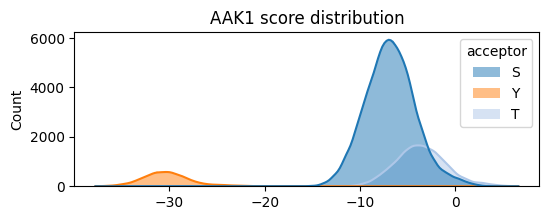

# Plot reactome pathways: PSPA


<!-- WARNING: THIS FILE WAS AUTOGENERATED! DO NOT EDIT! -->

``` python
from katlas.pssm import *
from katlas.score import *
from katlas.data import *
from katlas.plot import *
from katlas.pathway import *
from katlas.utils import *
import pandas as pd,seaborn as sns
from matplotlib import pyplot as plt
from tqdm import tqdm
import time, random
```

## Data

``` python
pspa_info=pd.read_parquet('raw/pspa_path_info.parquet')
df=pd.read_parquet('raw/pspa_score_df.parquet')
```

``` python
thr_cols = ['S_thr','T_thr','Y_thr']
gene_cols = ['S_genes','T_genes','Y_genes']
cnt_cols = ['S_cnt','T_cnt','Y_cnt']
site_cols = ['S_sites','T_sites','Y_sites']
```

## Site pssms

``` python
human_site= Data.get_human_site()
seq_map = human_site.set_index('sub_site')['site_seq']
```

``` python
series=pspa_info.iloc[0]
```

``` python
def get_site_pssm(series):
    pssm_dict = {}
    count_dict={}
    for acceptor, sites in zip(['S','T','Y'],series[site_cols]):
        sites=list(sites)
        if sites:
            pssm = get_prob(seq_map[sites])
            key = series.name+'_'+acceptor
            pssm_dict[key] = pd.Series(flatten_pssm(pssm))
            count_dict[key]=len(sites)
    return pssm_dict,count_dict
```

``` python
pssm_out = {}
count_out = {}
for i,r in pspa_info.iterrows():
    pssms,counts = get_site_pssm(r)
    pssm_out.update(pssms)
    count_out.update(counts)
    # break
```

``` python
site_pssms = pd.DataFrame(pssm_out).T
```

``` python
pspa_info.index[314:]
```

    Index(['MATK', 'DDR1', 'DDR2', 'EGFR', 'EPHA1', 'EPHA2', 'EPHA3', 'EPHA4',
           'EPHA5', 'EPHA6', 'EPHA7', 'EPHA8', 'EPHB1', 'EPHB2', 'EPHB3', 'EPHB4',
           'BMX', 'PTK2', 'FER', 'FES', 'FGFR1', 'FGFR2', 'FGFR3', 'FGFR4', 'FGR',
           'FLT3', 'FRK', 'FYN', 'HCK', 'ERBB2', 'ERBB4', 'IGF1R', 'INSR', 'INSRR',
           'ITK', 'JAK1', 'JAK2', 'JAK3', 'KIT', 'LCK', 'LIMK1_TYR', 'LIMK2_TYR',
           'LTK', 'LYN', 'MERTK', 'MET', 'MAP2K4_TYR', 'MAP2K6_TYR', 'MAP2K7_TYR',
           'MST1R', 'MUSK', 'PKMYT1_TYR', 'NEK10_TYR', 'PDGFRA', 'PDGFRB',
           'PDHK1_TYR', 'PDHK3_TYR', 'PDHK4_TYR', 'PINK1_TYR', 'PTK2B', 'RET',
           'ROS1', 'SRC', 'SRMS', 'SYK', 'TEC', 'TESK1_TYR', 'TEK', 'TNK1',
           'TNNI3K_TYR', 'NTRK1', 'NTRK2', 'NTRK3', 'TXK', 'TYK2', 'TYRO3', 'FLT1',
           'KDR', 'FLT4', 'WEE1_TYR', 'YES1', 'ZAP70'],
          dtype='object', name='kinase')

``` python
for k in tqdm(pspa_info.index,total=len(pspa_info)):
    k_pssms = site_pssms[site_pssms.index.str.contains(f'{k}_')]
    plot_logos(k_pssms,count_dict=count_out)
    path = prepare_path(f'fig/pspa/{k}/path/logo.svg')
    save_show(path)
    # break
```

    100%|█████████████████████████████████████████████████████████████| 82/82 [06:25<00:00,  4.70s/it]

``` python
site_pssms.to_parquet('raw/pspa_site_pssm.parquet')
```

## Plot distribution

``` python
def plot_hist(df,
              kinase,
              sty_thr=None, # dict of thresholds per acceptor
              hue='acceptor'):
    
    "Plot histogram of a column (kinase). "
    
    plt.figure(figsize=(6,2))

    hist_params = {'element':'poly',
              'edgecolor': None,
              'alpha':0.5,
              'bins':100,
              'kde':True,
              'palette':sty_color}
    
    sns.histplot(data=df,x=kinase,hue=hue,**hist_params)
    
    plt.xlabel('')
    plt.title(f'{kinase} score distribution')

    if sty_thr:
        for acceptor,thr in sty_thr.items():
            if thr is not None:
                plt.axvline(thr,color=sty_color[acceptor])
```

``` python
plot_hist(df,'AAK1')
```



``` python
for k,r in tqdm(pspa_info.iterrows(),total=len(pspa_info)):
    sty_thr=r[thr_cols].rename(index={'S_thr':'S','T_thr':'T','Y_thr':'Y'})[lambda x: x!=0].to_dict()
    plot_hist(df,k,sty_thr=sty_thr)
    save_show(f'fig/pspa/{k}/path/hist.svg',show_only=False)
```

    100%|███████████████████████████████████████████████████████████| 396/396 [04:01<00:00,  1.64it/s]

## Plot reactome pathway

``` python
info = Data.get_kinase_info()
```

``` python
info = info[info.pseudo=='0']
```

``` python
info.uniprot.duplicated().sum()
```

    np.int64(0)

``` python
kinase_map = info.set_index('kinase')['uniprot']
```

``` python
def get_path(series):
    out = get_reactome(series['genes'],p_type='p')
    kinase=series.name.split('_')[0] # for those with _TRY, need to remove that
    uniprot = kinase_map[kinase]
    out = add_reactome_ref(out,uniprot)
    exclude=['GTPase','SUMO']
    out = out[~out.name.str.contains('|'.join(exclude))]
    return out
```

``` python
show_only=False
```

``` python
pspa_info.index.get_loc('PKG1')
```

    234

``` python
len(pspa_info)
```

    396

``` python
for i,(k,r) in enumerate(pspa_info.iloc[234:].iterrows()):
    print(i,':',k)
    save_dir = f'fig/pspa/{k}/path'
    
    path_df = get_path(r)
    path_df.to_parquet(f'{save_dir}/path.parquet')

    plot_path(path_df,p_type='p',ref_col='ref_path',top_n=15,max_label_length=55)
    plt.title('Reactome pathways of substrates based on scores')
    save_show(f'{save_dir}/path.svg',show_only=show_only)

    if path_df.ref_path.sum()!=0:
        accuracy = get_overlap(path_df, ref_col='ref_path',plot=True,p_type='p',figsize=(5,3))
        plt.title(f'Distribution of –log₁₀(p) for reference pathways')
        save_show(f'{save_dir}/overlap.svg',show_only=show_only)

    if path_df.ref_path_lowest.sum()!=0:
        accuracy_lo = get_overlap(path_df, ref_col='ref_path_lowest',plot=True,p_type='p',figsize=(5,3))
        plt.title(f'Distribution of –log₁₀(p) for reference pathways \n(lowest-level)')
        save_show(f'{save_dir}/overlap_lo.svg',show_only=show_only)
    plt.close('all')
    # break
    
    # ✅ polite delay to avoid API throttling
    delay = random.uniform(1.5, 4)
    print(f"Sleeping {delay:.2f}s before next kinase...")
    time.sleep(delay)
```

    0 : PKG1
    Running pathway anlysis
    Done
    Sleeping 1.76s before next kinase...
    1 : PKG2
    Running pathway anlysis
    Done
    Sleeping 3.58s before next kinase...
    2 : PKN1
    Running pathway anlysis
    Done
    Sleeping 3.84s before next kinase...
    3 : PKN2
    Running pathway anlysis
    Done
    Sleeping 1.53s before next kinase...
    4 : PKN3
    Running pathway anlysis
    Done
    Sleeping 3.71s before next kinase...
    5 : PKR
    Running pathway anlysis
    Done
    Sleeping 2.22s before next kinase...
    6 : PLK1
    Running pathway anlysis
    Done
    Sleeping 2.26s before next kinase...
    7 : PLK2
    Running pathway anlysis
    Done
    Sleeping 3.69s before next kinase...
    8 : PLK3
    Running pathway anlysis
    Done
    Sleeping 3.72s before next kinase...
    9 : PLK4
    Running pathway anlysis
    Done
    Sleeping 2.47s before next kinase...
    10 : PRKD1
    Running pathway anlysis
    Done
    Sleeping 3.57s before next kinase...
    11 : PRKD2
    Running pathway anlysis
    Done
    Sleeping 3.49s before next kinase...
    12 : PRKD3
    Running pathway anlysis
    Done
    Sleeping 2.62s before next kinase...
    13 : PRKX
    Running pathway anlysis
    Done
    Sleeping 1.52s before next kinase...
    14 : PRP4
    Running pathway anlysis
    Done
    Sleeping 3.73s before next kinase...
    15 : PRPK
    Running pathway anlysis
    Done
    Sleeping 3.47s before next kinase...
    16 : QIK
    Running pathway anlysis
    Done
    Sleeping 3.01s before next kinase...
    17 : QSK
    Running pathway anlysis
    Done
    Sleeping 3.31s before next kinase...
    18 : RAF1
    Running pathway anlysis
    Done
    Sleeping 3.83s before next kinase...
    19 : RIPK1
    Running pathway anlysis
    Done
    Sleeping 2.40s before next kinase...
    20 : RIPK2
    Running pathway anlysis
    Done
    Sleeping 2.06s before next kinase...
    21 : RIPK3
    Running pathway anlysis
    Done
    Sleeping 2.47s before next kinase...
    22 : ROCK1
    Running pathway anlysis
    Done
    Sleeping 1.61s before next kinase...
    23 : ROCK2
    Running pathway anlysis
    Done
    Sleeping 3.03s before next kinase...
    24 : RSK2
    Running pathway anlysis
    Done
    Sleeping 3.97s before next kinase...
    25 : RSK3
    Running pathway anlysis
    Done
    Sleeping 2.58s before next kinase...
    26 : RSK4
    Running pathway anlysis
    Done
    Sleeping 3.62s before next kinase...
    27 : SBK
    Running pathway anlysis
    Done
    Sleeping 3.00s before next kinase...
    28 : SGK1
    Running pathway anlysis
    Done
    Sleeping 3.17s before next kinase...
    29 : SGK3
    Running pathway anlysis
    Done
    Sleeping 3.48s before next kinase...
    30 : SIK
    Running pathway anlysis
    Done
    Sleeping 1.87s before next kinase...
    31 : SKMLCK
    Running pathway anlysis
    Done
    Sleeping 3.27s before next kinase...
    32 : SLK
    Running pathway anlysis
    Done
    Sleeping 2.15s before next kinase...
    33 : SMG1
    Running pathway anlysis
    Done
    Sleeping 3.51s before next kinase...
    34 : SMMLCK
    Running pathway anlysis
    Done
    Sleeping 3.48s before next kinase...
    35 : SNRK
    Running pathway anlysis
    Done
    Sleeping 3.78s before next kinase...
    36 : SRPK1
    Running pathway anlysis
    Done
    Sleeping 3.51s before next kinase...
    37 : SRPK2
    Running pathway anlysis
    Done
    Sleeping 2.69s before next kinase...
    38 : SRPK3
    Running pathway anlysis
    Done
    Sleeping 2.74s before next kinase...
    39 : SSTK
    Running pathway anlysis
    Done
    Sleeping 3.58s before next kinase...
    40 : STK33
    Running pathway anlysis
    Done
    Sleeping 2.59s before next kinase...
    41 : STLK3
    Running pathway anlysis
    Done
    Sleeping 2.64s before next kinase...
    42 : TAK1
    Running pathway anlysis
    Done
    Sleeping 2.17s before next kinase...
    43 : TAO1
    Running pathway anlysis
    Done
    Sleeping 1.69s before next kinase...
    44 : TAO2
    Running pathway anlysis
    Done
    Sleeping 2.43s before next kinase...
    45 : TAO3
    Running pathway anlysis
    Done
    Sleeping 2.88s before next kinase...
    46 : TBK1
    Running pathway anlysis
    Done
    Sleeping 2.63s before next kinase...
    47 : TGFBR1
    Running pathway anlysis
    Done
    Sleeping 1.83s before next kinase...
    48 : TGFBR2
    Running pathway anlysis
    Done
    Sleeping 2.46s before next kinase...
    49 : TLK1
    Running pathway anlysis
    Done
    Sleeping 3.56s before next kinase...
    50 : TLK2
    Running pathway anlysis
    Done
    Sleeping 3.43s before next kinase...
    51 : TNIK
    Running pathway anlysis
    Done
    Sleeping 3.14s before next kinase...
    52 : TSSK1
    Running pathway anlysis
    Done
    Sleeping 2.08s before next kinase...
    53 : TSSK2
    Running pathway anlysis
    Done
    Sleeping 3.35s before next kinase...
    54 : TTBK1
    Running pathway anlysis
    Done
    Sleeping 1.84s before next kinase...
    55 : TTBK2
    Running pathway anlysis
    Done
    Sleeping 3.96s before next kinase...
    56 : TTK
    Running pathway anlysis
    Done
    Sleeping 1.95s before next kinase...
    57 : ULK1
    Running pathway anlysis
    Done
    Sleeping 1.50s before next kinase...
    58 : ULK2
    Running pathway anlysis
    Done
    Sleeping 3.75s before next kinase...
    59 : VRK1
    Running pathway anlysis
    Done
    Sleeping 1.69s before next kinase...
    60 : VRK2
    Running pathway anlysis
    Done
    Sleeping 2.76s before next kinase...
    61 : WNK1
    Running pathway anlysis
    Done
    Sleeping 2.50s before next kinase...
    62 : WNK3
    Running pathway anlysis
    Done
    Sleeping 2.96s before next kinase...
    63 : WNK4
    Running pathway anlysis
    Done
    Sleeping 2.90s before next kinase...
    64 : YANK2
    Running pathway anlysis
    Done
    Sleeping 2.29s before next kinase...
    65 : YANK3
    Running pathway anlysis
    Done
    Sleeping 3.09s before next kinase...
    66 : YSK1
    Running pathway anlysis
    Done
    Sleeping 2.05s before next kinase...
    67 : YSK4
    Running pathway anlysis
    Done
    Sleeping 3.41s before next kinase...
    68 : ZAK
    Running pathway anlysis
    Done
    Sleeping 2.01s before next kinase...
    69 : ABL1
    Running pathway anlysis
    Done
    Sleeping 2.62s before next kinase...
    70 : TNK2
    Running pathway anlysis
    Done
    Sleeping 1.94s before next kinase...
    71 : ALK
    Running pathway anlysis
    Done
    Sleeping 2.47s before next kinase...
    72 : ABL2
    Running pathway anlysis
    Done
    Sleeping 2.07s before next kinase...
    73 : AXL
    Running pathway anlysis
    Done
    Sleeping 2.26s before next kinase...
    74 : BLK
    Running pathway anlysis
    Done
    Sleeping 3.63s before next kinase...
    75 : BMPR2_TYR
    Running pathway anlysis
    Done
    Sleeping 2.52s before next kinase...
    76 : PTK6
    Running pathway anlysis
    Done
    Sleeping 1.56s before next kinase...
    77 : BTK
    Running pathway anlysis
    Done
    Sleeping 3.41s before next kinase...
    78 : CSF1R
    Running pathway anlysis
    Done
    Sleeping 2.02s before next kinase...
    79 : CSK
    Running pathway anlysis
    Done
    Sleeping 3.02s before next kinase...
    80 : MATK
    Running pathway anlysis
    Done
    Sleeping 2.36s before next kinase...
    81 : DDR1
    Running pathway anlysis
    Done
    Sleeping 3.25s before next kinase...
    82 : DDR2
    Running pathway anlysis
    Done
    Sleeping 3.56s before next kinase...
    83 : EGFR
    Running pathway anlysis
    Done
    Sleeping 3.61s before next kinase...
    84 : EPHA1
    Running pathway anlysis
    Done
    Sleeping 2.18s before next kinase...
    85 : EPHA2
    Running pathway anlysis
    Done
    Sleeping 2.43s before next kinase...
    86 : EPHA3
    Running pathway anlysis
    Done
    Sleeping 2.56s before next kinase...
    87 : EPHA4
    Running pathway anlysis
    Done
    Sleeping 2.86s before next kinase...
    88 : EPHA5
    Running pathway anlysis
    Done
    Sleeping 1.78s before next kinase...
    89 : EPHA6
    Running pathway anlysis
    Done
    Sleeping 3.61s before next kinase...
    90 : EPHA7
    Running pathway anlysis
    Done
    Sleeping 1.55s before next kinase...
    91 : EPHA8
    Running pathway anlysis
    Done
    Sleeping 3.87s before next kinase...
    92 : EPHB1
    Running pathway anlysis
    Done
    Sleeping 3.94s before next kinase...
    93 : EPHB2
    Running pathway anlysis
    Done
    Sleeping 1.95s before next kinase...
    94 : EPHB3
    Running pathway anlysis
    Done
    Sleeping 3.85s before next kinase...
    95 : EPHB4
    Running pathway anlysis
    Done
    Sleeping 3.69s before next kinase...
    96 : BMX
    Running pathway anlysis
    Done
    Sleeping 2.42s before next kinase...
    97 : PTK2
    Running pathway anlysis
    Done
    Sleeping 2.28s before next kinase...
    98 : FER
    Running pathway anlysis
    Done
    Sleeping 3.62s before next kinase...
    99 : FES
    Running pathway anlysis
    Done
    Sleeping 2.71s before next kinase...
    100 : FGFR1
    Running pathway anlysis
    Done
    Sleeping 3.76s before next kinase...
    101 : FGFR2
    Running pathway anlysis
    Done
    Sleeping 3.21s before next kinase...
    102 : FGFR3
    Running pathway anlysis
    Done
    Sleeping 3.76s before next kinase...
    103 : FGFR4
    Running pathway anlysis
    Done
    Sleeping 1.92s before next kinase...
    104 : FGR
    Running pathway anlysis
    Done
    Sleeping 3.07s before next kinase...
    105 : FLT3
    Running pathway anlysis
    Done
    Sleeping 2.74s before next kinase...
    106 : FRK
    Running pathway anlysis
    Done
    Sleeping 2.29s before next kinase...
    107 : FYN
    Running pathway anlysis
    Done
    Sleeping 3.96s before next kinase...
    108 : HCK
    Running pathway anlysis
    Done
    Sleeping 3.79s before next kinase...
    109 : ERBB2
    Running pathway anlysis
    Done
    Sleeping 3.60s before next kinase...
    110 : ERBB4
    Running pathway anlysis
    Done
    Sleeping 2.30s before next kinase...
    111 : IGF1R
    Running pathway anlysis
    Done
    Sleeping 3.69s before next kinase...
    112 : INSR
    Running pathway anlysis
    Done
    Sleeping 1.54s before next kinase...
    113 : INSRR
    Running pathway anlysis
    Done
    Sleeping 2.27s before next kinase...
    114 : ITK
    Running pathway anlysis
    Done
    Sleeping 2.54s before next kinase...
    115 : JAK1
    Running pathway anlysis
    Done
    Sleeping 3.95s before next kinase...
    116 : JAK2
    Running pathway anlysis
    Done
    Sleeping 2.08s before next kinase...
    117 : JAK3
    Running pathway anlysis
    Done
    Sleeping 2.74s before next kinase...
    118 : KIT
    Running pathway anlysis
    Done
    Sleeping 3.46s before next kinase...
    119 : LCK
    Running pathway anlysis
    Done
    Sleeping 3.49s before next kinase...
    120 : LIMK1_TYR
    Running pathway anlysis
    Done
    Sleeping 3.55s before next kinase...
    121 : LIMK2_TYR
    Running pathway anlysis
    Done
    Sleeping 1.64s before next kinase...
    122 : LTK
    Running pathway anlysis
    Done
    Sleeping 3.52s before next kinase...
    123 : LYN
    Running pathway anlysis
    Done
    Sleeping 1.60s before next kinase...
    124 : MERTK
    Running pathway anlysis
    Done
    Sleeping 3.30s before next kinase...
    125 : MET
    Running pathway anlysis
    Done
    Sleeping 2.94s before next kinase...
    126 : MAP2K4_TYR
    Running pathway anlysis
    Done
    Sleeping 3.77s before next kinase...
    127 : MAP2K6_TYR
    Running pathway anlysis
    Done
    Sleeping 3.20s before next kinase...
    128 : MAP2K7_TYR
    Running pathway anlysis
    Done
    Sleeping 3.93s before next kinase...
    129 : MST1R
    Running pathway anlysis
    Done
    Sleeping 2.87s before next kinase...
    130 : MUSK
    Running pathway anlysis
    Done
    Sleeping 1.81s before next kinase...
    131 : PKMYT1_TYR
    Running pathway anlysis
    Done
    Sleeping 1.62s before next kinase...
    132 : NEK10_TYR
    Running pathway anlysis
    Done
    Sleeping 2.77s before next kinase...
    133 : PDGFRA
    Running pathway anlysis
    Done
    Sleeping 2.99s before next kinase...
    134 : PDGFRB
    Running pathway anlysis
    Done
    Sleeping 2.59s before next kinase...
    135 : PDHK1_TYR
    Running pathway anlysis
    Done
    Sleeping 3.13s before next kinase...
    136 : PDHK3_TYR
    Running pathway anlysis
    Done
    Sleeping 1.88s before next kinase...
    137 : PDHK4_TYR
    Running pathway anlysis
    Done
    Sleeping 2.94s before next kinase...
    138 : PINK1_TYR
    Running pathway anlysis
    Done
    Sleeping 1.71s before next kinase...
    139 : PTK2B
    Running pathway anlysis
    Done
    Sleeping 1.73s before next kinase...
    140 : RET
    Running pathway anlysis
    Done
    Sleeping 2.62s before next kinase...
    141 : ROS1
    Running pathway anlysis
    Done
    Sleeping 2.28s before next kinase...
    142 : SRC
    Running pathway anlysis
    Done
    Sleeping 2.51s before next kinase...
    143 : SRMS
    Running pathway anlysis
    Done
    Sleeping 3.57s before next kinase...
    144 : SYK
    Running pathway anlysis
    Done
    Sleeping 1.58s before next kinase...
    145 : TEC
    Running pathway anlysis
    Done
    Sleeping 3.28s before next kinase...
    146 : TESK1_TYR
    Running pathway anlysis
    Done
    Sleeping 1.95s before next kinase...
    147 : TEK
    Running pathway anlysis
    Done
    Sleeping 3.01s before next kinase...
    148 : TNK1
    Running pathway anlysis
    Done
    Sleeping 2.26s before next kinase...
    149 : TNNI3K_TYR
    Running pathway anlysis
    Done
    Sleeping 2.93s before next kinase...
    150 : NTRK1
    Running pathway anlysis
    Done
    Sleeping 1.59s before next kinase...
    151 : NTRK2
    Running pathway anlysis
    Done
    Sleeping 2.25s before next kinase...
    152 : NTRK3
    Running pathway anlysis
    Done
    Sleeping 3.27s before next kinase...
    153 : TXK
    Running pathway anlysis
    Done
    Sleeping 2.32s before next kinase...
    154 : TYK2
    Running pathway anlysis
    Done
    Sleeping 2.02s before next kinase...
    155 : TYRO3
    Running pathway anlysis
    Done
    Sleeping 3.15s before next kinase...
    156 : FLT1
    Running pathway anlysis
    Done
    Sleeping 2.19s before next kinase...
    157 : KDR
    Running pathway anlysis
    Done
    Sleeping 3.82s before next kinase...
    158 : FLT4
    Running pathway anlysis
    Done
    Sleeping 2.05s before next kinase...
    159 : WEE1_TYR
    Running pathway anlysis
    Done
    Sleeping 1.99s before next kinase...
    160 : YES1
    Running pathway anlysis
    Done
    Sleeping 3.00s before next kinase...
    161 : ZAP70
    Running pathway anlysis
    Done
    Sleeping 2.91s before next kinase...

## Get accuracy for overlap pathways

``` python
acc_dict, num_dict = {}, {}
acc_lo_dict, num_lo_dict = {}, {}

for k,r in pspa_info.iterrows():
    save_dir = f'fig/pspa/{k}/path'
    
    path_df=pd.read_parquet(f'{save_dir}/path.parquet')

    if path_df.ref_path.sum()!=0:
        accuracy = get_overlap(path_df, ref_col='ref_path',plot=False,p_type='p')
        acc_dict[k] = accuracy
        num_dict[k] =path_df.ref_path.sum()

    if path_df.ref_path_lowest.sum()!=0:
        accuracy_lo = get_overlap(path_df, ref_col='ref_path_lowest',plot=False,p_type='p')
        acc_lo_dict[k] = accuracy_lo
        num_lo_dict[k] = path_df.ref_path_lowest.sum()
    # break
```

``` python
pspa_info['accuracy'] = acc_dict
pspa_info['accuracy_lowest'] = acc_lo_dict

pspa_info['path_num'] = num_dict
pspa_info['path_lowest_num'] = num_lo_dict
```

``` python
pspa_info['path_num'] = pspa_info['path_num'].fillna(0).astype(int)
pspa_info['path_lowest_num'] = pspa_info['path_lowest_num'].fillna(0).astype(int)
```

``` python
pspa_info.to_parquet('raw/pspa_path_info.parquet')
```

## Pathway hue

``` python
pspa_info=pd.read_parquet('raw/pspa_path_info.parquet')
```

``` python
def plot_path_hist(df,
              colname,
              **kwargs,
              ):
    
    "Plot histogram of a column (kinase). "
    
    plt.figure(figsize=(6,2))

    hist_params = {'element':'poly',
              'edgecolor': None,
              'alpha':0.5,
              'bins':100,
              'kde':True,
              }
    
    sns.histplot(data=df,x=colname,**kwargs, **hist_params)
    
    plt.xlabel('')
    plt.title(f'Accuracy score distribution')
```

``` python
q75, q50 = pspa_info.path_num[lambda x: x!=0].quantile([0.75,0.5])
q75, q50
```

    (33.75, 11.0)

``` python
def categorize_path_num(x):
    if x >= q75: return f'well known (≥{q75:.0f})'
    elif x <= q50: return f'less known (≤{q50:.0f})'
    else: return f'middle ({q50:.0f}–{q75:.0f})'
```

``` python
pspa_info['category'] = pspa_info['path_num'].apply(categorize_path_num)
```

``` python
pspa_info['category'].value_counts()
```

    category
    less known (≤11)    253
    well known (≥34)     74
    middle (11–34)       69
    Name: count, dtype: int64

``` python
pspa_info.hist(column='accuracy', by='category', bins=50, figsize=(8,6));
```


``` python
pspa_info[pspa_info.path_num>12].accuracy.hist(bins=50,figsize=(5,3))
plt.xlabel('Accuracy')
plt.ylabel('Number of kinases')
plt.title('PSPA accuracy distribution');
```


### Lowest

``` python
pspa_info.path_lowest_num[lambda x: x!=0].quantile([0.75])
```

    0.75    10.0
    Name: path_lowest_num, dtype: float64

``` python
pspa_info[pspa_info.path_lowest_num>10].accuracy.hist(bins=50,figsize=(5,3))
plt.xlabel('Accuracy')
plt.ylabel('Number of kinases')
plt.title('PSPA accuracy distribution (lowest-level)');
```


