# Scoring evaluation


<!-- WARNING: THIS FILE WAS AUTOGENERATED! DO NOT EDIT! -->

``` python
from katlas.core import *
from katlas.plot import *
import pandas as pd,numpy as np
from matplotlib import pyplot as plt
```

## Load PSSM/LO

``` python
LO = pd.read_parquet('out/CDDM_pssms_LO_eval_psp_02.parquet')
```

``` python
pspa = pd.read_parquet('raw/overlap_pspa.parquet')
```

``` python
LO.index = LO.index.str.split('_').str[1]
pspa.index = pspa.index.str.split('_').str[1]
```

``` python
LO = LO[LO.index.isin(pspa.index)]
```

``` python
LO.shape, pspa.shape
```

    ((312, 943), (312, 236))

## Dataset to be scored

``` python
df =pd.read_parquet('out/CDDM_test_set.parquet')
```

``` python
df['site_seq_upper'] = df.site_seq.str.upper()
```

``` python
# only filter those with tested kinase
df = df[df.kinase_protein.isin(pspa.index)].copy()
```

    NameError: name 'pspa' is not defined
    ---------------------------------------------------------------------------
    NameError                                 Traceback (most recent call last)
    Cell In[4], line 2
          1 # only filter those with tested kinase
    ----> 2 df = df[df.kinase_protein.isin(pspa.index)].copy()

    NameError: name 'pspa' is not defined

``` python
df.shape
```

    (2484, 24)

``` python
def split_data(df):
    df_st = df[df.kinase_group !='TK'].copy().reset_index(drop=True)
    df_tyr = df[df.kinase_group =='TK'].copy().reset_index(drop=True)
    
    df_st = df_st[df_st.site_seq.str[20]!='y'].copy().reset_index(drop=True)
    df_tyr = df_tyr[df_tyr.site_seq.str[20]=='y'].copy().reset_index(drop=True)
    return df_st, df_tyr
```

``` python
df_st, df_tyr = split_data(df)
```

## Scoring

``` python
group_map = df[['kinase_protein','kinase_group']].drop_duplicates().set_index('kinase_protein')['kinase_group']
TK = group_map[group_map=='TK'].index
ST = group_map[group_map!='TK'].index
```

``` python
def split_ref(ref):
    ref_st = ref[ref.index.isin(ST)].copy()
    ref_tk = ref[ref.index.isin(TK)].copy()
    return ref_st,ref_tk
```

``` python
ref_st,ref_tk = split_ref(LO)
```

``` python
ref_st.shape, ref_tk.shape
```

    ((213, 943), (71, 943))

``` python
def get_kinase_rank(row_index,df,result):
    kinase = df.loc[row_index, 'kinase_protein']
    scores = result.loc[row_index]
    ranked = scores.sort_values(ascending=False)
    rank = ranked.index.get_loc(kinase) + 1  # +1 to make rank start from 1
    return rank
```

``` python
human =Data.get_human_site()
```

    CPU times: user 176 ms, sys: 224 ms, total: 400 ms
    Wall time: 2.86 s

``` python
human['site_seq_upper'] = human.site_seq.str.upper()
```

``` python
human = human.drop_duplicates('site_seq').reset_index()
```

``` python
def score_data(df,ref,seq_col='site_seq',func=sumup,pct_ref=None):
    df_st, df_tyr = split_data(df)
    ref_st,ref_tk = split_ref(ref)
    
    df_st_result = predict_kinase_df(df_st,seq_col=seq_col,ref=ref_st,func=func)
    df_tyr_result = predict_kinase_df(df_tyr,seq_col=seq_col,ref=ref_tk,func=func)
    
    if pct_ref is not None:
        df_st_result = get_pct_df(df_st_result,pct_ref)
        df_tyr_result = get_pct_df(df_tyr_result,pct_ref)
    
    df_st['rank'] = df_st_result.index.to_series().apply(lambda idx: get_kinase_rank(idx,df_st,df_st_result))
    df_tyr['rank'] = df_tyr_result.index.to_series().apply(lambda idx: get_kinase_rank(idx,df_tyr,df_tyr_result))
    
    return df_st,df_tyr,df_st_result,df_tyr_result
```

``` python
def get_ref(df, pssm, seq_col='site_seq', func=sumup, n_chunk=5):
    chunk_size = (len(df) + n_chunk - 1) // n_chunk  # ceiling division
    pct_refs = []
    for i in range(n_chunk):
        start = i * chunk_size
        end = min((i + 1) * chunk_size, len(df))
        if start >= end:
            break
        print(f"Processing chunk {i+1}/{n_chunk} → rows {start}:{end}")
        sub_df = df.iloc[start:end]
        pct_ref = predict_kinase_df(
            sub_df,
            seq_col=seq_col,
            ref=pssm,
            func=func
        )
        pct_refs.append(pct_ref)
    return pd.concat(pct_refs, ignore_index=True)
```

``` python
# pct_ref = get_ref(human,LO)
```

``` python
df_st_result = predict_kinase_df(df_st,seq_col='site_seq',ref=ref_st,func=sumup)
```

    input dataframe has a length 2082
    Preprocessing
    Finish preprocessing
    Merging reference
    Finish merging

``` python
df_st_result_pct = get_pct_df(df_st_result,pct_ref)
```

    100%|██████████████████████████████████████████████████████████████████████████| 213/213 [00:00<00:00, 642.51it/s]

``` python
pct_ref = predict_kinase_df(human.iloc[:len(human)//2],seq_col='site_seq',ref=LO,func=sumup)
```

    input dataframe has a length 58868
    Preprocessing
    Finish preprocessing
    Merging reference
    Finish merging

``` python
df_st,df_tyr,df_st_result,df_tyr_result = score_data(df,LO)
```

``` python
df_st['rank'].mean()
```

    41.78866474543708

``` python
df_tyr['rank'].mean()
```

    np.float64(22.426315789473684)

## Top 5/10

``` python
def top_k_accuracy(df, result, k):
    def is_in_top_k(row_index):
        kinase = df.loc[row_index, 'kinase_protein']
        scores = result.loc[row_index]
        top_k = scores.nlargest(k).index
        return kinase in top_k

    return result.index.to_series().apply(is_in_top_k).mean()
```

``` python
# top10_st = top_k_accuracy(df_st, df_st_result, 10)
# top10_tyr = top_k_accuracy(df_tyr, df_tyr_result, 10)
```

``` python
# print(f"Top-10 ST accuracy: {top10_st:.3f}")
# print(f"Top-10 Tyr accuracy: {top10_tyr:.3f}")
```

## Group topk

``` python
def top_k_accuracy_group(group_indices,df,result, k=10):
    def is_correct(row_index):
        kinase = df.loc[row_index, 'kinase_protein']
        scores = result.loc[row_index]
        top_k = scores.nlargest(k).index
        return kinase in top_k

    return pd.Series(group_indices).apply(is_correct).mean()
```

``` python
def get_topk(df,result,k=10):
    grouped = df.groupby('kinase_group').groups
    
    topk_scores = {
        subfam: top_k_accuracy_group(indices,df,result,k=k)
        for subfam, indices in grouped.items()}
    
    topk_df = pd.DataFrame.from_dict(topk_scores, orient='index', columns=['top10_accuracy']).sort_values('top10_accuracy', ascending=False)
    return topk_df
```

``` python
def get_group_topk(df_st,df_tyr,df_st_result,df_tyr_result):

    topk_st = get_topk(df_st,df_st_result)
    topk_tyr = get_topk(df_tyr,df_tyr_result)
    
    topk = pd.concat([topk_st,topk_tyr]).sort_values('top10_accuracy',ascending=False)

    return topk
```

``` python
def get_results(df_st,df_tyr,df_st_result,df_tyr_result):
    topk = get_group_topk(df_st,df_tyr,df_st_result,df_tyr_result)
    aucdf_st = get_AUCDF(df_st,'rank')
    aucdf_tyr = get_AUCDF(df_tyr,'rank')
    
    return topk, aucdf_st,aucdf_tyr
```

``` python
topk,aucdf_st,aucdf_tyr = get_results(df_st,df_tyr,df_st_result,df_tyr_result)
```

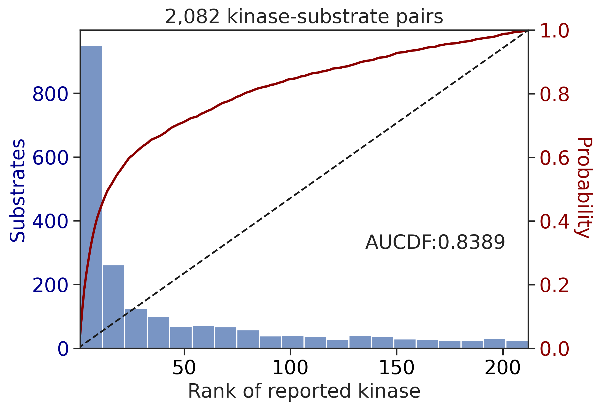


``` python
topk
```

<div>
<style scoped>
    .dataframe tbody tr th:only-of-type {
        vertical-align: middle;
    }
&#10;    .dataframe tbody tr th {
        vertical-align: top;
    }
&#10;    .dataframe thead th {
        text-align: right;
    }
</style>

<table class="dataframe" data-quarto-postprocess="true" data-border="1">
<thead>
<tr style="text-align: right;">
<th data-quarto-table-cell-role="th"></th>
<th data-quarto-table-cell-role="th">top10_accuracy</th>
</tr>
</thead>
<tbody>
<tr>
<td data-quarto-table-cell-role="th">CMGC</td>
<td>0.637191</td>
</tr>
<tr>
<td data-quarto-table-cell-role="th">Atypical</td>
<td>0.452055</td>
</tr>
<tr>
<td data-quarto-table-cell-role="th">AGC</td>
<td>0.422397</td>
</tr>
<tr>
<td data-quarto-table-cell-role="th">TK</td>
<td>0.394737</td>
</tr>
<tr>
<td data-quarto-table-cell-role="th">CAMK</td>
<td>0.266289</td>
</tr>
<tr>
<td data-quarto-table-cell-role="th">STE</td>
<td>0.160494</td>
</tr>
<tr>
<td data-quarto-table-cell-role="th">CK1</td>
<td>0.158730</td>
</tr>
<tr>
<td data-quarto-table-cell-role="th">Other</td>
<td>0.153846</td>
</tr>
<tr>
<td data-quarto-table-cell-role="th">NEK</td>
<td>0.125000</td>
</tr>
<tr>
<td data-quarto-table-cell-role="th">TKL</td>
<td>0.097561</td>
</tr>
</tbody>
</table>

</div>

percentile later

## Overall

pspa

``` python
pspa = pd.read_parquet('raw/overlap_pspa.parquet')
pspa.index = pspa.index.str.split('_').str[1]
pspa.shape
```

    (312, 236)

Data to be scored

``` python
df =pd.read_parquet('out/CDDM_test_set.parquet')
```

``` python
df['site_seq_upper'] = df.site_seq.str.upper()
```

``` python
# only filter those with tested kinase
df = df[df.kinase_protein.isin(pspa.index)].copy()
```

``` python
df.shape
```

    (2484, 24)

``` python
group_map = df[['kinase_protein','kinase_group']].drop_duplicates().set_index('kinase_protein')['kinase_group']
TK = group_map[group_map=='TK'].index
ST = group_map[group_map!='TK'].index
```

``` python
def prepare_ref(path):
    ref = pd.read_parquet(path)
    ref.index = ref.index.str.split('_').str[1]
    ref = ref[ref.index.isin(pspa.index)]
    print(ref.shape)
    return ref
```

cddm:

``` python
cddm = prepare_ref('out/CDDM_pssms_eval_psp_02.parquet')
cddm_upper = prepare_ref('out/CDDM_pssms_eval_upper_psp_02.parquet')

cddm_lo = prepare_ref('out/CDDM_pssms_LO_eval_psp_02.parquet')
cddm_lo_upper = prepare_ref('out/CDDM_pssms_LO_eval_upper_psp_02.parquet')
```

    (312, 943)
    (312, 943)
    (312, 943)
    (312, 943)

``` python
# ref_dict = {
#     'PSPA: PSSM + multiply': (pspa,'site_seq',multiply,False),
#     'CDDM: PSSM + multiply': (cddm, 'site_seq', multiply_23,False),
#     'CDDM: PSSM upper + multiply': (cddm_upper, 'site_seq_upper', multiply_20,False),
#     'CDDM: LO + sum': (cddm_lo, 'site_seq',sumup,False),
#     'CDDM: LO upper + sum': (cddm_lo_upper, 'site_seq_upper',sumup,False),
# }

# for name,(ref,seq_col,func,_) in ref_dict.items():
#     print(name)
#     pct_ref = get_ref(human,pssm=ref,seq_col=seq_col,func=func)
#     pct_ref.to_parquet(f'raw/{name}.parquet')
#     print(pct_ref.head())
#     # break
```

``` python
ref_dict = {
    'PSPA: PSSM + multiply': (pspa,'site_seq',multiply,False),
    'PSPA: PSSM + multiply + pct': (pspa,'site_seq',multiply, True),
    
    'CDDM: PSSM + multiply': (cddm, 'site_seq', multiply_23,False),
    'CDDM: PSSM + multiply + pct': (cddm, 'site_seq', multiply_23, True),
    
    'CDDM: PSSM upper + multiply': (cddm_upper, 'site_seq_upper', multiply_20,False),
    'CDDM: PSSM upper + multiply + pct': (cddm_upper, 'site_seq_upper', multiply_20,True),
    
    'CDDM: LO + sum': (cddm_lo, 'site_seq',sumup,False),
    'CDDM: LO + sum + pct': (cddm_lo, 'site_seq',sumup,True),
    
    'CDDM: LO upper + sum': (cddm_lo_upper, 'site_seq_upper',sumup,False),
    'CDDM: LO upper + sum + pct': (cddm_lo_upper, 'site_seq_upper',sumup,True),
}
```

``` python
set_sns()
```

``` python
topk_dfs = []
aucdf = pd.DataFrame()
for name,(ref,seq_col,func,use_pct) in ref_dict.items():
    print('---------------------------------------------')
    print(name)
    pct_ref = pd.read_parquet(f'raw/{name[:-6]}.parquet') if use_pct else None # -6 to remove + pct from parquet name
    df_st,df_tyr,df_st_result,df_tyr_result = score_data(df,ref,seq_col=seq_col,func=func,pct_ref=pct_ref)
    topk,aucdf_st,aucdf_tyr = get_results(df_st,df_tyr,df_st_result,df_tyr_result)
    topk_dfs.append(topk)
    aucdf.loc[name,'ST'] = aucdf_st
    aucdf.loc[name,'Tyr'] = aucdf_tyr
```

    ---------------------------------------------
    PSPA: PSSM + multiply
    input dataframe has a length 2082
    Preprocessing
    Finish preprocessing
    Merging reference
    Finish merging

    100%|██████████████████████████████████████████████████████████████████████████| 213/213 [00:00<00:00, 280.99it/s]

    input dataframe has a length 377
    Preprocessing
    Finish preprocessing
    Merging reference
    Finish merging

    100%|████████████████████████████████████████████████████████████████████████████| 71/71 [00:00<00:00, 556.84it/s]

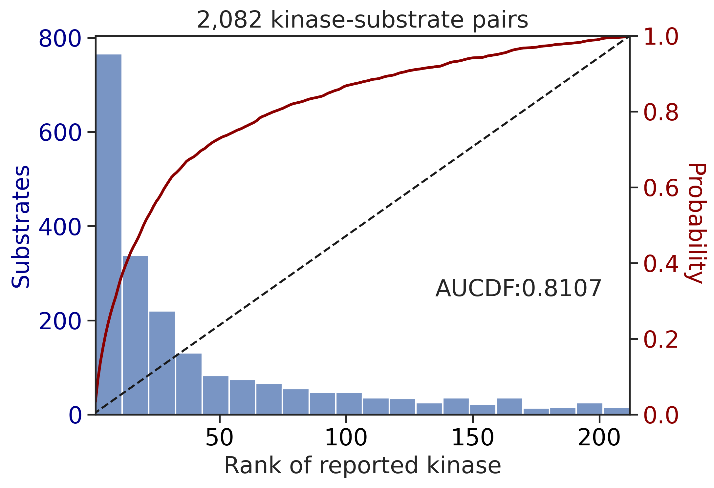


    ---------------------------------------------
    PSPA: PSSM + multiply + pct
    input dataframe has a length 2082
    Preprocessing
    Finish preprocessing
    Merging reference
    Finish merging

    100%|██████████████████████████████████████████████████████████████████████████| 213/213 [00:00<00:00, 289.36it/s]

    input dataframe has a length 377
    Preprocessing
    Finish preprocessing
    Merging reference
    Finish merging

    100%|████████████████████████████████████████████████████████████████████████████| 71/71 [00:00<00:00, 579.53it/s]
    100%|██████████████████████████████████████████████████████████████████████████| 213/213 [00:00<00:00, 676.99it/s]
    100%|████████████████████████████████████████████████████████████████████████████| 71/71 [00:00<00:00, 808.54it/s]

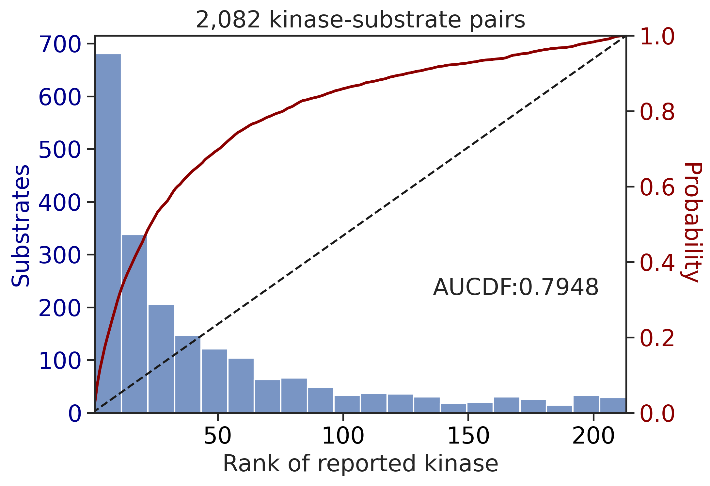


    ---------------------------------------------
    CDDM: PSSM + multiply
    input dataframe has a length 2082
    Preprocessing
    Finish preprocessing
    Merging reference
    Finish merging

    100%|██████████████████████████████████████████████████████████████████████████| 213/213 [00:01<00:00, 209.09it/s]

    input dataframe has a length 377
    Preprocessing
    Finish preprocessing
    Merging reference
    Finish merging

    100%|████████████████████████████████████████████████████████████████████████████| 71/71 [00:00<00:00, 475.58it/s]

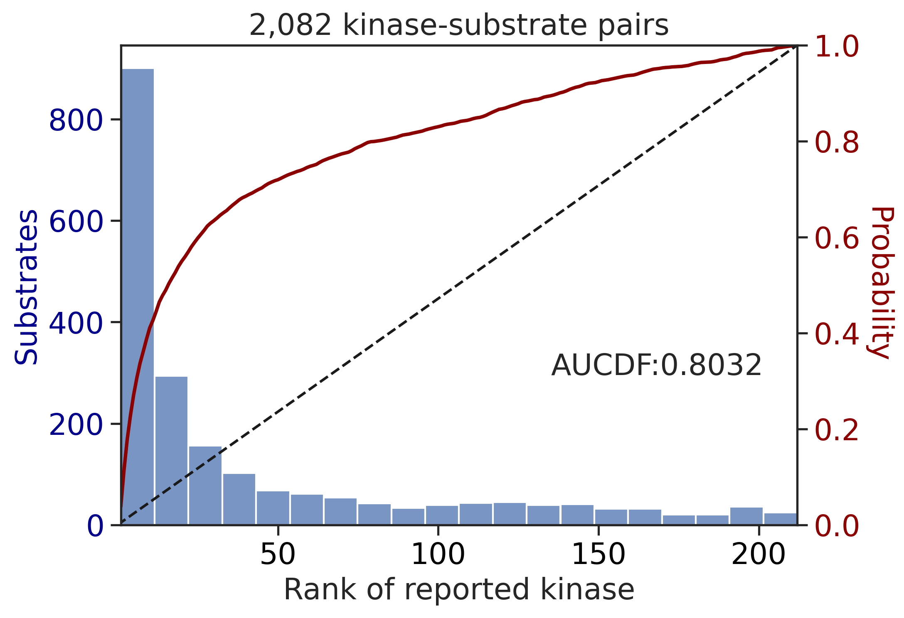


    ---------------------------------------------
    CDDM: PSSM + multiply + pct
    input dataframe has a length 2082
    Preprocessing
    Finish preprocessing
    Merging reference
    Finish merging

    100%|██████████████████████████████████████████████████████████████████████████| 213/213 [00:00<00:00, 214.83it/s]

    input dataframe has a length 377
    Preprocessing
    Finish preprocessing
    Merging reference
    Finish merging

    100%|████████████████████████████████████████████████████████████████████████████| 71/71 [00:00<00:00, 469.76it/s]
    100%|██████████████████████████████████████████████████████████████████████████| 213/213 [00:00<00:00, 687.25it/s]
    100%|████████████████████████████████████████████████████████████████████████████| 71/71 [00:00<00:00, 816.89it/s]


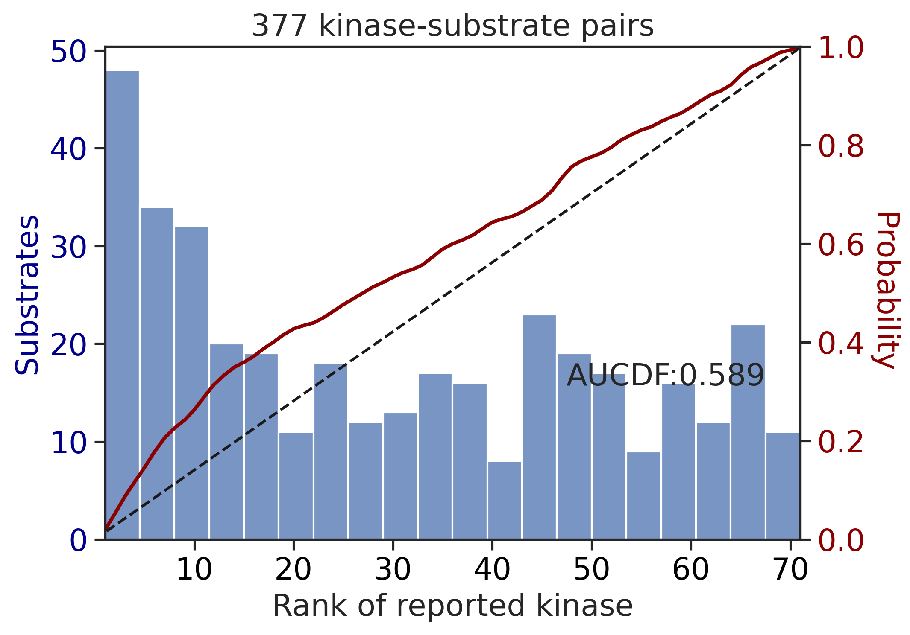

    ---------------------------------------------
    CDDM: PSSM upper + multiply
    input dataframe has a length 2082
    Preprocessing
    Finish preprocessing
    Merging reference
    Finish merging

    100%|██████████████████████████████████████████████████████████████████████████| 213/213 [00:01<00:00, 201.05it/s]

    input dataframe has a length 377
    Preprocessing
    Finish preprocessing
    Merging reference
    Finish merging

    100%|████████████████████████████████████████████████████████████████████████████| 71/71 [00:00<00:00, 471.58it/s]


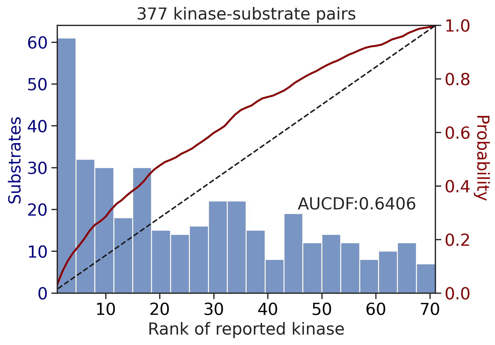

    ---------------------------------------------
    CDDM: PSSM upper + multiply + pct
    input dataframe has a length 2082
    Preprocessing
    Finish preprocessing
    Merging reference
    Finish merging

    100%|██████████████████████████████████████████████████████████████████████████| 213/213 [00:01<00:00, 212.42it/s]

    input dataframe has a length 377
    Preprocessing
    Finish preprocessing
    Merging reference
    Finish merging

    100%|████████████████████████████████████████████████████████████████████████████| 71/71 [00:00<00:00, 468.25it/s]
    100%|██████████████████████████████████████████████████████████████████████████| 213/213 [00:00<00:00, 683.89it/s]
    100%|████████████████████████████████████████████████████████████████████████████| 71/71 [00:00<00:00, 839.41it/s]


    ---------------------------------------------
    CDDM: LO + sum
    input dataframe has a length 2082
    Preprocessing
    Finish preprocessing
    Merging reference
    Finish merging
    input dataframe has a length 377
    Preprocessing
    Finish preprocessing
    Merging reference
    Finish merging


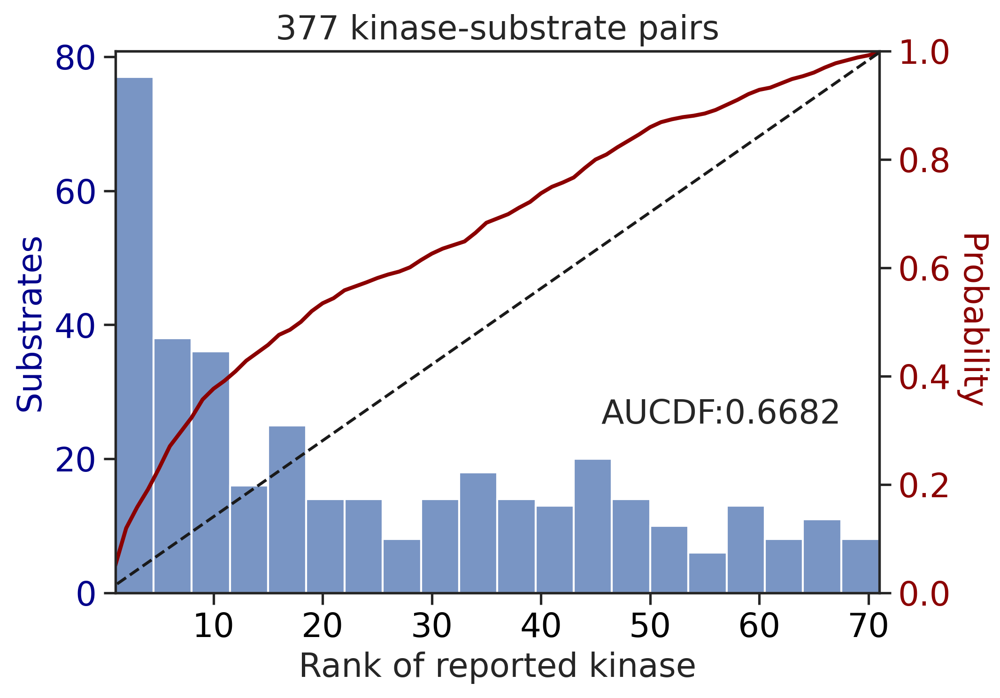

    ---------------------------------------------
    CDDM: LO + sum + pct
    input dataframe has a length 2082
    Preprocessing
    Finish preprocessing
    Merging reference
    Finish merging
    input dataframe has a length 377
    Preprocessing
    Finish preprocessing
    Merging reference
    Finish merging

    100%|██████████████████████████████████████████████████████████████████████████| 213/213 [00:00<00:00, 678.51it/s]
    100%|████████████████████████████████████████████████████████████████████████████| 71/71 [00:00<00:00, 832.33it/s]


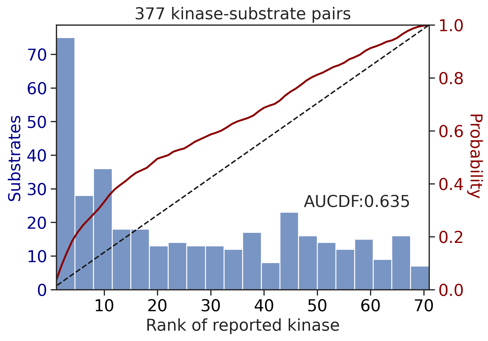

    ---------------------------------------------
    CDDM: LO upper + sum
    input dataframe has a length 2082
    Preprocessing
    Finish preprocessing
    Merging reference
    Finish merging
    input dataframe has a length 377
    Preprocessing
    Finish preprocessing
    Merging reference
    Finish merging

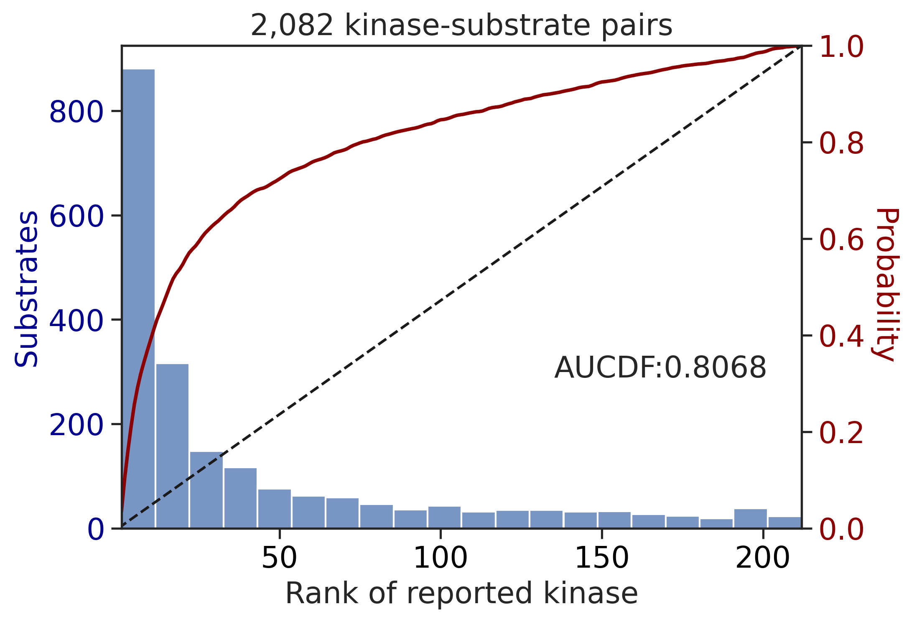


    ---------------------------------------------
    CDDM: LO upper + sum + pct
    input dataframe has a length 2082
    Preprocessing
    Finish preprocessing
    Merging reference
    Finish merging
    input dataframe has a length 377
    Preprocessing
    Finish preprocessing
    Merging reference
    Finish merging

    100%|██████████████████████████████████████████████████████████████████████████| 213/213 [00:00<00:00, 679.34it/s]
    100%|████████████████████████████████████████████████████████████████████████████| 71/71 [00:00<00:00, 859.10it/s]

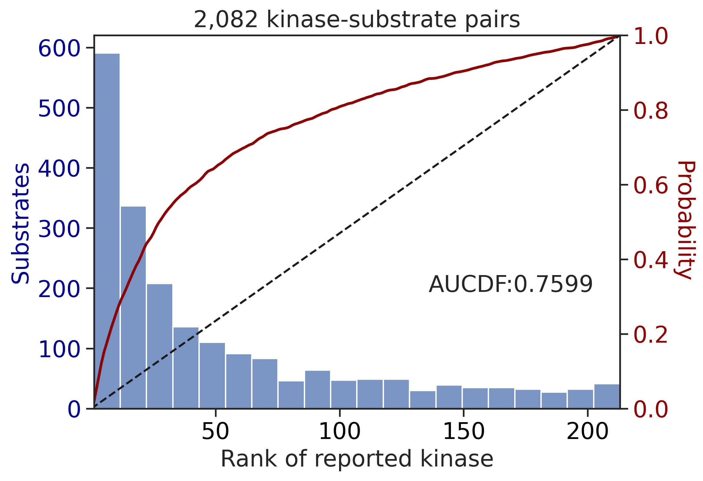

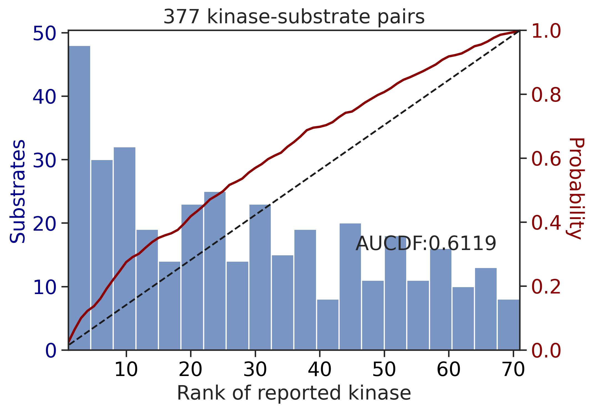

``` python
aucdf = aucdf.T
```

``` python
aucdf = aucdf.reset_index(names='group')
```

``` python
aucdf
```

<div>
<style scoped>
    .dataframe tbody tr th:only-of-type {
        vertical-align: middle;
    }
&#10;    .dataframe tbody tr th {
        vertical-align: top;
    }
&#10;    .dataframe thead th {
        text-align: right;
    }
</style>

<table class="dataframe" data-quarto-postprocess="true" data-border="1">
<thead>
<tr style="text-align: right;">
<th data-quarto-table-cell-role="th"></th>
<th data-quarto-table-cell-role="th">group</th>
<th data-quarto-table-cell-role="th">PSPA: PSSM + multiply</th>
<th data-quarto-table-cell-role="th">PSPA: PSSM + multiply + pct</th>
<th data-quarto-table-cell-role="th">CDDM: PSSM + multiply</th>
<th data-quarto-table-cell-role="th">CDDM: PSSM + multiply + pct</th>
<th data-quarto-table-cell-role="th">CDDM: PSSM upper + multiply</th>
<th data-quarto-table-cell-role="th">CDDM: PSSM upper + multiply +
pct</th>
<th data-quarto-table-cell-role="th">CDDM: LO + sum</th>
<th data-quarto-table-cell-role="th">CDDM: LO + sum + pct</th>
<th data-quarto-table-cell-role="th">CDDM: LO upper + sum</th>
<th data-quarto-table-cell-role="th">CDDM: LO upper + sum + pct</th>
</tr>
</thead>
<tbody>
<tr>
<td data-quarto-table-cell-role="th">0</td>
<td>ST</td>
<td>0.810725</td>
<td>0.794840</td>
<td>0.803220</td>
<td>0.713528</td>
<td>0.806753</td>
<td>0.724447</td>
<td>0.803220</td>
<td>0.746919</td>
<td>0.806753</td>
<td>0.759939</td>
</tr>
<tr>
<td data-quarto-table-cell-role="th">1</td>
<td>Tyr</td>
<td>0.606243</td>
<td>0.582133</td>
<td>0.668217</td>
<td>0.589020</td>
<td>0.640603</td>
<td>0.550436</td>
<td>0.668217</td>
<td>0.634985</td>
<td>0.640603</td>
<td>0.611936</td>
</tr>
</tbody>
</table>

</div>

``` python
aucdf.set_index('group').T.sort_values('Tyr')
```

<div>
<style scoped>
    .dataframe tbody tr th:only-of-type {
        vertical-align: middle;
    }
&#10;    .dataframe tbody tr th {
        vertical-align: top;
    }
&#10;    .dataframe thead th {
        text-align: right;
    }
</style>

<table class="dataframe" data-quarto-postprocess="true" data-border="1">
<thead>
<tr style="text-align: right;">
<th data-quarto-table-cell-role="th">group</th>
<th data-quarto-table-cell-role="th">ST</th>
<th data-quarto-table-cell-role="th">Tyr</th>
</tr>
</thead>
<tbody>
<tr>
<td data-quarto-table-cell-role="th">CDDM: PSSM upper + multiply +
pct</td>
<td>0.724447</td>
<td>0.550436</td>
</tr>
<tr>
<td data-quarto-table-cell-role="th">PSPA: PSSM + multiply + pct</td>
<td>0.794840</td>
<td>0.582133</td>
</tr>
<tr>
<td data-quarto-table-cell-role="th">CDDM: PSSM + multiply + pct</td>
<td>0.713528</td>
<td>0.589020</td>
</tr>
<tr>
<td data-quarto-table-cell-role="th">PSPA: PSSM + multiply</td>
<td>0.810725</td>
<td>0.606243</td>
</tr>
<tr>
<td data-quarto-table-cell-role="th">CDDM: LO upper + sum + pct</td>
<td>0.759939</td>
<td>0.611936</td>
</tr>
<tr>
<td data-quarto-table-cell-role="th">CDDM: LO + sum + pct</td>
<td>0.746919</td>
<td>0.634985</td>
</tr>
<tr>
<td data-quarto-table-cell-role="th">CDDM: LO upper + sum</td>
<td>0.806753</td>
<td>0.640603</td>
</tr>
<tr>
<td data-quarto-table-cell-role="th">CDDM: PSSM upper + multiply</td>
<td>0.806753</td>
<td>0.640603</td>
</tr>
<tr>
<td data-quarto-table-cell-role="th">CDDM: LO + sum</td>
<td>0.803220</td>
<td>0.668217</td>
</tr>
<tr>
<td data-quarto-table-cell-role="th">CDDM: PSSM + multiply</td>
<td>0.803220</td>
<td>0.668217</td>
</tr>
</tbody>
</table>

</div>

``` python
plot_group_bar(aucdf,value_cols=aucdf.columns[1:],group='group',rotation=0)
plt.ylabel('AUCDF')
```

    Text(0, 0.5, 'AUCDF')


``` python
plot_group_bar(aucdf,value_cols=aucdf.columns[1:],group='group',rotation=0)
plt.ylabel('AUCDF')
```

    Text(0, 0.5, 'AUCDF')


``` python
topk_df = pd.concat(topk_dfs,axis=1)
```

``` python
topk_df.columns = ref_dict.keys()
```

``` python
idx_ordered = topk_df.mean(1).sort_values(ascending=False).index
```

``` python
topk_df = topk_df.loc[idx_ordered]
```

``` python
topk_df = topk_df.reset_index(names='group')
```

``` python
plot_group_bar(topk_df,value_cols=topk_df.columns[1:],group='group')
plt.ylabel('Top10 accuracy')
```

    Text(0, 0.5, 'Top10 accuracy')

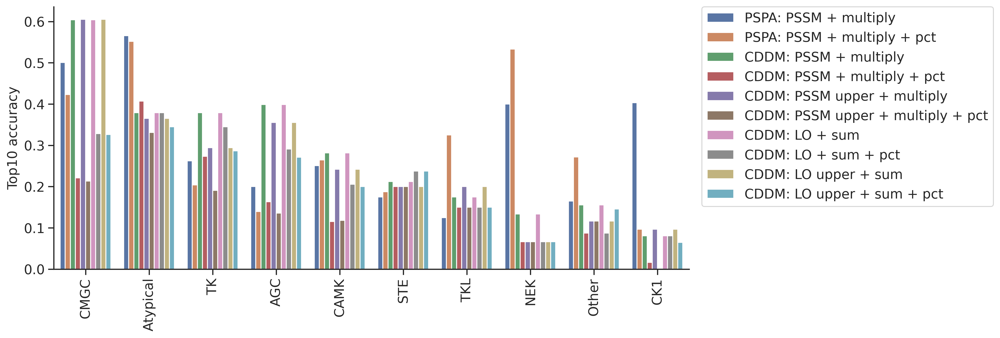

``` python
plot_group_bar(topk_df,value_cols=topk_df.columns[1:],group='group')
plt.ylabel('Top10 accuracy')
```

    Text(0, 0.5, 'Top10 accuracy')

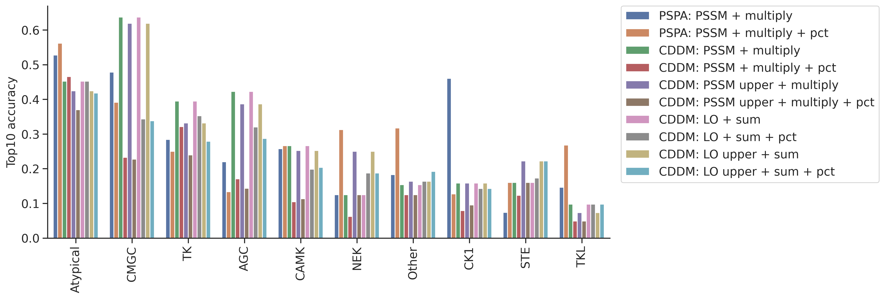

``` python
col = topk_df.columns[~topk_df.columns.str.contains('pct')][1:]
```

``` python
df.kinase_group.value_counts()
```

    kinase_group
    CMGC        777
    AGC         510
    TK          386
    CAMK        357
    Atypical    147
    Other       104
    STE          83
    CK1          63
    TKL          41
    NEK          16
    Name: count, dtype: int64

``` python
plot_group_bar(topk_df,value_cols=col,group='group')
plt.ylabel('Top10 accuracy')
```

    Text(0, 0.5, 'Top10 accuracy')


``` python
plot_group_bar(topk_df,value_cols=col,group='group')
plt.ylabel('Top10 accuracy')
```

    Text(0, 0.5, 'Top10 accuracy')

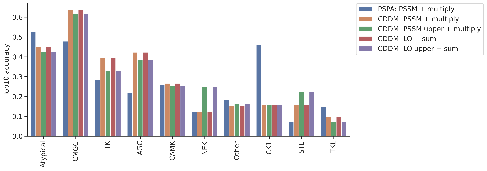
