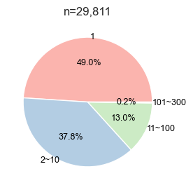
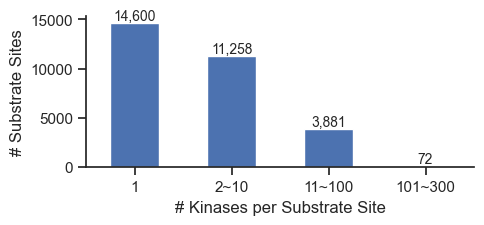
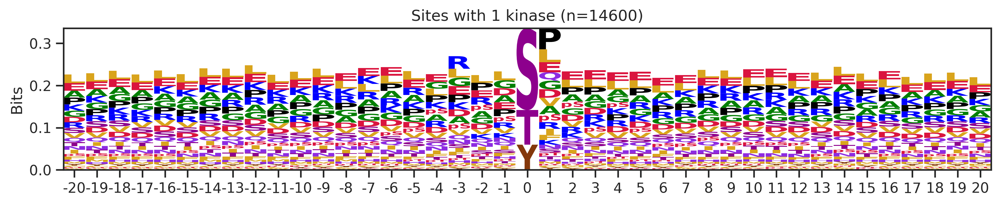
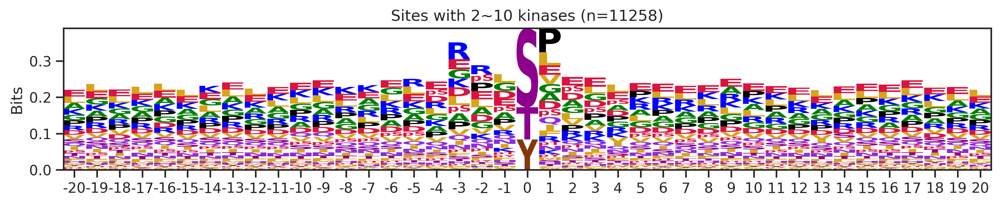
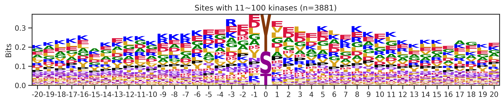
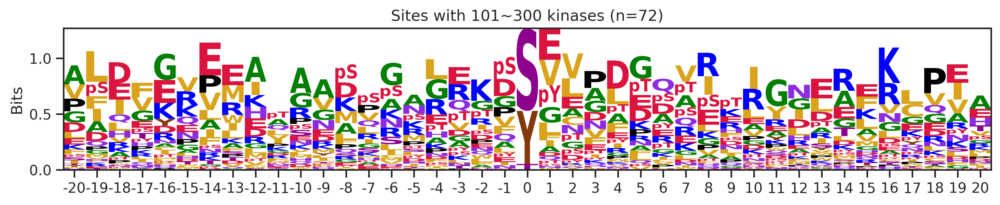
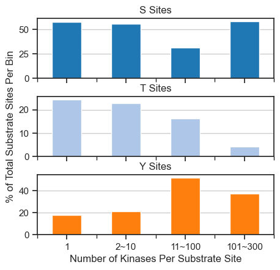

# Site promiscuity


<!-- WARNING: THIS FILE WAS AUTOGENERATED! DO NOT EDIT! -->

``` python
from katlas.core import *
import pandas as pd
import seaborn as sns
from matplotlib import pyplot as plt
from katlas.plot import *
import matplotlib.ticker as mticker
```

``` python
df=Data.get_ks_dataset()
```

``` python
df.head()
```

<div>
<style scoped>
    .dataframe tbody tr th:only-of-type {
        vertical-align: middle;
    }
&#10;    .dataframe tbody tr th {
        vertical-align: top;
    }
&#10;    .dataframe thead th {
        text-align: right;
    }
</style>

<table class="dataframe" data-quarto-postprocess="true" data-border="1">
<thead>
<tr style="text-align: right;">
<th data-quarto-table-cell-role="th"></th>
<th data-quarto-table-cell-role="th">kin_sub_site</th>
<th data-quarto-table-cell-role="th">kinase_uniprot</th>
<th data-quarto-table-cell-role="th">substrate_uniprot</th>
<th data-quarto-table-cell-role="th">site</th>
<th data-quarto-table-cell-role="th">source</th>
<th data-quarto-table-cell-role="th">substrate_genes</th>
<th data-quarto-table-cell-role="th">substrate_phosphoseq</th>
<th data-quarto-table-cell-role="th">position</th>
<th data-quarto-table-cell-role="th">site_seq</th>
<th data-quarto-table-cell-role="th">sub_site</th>
<th data-quarto-table-cell-role="th">substrate_sequence</th>
<th data-quarto-table-cell-role="th">kinase_on_tree</th>
<th data-quarto-table-cell-role="th">kinase_genes</th>
<th data-quarto-table-cell-role="th">kinase_group</th>
<th data-quarto-table-cell-role="th">kinase_family</th>
<th data-quarto-table-cell-role="th">kinase_pspa_big</th>
<th data-quarto-table-cell-role="th">kinase_pspa_small</th>
<th data-quarto-table-cell-role="th">kinase_coral_ID</th>
<th data-quarto-table-cell-role="th">num_kin</th>
</tr>
</thead>
<tbody>
<tr>
<td data-quarto-table-cell-role="th">0</td>
<td>O00141_A4FU28_S140</td>
<td>O00141</td>
<td>A4FU28</td>
<td>S140</td>
<td>Sugiyama</td>
<td>CTAGE9</td>
<td>MEEPGATPQPYLGLVLEELGRVVAALPESMRPDENPYGFPSELVVC...</td>
<td>140</td>
<td>AAAEEARSLEATCEKLSRsNsELEDEILCLEKDLKEEKSKH</td>
<td>A4FU28_S140</td>
<td>MEEPGATPQPYLGLVLEELGRVVAALPESMRPDENPYGFPSELVVC...</td>
<td>1</td>
<td>SGK1 SGK</td>
<td>AGC</td>
<td>SGK</td>
<td>Basophilic</td>
<td>Akt/rock</td>
<td>SGK1</td>
<td>22</td>
</tr>
<tr>
<td data-quarto-table-cell-role="th">1</td>
<td>O00141_O00141_S252</td>
<td>O00141</td>
<td>O00141</td>
<td>S252</td>
<td>Sugiyama</td>
<td>SGK1 SGK</td>
<td>MTVKTEAAKGTLTYSRMRGMVAILIAFMKQRRMGLNDFIQKIANNS...</td>
<td>252</td>
<td>SQGHIVLTDFGLCKENIEHNsTtstFCGtPEyLAPEVLHKQ</td>
<td>O00141_S252</td>
<td>MTVKTEAAKGTLTYSRMRGMVAILIAFMKQRRMGLNDFIQKIANNS...</td>
<td>1</td>
<td>SGK1 SGK</td>
<td>AGC</td>
<td>SGK</td>
<td>Basophilic</td>
<td>Akt/rock</td>
<td>SGK1</td>
<td>1</td>
</tr>
<tr>
<td data-quarto-table-cell-role="th">2</td>
<td>O00141_O00141_S255</td>
<td>O00141</td>
<td>O00141</td>
<td>S255</td>
<td>Sugiyama</td>
<td>SGK1 SGK</td>
<td>MTVKTEAAKGTLTYSRMRGMVAILIAFMKQRRMGLNDFIQKIANNS...</td>
<td>255</td>
<td>HIVLTDFGLCKENIEHNsTtstFCGtPEyLAPEVLHKQPYD</td>
<td>O00141_S255</td>
<td>MTVKTEAAKGTLTYSRMRGMVAILIAFMKQRRMGLNDFIQKIANNS...</td>
<td>1</td>
<td>SGK1 SGK</td>
<td>AGC</td>
<td>SGK</td>
<td>Basophilic</td>
<td>Akt/rock</td>
<td>SGK1</td>
<td>1</td>
</tr>
<tr>
<td data-quarto-table-cell-role="th">3</td>
<td>O00141_O00141_S397</td>
<td>O00141</td>
<td>O00141</td>
<td>S397</td>
<td>Sugiyama</td>
<td>SGK1 SGK</td>
<td>MTVKTEAAKGTLTYSRMRGMVAILIAFMKQRRMGLNDFIQKIANNS...</td>
<td>397</td>
<td>sGPNDLRHFDPEFTEEPVPNsIGKsPDsVLVTAsVKEAAEA</td>
<td>O00141_S397</td>
<td>MTVKTEAAKGTLTYSRMRGMVAILIAFMKQRRMGLNDFIQKIANNS...</td>
<td>1</td>
<td>SGK1 SGK</td>
<td>AGC</td>
<td>SGK</td>
<td>Basophilic</td>
<td>Akt/rock</td>
<td>SGK1</td>
<td>1</td>
</tr>
<tr>
<td data-quarto-table-cell-role="th">4</td>
<td>O00141_O00141_S404</td>
<td>O00141</td>
<td>O00141</td>
<td>S404</td>
<td>Sugiyama</td>
<td>SGK1 SGK</td>
<td>MTVKTEAAKGTLTYSRMRGMVAILIAFMKQRRMGLNDFIQKIANNS...</td>
<td>404</td>
<td>HFDPEFTEEPVPNsIGKsPDsVLVTAsVKEAAEAFLGFsYA</td>
<td>O00141_S404</td>
<td>MTVKTEAAKGTLTYSRMRGMVAILIAFMKQRRMGLNDFIQKIANNS...</td>
<td>1</td>
<td>SGK1 SGK</td>
<td>AGC</td>
<td>SGK</td>
<td>Basophilic</td>
<td>Akt/rock</td>
<td>SGK1</td>
<td>1</td>
</tr>
</tbody>
</table>

</div>

## Total kinase count per site

``` python
pivot = pd.crosstab(df['sub_site'], df['substrate_uniprot'])

hist_data = pivot.sum(1)  # total kinase count per sub_site

# Define bins and labels
bins = [0, 1, 10, 100, 300]
labels = ['1', '2~10', '11~100', '101~300']

# Cut into categories
binned = pd.cut(hist_data, bins=bins, labels=labels, right=True, include_lowest=True)

# Count how many kin_sub_sites fall into each bin
binned_counts = binned.value_counts().sort_index()

sites = pd.concat([hist_data,binned],axis=1)

sites.columns=['num_kin','bin']

sites = sites.reset_index()
```

## Plot sites kin distribution

``` python
# pip install brokenaxes
```

``` python
import matplotlib.pyplot as plt
from brokenaxes import brokenaxes

import pandas as pd
import numpy as np
```

``` python
set_sns(100)
```

``` python
fig = plt.figure(figsize=(5, 4))
bax = brokenaxes(ylims=((0, 5000), (20_000, 22_000)), hspace=0.2)

# Plot histogram
bax.hist(sites.num_kin, bins=100, edgecolor='black');

# bax.set_xlabel('# Kinases')
# bax.set_ylabel('Frequency') # overlap, does not work very well
plt.title('Histogram of # Kinases per Substrate Site');
save_pdf('fig/promi_hist.pdf')
```


``` python
cnt=sites.bin.value_counts()
```

``` python
def plot_pie(value_counts, # value counts
             hue_order=None, # list of strings
             labeldistance=0.8,
             fontsize=12,
             fontcolor='black',
             palette='tab20' ,
             figsize=(4,3)
            ):
    if hue_order is not None: value_counts = value_counts.reindex(hue_order)
    colors = sns.color_palette(palette, n_colors=len(value_counts))
    value_counts.plot.pie(
        autopct='%1.1f%%',    # Show percentage inside slices
        labeldistance=labeldistance,    # Move labels closer to center
        textprops={'fontsize': fontsize, 'color': fontcolor} ,
        colors=colors,
        figsize=figsize,
    )
    plt.ylabel('')
    plt.title(f'n={value_counts.sum():,}')
```

``` python
plot_pie(cnt,
         fontsize=9,labeldistance=1,palette='Pastel1')
save_pdf('fig/promi_pie.pdf')
```



``` python
def plot_cnt(cnt, xlabel=None,ylabel='Count',figsize=(6, 3)):
    fig, ax = plt.subplots(figsize=figsize)
    cnt.plot.bar(ax=ax)
    # Add text on top of each bar
    for idx, value in enumerate(cnt):
        ax.text(idx, value + 0.5, f"{value:,}", ha='center', va='bottom', fontsize=10)

    ax.spines['top'].set_visible(False)
    ax.spines['right'].set_visible(False)
    ax.set_ylabel(ylabel)
    ax.set_xlabel(xlabel)
    plt.xticks(rotation=0)
    plt.tight_layout()
```

``` python
plot_cnt(cnt,
         xlabel='# Kinases per Substrate Site',
         ylabel='# Substrate Sites',
         figsize=(5,2.4)
        )
save_pdf('fig/promi_bar.pdf')
```



``` python
# sites.num_kin.sort_values(ascending=False).to_csv('test.csv')
```

## Characterize promicuous motif

``` python
seqs = Data.get_ks_unique()
```

``` python
seqs
```

<div>
<style scoped>
    .dataframe tbody tr th:only-of-type {
        vertical-align: middle;
    }
&#10;    .dataframe tbody tr th {
        vertical-align: top;
    }
&#10;    .dataframe thead th {
        text-align: right;
    }
</style>

<table class="dataframe" data-quarto-postprocess="true" data-border="1">
<thead>
<tr style="text-align: right;">
<th data-quarto-table-cell-role="th"></th>
<th data-quarto-table-cell-role="th">sub_site</th>
<th data-quarto-table-cell-role="th">num_kin</th>
<th data-quarto-table-cell-role="th">bin</th>
<th data-quarto-table-cell-role="th">sub_genes</th>
<th data-quarto-table-cell-role="th">site_seq</th>
<th data-quarto-table-cell-role="th">source_combine</th>
<th data-quarto-table-cell-role="th">acceptor</th>
<th data-quarto-table-cell-role="th">O00141_SGK1</th>
<th data-quarto-table-cell-role="th">O00238_BMPR1B</th>
<th data-quarto-table-cell-role="th">O00311_CDC7</th>
<th data-quarto-table-cell-role="th">...</th>
<th data-quarto-table-cell-role="th">Q9Y2K2_SIK3</th>
<th data-quarto-table-cell-role="th">Q9Y2U5_MAP3K2</th>
<th data-quarto-table-cell-role="th">Q9Y3S1_WNK2</th>
<th data-quarto-table-cell-role="th">Q9Y463_DYRK1B</th>
<th data-quarto-table-cell-role="th">Q9Y4K4_MAP4K5</th>
<th data-quarto-table-cell-role="th">Q9Y572_RIPK3</th>
<th data-quarto-table-cell-role="th">Q9Y5S2_CDC42BPB</th>
<th data-quarto-table-cell-role="th">Q9Y6E0_STK24</th>
<th data-quarto-table-cell-role="th">Q9Y6M4_CSNK1G3</th>
<th data-quarto-table-cell-role="th">Q9Y6R4_MAP3K4</th>
</tr>
</thead>
<tbody>
<tr>
<td data-quarto-table-cell-role="th">0</td>
<td>A0A2R8Y4L2_S158</td>
<td>1</td>
<td>1</td>
<td>HNRNPA1L3 HNRNPA1P48</td>
<td>TDRGSGKKRGFAFVTFDDHDsVDKIVIQKYHTVNGHNCEVR</td>
<td>Sugiyama</td>
<td>S</td>
<td>0</td>
<td>0</td>
<td>0</td>
<td>...</td>
<td>0</td>
<td>0</td>
<td>0</td>
<td>0</td>
<td>0</td>
<td>0</td>
<td>0</td>
<td>0</td>
<td>0</td>
<td>0</td>
</tr>
<tr>
<td data-quarto-table-cell-role="th">1</td>
<td>A0A2R8Y4L2_S22</td>
<td>3</td>
<td>2~10</td>
<td>HNRNPA1L3 HNRNPA1P48</td>
<td>SKSEsPKEPEQLRKLFIGGLsFEtTDESLRSHFEQWGTLTD</td>
<td>Sugiyama</td>
<td>S</td>
<td>0</td>
<td>0</td>
<td>0</td>
<td>...</td>
<td>0</td>
<td>0</td>
<td>0</td>
<td>0</td>
<td>0</td>
<td>0</td>
<td>0</td>
<td>0</td>
<td>0</td>
<td>0</td>
</tr>
<tr>
<td data-quarto-table-cell-role="th">2</td>
<td>A0A2R8Y4L2_S6</td>
<td>3</td>
<td>2~10</td>
<td>HNRNPA1L3 HNRNPA1P48</td>
<td>_______________MSKSEsPKEPEQLRKLFIGGLsFEtT</td>
<td>Sugiyama</td>
<td>S</td>
<td>0</td>
<td>0</td>
<td>0</td>
<td>...</td>
<td>0</td>
<td>0</td>
<td>0</td>
<td>0</td>
<td>0</td>
<td>0</td>
<td>0</td>
<td>0</td>
<td>0</td>
<td>0</td>
</tr>
<tr>
<td data-quarto-table-cell-role="th">3</td>
<td>A0A2R8Y4L2_S95</td>
<td>65</td>
<td>11~100</td>
<td>HNRNPA1L3 HNRNPA1P48</td>
<td>RPHKVDGRVVEPKRAVSREDsQRPDAHLTVKKIFVGGIKED</td>
<td>Sugiyama</td>
<td>S</td>
<td>0</td>
<td>1</td>
<td>0</td>
<td>...</td>
<td>0</td>
<td>1</td>
<td>0</td>
<td>0</td>
<td>1</td>
<td>0</td>
<td>0</td>
<td>0</td>
<td>0</td>
<td>0</td>
</tr>
<tr>
<td data-quarto-table-cell-role="th">4</td>
<td>A0A2R8Y4L2_T25</td>
<td>3</td>
<td>2~10</td>
<td>HNRNPA1L3 HNRNPA1P48</td>
<td>EsPKEPEQLRKLFIGGLsFEtTDESLRSHFEQWGTLTDCVV</td>
<td>Sugiyama</td>
<td>T</td>
<td>0</td>
<td>0</td>
<td>0</td>
<td>...</td>
<td>0</td>
<td>0</td>
<td>0</td>
<td>0</td>
<td>0</td>
<td>0</td>
<td>0</td>
<td>0</td>
<td>0</td>
<td>0</td>
</tr>
<tr>
<td data-quarto-table-cell-role="th">...</td>
<td>...</td>
<td>...</td>
<td>...</td>
<td>...</td>
<td>...</td>
<td>...</td>
<td>...</td>
<td>...</td>
<td>...</td>
<td>...</td>
<td>...</td>
<td>...</td>
<td>...</td>
<td>...</td>
<td>...</td>
<td>...</td>
<td>...</td>
<td>...</td>
<td>...</td>
<td>...</td>
<td>...</td>
</tr>
<tr>
<td data-quarto-table-cell-role="th">29806</td>
<td>Q9Y6Y8_S894</td>
<td>2</td>
<td>2~10</td>
<td>SEC23IP MSTP053</td>
<td>FISSLKSAWQTLNEFARAHtsstQLQEELEKVANQIKEEEE</td>
<td>Sugiyama</td>
<td>S</td>
<td>0</td>
<td>0</td>
<td>0</td>
<td>...</td>
<td>0</td>
<td>0</td>
<td>0</td>
<td>0</td>
<td>0</td>
<td>0</td>
<td>0</td>
<td>0</td>
<td>0</td>
<td>0</td>
</tr>
<tr>
<td data-quarto-table-cell-role="th">29807</td>
<td>Q9Y6Y8_T893</td>
<td>4</td>
<td>2~10</td>
<td>SEC23IP MSTP053</td>
<td>GFISSLKSAWQTLNEFARAHtsstQLQEELEKVANQIKEEE</td>
<td>Sugiyama</td>
<td>T</td>
<td>0</td>
<td>0</td>
<td>0</td>
<td>...</td>
<td>0</td>
<td>0</td>
<td>0</td>
<td>0</td>
<td>0</td>
<td>0</td>
<td>0</td>
<td>0</td>
<td>0</td>
<td>0</td>
</tr>
<tr>
<td data-quarto-table-cell-role="th">29808</td>
<td>Q9Y6Y8_Y935</td>
<td>2</td>
<td>2~10</td>
<td>SEC23IP MSTP053</td>
<td>KQVVEAEKVVEsPDFsKDEDyLGKVGMLNGGRRIDYVLQEK</td>
<td>Sugiyama</td>
<td>Y</td>
<td>0</td>
<td>0</td>
<td>0</td>
<td>...</td>
<td>0</td>
<td>0</td>
<td>0</td>
<td>0</td>
<td>0</td>
<td>0</td>
<td>0</td>
<td>0</td>
<td>0</td>
<td>0</td>
</tr>
<tr>
<td data-quarto-table-cell-role="th">29809</td>
<td>Q9Y6Y9_Y131</td>
<td>1</td>
<td>1</td>
<td>LY96 ESOP1 MD2</td>
<td>ETVNTTISFSFKGIKFSKGKyKCVVEAISGSPEEMLFCLEF</td>
<td>Non-Sugiyama</td>
<td>Y</td>
<td>0</td>
<td>0</td>
<td>0</td>
<td>...</td>
<td>0</td>
<td>0</td>
<td>0</td>
<td>0</td>
<td>0</td>
<td>0</td>
<td>0</td>
<td>0</td>
<td>0</td>
<td>0</td>
</tr>
<tr>
<td data-quarto-table-cell-role="th">29810</td>
<td>Q9Y6Y9_Y22</td>
<td>1</td>
<td>1</td>
<td>LY96 ESOP1 MD2</td>
<td>LPFLFFSTLFSSIFTEAQKQyWVCNSSDASISYTYCDKMQY</td>
<td>Non-Sugiyama</td>
<td>Y</td>
<td>0</td>
<td>0</td>
<td>0</td>
<td>...</td>
<td>0</td>
<td>0</td>
<td>0</td>
<td>0</td>
<td>0</td>
<td>0</td>
<td>0</td>
<td>0</td>
<td>0</td>
<td>0</td>
</tr>
</tbody>
</table>

<p>29811 rows × 462 columns</p>
</div>

``` python
seq_map=df.drop_duplicates('sub_site').set_index('sub_site').site_seq

gene_map = df.drop_duplicates('sub_site').set_index('sub_site').substrate_genes
```

``` python
sites['sub_genes'] = sites.sub_site.map(gene_map)
sites['site_seq'] = sites.sub_site.map(seq_map)
```

``` python
for b in sites.bin.value_counts().index:
    sites_b=sites[sites.bin==b].copy()
    pssm_df= get_prob(sites_b,'site_seq')
    plot_logo(pssm_df,b,figsize=(13,2))
    kin_str='kinase' if b=='1' else 'kinases'
    plt.title(f"Sites with {b} {kin_str} (n={len(sites_b)})")
    plt.show()
    plt.close()
```









``` python
# a = sites[(sites.bin=='101~300')|(sites.bin=='11~100')].copy()

# s_sites = a[a.sub_site.str.split('_').str[1].str[0]=='S']

# y_sites = a[a.sub_site.str.split('_').str[1].str[0]=='Y']

# pssm_df_s = get_prob(s_sites,'site_seq')
# pssm_df_y = get_prob(y_sites,'site_seq')
```

## Genes in promicuous site

``` python
sites['gene'] = sites.sub_genes.str.split(' ').str[0]
```

``` python
sites_b=sites[sites.bin=='101~300'].copy()
```

``` python
data = pd.read_csv('raw/genes_grouped.csv')
```

``` python
data.Gene.isin(genes).sum()
```

    72

``` python
# remove (small) and (large) for rebosomal protein
data.Group = data.Group.str.split('(').str[0]
```

``` python
group_map = data.set_index('Gene')['Group'].to_dict()
```

``` python
sites_b['gene_group'] = sites_b.gene.map(group_map)
```

``` python
sites_b.gene_group.value_counts()
```

    gene_group
    Glycolysis                 16
    Actin cytoskeleton         15
    Heat shock protein         12
    Ribosomal protein          12
    RNA‑binding protein         6
    POTE family                 3
    NME family                  2
    Signaling/regulatory        2
    Tubulin cytoskeleton        2
    Cytoskeleton‑associated     1
    Regulatory/other            1
    Name: count, dtype: int64

## Stacked by source

``` python
def convert_source(x):
    if x == "Sugiyama":
        return x
    elif 'Sugiyama' in x and '|' in x:
        return 'Both'
    elif 'Sugiyama' not in x:
        return 'Non-Sugiyama'
```

``` python
# df=Data.get_ks_dataset()
```

``` python
df['source2'] = df.source.apply(convert_source)
```

``` python
out = df.groupby('sub_site')['source2'].unique()
```

``` python
sites['source'] = sites.sub_site.map(out)
```

``` python
def combine_source(sources):
    sources = set(sources)  # remove duplicates
    if sources == {'Sugiyama'}:
        return 'Sugiyama'
    elif sources == {'Non-Sugiyama'}:
        return 'Non-Sugiyama'
    else:
        return 'Both'
```

``` python
sites['source_num'] = sites.source.str.len()
```

``` python
sites['source_combine'] = sites.source.apply(combine_source)
```

``` python
def get_pct(df,bin_col, hue_col):
    count_df = df.groupby([bin_col, hue_col], observed=False).size().unstack(fill_value=0)
    pct_df = count_df.div(count_df.sum(axis=1), axis=0) * 100
    return pct_df
```

``` python
pct_df = get_pct(sites,'bin','source_combine')
```

``` python
pct_df
```

<div>
<style scoped>
    .dataframe tbody tr th:only-of-type {
        vertical-align: middle;
    }
&#10;    .dataframe tbody tr th {
        vertical-align: top;
    }
&#10;    .dataframe thead th {
        text-align: right;
    }
</style>

<table class="dataframe" data-quarto-postprocess="true" data-border="1">
<thead>
<tr style="text-align: right;">
<th data-quarto-table-cell-role="th">source_combine</th>
<th data-quarto-table-cell-role="th">Both</th>
<th data-quarto-table-cell-role="th">Non-Sugiyama</th>
<th data-quarto-table-cell-role="th">Sugiyama</th>
</tr>
<tr>
<th data-quarto-table-cell-role="th">bin</th>
<th data-quarto-table-cell-role="th"></th>
<th data-quarto-table-cell-role="th"></th>
<th data-quarto-table-cell-role="th"></th>
</tr>
</thead>
<tbody>
<tr>
<td data-quarto-table-cell-role="th">1</td>
<td>1.102740</td>
<td>47.445205</td>
<td>51.452055</td>
</tr>
<tr>
<td data-quarto-table-cell-role="th">2~10</td>
<td>7.470243</td>
<td>30.582697</td>
<td>61.947060</td>
</tr>
<tr>
<td data-quarto-table-cell-role="th">11~100</td>
<td>7.137336</td>
<td>1.056429</td>
<td>91.806236</td>
</tr>
<tr>
<td data-quarto-table-cell-role="th">101~300</td>
<td>12.500000</td>
<td>0.000000</td>
<td>87.500000</td>
</tr>
</tbody>
</table>

</div>

``` python
# pct_df.plot.bar()
# plt.legend(title='Source')
```

``` python
def get_plt_color(palette, # dict, list, or set name (tab10)
                  columns, # columns in the df for plot
                 ):
    "Given a dict, list or set name, return the list of names; if dict, need to provide column names of the df."
    if isinstance(palette, dict):
        # Match colors to column order in pct_df
        colors = [palette.get(col, '#cccccc') for col in columns]  # fallback color if missing
    elif isinstance(palette, str):
        colors = sns.color_palette(palette, n_colors=len(columns))
    elif isinstance(palette, list):
        colors = palette
    return colors
```

``` python
get_plt_color('Set2',['a','b'])
```

<svg  width="110" height="55"><rect x="0" y="0" width="55" height="55" style="fill:#66c2a5;stroke-width:2;stroke:rgb(255,255,255)"/><rect x="55" y="0" width="55" height="55" style="fill:#fc8d62;stroke-width:2;stroke:rgb(255,255,255)"/></svg>

``` python
import matplotlib.pyplot as plt

def plot_composition(df, bin_col, hue_col,palette='tab20',legend_title=None,rotate=45,xlabel=None,ylabel='Percentage',figsize=(5,3)):
    pct_df = get_pct(df,bin_col,hue_col)

    colors = get_plt_color(palette,pct_df.columns)
    
    pct_df.plot(kind='bar', figsize=figsize,stacked=True,color=colors)
    
    plt.ylabel(ylabel)
    plt.xlabel(xlabel)
    plt.xticks(rotation=rotate)
    if legend_title is None: legend_title = hue_col 
    plt.legend(title=legend_title, bbox_to_anchor=(1.05, 1), loc='upper left')
```

``` python
plot_composition(sites,
                 'bin',
                 'source_combine',
                 palette='Set2',
                 legend_title='Source',
                 figsize=(3,3)
                )
save_pdf('fig/promi_bar_source_percentage.pdf')
```


## Stacked plot by site type

``` python
sites['acceptor'] = sites.sub_site.str.split('_').str[1].str[0]
```

``` python
plot_composition(sites,'bin',
                 'acceptor',
                 palette=sty_color,
                 figsize=(3,3),
                 legend_title='Acceptor'
                )

save_pdf('fig/promi_bar_site_percentage.pdf')
```


``` python
pct_df=get_pct(sites,'bin','acceptor')
```

``` python
pct_df
```

<div>
<style scoped>
    .dataframe tbody tr th:only-of-type {
        vertical-align: middle;
    }
&#10;    .dataframe tbody tr th {
        vertical-align: top;
    }
&#10;    .dataframe thead th {
        text-align: right;
    }
</style>

<table class="dataframe" data-quarto-postprocess="true" data-border="1">
<thead>
<tr style="text-align: right;">
<th data-quarto-table-cell-role="th">acceptor</th>
<th data-quarto-table-cell-role="th">S</th>
<th data-quarto-table-cell-role="th">T</th>
<th data-quarto-table-cell-role="th">Y</th>
</tr>
<tr>
<th data-quarto-table-cell-role="th">bin</th>
<th data-quarto-table-cell-role="th"></th>
<th data-quarto-table-cell-role="th"></th>
<th data-quarto-table-cell-role="th"></th>
</tr>
</thead>
<tbody>
<tr>
<td data-quarto-table-cell-role="th">1</td>
<td>57.760274</td>
<td>24.431507</td>
<td>17.808219</td>
</tr>
<tr>
<td data-quarto-table-cell-role="th">2~10</td>
<td>55.809202</td>
<td>22.712738</td>
<td>21.478060</td>
</tr>
<tr>
<td data-quarto-table-cell-role="th">11~100</td>
<td>31.512497</td>
<td>16.361762</td>
<td>52.125741</td>
</tr>
<tr>
<td data-quarto-table-cell-role="th">101~300</td>
<td>58.333333</td>
<td>4.166667</td>
<td>37.500000</td>
</tr>
</tbody>
</table>

</div>

``` python
fig, axes = plt.subplots(3, 1, figsize=(5, 4.6), sharex=True)
for i, (ax, acc) in enumerate(zip(axes, ['S', 'T', 'Y'])):
    pct_df[acc].plot(kind='bar', ax=ax, color=sty_color[acc])
    ax.set_title(f'{acc} Sites')
    ax.grid(axis='y')
    ax.tick_params(axis='x', labelrotation=0)
    
    # Set ylabel only on the middle plot
    if i == 1:
        ax.set_ylabel('% of Total Substrate Sites Per Bin')
    else:
        ax.set_ylabel('')  # remove label from top/bottom

axes[-1].set_xlabel('Number of Kinases Per Substrate Site')
plt.subplots_adjust(hspace=0.3)
save_pdf('fig/promi_bar_site_percentage_split.pdf')
```



## Save & Add num_kin to the ks_dataset

``` python
sites = sites.drop(columns='source')
```

Let’s add kinase binding info as one-hot

``` python
df['kinase_uniprot_gene']=df['kinase_uniprot']+'_'+df['kinase_genes'].str.split(' ').str[0]
```

``` python
pivot = pd.crosstab(df['sub_site'],df['kinase_uniprot_gene'])
```

``` python
pivot = pivot.reset_index()
```

``` python
sites = sites.merge(pivot)
```

``` python
sites.head()
```

<div>
<style scoped>
    .dataframe tbody tr th:only-of-type {
        vertical-align: middle;
    }
&#10;    .dataframe tbody tr th {
        vertical-align: top;
    }
&#10;    .dataframe thead th {
        text-align: right;
    }
</style>

<table class="dataframe" data-quarto-postprocess="true" data-border="1">
<thead>
<tr style="text-align: right;">
<th data-quarto-table-cell-role="th"></th>
<th data-quarto-table-cell-role="th">sub_site</th>
<th data-quarto-table-cell-role="th">num_kin</th>
<th data-quarto-table-cell-role="th">bin</th>
<th data-quarto-table-cell-role="th">sub_genes</th>
<th data-quarto-table-cell-role="th">site_seq</th>
<th data-quarto-table-cell-role="th">source_combine</th>
<th data-quarto-table-cell-role="th">acceptor</th>
<th data-quarto-table-cell-role="th">O00141_SGK1</th>
<th data-quarto-table-cell-role="th">O00238_BMPR1B</th>
<th data-quarto-table-cell-role="th">O00311_CDC7</th>
<th data-quarto-table-cell-role="th">...</th>
<th data-quarto-table-cell-role="th">Q9Y2K2_SIK3</th>
<th data-quarto-table-cell-role="th">Q9Y2U5_MAP3K2</th>
<th data-quarto-table-cell-role="th">Q9Y3S1_WNK2</th>
<th data-quarto-table-cell-role="th">Q9Y463_DYRK1B</th>
<th data-quarto-table-cell-role="th">Q9Y4K4_MAP4K5</th>
<th data-quarto-table-cell-role="th">Q9Y572_RIPK3</th>
<th data-quarto-table-cell-role="th">Q9Y5S2_CDC42BPB</th>
<th data-quarto-table-cell-role="th">Q9Y6E0_STK24</th>
<th data-quarto-table-cell-role="th">Q9Y6M4_CSNK1G3</th>
<th data-quarto-table-cell-role="th">Q9Y6R4_MAP3K4</th>
</tr>
</thead>
<tbody>
<tr>
<td data-quarto-table-cell-role="th">0</td>
<td>A0A2R8Y4L2_S158</td>
<td>1</td>
<td>1</td>
<td>HNRNPA1L3 HNRNPA1P48</td>
<td>TDRGSGKKRGFAFVTFDDHDsVDKIVIQKYHTVNGHNCEVR</td>
<td>Sugiyama</td>
<td>S</td>
<td>0</td>
<td>0</td>
<td>0</td>
<td>...</td>
<td>0</td>
<td>0</td>
<td>0</td>
<td>0</td>
<td>0</td>
<td>0</td>
<td>0</td>
<td>0</td>
<td>0</td>
<td>0</td>
</tr>
<tr>
<td data-quarto-table-cell-role="th">1</td>
<td>A0A2R8Y4L2_S22</td>
<td>3</td>
<td>2~10</td>
<td>HNRNPA1L3 HNRNPA1P48</td>
<td>SKSEsPKEPEQLRKLFIGGLsFEtTDESLRSHFEQWGTLTD</td>
<td>Sugiyama</td>
<td>S</td>
<td>0</td>
<td>0</td>
<td>0</td>
<td>...</td>
<td>0</td>
<td>0</td>
<td>0</td>
<td>0</td>
<td>0</td>
<td>0</td>
<td>0</td>
<td>0</td>
<td>0</td>
<td>0</td>
</tr>
<tr>
<td data-quarto-table-cell-role="th">2</td>
<td>A0A2R8Y4L2_S6</td>
<td>3</td>
<td>2~10</td>
<td>HNRNPA1L3 HNRNPA1P48</td>
<td>_______________MSKSEsPKEPEQLRKLFIGGLsFEtT</td>
<td>Sugiyama</td>
<td>S</td>
<td>0</td>
<td>0</td>
<td>0</td>
<td>...</td>
<td>0</td>
<td>0</td>
<td>0</td>
<td>0</td>
<td>0</td>
<td>0</td>
<td>0</td>
<td>0</td>
<td>0</td>
<td>0</td>
</tr>
<tr>
<td data-quarto-table-cell-role="th">3</td>
<td>A0A2R8Y4L2_S95</td>
<td>65</td>
<td>11~100</td>
<td>HNRNPA1L3 HNRNPA1P48</td>
<td>RPHKVDGRVVEPKRAVSREDsQRPDAHLTVKKIFVGGIKED</td>
<td>Sugiyama</td>
<td>S</td>
<td>0</td>
<td>1</td>
<td>0</td>
<td>...</td>
<td>0</td>
<td>1</td>
<td>0</td>
<td>0</td>
<td>1</td>
<td>0</td>
<td>0</td>
<td>0</td>
<td>0</td>
<td>0</td>
</tr>
<tr>
<td data-quarto-table-cell-role="th">4</td>
<td>A0A2R8Y4L2_T25</td>
<td>3</td>
<td>2~10</td>
<td>HNRNPA1L3 HNRNPA1P48</td>
<td>EsPKEPEQLRKLFIGGLsFEtTDESLRSHFEQWGTLTDCVV</td>
<td>Sugiyama</td>
<td>T</td>
<td>0</td>
<td>0</td>
<td>0</td>
<td>...</td>
<td>0</td>
<td>0</td>
<td>0</td>
<td>0</td>
<td>0</td>
<td>0</td>
<td>0</td>
<td>0</td>
<td>0</td>
<td>0</td>
</tr>
</tbody>
</table>

<p>5 rows × 462 columns</p>
</div>

``` python
# sites.to_parquet('out/unique_ks_sites.parquet')
```

Sites data is available upon ‘Data.get_ks_unique’

The num_kin info is added to ks_dataset in Data
