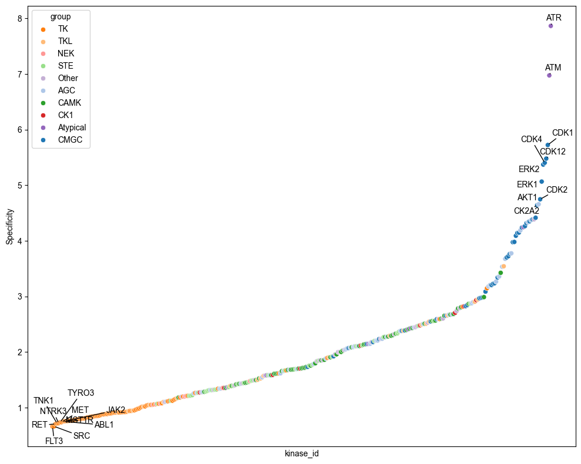
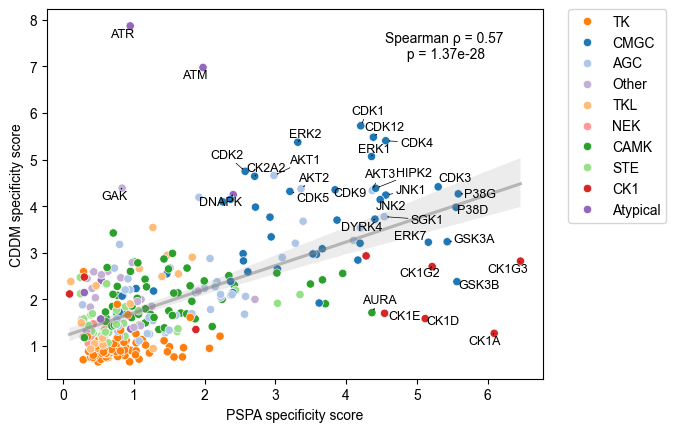

# Specificity comparison


<!-- WARNING: THIS FILE WAS AUTOGENERATED! DO NOT EDIT! -->

``` python
import pandas as pd
from katlas.data import *
from katlas.plot import *
```

``` python
pssms= pd.read_parquet('out/CDDM_pssms.parquet')
```

``` python
pssms.index = pssms.index.str.split('_').str[1]
```

``` python
spec = pssms.apply(get_specificity_flat , axis=1)
```

``` python
spec
```

    index
    SRC       0.663547
    EPHA3     0.911340
    FES       0.766754
    NTRK3     0.720888
    ALK       0.795550
                ...   
    SMMLCK    2.784532
    ROR1      2.815438
    BRAF      2.292233
    GAK       4.387741
    MAST2     2.504381
    Length: 329, dtype: float64

``` python
info = Data.get_kinase_info()

info = info[info.pseudo=='0'].copy()

hue_group = info.set_index('kinase')['modi_group']
```

``` python
df = pd.DataFrame(spec,columns=['specificity_cddm'])
```

``` python
df['group'] = df.index.map(hue_group)
```

``` python
df=df.reset_index(names='kinase_id')
```

``` python
df
```

<div>
<style scoped>
    .dataframe tbody tr th:only-of-type {
        vertical-align: middle;
    }
&#10;    .dataframe tbody tr th {
        vertical-align: top;
    }
&#10;    .dataframe thead th {
        text-align: right;
    }
</style>

<table class="dataframe" data-quarto-postprocess="true" data-border="1">
<thead>
<tr style="text-align: right;">
<th data-quarto-table-cell-role="th"></th>
<th data-quarto-table-cell-role="th">kinase_id</th>
<th data-quarto-table-cell-role="th">specificity_cddm</th>
<th data-quarto-table-cell-role="th">group</th>
</tr>
</thead>
<tbody>
<tr>
<td data-quarto-table-cell-role="th">0</td>
<td>SRC</td>
<td>0.663547</td>
<td>TK</td>
</tr>
<tr>
<td data-quarto-table-cell-role="th">1</td>
<td>EPHA3</td>
<td>0.911340</td>
<td>TK</td>
</tr>
<tr>
<td data-quarto-table-cell-role="th">2</td>
<td>FES</td>
<td>0.766754</td>
<td>TK</td>
</tr>
<tr>
<td data-quarto-table-cell-role="th">3</td>
<td>NTRK3</td>
<td>0.720888</td>
<td>TK</td>
</tr>
<tr>
<td data-quarto-table-cell-role="th">4</td>
<td>ALK</td>
<td>0.795550</td>
<td>TK</td>
</tr>
<tr>
<td data-quarto-table-cell-role="th">...</td>
<td>...</td>
<td>...</td>
<td>...</td>
</tr>
<tr>
<td data-quarto-table-cell-role="th">324</td>
<td>SMMLCK</td>
<td>2.784532</td>
<td>CAMK</td>
</tr>
<tr>
<td data-quarto-table-cell-role="th">325</td>
<td>ROR1</td>
<td>2.815438</td>
<td>TK</td>
</tr>
<tr>
<td data-quarto-table-cell-role="th">326</td>
<td>BRAF</td>
<td>2.292233</td>
<td>TKL</td>
</tr>
<tr>
<td data-quarto-table-cell-role="th">327</td>
<td>GAK</td>
<td>4.387741</td>
<td>Other</td>
</tr>
<tr>
<td data-quarto-table-cell-role="th">328</td>
<td>MAST2</td>
<td>2.504381</td>
<td>AGC</td>
</tr>
</tbody>
</table>

<p>329 rows × 3 columns</p>
</div>

``` python
plot_bar(df,value='specificity_cddm',group='group',palette=group_color,figsize=(10,5))
save_svg('fig/cddm_specificity.svg')
```


``` python
# plot_rank(df.sort_values('specificity_cddm'),x='kinase_id',y='specificity_cddm',hue='group',palette=group_color)
```



## PSPA

``` python
pspa = Data.get_pspa_all_scale()
```

``` python
spec = pspa.apply(get_specificity_flat , axis=1)
```

``` python
df2 = pd.DataFrame(spec,columns=['specificity_pspa'])
```

``` python
df2['group'] = df2.index.map(hue_group)
```

``` python
df2 = df2.reset_index(names=['kinase_id'])
```

``` python
df2
```

<div>
<style scoped>
    .dataframe tbody tr th:only-of-type {
        vertical-align: middle;
    }
&#10;    .dataframe tbody tr th {
        vertical-align: top;
    }
&#10;    .dataframe thead th {
        text-align: right;
    }
</style>

<table class="dataframe" data-quarto-postprocess="true" data-border="1">
<thead>
<tr style="text-align: right;">
<th data-quarto-table-cell-role="th"></th>
<th data-quarto-table-cell-role="th">kinase_id</th>
<th data-quarto-table-cell-role="th">specificity_pspa</th>
<th data-quarto-table-cell-role="th">group</th>
</tr>
</thead>
<tbody>
<tr>
<td data-quarto-table-cell-role="th">0</td>
<td>AAK1</td>
<td>4.776913</td>
<td>Other</td>
</tr>
<tr>
<td data-quarto-table-cell-role="th">1</td>
<td>ACVR2A</td>
<td>1.398751</td>
<td>TKL</td>
</tr>
<tr>
<td data-quarto-table-cell-role="th">2</td>
<td>ACVR2B</td>
<td>1.213098</td>
<td>TKL</td>
</tr>
<tr>
<td data-quarto-table-cell-role="th">3</td>
<td>AKT1</td>
<td>2.981665</td>
<td>AGC</td>
</tr>
<tr>
<td data-quarto-table-cell-role="th">4</td>
<td>AKT2</td>
<td>3.363335</td>
<td>AGC</td>
</tr>
<tr>
<td data-quarto-table-cell-role="th">...</td>
<td>...</td>
<td>...</td>
<td>...</td>
</tr>
<tr>
<td data-quarto-table-cell-role="th">391</td>
<td>KDR</td>
<td>0.752196</td>
<td>TK</td>
</tr>
<tr>
<td data-quarto-table-cell-role="th">392</td>
<td>FLT4</td>
<td>0.755710</td>
<td>TK</td>
</tr>
<tr>
<td data-quarto-table-cell-role="th">393</td>
<td>WEE1_TYR</td>
<td>0.887054</td>
<td>NaN</td>
</tr>
<tr>
<td data-quarto-table-cell-role="th">394</td>
<td>YES1</td>
<td>0.507455</td>
<td>TK</td>
</tr>
<tr>
<td data-quarto-table-cell-role="th">395</td>
<td>ZAP70</td>
<td>2.218516</td>
<td>TK</td>
</tr>
</tbody>
</table>

<p>396 rows × 3 columns</p>
</div>

``` python
plot_bar(df2,value='specificity_pspa',group='group',palette=group_color,figsize=(10,5))
save_svg('fig/pspa_specificity.svg')
```


## Combine

``` python
df_comb = df.merge(df2,on='kinase_id')
```

``` python
df_comb['group'] = df_comb.kinase_id.map(hue_group)
```

``` python
df_comb
```

<div>
<style scoped>
    .dataframe tbody tr th:only-of-type {
        vertical-align: middle;
    }
&#10;    .dataframe tbody tr th {
        vertical-align: top;
    }
&#10;    .dataframe thead th {
        text-align: right;
    }
</style>

<table class="dataframe" data-quarto-postprocess="true" data-border="1">
<thead>
<tr style="text-align: right;">
<th data-quarto-table-cell-role="th"></th>
<th data-quarto-table-cell-role="th">kinase_id</th>
<th data-quarto-table-cell-role="th">specificity_cddm</th>
<th data-quarto-table-cell-role="th">group_x</th>
<th data-quarto-table-cell-role="th">specificity_pspa</th>
<th data-quarto-table-cell-role="th">group_y</th>
<th data-quarto-table-cell-role="th">group</th>
</tr>
</thead>
<tbody>
<tr>
<td data-quarto-table-cell-role="th">0</td>
<td>SRC</td>
<td>0.663547</td>
<td>TK</td>
<td>0.942494</td>
<td>TK</td>
<td>TK</td>
</tr>
<tr>
<td data-quarto-table-cell-role="th">1</td>
<td>EPHA3</td>
<td>0.911340</td>
<td>TK</td>
<td>0.952877</td>
<td>TK</td>
<td>TK</td>
</tr>
<tr>
<td data-quarto-table-cell-role="th">2</td>
<td>FES</td>
<td>0.766754</td>
<td>TK</td>
<td>1.569350</td>
<td>TK</td>
<td>TK</td>
</tr>
<tr>
<td data-quarto-table-cell-role="th">3</td>
<td>NTRK3</td>
<td>0.720888</td>
<td>TK</td>
<td>1.074483</td>
<td>TK</td>
<td>TK</td>
</tr>
<tr>
<td data-quarto-table-cell-role="th">4</td>
<td>ALK</td>
<td>0.795550</td>
<td>TK</td>
<td>0.875102</td>
<td>TK</td>
<td>TK</td>
</tr>
<tr>
<td data-quarto-table-cell-role="th">...</td>
<td>...</td>
<td>...</td>
<td>...</td>
<td>...</td>
<td>...</td>
<td>...</td>
</tr>
<tr>
<td data-quarto-table-cell-role="th">307</td>
<td>CDC7</td>
<td>2.791146</td>
<td>Other</td>
<td>0.978796</td>
<td>Other</td>
<td>Other</td>
</tr>
<tr>
<td data-quarto-table-cell-role="th">308</td>
<td>CDK12</td>
<td>5.479276</td>
<td>CMGC</td>
<td>4.386190</td>
<td>CMGC</td>
<td>CMGC</td>
</tr>
<tr>
<td data-quarto-table-cell-role="th">309</td>
<td>SMMLCK</td>
<td>2.784532</td>
<td>CAMK</td>
<td>1.057586</td>
<td>CAMK</td>
<td>CAMK</td>
</tr>
<tr>
<td data-quarto-table-cell-role="th">310</td>
<td>BRAF</td>
<td>2.292233</td>
<td>TKL</td>
<td>0.467151</td>
<td>TKL</td>
<td>TKL</td>
</tr>
<tr>
<td data-quarto-table-cell-role="th">311</td>
<td>GAK</td>
<td>4.387741</td>
<td>Other</td>
<td>0.835448</td>
<td>Other</td>
<td>Other</td>
</tr>
</tbody>
</table>

<p>312 rows × 6 columns</p>
</div>

``` python
df_comb=df_comb.set_index('kinase_id')
```

``` python
idx1 = df_comb.specificity_cddm.sort_values(ascending=False).head(20).index
```

``` python
idx2 = df_comb.specificity_pspa.sort_values(ascending=False).head(20).index
```

``` python
idxs = set(idx1)|set(idx2)
```

``` python
plot_corr(df_comb, 
          y='specificity_cddm', 
          x='specificity_pspa',
         index_list = idxs,
          text_location=(0.8,0.9),
          hue='group',
          palette=group_color,
         )
plt.xlabel('PSPA specificity score')
plt.ylabel('CDDM specificity score')
save_svg('fig/specificity.svg')
```


