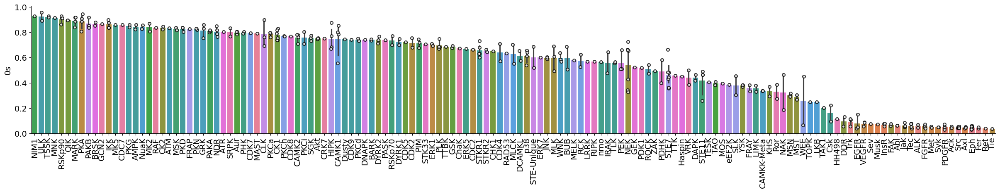
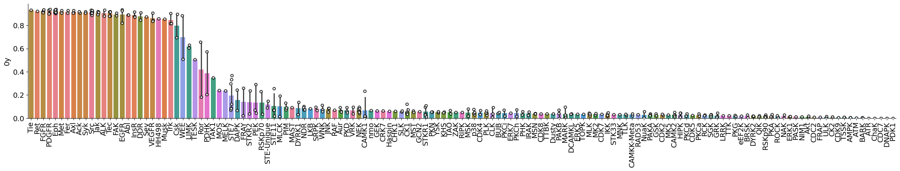

# STY composition


<!-- WARNING: THIS FILE WAS AUTOGENERATED! DO NOT EDIT! -->

``` python
from katlas.core import *
import pandas as pd
```

``` python
ref = pd.read_parquet('out/CDDM_pssms_LO_eval.parquet')
```

``` python
ref2 =preprocess_ref(ref)
```

``` python
info = Data.get_kinase_info().sort_values('kinase').drop_duplicates('uniprot')
```

``` python
info['kinase_id'] = info['uniprot']+'_' + info['gene']
```

``` python
# some are not in the kinome info
ref2[~ref2.index.isin(info.kinase_id)]
```

<div>
<style scoped>
    .dataframe tbody tr th:only-of-type {
        vertical-align: middle;
    }
&#10;    .dataframe tbody tr th {
        vertical-align: top;
    }
&#10;    .dataframe thead th {
        text-align: right;
    }
</style>

<table class="dataframe" data-quarto-postprocess="true" data-border="1">
<thead>
<tr style="text-align: right;">
<th data-quarto-table-cell-role="th"></th>
<th data-quarto-table-cell-role="th">-20A</th>
<th data-quarto-table-cell-role="th">-20C</th>
<th data-quarto-table-cell-role="th">-20D</th>
<th data-quarto-table-cell-role="th">-20E</th>
<th data-quarto-table-cell-role="th">-20F</th>
<th data-quarto-table-cell-role="th">-20G</th>
<th data-quarto-table-cell-role="th">-20H</th>
<th data-quarto-table-cell-role="th">-20I</th>
<th data-quarto-table-cell-role="th">-20K</th>
<th data-quarto-table-cell-role="th">-20L</th>
<th data-quarto-table-cell-role="th">...</th>
<th data-quarto-table-cell-role="th">20Q</th>
<th data-quarto-table-cell-role="th">20R</th>
<th data-quarto-table-cell-role="th">20S</th>
<th data-quarto-table-cell-role="th">20T</th>
<th data-quarto-table-cell-role="th">20V</th>
<th data-quarto-table-cell-role="th">20W</th>
<th data-quarto-table-cell-role="th">20Y</th>
<th data-quarto-table-cell-role="th">20s</th>
<th data-quarto-table-cell-role="th">20t</th>
<th data-quarto-table-cell-role="th">20y</th>
</tr>
<tr>
<th data-quarto-table-cell-role="th">index</th>
<th data-quarto-table-cell-role="th"></th>
<th data-quarto-table-cell-role="th"></th>
<th data-quarto-table-cell-role="th"></th>
<th data-quarto-table-cell-role="th"></th>
<th data-quarto-table-cell-role="th"></th>
<th data-quarto-table-cell-role="th"></th>
<th data-quarto-table-cell-role="th"></th>
<th data-quarto-table-cell-role="th"></th>
<th data-quarto-table-cell-role="th"></th>
<th data-quarto-table-cell-role="th"></th>
<th data-quarto-table-cell-role="th"></th>
<th data-quarto-table-cell-role="th"></th>
<th data-quarto-table-cell-role="th"></th>
<th data-quarto-table-cell-role="th"></th>
<th data-quarto-table-cell-role="th"></th>
<th data-quarto-table-cell-role="th"></th>
<th data-quarto-table-cell-role="th"></th>
<th data-quarto-table-cell-role="th"></th>
<th data-quarto-table-cell-role="th"></th>
<th data-quarto-table-cell-role="th"></th>
<th data-quarto-table-cell-role="th"></th>
</tr>
</thead>
<tbody>
<tr>
<td data-quarto-table-cell-role="th">P07948-2_LYN</td>
<td>-0.201025</td>
<td>-0.563368</td>
<td>-0.074525</td>
<td>-0.276853</td>
<td>0.451878</td>
<td>0.212021</td>
<td>-0.306423</td>
<td>0.321053</td>
<td>0.383523</td>
<td>-0.119475</td>
<td>...</td>
<td>-0.457078</td>
<td>-0.198480</td>
<td>-0.486640</td>
<td>0.043253</td>
<td>-0.611027</td>
<td>0.248941</td>
<td>-0.522681</td>
<td>-0.603284</td>
<td>-0.501659</td>
<td>0.703503</td>
</tr>
<tr>
<td data-quarto-table-cell-role="th">P05771-2_PRKCB</td>
<td>-0.378789</td>
<td>-0.105544</td>
<td>-0.414208</td>
<td>-0.766561</td>
<td>0.469130</td>
<td>-0.148789</td>
<td>1.248263</td>
<td>1.264304</td>
<td>-1.293812</td>
<td>-0.955833</td>
<td>...</td>
<td>-1.575331</td>
<td>-0.418613</td>
<td>-0.064964</td>
<td>0.312925</td>
<td>0.395611</td>
<td>0.787799</td>
<td>-1.955805</td>
<td>0.418784</td>
<td>-0.654678</td>
<td>0.035912</td>
</tr>
<tr>
<td data-quarto-table-cell-role="th">Q13976-2_PRKG1</td>
<td>0.377940</td>
<td>-20.551687</td>
<td>0.272132</td>
<td>0.693775</td>
<td>-1.166458</td>
<td>-0.992964</td>
<td>-0.676831</td>
<td>-0.271748</td>
<td>-0.022510</td>
<td>-0.591422</td>
<td>...</td>
<td>0.315217</td>
<td>0.056898</td>
<td>0.258544</td>
<td>-0.059560</td>
<td>-0.228413</td>
<td>0.678348</td>
<td>-1.480295</td>
<td>0.379722</td>
<td>-1.179166</td>
<td>1.511422</td>
</tr>
<tr>
<td data-quarto-table-cell-role="th">Q9NRA0_SPHK2</td>
<td>1.165531</td>
<td>-20.551687</td>
<td>-0.220384</td>
<td>0.123256</td>
<td>-1.658974</td>
<td>-0.807408</td>
<td>1.830652</td>
<td>0.498770</td>
<td>-0.836954</td>
<td>-0.083938</td>
<td>...</td>
<td>-1.138814</td>
<td>0.240296</td>
<td>-0.365413</td>
<td>0.749442</td>
<td>0.317555</td>
<td>0.224317</td>
<td>-0.934327</td>
<td>0.118335</td>
<td>-0.633198</td>
<td>0.057392</td>
</tr>
<tr>
<td data-quarto-table-cell-role="th">P48736_PIK3CG</td>
<td>0.428566</td>
<td>-20.551687</td>
<td>0.000830</td>
<td>0.666398</td>
<td>-1.115832</td>
<td>0.057662</td>
<td>-0.626205</td>
<td>-0.543050</td>
<td>0.513543</td>
<td>-22.986938</td>
<td>...</td>
<td>1.268002</td>
<td>-22.498627</td>
<td>0.555977</td>
<td>-21.767089</td>
<td>0.694625</td>
<td>-19.707253</td>
<td>0.665134</td>
<td>-1.282202</td>
<td>-0.033737</td>
<td>-19.874178</td>
</tr>
</tbody>
</table>

<p>5 rows × 943 columns</p>
</div>

``` python
hue = hue.merge(info,left_on='index',right_on='uniprot')
```

``` python
hue.set_index('kinase_id')['group']
```

    kinase_id
    P12931_SRC         TK
    P29320_EPHA3       TK
    P07332_FES         TK
    Q16288_NTRK3       TK
    Q9UM73_ALK         TK
                    ...  
    Q15746_MYLK      CAMK
    Q01973_ROR1        TK
    O14976_GAK      Other
    P15056_BRAF       TKL
    Q6P0Q8_MAST2      AGC
    Name: group, Length: 330, dtype: object

``` python
ref2
```

<div>
<style scoped>
    .dataframe tbody tr th:only-of-type {
        vertical-align: middle;
    }
&#10;    .dataframe tbody tr th {
        vertical-align: top;
    }
&#10;    .dataframe thead th {
        text-align: right;
    }
</style>

<table class="dataframe" data-quarto-postprocess="true" data-border="1">
<thead>
<tr style="text-align: right;">
<th data-quarto-table-cell-role="th"></th>
<th data-quarto-table-cell-role="th">-20A</th>
<th data-quarto-table-cell-role="th">-20C</th>
<th data-quarto-table-cell-role="th">-20D</th>
<th data-quarto-table-cell-role="th">-20E</th>
<th data-quarto-table-cell-role="th">-20F</th>
<th data-quarto-table-cell-role="th">-20G</th>
<th data-quarto-table-cell-role="th">-20H</th>
<th data-quarto-table-cell-role="th">-20I</th>
<th data-quarto-table-cell-role="th">-20K</th>
<th data-quarto-table-cell-role="th">-20L</th>
<th data-quarto-table-cell-role="th">...</th>
<th data-quarto-table-cell-role="th">20Q</th>
<th data-quarto-table-cell-role="th">20R</th>
<th data-quarto-table-cell-role="th">20S</th>
<th data-quarto-table-cell-role="th">20T</th>
<th data-quarto-table-cell-role="th">20V</th>
<th data-quarto-table-cell-role="th">20W</th>
<th data-quarto-table-cell-role="th">20Y</th>
<th data-quarto-table-cell-role="th">20s</th>
<th data-quarto-table-cell-role="th">20t</th>
<th data-quarto-table-cell-role="th">20y</th>
</tr>
<tr>
<th data-quarto-table-cell-role="th">index</th>
<th data-quarto-table-cell-role="th"></th>
<th data-quarto-table-cell-role="th"></th>
<th data-quarto-table-cell-role="th"></th>
<th data-quarto-table-cell-role="th"></th>
<th data-quarto-table-cell-role="th"></th>
<th data-quarto-table-cell-role="th"></th>
<th data-quarto-table-cell-role="th"></th>
<th data-quarto-table-cell-role="th"></th>
<th data-quarto-table-cell-role="th"></th>
<th data-quarto-table-cell-role="th"></th>
<th data-quarto-table-cell-role="th"></th>
<th data-quarto-table-cell-role="th"></th>
<th data-quarto-table-cell-role="th"></th>
<th data-quarto-table-cell-role="th"></th>
<th data-quarto-table-cell-role="th"></th>
<th data-quarto-table-cell-role="th"></th>
<th data-quarto-table-cell-role="th"></th>
<th data-quarto-table-cell-role="th"></th>
<th data-quarto-table-cell-role="th"></th>
<th data-quarto-table-cell-role="th"></th>
<th data-quarto-table-cell-role="th"></th>
</tr>
</thead>
<tbody>
<tr>
<td data-quarto-table-cell-role="th">P12931_SRC</td>
<td>-0.303165</td>
<td>-0.374748</td>
<td>0.053554</td>
<td>-0.168660</td>
<td>0.079632</td>
<td>0.214991</td>
<td>-0.291338</td>
<td>0.351244</td>
<td>0.244339</td>
<td>0.005575</td>
<td>...</td>
<td>-0.228598</td>
<td>0.025968</td>
<td>-0.328084</td>
<td>0.112171</td>
<td>-0.368079</td>
<td>-0.025931</td>
<td>-0.102114</td>
<td>-0.546950</td>
<td>0.073484</td>
<td>1.274269</td>
</tr>
<tr>
<td data-quarto-table-cell-role="th">P29320_EPHA3</td>
<td>-0.184360</td>
<td>-0.772408</td>
<td>0.041784</td>
<td>-0.335815</td>
<td>0.038333</td>
<td>0.361651</td>
<td>-0.112498</td>
<td>0.240746</td>
<td>0.271984</td>
<td>-0.137271</td>
<td>...</td>
<td>-0.387529</td>
<td>-0.047099</td>
<td>-0.814426</td>
<td>-0.006232</td>
<td>-0.171474</td>
<td>-0.194322</td>
<td>-0.031039</td>
<td>-0.527715</td>
<td>-0.113239</td>
<td>0.754229</td>
</tr>
<tr>
<td data-quarto-table-cell-role="th">P07332_FES</td>
<td>-0.047304</td>
<td>-0.668876</td>
<td>0.095709</td>
<td>-0.338939</td>
<td>0.048756</td>
<td>0.238490</td>
<td>-0.102075</td>
<td>0.353049</td>
<td>0.371674</td>
<td>0.065796</td>
<td>...</td>
<td>-0.164643</td>
<td>-0.071350</td>
<td>-0.644998</td>
<td>0.017345</td>
<td>-0.382362</td>
<td>-0.170745</td>
<td>-0.106998</td>
<td>-0.402258</td>
<td>-0.220906</td>
<td>1.121760</td>
</tr>
<tr>
<td data-quarto-table-cell-role="th">Q16288_NTRK3</td>
<td>0.004691</td>
<td>0.150181</td>
<td>-0.006480</td>
<td>-0.157199</td>
<td>0.057431</td>
<td>0.143462</td>
<td>-0.424928</td>
<td>0.496946</td>
<td>0.519908</td>
<td>-0.051274</td>
<td>...</td>
<td>-0.577591</td>
<td>-0.125417</td>
<td>-0.978218</td>
<td>-0.241875</td>
<td>-0.606648</td>
<td>-0.214459</td>
<td>-0.247573</td>
<td>-0.779873</td>
<td>-0.071975</td>
<td>0.803039</td>
</tr>
<tr>
<td data-quarto-table-cell-role="th">Q9UM73_ALK</td>
<td>-0.027114</td>
<td>0.139216</td>
<td>-0.115000</td>
<td>-0.300995</td>
<td>0.428488</td>
<td>0.150419</td>
<td>-0.326997</td>
<td>0.286672</td>
<td>0.400256</td>
<td>-0.126111</td>
<td>...</td>
<td>-0.431957</td>
<td>0.125002</td>
<td>-0.813833</td>
<td>-0.317107</td>
<td>-0.515009</td>
<td>-0.224103</td>
<td>-0.198324</td>
<td>-0.467588</td>
<td>-0.148733</td>
<td>0.849979</td>
</tr>
<tr>
<td data-quarto-table-cell-role="th">...</td>
<td>...</td>
<td>...</td>
<td>...</td>
<td>...</td>
<td>...</td>
<td>...</td>
<td>...</td>
<td>...</td>
<td>...</td>
<td>...</td>
<td>...</td>
<td>...</td>
<td>...</td>
<td>...</td>
<td>...</td>
<td>...</td>
<td>...</td>
<td>...</td>
<td>...</td>
<td>...</td>
<td>...</td>
</tr>
<tr>
<td data-quarto-table-cell-role="th">Q15746_MYLK</td>
<td>0.247994</td>
<td>-20.551687</td>
<td>-0.957350</td>
<td>1.123256</td>
<td>2.247916</td>
<td>-0.222446</td>
<td>-21.072348</td>
<td>0.498770</td>
<td>-0.251992</td>
<td>-0.498976</td>
<td>...</td>
<td>0.147490</td>
<td>-1.280754</td>
<td>-0.079108</td>
<td>-21.767089</td>
<td>-22.421369</td>
<td>-19.707253</td>
<td>0.351976</td>
<td>0.404639</td>
<td>0.653105</td>
<td>-19.874178</td>
</tr>
<tr>
<td data-quarto-table-cell-role="th">Q01973_ROR1</td>
<td>-1.458959</td>
<td>-20.551687</td>
<td>-22.445312</td>
<td>0.416303</td>
<td>-0.196003</td>
<td>0.655563</td>
<td>-21.072348</td>
<td>-0.623221</td>
<td>-22.739954</td>
<td>-0.620966</td>
<td>...</td>
<td>-22.070383</td>
<td>-1.093127</td>
<td>2.108518</td>
<td>-21.767089</td>
<td>-1.015868</td>
<td>-19.707253</td>
<td>-20.865897</td>
<td>1.914194</td>
<td>-20.564768</td>
<td>1.531322</td>
</tr>
<tr>
<td data-quarto-table-cell-role="th">O14976_GAK</td>
<td>1.165531</td>
<td>-20.551687</td>
<td>-0.039812</td>
<td>-0.544169</td>
<td>-0.156474</td>
<td>-0.304908</td>
<td>-21.072348</td>
<td>-0.583692</td>
<td>-22.739954</td>
<td>-0.581438</td>
<td>...</td>
<td>-22.070383</td>
<td>-1.171130</td>
<td>-0.969484</td>
<td>0.560409</td>
<td>-0.093871</td>
<td>-19.707253</td>
<td>-20.865897</td>
<td>0.514264</td>
<td>0.762730</td>
<td>-19.874178</td>
</tr>
<tr>
<td data-quarto-table-cell-role="th">P15056_BRAF</td>
<td>-0.497433</td>
<td>-20.551687</td>
<td>0.882185</td>
<td>0.377829</td>
<td>-21.561975</td>
<td>-0.382911</td>
<td>0.255150</td>
<td>-21.989192</td>
<td>-1.412456</td>
<td>0.340559</td>
<td>...</td>
<td>-0.664883</td>
<td>0.491835</td>
<td>0.693481</td>
<td>1.223374</td>
<td>0.569094</td>
<td>1.698247</td>
<td>-20.865897</td>
<td>0.592266</td>
<td>-20.564768</td>
<td>-19.874178</td>
</tr>
<tr>
<td data-quarto-table-cell-role="th">Q6P0Q8_MAST2</td>
<td>0.050054</td>
<td>-20.551687</td>
<td>-0.155289</td>
<td>0.662282</td>
<td>-0.271951</td>
<td>0.579615</td>
<td>3.025030</td>
<td>-21.989192</td>
<td>-1.449931</td>
<td>-0.696915</td>
<td>...</td>
<td>-22.070383</td>
<td>2.037269</td>
<td>-0.931010</td>
<td>1.183845</td>
<td>1.751958</td>
<td>3.243681</td>
<td>-20.865897</td>
<td>-0.447262</td>
<td>-20.564768</td>
<td>-19.874178</td>
</tr>
</tbody>
</table>

<p>335 rows × 943 columns</p>
</div>

``` python
pssms=pd.read_parquet('out/CDDM_pssms.parquet')
```

``` python
pssms =preprocess_ref(pssms)
```

``` python
pssms = pssms[['0s','0t','0y']]
```

``` python
pssms_info = pssms.merge(hue,left_on='index',right_on='kinase_id')
```

``` python
pssms_info.columns
```

    Index(['0s', '0t', '0y', 'index', 'kinase', 'ID_coral', 'uniprot', 'gene',
           'modi_group', 'group', 'family', 'subfamily_coral', 'subfamily',
           'in_pspa_st', 'in_pspa_tyr', 'in_pspa', 'in_cddm', 'kd_ID',
           'active_D1_D2', 'active_kd_ID', 'pspa_ID', 'pseudo',
           'pspa_category_small', 'pspa_category_big', 'cddm_big', 'cddm_small',
           'length', 'human_uniprot_sequence', 'kinasecom_domain', 'nucleus',
           'cytosol', 'cytoskeleton', 'plasma membrane', 'mitochondrion',
           'Golgi apparatus', 'endoplasmic reticulum', 'vesicle', 'centrosome',
           'aggresome', 'main_location', 'kinase_id'],
          dtype='object')

``` python
plot_bar(pssms_info,'0s','subfamily',figsize=(30,4))
```



``` python
plot_bar(pssms_info,'0y','subfamily',figsize=(30,4))
```



``` python
plot_bar(pssms_info,'0t','subfamily',figsize=(30,4))
```


